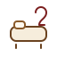

# 🛡️ Aventuria Projekt-Backup - 4/23/2026, 4:38:07 PM

## 📄 Datei: css/app-layout.css
```css
.top-bar {
    display: flex;
    justify-content: center;
    align-items: center;
    gap: var(--space-4xl);
    margin-bottom: var(--space-2xl);
    flex-wrap: wrap;
}

.top-bar--compact {
    margin-bottom: 0;
}

.button-group {
    display: flex;
    gap: var(--space-md);
    flex-wrap: wrap;
}

.button-group--center {
    justify-content: center;
}

.button-group--mt-lg {
    margin-top: var(--space-2xl);
}

.button-group--mb-lg {
    margin-bottom: var(--space-2xl);
}

.config-item {
    display: flex;
    align-items: center;
    gap: var(--space-md);
}

.section-spacer-top {
    margin-top: var(--space-4xl);
}

/* --- KARTEN-LISTEN & GRID --- */
.grid-container {
    display: grid;
    grid-template-columns: repeat(auto-fit, minmax(320px, 1fr));
    gap: var(--space-3xl);
    margin-top: var(--space-2xl);
}

.card-list {
    background: rgba(244, 231, 211, 0.9);
    padding: var(--space-2xl);
    border: var(--border-thin) solid var(--color-secondary-soft);
    border-radius: var(--radius-lg);
    box-shadow: var(--shadow-lg);
}

.card-list h3 {
    margin-top: 0;
    font-variant: small-caps;
    border-bottom: var(--border-thin) solid var(--color-secondary-soft);
    padding-bottom: var(--space-sm);
}

#blue-cards h3 {
    color: var(--color-info);
    border-bottom-color: var(--color-info);
}

#special h3 {
    color: var(--color-success);
    border-bottom-color: var(--color-success);
}

.card-list ul {
    list-style: none;
    padding: 0;
    margin: 0;
}

.card-list li {
    margin-bottom: var(--space-lg);
}

/* --- CHECKLISTE / SETUP-LISTEN --- */
.checklist-item {
    display: flex;
    align-items: flex-start;
    gap: var(--space-lg);
    padding: var(--space-sm) 0;
    line-height: 1.4;
    transition: transform 0.2s ease;
}

.checklist-item:hover {
    transform: translateX(5px);
}

.checklist-item input[type="checkbox"] {
    width: 18px;
    height: 18px;
    margin-top: 2px;
    cursor: pointer;
    accent-color: var(--color-primary);
    flex-shrink: 0;
}

.checklist-item span {
    display: block;
    min-width: 0;
    word-break: break-word;
    flex: 1;
}

.checklist-item input:checked + span {
    text-decoration: line-through var(--color-primary) 2px;
    color: var(--color-muted);
    opacity: 0.6;
}

.has-preview {
    color: var(--color-primary);
    cursor: help;
    font-weight: 500;
}

/* --- DANGER / HINWEISE --- */
#danger-value {
    font-size: 1.15em;
    color: var(--color-primary);
    margin-bottom: var(--space-xl);
    padding: var(--space-md);
    background: var(--color-primary-fade);
    border-radius: var(--radius-sm);
}

hr {
    border: 0;
    border-top: var(--border-thin) solid var(--color-secondary-soft);
    margin: var(--space-2xl) 0;
}

/* --- RESPONSIVE --- */
@media (max-width: 900px) {
    .grid-container {
        grid-template-columns: 1fr;
    }
}

@media (max-width: 700px) {
    .top-bar {
        gap: 16px;
    }

    .button-group {
        width: 100%;
        justify-content: center;
    }

    .config-item {
        flex-wrap: wrap;
        justify-content: center;
    }

    .card-list {
        padding: 16px;
    }

    .checklist-item {
        gap: var(--space-md);
        padding: var(--space-md) 0;
    }
}

```

---

## 📄 Datei: css/archive-cards.css
```css
.archive-card {
    display: flex;
    flex-direction: column;
    gap: var(--space-md);
    min-height: 100%;
    padding: var(--space-lg);
    border: var(--border-thin) solid var(--color-border-soft-card);
    border-radius: var(--radius-lg);
    background: var(--color-bg-soft-strong);
    box-shadow: var(--shadow-sm);
    text-align: left;
    transition: transform 0.18s ease, box-shadow 0.18s ease;
}

.archive-card:hover {
    transform: translateY(-3px);
    box-shadow: var(--shadow-card);
}

.archive-card__header {
    display: flex;
    flex-direction: column;
    gap: 10px;
}

.archive-card__title {
    margin: 0;
    color: var(--color-primary);
    font-size: 1.45rem;
    line-height: 1.12;
    word-break: break-word;
    display: -webkit-box;
    -webkit-box-orient: vertical;
    -webkit-line-clamp: 2;
    overflow: hidden;
}

.archive-card__badges {
    display: flex;
    flex-wrap: wrap;
    gap: 8px;
}

.archive-badge {
    display: inline-flex;
    align-items: center;
    min-height: 30px;
    padding: 0 12px;
    border-radius: 999px;
    font-size: 0.82rem;
    font-weight: bold;
    line-height: 1;
    white-space: nowrap;
}

.archive-badge--type {
    background: var(--color-primary);
    color: var(--color-white);
}

.archive-badge--set {
    background: var(--color-bg-soft);
    color: var(--color-secondary);
    border: var(--border-thin) solid var(--color-border-soft-card);
}

.archive-card__subtitle {
    color: var(--color-text);
    font-size: 1rem;
    line-height: 1.25;
}

.archive-card__body {
    display: flex;
    flex-direction: column;
    gap: var(--space-md);
    min-height: 0;
}

.archive-card__stats {
    display: grid;
    grid-template-columns: repeat(4, minmax(0, 1fr));
    gap: var(--space-sm);
}

.archive-card__stat {
    display: flex;
    flex-direction: column;
    justify-content: center;
    align-items: center;
    gap: 4px;
    min-height: 68px;
    padding: 10px;
    border: var(--border-thin) solid var(--color-border-soft-card);
    border-radius: var(--radius-md);
    background: var(--color-bg-soft);
}

.archive-card__stat-label {
    color: var(--color-secondary);
    font-size: 0.82rem;
    font-weight: bold;
}

.archive-card__stat-value {
    color: var(--color-primary);
    font-size: 1.15rem;
    font-weight: bold;
    line-height: 1.1;
}

.archive-card__tags {
    display: flex;
    flex-wrap: wrap;
    gap: 8px;
}

.archive-tag {
    display: inline-flex;
    align-items: center;
    min-height: 28px;
    padding: 0 10px;
    border-radius: 999px;
    background: var(--color-bg-soft);
    border: var(--border-thin) solid var(--color-border-soft-card);
    color: var(--color-text);
    font-size: 0.82rem;
    line-height: 1;
}

.archive-card__actions-preview {
    padding: var(--space-md);
    border: var(--border-thin) solid var(--color-border-soft-card);
    border-radius: var(--radius-md);
    background: var(--color-bg-soft);
}

.archive-card__actions-title {
    margin-bottom: 8px;
    color: var(--color-primary);
    font-weight: bold;
    font-size: 1.02rem;
}

.archive-card__actions-list {
    display: flex;
    flex-direction: column;
    gap: 10px;
    margin: 0;
    padding: 0;
    list-style: none;
    color: var(--color-text);
}

.archive-card__action-item {
    display: flex;
    align-items: center;
    gap: 10px;
    line-height: 1.3;
}

.archive-card__action-range {
    display: inline-flex;
    align-items: center;
    justify-content: center;
    min-width: 54px;
    min-height: 28px;
    padding: 0 10px;
    border-radius: 999px;
    background: var(--color-primary);
    color: var(--color-white);
    font-size: 0.82rem;
    font-weight: bold;
    line-height: 1;
    white-space: nowrap;
    flex-shrink: 0;
}

.archive-card__action-main {
    display: flex;
    flex-wrap: wrap;
    align-items: center;
    gap: 8px;
    min-width: 0;
}

.archive-card__action-type {
    display: inline-flex;
    align-items: center;
    min-height: 26px;
    padding: 0 10px;
    border-radius: 999px;
    background: rgba(139, 69, 19, 0.08);
    border: 1px solid var(--color-border-soft-card);
    color: var(--color-secondary);
    font-size: 0.8rem;
    font-weight: bold;
    line-height: 1;
    white-space: nowrap;
}

.archive-card__action-name {
    color: var(--color-text);
    font-weight: 700;
    font-size: 1rem;
    line-height: 1.25;
    word-break: break-word;
}

.archive-card__footer {
    display: flex;
    justify-content: flex-end;
    margin-top: auto;
}

.archive-card__details-btn {
    appearance: none;
    border: 0;
    border-radius: var(--radius-md);
    padding: 12px 18px;
    background: var(--color-secondary);
    color: var(--color-white);
    cursor: pointer;
    font: inherit;
    font-weight: bold;
    transition: background 0.18s ease, transform 0.18s ease;
}

.archive-card__details-btn:hover {
    background: var(--color-secondary-soft);
    transform: translateY(-1px);
}

.archive-card__details-btn:focus-visible {
    outline: 2px solid var(--color-primary);
    outline-offset: 2px;
}

@media (max-width: 900px) {
    .archive-card {
        padding: var(--space-md);
    }
}

@media (max-width: 700px) {
    .archive-card__stats {
        grid-template-columns: repeat(2, minmax(0, 1fr));
    }
}

@media (max-width: 480px) {
    .archive-card__title {
        font-size: 1.25rem;
    }

    .archive-card__action-item {
        align-items: flex-start;
    }

    .archive-card__action-main {
        flex-direction: column;
        align-items: flex-start;
        gap: 6px;
    }
}

```

---

## 📄 Datei: css/archive-home.css
```css
.archive-home {
    display: flex;
    flex-direction: column;
    gap: var(--space-lg);
    padding: var(--space-md) 0;
}

.archive-home__hero,
.archive-home__section {
    padding: var(--space-lg);
    border: var(--border-thin) solid var(--color-border-soft-card);
    border-radius: var(--radius-lg);
    background: var(--color-bg-soft-strong);
    box-shadow: var(--shadow-sm);
}

.archive-home__section--hint {
    background: var(--color-bg-soft);
}

.archive-home__hero {
    display: flex;
    flex-direction: column;
    gap: var(--space-lg);
}

.archive-home__hero-text {
    display: flex;
    flex-direction: column;
    gap: 8px;
}

.archive-home__title {
    margin: 0;
    color: var(--color-primary);
    font-size: 1.5rem;
}

.archive-home__lead,
.archive-home__section-text,
.archive-home__hint {
    margin: 0;
    color: var(--color-text);
    line-height: 1.5;
}

.archive-home__meta {
    display: grid;
    grid-template-columns: repeat(auto-fit, minmax(180px, 1fr));
    gap: var(--space-md);
}

.archive-home__meta-box {
    padding: var(--space-md);
    border: var(--border-thin) solid var(--color-border-soft-card);
    border-radius: var(--radius-md);
    background: var(--color-bg-soft);
}

.archive-home__meta-label {
    color: var(--color-secondary);
    font-size: 0.85rem;
    font-weight: bold;
    margin-bottom: 6px;
}

.archive-home__meta-value {
    color: var(--color-primary);
    font-size: 1.1rem;
    font-weight: bold;
}

.archive-home__section-head {
    display: flex;
    flex-direction: column;
    gap: 6px;
    margin-bottom: var(--space-md);
}

.archive-home__section-title {
    margin: 0;
    color: var(--color-primary);
    font-size: 1.2rem;
}

.archive-home__card-grid {
    display: grid;
    grid-template-columns: repeat(auto-fit, minmax(220px, 1fr));
    gap: var(--space-md);
}

.archive-home-card {
    appearance: none;
    display: flex;
    flex-direction: column;
    gap: 8px;
    width: 100%;
    min-height: 140px;
    padding: var(--space-md);
    border: var(--border-thin) solid var(--color-border-soft-card);
    border-radius: var(--radius-md);
    background: var(--color-bg-soft);
    color: var(--color-text);
    text-align: left;
    cursor: pointer;
    transition: transform 0.18s ease, box-shadow 0.18s ease, border-color 0.18s ease;
}

.archive-home-card:hover {
    transform: translateY(-2px);
    box-shadow: var(--shadow-card);
}

.archive-home-card--active {
    border-color: var(--color-primary);
    background: rgba(92, 30, 30, 0.06);
}

.archive-home-card__eyebrow {
    color: var(--color-secondary);
    font-size: 0.8rem;
    font-weight: bold;
    text-transform: uppercase;
    letter-spacing: 0.04em;
}

.archive-home-card__title {
    color: var(--color-primary);
    font-size: 1.05rem;
    font-weight: bold;
    line-height: 1.25;
}

.archive-home-card__text {
    color: var(--color-text);
    font-size: 0.92rem;
    line-height: 1.45;
}

.archive-home__empty {
    padding: var(--space-md);
    border: var(--border-thin) dashed var(--color-border-soft-card);
    border-radius: var(--radius-md);
    background: var(--color-bg-soft);
    color: var(--color-text);
}

@media (max-width: 700px) {
    .archive-home__hero,
    .archive-home__section {
        padding: var(--space-md);
    }

    .archive-home__card-grid {
        grid-template-columns: 1fr;
    }
}

```

---

## 📄 Datei: css/archive-layout.css
```css
.archive-header {
    display: flex;
    justify-content: space-between;
    align-items: center;
    gap: var(--space-lg);
    padding-right: var(--space-5xl);
    margin-bottom: var(--space-lg);
}

.archive-header h2 {
    margin: 0;
    color: var(--color-primary);
    flex-shrink: 0;
}

.archive-header .search-bar {
    margin-bottom: 0;
    max-width: 360px;
}

#archive-set-buttons {
    margin-bottom: var(--space-lg) !important;
}

.archive-controls {
    display: flex;
    flex-direction: column;
    gap: var(--space-md);
}

.archive-controls__block {
    display: flex;
    flex-direction: column;
    gap: var(--space-sm);
}

.archive-controls__label {
    color: var(--color-primary);
    font-weight: bold;
    font-size: 0.92rem;
}

.archive-controls__row {
    display: flex;
    flex-wrap: wrap;
    gap: var(--space-sm);
}

.archive-result-summary {
    margin: 0;
    color: var(--color-text);
    font-size: 0.95rem;
}

/* WICHTIG:
   Der Host-Container für Home + Browser darf NICHT mehr das alte Karten-Grid erzwingen.
*/
.archive-surface {
    display: block;
    width: 100%;
    padding: 0;
    min-height: 520px;
}

.hidden {
    display: none;
}

@media (max-width: 900px) {
    .archive-header {
        flex-direction: column;
        align-items: stretch;
        padding-right: 0;
    }

    .archive-header .search-bar {
        max-width: none;
    }
}

@media (max-width: 480px) {
    .archive-controls__row {
        gap: 8px;
    }
}

```

---

## 📄 Datei: css/archive.css
```css
.archive-header {
    display: flex;
    justify-content: space-between;
    align-items: center;
    gap: var(--space-lg);
    padding-right: var(--space-5xl);
    margin-bottom: var(--space-lg);
}

.archive-header h2 {
    margin: 0;
    color: var(--color-primary);
    flex-shrink: 0;
}

.archive-header .search-bar {
    margin-bottom: 0;
    max-width: 360px;
}

#archive-set-buttons {
    margin-bottom: var(--space-lg) !important;
}

.archive-controls {
    display: flex;
    flex-direction: column;
    gap: var(--space-md);
}

.archive-controls__block {
    display: flex;
    flex-direction: column;
    gap: var(--space-sm);
}

.archive-controls__label {
    color: var(--color-primary);
    font-weight: bold;
    font-size: 0.92rem;
}

.archive-controls__row {
    display: flex;
    flex-wrap: wrap;
    gap: var(--space-sm);
}

.archive-result-summary {
    margin: 0;
    color: var(--color-text);
    font-size: 0.95rem;
}

.archive-grid {
    display: grid;
    grid-template-columns: repeat(auto-fill, minmax(320px, 1fr));
    gap: var(--space-lg);
    padding: var(--space-lg) 0;
    align-items: stretch;
}

.archive-card {
    display: flex;
    flex-direction: column;
    gap: var(--space-md);
    min-height: 100%;
    padding: var(--space-lg);
    border: var(--border-thin) solid var(--color-border-soft-card);
    border-radius: var(--radius-lg);
    background: var(--color-bg-soft-strong);
    box-shadow: var(--shadow-sm);
    text-align: left;
    transition: transform 0.18s ease, box-shadow 0.18s ease;
}

.archive-card:hover {
    transform: translateY(-3px);
    box-shadow: var(--shadow-card);
}

.archive-card__header {
    display: flex;
    justify-content: space-between;
    align-items: flex-start;
    gap: var(--space-md);
}

.archive-card__title-wrap {
    min-width: 0;
}

.archive-card__title {
    margin: 0;
    color: var(--color-primary);
    font-size: 1.45rem;
    line-height: 1.15;
    word-break: break-word;
}

.archive-card__subtitle {
    margin: 6px 0 0;
    color: var(--color-text);
    font-size: 1rem;
    line-height: 1.25;
}

.archive-card__badges {
    display: flex;
    flex-wrap: wrap;
    justify-content: flex-end;
    gap: 8px;
    max-width: 48%;
}

.archive-badge {
    display: inline-flex;
    align-items: center;
    min-height: 30px;
    padding: 0 12px;
    border-radius: 999px;
    font-size: 0.82rem;
    font-weight: bold;
    line-height: 1;
    white-space: nowrap;
}

.archive-badge--type {
    background: var(--color-primary);
    color: var(--color-white);
}

.archive-badge--set {
    background: var(--color-bg-soft);
    color: var(--color-secondary);
    border: var(--border-thin) solid var(--color-border-soft-card);
}

.archive-card__body {
    display: flex;
    flex-direction: column;
    gap: var(--space-md);
    min-height: 0;
}

.archive-card__stats {
    display: grid;
    grid-template-columns: repeat(4, minmax(0, 1fr));
    gap: var(--space-sm);
}

.archive-card__stat {
    display: flex;
    flex-direction: column;
    justify-content: center;
    align-items: center;
    gap: 4px;
    min-height: 68px;
    padding: 10px;
    border: var(--border-thin) solid var(--color-border-soft-card);
    border-radius: var(--radius-md);
    background: var(--color-bg-soft);
}

.archive-card__stat-label {
    color: var(--color-secondary);
    font-size: 0.82rem;
    font-weight: bold;
}

.archive-card__stat-value {
    color: var(--color-primary);
    font-size: 1.15rem;
    font-weight: bold;
    line-height: 1.1;
}

.archive-card__tags {
    display: flex;
    flex-wrap: wrap;
    gap: 8px;
}

.archive-tag {
    display: inline-flex;
    align-items: center;
    min-height: 28px;
    padding: 0 10px;
    border-radius: 999px;
    background: var(--color-bg-soft);
    border: var(--border-thin) solid var(--color-border-soft-card);
    color: var(--color-text);
    font-size: 0.82rem;
    line-height: 1;
}

.archive-tag--muted {
    opacity: 0.85;
    font-style: italic;
}

.archive-card__actions-preview {
    padding: var(--space-md);
    border: var(--border-thin) solid var(--color-border-soft-card);
    border-radius: var(--radius-md);
    background: var(--color-bg-soft);
}

.archive-card__actions-title {
    margin-bottom: 8px;
    color: var(--color-primary);
    font-weight: bold;
    font-size: 1.02rem;
}

.archive-card__actions-list {
    margin: 0;
    padding-left: 1.2rem;
    color: var(--color-text);
}

.archive-card__action-item {
    margin-bottom: 6px;
    line-height: 1.3;
}

.archive-card__action-item:last-child {
    margin-bottom: 0;
}

.archive-card__action-item--muted {
    opacity: 0.85;
    font-style: italic;
}

.archive-card__footer {
    display: flex;
    justify-content: flex-end;
    margin-top: auto;
}

.archive-card__details-btn {
    appearance: none;
    border: 0;
    border-radius: var(--radius-md);
    padding: 12px 18px;
    background: var(--color-secondary);
    color: var(--color-white);
    cursor: pointer;
    font: inherit;
    font-weight: bold;
    transition: background 0.18s ease, transform 0.18s ease;
}

.archive-card__details-btn:hover {
    background: var(--color-secondary-soft);
    transform: translateY(-1px);
}

.archive-card__details-btn:focus-visible {
    outline: 2px solid var(--color-primary);
    outline-offset: 2px;
}

@media (max-width: 900px) {
    .archive-grid {
        grid-template-columns: repeat(auto-fill, minmax(280px, 1fr));
        gap: var(--space-md);
        padding: var(--space-md) 0;
    }

    .archive-header {
        flex-direction: column;
        align-items: stretch;
        padding-right: 0;
    }

    .archive-header .search-bar {
        max-width: none;
    }

    .archive-card__header {
        flex-direction: column;
        align-items: stretch;
    }

    .archive-card__badges {
        justify-content: flex-start;
        max-width: none;
    }
}

@media (max-width: 700px) {
    .archive-grid {
        grid-template-columns: 1fr;
        gap: var(--space-md);
        padding: var(--space-sm) 0;
    }

    .archive-card__stats {
        grid-template-columns: repeat(2, minmax(0, 1fr));
    }
}

@media (max-width: 480px) {
    .archive-controls__row {
        gap: 8px;
    }

    .archive-card {
        padding: var(--space-md);
    }

    .archive-card__title {
        font-size: 1.25rem;
    }
}

```

---

## 📄 Datei: css/base.css
```css
html {
    box-sizing: border-box;
    scroll-behavior: smooth;
}

*,
*::before,
*::after {
    box-sizing: inherit;
}

body {
    margin: 0;
    min-height: 100vh;
    padding: var(--space-2xl);
    background: var(--ui-gradient-page);
    color: var(--color-text);
    font-family: var(--ui-font-body);
    line-height: 1.55;
    -webkit-font-smoothing: antialiased;
    text-rendering: optimizeLegibility;
}

body.theme-aventuria {
    position: relative;
}

img,
svg {
    display: block;
    max-width: 100%;
}

button,
input,
select,
textarea {
    font: inherit;
}

a {
    color: inherit;
    text-decoration: none;
}

::selection {
    background: rgba(143, 36, 36, 0.16);
    color: var(--ui-color-ink-strong);
}

.hidden {
    display: none !important;
}

.visually-hidden {
    position: absolute !important;
    width: 1px;
    height: 1px;
    padding: 0;
    margin: -1px;
    overflow: hidden;
    clip: rect(0 0 0 0);
    white-space: nowrap;
    border: 0;
}

@media (max-width: 900px) {
    body {
        padding: var(--space-md);
    }
}

```

---

## 📄 Datei: css/card-detail-actions.css
```css
.card-detail__actions {
    display: grid;
    gap: var(--space-md);
}

.card-detail__action {
    background: var(--color-bg-white-soft);
    border: 1px solid var(--color-border-soft-card);
    border-left: var(--border-xl) solid var(--color-secondary);
    border-radius: var(--radius-lg);
    padding: var(--space-lg);
    box-shadow: var(--shadow-sm);
}

.card-detail__action-top {
    display: flex;
    flex-wrap: wrap;
    align-items: center;
    gap: var(--space-sm);
    margin-bottom: var(--space-sm);
}

.card-detail__roll {
    display: inline-flex;
    align-items: center;
    justify-content: center;
    min-width: 62px;
    padding: 4px 10px;
    border-radius: var(--radius-pill);
    background: var(--color-primary);
    color: var(--color-white);
    font-weight: bold;
    font-size: 0.9rem;
    line-height: 1.2;
}

.card-detail__action-title {
    font-weight: bold;
    color: var(--color-primary);
    font-size: 1.02rem;
}

.card-detail__action-text {
    margin: 0;
    white-space: pre-line;
    line-height: 1.55;
}

@media (max-width: 520px) {
    .card-detail__action {
        padding: var(--space-lg);
    }
}

```

---

## 📄 Datei: css/card-detail-layout.css
```css
.card-detail {
    display: flex;
    flex-direction: column;
    gap: var(--space-2xl);
    max-width: 1160px;
    margin: 0 auto;
}

.card-detail--landscape .card-detail__top {
    grid-template-columns: 1fr;
}

.card-detail--landscape .card-detail__image {
    max-height: 46vh;
    aspect-ratio: 16 / 9;
}

.card-detail__header {
    display: flex;
    flex-direction: column;
    gap: var(--space-md);
    padding-right: var(--space-5xl);
}

.card-detail__title {
    margin: 0;
    color: var(--ui-color-burgundy-900);
    font-size: clamp(1.9rem, 3vw, 3rem);
    line-height: 1.08;
}

.card-detail__badges {
    display: flex;
    flex-wrap: wrap;
    gap: var(--space-sm);
}

.card-detail__top {
    display: grid;
    grid-template-columns: minmax(280px, 430px) minmax(0, 1fr);
    gap: var(--space-2xl);
    align-items: start;
}

.card-detail__image-panel {
    position: relative;
    padding: var(--space-xl);
    border: 1px solid rgba(129, 90, 42, 0.14);
    border-radius: var(--radius-2xl);
    background: var(--ui-gradient-panel);
    box-shadow: var(--ui-shadow-sm);
    overflow: hidden;
}

.card-detail__image-panel::before {
    content: "";
    position: absolute;
    inset: 10px;
    border: 1px solid rgba(190, 154, 101, 0.16);
    border-radius: calc(var(--radius-2xl) - 8px);
    pointer-events: none;
}

.card-detail__image-wrap {
    width: 100%;
}

.card-detail__image {
    display: block;
    width: 100%;
    max-height: 68vh;
    object-fit: contain;
    border: 1px solid rgba(129, 90, 42, 0.18);
    border-radius: var(--radius-xl);
    background: rgba(255, 255, 255, 0.78);
    box-shadow: var(--ui-shadow-xs);
}

.card-detail__info {
    display: flex;
    flex-direction: column;
    gap: var(--space-lg);
    min-width: 0;
}

@media (max-width: 980px) {
    .card-detail__top {
        grid-template-columns: 1fr;
    }

    .card-detail__image {
        max-height: 52vh;
    }

    .card-detail__header {
        padding-right: var(--space-4xl);
    }
}

@media (max-width: 700px) {
    .card-detail__title {
        font-size: 1.7rem;
    }
}

@media (max-width: 520px) {
    .card-detail {
        gap: var(--space-lg);
    }

    .card-detail__image-panel {
        padding: var(--space-lg);
    }

    .card-detail__header {
        padding-right: var(--space-3xl);
    }
}

```

---

## 📄 Datei: css/card-detail-meta.css
```css
.card-detail__meta {
    margin: 0;
    display: grid;
    gap: var(--space-sm);
}

.card-detail__meta-row {
    display: grid;
    grid-template-columns: minmax(110px, 150px) minmax(0, 1fr);
    gap: var(--space-md);
    align-items: start;
}

.card-detail__meta-label {
    font-weight: bold;
    color: var(--color-primary);
    margin: 0;
}

.card-detail__meta-value {
    margin: 0;
    color: var(--color-text);
    word-break: break-word;
}

.card-detail__chip-group {
    display: flex;
    flex-wrap: wrap;
    gap: var(--space-sm);
}

.card-detail__chip-button {
    appearance: none;
    border: 1px solid var(--color-border-soft-card);
    border-radius: var(--radius-pill);
    background: var(--color-bg-body);
    color: var(--color-primary);
    padding: 4px 10px;
    font-size: 0.9rem;
    line-height: 1.2;
    cursor: pointer;
    transition: transform 0.15s ease, background 0.15s ease;
}

.card-detail__chip-button:hover {
    transform: translateY(-1px);
    background: var(--color-bg-panel);
}

.card-detail__stats {
    display: grid;
    grid-template-columns: repeat(auto-fit, minmax(110px, 1fr));
    gap: var(--space-md);
}

.card-detail__stat {
    background: var(--color-bg-panel);
    border: 1px solid var(--color-border-soft-card);
    border-radius: var(--radius-lg);
    padding: var(--space-md);
    text-align: center;
    box-shadow: var(--shadow-sm);
}

.card-detail__stat-label {
    display: block;
    color: var(--color-primary);
    font-size: 0.82rem;
    font-weight: bold;
    margin-bottom: 2px;
    text-transform: uppercase;
    letter-spacing: 0.4px;
}

.card-detail__stat-value {
    display: block;
    color: var(--color-text);
    font-size: 1.5rem;
    font-weight: bold;
    line-height: 1.1;
}

.card-detail__symbol {
    display: inline-block;
    padding: 1px 7px;
    margin: 0 2px;
    border-radius: var(--radius-pill);
    background: var(--color-bg-body);
    border: 1px solid var(--color-border-soft-card);
    color: var(--color-primary);
    font-size: 0.9em;
    white-space: nowrap;
}

@media (max-width: 700px) {
    .card-detail__meta-row {
        grid-template-columns: 1fr;
        gap: 2px;
    }

    .card-detail__stats {
        grid-template-columns: repeat(2, minmax(0, 1fr));
    }
}

@media (max-width: 520px) {
    .card-detail__stats {
        grid-template-columns: 1fr 1fr;
        gap: var(--space-sm);
    }

    .card-detail__stat-value {
        font-size: 1.3rem;
    }

    .card-detail__chip-button {
        font-size: 0.85rem;
    }
}

```

---

## 📄 Datei: css/card-detail-panels.css
```css
.card-detail__panel {
    position: relative;
    background: var(--ui-gradient-panel);
    border: 1px solid rgba(129, 90, 42, 0.14);
    border-radius: var(--radius-2xl);
    padding: var(--space-xl);
    box-shadow: var(--ui-shadow-xs);
    overflow: hidden;
}

.card-detail__panel::before {
    content: "";
    position: absolute;
    inset: 10px;
    border: 1px solid rgba(190, 154, 101, 0.14);
    border-radius: calc(var(--radius-2xl) - 8px);
    pointer-events: none;
}

.card-detail__panel-title {
    margin: 0;
    color: var(--ui-color-burgundy-900);
    font-size: 1.2rem;
    line-height: 1.2;
}

.card-detail__sections {
    display: flex;
    flex-direction: column;
    gap: var(--space-lg);
}

.card-detail__text-block {
    position: relative;
    background: linear-gradient(180deg, rgba(255, 252, 247, 0.96) 0%, rgba(246, 236, 220, 0.94) 100%);
    border: 1px solid rgba(129, 90, 42, 0.14);
    border-left: 4px solid var(--ui-color-burgundy-800);
    border-radius: var(--radius-xl);
    padding: var(--space-xl);
    box-shadow: var(--ui-shadow-xs);
}

.card-detail__text-block h3 {
    margin: 0 0 var(--space-sm) 0;
    color: var(--ui-color-burgundy-900);
    font-size: 1.15rem;
}

.card-detail__text-block p {
    margin: 0;
    white-space: pre-line;
    color: var(--ui-color-ink);
    line-height: 1.65;
}

.card-detail__notes {
    font-style: italic;
    color: var(--ui-color-ink-soft);
}

.card-detail__empty {
    color: var(--ui-color-muted);
    font-style: italic;
    margin: 0;
}

@media (max-width: 520px) {
    .card-detail__panel,
    .card-detail__text-block {
        padding: var(--space-lg);
    }
}

```

---

## 📄 Datei: css/card-detail.css
```css
#card-detail-modal .modal-content {
    max-width: min(1280px, 96vw);
    height: min(92vh, 980px);
}

#card-detail-content {
    padding-top: var(--space-5xl);
}

@media (max-width: 700px) {
    #card-detail-content {
        padding-top: var(--space-4xl);
    }
}

```

---

## 📄 Datei: css/combat-tools.css
```css
.hidden-section {
    display: none;
    margin-top: var(--space-2xl);
    padding: var(--space-2xl);
    border: var(--border-thin) dashed var(--color-secondary);
    background: var(--color-bg-soft-muted);
    border-radius: var(--radius-lg);
    animation: fadeIn 0.3s ease-in-out;
}

.hidden-section.show {
    display: block;
}

.toggle-section {
    display: flex;
    justify-content: center;
    gap: var(--space-lg);
    margin-top: var(--space-4xl);
    flex-wrap: wrap;
}

/* --- PHASEN-TRACKER --- */
.phase-steps {
    display: flex;
    justify-content: space-around;
    flex-wrap: wrap;
    margin: var(--space-2xl) 0;
    gap: var(--space-md);
}

.step {
    padding: var(--space-md) var(--space-xl);
    background: var(--color-bg-white-strong);
    border: var(--border-thin) solid var(--color-secondary);
    border-radius: var(--radius-pill);
    font-size: 0.85em;
    font-weight: bold;
    opacity: 0.3;
    transition: var(--transition-slow);
}

.step.active {
    opacity: 1;
    background: var(--color-primary);
    color: var(--color-white);
    border-color: var(--color-primary);
    transform: scale(1.1);
    box-shadow: 0 4px 10px var(--color-primary-shadow);
}

/* --- HELDEN-DASHBOARD --- */
.hero-dashboard {
    display: flex;
    justify-content: center;
    gap: var(--space-2xl);
    margin-top: var(--space-4xl);
    flex-wrap: wrap;
}

.hero-card {
    background: var(--color-bg-panel);
    border: var(--border-thin) solid var(--color-secondary);
    border-top: var(--border-accent) solid var(--color-primary);
    padding: var(--space-xl);
    min-width: 160px;
    border-radius: var(--radius-sm);
    box-shadow: var(--shadow-md);
    text-align: center;
}

.hero-card h4 {
    margin: 0 0 var(--space-md) 0;
    color: var(--color-primary);
    font-variant: small-caps;
}

.stat {
    display: flex;
    align-items: center;
    justify-content: center;
    gap: var(--space-md);
    font-size: 1.2em;
    font-weight: bold;
}

.stat--spaced {
    margin-top: 8px;
}

.stat button {
    background: var(--color-secondary);
    color: var(--color-white);
    border: none;
    width: 28px;
    height: 28px;
    border-radius: var(--radius-sm);
    cursor: pointer;
    font-weight: bold;
}

/* --- STORY / PROBEN --- */
.story-text {
    line-height: 1.6;
    margin-bottom: var(--space-2xl);
}

.probes-area {
    margin-top: var(--space-2xl);
}

.probe-item {
    padding: var(--space-xl);
    margin-bottom: var(--space-xl);
    background: var(--color-bg-soft-strong);
    border-left: var(--space-2xs) solid var(--color-secondary);
    border-radius: var(--radius-sm);
}

.probe-item p {
    margin: 0 0 var(--space-md) 0;
}

.probe-buttons {
    display: flex;
    gap: var(--space-md);
    flex-wrap: wrap;
}

/* --- INLINE PROBEN-FEEDBACK --- */
.check-result {
    margin-top: var(--space-md);
    padding: var(--space-lg);
    border-radius: var(--radius-sm);
    display: none;
    font-size: 0.9em;
    border-left: var(--border-xl) solid var(--color-secondary);
    background: var(--color-bg-white-stronger);
    line-height: 1.4;
    color: var(--color-text);
}

.check-result.show {
    display: block;
    animation: slideIn 0.3s ease-out;
}

.check-result.success {
    border-color: var(--color-success);
}

.check-result.fail {
    border-color: var(--color-danger);
}

@keyframes slideIn {
    from { opacity: 0; transform: translateY(-10px); }
    to { opacity: 1; transform: translateY(0); }
}

@keyframes fadeIn {
    from { opacity: 0; transform: translateY(-10px); }
    to { opacity: 1; transform: translateY(0); }
}

```

---

## 📄 Datei: css/features/adventure/adventure-groups.css
```css
.adventure-setup__groups {
    position: relative;
    z-index: 1;
    display: grid;
    grid-template-columns: repeat(3, minmax(0, 1fr));
    gap: var(--space-lg);
}

.setup-group {
    position: relative;
    min-width: 0;
    padding: var(--space-xl);
    border: 1px solid var(--ui-color-border-soft);
    border-radius: var(--radius-xl);
    background: rgba(255, 252, 247, 0.78);
    box-shadow: var(--ui-shadow-sm);
    overflow: hidden;
}

.setup-group::before {
    content: "";
    position: absolute;
    inset: 0 auto 0 0;
    width: 5px;
    opacity: 0.95;
}

.setup-group--blue::before {
    background: linear-gradient(180deg, #426d9c 0%, #2d4f72 100%);
}

.setup-group--minions::before {
    background: linear-gradient(180deg, #8b5b2a 0%, #69411a 100%);
}

.setup-group--special::before {
    background: linear-gradient(180deg, #6d3f92 0%, #4a266d 100%);
}

.setup-group__header {
    display: flex;
    align-items: start;
    gap: var(--space-md);
    margin-bottom: var(--space-lg);
}

.setup-group__icon {
    display: inline-flex;
    align-items: center;
    justify-content: center;
    width: 42px;
    height: 42px;
    border-radius: var(--radius-round);
    box-shadow: var(--ui-shadow-xs);
    flex-shrink: 0;
}

.setup-group--blue .setup-group__icon {
    background: linear-gradient(180deg, rgba(66, 109, 156, 0.18) 0%, rgba(255, 251, 245, 0.96) 100%);
    color: #2d4f72;
}

.setup-group--minions .setup-group__icon {
    background: linear-gradient(180deg, rgba(139, 91, 42, 0.18) 0%, rgba(255, 251, 245, 0.96) 100%);
    color: #69411a;
}

.setup-group--special .setup-group__icon {
    background: linear-gradient(180deg, rgba(109, 63, 146, 0.18) 0%, rgba(255, 251, 245, 0.96) 100%);
    color: #4a266d;
}

.setup-group__header-copy {
    min-width: 0;
}

.setup-group__eyebrow {
    display: block;
    margin-bottom: 4px;
    color: var(--ui-color-bronze-900);
    font-family: var(--ui-font-ui);
    font-size: 0.72rem;
    font-weight: 700;
    letter-spacing: 0.09em;
    text-transform: uppercase;
}

.setup-group__title {
    margin: 0;
    color: var(--ui-color-burgundy-900);
    font-family: var(--ui-font-display);
    font-size: 1.3rem;
    font-weight: 700;
    line-height: 1.15;
}

.setup-group__description {
    margin-top: var(--space-xs);
    color: var(--ui-color-ink-soft);
    font-size: 0.94rem;
    line-height: 1.45;
}

.setup-group__list {
    list-style: none;
    padding: 0;
    margin: 0;
}

.setup-group__empty {
    padding: var(--space-lg);
    border: 1px dashed var(--ui-color-border-muted);
    border-radius: var(--radius-lg);
    background: rgba(255, 252, 247, 0.6);
    color: var(--ui-color-muted);
    font-style: italic;
}

.checklist-item {
    display: grid;
    grid-template-columns: auto minmax(0, 1fr) auto;
    align-items: start;
    gap: var(--space-md);
    padding: var(--space-md) 0;
    border-bottom: 1px solid rgba(129, 90, 42, 0.08);
    line-height: 1.45;
    transition: transform var(--transition-fast);
}

.checklist-item:last-child {
    border-bottom: 0;
    padding-bottom: 0;
}

.checklist-item:hover {
    transform: translateX(3px);
}

.checklist-item input[type="checkbox"] {
    width: 18px;
    height: 18px;
    margin-top: 4px;
    cursor: pointer;
    accent-color: var(--ui-color-burgundy-800);
    flex-shrink: 0;
}

.checklist-item__content {
    display: flex;
    flex-direction: column;
    gap: 3px;
    min-width: 0;
}

.checklist-item__label {
    display: block;
    min-width: 0;
    color: var(--ui-color-ink);
    font-weight: 700;
    word-break: break-word;
}

.checklist-item__hint {
    color: var(--ui-color-muted);
    font-size: 0.86rem;
    line-height: 1.35;
}

.checklist-item input:checked + .checklist-item__content .checklist-item__label {
    text-decoration: line-through var(--ui-color-burgundy-800) 2px;
    color: var(--ui-color-muted);
    opacity: 0.7;
}

.has-preview {
    color: var(--ui-color-burgundy-900);
    cursor: help;
}

@media (max-width: 1100px) {
    .adventure-setup__groups {
        grid-template-columns: 1fr;
    }
}

@media (max-width: 640px) {
    .setup-group {
        padding: var(--space-lg);
    }

    .checklist-item {
        grid-template-columns: auto minmax(0, 1fr);
    }

    .checklist-item .info-btn {
        grid-column: 2;
        justify-self: end;
    }
}

```

---

## 📄 Datei: css/features/adventure/adventure-header.css
```css
#setup-display {
    position: relative;
    padding: var(--space-2xl);
    border: 1px solid var(--ui-color-border-soft);
    border-radius: var(--radius-2xl);
    background: var(--ui-gradient-panel);
    box-shadow: var(--ui-shadow-md);
    overflow: hidden;
}

#setup-display::before {
    content: "";
    position: absolute;
    inset: 12px;
    border: 1px solid rgba(190, 154, 101, 0.22);
    border-radius: calc(var(--radius-2xl) - 10px);
    pointer-events: none;
}

#setup-display::after {
    content: "";
    position: absolute;
    inset: auto -60px -100px auto;
    width: 260px;
    height: 260px;
    border-radius: var(--radius-round);
    background: radial-gradient(circle, rgba(123, 31, 31, 0.08) 0%, transparent 70%);
    pointer-events: none;
}

.adventure-setup__header {
    position: relative;
    z-index: 1;
    margin-bottom: var(--space-2xl);
}

.adventure-setup__eyebrow {
    display: inline-flex;
    align-items: center;
    gap: var(--space-xs);
    margin-bottom: var(--space-sm);
    color: var(--ui-color-bronze-900);
    font-family: var(--ui-font-ui);
    font-size: 0.8rem;
    font-weight: 700;
    letter-spacing: 0.12em;
    text-transform: uppercase;
}

.adventure-setup__eyebrow::before,
.adventure-setup__eyebrow::after {
    content: "✦";
    color: var(--ui-color-gold-700);
}

.adventure-setup__title-row {
    display: flex;
    align-items: start;
    justify-content: space-between;
    gap: var(--space-lg);
    margin-bottom: var(--space-md);
}

.adventure-setup__title {
    margin: 0;
}

.adventure-setup__lead {
    max-width: 840px;
    color: var(--ui-color-ink-soft);
    line-height: 1.55;
}

.adventure-danger {
    display: inline-flex;
    align-items: center;
    gap: 10px;
    min-height: 42px;
    padding: 0 var(--space-lg);
    border: 1px solid rgba(154, 44, 44, 0.24);
    border-radius: var(--radius-pill);
    background: linear-gradient(180deg, rgba(180, 56, 56, 0.16) 0%, rgba(255, 245, 245, 0.88) 100%);
    color: var(--ui-color-burgundy-900);
    font-family: var(--ui-font-ui);
    font-weight: 700;
    box-shadow: var(--ui-shadow-xs);
    white-space: nowrap;
}

.adventure-danger__icon {
    display: inline-flex;
    align-items: center;
    justify-content: center;
    width: 28px;
    height: 28px;
    border-radius: var(--radius-round);
    background: linear-gradient(180deg, #b43838 0%, #922828 100%);
    color: #fffaf2;
    font-size: 0.9rem;
    font-weight: 700;
}

.adventure-danger__label {
    display: inline-flex;
    gap: 8px;
    align-items: baseline;
}

.adventure-danger__value {
    font-family: var(--ui-font-display);
    font-size: 1.05rem;
    font-weight: 700;
}

@media (max-width: 800px) {
    .adventure-setup__title-row {
        flex-direction: column;
        align-items: stretch;
    }
}

@media (max-width: 640px) {
    #setup-display {
        padding: var(--space-lg);
    }
}

```

---

## 📄 Datei: css/features/adventure/adventure-probes.css
```css
.adventure-story__checks-list {
    display: flex;
    flex-direction: column;
    gap: var(--space-md);
}

.adventure-probe-card {
    position: relative;
    padding: var(--space-lg);
    border: 1px solid rgba(129, 90, 42, 0.16);
    border-radius: var(--radius-xl);
    background: linear-gradient(180deg, rgba(255, 252, 247, 0.96) 0%, rgba(246, 236, 220, 0.94) 100%);
    box-shadow: var(--ui-shadow-xs);
    overflow: hidden;
}

.adventure-probe-card::before {
    content: "";
    position: absolute;
    inset: 0 auto 0 0;
    width: 4px;
    background: linear-gradient(180deg, var(--ui-color-gold-700) 0%, var(--ui-color-burgundy-800) 100%);
}

.adventure-probe-card__skill {
    display: inline-flex;
    align-items: center;
    min-height: 30px;
    padding: 0 12px;
    margin-bottom: var(--space-sm);
    border: 1px solid rgba(129, 90, 42, 0.16);
    border-radius: var(--radius-pill);
    background: rgba(255, 251, 245, 0.75);
    color: var(--ui-color-burgundy-900);
    font-family: var(--ui-font-ui);
    font-size: 0.8rem;
    font-weight: 700;
    letter-spacing: 0.06em;
    text-transform: uppercase;
}

.adventure-probe-card__text {
    margin-bottom: var(--space-md);
    color: var(--ui-color-ink);
    line-height: 1.5;
}

.adventure-probe-card__buttons {
    display: flex;
    gap: var(--space-sm);
    flex-wrap: wrap;
}

.check-result {
    margin-top: var(--space-md);
    padding: var(--space-md);
    border-radius: var(--radius-md);
    display: none;
    font-size: 0.92rem;
    border-left: 4px solid var(--ui-color-bronze-800);
    background: rgba(255, 251, 245, 0.84);
    line-height: 1.45;
    color: var(--ui-color-ink);
}

.check-result.show {
    display: block;
}

.check-result.success {
    border-color: var(--ui-color-success);
}

.check-result.fail {
    border-color: var(--ui-color-danger);
}

```

---

## 📄 Datei: css/features/adventure/adventure-story.css
```css
#story-area {
    position: relative;
}

.adventure-story {
    position: relative;
    padding: var(--space-2xl);
    border: 1px solid var(--ui-color-border-soft);
    border-radius: var(--radius-2xl);
    background: var(--ui-gradient-panel);
    box-shadow: var(--ui-shadow-md);
    overflow: hidden;
}

.adventure-story::before {
    content: "";
    position: absolute;
    inset: 12px;
    border: 1px solid rgba(190, 154, 101, 0.22);
    border-radius: calc(var(--radius-2xl) - 10px);
    pointer-events: none;
}

.adventure-story__header {
    position: relative;
    z-index: 1;
    margin-bottom: var(--space-xl);
}

.adventure-story__eyebrow {
    display: inline-block;
    margin-bottom: var(--space-sm);
    color: var(--ui-color-bronze-900);
    font-family: var(--ui-font-ui);
    font-size: 0.78rem;
    font-weight: 700;
    letter-spacing: 0.12em;
    text-transform: uppercase;
}

.adventure-story__title {
    margin-bottom: var(--space-sm);
}

.adventure-story__lead {
    color: var(--ui-color-ink-soft);
    line-height: 1.55;
}

.adventure-story__body {
    position: relative;
    z-index: 1;
    display: grid;
    grid-template-columns: minmax(0, 1.1fr) minmax(280px, 0.9fr);
    gap: var(--space-xl);
}

.adventure-story__text-panel,
.adventure-story__checks-panel {
    position: relative;
    padding: var(--space-xl);
    border: 1px solid rgba(129, 90, 42, 0.16);
    border-radius: var(--radius-xl);
    background: rgba(255, 252, 247, 0.78);
    box-shadow: var(--ui-shadow-xs);
}

.adventure-story__text {
    color: var(--ui-color-ink);
    line-height: 1.75;
    white-space: pre-line;
}

.adventure-story__checks-title {
    margin-bottom: var(--space-md);
    color: var(--ui-color-burgundy-900);
    font-family: var(--ui-font-display);
    font-size: 1.2rem;
}

@media (max-width: 1100px) {
    .adventure-story__body {
        grid-template-columns: 1fr;
    }
}

@media (max-width: 640px) {
    .adventure-story {
        padding: var(--space-lg);
    }

    .adventure-story__text-panel,
    .adventure-story__checks-panel {
        padding: var(--space-lg);
    }
}

```

---

## 📄 Datei: css/features/adventure-setup.css
```css
#setup-display {
    position: relative;
    padding: var(--space-2xl);
    border: 1px solid var(--ui-color-border-soft);
    border-radius: var(--radius-2xl);
    background: var(--ui-gradient-panel);
    box-shadow: var(--ui-shadow-md);
    overflow: hidden;
}

#setup-display::before {
    content: "";
    position: absolute;
    inset: 12px;
    border: 1px solid rgba(190, 154, 101, 0.22);
    border-radius: calc(var(--radius-2xl) - 10px);
    pointer-events: none;
}

#setup-display::after {
    content: "";
    position: absolute;
    inset: auto -60px -100px auto;
    width: 260px;
    height: 260px;
    border-radius: var(--radius-round);
    background: radial-gradient(circle, rgba(123, 31, 31, 0.08) 0%, transparent 70%);
    pointer-events: none;
}

.adventure-setup__header {
    position: relative;
    z-index: 1;
    margin-bottom: var(--space-2xl);
}

.adventure-setup__eyebrow {
    display: inline-flex;
    align-items: center;
    gap: var(--space-xs);
    margin-bottom: var(--space-sm);
    color: var(--ui-color-bronze-900);
    font-family: var(--ui-font-ui);
    font-size: 0.8rem;
    font-weight: 700;
    letter-spacing: 0.12em;
    text-transform: uppercase;
}

.adventure-setup__eyebrow::before,
.adventure-setup__eyebrow::after {
    content: "✦";
    color: var(--ui-color-gold-700);
}

.adventure-setup__title-row {
    display: flex;
    align-items: start;
    justify-content: space-between;
    gap: var(--space-lg);
    margin-bottom: var(--space-md);
}

.adventure-setup__title {
    margin: 0;
}

.adventure-setup__lead {
    max-width: 840px;
    color: var(--ui-color-ink-soft);
    line-height: 1.55;
}

.adventure-danger {
    display: inline-flex;
    align-items: center;
    gap: 10px;
    min-height: 42px;
    padding: 0 var(--space-lg);
    border: 1px solid rgba(154, 44, 44, 0.24);
    border-radius: var(--radius-pill);
    background: linear-gradient(180deg, rgba(180, 56, 56, 0.16) 0%, rgba(255, 245, 245, 0.88) 100%);
    color: var(--ui-color-burgundy-900);
    font-family: var(--ui-font-ui);
    font-weight: 700;
    box-shadow: var(--ui-shadow-xs);
    white-space: nowrap;
}

.adventure-danger__icon {
    display: inline-flex;
    align-items: center;
    justify-content: center;
    width: 28px;
    height: 28px;
    border-radius: var(--radius-round);
    background: linear-gradient(180deg, #b43838 0%, #922828 100%);
    color: #fffaf2;
    font-size: 0.9rem;
    font-weight: 700;
}

.adventure-danger__label {
    display: inline-flex;
    gap: 8px;
    align-items: baseline;
}

.adventure-danger__value {
    font-family: var(--ui-font-display);
    font-size: 1.05rem;
    font-weight: 700;
}

.adventure-setup__groups {
    position: relative;
    z-index: 1;
    display: grid;
    grid-template-columns: repeat(3, minmax(0, 1fr));
    gap: var(--space-lg);
}

.setup-group {
    position: relative;
    min-width: 0;
    padding: var(--space-xl);
    border: 1px solid var(--ui-color-border-soft);
    border-radius: var(--radius-xl);
    background: rgba(255, 252, 247, 0.78);
    box-shadow: var(--ui-shadow-sm);
    overflow: hidden;
}

.setup-group::before {
    content: "";
    position: absolute;
    inset: 0 auto 0 0;
    width: 5px;
    opacity: 0.95;
}

.setup-group--blue::before {
    background: linear-gradient(180deg, #426d9c 0%, #2d4f72 100%);
}

.setup-group--minions::before {
    background: linear-gradient(180deg, #8b5b2a 0%, #69411a 100%);
}

.setup-group--special::before {
    background: linear-gradient(180deg, #6d3f92 0%, #4a266d 100%);
}

.setup-group__header {
    display: flex;
    align-items: start;
    gap: var(--space-md);
    margin-bottom: var(--space-lg);
}

.setup-group__icon {
    display: inline-flex;
    align-items: center;
    justify-content: center;
    width: 42px;
    height: 42px;
    border-radius: var(--radius-round);
    box-shadow: var(--ui-shadow-xs);
    flex-shrink: 0;
}

.setup-group--blue .setup-group__icon {
    background: linear-gradient(180deg, rgba(66, 109, 156, 0.18) 0%, rgba(255, 251, 245, 0.96) 100%);
    color: #2d4f72;
}

.setup-group--minions .setup-group__icon {
    background: linear-gradient(180deg, rgba(139, 91, 42, 0.18) 0%, rgba(255, 251, 245, 0.96) 100%);
    color: #69411a;
}

.setup-group--special .setup-group__icon {
    background: linear-gradient(180deg, rgba(109, 63, 146, 0.18) 0%, rgba(255, 251, 245, 0.96) 100%);
    color: #4a266d;
}

.setup-group__header-copy {
    min-width: 0;
}

.setup-group__eyebrow {
    display: block;
    margin-bottom: 4px;
    color: var(--ui-color-bronze-900);
    font-family: var(--ui-font-ui);
    font-size: 0.72rem;
    font-weight: 700;
    letter-spacing: 0.09em;
    text-transform: uppercase;
}

.setup-group__title {
    margin: 0;
    color: var(--ui-color-burgundy-900);
    font-family: var(--ui-font-display);
    font-size: 1.3rem;
    font-weight: 700;
    line-height: 1.15;
}

.setup-group__description {
    margin-top: var(--space-xs);
    color: var(--ui-color-ink-soft);
    font-size: 0.94rem;
    line-height: 1.45;
}

.setup-group__list {
    list-style: none;
    padding: 0;
    margin: 0;
}

.setup-group__empty {
    padding: var(--space-lg);
    border: 1px dashed var(--ui-color-border-muted);
    border-radius: var(--radius-lg);
    background: rgba(255, 252, 247, 0.6);
    color: var(--ui-color-muted);
    font-style: italic;
}

.checklist-item {
    display: grid;
    grid-template-columns: auto minmax(0, 1fr) auto;
    align-items: start;
    gap: var(--space-md);
    padding: var(--space-md) 0;
    border-bottom: 1px solid rgba(129, 90, 42, 0.08);
    line-height: 1.45;
    transition: transform var(--transition-fast);
}

.checklist-item:last-child {
    border-bottom: 0;
    padding-bottom: 0;
}

.checklist-item:hover {
    transform: translateX(3px);
}

.checklist-item input[type="checkbox"] {
    width: 18px;
    height: 18px;
    margin-top: 4px;
    cursor: pointer;
    accent-color: var(--ui-color-burgundy-800);
    flex-shrink: 0;
}

.checklist-item__content {
    display: flex;
    flex-direction: column;
    gap: 3px;
    min-width: 0;
}

.checklist-item__label {
    display: block;
    min-width: 0;
    color: var(--ui-color-ink);
    font-weight: 700;
    word-break: break-word;
}

.checklist-item__hint {
    color: var(--ui-color-muted);
    font-size: 0.86rem;
    line-height: 1.35;
}

.checklist-item input:checked + .checklist-item__content .checklist-item__label {
    text-decoration: line-through var(--ui-color-burgundy-800) 2px;
    color: var(--ui-color-muted);
    opacity: 0.7;
}

.has-preview {
    color: var(--ui-color-burgundy-900);
    cursor: help;
}

#story-area {
    position: relative;
}

.adventure-story {
    position: relative;
    padding: var(--space-2xl);
    border: 1px solid var(--ui-color-border-soft);
    border-radius: var(--radius-2xl);
    background: var(--ui-gradient-panel);
    box-shadow: var(--ui-shadow-md);
    overflow: hidden;
}

.adventure-story::before {
    content: "";
    position: absolute;
    inset: 12px;
    border: 1px solid rgba(190, 154, 101, 0.22);
    border-radius: calc(var(--radius-2xl) - 10px);
    pointer-events: none;
}

.adventure-story__header {
    position: relative;
    z-index: 1;
    margin-bottom: var(--space-xl);
}

.adventure-story__eyebrow {
    display: inline-block;
    margin-bottom: var(--space-sm);
    color: var(--ui-color-bronze-900);
    font-family: var(--ui-font-ui);
    font-size: 0.78rem;
    font-weight: 700;
    letter-spacing: 0.12em;
    text-transform: uppercase;
}

.adventure-story__title {
    margin-bottom: var(--space-sm);
}

.adventure-story__lead {
    color: var(--ui-color-ink-soft);
    line-height: 1.55;
}

.adventure-story__body {
    position: relative;
    z-index: 1;
    display: grid;
    grid-template-columns: minmax(0, 1.1fr) minmax(280px, 0.9fr);
    gap: var(--space-xl);
}

.adventure-story__text-panel,
.adventure-story__checks-panel {
    position: relative;
    padding: var(--space-xl);
    border: 1px solid rgba(129, 90, 42, 0.16);
    border-radius: var(--radius-xl);
    background: rgba(255, 252, 247, 0.78);
    box-shadow: var(--ui-shadow-xs);
}

.adventure-story__text {
    color: var(--ui-color-ink);
    line-height: 1.75;
    white-space: pre-line;
}

.adventure-story__checks-title {
    margin-bottom: var(--space-md);
    color: var(--ui-color-burgundy-900);
    font-family: var(--ui-font-display);
    font-size: 1.2rem;
}

.adventure-story__checks-list {
    display: flex;
    flex-direction: column;
    gap: var(--space-md);
}

.adventure-probe-card {
    position: relative;
    padding: var(--space-lg);
    border: 1px solid rgba(129, 90, 42, 0.16);
    border-radius: var(--radius-xl);
    background: linear-gradient(180deg, rgba(255, 252, 247, 0.96) 0%, rgba(246, 236, 220, 0.94) 100%);
    box-shadow: var(--ui-shadow-xs);
    overflow: hidden;
}

.adventure-probe-card::before {
    content: "";
    position: absolute;
    inset: 0 auto 0 0;
    width: 4px;
    background: linear-gradient(180deg, var(--ui-color-gold-700) 0%, var(--ui-color-burgundy-800) 100%);
}

.adventure-probe-card__skill {
    display: inline-flex;
    align-items: center;
    min-height: 30px;
    padding: 0 12px;
    margin-bottom: var(--space-sm);
    border: 1px solid rgba(129, 90, 42, 0.16);
    border-radius: var(--radius-pill);
    background: rgba(255, 251, 245, 0.75);
    color: var(--ui-color-burgundy-900);
    font-family: var(--ui-font-ui);
    font-size: 0.8rem;
    font-weight: 700;
    letter-spacing: 0.06em;
    text-transform: uppercase;
}

.adventure-probe-card__text {
    margin-bottom: var(--space-md);
    color: var(--ui-color-ink);
    line-height: 1.5;
}

.adventure-probe-card__buttons {
    display: flex;
    gap: var(--space-sm);
    flex-wrap: wrap;
}

.check-result {
    margin-top: var(--space-md);
    padding: var(--space-md);
    border-radius: var(--radius-md);
    display: none;
    font-size: 0.92rem;
    border-left: 4px solid var(--ui-color-bronze-800);
    background: rgba(255, 251, 245, 0.84);
    line-height: 1.45;
    color: var(--ui-color-ink);
}

.check-result.show {
    display: block;
}

.check-result.success {
    border-color: var(--ui-color-success);
}

.check-result.fail {
    border-color: var(--ui-color-danger);
}

@media (max-width: 1100px) {
    .adventure-setup__groups,
    .adventure-story__body {
        grid-template-columns: 1fr;
    }
}

@media (max-width: 800px) {
    .adventure-setup__title-row {
        flex-direction: column;
        align-items: stretch;
    }
}

@media (max-width: 640px) {
    #setup-display,
    .adventure-story {
        padding: var(--space-lg);
    }

    .setup-group,
    .adventure-story__text-panel,
    .adventure-story__checks-panel {
        padding: var(--space-lg);
    }

    .checklist-item {
        grid-template-columns: auto minmax(0, 1fr);
    }

    .checklist-item .info-btn {
        grid-column: 2;
        justify-self: end;
    }
}

```

---

## 📄 Datei: css/features/archive-browser/archive-browser-layout.css
```css
.archive-browser {
    position: relative;
    display: grid;
    grid-template-columns: minmax(240px, 280px) minmax(320px, 1fr) minmax(300px, 420px);
    gap: var(--space-lg);
    min-height: 720px;
    align-items: stretch;
}

.archive-browser__panel {
    position: relative;
    min-width: 0;
    padding: var(--space-xl);
    border: 1px solid var(--ui-color-border-soft);
    border-radius: var(--radius-2xl);
    background: var(--ui-gradient-panel);
    box-shadow: var(--ui-shadow-sm);
    overflow: hidden;
}

.archive-browser__panel::before {
    content: "";
    position: absolute;
    inset: 10px;
    border: 1px solid rgba(190, 154, 101, 0.16);
    border-radius: calc(var(--radius-2xl) - 8px);
    pointer-events: none;
}

.archive-browser__panel > * {
    position: relative;
    z-index: 1;
}

.archive-browser__sidebar {
    display: flex;
    flex-direction: column;
    gap: var(--space-lg);
}

.archive-browser__list {
    display: flex;
    flex-direction: column;
    gap: var(--space-lg);
}

.archive-browser__preview {
    display: flex;
    flex-direction: column;
    gap: var(--space-lg);
}

.archive-browser-head {
    display: flex;
    flex-direction: column;
    gap: var(--space-xs);
    margin-bottom: var(--space-md);
}

.archive-browser-head__eyebrow {
    color: var(--ui-color-bronze-900);
    font-family: var(--ui-font-ui);
    font-size: 0.76rem;
    font-weight: 700;
    letter-spacing: 0.1em;
    text-transform: uppercase;
}

.archive-browser-head__title {
    margin: 0;
}

.archive-browser-head__text {
    margin: 0;
    color: var(--ui-color-ink-soft);
    line-height: 1.45;
}

.archive-browser-empty {
    padding: var(--space-xl);
    border: 1px dashed var(--ui-color-border-muted);
    border-radius: var(--radius-xl);
    background: rgba(255, 252, 247, 0.68);
    color: var(--ui-color-muted);
    font-style: italic;
    line-height: 1.5;
}

@media (max-width: 1250px) {
    .archive-browser {
        grid-template-columns: minmax(220px, 260px) minmax(280px, 1fr);
    }

    .archive-browser__preview {
        grid-column: 1 / -1;
    }
}

@media (max-width: 860px) {
    .archive-browser {
        grid-template-columns: 1fr;
    }
}

@media (max-width: 600px) {
    .archive-browser__panel {
        padding: var(--space-lg);
    }
}

```

---

## 📄 Datei: css/features/archive-browser/archive-browser-list.css
```css
.archive-browser-list {
    display: flex;
    flex-direction: column;
    gap: var(--space-md);
}

.archive-card {
    position: relative;
    padding: var(--space-lg);
    border: 1px solid rgba(129, 90, 42, 0.14);
    border-radius: var(--radius-xl);
    background: linear-gradient(180deg, rgba(255, 252, 247, 0.96) 0%, rgba(246, 236, 220, 0.94) 100%);
    box-shadow: var(--ui-shadow-xs);
    transition:
        transform var(--transition-fast),
        box-shadow var(--transition-fast),
        border-color var(--transition-fast),
        background var(--transition-fast);
}

.archive-card::before {
    content: "";
    position: absolute;
    inset: 0 auto 0 0;
    width: 4px;
    background: linear-gradient(180deg, var(--ui-color-gold-700) 0%, var(--ui-color-burgundy-800) 100%);
    opacity: 0.85;
}

.archive-card:hover {
    transform: translateY(-1px);
    box-shadow: var(--ui-shadow-sm);
    border-color: var(--ui-color-border-accent);
}

.archive-card--selected {
    border-color: rgba(197, 149, 62, 0.72);
    box-shadow: 0 14px 32px rgba(77, 22, 22, 0.15);
    background: linear-gradient(180deg, rgba(255, 251, 244, 1) 0%, rgba(244, 232, 210, 0.98) 100%);
}

.archive-card__header {
    display: flex;
    flex-direction: column;
    gap: var(--space-sm);
    margin-bottom: var(--space-md);
}

.archive-card__title {
    margin: 0;
    color: var(--ui-color-burgundy-900);
    font-family: var(--ui-font-display);
    font-size: 1.2rem;
    line-height: 1.2;
}

.archive-card__badges {
    display: flex;
    flex-wrap: wrap;
    gap: var(--space-xs);
}

.archive-card__subtitle {
    display: none;
}

.archive-card__body {
    display: flex;
    flex-direction: column;
    gap: var(--space-md);
}

.archive-card__stats {
    display: grid;
    grid-template-columns: repeat(4, minmax(0, 1fr));
    gap: var(--space-sm);
}

.archive-card__stat {
    padding: 10px 12px;
    border: 1px solid rgba(129, 90, 42, 0.12);
    border-radius: var(--radius-lg);
    background: rgba(255, 252, 247, 0.72);
}

.archive-card__stat-label {
    color: var(--ui-color-bronze-900);
    font-family: var(--ui-font-ui);
    font-size: 0.72rem;
    font-weight: 700;
    letter-spacing: 0.06em;
    text-transform: uppercase;
}

.archive-card__stat-value {
    margin-top: 4px;
    color: var(--ui-color-burgundy-900);
    font-family: var(--ui-font-display);
    font-size: 1rem;
    font-weight: 700;
}

.archive-card__tags {
    display: flex;
    flex-wrap: wrap;
    gap: var(--space-xs);
}

.archive-tag {
    display: inline-flex;
    align-items: center;
    min-height: 28px;
    padding: 0 10px;
    border: 1px solid rgba(129, 90, 42, 0.14);
    border-radius: var(--radius-pill);
    background: rgba(255, 252, 247, 0.76);
    color: var(--ui-color-ink-soft);
    font-size: 0.8rem;
    font-weight: 700;
}

.archive-card__actions-preview {
    display: flex;
    flex-direction: column;
    gap: var(--space-sm);
}

.archive-card__actions-title {
    color: var(--ui-color-bronze-900);
    font-family: var(--ui-font-ui);
    font-size: 0.74rem;
    font-weight: 700;
    letter-spacing: 0.08em;
    text-transform: uppercase;
}

.archive-card__actions-list {
    list-style: none;
    padding: 0;
    margin: 0;
    display: flex;
    flex-direction: column;
    gap: 8px;
}

.archive-card__action-item {
    display: flex;
    align-items: start;
    gap: 10px;
    color: var(--ui-color-ink);
    line-height: 1.35;
}

.archive-card__action-range {
    display: inline-flex;
    align-items: center;
    min-height: 24px;
    padding: 0 8px;
    border-radius: var(--radius-pill);
    background: rgba(123, 31, 31, 0.08);
    color: var(--ui-color-burgundy-900);
    font-size: 0.78rem;
    font-weight: 700;
    white-space: nowrap;
}

.archive-card__action-main {
    display: flex;
    flex-direction: column;
    gap: 2px;
}

.archive-card__action-type {
    color: var(--ui-color-bronze-900);
    font-size: 0.76rem;
    font-weight: 700;
    text-transform: uppercase;
    letter-spacing: 0.06em;
}

.archive-card__action-name {
    color: var(--ui-color-ink);
    font-weight: 700;
}

.archive-card__footer {
    display: flex;
    align-items: center;
    justify-content: space-between;
    gap: var(--space-sm);
    margin-top: var(--space-lg);
    padding-top: var(--space-md);
    border-top: 1px solid rgba(129, 90, 42, 0.1);
}

.archive-card__footer-left {
    display: flex;
    gap: var(--space-xs);
    flex-wrap: wrap;
}

@media (max-width: 860px) {
    .archive-card__stats {
        grid-template-columns: repeat(2, minmax(0, 1fr));
    }
}

@media (max-width: 600px) {
    .archive-card__stats {
        grid-template-columns: 1fr;
    }

    .archive-card__footer {
        flex-direction: column;
        align-items: stretch;
    }
}

```

---

## 📄 Datei: css/features/archive-browser/archive-browser-sidebar.css
```css
.archive-sidebar-block {
    display: flex;
    flex-direction: column;
    gap: var(--space-sm);
}

.archive-sidebar-block__label {
    color: var(--ui-color-bronze-900);
    font-family: var(--ui-font-ui);
    font-size: 0.76rem;
    font-weight: 700;
    letter-spacing: 0.08em;
    text-transform: uppercase;
}

.archive-sidebar-block__row {
    display: flex;
    flex-wrap: wrap;
    gap: var(--space-xs);
}

.archive-sidebar-summary {
    padding: var(--space-md);
    border: 1px solid rgba(129, 90, 42, 0.14);
    border-radius: var(--radius-lg);
    background: rgba(255, 252, 247, 0.72);
    color: var(--ui-color-ink-soft);
    line-height: 1.45;
}

.archive-sidebar-summary strong {
    color: var(--ui-color-burgundy-900);
}

```

---

## 📄 Datei: css/features/archive-browser.css
```css
.archive-browser {
    position: relative;
    display: grid;
    grid-template-columns: minmax(240px, 280px) minmax(320px, 1fr) minmax(300px, 420px);
    gap: var(--space-lg);
    min-height: 720px;
    align-items: stretch;
}

.archive-browser__panel {
    position: relative;
    min-width: 0;
    padding: var(--space-xl);
    border: 1px solid var(--ui-color-border-soft);
    border-radius: var(--radius-2xl);
    background: var(--ui-gradient-panel);
    box-shadow: var(--ui-shadow-sm);
    overflow: hidden;
}

.archive-browser__panel::before {
    content: "";
    position: absolute;
    inset: 10px;
    border: 1px solid rgba(190, 154, 101, 0.16);
    border-radius: calc(var(--radius-2xl) - 8px);
    pointer-events: none;
}

.archive-browser__panel > * {
    position: relative;
    z-index: 1;
}

.archive-browser__sidebar {
    display: flex;
    flex-direction: column;
    gap: var(--space-lg);
}

.archive-browser__list {
    display: flex;
    flex-direction: column;
    gap: var(--space-lg);
}

.archive-browser__preview {
    display: flex;
    flex-direction: column;
    gap: var(--space-lg);
}

.archive-browser-head {
    display: flex;
    flex-direction: column;
    gap: var(--space-xs);
    margin-bottom: var(--space-md);
}

.archive-browser-head__eyebrow {
    color: var(--ui-color-bronze-900);
    font-family: var(--ui-font-ui);
    font-size: 0.76rem;
    font-weight: 700;
    letter-spacing: 0.1em;
    text-transform: uppercase;
}

.archive-browser-head__title {
    margin: 0;
}

.archive-browser-head__text {
    margin: 0;
    color: var(--ui-color-ink-soft);
    line-height: 1.45;
}

.archive-sidebar-block {
    display: flex;
    flex-direction: column;
    gap: var(--space-sm);
}

.archive-sidebar-block__label {
    color: var(--ui-color-bronze-900);
    font-family: var(--ui-font-ui);
    font-size: 0.76rem;
    font-weight: 700;
    letter-spacing: 0.08em;
    text-transform: uppercase;
}

.archive-sidebar-block__row {
    display: flex;
    flex-wrap: wrap;
    gap: var(--space-xs);
}

.archive-sidebar-summary {
    padding: var(--space-md);
    border: 1px solid rgba(129, 90, 42, 0.14);
    border-radius: var(--radius-lg);
    background: rgba(255, 252, 247, 0.72);
    color: var(--ui-color-ink-soft);
    line-height: 1.45;
}

.archive-sidebar-summary strong {
    color: var(--ui-color-burgundy-900);
}

.archive-browser-list {
    display: flex;
    flex-direction: column;
    gap: var(--space-md);
}

.archive-browser-empty {
    padding: var(--space-xl);
    border: 1px dashed var(--ui-color-border-muted);
    border-radius: var(--radius-xl);
    background: rgba(255, 252, 247, 0.68);
    color: var(--ui-color-muted);
    font-style: italic;
    line-height: 1.5;
}

.archive-card {
    position: relative;
    padding: var(--space-lg);
    border: 1px solid rgba(129, 90, 42, 0.14);
    border-radius: var(--radius-xl);
    background: linear-gradient(180deg, rgba(255, 252, 247, 0.96) 0%, rgba(246, 236, 220, 0.94) 100%);
    box-shadow: var(--ui-shadow-xs);
    transition:
        transform var(--transition-fast),
        box-shadow var(--transition-fast),
        border-color var(--transition-fast),
        background var(--transition-fast);
}

.archive-card::before {
    content: "";
    position: absolute;
    inset: 0 auto 0 0;
    width: 4px;
    background: linear-gradient(180deg, var(--ui-color-gold-700) 0%, var(--ui-color-burgundy-800) 100%);
    opacity: 0.85;
}

.archive-card:hover {
    transform: translateY(-1px);
    box-shadow: var(--ui-shadow-sm);
    border-color: var(--ui-color-border-accent);
}

.archive-card--selected {
    border-color: rgba(197, 149, 62, 0.72);
    box-shadow: 0 14px 32px rgba(77, 22, 22, 0.15);
    background: linear-gradient(180deg, rgba(255, 251, 244, 1) 0%, rgba(244, 232, 210, 0.98) 100%);
}

.archive-card__header {
    display: flex;
    flex-direction: column;
    gap: var(--space-sm);
    margin-bottom: var(--space-md);
}

.archive-card__title {
    margin: 0;
    color: var(--ui-color-burgundy-900);
    font-family: var(--ui-font-display);
    font-size: 1.2rem;
    line-height: 1.2;
}

.archive-card__badges {
    display: flex;
    flex-wrap: wrap;
    gap: var(--space-xs);
}

.archive-card__subtitle {
    display: none;
}

.archive-card__body {
    display: flex;
    flex-direction: column;
    gap: var(--space-md);
}

.archive-card__stats {
    display: grid;
    grid-template-columns: repeat(4, minmax(0, 1fr));
    gap: var(--space-sm);
}

.archive-card__stat {
    padding: 10px 12px;
    border: 1px solid rgba(129, 90, 42, 0.12);
    border-radius: var(--radius-lg);
    background: rgba(255, 252, 247, 0.72);
}

.archive-card__stat-label {
    color: var(--ui-color-bronze-900);
    font-family: var(--ui-font-ui);
    font-size: 0.72rem;
    font-weight: 700;
    letter-spacing: 0.06em;
    text-transform: uppercase;
}

.archive-card__stat-value {
    margin-top: 4px;
    color: var(--ui-color-burgundy-900);
    font-family: var(--ui-font-display);
    font-size: 1rem;
    font-weight: 700;
}

.archive-card__tags {
    display: flex;
    flex-wrap: wrap;
    gap: var(--space-xs);
}

.archive-tag {
    display: inline-flex;
    align-items: center;
    min-height: 28px;
    padding: 0 10px;
    border: 1px solid rgba(129, 90, 42, 0.14);
    border-radius: var(--radius-pill);
    background: rgba(255, 252, 247, 0.76);
    color: var(--ui-color-ink-soft);
    font-size: 0.8rem;
    font-weight: 700;
}

.archive-card__actions-preview {
    display: flex;
    flex-direction: column;
    gap: var(--space-sm);
}

.archive-card__actions-title {
    color: var(--ui-color-bronze-900);
    font-family: var(--ui-font-ui);
    font-size: 0.74rem;
    font-weight: 700;
    letter-spacing: 0.08em;
    text-transform: uppercase;
}

.archive-card__actions-list {
    list-style: none;
    padding: 0;
    margin: 0;
    display: flex;
    flex-direction: column;
    gap: 8px;
}

.archive-card__action-item {
    display: flex;
    align-items: start;
    gap: 10px;
    color: var(--ui-color-ink);
    line-height: 1.35;
}

.archive-card__action-range {
    display: inline-flex;
    align-items: center;
    min-height: 24px;
    padding: 0 8px;
    border-radius: var(--radius-pill);
    background: rgba(123, 31, 31, 0.08);
    color: var(--ui-color-burgundy-900);
    font-size: 0.78rem;
    font-weight: 700;
    white-space: nowrap;
}

.archive-card__action-main {
    display: flex;
    flex-direction: column;
    gap: 2px;
}

.archive-card__action-type {
    color: var(--ui-color-bronze-900);
    font-size: 0.76rem;
    font-weight: 700;
    text-transform: uppercase;
    letter-spacing: 0.06em;
}

.archive-card__action-name {
    color: var(--ui-color-ink);
    font-weight: 700;
}

.archive-card__footer {
    display: flex;
    align-items: center;
    justify-content: space-between;
    gap: var(--space-sm);
    margin-top: var(--space-lg);
    padding-top: var(--space-md);
    border-top: 1px solid rgba(129, 90, 42, 0.1);
}

.archive-card__footer-left {
    display: flex;
    gap: var(--space-xs);
    flex-wrap: wrap;
}

.archive-preview-shell {
    display: flex;
    flex-direction: column;
    gap: var(--space-lg);
    height: 100%;
}

.archive-preview-card {
    position: relative;
    padding: var(--space-xl);
    border: 1px solid rgba(129, 90, 42, 0.14);
    border-radius: var(--radius-xl);
    background: rgba(255, 252, 247, 0.78);
    box-shadow: var(--ui-shadow-xs);
}

.archive-preview-card__title {
    margin-bottom: var(--space-sm);
}

.archive-preview-card__meta {
    display: flex;
    flex-wrap: wrap;
    gap: var(--space-xs);
    margin-bottom: var(--space-md);
}

.archive-preview-card__image-wrap {
    margin-bottom: var(--space-lg);
    border: 1px solid rgba(129, 90, 42, 0.14);
    border-radius: var(--radius-xl);
    background: rgba(255, 252, 247, 0.76);
    padding: var(--space-sm);
}

.archive-preview-card__image {
    width: 100%;
    aspect-ratio: 5 / 7;
    object-fit: contain;
    border-radius: var(--radius-lg);
    background: rgba(255, 255, 255, 0.72);
}

.archive-preview-card__placeholder {
    display: flex;
    align-items: center;
    justify-content: center;
    width: 100%;
    aspect-ratio: 5 / 7;
    border-radius: var(--radius-lg);
    background: linear-gradient(180deg, rgba(248, 240, 227, 0.98) 0%, rgba(240, 228, 206, 0.98) 100%);
    color: var(--ui-color-muted);
    font-style: italic;
    text-align: center;
    padding: var(--space-lg);
}

.archive-preview-card__section {
    display: flex;
    flex-direction: column;
    gap: var(--space-sm);
    margin-top: var(--space-lg);
}

.archive-preview-card__section-title {
    color: var(--ui-color-bronze-900);
    font-family: var(--ui-font-ui);
    font-size: 0.76rem;
    font-weight: 700;
    letter-spacing: 0.08em;
    text-transform: uppercase;
}

.archive-preview-card__actions {
    list-style: none;
    padding: 0;
    margin: 0;
    display: flex;
    flex-direction: column;
    gap: 8px;
}

.archive-preview-card__action {
    padding: 10px 12px;
    border: 1px solid rgba(129, 90, 42, 0.1);
    border-radius: var(--radius-lg);
    background: rgba(255, 252, 247, 0.72);
}

.archive-preview-card__action-head {
    display: flex;
    gap: 8px;
    align-items: start;
    margin-bottom: 4px;
}

.archive-preview-card__action-title {
    color: var(--ui-color-ink);
    font-weight: 700;
}

.archive-preview-card__action-text {
    color: var(--ui-color-ink-soft);
    line-height: 1.45;
}

@media (max-width: 1250px) {
    .archive-browser {
        grid-template-columns: minmax(220px, 260px) minmax(280px, 1fr);
    }

    .archive-browser__preview {
        grid-column: 1 / -1;
    }
}

@media (max-width: 860px) {
    .archive-browser {
        grid-template-columns: 1fr;
    }

    .archive-card__stats {
        grid-template-columns: repeat(2, minmax(0, 1fr));
    }
}

@media (max-width: 600px) {
    .archive-browser__panel {
        padding: var(--space-lg);
    }

    .archive-card__stats {
        grid-template-columns: 1fr;
    }

    .archive-card__footer {
        flex-direction: column;
        align-items: stretch;
    }
}

```

---

## 📄 Datei: css/features/archive-home/archive-home-cards.css
```css
.archive-home-card {
    position: relative;
    display: flex;
    flex-direction: column;
    justify-content: space-between;
    gap: var(--space-md);
    min-height: 190px;
    width: 100%;
    padding: var(--space-xl);
    border: 1px solid rgba(129, 90, 42, 0.16);
    border-radius: var(--radius-xl);
    background: linear-gradient(180deg, rgba(255, 252, 247, 0.96) 0%, rgba(246, 236, 220, 0.94) 100%);
    color: var(--ui-color-ink);
    text-align: left;
    cursor: pointer;
    box-shadow: var(--ui-shadow-xs);
    transition:
        transform var(--transition-fast),
        box-shadow var(--transition-fast),
        border-color var(--transition-fast);
    overflow: hidden;
}

.archive-home-card::before {
    content: "";
    position: absolute;
    inset: 0 auto 0 0;
    width: 5px;
    opacity: 0.95;
}

.archive-home-card:hover {
    transform: translateY(-2px);
    box-shadow: var(--ui-shadow-sm);
    border-color: var(--ui-color-border-accent);
}

.archive-home-card--category::before {
    background: linear-gradient(180deg, #7b1f1f 0%, #b07a3a 100%);
}

.archive-home-card--set::before {
    background: linear-gradient(180deg, #426d9c 0%, #2d4f72 100%);
}

.archive-home-card--active {
    border-color: rgba(197, 149, 62, 0.7);
    box-shadow: 0 12px 30px rgba(77, 22, 22, 0.14);
}

.archive-home-card__top {
    display: flex;
    flex-direction: column;
    gap: var(--space-sm);
}

.archive-home-card__icon {
    display: inline-flex;
    align-items: center;
    justify-content: center;
    width: 42px;
    height: 42px;
    border-radius: var(--radius-round);
    background: rgba(123, 31, 31, 0.08);
    color: var(--ui-color-burgundy-900);
    font-size: 1rem;
    font-weight: 700;
    box-shadow: var(--ui-shadow-xs);
}

.archive-home-card--set .archive-home-card__icon {
    background: rgba(66, 109, 156, 0.1);
    color: #2d4f72;
}

.archive-home-card__eyebrow {
    color: var(--ui-color-bronze-900);
    font-family: var(--ui-font-ui);
    font-size: 0.76rem;
    font-weight: 700;
    letter-spacing: 0.09em;
    text-transform: uppercase;
}

.archive-home-card__title {
    color: var(--ui-color-burgundy-900);
    font-family: var(--ui-font-display);
    font-size: 1.18rem;
    font-weight: 700;
    line-height: 1.2;
}

.archive-home-card__text {
    color: var(--ui-color-ink-soft);
    font-size: 0.94rem;
    line-height: 1.45;
}

.archive-home-card__cta {
    display: inline-flex;
    align-items: center;
    gap: 8px;
    color: var(--ui-color-burgundy-900);
    font-family: var(--ui-font-ui);
    font-size: 0.84rem;
    font-weight: 700;
    letter-spacing: 0.05em;
    text-transform: uppercase;
}

.archive-home-card__cta::after {
    content: "→";
    font-size: 0.95rem;
}

@media (max-width: 700px) {
    .archive-home-card {
        min-height: 170px;
        padding: var(--space-lg);
    }
}

```

---

## 📄 Datei: css/features/archive-home/archive-home-hero.css
```css
.archive-home-shell {
    position: relative;
    display: flex;
    flex-direction: column;
    gap: var(--space-2xl);
    padding: var(--space-md) 0;
}

.archive-home-hero {
    position: relative;
    padding: var(--space-2xl);
    border: 1px solid var(--ui-color-border-soft);
    border-radius: var(--radius-2xl);
    background: var(--ui-gradient-panel);
    box-shadow: var(--ui-shadow-md);
    overflow: hidden;
}

.archive-home-hero::before {
    content: "";
    position: absolute;
    inset: 12px;
    border: 1px solid rgba(190, 154, 101, 0.2);
    border-radius: calc(var(--radius-2xl) - 10px);
    pointer-events: none;
}

.archive-home-hero::after {
    content: "";
    position: absolute;
    inset: auto -40px -80px auto;
    width: 220px;
    height: 220px;
    border-radius: var(--radius-round);
    background: radial-gradient(circle, rgba(123, 31, 31, 0.08) 0%, transparent 70%);
    pointer-events: none;
}

.archive-home-hero__layout {
    position: relative;
    z-index: 1;
    display: grid;
    grid-template-columns: minmax(0, 1.2fr) minmax(280px, 0.8fr);
    gap: var(--space-xl);
    align-items: stretch;
}

.archive-home-hero__copy {
    display: flex;
    flex-direction: column;
    justify-content: center;
}

.archive-home-hero__eyebrow {
    display: inline-flex;
    align-items: center;
    gap: var(--space-xs);
    margin-bottom: var(--space-sm);
    color: var(--ui-color-bronze-900);
    font-family: var(--ui-font-ui);
    font-size: 0.8rem;
    font-weight: 700;
    letter-spacing: 0.12em;
    text-transform: uppercase;
}

.archive-home-hero__eyebrow::before,
.archive-home-hero__eyebrow::after {
    content: "✦";
    color: var(--ui-color-gold-700);
}

.archive-home-hero__title {
    margin-bottom: var(--space-sm);
}

.archive-home-hero__lead {
    max-width: 760px;
    color: var(--ui-color-ink-soft);
    line-height: 1.6;
}

.archive-home-hero__meta {
    display: grid;
    gap: var(--space-md);
}

.archive-home-meta-card {
    position: relative;
    padding: var(--space-lg);
    border: 1px solid rgba(129, 90, 42, 0.16);
    border-radius: var(--radius-xl);
    background: rgba(255, 252, 247, 0.8);
    box-shadow: var(--ui-shadow-xs);
}

.archive-home-meta-card__label {
    display: block;
    margin-bottom: 6px;
    color: var(--ui-color-bronze-900);
    font-family: var(--ui-font-ui);
    font-size: 0.75rem;
    font-weight: 700;
    letter-spacing: 0.09em;
    text-transform: uppercase;
}

.archive-home-meta-card__value {
    display: block;
    color: var(--ui-color-burgundy-900);
    font-family: var(--ui-font-display);
    font-size: 1.2rem;
    font-weight: 700;
    line-height: 1.2;
}

@media (max-width: 1000px) {
    .archive-home-hero__layout {
        grid-template-columns: 1fr;
    }
}

@media (max-width: 700px) {
    .archive-home-hero {
        padding: var(--space-lg);
    }
}

```

---

## 📄 Datei: css/features/archive-home/archive-home-sections.css
```css
.archive-home-section {
    position: relative;
    padding: var(--space-2xl);
    border: 1px solid var(--ui-color-border-soft);
    border-radius: var(--radius-2xl);
    background: var(--ui-gradient-panel);
    box-shadow: var(--ui-shadow-sm);
    overflow: hidden;
}

.archive-home-section::before {
    content: "";
    position: absolute;
    inset: 10px;
    border: 1px solid rgba(190, 154, 101, 0.16);
    border-radius: calc(var(--radius-2xl) - 8px);
    pointer-events: none;
}

.archive-home-section__head {
    position: relative;
    z-index: 1;
    display: flex;
    flex-direction: column;
    gap: var(--space-xs);
    margin-bottom: var(--space-xl);
}

.archive-home-section__title {
    margin: 0;
}

.archive-home-section__text {
    margin: 0;
    color: var(--ui-color-ink-soft);
    line-height: 1.5;
}

.archive-home-grid {
    position: relative;
    z-index: 1;
    display: grid;
    grid-template-columns: repeat(auto-fit, minmax(240px, 1fr));
    gap: var(--space-lg);
}

.archive-home-note {
    position: relative;
    z-index: 1;
    padding: var(--space-lg);
    border: 1px dashed var(--ui-color-border-muted);
    border-radius: var(--radius-xl);
    background: rgba(255, 252, 247, 0.7);
    color: var(--ui-color-ink-soft);
    line-height: 1.55;
}

.archive-home-empty {
    padding: var(--space-lg);
    border: 1px dashed var(--ui-color-border-muted);
    border-radius: var(--radius-xl);
    background: rgba(255, 252, 247, 0.7);
    color: var(--ui-color-muted);
    font-style: italic;
}

@media (max-width: 700px) {
    .archive-home-section {
        padding: var(--space-lg);
    }

    .archive-home-grid {
        grid-template-columns: 1fr;
    }
}

```

---

## 📄 Datei: css/features/archive-home.css
```css
.archive-home-shell {
    position: relative;
    display: flex;
    flex-direction: column;
    gap: var(--space-2xl);
    padding: var(--space-md) 0;
}

.archive-home-hero {
    position: relative;
    padding: var(--space-2xl);
    border: 1px solid var(--ui-color-border-soft);
    border-radius: var(--radius-2xl);
    background: var(--ui-gradient-panel);
    box-shadow: var(--ui-shadow-md);
    overflow: hidden;
}

.archive-home-hero::before {
    content: "";
    position: absolute;
    inset: 12px;
    border: 1px solid rgba(190, 154, 101, 0.2);
    border-radius: calc(var(--radius-2xl) - 10px);
    pointer-events: none;
}

.archive-home-hero::after {
    content: "";
    position: absolute;
    inset: auto -40px -80px auto;
    width: 220px;
    height: 220px;
    border-radius: var(--radius-round);
    background: radial-gradient(circle, rgba(123, 31, 31, 0.08) 0%, transparent 70%);
    pointer-events: none;
}

.archive-home-hero__layout {
    position: relative;
    z-index: 1;
    display: grid;
    grid-template-columns: minmax(0, 1.2fr) minmax(280px, 0.8fr);
    gap: var(--space-xl);
    align-items: stretch;
}

.archive-home-hero__copy {
    display: flex;
    flex-direction: column;
    justify-content: center;
}

.archive-home-hero__eyebrow {
    display: inline-flex;
    align-items: center;
    gap: var(--space-xs);
    margin-bottom: var(--space-sm);
    color: var(--ui-color-bronze-900);
    font-family: var(--ui-font-ui);
    font-size: 0.8rem;
    font-weight: 700;
    letter-spacing: 0.12em;
    text-transform: uppercase;
}

.archive-home-hero__eyebrow::before,
.archive-home-hero__eyebrow::after {
    content: "✦";
    color: var(--ui-color-gold-700);
}

.archive-home-hero__title {
    margin-bottom: var(--space-sm);
}

.archive-home-hero__lead {
    max-width: 760px;
    color: var(--ui-color-ink-soft);
    line-height: 1.6;
}

.archive-home-hero__meta {
    display: grid;
    gap: var(--space-md);
}

.archive-home-meta-card {
    position: relative;
    padding: var(--space-lg);
    border: 1px solid rgba(129, 90, 42, 0.16);
    border-radius: var(--radius-xl);
    background: rgba(255, 252, 247, 0.8);
    box-shadow: var(--ui-shadow-xs);
}

.archive-home-meta-card__label {
    display: block;
    margin-bottom: 6px;
    color: var(--ui-color-bronze-900);
    font-family: var(--ui-font-ui);
    font-size: 0.75rem;
    font-weight: 700;
    letter-spacing: 0.09em;
    text-transform: uppercase;
}

.archive-home-meta-card__value {
    display: block;
    color: var(--ui-color-burgundy-900);
    font-family: var(--ui-font-display);
    font-size: 1.2rem;
    font-weight: 700;
    line-height: 1.2;
}

.archive-home-section {
    position: relative;
    padding: var(--space-2xl);
    border: 1px solid var(--ui-color-border-soft);
    border-radius: var(--radius-2xl);
    background: var(--ui-gradient-panel);
    box-shadow: var(--ui-shadow-sm);
    overflow: hidden;
}

.archive-home-section::before {
    content: "";
    position: absolute;
    inset: 10px;
    border: 1px solid rgba(190, 154, 101, 0.16);
    border-radius: calc(var(--radius-2xl) - 8px);
    pointer-events: none;
}

.archive-home-section__head {
    position: relative;
    z-index: 1;
    display: flex;
    flex-direction: column;
    gap: var(--space-xs);
    margin-bottom: var(--space-xl);
}

.archive-home-section__title {
    margin: 0;
}

.archive-home-section__text {
    margin: 0;
    color: var(--ui-color-ink-soft);
    line-height: 1.5;
}

.archive-home-grid {
    position: relative;
    z-index: 1;
    display: grid;
    grid-template-columns: repeat(auto-fit, minmax(240px, 1fr));
    gap: var(--space-lg);
}

.archive-home-card {
    position: relative;
    display: flex;
    flex-direction: column;
    justify-content: space-between;
    gap: var(--space-md);
    min-height: 190px;
    width: 100%;
    padding: var(--space-xl);
    border: 1px solid rgba(129, 90, 42, 0.16);
    border-radius: var(--radius-xl);
    background: linear-gradient(180deg, rgba(255, 252, 247, 0.96) 0%, rgba(246, 236, 220, 0.94) 100%);
    color: var(--ui-color-ink);
    text-align: left;
    cursor: pointer;
    box-shadow: var(--ui-shadow-xs);
    transition:
        transform var(--transition-fast),
        box-shadow var(--transition-fast),
        border-color var(--transition-fast);
    overflow: hidden;
}

.archive-home-card::before {
    content: "";
    position: absolute;
    inset: 0 auto 0 0;
    width: 5px;
    opacity: 0.95;
}

.archive-home-card:hover {
    transform: translateY(-2px);
    box-shadow: var(--ui-shadow-sm);
    border-color: var(--ui-color-border-accent);
}

.archive-home-card--category::before {
    background: linear-gradient(180deg, #7b1f1f 0%, #b07a3a 100%);
}

.archive-home-card--set::before {
    background: linear-gradient(180deg, #426d9c 0%, #2d4f72 100%);
}

.archive-home-card--active {
    border-color: rgba(197, 149, 62, 0.7);
    box-shadow: 0 12px 30px rgba(77, 22, 22, 0.14);
}

.archive-home-card__top {
    display: flex;
    flex-direction: column;
    gap: var(--space-sm);
}

.archive-home-card__icon {
    display: inline-flex;
    align-items: center;
    justify-content: center;
    width: 42px;
    height: 42px;
    border-radius: var(--radius-round);
    background: rgba(123, 31, 31, 0.08);
    color: var(--ui-color-burgundy-900);
    font-size: 1rem;
    font-weight: 700;
    box-shadow: var(--ui-shadow-xs);
}

.archive-home-card--set .archive-home-card__icon {
    background: rgba(66, 109, 156, 0.1);
    color: #2d4f72;
}

.archive-home-card__eyebrow {
    color: var(--ui-color-bronze-900);
    font-family: var(--ui-font-ui);
    font-size: 0.76rem;
    font-weight: 700;
    letter-spacing: 0.09em;
    text-transform: uppercase;
}

.archive-home-card__title {
    color: var(--ui-color-burgundy-900);
    font-family: var(--ui-font-display);
    font-size: 1.18rem;
    font-weight: 700;
    line-height: 1.2;
}

.archive-home-card__text {
    color: var(--ui-color-ink-soft);
    font-size: 0.94rem;
    line-height: 1.45;
}

.archive-home-card__cta {
    display: inline-flex;
    align-items: center;
    gap: 8px;
    color: var(--ui-color-burgundy-900);
    font-family: var(--ui-font-ui);
    font-size: 0.84rem;
    font-weight: 700;
    letter-spacing: 0.05em;
    text-transform: uppercase;
}

.archive-home-card__cta::after {
    content: "→";
    font-size: 0.95rem;
}

.archive-home-note {
    position: relative;
    z-index: 1;
    padding: var(--space-lg);
    border: 1px dashed var(--ui-color-border-muted);
    border-radius: var(--radius-xl);
    background: rgba(255, 252, 247, 0.7);
    color: var(--ui-color-ink-soft);
    line-height: 1.55;
}

.archive-home-empty {
    padding: var(--space-lg);
    border: 1px dashed var(--ui-color-border-muted);
    border-radius: var(--radius-xl);
    background: rgba(255, 252, 247, 0.7);
    color: var(--ui-color-muted);
    font-style: italic;
}

@media (max-width: 1000px) {
    .archive-home-hero__layout {
        grid-template-columns: 1fr;
    }
}

@media (max-width: 700px) {
    .archive-home-hero,
    .archive-home-section {
        padding: var(--space-lg);
    }

    .archive-home-grid {
        grid-template-columns: 1fr;
    }

    .archive-home-card {
        min-height: 170px;
        padding: var(--space-lg);
    }
}

```

---

## 📄 Datei: css/features/card-detail/card-detail-image.css
```css
.card-detail__image-panel {
    position: relative;
    padding: var(--space-xl);
    border: 1px solid rgba(129, 90, 42, 0.14);
    border-radius: var(--radius-2xl);
    background: var(--ui-gradient-panel);
    box-shadow: var(--ui-shadow-sm);
    overflow: hidden;
}

.card-detail__image-panel::before {
    content: "";
    position: absolute;
    inset: 10px;
    border: 1px solid rgba(190, 154, 101, 0.16);
    border-radius: calc(var(--radius-2xl) - 8px);
    pointer-events: none;
}

.card-detail__image-wrap {
    width: 100%;
}

.card-detail__image {
    display: block;
    width: 100%;
    max-height: 68vh;
    object-fit: contain;
    border: 1px solid rgba(129, 90, 42, 0.18);
    border-radius: var(--radius-xl);
    background: rgba(255, 255, 255, 0.78);
    box-shadow: var(--ui-shadow-xs);
}

.card-detail--landscape .card-detail__image {
    max-height: 46vh;
    aspect-ratio: 16 / 9;
}

.card-detail__image-empty {
    display: flex;
    align-items: center;
    justify-content: center;
    min-height: 320px;
    border-radius: var(--radius-xl);
    background: linear-gradient(180deg, rgba(248, 240, 227, 0.98) 0%, rgba(240, 228, 206, 0.98) 100%);
    color: var(--ui-color-muted);
    font-style: italic;
    text-align: center;
    padding: var(--space-xl);
}

@media (max-width: 980px) {
    .card-detail__image {
        max-height: 52vh;
    }
}

@media (max-width: 520px) {
    .card-detail__image-panel {
        padding: var(--space-lg);
    }
}

```

---

## 📄 Datei: css/features/card-detail/card-detail-shell.css
```css
#card-detail-modal .modal-content {
    max-width: min(1340px, calc(100vw - 28px));
    min-height: min(90vh, 980px);
    border-radius: var(--radius-2xl);
    border: 1px solid var(--ui-color-border-strong);
    background: var(--ui-gradient-shell);
    box-shadow: var(--ui-shadow-shell);
    overflow: hidden;
}

#card-detail-modal .modal-content::before {
    content: "";
    position: absolute;
    inset: 12px;
    border: 1px solid rgba(190, 154, 101, 0.22);
    border-radius: calc(var(--radius-2xl) - 10px);
    pointer-events: none;
}

#card-detail-content {
    position: relative;
    min-height: 100%;
    padding: var(--space-5xl) var(--space-xl) var(--space-xl) var(--space-xl);
}

#card-detail-content::after {
    content: "";
    position: absolute;
    inset: auto -80px -120px auto;
    width: 260px;
    height: 260px;
    border-radius: var(--radius-round);
    background: radial-gradient(circle, rgba(123, 31, 31, 0.07) 0%, transparent 70%);
    pointer-events: none;
}

.card-detail {
    position: relative;
    z-index: 1;
    display: flex;
    flex-direction: column;
    gap: var(--space-2xl);
    max-width: 1160px;
    margin: 0 auto;
}

.card-detail--landscape .card-detail__top {
    grid-template-columns: 1fr;
}

.card-detail__header {
    display: flex;
    flex-direction: column;
    gap: var(--space-md);
    padding-right: var(--space-5xl);
}

.card-detail__title-row {
    display: flex;
    align-items: start;
    justify-content: space-between;
    gap: var(--space-lg);
}

.card-detail__title-copy {
    display: flex;
    flex-direction: column;
    gap: var(--space-sm);
    min-width: 0;
}

.card-detail__eyebrow {
    display: inline-flex;
    align-items: center;
    gap: var(--space-xs);
    color: var(--ui-color-bronze-900);
    font-family: var(--ui-font-ui);
    font-size: 0.78rem;
    font-weight: 700;
    letter-spacing: 0.12em;
    text-transform: uppercase;
}

.card-detail__eyebrow::before,
.card-detail__eyebrow::after {
    content: "✦";
    color: var(--ui-color-gold-700);
}

.card-detail__title {
    margin: 0;
    color: var(--ui-color-burgundy-900);
    font-size: clamp(1.9rem, 3vw, 3rem);
    line-height: 1.08;
}

.card-detail__lead {
    max-width: 720px;
    color: var(--ui-color-ink-soft);
    line-height: 1.55;
}

.card-detail__header-badges,
.card-detail__badges {
    display: flex;
    flex-wrap: wrap;
    gap: var(--space-xs);
}

.card-detail__header-badges {
    justify-content: flex-end;
}

.card-detail__top {
    display: grid;
    grid-template-columns: minmax(280px, 430px) minmax(0, 1fr);
    gap: var(--space-2xl);
    align-items: start;
}

.card-detail__info {
    display: flex;
    flex-direction: column;
    gap: var(--space-lg);
    min-width: 0;
}

.card-detail__sections {
    display: flex;
    flex-direction: column;
    gap: var(--space-lg);
}

@media (max-width: 980px) {
    .card-detail__top {
        grid-template-columns: 1fr;
    }

    .card-detail__header {
        padding-right: var(--space-4xl);
    }
}

@media (max-width: 820px) {
    #card-detail-content {
        padding: var(--space-4xl) var(--space-lg) var(--space-lg) var(--space-lg);
    }

    .card-detail__title-row {
        flex-direction: column;
    }

    .card-detail__header-badges {
        justify-content: flex-start;
    }
}

@media (max-width: 700px) {
    .card-detail__title {
        font-size: 1.7rem;
    }
}

@media (max-width: 520px) {
    .card-detail {
        gap: var(--space-lg);
    }

    .card-detail__header {
        padding-right: var(--space-3xl);
    }
}

```

---

## 📄 Datei: css/features/card-detail-theme.css
```css
#card-detail-modal .modal-content {
    max-width: min(1340px, calc(100vw - 28px));
    min-height: min(90vh, 980px);
    border-radius: var(--radius-2xl);
    border: 1px solid var(--ui-color-border-strong);
    background: var(--ui-gradient-shell);
    box-shadow: var(--ui-shadow-shell);
    overflow: hidden;
}

#card-detail-modal .modal-content::before {
    content: "";
    position: absolute;
    inset: 12px;
    border: 1px solid rgba(190, 154, 101, 0.22);
    border-radius: calc(var(--radius-2xl) - 10px);
    pointer-events: none;
}

#card-detail-content {
    position: relative;
    min-height: 100%;
    padding: var(--space-5xl) var(--space-xl) var(--space-xl) var(--space-xl);
}

#card-detail-content::after {
    content: "";
    position: absolute;
    inset: auto -80px -120px auto;
    width: 260px;
    height: 260px;
    border-radius: var(--radius-round);
    background: radial-gradient(circle, rgba(123, 31, 31, 0.07) 0%, transparent 70%);
    pointer-events: none;
}

.card-detail {
    position: relative;
    z-index: 1;
}

.card-detail__eyebrow {
    display: inline-flex;
    align-items: center;
    gap: var(--space-xs);
    color: var(--ui-color-bronze-900);
    font-family: var(--ui-font-ui);
    font-size: 0.78rem;
    font-weight: 700;
    letter-spacing: 0.12em;
    text-transform: uppercase;
}

.card-detail__eyebrow::before,
.card-detail__eyebrow::after {
    content: "✦";
    color: var(--ui-color-gold-700);
}

.card-detail__lead {
    max-width: 720px;
    color: var(--ui-color-ink-soft);
    line-height: 1.55;
}

.card-detail__title-row {
    display: flex;
    align-items: start;
    justify-content: space-between;
    gap: var(--space-lg);
}

.card-detail__title-copy {
    display: flex;
    flex-direction: column;
    gap: var(--space-sm);
    min-width: 0;
}

.card-detail__header-badges {
    display: flex;
    flex-wrap: wrap;
    gap: var(--space-xs);
    justify-content: flex-end;
}

.card-detail__section-label {
    color: var(--ui-color-bronze-900);
    font-family: var(--ui-font-ui);
    font-size: 0.74rem;
    font-weight: 700;
    letter-spacing: 0.08em;
    text-transform: uppercase;
}

.card-detail__panel-head {
    display: flex;
    flex-direction: column;
    gap: 4px;
    margin-bottom: var(--space-md);
}

.card-detail__text-intro {
    color: var(--ui-color-ink-soft);
    font-size: 0.95rem;
    line-height: 1.45;
}

.card-detail__image-empty {
    display: flex;
    align-items: center;
    justify-content: center;
    min-height: 320px;
    border-radius: var(--radius-xl);
    background: linear-gradient(180deg, rgba(248, 240, 227, 0.98) 0%, rgba(240, 228, 206, 0.98) 100%);
    color: var(--ui-color-muted);
    font-style: italic;
    text-align: center;
    padding: var(--space-xl);
}

.card-detail__rules-grid {
    display: flex;
    flex-direction: column;
    gap: var(--space-lg);
}

.card-detail__rule-kicker {
    display: inline-block;
    margin-bottom: var(--space-xs);
    color: var(--ui-color-bronze-900);
    font-family: var(--ui-font-ui);
    font-size: 0.72rem;
    font-weight: 700;
    letter-spacing: 0.08em;
    text-transform: uppercase;
}

@media (max-width: 820px) {
    #card-detail-content {
        padding: var(--space-4xl) var(--space-lg) var(--space-lg) var(--space-lg);
    }

    .card-detail__title-row {
        flex-direction: column;
    }

    .card-detail__header-badges {
        justify-content: flex-start;
    }
}

```

---

## 📄 Datei: css/features/main-session.css
```css
.session-app-header {
    position: relative;
    display: flex;
    justify-content: center;
    margin-bottom: var(--space-2xl);
    text-align: center;
    overflow: hidden;
}

.session-app-header__inner {
    display: flex;
    flex-direction: column;
    align-items: center;
    gap: var(--space-sm);
    width: 100%;
}

.session-app-header__eyebrow {
    display: inline-flex;
    align-items: center;
    gap: var(--space-sm);
    color: var(--ui-color-bronze-900);
    font-family: var(--ui-font-ui);
    font-size: 0.8rem;
    font-weight: 700;
    letter-spacing: 0.14em;
    text-transform: uppercase;
}

.session-app-header__eyebrow::before,
.session-app-header__eyebrow::after {
    content: "✦";
    color: var(--ui-color-gold-700);
    font-size: 0.9rem;
}

.session-app-header__title {
    margin: 0;
}

.session-app-header__subtitle {
    max-width: 760px;
    color: var(--ui-color-ink-soft);
    font-size: 1rem;
    line-height: 1.45;
}

.session-app-header__status {
    display: inline-flex;
    align-items: center;
    justify-content: center;
    min-height: 38px;
    padding: 0 var(--space-lg);
    border: 1px solid var(--ui-color-border-soft);
    border-radius: var(--radius-pill);
    background: rgba(255, 251, 245, 0.72);
    color: var(--ui-color-burgundy-900);
    box-shadow: var(--ui-shadow-xs);
    font-size: 0.95rem;
    font-weight: 700;
}

.app-toolbar {
    position: relative;
    overflow: hidden;
}

.app-toolbar::after {
    content: "";
    position: absolute;
    inset: 0;
    background:
        radial-gradient(circle at top right, rgba(255, 255, 255, 0.28), transparent 24%),
        radial-gradient(circle at bottom left, rgba(123, 31, 31, 0.05), transparent 22%);
    pointer-events: none;
}

.app-toolbar .top-bar {
    align-items: end;
    gap: var(--space-xl);
}

.app-toolbar .button-group {
    align-items: center;
}

.app-toolbar .config-item {
    flex-direction: column;
    align-items: flex-start;
    gap: 6px;
    min-width: 170px;
}

.app-toolbar .config-item label,
.app-toolbar .config-item strong {
    font-family: var(--ui-font-ui);
    font-size: 0.82rem;
    letter-spacing: 0.08em;
    text-transform: uppercase;
    color: var(--ui-color-bronze-900);
}

#session-status-strip {
    margin-bottom: var(--space-2xl);
}

.session-status-strip {
    position: relative;
    padding: var(--space-lg);
    border: 1px solid var(--ui-color-border-soft);
    border-radius: var(--radius-xl);
    background: var(--ui-gradient-panel-soft);
    box-shadow: var(--ui-shadow-inset);
}

.session-status-strip__grid {
    display: grid;
    grid-template-columns: repeat(4, minmax(0, 1fr));
    gap: var(--space-md);
}

.session-status-card {
    position: relative;
    padding: var(--space-lg);
    border: 1px solid rgba(129, 90, 42, 0.16);
    border-radius: var(--radius-lg);
    background: rgba(255, 252, 247, 0.74);
    box-shadow: var(--ui-shadow-xs);
    overflow: hidden;
}

.session-status-card::before {
    content: "";
    position: absolute;
    inset: 0 auto 0 0;
    width: 4px;
    background: linear-gradient(180deg, var(--ui-color-gold-700) 0%, var(--ui-color-burgundy-800) 100%);
    opacity: 0.8;
}

.session-status-card__icon {
    display: inline-flex;
    align-items: center;
    justify-content: center;
    width: 34px;
    height: 34px;
    margin-bottom: var(--space-sm);
    border-radius: var(--radius-round);
    background: rgba(123, 31, 31, 0.08);
    color: var(--ui-color-burgundy-900);
    font-size: 1rem;
    font-weight: 700;
}

.session-status-card__label {
    display: block;
    margin-bottom: 6px;
    color: var(--ui-color-bronze-900);
    font-family: var(--ui-font-ui);
    font-size: 0.76rem;
    font-weight: 700;
    letter-spacing: 0.09em;
    text-transform: uppercase;
}

.session-status-card__value {
    display: block;
    color: var(--ui-color-burgundy-900);
    font-family: var(--ui-font-display);
    font-size: 1.1rem;
    font-weight: 700;
    line-height: 1.25;
}

.session-status-card__value--status {
    color: var(--ui-color-ink);
    font-family: var(--ui-font-body);
    font-size: 1rem;
    font-weight: 700;
}

.toggle-section {
    margin-top: var(--space-lg);
    margin-bottom: var(--space-xl);
    gap: var(--space-md);
}

#combat-tools-section,
#intermission-section {
    margin-top: 0;
    padding: 0;
    border: 0;
    background: transparent;
}

.session-section {
    position: relative;
}

.session-section__frame {
    position: relative;
    padding: var(--space-2xl);
    border: 1px solid var(--ui-color-border-soft);
    border-radius: var(--radius-2xl);
    background: var(--ui-gradient-panel);
    box-shadow: var(--ui-shadow-md);
    overflow: hidden;
}

.session-section__frame::before {
    content: "";
    position: absolute;
    inset: 12px;
    border: 1px solid rgba(190, 154, 101, 0.22);
    border-radius: calc(var(--radius-2xl) - 10px);
    pointer-events: none;
}

.session-section__frame--combat::after,
.session-section__frame--rest::after {
    content: "";
    position: absolute;
    inset: auto -60px -90px auto;
    width: 220px;
    height: 220px;
    border-radius: var(--radius-round);
    background: radial-gradient(circle, rgba(123, 31, 31, 0.08) 0%, transparent 70%);
    pointer-events: none;
}

.session-panel__header {
    position: relative;
    margin-bottom: var(--space-xl);
}

.session-panel__subcopy {
    margin-top: var(--space-sm);
    color: var(--ui-color-ink-soft);
    text-align: center;
}

.session-phase-steps {
    display: grid;
    grid-template-columns: repeat(4, minmax(0, 1fr));
    gap: var(--space-md);
    margin-bottom: var(--space-xl);
}

.session-phase-step.step {
    position: relative;
    display: flex;
    flex-direction: column;
    align-items: flex-start;
    gap: 6px;
    min-height: 92px;
    padding: var(--space-lg);
    border: 1px solid var(--ui-color-border-soft);
    border-radius: var(--radius-lg);
    background: rgba(255, 251, 245, 0.72);
    color: var(--ui-color-ink-soft);
    opacity: 1;
    transform: none;
    box-shadow: var(--ui-shadow-xs);
}

.session-phase-step__index {
    display: inline-flex;
    align-items: center;
    justify-content: center;
    width: 28px;
    height: 28px;
    border-radius: var(--radius-round);
    background: rgba(129, 90, 42, 0.1);
    color: var(--ui-color-bronze-900);
    font-family: var(--ui-font-ui);
    font-size: 0.82rem;
    font-weight: 700;
}

.session-phase-step__title {
    color: var(--ui-color-burgundy-900);
    font-family: var(--ui-font-display);
    font-size: 1rem;
    font-weight: 700;
    line-height: 1.2;
}

.session-phase-step__hint {
    color: var(--ui-color-ink-soft);
    font-size: 0.9rem;
    line-height: 1.35;
}

.session-phase-step.step.active {
    background: linear-gradient(180deg, rgba(123, 31, 31, 0.12) 0%, rgba(255, 251, 245, 0.92) 100%);
    border-color: rgba(197, 149, 62, 0.7);
    box-shadow: 0 12px 28px rgba(77, 22, 22, 0.16);
    transform: translateY(-2px);
}

.session-phase-step.step.active .session-phase-step__index {
    background: linear-gradient(180deg, #b48545 0%, #8a5a2a 100%);
    color: #fffaf2;
}

.session-command-bar {
    margin-bottom: var(--space-xl);
}

.session-combat-summary {
    display: grid;
    grid-template-columns: repeat(3, minmax(0, 1fr));
    gap: var(--space-md);
    margin-bottom: var(--space-2xl);
}

.session-combat-summary__card {
    position: relative;
    display: flex;
    flex-direction: column;
    gap: var(--space-xs);
    min-height: 112px;
    padding: var(--space-lg);
    border: 1px solid rgba(129, 90, 42, 0.16);
    border-radius: var(--radius-lg);
    background: rgba(255, 252, 247, 0.74);
    box-shadow: var(--ui-shadow-xs);
}

.session-combat-summary__label {
    color: var(--ui-color-bronze-900);
    font-family: var(--ui-font-ui);
    font-size: 0.76rem;
    font-weight: 700;
    letter-spacing: 0.09em;
    text-transform: uppercase;
}

.session-combat-summary__value {
    color: var(--ui-color-burgundy-900);
    font-family: var(--ui-font-display);
    font-size: 1.45rem;
    font-weight: 700;
    line-height: 1.15;
}

.session-combat-summary__card input[type="number"] {
    max-width: 140px;
    margin-top: 2px;
}

.hero-dashboard.session-hero-dashboard {
    display: grid;
    grid-template-columns: repeat(auto-fit, minmax(220px, 1fr));
    gap: var(--space-lg);
    margin-top: 0;
    justify-content: stretch;
}

.session-hero-card.hero-card {
    position: relative;
    min-width: 0;
    padding: var(--space-xl);
    border: 1px solid rgba(129, 90, 42, 0.18);
    border-top: 4px solid rgba(197, 149, 62, 0.8);
    border-radius: var(--radius-xl);
    background: linear-gradient(180deg, rgba(255, 252, 247, 0.96) 0%, rgba(247, 237, 220, 0.96) 100%);
    text-align: left;
    box-shadow: var(--ui-shadow-sm);
    overflow: hidden;
}

.session-hero-card__watermark {
    position: absolute;
    top: 12px;
    right: 16px;
    color: rgba(123, 31, 31, 0.08);
    font-family: var(--ui-font-display);
    font-size: 3.4rem;
    font-weight: 700;
    line-height: 1;
    pointer-events: none;
}

.session-hero-card__eyebrow {
    display: inline-block;
    margin-bottom: 6px;
    color: var(--ui-color-bronze-900);
    font-family: var(--ui-font-ui);
    font-size: 0.76rem;
    font-weight: 700;
    letter-spacing: 0.08em;
    text-transform: uppercase;
}

.session-hero-card.hero-card h4 {
    margin: 0 0 var(--space-lg) 0;
    color: var(--ui-color-burgundy-900);
    font-variant: normal;
    font-size: 1.25rem;
}

.session-hero-card__stats {
    display: flex;
    flex-direction: column;
    gap: var(--space-md);
}

.session-hero-stat.stat {
    display: grid;
    grid-template-columns: auto 1fr auto;
    gap: var(--space-sm);
    align-items: center;
    justify-content: stretch;
    font-size: 1rem;
}

.session-hero-stat__icon {
    display: inline-flex;
    align-items: center;
    justify-content: center;
    width: 34px;
    height: 34px;
    border-radius: var(--radius-round);
    background: rgba(123, 31, 31, 0.08);
    color: var(--ui-color-burgundy-900);
    font-size: 1rem;
    font-weight: 700;
}

.session-hero-stat__copy {
    display: flex;
    flex-direction: column;
    gap: 2px;
    min-width: 0;
}

.session-hero-stat__label {
    color: var(--ui-color-ink-soft);
    font-size: 0.86rem;
    line-height: 1.15;
}

.session-hero-stat__value {
    color: var(--ui-color-burgundy-900);
    font-family: var(--ui-font-display);
    font-size: 1.45rem;
    font-weight: 700;
    line-height: 1;
}

.session-hero-stat__actions {
    display: flex;
    gap: 8px;
}

.session-hero-stat__actions button {
    width: 32px;
    height: 32px;
    border: 1px solid var(--ui-color-border-strong);
    border-radius: var(--radius-round);
    background: linear-gradient(180deg, rgba(255, 252, 247, 0.98) 0%, rgba(243, 232, 213, 0.98) 100%);
    color: var(--ui-color-burgundy-900);
    font-weight: 700;
    cursor: pointer;
    box-shadow: var(--ui-shadow-xs);
    transition:
        transform var(--transition-fast),
        box-shadow var(--transition-fast),
        background var(--transition-fast);
}

.session-hero-stat__actions button:hover {
    transform: translateY(-1px);
    box-shadow: var(--ui-shadow-sm);
    background: linear-gradient(180deg, rgba(255, 252, 247, 1) 0%, rgba(239, 226, 201, 1) 100%);
}

.session-rest-layout {
    display: grid;
    grid-template-columns: minmax(0, 1.15fr) minmax(280px, 0.85fr);
    gap: var(--space-xl);
    align-items: stretch;
}

.session-rest-copy,
.session-rest-outcome {
    position: relative;
    padding: var(--space-xl);
    border: 1px solid rgba(129, 90, 42, 0.16);
    border-radius: var(--radius-xl);
    background: rgba(255, 252, 247, 0.74);
    box-shadow: var(--ui-shadow-xs);
}

.session-rest-copy__item {
    padding: var(--space-md) 0;
    border-bottom: 1px solid rgba(129, 90, 42, 0.12);
}

.session-rest-copy__item:last-child {
    border-bottom: 0;
    padding-bottom: 0;
}

.session-rest-copy__item p,
.session-rest-copy__item div,
.session-rest-copy__item span {
    margin: 0;
}

.session-rest-copy__item strong {
    display: block;
    margin-bottom: 6px;
    color: var(--ui-color-burgundy-900);
    font-family: var(--ui-font-display);
    font-size: 1.06rem;
}

.session-rest-outcome {
    display: flex;
    flex-direction: column;
    justify-content: space-between;
    gap: var(--space-lg);
    text-align: center;
}

.session-rest-outcome__lead {
    color: var(--ui-color-ink-soft);
    line-height: 1.45;
}

.session-rest-outcome .result-badge {
    margin-top: 0;
    font-size: 1.35rem;
}

@media (max-width: 1100px) {
    .session-phase-steps,
    .session-status-strip__grid,
    .session-combat-summary {
        grid-template-columns: repeat(2, minmax(0, 1fr));
    }

    .session-rest-layout {
        grid-template-columns: 1fr;
    }
}

@media (max-width: 820px) {
    .app-toolbar .config-item {
        min-width: 100%;
    }

    .session-phase-steps,
    .session-status-strip__grid,
    .session-combat-summary {
        grid-template-columns: 1fr;
    }

    .session-section__frame {
        padding: var(--space-lg);
    }
}

@media (max-width: 640px) {
    .session-app-header__subtitle {
        font-size: 0.95rem;
    }

    .session-hero-stat.stat {
        grid-template-columns: auto 1fr;
    }

    .session-hero-stat__actions {
        grid-column: 1 / -1;
        justify-content: flex-end;
    }
}

```

---

## 📄 Datei: css/features/rulebook/rulebook-codex.css
```css
#codex-search {
    margin-bottom: var(--space-lg);
}

#codex-results {
    position: relative;
    z-index: 1;
}

#codex-results .rule-entry {
    background: rgba(255, 252, 247, 0.76);
    border: 1px solid rgba(129, 90, 42, 0.14);
    border-left: 4px solid var(--ui-color-burgundy-800);
    border-radius: var(--radius-lg);
    padding: var(--space-lg);
    margin-bottom: var(--space-md);
}

#codex-results .rule-entry h4 {
    margin-top: 0;
    margin-bottom: 6px;
    color: var(--ui-color-burgundy-900);
}

```

---

## 📄 Datei: css/features/rulebook/rulebook-modal.css
```css
#rulebook-modal .modal-content {
    max-width: min(1400px, calc(100vw - 40px));
    border-radius: var(--radius-2xl);
    border: 1px solid var(--ui-color-border-strong);
    background: var(--ui-gradient-shell);
    box-shadow: var(--ui-shadow-shell);
    overflow: hidden;
}

#rulebook-modal .modal-content::before {
    content: "";
    position: absolute;
    inset: 12px;
    border: 1px solid rgba(190, 154, 101, 0.22);
    border-radius: calc(var(--radius-2xl) - 10px);
    pointer-events: none;
}

#rulebook-modal .modal-layout {
    display: grid;
    grid-template-columns: minmax(240px, 290px) minmax(0, 1fr);
    min-height: 78vh;
    gap: var(--space-lg);
}

#rulebook-modal .modal-main {
    display: flex;
    flex-direction: column;
    min-width: 0;
    padding: var(--space-2xl) var(--space-2xl) var(--space-xl) 0;
}

#rulebook-modal .modal-nav {
    display: flex;
    align-items: center;
    gap: var(--space-sm);
    flex-wrap: wrap;
    margin-bottom: var(--space-lg);
    padding: var(--space-xl);
    border: 1px solid rgba(129, 90, 42, 0.14);
    border-radius: var(--radius-2xl);
    background: var(--ui-gradient-panel-soft);
    box-shadow: var(--ui-shadow-inset);
}

#manual-title {
    margin-right: auto;
    color: var(--ui-color-burgundy-900);
}

#rulebook-modal .tab-content {
    min-width: 0;
}

#reader-tab,
#codex-tab {
    position: relative;
    min-height: 0;
    padding: var(--space-xl);
    border: 1px solid rgba(129, 90, 42, 0.14);
    border-radius: var(--radius-2xl);
    background: var(--ui-gradient-panel);
    box-shadow: var(--ui-shadow-sm);
    overflow: hidden;
}

#reader-tab::before,
#codex-tab::before {
    content: "";
    position: absolute;
    inset: 10px;
    border: 1px solid rgba(190, 154, 101, 0.16);
    border-radius: calc(var(--radius-2xl) - 8px);
    pointer-events: none;
}

@media (max-width: 1020px) {
    #rulebook-modal .modal-layout {
        grid-template-columns: 1fr;
    }

    #rulebook-modal .modal-main {
        padding: 0 var(--space-lg) var(--space-lg) var(--space-lg);
    }
}

@media (max-width: 700px) {
    #rulebook-modal .modal-content {
        max-width: calc(100vw - 16px);
    }

    #rulebook-modal .modal-sidebar,
    #rulebook-modal .modal-nav,
    #reader-tab,
    #codex-tab {
        padding: var(--space-lg);
    }
}

```

---

## 📄 Datei: css/features/rulebook/rulebook-reader.css
```css
.reader-container {
    position: relative;
    z-index: 1;
    background: transparent;
    color: var(--ui-color-ink);
    padding: 0;
    border-radius: 0;
    font-family: var(--ui-font-body);
    display: flex;
    flex-direction: column;
    min-height: 0;
}

.reader-page {
    flex: 1;
    overflow-y: auto;
    padding-right: var(--space-sm);
}

.reader-text {
    max-width: 920px;
    margin: 0 auto;
    color: var(--ui-color-ink);
    font-family: var(--ui-font-body);
    line-height: 1.72;
    word-break: break-word;
}

.reader-text h2 {
    color: var(--ui-color-burgundy-900);
    border-bottom: 1px solid rgba(197, 149, 62, 0.52);
    padding-bottom: 8px;
    margin: 0 0 var(--space-lg) 0;
    text-transform: none;
    font-size: 1.8rem;
    letter-spacing: 0.02em;
}

.reader-text h3 {
    color: var(--ui-color-bronze-900);
    margin-top: var(--space-xl);
    margin-bottom: var(--space-sm);
    font-size: 1.35rem;
}

.location-info {
    display: inline-block;
    margin-bottom: var(--space-lg);
    padding: 8px 12px;
    border: 1px solid rgba(129, 90, 42, 0.14);
    border-radius: var(--radius-pill);
    background: rgba(255, 252, 247, 0.76);
    color: var(--ui-color-ink-soft);
    font-style: italic;
    font-size: 0.95rem;
}

.img-wrapper {
    width: 100%;
    max-width: 780px;
    margin: 0 auto var(--space-2xl) auto;
    padding: var(--space-sm);
    border: 1px solid rgba(129, 90, 42, 0.14);
    border-radius: var(--radius-xl);
    background: rgba(255, 252, 247, 0.8);
    text-align: center;
    box-shadow: var(--ui-shadow-sm);
}

.manual-page-img {
    display: block;
    width: 100%;
    height: auto;
    border: 1px solid rgba(129, 90, 42, 0.18);
    border-radius: var(--radius-lg);
    max-width: 100%;
    box-shadow: none;
}

.narrative-text {
    color: var(--ui-color-ink-soft);
    font-style: italic;
    margin: var(--space-lg) 0;
    padding: var(--space-md) var(--space-lg);
    border-left: 4px solid rgba(197, 149, 62, 0.72);
    border-radius: var(--radius-md);
    background: rgba(255, 252, 247, 0.6);
}

.instruction-box {
    border: 1px solid rgba(54, 94, 137, 0.24);
    background: rgba(255, 252, 247, 0.76);
    margin: var(--space-xl) 0;
    border-radius: var(--radius-xl);
    overflow: hidden;
    box-shadow: var(--ui-shadow-xs);
}

.box-header {
    background: linear-gradient(180deg, #3c608b 0%, #2e4f76 100%);
    color: #fffaf2;
    padding: 10px 16px;
    font-weight: 700;
    font-size: 0.82rem;
    text-transform: uppercase;
    letter-spacing: 0.08em;
}

.box-content {
    padding: var(--space-lg);
}

.box-action {
    color: var(--ui-color-burgundy-900);
    font-weight: 700;
    margin-bottom: var(--space-sm);
}

.box-results {
    list-style: none;
    padding-left: 0;
    margin: var(--space-md) 0 0 0;
    border-top: 1px solid rgba(129, 90, 42, 0.16);
}

.box-results li {
    padding: 8px 0;
    font-size: 0.96rem;
    border-bottom: 1px dotted rgba(129, 90, 42, 0.22);
}

.box-results li:last-child {
    border-bottom: none;
}

.box-results li strong {
    color: var(--ui-color-bronze-900);
    min-width: 140px;
    display: inline-block;
}

.rule-block {
    margin-bottom: var(--space-lg);
    padding: var(--space-md) var(--space-lg);
    background: rgba(197, 149, 62, 0.06);
    border-left: 4px solid rgba(197, 149, 62, 0.72);
    border-radius: var(--radius-md);
}

.warning-box {
    margin: var(--space-lg) 0;
    padding: var(--space-md) var(--space-lg);
    border-left: 5px solid var(--ui-color-danger);
    background: rgba(154, 44, 44, 0.08);
    color: var(--ui-color-ink);
    border-radius: var(--radius-md);
}

.warning-box strong {
    color: var(--ui-color-danger);
}

.toc-box {
    margin: var(--space-lg) 0;
    padding: var(--space-lg);
    border: 1px solid rgba(129, 90, 42, 0.16);
    background: rgba(255, 252, 247, 0.74);
    border-radius: var(--radius-xl);
}

.toc-box h3 {
    margin-top: 0;
    margin-bottom: var(--space-sm);
    color: var(--ui-color-burgundy-900);
}

.toc-list {
    list-style: none;
    padding: 0;
    margin: 0;
}

.toc-list li {
    padding: 8px 0;
    border-bottom: 1px dotted rgba(129, 90, 42, 0.22);
}

.toc-list li:last-child {
    border-bottom: none;
}

.manual-table-wrap {
    overflow-x: auto;
    margin: var(--space-xl) 0;
    border: 1px solid rgba(129, 90, 42, 0.16);
    border-radius: var(--radius-xl);
    background: rgba(255, 252, 247, 0.74);
}

.manual-table {
    width: 100%;
    border-collapse: collapse;
    min-width: 560px;
    font-size: 0.96rem;
}

.manual-table th,
.manual-table td {
    padding: 10px 12px;
    text-align: left;
    border-bottom: 1px solid rgba(129, 90, 42, 0.14);
    vertical-align: top;
}

.manual-table th {
    background: rgba(54, 94, 137, 0.08);
    color: var(--ui-color-bronze-900);
    font-weight: 700;
}

.manual-table tr:last-child td {
    border-bottom: none;
}

.reader-footer {
    display: flex;
    justify-content: space-between;
    align-items: center;
    gap: var(--space-md);
    padding: var(--space-lg) 0 0 0;
    margin-top: var(--space-lg);
    border-top: 1px solid rgba(129, 90, 42, 0.16);
    flex-wrap: wrap;
}

#manual-page-indicator {
    display: inline-flex;
    align-items: center;
    justify-content: center;
    min-height: 40px;
    padding: 0 var(--space-lg);
    border: 1px solid rgba(129, 90, 42, 0.14);
    border-radius: var(--radius-pill);
    background: rgba(255, 252, 247, 0.72);
    color: var(--ui-color-burgundy-900);
    font-family: var(--ui-font-ui);
    font-size: 0.9rem;
    font-weight: 700;
}

@media (max-width: 700px) {
    .reader-footer {
        flex-direction: column;
        align-items: stretch;
    }

    .reader-footer button {
        width: 100%;
    }

    #manual-page-indicator {
        width: 100%;
    }
}

```

---

## 📄 Datei: css/features/rulebook/rulebook-sidebar.css
```css
#rulebook-modal .modal-sidebar {
    position: relative;
    padding: var(--space-2xl);
    border-right: 1px solid rgba(129, 90, 42, 0.14);
    background: linear-gradient(180deg, rgba(244, 232, 210, 0.9) 0%, rgba(235, 220, 193, 0.92) 100%);
    overflow: auto;
}

#rulebook-modal .modal-sidebar::after {
    content: "";
    position: absolute;
    inset: auto -60px -80px auto;
    width: 180px;
    height: 180px;
    border-radius: var(--radius-round);
    background: radial-gradient(circle, rgba(123, 31, 31, 0.06) 0%, transparent 70%);
    pointer-events: none;
}

#manual-set-label {
    margin: 0 0 var(--space-lg) 0;
    color: var(--ui-color-burgundy-900);
    font-family: var(--ui-font-display);
    font-size: 1.35rem;
    line-height: 1.2;
}

#manual-page-list {
    list-style: none;
    padding: 0;
    margin: 0;
    display: flex;
    flex-direction: column;
    gap: var(--space-xs);
}

#manual-page-list li {
    padding: 12px 14px;
    border: 1px solid rgba(129, 90, 42, 0.12);
    border-radius: var(--radius-lg);
    background: rgba(255, 252, 247, 0.72);
    color: var(--ui-color-ink);
    line-height: 1.4;
    cursor: pointer;
    transition:
        transform var(--transition-fast),
        box-shadow var(--transition-fast),
        border-color var(--transition-fast),
        background var(--transition-fast);
}

#manual-page-list li:hover {
    transform: translateX(3px);
    box-shadow: var(--ui-shadow-xs);
    border-color: var(--ui-color-border-accent);
    background: rgba(255, 252, 247, 0.92);
}

@media (max-width: 1020px) {
    #rulebook-modal .modal-sidebar {
        border-right: 0;
        border-bottom: 1px solid rgba(129, 90, 42, 0.14);
        max-height: 240px;
    }
}

```

---

## 📄 Datei: css/features/rulebook-theme.css
```css
#rulebook-modal .modal-content {
    max-width: min(1400px, calc(100vw - 40px));
    border-radius: var(--radius-2xl);
    border: 1px solid var(--ui-color-border-strong);
    background: var(--ui-gradient-shell);
    box-shadow: var(--ui-shadow-shell);
    overflow: hidden;
}

#rulebook-modal .modal-content::before {
    content: "";
    position: absolute;
    inset: 12px;
    border: 1px solid rgba(190, 154, 101, 0.22);
    border-radius: calc(var(--radius-2xl) - 10px);
    pointer-events: none;
}

#rulebook-modal .modal-layout {
    display: grid;
    grid-template-columns: minmax(240px, 290px) minmax(0, 1fr);
    min-height: 78vh;
    gap: var(--space-lg);
}

#rulebook-modal .modal-sidebar {
    position: relative;
    padding: var(--space-2xl);
    border-right: 1px solid rgba(129, 90, 42, 0.14);
    background: linear-gradient(180deg, rgba(244, 232, 210, 0.9) 0%, rgba(235, 220, 193, 0.92) 100%);
    overflow: auto;
}

#rulebook-modal .modal-sidebar::after {
    content: "";
    position: absolute;
    inset: auto -60px -80px auto;
    width: 180px;
    height: 180px;
    border-radius: var(--radius-round);
    background: radial-gradient(circle, rgba(123, 31, 31, 0.06) 0%, transparent 70%);
    pointer-events: none;
}

#manual-set-label {
    margin: 0 0 var(--space-lg) 0;
    color: var(--ui-color-burgundy-900);
    font-family: var(--ui-font-display);
    font-size: 1.35rem;
    line-height: 1.2;
}

#manual-page-list {
    list-style: none;
    padding: 0;
    margin: 0;
    display: flex;
    flex-direction: column;
    gap: var(--space-xs);
}

#manual-page-list li {
    padding: 12px 14px;
    border: 1px solid rgba(129, 90, 42, 0.12);
    border-radius: var(--radius-lg);
    background: rgba(255, 252, 247, 0.72);
    color: var(--ui-color-ink);
    line-height: 1.4;
    cursor: pointer;
    transition:
        transform var(--transition-fast),
        box-shadow var(--transition-fast),
        border-color var(--transition-fast),
        background var(--transition-fast);
}

#manual-page-list li:hover {
    transform: translateX(3px);
    box-shadow: var(--ui-shadow-xs);
    border-color: var(--ui-color-border-accent);
    background: rgba(255, 252, 247, 0.92);
}

#rulebook-modal .modal-main {
    display: flex;
    flex-direction: column;
    min-width: 0;
    padding: var(--space-2xl) var(--space-2xl) var(--space-xl) 0;
}

#rulebook-modal .modal-nav {
    display: flex;
    align-items: center;
    gap: var(--space-sm);
    flex-wrap: wrap;
    margin-bottom: var(--space-lg);
    padding: var(--space-xl);
    border: 1px solid rgba(129, 90, 42, 0.14);
    border-radius: var(--radius-2xl);
    background: var(--ui-gradient-panel-soft);
    box-shadow: var(--ui-shadow-inset);
}

#manual-title {
    margin-right: auto;
    color: var(--ui-color-burgundy-900);
}

#rulebook-modal .tab-content {
    min-width: 0;
}

#reader-tab,
#codex-tab {
    position: relative;
    min-height: 0;
    padding: var(--space-xl);
    border: 1px solid rgba(129, 90, 42, 0.14);
    border-radius: var(--radius-2xl);
    background: var(--ui-gradient-panel);
    box-shadow: var(--ui-shadow-sm);
    overflow: hidden;
}

#reader-tab::before,
#codex-tab::before {
    content: "";
    position: absolute;
    inset: 10px;
    border: 1px solid rgba(190, 154, 101, 0.16);
    border-radius: calc(var(--radius-2xl) - 8px);
    pointer-events: none;
}

.reader-container {
    position: relative;
    z-index: 1;
    background: transparent;
    color: var(--ui-color-ink);
    padding: 0;
    border-radius: 0;
    font-family: var(--ui-font-body);
    display: flex;
    flex-direction: column;
    min-height: 0;
}

.reader-page {
    flex: 1;
    overflow-y: auto;
    padding-right: var(--space-sm);
}

.reader-text {
    max-width: 920px;
    margin: 0 auto;
    color: var(--ui-color-ink);
    font-family: var(--ui-font-body);
    line-height: 1.72;
    word-break: break-word;
}

.reader-text h2 {
    color: var(--ui-color-burgundy-900);
    border-bottom: 1px solid rgba(197, 149, 62, 0.52);
    padding-bottom: 8px;
    margin: 0 0 var(--space-lg) 0;
    text-transform: none;
    font-size: 1.8rem;
    letter-spacing: 0.02em;
}

.reader-text h3 {
    color: var(--ui-color-bronze-900);
    margin-top: var(--space-xl);
    margin-bottom: var(--space-sm);
    font-size: 1.35rem;
}

.location-info {
    display: inline-block;
    margin-bottom: var(--space-lg);
    padding: 8px 12px;
    border: 1px solid rgba(129, 90, 42, 0.14);
    border-radius: var(--radius-pill);
    background: rgba(255, 252, 247, 0.76);
    color: var(--ui-color-ink-soft);
    font-style: italic;
    font-size: 0.95rem;
}

.img-wrapper {
    width: 100%;
    max-width: 780px;
    margin: 0 auto var(--space-2xl) auto;
    padding: var(--space-sm);
    border: 1px solid rgba(129, 90, 42, 0.14);
    border-radius: var(--radius-xl);
    background: rgba(255, 252, 247, 0.8);
    text-align: center;
    box-shadow: var(--ui-shadow-sm);
}

.manual-page-img {
    display: block;
    width: 100%;
    height: auto;
    border: 1px solid rgba(129, 90, 42, 0.18);
    border-radius: var(--radius-lg);
    max-width: 100%;
    box-shadow: none;
}

.narrative-text {
    color: var(--ui-color-ink-soft);
    font-style: italic;
    margin: var(--space-lg) 0;
    padding: var(--space-md) var(--space-lg);
    border-left: 4px solid rgba(197, 149, 62, 0.72);
    border-radius: var(--radius-md);
    background: rgba(255, 252, 247, 0.6);
}

.instruction-box {
    border: 1px solid rgba(54, 94, 137, 0.24);
    background: rgba(255, 252, 247, 0.76);
    margin: var(--space-xl) 0;
    border-radius: var(--radius-xl);
    overflow: hidden;
    box-shadow: var(--ui-shadow-xs);
}

.box-header {
    background: linear-gradient(180deg, #3c608b 0%, #2e4f76 100%);
    color: #fffaf2;
    padding: 10px 16px;
    font-weight: 700;
    font-size: 0.82rem;
    text-transform: uppercase;
    letter-spacing: 0.08em;
}

.box-content {
    padding: var(--space-lg);
}

.box-action {
    color: var(--ui-color-burgundy-900);
    font-weight: 700;
    margin-bottom: var(--space-sm);
}

.box-results {
    list-style: none;
    padding-left: 0;
    margin: var(--space-md) 0 0 0;
    border-top: 1px solid rgba(129, 90, 42, 0.16);
}

.box-results li {
    padding: 8px 0;
    font-size: 0.96rem;
    border-bottom: 1px dotted rgba(129, 90, 42, 0.22);
}

.box-results li:last-child {
    border-bottom: none;
}

.box-results li strong {
    color: var(--ui-color-bronze-900);
    min-width: 140px;
    display: inline-block;
}

.rule-block {
    margin-bottom: var(--space-lg);
    padding: var(--space-md) var(--space-lg);
    background: rgba(197, 149, 62, 0.06);
    border-left: 4px solid rgba(197, 149, 62, 0.72);
    border-radius: var(--radius-md);
}

.warning-box {
    margin: var(--space-lg) 0;
    padding: var(--space-md) var(--space-lg);
    border-left: 5px solid var(--ui-color-danger);
    background: rgba(154, 44, 44, 0.08);
    color: var(--ui-color-ink);
    border-radius: var(--radius-md);
}

.warning-box strong {
    color: var(--ui-color-danger);
}

.toc-box {
    margin: var(--space-lg) 0;
    padding: var(--space-lg);
    border: 1px solid rgba(129, 90, 42, 0.16);
    background: rgba(255, 252, 247, 0.74);
    border-radius: var(--radius-xl);
}

.toc-box h3 {
    margin-top: 0;
    margin-bottom: var(--space-sm);
    color: var(--ui-color-burgundy-900);
}

.toc-list {
    list-style: none;
    padding: 0;
    margin: 0;
}

.toc-list li {
    padding: 8px 0;
    border-bottom: 1px dotted rgba(129, 90, 42, 0.22);
}

.toc-list li:last-child {
    border-bottom: none;
}

.manual-table-wrap {
    overflow-x: auto;
    margin: var(--space-xl) 0;
    border: 1px solid rgba(129, 90, 42, 0.16);
    border-radius: var(--radius-xl);
    background: rgba(255, 252, 247, 0.74);
}

.manual-table {
    width: 100%;
    border-collapse: collapse;
    min-width: 560px;
    font-size: 0.96rem;
}

.manual-table th,
.manual-table td {
    padding: 10px 12px;
    text-align: left;
    border-bottom: 1px solid rgba(129, 90, 42, 0.14);
    vertical-align: top;
}

.manual-table th {
    background: rgba(54, 94, 137, 0.08);
    color: var(--ui-color-bronze-900);
    font-weight: 700;
}

.manual-table tr:last-child td {
    border-bottom: none;
}

.reader-footer {
    display: flex;
    justify-content: space-between;
    align-items: center;
    gap: var(--space-md);
    padding: var(--space-lg) 0 0 0;
    margin-top: var(--space-lg);
    border-top: 1px solid rgba(129, 90, 42, 0.16);
    flex-wrap: wrap;
}

#manual-page-indicator {
    display: inline-flex;
    align-items: center;
    justify-content: center;
    min-height: 40px;
    padding: 0 var(--space-lg);
    border: 1px solid rgba(129, 90, 42, 0.14);
    border-radius: var(--radius-pill);
    background: rgba(255, 252, 247, 0.72);
    color: var(--ui-color-burgundy-900);
    font-family: var(--ui-font-ui);
    font-size: 0.9rem;
    font-weight: 700;
}

#codex-search {
    margin-bottom: var(--space-lg);
}

#codex-results {
    position: relative;
    z-index: 1;
}

#codex-results .rule-entry {
    background: rgba(255, 252, 247, 0.76);
    border: 1px solid rgba(129, 90, 42, 0.14);
    border-left: 4px solid var(--ui-color-burgundy-800);
    border-radius: var(--radius-lg);
    padding: var(--space-lg);
    margin-bottom: var(--space-md);
}

#codex-results .rule-entry h4 {
    margin-top: 0;
    margin-bottom: 6px;
    color: var(--ui-color-burgundy-900);
}

@media (max-width: 1020px) {
    #rulebook-modal .modal-layout {
        grid-template-columns: 1fr;
    }

    #rulebook-modal .modal-sidebar {
        border-right: 0;
        border-bottom: 1px solid rgba(129, 90, 42, 0.14);
        max-height: 240px;
    }

    #rulebook-modal .modal-main {
        padding: 0 var(--space-lg) var(--space-lg) var(--space-lg);
    }
}

@media (max-width: 700px) {
    #rulebook-modal .modal-content {
        max-width: calc(100vw - 16px);
    }

    #rulebook-modal .modal-sidebar,
    #rulebook-modal .modal-nav,
    #reader-tab,
    #codex-tab {
        padding: var(--space-lg);
    }

    .reader-footer {
        flex-direction: column;
        align-items: stretch;
    }

    .reader-footer button {
        width: 100%;
    }

    #manual-page-indicator {
        width: 100%;
    }
}

```

---

## 📄 Datei: css/features/session/session-combat.css
```css
.session-phase-steps {
    display: grid;
    grid-template-columns: repeat(4, minmax(0, 1fr));
    gap: var(--space-md);
    margin-bottom: var(--space-xl);
}

.session-phase-step.step {
    position: relative;
    display: flex;
    flex-direction: column;
    align-items: flex-start;
    gap: 6px;
    min-height: 92px;
    padding: var(--space-lg);
    border: 1px solid var(--ui-color-border-soft);
    border-radius: var(--radius-lg);
    background: rgba(255, 251, 245, 0.72);
    color: var(--ui-color-ink-soft);
    opacity: 1;
    transform: none;
    box-shadow: var(--ui-shadow-xs);
}

.session-phase-step__index {
    display: inline-flex;
    align-items: center;
    justify-content: center;
    width: 28px;
    height: 28px;
    border-radius: var(--radius-round);
    background: rgba(129, 90, 42, 0.1);
    color: var(--ui-color-bronze-900);
    font-family: var(--ui-font-ui);
    font-size: 0.82rem;
    font-weight: 700;
}

.session-phase-step__title {
    color: var(--ui-color-burgundy-900);
    font-family: var(--ui-font-display);
    font-size: 1rem;
    font-weight: 700;
    line-height: 1.2;
}

.session-phase-step__hint {
    color: var(--ui-color-ink-soft);
    font-size: 0.9rem;
    line-height: 1.35;
}

.session-phase-step.step.active {
    background: linear-gradient(180deg, rgba(123, 31, 31, 0.12) 0%, rgba(255, 251, 245, 0.92) 100%);
    border-color: rgba(197, 149, 62, 0.7);
    box-shadow: 0 12px 28px rgba(77, 22, 22, 0.16);
    transform: translateY(-2px);
}

.session-phase-step.step.active .session-phase-step__index {
    background: linear-gradient(180deg, #b48545 0%, #8a5a2a 100%);
    color: #fffaf2;
}

.session-command-bar {
    margin-bottom: var(--space-xl);
}

.session-combat-summary {
    display: grid;
    grid-template-columns: repeat(3, minmax(0, 1fr));
    gap: var(--space-md);
    margin-bottom: var(--space-2xl);
}

.session-combat-summary__card {
    position: relative;
    display: flex;
    flex-direction: column;
    gap: var(--space-xs);
    min-height: 112px;
    padding: var(--space-lg);
    border: 1px solid rgba(129, 90, 42, 0.16);
    border-radius: var(--radius-lg);
    background: rgba(255, 252, 247, 0.74);
    box-shadow: var(--ui-shadow-xs);
}

.session-combat-summary__label {
    color: var(--ui-color-bronze-900);
    font-family: var(--ui-font-ui);
    font-size: 0.76rem;
    font-weight: 700;
    letter-spacing: 0.09em;
    text-transform: uppercase;
}

.session-combat-summary__value {
    color: var(--ui-color-burgundy-900);
    font-family: var(--ui-font-display);
    font-size: 1.45rem;
    font-weight: 700;
    line-height: 1.15;
}

.session-combat-summary__card input[type="number"] {
    max-width: 140px;
    margin-top: 2px;
}

@media (max-width: 1100px) {
    .session-phase-steps,
    .session-combat-summary {
        grid-template-columns: repeat(2, minmax(0, 1fr));
    }
}

@media (max-width: 820px) {
    .session-phase-steps,
    .session-combat-summary {
        grid-template-columns: 1fr;
    }
}

```

---

## 📄 Datei: css/features/session/session-header.css
```css
.session-app-header {
    position: relative;
    display: flex;
    justify-content: center;
    margin-bottom: var(--space-2xl);
    text-align: center;
    overflow: hidden;
}

.session-app-header__inner {
    display: flex;
    flex-direction: column;
    align-items: center;
    gap: var(--space-sm);
    width: 100%;
}

.session-app-header__eyebrow {
    display: inline-flex;
    align-items: center;
    gap: var(--space-sm);
    color: var(--ui-color-bronze-900);
    font-family: var(--ui-font-ui);
    font-size: 0.8rem;
    font-weight: 700;
    letter-spacing: 0.14em;
    text-transform: uppercase;
}

.session-app-header__eyebrow::before,
.session-app-header__eyebrow::after {
    content: "✦";
    color: var(--ui-color-gold-700);
    font-size: 0.9rem;
}

.session-app-header__title {
    margin: 0;
}

.session-app-header__subtitle {
    max-width: 760px;
    color: var(--ui-color-ink-soft);
    font-size: 1rem;
    line-height: 1.45;
}

.session-app-header__status {
    display: inline-flex;
    align-items: center;
    justify-content: center;
    min-height: 38px;
    padding: 0 var(--space-lg);
    border: 1px solid var(--ui-color-border-soft);
    border-radius: var(--radius-pill);
    background: rgba(255, 251, 245, 0.72);
    color: var(--ui-color-burgundy-900);
    box-shadow: var(--ui-shadow-xs);
    font-size: 0.95rem;
    font-weight: 700;
}

.app-toolbar {
    position: relative;
    overflow: hidden;
}

.app-toolbar::after {
    content: "";
    position: absolute;
    inset: 0;
    background:
        radial-gradient(circle at top right, rgba(255, 255, 255, 0.28), transparent 24%),
        radial-gradient(circle at bottom left, rgba(123, 31, 31, 0.05), transparent 22%);
    pointer-events: none;
}

.app-toolbar .top-bar {
    align-items: end;
    gap: var(--space-xl);
}

.app-toolbar .button-group {
    align-items: center;
}

.app-toolbar .config-item {
    flex-direction: column;
    align-items: flex-start;
    gap: 6px;
    min-width: 170px;
}

.app-toolbar .config-item label,
.app-toolbar .config-item strong {
    font-family: var(--ui-font-ui);
    font-size: 0.82rem;
    letter-spacing: 0.08em;
    text-transform: uppercase;
    color: var(--ui-color-bronze-900);
}

@media (max-width: 820px) {
    .app-toolbar .config-item {
        min-width: 100%;
    }
}

@media (max-width: 640px) {
    .session-app-header__subtitle {
        font-size: 0.95rem;
    }
}

```

---

## 📄 Datei: css/features/session/session-heroes.css
```css
.hero-dashboard.session-hero-dashboard {
    display: grid;
    grid-template-columns: repeat(auto-fit, minmax(220px, 1fr));
    gap: var(--space-lg);
    margin-top: 0;
    justify-content: stretch;
}

.session-hero-card.hero-card {
    position: relative;
    min-width: 0;
    padding: var(--space-xl);
    border: 1px solid rgba(129, 90, 42, 0.18);
    border-top: 4px solid rgba(197, 149, 62, 0.8);
    border-radius: var(--radius-xl);
    background: linear-gradient(180deg, rgba(255, 252, 247, 0.96) 0%, rgba(247, 237, 220, 0.96) 100%);
    text-align: left;
    box-shadow: var(--ui-shadow-sm);
    overflow: hidden;
}

.session-hero-card__watermark {
    position: absolute;
    top: 12px;
    right: 16px;
    color: rgba(123, 31, 31, 0.08);
    font-family: var(--ui-font-display);
    font-size: 3.4rem;
    font-weight: 700;
    line-height: 1;
    pointer-events: none;
}

.session-hero-card__eyebrow {
    display: inline-block;
    margin-bottom: 6px;
    color: var(--ui-color-bronze-900);
    font-family: var(--ui-font-ui);
    font-size: 0.76rem;
    font-weight: 700;
    letter-spacing: 0.08em;
    text-transform: uppercase;
}

.session-hero-card.hero-card h4 {
    margin: 0 0 var(--space-lg) 0;
    color: var(--ui-color-burgundy-900);
    font-variant: normal;
    font-size: 1.25rem;
}

.session-hero-card__stats {
    display: flex;
    flex-direction: column;
    gap: var(--space-md);
}

.session-hero-stat.stat {
    display: grid;
    grid-template-columns: auto 1fr auto;
    gap: var(--space-sm);
    align-items: center;
    justify-content: stretch;
    font-size: 1rem;
}

.session-hero-stat__icon {
    display: inline-flex;
    align-items: center;
    justify-content: center;
    width: 34px;
    height: 34px;
    border-radius: var(--radius-round);
    background: rgba(123, 31, 31, 0.08);
    color: var(--ui-color-burgundy-900);
    font-size: 1rem;
    font-weight: 700;
}

.session-hero-stat__copy {
    display: flex;
    flex-direction: column;
    gap: 2px;
    min-width: 0;
}

.session-hero-stat__label {
    color: var(--ui-color-ink-soft);
    font-size: 0.86rem;
    line-height: 1.15;
}

.session-hero-stat__value {
    color: var(--ui-color-burgundy-900);
    font-family: var(--ui-font-display);
    font-size: 1.45rem;
    font-weight: 700;
    line-height: 1;
}

.session-hero-stat__actions {
    display: flex;
    gap: 8px;
}

.session-hero-stat__actions button {
    width: 32px;
    height: 32px;
    border: 1px solid var(--ui-color-border-strong);
    border-radius: var(--radius-round);
    background: linear-gradient(180deg, rgba(255, 252, 247, 0.98) 0%, rgba(243, 232, 213, 0.98) 100%);
    color: var(--ui-color-burgundy-900);
    font-weight: 700;
    cursor: pointer;
    box-shadow: var(--ui-shadow-xs);
    transition:
        transform var(--transition-fast),
        box-shadow var(--transition-fast),
        background var(--transition-fast);
}

.session-hero-stat__actions button:hover {
    transform: translateY(-1px);
    box-shadow: var(--ui-shadow-sm);
    background: linear-gradient(180deg, rgba(255, 252, 247, 1) 0%, rgba(239, 226, 201, 1) 100%);
}

@media (max-width: 640px) {
    .session-hero-stat.stat {
        grid-template-columns: auto 1fr;
    }

    .session-hero-stat__actions {
        grid-column: 1 / -1;
        justify-content: flex-end;
    }
}

```

---

## 📄 Datei: css/features/session/session-rest.css
```css
.session-rest-layout {
    display: grid;
    grid-template-columns: minmax(0, 1.15fr) minmax(280px, 0.85fr);
    gap: var(--space-xl);
    align-items: stretch;
}

.session-rest-copy,
.session-rest-outcome {
    position: relative;
    padding: var(--space-xl);
    border: 1px solid rgba(129, 90, 42, 0.16);
    border-radius: var(--radius-xl);
    background: rgba(255, 252, 247, 0.74);
    box-shadow: var(--ui-shadow-xs);
}

.session-rest-copy__item {
    padding: var(--space-md) 0;
    border-bottom: 1px solid rgba(129, 90, 42, 0.12);
}

.session-rest-copy__item:last-child {
    border-bottom: 0;
    padding-bottom: 0;
}

.session-rest-copy__item p,
.session-rest-copy__item div,
.session-rest-copy__item span {
    margin: 0;
}

.session-rest-copy__item strong {
    display: block;
    margin-bottom: 6px;
    color: var(--ui-color-burgundy-900);
    font-family: var(--ui-font-display);
    font-size: 1.06rem;
}

.session-rest-outcome {
    display: flex;
    flex-direction: column;
    justify-content: space-between;
    gap: var(--space-lg);
    text-align: center;
}

.session-rest-outcome__lead {
    color: var(--ui-color-ink-soft);
    line-height: 1.45;
}

.session-rest-outcome .result-badge {
    margin-top: 0;
    font-size: 1.35rem;
}

@media (max-width: 1100px) {
    .session-rest-layout {
        grid-template-columns: 1fr;
    }
}

```

---

## 📄 Datei: css/features/session/session-shell.css
```css
#session-status-strip {
    margin-bottom: var(--space-2xl);
}

.toggle-section {
    margin-top: var(--space-lg);
    margin-bottom: var(--space-xl);
    gap: var(--space-md);
}

#combat-tools-section,
#intermission-section {
    margin-top: 0;
    padding: 0;
    border: 0;
    background: transparent;
}

.session-section {
    position: relative;
}

.session-section__frame {
    position: relative;
    padding: var(--space-2xl);
    border: 1px solid var(--ui-color-border-soft);
    border-radius: var(--radius-2xl);
    background: var(--ui-gradient-panel);
    box-shadow: var(--ui-shadow-md);
    overflow: hidden;
}

.session-section__frame::before {
    content: "";
    position: absolute;
    inset: 12px;
    border: 1px solid rgba(190, 154, 101, 0.22);
    border-radius: calc(var(--radius-2xl) - 10px);
    pointer-events: none;
}

.session-section__frame--combat::after,
.session-section__frame--rest::after {
    content: "";
    position: absolute;
    inset: auto -60px -90px auto;
    width: 220px;
    height: 220px;
    border-radius: var(--radius-round);
    background: radial-gradient(circle, rgba(123, 31, 31, 0.08) 0%, transparent 70%);
    pointer-events: none;
}

.session-panel__header {
    position: relative;
    margin-bottom: var(--space-xl);
}

.session-panel__subcopy {
    margin-top: var(--space-sm);
    color: var(--ui-color-ink-soft);
    text-align: center;
}

@media (max-width: 820px) {
    .session-section__frame {
        padding: var(--space-lg);
    }
}

```

---

## 📄 Datei: css/features/session/session-status-strip.css
```css
.session-status-strip {
    position: relative;
    padding: var(--space-lg);
    border: 1px solid var(--ui-color-border-soft);
    border-radius: var(--radius-xl);
    background: var(--ui-gradient-panel-soft);
    box-shadow: var(--ui-shadow-inset);
}

.session-status-strip__grid {
    display: grid;
    grid-template-columns: repeat(4, minmax(0, 1fr));
    gap: var(--space-md);
}

.session-status-card {
    position: relative;
    padding: var(--space-lg);
    border: 1px solid rgba(129, 90, 42, 0.16);
    border-radius: var(--radius-lg);
    background: rgba(255, 252, 247, 0.74);
    box-shadow: var(--ui-shadow-xs);
    overflow: hidden;
}

.session-status-card::before {
    content: "";
    position: absolute;
    inset: 0 auto 0 0;
    width: 4px;
    background: linear-gradient(180deg, var(--ui-color-gold-700) 0%, var(--ui-color-burgundy-800) 100%);
    opacity: 0.8;
}

.session-status-card__icon {
    display: inline-flex;
    align-items: center;
    justify-content: center;
    width: 34px;
    height: 34px;
    margin-bottom: var(--space-sm);
    border-radius: var(--radius-round);
    background: rgba(123, 31, 31, 0.08);
    color: var(--ui-color-burgundy-900);
    font-size: 1rem;
    font-weight: 700;
}

.session-status-card__label {
    display: block;
    margin-bottom: 6px;
    color: var(--ui-color-bronze-900);
    font-family: var(--ui-font-ui);
    font-size: 0.76rem;
    font-weight: 700;
    letter-spacing: 0.09em;
    text-transform: uppercase;
}

.session-status-card__value {
    display: block;
    color: var(--ui-color-burgundy-900);
    font-family: var(--ui-font-display);
    font-size: 1.1rem;
    font-weight: 700;
    line-height: 1.25;
}

.session-status-card__value--status {
    color: var(--ui-color-ink);
    font-family: var(--ui-font-body);
    font-size: 1rem;
    font-weight: 700;
}

@media (max-width: 1100px) {
    .session-status-strip__grid {
        grid-template-columns: repeat(2, minmax(0, 1fr));
    }
}

@media (max-width: 820px) {
    .session-status-strip__grid {
        grid-template-columns: 1fr;
    }
}

```

---

## 📄 Datei: css/intermission.css
```css
.intermission-area {
    margin-top: var(--space-6xl);
    display: flex;
    justify-content: center;
}

.intermission-card {
    background: linear-gradient(145deg, var(--color-bg-panel), var(--color-bg-panel-alt));
    border: var(--border-md) solid var(--color-secondary);
    padding: var(--space-3xl);
    border-radius: var(--radius-xl);
    box-shadow: var(--shadow-panel);
    text-align: center;
    max-width: 450px;
}

.intermission-card h3 {
    margin-top: 0;
    color: var(--color-primary);
    font-size: 1.5em;
}

.result-badge {
    margin-top: var(--space-2xl);
    font-size: 2em;
    color: var(--color-primary);
    font-weight: bold;
    background: var(--color-bg-white-strong);
    display: inline-block;
    padding: 5px var(--space-2xl);
    border-radius: var(--radius-lg);
    border: var(--border-thin) solid var(--color-secondary);
}

```

---

## 📄 Datei: css/layout/app-shell.css
```css
.app-container.app-shell__frame {
    position: relative;
    max-width: var(--container-max-width);
    margin: 0 auto;
    padding: var(--space-3xl);
    border: var(--border-md) solid var(--ui-color-border-strong);
    border-radius: var(--ui-radius-shell);
    background: var(--ui-gradient-shell);
    box-shadow: var(--ui-shadow-shell);
    overflow: hidden;
    isolation: isolate;
}

.app-container.app-shell__frame::before {
    content: "";
    position: absolute;
    inset: 16px;
    border: 1px solid rgba(201, 160, 97, 0.45);
    border-radius: calc(var(--ui-radius-shell) - 10px);
    pointer-events: none;
    opacity: 0.9;
}

.app-container.app-shell__frame::after {
    content: "";
    position: absolute;
    inset: 0;
    background:
        radial-gradient(circle at top left, rgba(255, 255, 255, 0.2), transparent 22%),
        radial-gradient(circle at bottom right, rgba(143, 36, 36, 0.045), transparent 25%);
    pointer-events: none;
    z-index: -1;
}

.app-header {
    position: relative;
    margin-bottom: var(--space-2xl);
    padding-bottom: var(--space-xl);
    text-align: center;
    border-bottom: 1px solid var(--ui-color-border-muted);
}

.app-header::after {
    content: "";
    display: block;
    width: min(560px, 72%);
    height: 1px;
    margin: var(--space-lg) auto 0;
    background: linear-gradient(
        90deg,
        transparent 0%,
        rgba(183, 138, 75, 0.7) 18%,
        rgba(107, 67, 32, 0.7) 50%,
        rgba(183, 138, 75, 0.7) 82%,
        transparent 100%
    );
}

.app-toolbar {
    margin-bottom: var(--space-2xl);
    padding: var(--space-xl);
    border: 1px solid var(--ui-color-border-soft);
    border-radius: var(--radius-xl);
    background: var(--ui-gradient-panel-soft);
    box-shadow: var(--ui-shadow-inset);
}

.app-toolbar .top-bar {
    margin-bottom: 0;
}

.app-main {
    display: flex;
    flex-direction: column;
    gap: var(--space-2xl);
    min-width: 0;
}

.app-main > section {
    margin: 0;
}

@media (max-width: 900px) {
    .app-container.app-shell__frame {
        padding: var(--space-xl);
        border-radius: var(--radius-xl);
    }

    .app-container.app-shell__frame::before {
        inset: 10px;
        border-radius: calc(var(--radius-xl) - 6px);
    }

    .app-toolbar {
        padding: var(--space-lg);
    }
}

@media (max-width: 600px) {
    .app-container.app-shell__frame {
        padding: var(--space-lg);
    }

    .app-header {
        margin-bottom: var(--space-xl);
        padding-bottom: var(--space-lg);
    }

    .app-toolbar {
        padding: var(--space-md);
    }
}

```

---

## 📄 Datei: css/layout/template-hooks.css
```css
.app-title-row {
    display: inline-flex;
    align-items: center;
    justify-content: center;
    gap: 12px;
    flex-wrap: wrap;
}

.template-title-row {
    display: inline-flex;
    align-items: center;
    gap: 10px;
}

.button-label-row {
    display: inline-flex;
    align-items: center;
    gap: 8px;
}

.icon-size-32 {
    width: 32px;
    height: 32px;
}

.icon-size-22 {
    width: 22px;
    height: 22px;
}

.icon-size-20 {
    width: 20px;
    height: 20px;
}

.icon-size-18 {
    width: 18px;
    height: 18px;
}

.icon-decorative {
    display: inline-block;
    flex-shrink: 0;
}

.search-input-wrap {
    position: relative;
}

.search-input--with-icon {
    padding-left: 48px;
}

.search-input-icon {
    position: absolute;
    left: 16px;
    top: 50%;
    transform: translateY(-50%);
    width: 18px;
    height: 18px;
    opacity: 0.8;
    pointer-events: none;
}

```

---

## 📄 Datei: css/modal/modal-base.css
```css
.modal-backdrop {
    position: fixed;
    inset: 0;
    background: var(--color-black-heavy);
    display: none;
    justify-content: center;
    align-items: center;
    z-index: 2000;
    padding: var(--space-lg);
    box-sizing: border-box;
}

.modal-content {
    background: var(--color-bg-panel);
    width: 95vw;
    max-width: var(--modal-max-width);
    height: 90vh;
    border: var(--border-lg) solid var(--color-primary);
    border-radius: var(--radius-lg);
    position: relative;
    display: flex;
    flex-direction: column;
    box-shadow: var(--shadow-2xl);
    overflow: hidden;
}

.archive-modal-size {
    max-width: 1240px;
}

.hidden {
    display: none;
}

@media (max-width: 1000px) {
    .modal-content {
        width: 98vw;
        height: 92vh;
    }
}

@media (max-width: 820px) {
    .modal-backdrop {
        padding: var(--space-sm);
    }

    .modal-content {
        width: 100%;
        height: 95vh;
        border-width: var(--border-md);
        border-radius: var(--radius-lg);
    }
}

@media (max-width: 600px) {
    .modal-content {
        height: 96vh;
        border-radius: 6px;
    }
}

@media (max-width: 420px) {
    .modal-backdrop {
        padding: var(--space-2xs);
    }

    .modal-content {
        border-radius: var(--radius-sm);
        height: 97vh;
    }
}

```

---

## 📄 Datei: css/modal/modal-close.css
```css
.close-modal {
    position: absolute;
    top: var(--space-md);
    right: var(--space-2xl);
    font-size: 2.5em;
    line-height: 1;
    cursor: pointer;
    color: var(--color-primary);
    z-index: 100;
}

@media (max-width: 820px) {
    .close-modal {
        top: var(--space-sm);
        right: 14px;
        font-size: 2.2em;
    }
}

@media (max-width: 420px) {
    .close-modal {
        font-size: 2em;
        right: var(--space-md);
    }
}

```

---

## 📄 Datei: css/modal/modal-layout.css
```css
.modal-layout {
    display: flex;
    height: 100%;
    overflow: hidden;
    min-height: 0;
}

.modal-sidebar {
    width: 250px;
    min-width: 220px;
    background: var(--color-bg-panel-alt);
    border-right: var(--border-md) solid var(--color-secondary);
    padding: var(--space-lg);
    overflow-y: auto;
    box-sizing: border-box;
}

.modal-sidebar h4 {
    margin-top: 0;
    margin-bottom: var(--space-md);
    color: var(--color-primary);
    border-bottom: var(--border-md) solid var(--color-secondary);
    padding-bottom: 6px;
    font-variant: small-caps;
    font-size: 1.05rem;
}

.modal-sidebar ul {
    list-style: none;
    padding: 0;
    margin: 0;
}

.modal-sidebar li {
    padding: 9px 8px;
    border-bottom: var(--border-thin) solid var(--color-border-soft);
    font-size: 0.92em;
    line-height: 1.35;
    cursor: pointer;
    transition: background 0.2s ease, color 0.2s ease;
    word-break: break-word;
}

.modal-sidebar li:hover {
    background: var(--color-bg-body);
    font-weight: bold;
    color: var(--color-primary);
}

.modal-main {
    flex: 1;
    display: flex;
    flex-direction: column;
    background: var(--color-bg-panel);
    min-width: 0;
    min-height: 0;
}

@media (max-width: 1000px) {
    .modal-sidebar {
        width: 220px;
        min-width: 210px;
        padding: 14px;
    }
}

@media (max-width: 820px) {
    .modal-layout {
        flex-direction: column;
    }

    .modal-sidebar {
        width: 100%;
        min-width: 0;
        max-height: 170px;
        border-right: none;
        border-bottom: var(--border-md) solid var(--color-secondary);
        padding: 12px 14px;
    }

    .modal-sidebar ul {
        display: flex;
        flex-wrap: wrap;
        gap: var(--space-xs);
    }

    .modal-sidebar li {
        border-bottom: none;
        background: var(--color-bg-soft-strong);
        border: var(--border-thin) solid var(--color-border-soft-strong);
        border-radius: 6px;
        padding: var(--space-sm) var(--space-md);
        font-size: 0.85em;
    }

    .modal-main {
        min-height: 0;
    }
}

@media (max-width: 600px) {
    .modal-sidebar {
        max-height: 145px;
    }
}

@media (max-width: 420px) {
    .modal-sidebar {
        padding: var(--space-md);
        max-height: 135px;
    }

    .modal-sidebar h4 {
        font-size: 1rem;
    }

    .modal-sidebar li {
        font-size: 0.8em;
        padding: 7px var(--space-sm);
    }
}

```

---

## 📄 Datei: css/modal/modal-tabs.css
```css
.modal-nav {
    display: flex;
    align-items: center;
    padding: var(--space-md) var(--space-2xl);
    background: var(--color-bg-body);
    border-bottom: var(--border-md) solid var(--color-secondary);
    gap: var(--space-xl);
    flex-wrap: wrap;
}

.modal-nav h2 {
    margin: 0;
    color: var(--color-primary);
    font-size: 1.3rem;
}

.tab-btn {
    background: var(--color-bg-panel);
    border: var(--border-thin) solid var(--color-secondary);
    padding: var(--space-sm) var(--space-2xl);
    cursor: pointer;
    font-weight: bold;
    font-family: inherit;
    border-radius: var(--radius-sm);
}

.tab-btn.active {
    background: var(--color-primary);
    color: var(--color-white);
    border-color: var(--color-primary);
}

.tab-content {
    flex: 1;
    padding: var(--space-3xl);
    overflow-y: auto;
    min-height: 0;
    box-sizing: border-box;
}

.search-bar {
    width: 100%;
    padding: var(--space-lg);
    margin-bottom: var(--space-2xl);
    border: var(--border-md) solid var(--color-secondary);
    box-sizing: border-box;
    background: var(--color-ivory);
    color: var(--color-text);
    font-family: inherit;
    border-radius: var(--radius-sm);
}

.reader-footer {
    display: flex;
    justify-content: space-between;
    align-items: center;
    gap: var(--space-lg);
    padding: var(--space-xl) 0;
    margin-top: var(--space-md);
    border-top: var(--border-md) solid var(--color-secondary);
    flex-wrap: wrap;
}

.rule-entry {
    background: var(--color-bg-white-soft);
    padding: var(--space-xl);
    margin-bottom: var(--space-xl);
    border-left: var(--border-xl) solid var(--color-primary);
    border-radius: var(--radius-sm);
}

.rule-entry h4 {
    margin-top: 0;
    margin-bottom: var(--space-sm);
    color: var(--color-primary);
}

@media (max-width: 1000px) {
    .tab-content {
        padding: 18px;
    }
}

@media (max-width: 820px) {
    .modal-nav {
        padding: var(--space-md) 14px;
        gap: var(--space-md);
    }

    .tab-content {
        padding: 14px;
    }
}

@media (max-width: 600px) {
    .modal-nav {
        flex-direction: column;
        align-items: stretch;
    }

    .modal-nav h2 {
        font-size: 1.1rem;
    }

    .tab-btn {
        width: 100%;
        box-sizing: border-box;
        text-align: center;
    }

    .tab-content {
        padding: var(--space-lg);
    }

    .reader-footer {
        flex-direction: column;
        align-items: stretch;
    }

    .reader-footer button {
        width: 100%;
    }

    .reader-footer span {
        text-align: center;
    }

    .search-bar {
        padding: var(--space-md);
        font-size: 0.95rem;
    }
}

@media (max-width: 420px) {
    .tab-content {
        padding: var(--space-md);
    }
}

```

---

## 📄 Datei: css/modal.css
```css
/* =========================================================
   MODAL KOMPATIBILITÄTS-BRIDGE
   ---------------------------------------------------------
   Diese Datei bleibt vorerst bewusst klein bestehen,
   damit ältere / bereichsspezifische Teile stabil laufen,
   während die allgemeinen Modal-Regeln bereits in
   css/modal/*.css ausgelagert wurden.
========================================================= */

.reader-container {
    display: flex;
    flex-direction: column;
    height: 100%;
    min-height: 0;
}

.reader-page {
    flex: 1;
    overflow-y: auto;
    padding-right: var(--space-xl);
}

.reader-text {
    font-family: 'Georgia', serif;
    line-height: 1.6;
    color: var(--color-text);
    max-width: 850px;
    margin: 0 auto;
    word-break: break-word;
}

.img-wrapper {
    width: 100%;
    max-width: 760px;
    margin: 0 auto var(--space-3xl) auto;
    box-shadow: var(--shadow-card);
}

.manual-page-img {
    display: block;
    width: 100%;
    height: auto;
    border: var(--border-thin) solid var(--color-secondary);
}

.archive-header {
    display: flex;
    justify-content: space-between;
    align-items: center;
}

.placeholder-text {
    text-align: center;
    color: var(--color-secondary);
    font-style: italic;
    margin-top: var(--space-5xl);
    grid-column: 1 / -1;
}

@media (max-width: 420px) {
    .reader-text {
        font-size: 0.96rem;
        line-height: 1.55;
    }
}

```

---

## 📄 Datei: css/preview-tooltip.css
```css
.card-tooltip {
    position: fixed;
    display: none;
    z-index: 9999;
    width: var(--tooltip-width);
    max-width: min(var(--tooltip-width), 90vw);
    border: var(--border-xl) solid var(--color-primary);
    border-radius: var(--radius-2xl);
    box-shadow: var(--shadow-preview);
    background: var(--color-black);
    overflow: hidden;
}

.card-tooltip .tooltip-inner {
    width: 100%;
    max-height: calc(100vh - 24px);
    overflow: auto;
}

.card-tooltip img {
    width: 100%;
    display: block;
    border-radius: calc(var(--radius-lg) - 1px);
}

@media (max-width: 700px) {
    .card-tooltip {
        max-width: calc(100vw - 24px);
        border-width: var(--border-lg);
        border-radius: var(--radius-xl);
    }
}

```

---

## 📄 Datei: css/rulebook-blocks.css
```css
.reader-text h2 {
    color: var(--manual-gold);
    border-bottom: 2px solid var(--manual-gold);
    padding-bottom: 5px;
    margin-top: 0;
    text-transform: uppercase;
    font-size: 1.6rem;
}

.reader-text h3 {
    color: var(--manual-dark-blue);
    margin-top: 1.5rem;
    font-size: 1.3rem;
}

.narrative-text {
    color: var(--manual-narrative);
    font-style: italic;
    margin: 1.2rem 0;
    padding-left: 15px;
    border-left: 3px solid var(--manual-border);
}

.instruction-box {
    border: 1px solid var(--manual-dark-blue);
    background-color: rgba(255, 255, 255, 0.4);
    margin: 20px 0;
    box-shadow: 0 2px 5px rgba(0,0,0,0.1);
}

.box-header {
    background-color: var(--manual-dark-blue);
    color: #ffffff;
    padding: 6px 15px;
    font-weight: bold;
    font-size: 0.9rem;
    text-transform: uppercase;
    letter-spacing: 0.5px;
}

.box-content {
    padding: 15px;
}

.box-action {
    color: var(--manual-dark-blue);
    font-weight: bold;
    margin-bottom: 10px;
}

.box-results {
    list-style: none;
    padding-left: 0;
    margin: 10px 0 0 0;
    border-top: 1px solid var(--manual-border);
}

.box-results li {
    padding: 5px 0;
    font-size: 0.95rem;
    border-bottom: 1px dotted var(--manual-border);
}

.box-results li:last-child {
    border-bottom: none;
}

.box-results li strong {
    color: var(--manual-dark-blue);
    min-width: 140px;
    display: inline-block;
}

.map-index {
    margin-top: 20px;
    padding: 10px;
    background: rgba(0,0,0,0.03);
    border-radius: 4px;
}

.rule-block {
    margin-bottom: 1.5rem;
    padding: 10px;
    background: rgba(184, 134, 11, 0.05);
    border-left: 4px solid var(--manual-gold);
}

/* --- NEU: Warnbox für wichtige Hinweise --- */
.warning-box {
    margin: 1.25rem 0;
    padding: 12px 14px;
    border-left: 5px solid var(--color-danger);
    background: rgba(155, 44, 44, 0.08);
    color: var(--color-text);
    border-radius: var(--radius-sm);
}

.warning-box strong {
    color: var(--color-danger);
}

/* --- NEU: Inhaltsverzeichnis-Box --- */
.toc-box {
    margin: 1.25rem 0;
    padding: 14px 16px;
    border: 1px solid var(--manual-border);
    background: rgba(255, 255, 255, 0.35);
    border-radius: var(--radius-sm);
}

.toc-box h3 {
    margin-top: 0;
    margin-bottom: 10px;
    color: var(--manual-dark-blue);
}

.toc-list {
    list-style: none;
    padding: 0;
    margin: 0;
}

.toc-list li {
    padding: 6px 0;
    border-bottom: 1px dotted var(--manual-border);
}

.toc-list li:last-child {
    border-bottom: none;
}

/* --- NEU: Tabellen für Nachschlagewerk --- */
.manual-table-wrap {
    overflow-x: auto;
    margin: 1.25rem 0;
    border: 1px solid var(--manual-border);
    border-radius: var(--radius-sm);
    background: rgba(255, 255, 255, 0.35);
}

.manual-table {
    width: 100%;
    border-collapse: collapse;
    min-width: 560px;
    font-size: 0.96rem;
}

.manual-table th,
.manual-table td {
    padding: 10px 12px;
    text-align: left;
    border-bottom: 1px solid var(--manual-border);
    vertical-align: top;
}

.manual-table th {
    background: rgba(0, 51, 102, 0.08);
    color: var(--manual-dark-blue);
    font-weight: bold;
}

.manual-table tr:last-child td {
    border-bottom: none;
}

```

---

## 📄 Datei: css/rulebook-layout.css
```css
:root {
    --manual-parchment: #fdf6e3;
    --manual-dark-blue: #003366;
    --manual-gold: #b8860b;
    --manual-text: #2c3e50;
    --manual-border: #d3c6a3;
    --manual-narrative: #5d4037;
}

.reader-container {
    background-color: var(--manual-parchment);
    color: var(--manual-text);
    padding: 20px;
    border-radius: 4px;
    line-height: 1.6;
    font-family: 'Crimson Text', 'Georgia', serif;
    display: flex;
    flex-direction: column;
    height: 100%;
    min-height: 0;
}

.reader-page {
    flex: 1;
    overflow-y: auto;
    padding-right: var(--space-xl);
}

.reader-text {
    font-family: 'Georgia', serif;
    line-height: 1.6;
    color: var(--color-text);
    max-width: 850px;
    margin: 0 auto;
    word-break: break-word;
}

.location-info {
    display: block;
    font-style: italic;
    font-size: 0.95rem;
    margin-bottom: 10px;
    color: var(--manual-narrative);
}

.img-wrapper {
    width: 100%;
    max-width: 760px;
    margin: 0 auto var(--space-3xl) auto;
    text-align: center;
    box-shadow: var(--shadow-card);
}

.manual-page-img {
    display: block;
    width: 100%;
    height: auto;
    border: var(--border-thin) solid var(--color-secondary);
    max-width: 100%;
    box-shadow: 0 4px 10px rgba(0,0,0,0.2);
}

.reader-footer {
    display: flex;
    justify-content: space-between;
    align-items: center;
    gap: var(--space-lg);
    padding: var(--space-xl) 0;
    margin-top: var(--space-md);
    border-top: var(--border-md) solid var(--color-secondary);
    flex-wrap: wrap;
}

@media (max-width: 600px) {
    .reader-footer {
        flex-direction: column;
        align-items: stretch;
    }

    .reader-footer button {
        width: 100%;
    }

    .reader-footer span {
        text-align: center;
    }
}

@media (max-width: 420px) {
    .reader-text {
        font-size: 0.96rem;
        line-height: 1.55;
    }
}

```

---

## 📄 Datei: css/ui/badges.css
```css
.ui-badge,
.archive-badge,
.result-badge {
    display: inline-flex;
    align-items: center;
    justify-content: center;
    gap: 6px;
    min-height: 28px;
    padding: 0 12px;
    border: 1px solid var(--ui-color-border-strong);
    border-radius: var(--radius-pill);
    background: linear-gradient(
        180deg,
        rgba(255, 252, 247, 0.98) 0%,
        rgba(242, 229, 205, 0.98) 100%
    );
    color: var(--ui-color-burgundy-900);
    font-family: var(--ui-font-ui);
    font-size: 0.82rem;
    font-weight: 700;
    line-height: 1;
}

.ui-badge--default {
    background: linear-gradient(
        180deg,
        rgba(255, 252, 247, 0.98) 0%,
        rgba(242, 229, 205, 0.98) 100%
    );
    color: var(--ui-color-burgundy-900);
}

.ui-badge--success {
    background: var(--ui-gradient-success);
    color: #fffaf3;
    border-color: rgba(210, 234, 219, 0.28);
}

.ui-badge--warning {
    background: linear-gradient(180deg, #b48545 0%, #8a5a2a 100%);
    color: #fffaf3;
    border-color: rgba(255, 233, 198, 0.28);
}

.ui-badge--danger {
    background: var(--ui-gradient-danger);
    color: #fffaf3;
    border-color: rgba(255, 216, 216, 0.24);
}

.ui-badge--info {
    background: linear-gradient(180deg, #4570a0 0%, #365e89 100%);
    color: #fffaf3;
    border-color: rgba(217, 230, 244, 0.28);
}

.archive-badge--type {
    background: linear-gradient(
        180deg,
        rgba(255, 252, 247, 1) 0%,
        rgba(245, 234, 214, 1) 100%
    );
}

.archive-badge--set {
    background: rgba(109, 24, 24, 0.06);
}

.result-badge {
    min-height: 36px;
    padding: 0 18px;
    font-size: 0.92rem;
}

```

---

## 📄 Datei: css/ui/buttons.css
```css
.ui-btn,
.btn,
.btn-outline,
.btn-sm,
.tab-btn,
.archive-card__details-btn {
    appearance: none;
    display: inline-flex;
    align-items: center;
    justify-content: center;
    gap: var(--space-xs);
    min-height: 46px;
    padding: 0 var(--space-xl);
    border: 1px solid transparent;
    border-radius: var(--radius-md);
    font-family: var(--ui-font-body);
    font-size: 1rem;
    font-weight: 700;
    line-height: 1.1;
    cursor: pointer;
    transition:
        transform var(--transition-fast),
        box-shadow var(--transition-fast),
        background var(--transition-fast),
        border-color var(--transition-fast),
        color var(--transition-fast);
    box-shadow: var(--ui-shadow-xs);
}

.ui-btn:hover,
.btn:hover,
.btn-outline:hover,
.btn-sm:hover,
.tab-btn:hover,
.archive-card__details-btn:hover {
    transform: translateY(-1px);
    box-shadow: var(--ui-shadow-sm);
}

.ui-btn:focus-visible,
.btn:focus-visible,
.btn-outline:focus-visible,
.btn-sm:focus-visible,
.tab-btn:focus-visible,
.archive-card__details-btn:focus-visible,
.info-btn:focus-visible {
    outline: 2px solid rgba(54, 94, 137, 0.5);
    outline-offset: 2px;
}

.ui-btn:disabled,
.btn:disabled,
.btn-outline:disabled,
.btn-sm:disabled,
.tab-btn:disabled,
.archive-card__details-btn:disabled,
.info-btn:disabled {
    opacity: 0.55;
    cursor: not-allowed;
    transform: none;
    box-shadow: none;
}

.btn,
.ui-btn--primary {
    background: var(--ui-gradient-button-primary);
    color: #fff9f2;
    border-color: var(--ui-color-border-accent);
}

.btn:hover,
.ui-btn--primary:hover {
    background: linear-gradient(180deg, #9b2b2b 0%, #741a1a 100%);
}

.btn-outline,
.tab-btn,
.archive-card__details-btn,
.ui-btn--secondary,
.ui-btn--ghost {
    background: var(--ui-gradient-button-secondary);
    color: var(--ui-color-burgundy-900);
    border-color: var(--ui-color-border-strong);
}

.btn-outline:hover,
.tab-btn:hover,
.archive-card__details-btn:hover,
.ui-btn--secondary:hover,
.ui-btn--ghost:hover {
    color: var(--ui-color-burgundy-900);
    border-color: var(--ui-color-border-accent);
    background: linear-gradient(180deg, rgba(255, 252, 246, 1) 0%, rgba(242, 229, 205, 0.98) 100%);
}

.tab-btn.active {
    background: var(--ui-gradient-button-primary);
    color: #fff9f2;
    border-color: var(--ui-color-border-accent);
}

.btn-sm,
.ui-btn--small {
    min-height: 38px;
    padding: 0 var(--space-lg);
    font-size: 0.95rem;
}

.btn-sm.success,
.ui-btn--success {
    background: var(--ui-gradient-success);
    color: #fffaf3;
    border-color: rgba(209, 235, 218, 0.3);
}

.btn-sm.fail,
.ui-btn--danger {
    background: var(--ui-gradient-danger);
    color: #fffaf3;
    border-color: rgba(255, 216, 216, 0.24);
}

.info-btn {
    appearance: none;
    display: inline-flex;
    align-items: center;
    justify-content: center;
    width: 30px;
    height: 30px;
    min-width: 30px;
    min-height: 30px;
    padding: 0;
    margin-left: var(--space-xs);
    border: 1px solid var(--ui-color-border-strong);
    border-radius: var(--radius-round);
    background: linear-gradient(180deg, #b48545 0%, #8a5a2a 100%);
    color: #fffaf2;
    font-family: var(--ui-font-ui);
    font-size: 0.95rem;
    font-weight: 700;
    cursor: pointer;
    box-shadow: var(--ui-shadow-xs);
    transition:
        transform var(--transition-fast),
        box-shadow var(--transition-fast),
        background var(--transition-fast);
    flex-shrink: 0;
}

.info-btn:hover:not(:disabled) {
    transform: translateY(-1px) scale(1.03);
    box-shadow: var(--ui-shadow-sm);
    background: linear-gradient(180deg, #c1914c 0%, #95612f 100%);
}

@media (max-width: 480px) {
    .ui-btn,
    .btn,
    .btn-outline,
    .archive-card__details-btn {
        width: 100%;
    }
}

```

---

## 📄 Datei: css/ui/dividers.css
```css
hr {
    border: 0;
    height: 1px;
    margin: var(--space-2xl) 0;
    background: linear-gradient(
        90deg,
        transparent 0%,
        rgba(129, 90, 42, 0.2) 18%,
        rgba(129, 90, 42, 0.46) 50%,
        rgba(129, 90, 42, 0.2) 82%,
        transparent 100%
    );
}

.ui-divider {
    display: flex;
    align-items: center;
    gap: var(--space-md);
    width: 100%;
    color: var(--ui-color-bronze-900);
}

.ui-divider::before,
.ui-divider::after {
    content: "";
    flex: 1;
    height: 1px;
    background: linear-gradient(
        90deg,
        transparent 0%,
        rgba(129, 90, 42, 0.42) 100%
    );
}

.ui-divider::after {
    background: linear-gradient(
        90deg,
        rgba(129, 90, 42, 0.42) 0%,
        transparent 100%
    );
}

.ui-divider__label {
    font-family: var(--ui-font-display);
    font-weight: 700;
    white-space: nowrap;
}

.ui-divider--ornament {
    gap: var(--space-lg);
}

.ui-divider--ornament .ui-divider__label {
    position: relative;
    padding: 0 var(--space-xs);
}

.section-divider {
    margin: var(--space-2xl) 0;
}

```

---

## 📄 Datei: css/ui/forms.css
```css
:where(
    input[type="text"],
    input[type="number"],
    input[type="search"],
    select,
    textarea
) {
    min-height: 46px;
    padding: 0 var(--space-lg);
    border: 1px solid var(--ui-color-border-strong);
    border-radius: var(--radius-md);
    background: linear-gradient(
        180deg,
        rgba(255, 252, 246, 0.96) 0%,
        rgba(244, 234, 216, 0.96) 100%
    );
    color: var(--ui-color-ink);
    box-shadow: var(--ui-shadow-inset);
    transition:
        border-color var(--transition-fast),
        box-shadow var(--transition-fast),
        background var(--transition-fast);
}

:where(
    input[type="text"],
    input[type="number"],
    input[type="search"],
    select,
    textarea
):hover {
    border-color: var(--ui-color-border-accent);
}

:where(
    input[type="text"],
    input[type="number"],
    input[type="search"],
    select,
    textarea
):focus-visible {
    outline: none;
    border-color: rgba(54, 94, 137, 0.75);
    box-shadow:
        0 0 0 3px rgba(54, 94, 137, 0.16),
        var(--ui-shadow-inset);
}

input[type="number"] {
    max-width: 120px;
}

textarea {
    min-height: 140px;
    padding: var(--space-md) var(--space-lg);
    resize: vertical;
}

select {
    cursor: pointer;
}

.search-bar {
    width: 100%;
    min-height: 52px;
    padding: 0 var(--space-xl);
    margin-bottom: var(--space-2xl);
    border: 1px solid var(--ui-color-border-strong);
    border-radius: var(--radius-lg);
    background: linear-gradient(
        180deg,
        rgba(255, 252, 246, 0.98) 0%,
        rgba(243, 233, 215, 0.98) 100%
    );
    color: var(--ui-color-ink);
    box-sizing: border-box;
    box-shadow: var(--ui-shadow-inset);
}

.search-bar::placeholder,
input::placeholder,
textarea::placeholder {
    color: var(--ui-color-muted);
}

.config-item {
    display: flex;
    align-items: center;
    gap: var(--space-sm);
}

.config-item label {
    white-space: nowrap;
    font-size: 0.97rem;
}

@media (max-width: 700px) {
    .search-bar {
        min-height: 48px;
        padding: 0 var(--space-lg);
    }
}

```

---

## 📄 Datei: css/ui/panels.css
```css
.ui-panel,
.ui-section,
.card-list {
    position: relative;
    background: var(--ui-gradient-panel);
    border: 1px solid var(--ui-color-border-soft);
    border-radius: var(--radius-xl);
    padding: var(--space-2xl);
    box-shadow: var(--shadow-panel);
}

.ui-panel::before,
.ui-section::before,
.card-list::before {
    content: "";
    position: absolute;
    inset: 10px;
    border: 1px solid rgba(190, 154, 101, 0.2);
    border-radius: calc(var(--radius-xl) - 8px);
    pointer-events: none;
}

.ui-panel__header,
.ui-section__header {
    margin-bottom: var(--space-md);
}

.card-list h3,
.ui-panel__title,
.ui-section__title {
    margin-bottom: var(--space-lg);
    padding-bottom: var(--space-sm);
    border-bottom: 1px solid rgba(129, 90, 42, 0.22);
}

.ui-section {
    margin-bottom: var(--space-lg);
}

.ui-empty-state {
    padding: var(--space-2xl);
    border: 1px dashed var(--ui-color-border-strong);
    border-radius: var(--radius-lg);
    background: rgba(255, 251, 245, 0.64);
    color: var(--ui-color-ink-soft);
    text-align: center;
    font-style: italic;
}

.ui-meta-list {
    display: grid;
    gap: var(--space-sm);
    margin: 0;
}

.ui-meta-list__row {
    display: grid;
    grid-template-columns: minmax(110px, 180px) 1fr;
    gap: var(--space-md);
    align-items: start;
}

.ui-meta-list__label {
    margin: 0;
    color: var(--ui-color-burgundy-900);
    font-weight: 700;
}

.ui-meta-list__value {
    margin: 0;
    color: var(--ui-color-ink);
    word-break: break-word;
}

.ui-image-card {
    display: block;
    width: 100%;
    min-height: 100%;
    padding: var(--space-sm);
    border: 1px solid var(--ui-color-border-soft);
    border-radius: var(--radius-lg);
    background: var(--ui-gradient-panel-soft);
    box-shadow: var(--ui-shadow-xs);
    text-align: center;
    cursor: pointer;
    transition:
        transform var(--transition-fast),
        box-shadow var(--transition-fast),
        border-color var(--transition-fast);
}

.ui-image-card:hover {
    transform: translateY(-2px);
    box-shadow: var(--ui-shadow-sm);
    border-color: var(--ui-color-border-accent);
}

.ui-image-card__image {
    width: 100%;
    aspect-ratio: 5 / 7;
    object-fit: cover;
    border: 1px solid var(--ui-color-border-strong);
    border-radius: var(--radius-md);
    background: #fff;
}

.ui-image-card__title {
    margin-top: var(--space-sm);
    color: var(--ui-color-burgundy-900);
    font-size: 0.9rem;
    font-weight: 700;
    line-height: 1.3;
    word-break: break-word;
}

.placeholder-text {
    grid-column: 1 / -1;
    margin-top: var(--space-4xl);
    text-align: center;
    color: var(--ui-color-muted);
    font-style: italic;
}

.rule-entry {
    padding: var(--space-xl);
    margin-bottom: var(--space-lg);
    border: 1px solid rgba(129, 90, 42, 0.2);
    border-left: 4px solid var(--ui-color-burgundy-800);
    border-radius: var(--radius-md);
    background: rgba(255, 251, 245, 0.7);
}

.rule-entry h4 {
    margin-bottom: var(--space-xs);
    color: var(--ui-color-burgundy-900);
}

@media (max-width: 700px) {
    .ui-panel,
    .ui-section,
    .card-list {
        padding: var(--space-lg);
    }

    .ui-panel::before,
    .ui-section::before,
    .card-list::before {
        inset: 8px;
    }
}

@media (max-width: 600px) {
    .ui-meta-list__row {
        grid-template-columns: 1fr;
        gap: 2px;
    }
}

```

---

## 📄 Datei: css/ui/tokens.css
```css
:root {
    /* =========================================================
       TYPOGRAFIE
    ========================================================= */
    --ui-font-display: "Palatino Linotype", "Book Antiqua", Palatino, Georgia, serif;
    --ui-font-body: "Crimson Text", "Palatino Linotype", "Book Antiqua", Palatino, Georgia, serif;
    --ui-font-ui: "Segoe UI", "Trebuchet MS", system-ui, sans-serif;

    /* =========================================================
       FARBWELT
    ========================================================= */
    --ui-color-ink-strong: #241710;
    --ui-color-ink: #33251b;
    --ui-color-ink-soft: #5f4d41;
    --ui-color-muted: #7d6b5f;

    --ui-color-burgundy-900: #4b1111;
    --ui-color-burgundy-800: #611818;
    --ui-color-burgundy-700: #7b1f1f;
    --ui-color-burgundy-600: #942727;

    --ui-color-bronze-900: #6b4320;
    --ui-color-bronze-800: #8a5a2a;
    --ui-color-bronze-700: #b07a3a;
    --ui-color-bronze-500: #cfa466;

    --ui-color-gold-700: #c5953e;
    --ui-color-gold-500: #dbb97b;
    --ui-color-gold-300: #eeddb8;

    --ui-color-parchment-50: #fbf5e9;
    --ui-color-parchment-100: #f6eddc;
    --ui-color-parchment-200: #efe1ca;
    --ui-color-parchment-300: #e7d3b2;
    --ui-color-parchment-400: #dbc39d;

    --ui-color-stone-100: #f7f3eb;
    --ui-color-stone-200: #ebe1d2;

    --ui-color-success: #2f6b46;
    --ui-color-danger: #9a2c2c;
    --ui-color-info: #365e89;

    /* =========================================================
       FLÄCHEN
    ========================================================= */
    --ui-color-bg-page: #e9dbc2;
    --ui-color-bg-page-deep: #d7c19d;
    --ui-color-bg-shell: #f7efdf;
    --ui-color-bg-panel: rgba(255, 249, 239, 0.86);
    --ui-color-bg-panel-strong: rgba(255, 250, 243, 0.92);
    --ui-color-bg-panel-soft: rgba(255, 251, 245, 0.72);
    --ui-color-bg-inset: rgba(255, 248, 235, 0.7);

    /* =========================================================
       RAHMEN
    ========================================================= */
    --ui-color-border-soft: rgba(129, 90, 42, 0.18);
    --ui-color-border-muted: rgba(129, 90, 42, 0.28);
    --ui-color-border-strong: rgba(107, 67, 32, 0.55);
    --ui-color-border-accent: rgba(203, 157, 89, 0.8);

    /* =========================================================
       GRADIENTS
    ========================================================= */
    --ui-gradient-page:
        radial-gradient(circle at top, rgba(255, 255, 255, 0.38), transparent 34%),
        linear-gradient(180deg, #f0e5d2 0%, #dcc6a4 100%);

    --ui-gradient-shell:
        radial-gradient(circle at top left, rgba(255, 255, 255, 0.28), transparent 25%),
        linear-gradient(180deg, rgba(255, 252, 246, 0.95) 0%, rgba(245, 234, 216, 0.98) 100%);

    --ui-gradient-panel:
        linear-gradient(180deg, rgba(255, 251, 245, 0.98) 0%, rgba(247, 238, 224, 0.96) 100%);

    --ui-gradient-panel-soft:
        linear-gradient(180deg, rgba(255, 252, 247, 0.9) 0%, rgba(249, 241, 230, 0.82) 100%);

    --ui-gradient-button-primary:
        linear-gradient(180deg, #8f2424 0%, #6a1717 100%);

    --ui-gradient-button-secondary:
        linear-gradient(180deg, rgba(255, 250, 242, 0.98) 0%, rgba(245, 234, 214, 0.96) 100%);

    --ui-gradient-success:
        linear-gradient(180deg, #3a8457 0%, #2f6b46 100%);

    --ui-gradient-danger:
        linear-gradient(180deg, #b43838 0%, #922828 100%);

    /* =========================================================
       SCHATTEN
    ========================================================= */
    --ui-shadow-xs: 0 1px 2px rgba(31, 18, 10, 0.08);
    --ui-shadow-sm: 0 3px 8px rgba(44, 25, 12, 0.12);
    --ui-shadow-md: 0 10px 24px rgba(53, 31, 16, 0.16);
    --ui-shadow-lg: 0 20px 48px rgba(40, 22, 11, 0.24);
    --ui-shadow-shell: 0 18px 50px rgba(34, 18, 9, 0.28);
    --ui-shadow-inset:
        inset 0 1px 0 rgba(255, 255, 255, 0.65),
        inset 0 -1px 0 rgba(129, 90, 42, 0.08);

    /* =========================================================
       ABSTÄNDE
    ========================================================= */
    --space-2xs: 4px;
    --space-xs: 8px;
    --space-sm: 12px;
    --space-md: 16px;
    --space-lg: 20px;
    --space-xl: 24px;
    --space-2xl: 32px;
    --space-3xl: 40px;
    --space-4xl: 48px;
    --space-5xl: 64px;
    --space-6xl: 80px;

    /* =========================================================
       RADII
    ========================================================= */
    --radius-sm: 8px;
    --radius-md: 12px;
    --radius-lg: 18px;
    --radius-xl: 24px;
    --radius-2xl: 30px;
    --radius-pill: 999px;
    --radius-round: 50%;
    --ui-radius-shell: 28px;

    /* =========================================================
       BORDERS
    ========================================================= */
    --border-thin: 1px;
    --border-md: 2px;
    --border-lg: 3px;
    --border-xl: 4px;
    --border-accent: 6px;

    /* =========================================================
       TRANSITIONS
    ========================================================= */
    --transition-fast: 160ms ease;
    --transition-medium: 240ms ease;
    --transition-slow: 360ms ease;

    /* =========================================================
       LAYOUT
    ========================================================= */
    --container-max-width: 1320px;
    --modal-max-width: 1240px;
    --modal-max-width-archive: 1460px;
    --sidebar-width: 300px;
    --sidebar-min-width: 240px;
    --tooltip-width: 450px;

    /* =========================================================
       LEGACY-ALIASES
       Damit bestehende CSS-Dateien weiter stabil laufen.
    ========================================================= */
    --color-text: var(--ui-color-ink);
    --color-primary: var(--ui-color-burgundy-800);
    --color-primary-hover: var(--ui-color-burgundy-700);
    --color-secondary: var(--ui-color-bronze-800);
    --color-secondary-soft: var(--ui-color-bronze-700);

    --color-bg-body: var(--ui-color-bg-page);
    --color-bg-panel: var(--ui-color-parchment-100);
    --color-bg-panel-alt: var(--ui-color-bg-page-deep);
    --color-bg-soft: var(--ui-color-bg-panel-soft);
    --color-bg-soft-strong: var(--ui-color-bg-panel);
    --color-bg-soft-muted: rgba(255, 249, 241, 0.5);
    --color-bg-white-soft: rgba(255, 252, 247, 0.72);
    --color-bg-white-strong: rgba(255, 252, 247, 0.82);
    --color-bg-white-stronger: rgba(255, 252, 247, 0.92);

    --color-manual-parchment: #fdf6e3;
    --color-manual-blue: #23476c;
    --color-manual-gold: var(--ui-color-gold-700);
    --color-manual-narrative: #5d4037;
    --color-manual-border: #d3c6a3;

    --color-border-soft: var(--ui-color-border-soft);
    --color-border-soft-strong: var(--ui-color-border-muted);
    --color-border-soft-card: rgba(107, 67, 32, 0.24);

    --color-primary-fade: rgba(123, 31, 31, 0.08);
    --color-primary-shadow: rgba(97, 24, 24, 0.28);
    --color-black-soft: rgba(0, 0, 0, 0.12);
    --color-black-medium: rgba(0, 0, 0, 0.22);
    --color-black-strong: rgba(0, 0, 0, 0.36);
    --color-black-heavy: rgba(0, 0, 0, 0.68);

    --color-success: var(--ui-color-success);
    --color-danger: var(--ui-color-danger);
    --color-info: var(--ui-color-info);
    --color-muted: var(--ui-color-muted);
    --color-white: #fffdf8;
    --color-black: #000000;
    --color-ivory: #fffcf6;

    --shadow-sm: var(--ui-shadow-xs);
    --shadow-md: var(--ui-shadow-sm);
    --shadow-lg: var(--ui-shadow-md);
    --shadow-xl: var(--ui-shadow-lg);
    --shadow-2xl: 0 28px 80px rgba(24, 14, 8, 0.35);
    --shadow-card: 0 14px 32px rgba(34, 20, 10, 0.14);
    --shadow-preview: 0 20px 54px rgba(0, 0, 0, 0.34);
    --shadow-panel: var(--ui-shadow-md);
}

```

---

## 📄 Datei: css/ui/typography.css
```css
body {
    font-size: 18px;
}

h1,
h2,
h3,
h4,
h5,
h6 {
    margin: 0;
    color: var(--ui-color-burgundy-900);
    font-family: var(--ui-font-display);
    font-weight: 700;
    line-height: 1.1;
    letter-spacing: 0.01em;
    text-wrap: balance;
}

h1 {
    font-size: clamp(2.3rem, 4vw, 4rem);
    text-transform: uppercase;
    letter-spacing: 0.05em;
    text-shadow: 0 1px 0 rgba(255, 255, 255, 0.45);
}

h2 {
    font-size: clamp(1.9rem, 3vw, 3rem);
}

h3 {
    font-size: clamp(1.45rem, 2vw, 2.1rem);
}

h4 {
    font-size: clamp(1.15rem, 1.6vw, 1.5rem);
}

p {
    margin: 0 0 var(--space-md);
}

p:last-child {
    margin-bottom: 0;
}

strong,
label {
    color: var(--ui-color-burgundy-900);
    font-weight: 700;
}

small {
    color: var(--ui-color-muted);
}

.app-header__status,
#loading-status {
    margin-top: var(--space-sm);
    color: var(--ui-color-ink-soft);
    font-size: 1.05rem;
    text-align: center;
}

.ui-eyebrow {
    display: inline-block;
    color: var(--ui-color-bronze-900);
    font-family: var(--ui-font-ui);
    font-size: 0.8rem;
    font-weight: 700;
    letter-spacing: 0.1em;
    text-transform: uppercase;
}

.ui-page-title {
    font-size: clamp(2rem, 3vw, 3.2rem);
    color: var(--ui-color-burgundy-900);
}

.ui-section-title {
    font-size: clamp(1.25rem, 1.8vw, 1.8rem);
    color: var(--ui-color-burgundy-900);
}

.ui-copy-muted {
    color: var(--ui-color-muted);
}

.card-list h3,
.ui-panel__title,
.ui-section__title {
    color: var(--ui-color-burgundy-900);
    font-family: var(--ui-font-display);
    font-weight: 700;
}

@media (max-width: 700px) {
    body {
        font-size: 17px;
    }
}

```

---

## 📄 Datei: css/ui-buttons.css
```css
.btn,
.btn-outline {
    padding: var(--space-md) var(--space-2xl);
    border-radius: var(--radius-sm);
    cursor: pointer;
    font-weight: bold;
    font-family: inherit;
    transition: var(--transition-fast);
}

.btn {
    background: var(--color-primary);
    color: var(--color-white);
    border: none;
}

.btn:hover {
    background: var(--color-primary-hover);
}

.btn-outline {
    background: none;
    border: var(--border-md) solid var(--color-secondary);
    color: var(--color-secondary);
}

.btn-outline:hover {
    background: var(--color-secondary);
    color: var(--color-white);
}

/* Kleine Buttons für Proben/Checks */
.btn-sm {
    padding: var(--space-xs) var(--space-lg);
    font-size: 0.85em;
    border-radius: var(--radius-sm);
    border: none;
    cursor: pointer;
    font-weight: bold;
    margin-right: var(--space-md);
}

.btn-sm.success {
    background: var(--color-success);
    color: var(--color-white);
}

.btn-sm.fail {
    background: var(--color-danger);
    color: var(--color-white);
}

/* --- INFO-BUTTON --- */
.info-btn {
    background: var(--color-secondary);
    color: var(--color-white);
    border: none;
    border-radius: var(--radius-round);
    width: 22px;
    height: 22px;
    min-width: 22px;
    min-height: 22px;
    font-size: 13px;
    font-weight: bold;
    cursor: pointer;
    margin-left: var(--space-sm);
    display: inline-flex;
    align-items: center;
    justify-content: center;
    box-shadow: var(--shadow-sm);
    flex-shrink: 0;
}

.info-btn:hover:not(:disabled) {
    background: var(--color-primary);
    transform: scale(1.1);
}

.info-btn:disabled {
    opacity: 0.45;
    cursor: not-allowed;
    transform: none;
}

@media (max-width: 480px) {
    .btn,
    .btn-outline {
        width: 100%;
        box-sizing: border-box;
    }

    .info-btn {
        width: 24px;
        height: 24px;
        min-width: 24px;
        min-height: 24px;
    }
}

```

---

## 📄 Datei: css/ui-forms.css
```css
input[type="number"],
select {
    padding: var(--space-sm);
    background: var(--color-bg-panel);
    border: var(--border-thin) solid var(--color-secondary);
    font-family: inherit;
    border-radius: var(--radius-sm);
    color: var(--color-text);
}

.search-bar {
    width: 100%;
    padding: var(--space-lg);
    margin-bottom: var(--space-2xl);
    border: var(--border-md) solid var(--color-secondary);
    box-sizing: border-box;
    background: var(--color-ivory);
    color: var(--color-text);
    font-family: inherit;
    border-radius: var(--radius-sm);
}

@media (max-width: 600px) {
    .search-bar {
        padding: var(--space-md);
        font-size: 0.95rem;
    }
}

```

---

## 📄 Datei: css/ui-shared.css
```css
.ui-badge {
    display: inline-block;
    padding: 2px 10px;
    border-radius: 999px;
    font-size: 0.8rem;
    font-weight: bold;
    line-height: 1.4;
    border: 1px solid var(--color-secondary);
    background: var(--color-bg-panel);
    color: var(--color-text);
}

.ui-badge--default {
    background: var(--color-bg-panel);
    color: var(--color-text);
}

.ui-badge--success {
    background: var(--color-success);
    color: var(--color-white);
    border-color: var(--color-success);
}

.ui-badge--warning {
    background: var(--color-secondary);
    color: var(--color-white);
    border-color: var(--color-secondary);
}

.ui-badge--danger {
    background: var(--color-danger);
    color: var(--color-white);
    border-color: var(--color-danger);
}

.ui-badge--info {
    background: var(--color-info);
    color: var(--color-white);
    border-color: var(--color-info);
}

.ui-section {
    background: var(--color-bg-white-soft);
    border: 1px solid var(--color-border-soft-card);
    border-radius: var(--radius-lg);
    padding: var(--space-lg);
    margin-bottom: var(--space-lg);
}

.ui-section__header {
    margin-bottom: var(--space-md);
}

.ui-section__title {
    margin: 0;
    color: var(--color-primary);
    font-size: 1rem;
}

.ui-section__body {
    min-width: 0;
}

.ui-empty-state {
    text-align: center;
    color: var(--color-secondary);
    font-style: italic;
    padding: var(--space-3xl) var(--space-lg);
    border: 1px dashed var(--color-secondary);
    border-radius: var(--radius-lg);
    background: var(--color-bg-soft-muted);
}

.ui-meta-list {
    margin: 0;
    display: grid;
    gap: var(--space-sm);
}

.ui-meta-list__row {
    display: grid;
    grid-template-columns: minmax(110px, 180px) 1fr;
    gap: var(--space-md);
    align-items: start;
}

.ui-meta-list__label {
    font-weight: bold;
    color: var(--color-primary);
    margin: 0;
}

.ui-meta-list__value {
    margin: 0;
    color: var(--color-text);
    word-break: break-word;
}

.ui-image-card {
    text-align: center;
    cursor: pointer;
    transition: transform 0.2s ease, box-shadow 0.2s ease;
    background: var(--color-bg-soft-strong);
    border: 1px solid var(--color-border-soft-card);
    border-radius: var(--radius-lg);
    padding: var(--space-sm);
    min-height: 100%;
    box-sizing: border-box;
    width: 100%;
    font: inherit;
    color: inherit;
    box-shadow: var(--shadow-sm);
}

.ui-image-card:hover {
    transform: translateY(-4px);
    box-shadow: var(--shadow-md);
}

.ui-image-card__image {
    width: 100%;
    aspect-ratio: 5 / 7;
    object-fit: cover;
    border: var(--border-thin) solid var(--color-secondary);
    border-radius: var(--radius-md);
    background: var(--color-white);
    display: block;
}

.ui-image-card__title {
    font-size: 0.82em;
    line-height: 1.3;
    margin-top: var(--space-sm);
    font-weight: bold;
    color: var(--color-primary);
    word-break: break-word;
}

.placeholder-text {
    text-align: center;
    color: var(--color-secondary);
    font-style: italic;
    margin-top: var(--space-5xl);
    grid-column: 1 / -1;
}

.rule-entry {
    background: var(--color-bg-white-soft);
    padding: var(--space-xl);
    margin-bottom: var(--space-xl);
    border-left: var(--border-xl) solid var(--color-primary);
    border-radius: var(--radius-sm);
}

.rule-entry h4 {
    margin-top: 0;
    margin-bottom: var(--space-sm);
    color: var(--color-primary);
}

@media (max-width: 600px) {
    .ui-meta-list__row {
        grid-template-columns: 1fr;
        gap: 2px;
    }
}

```

---

## 📄 Datei: data/adventures/base_game/index.json
```json
{
  "set": {
    "id": "base_game",
    "name": "Aventuria Grundbox",
    "shortName": "Grundbox"
  },
  "adventures": [
    {
      "id": "leute_die_nicht_spielen",
      "name": "Leute, die nicht spielen",
      "status": "canonical",
      "order": 10
    },
    {
      "id": "silvanas_befreiung",
      "name": "Silvanas Befreiung",
      "status": "canonical",
      "order": 20
    },
    {
      "id": "wildenstein_akt_1",
      "name": "Das Erbe von Wildenstein - Akt I",
      "status": "canonical",
      "order": 30
    },
    {
      "id": "wildenstein_akt_2",
      "name": "Das Erbe von Wildenstein - Akt II",
      "status": "canonical",
      "order": 40
    },
    {
      "id": "wildenstein_akt_3",
      "name": "Das Erbe von Wildenstein - Akt III",
      "status": "canonical",
      "order": 50
    }
  ]
}

```

---

## 📄 Datei: data/adventures/base_game/leute_die_nicht_spielen.json
```json
{
  "id": "leute_die_nicht_spielen",
  "name": "Leute, die nicht spielen",
  "status": "canonical",
  "set": {
    "id": "base_game",
    "name": "Aventuria Grundbox"
  },
  "danger_calc": 4,
  "narrative": {
    "intro": "Chorhop, 1024 BF: Die Stadt ist bei Nacht ein gefährliches Pflaster. Ihr eskortiert das Glücks-Idol zum Spielhaus Karfunkel-Stein. Als ihr es betretet, beginnt die Statue plötzlich Goldstücke zu weinen...",
    "checks": [
      {
        "id": "will_check",
        "skill": "Willenskraft",
        "text": "Könnt ihr dem Bann des Glücks-Idols widerstehen?",
        "results": {
          "success": "Du kannst dich dem Einfluss vollständig widersetzen.",
          "fail": "Du verlierst 1W6 Lebenspunkte, bevor du den Bann brichst."
        }
      }
    ]
  },
  "setup": {
    "card_refs": {
      "blue_cards": [
        "zs_leute",
        "kg_risiko_gewinn",
        "lg_leute_idol",
        "ha_das_spiel_spielen"
      ],
      "minion_cards": [
        "minions_eurer_wahl"
      ],
      "special_cards": [
        "special_ereignisse",
        "special_anfuehrer_aktionen"
      ]
    },
    "blue_cards": [
      { "id": "zs_leute" },
      { "id": "kg_risiko_gewinn" },
      { "id": "lg_leute_idol" },
      { "id": "ha_das_spiel_spielen" }
    ],
    "minion_cards": [
      { "id": "minions_eurer_wahl", "label": "Schergen eurer Wahl" }
    ],
    "special_cards": [
      { "id": "special_ereignisse", "label": "Ereignisse" },
      { "id": "special_anfuehrer_aktionen", "label": "Anführer-Aktionen" }
    ],
    "victory": "Aktion „Das Spiel beenden“ erfolgreich durchgeführt.",
    "defeat": "Letzte Zeitmarke entfernt, während Kampf noch läuft."
  },
  "source": {
    "book": "Aventuria Das Abenteuerkartenspiel Anleitung",
    "page": 19,
    "note": "Kanonische Abenteuerdatei für die langfristige Migration. Karten werden schrittweise in Einzeldateien überführt."
  },
  "notes": "Diese Datei ist die führende Abenteuerquelle. Kartenlogik wird nicht mehr in konkurrierenden Abenteuerdateien gepflegt, sondern über card_refs und den Kartenkatalog referenziert."
}

```

---

## 📄 Datei: data/adventures/base_game/leute_nicht_spielen.json
```json
{
  "id": "leute_nicht_spielen",
  "name": "Leute, die nicht spielen",
  "status": "deprecated_alias",
  "set": {
    "id": "base_game",
    "name": "Aventuria Grundbox"
  },
  "redirect_to": "data/adventures/base_game/leute_die_nicht_spielen.json",
  "danger_calc": 0,
  "narrative": {
    "intro": "DEPRECATED_ALIAS",
    "checks": []
  },
  "setup": {
    "blue_cards": [],
    "minion_cards": [],
    "special_cards": [],
    "victory": "Siehe kanonische Datei.",
    "defeat": "Siehe kanonische Datei."
  },
  "source": {
    "note": "Altname für Kompatibilität mit älteren Spielständen und Referenzen."
  },
  "notes": "Diese Datei ist nur noch ein Kompatibilitätseintrag. Pflege und Änderungen ausschließlich in der kanonischen Datei leute_die_nicht_spielen.json."
}

```

---

## 📄 Datei: data/adventures/base_game/silvanas_befreiung.json
```json
{
  "id": "silvanas_befreiung",
  "name": "Silvanas Befreiung",
  "status": "playable",
  "set": {
    "id": "base_game",
    "name": "Aventuria Grundbox"
  },
  "danger_calc": 5,
  "narrative": {
    "intro": "Euer Freund Alrik hat euch herbeigerufen. Hinter der Tür blickt ihr in das Gesicht eines Kobolds...",
    "checks": [
      {
        "id": "chase_goblins",
        "skill": "Körperbeherrschung",
        "text": "Die Goblins ergreifen die Flucht. Setzt ihnen nach.",
        "results": {
          "success": "Ein Goblin weniger im Kampf.",
          "fail": "Füge „Feiger Goblin“ zum Schergendeck hinzu."
        }
      }
    ]
  },
  "setup": {
    "blue_cards": [
      { "id": "zs_silvana" },
      { "id": "ha_namen_erraten" },
      { "id": "leader_kobold" }
    ],
    "minion_cards": [
      {
        "id": "minion_pirat",
        "label": "Pirat",
        "search": {
          "mode": "archive",
          "query": "Pirat",
          "setKey": "base_game"
        }
      },
      {
        "id": "minion_ork",
        "label": "Ork",
        "search": {
          "mode": "archive",
          "query": "Ork",
          "setKey": "base_game"
        }
      },
      {
        "id": "minion_feiger_goblin",
        "label": "Feiger Goblin (falls benötigt)",
        "search": {
          "mode": "archive",
          "query": "Goblin",
          "setKey": "base_game"
        }
      }
    ],
    "special_cards": [],
    "victory": "Alle Gegner besiegt oder vertrieben.",
    "defeat": "Verderbensmarken = Anzahl Helden."
  },
  "source": {
    "book": "Aventuria Das Abenteuerkartenspiel Anleitung"
  },
  "notes": "Auf neues Abenteuerformat vereinheitlicht. Textstellen wurden bereinigt und von Extraktionsmarkierungen befreit."
}

```

---

## 📄 Datei: data/adventures/base_game/wildenstein_akt_1.json
```json
{
  "id": "wildenstein_akt_1",
  "name": "Das Erbe von Wildenstein - Akt I",
  "status": "playable",
  "set": {
    "id": "base_game",
    "name": "Aventuria Grundbox"
  },
  "danger_calc": 5,
  "narrative": {
    "intro": "In Perainefurten erreicht euch ein Brief eurer Mutter: Ihr sollt das Erbe des verstorbenen Barons Wildenstein antreten. Doch der Weg dorthin ist gefährlich und führt durch die Schattenlande...",
    "checks": [
      {
        "id": "scout",
        "skill": "Sinnesschärfe",
        "text": "Ihr erreicht eine Furt. Ist dort ein Hinterhalt?",
        "results": {
          "success": "Du reagierst blitzschnell. Starte mit +1 Handkarte.",
          "fail": "Du wirst überrascht. Starte mit -1 Handkarte."
        }
      }
    ]
  },
  "setup": {
    "blue_cards": [
      { "id": "zs_wildenstein_1" },
      { "id": "leader_greifbart_gichthain" },
      { "id": "story_erbe" }
    ],
    "minion_cards": [
      {
        "id": "minion_raeuber",
        "label": "Räuber",
        "search": {
          "mode": "archive",
          "preferArchiveSearch": true,
          "query": "Räuber",
          "sourceFilter": "Aventuria Grundbox",
          "setKey": "base_game"
        }
      }
    ],
    "special_cards": [
      { "id": "special_ereignisse_allgemein", "label": "Ereignisse: Allgemein" },
      { "id": "special_ereignisse_gewaesser", "label": "Ereignisse: Gewässer" },
      { "id": "special_ereignisse_wald", "label": "Ereignisse: Wald" }
    ],
    "victory": "Alle Gegner besiegt und der Erbe lebt noch.",
    "defeat": "Der Erbe wird ausgeschaltet."
  },
  "source": {
    "book": "Aventuria Das Abenteuerkartenspiel Anleitung"
  },
  "notes": "Auf neues Abenteuerformat vereinheitlicht. Textstellen wurden bereinigt und von Extraktionsmarkierungen befreit."
}

```

---

## 📄 Datei: data/adventures/base_game/wildenstein_akt_2.json
```json
{
  "id": "wildenstein_akt_2",
  "name": "Das Erbe von Wildenstein - Akt II",
  "status": "playable",
  "set": {
    "id": "base_game",
    "name": "Aventuria Grundbox"
  },
  "danger_calc": 6,
  "narrative": {
    "intro": "Dorf Wildenstein, im Spätherbst: Bei Sonnenaufgang werdet ihr durch den Ruf von Raben geweckt. Sie fliegen zur Burg, deren Silhouette bedrohlich auf einem fernen Fels thront. Ein Gefühl der Beklommenheit überkommt euch.",
    "checks": [
      {
        "id": "beklommenheit",
        "skill": "Willenskraft",
        "text": "Könnt ihr der Beklommenheit widerstehen?",
        "results": {
          "success": "Du schöpfst Mut (+1 Schicksalspunkt).",
          "fail": "Du bist nervös und zweifelnd (lege 1 Schicksalspunkt ab)."
        }
      },
      {
        "id": "reparaturen",
        "skill": "Handwerk",
        "text": "Helft den Dorfbewohnern bei Reparaturen.",
        "results": {
          "success": "Du erhältst ein Zwölfgötter-Amulett.",
          "fail": "Du stümperst herum und verlierst 1W6 LP."
        }
      }
    ]
  },
  "setup": {
    "blue_cards": [
      { "id": "zs_wildenstein_2" },
      { "id": "leader_baron_von_wildenstein" },
      { "id": "ha_hypnose_brechen" }
    ],
    "minion_cards": [
      { "id": "minion_waechter", "label": "Wächter" },
      { "id": "minion_diener", "label": "Diener" }
    ],
    "special_cards": [
      { "id": "special_anfuehrer_aktionen_uebernatuerlich", "label": "Anführer-Aktionen: Übernatürlich" },
      { "id": "special_nekromantie", "label": "Nekromantie" }
    ],
    "victory": "Alle Gegner besiegt oder Baron vertrieben.",
    "defeat": "Der Erbe wird ausgeschaltet."
  },
  "source": {
    "book": "Aventuria Das Abenteuerkartenspiel Anleitung"
  },
  "notes": "Auf neues Abenteuerformat vereinheitlicht. Textstellen wurden bereinigt und von Extraktionsmarkierungen befreit."
}

```

---

## 📄 Datei: data/adventures/base_game/wildenstein_akt_3.json
```json
{
  "id": "wildenstein_akt_3",
  "name": "Das Erbe von Wildenstein - Akt III",
  "status": "playable",
  "set": {
    "id": "base_game",
    "name": "Aventuria Grundbox"
  },
  "danger_calc": 7,
  "narrative": {
    "intro": "Ihr habt den Geheimgang gefunden. Die Spuren des Barons führen in einen schaurigen Forst. Es ist genau die Art Wald in den Schattenlanden, vor der man euch immer gewarnt hat.",
    "checks": [
      {
        "id": "abseilen",
        "skill": "Körperbeherrschung",
        "text": "Seilt euch am Wehrgang in den Forst ab.",
        "results": {
          "success": "Du seilst dich erfolgreich ab.",
          "fail": "Du stürzt oder rutschst ab und verlierst Lebenspunkte."
        }
      },
      {
        "id": "spuren_folgen",
        "skill": "Wildnisleben",
        "text": "Folgt den Spuren des Barons im Dickicht.",
        "results": {
          "success": "Du findest eine Abkürzung (+1 Schicksalspunkt).",
          "fail": "Du verlierst die Spur (eine Zeitmarke wird entfernt)."
        }
      }
    ]
  },
  "setup": {
    "blue_cards": [
      { "id": "zs_wildenstein_3" },
      { "id": "leader_grautax" },
      { "id": "demon_irrhalk" }
    ],
    "minion_cards": [
      { "id": "minion_skelett", "label": "Skelett" }
    ],
    "special_cards": [
      { "id": "special_anfuehrer_aktionen_nekromantie", "label": "Anführer-Aktionen: Nekromantie" },
      { "id": "special_untotenbeschwoerung", "label": "Ereignisse: Untotenbeschwörung" }
    ],
    "victory": "Grautax, der falsche Baron, wurde besiegt.",
    "defeat": "Anzahl Verderbensmarken = Anzahl Helden."
  },
  "source": {
    "book": "Aventuria Das Abenteuerkartenspiel Anleitung"
  },
  "notes": "Auf neues Abenteuerformat vereinheitlicht. Textstellen wurden bereinigt und von Extraktionsmarkierungen befreit."
}

```

---

## 📄 Datei: data/cards/base_game/_template_adventure.json
```json
{
  "id": "abenteuer_id_hier_eintragen",
  "name": "Abenteuername hier eintragen",
  "danger_calc": 5,

  "narrative": {
    "intro": "Kurze Einleitung des Abenteuers. Was passiert? Warum sind die Helden hier?",
    "checks": [
      {
        "id": "check_1",
        "skill": "Mut",
        "text": "Die Helden müssen sich einer ersten Herausforderung stellen.",
        "results": {
          "success": "Die Helden bestehen die Probe und erhalten einen Vorteil.",
          "fail": "Die Helden scheitern und müssen die Konsequenzen tragen."
        }
      }
    ]
  },

  "setup": {
    "blue_cards": [
      {
        "id": "zs_beispiel"
      },
      {
        "id": "kg_beispiel"
      }
    ],

    "minion_cards": [
      {
        "id": "minion_beispiel"
      }
    ],

    "special_cards": [
      {
        "id": "special_beispiel"
      }
    ],

    "victory": "Die Helden gewinnen, wenn sie den Anführer besiegen oder das Ziel des Abenteuers erreichen.",
    "defeat": "Die Helden verlieren, wenn alle Helden besiegt sind oder die Zeitskala 0 erreicht."
  }
}

```

---

## 📄 Datei: data/cards/base_game/_template_adventure_cards.json
```json
{
  "adventure_id": "abenteuer_id_hier_eintragen",
  "adventure_name": "Abenteuername hier eintragen",
  "cards": [
    {
      "id": "zs_beispiel",
      "name": "Zeitskala Beispiel",
      "type": "timeline",
      "status": "raw",
      "adventure_id": "abenteuer_id_hier_eintragen",
      "set": "base_game",
      "sub_name": null,
      "difficulty": null,
      "image": "",
      "thumb": null,
      "tags": [
        "zeitskala"
      ],
      "stats": {
        "gp": null,
        "lp": null,
        "armor": null,
        "evasion": null,
        "actions": null,
        "start_value": null,
        "cost": null
      },
      "rules": {
        "passive": "",
        "success": "",
        "fail": "",
        "timed_effects": [],
        "milestones": [],
        "action_table": [],
        "draw_effect": "",
        "flavor": ""
      },
      "keywords": [],
      "pool_refs": [],
      "source": {
        "book": "Aventuria Das Abenteuerkartenspiel Anleitung",
        "page": null,
        "note": ""
      },
      "note": ""
    },
    {
      "id": "leader_beispiel",
      "name": "Anführer: Beispiel",
      "type": "leader",
      "status": "raw",
      "adventure_id": "abenteuer_id_hier_eintragen",
      "set": "base_game",
      "sub_name": null,
      "difficulty": null,
      "image": "",
      "thumb": null,
      "tags": [
        "anfuehrer"
      ],
      "stats": {
        "gp": null,
        "lp": null,
        "armor": null,
        "evasion": null,
        "actions": null,
        "start_value": null,
        "cost": null
      },
      "rules": {
        "passive": "",
        "success": "",
        "fail": "",
        "timed_effects": [],
        "milestones": [],
        "action_table": [],
        "draw_effect": "",
        "flavor": ""
      },
      "keywords": [],
      "pool_refs": [],
      "source": {
        "book": "Aventuria Das Abenteuerkartenspiel Anleitung",
        "page": null,
        "note": ""
      },
      "note": ""
    },
    {
      "id": "ha_beispiel",
      "name": "Heldenaktion: Beispiel",
      "type": "hero_action",
      "status": "raw",
      "adventure_id": "abenteuer_id_hier_eintragen",
      "set": "base_game",
      "sub_name": null,
      "difficulty": null,
      "image": "",
      "thumb": null,
      "tags": [
        "heldenaktion"
      ],
      "stats": {
        "gp": null,
        "lp": null,
        "armor": null,
        "evasion": null,
        "actions": null,
        "start_value": null,
        "cost": null
      },
      "rules": {
        "passive": "",
        "success": "",
        "fail": "",
        "timed_effects": [],
        "milestones": [],
        "action_table": [],
        "draw_effect": "",
        "flavor": ""
      },
      "keywords": [],
      "pool_refs": [],
      "source": {
        "book": "Aventuria Das Abenteuerkartenspiel Anleitung",
        "page": null,
        "note": ""
      },
      "note": ""
    },
    {
      "id": "minion_beispiel",
      "name": "Beispiel-Scherge",
      "type": "minion",
      "status": "raw",
      "adventure_id": "abenteuer_id_hier_eintragen",
      "set": "base_game",
      "sub_name": null,
      "difficulty": null,
      "image": "",
      "thumb": null,
      "tags": [
        "scherge"
      ],
      "stats": {
        "gp": null,
        "lp": null,
        "armor": null,
        "evasion": null,
        "actions": null,
        "start_value": null,
        "cost": null
      },
      "rules": {
        "passive": "",
        "success": "",
        "fail": "",
        "timed_effects": [],
        "milestones": [],
        "action_table": [],
        "draw_effect": "",
        "flavor": ""
      },
      "keywords": [],
      "pool_refs": [],
      "source": {
        "book": "Aventuria Das Abenteuerkartenspiel Anleitung",
        "page": null,
        "note": ""
      },
      "note": ""
    },
    {
      "id": "special_beispiel",
      "name": "Spezialkarte oder Deck-Referenz Beispiel",
      "type": "special",
      "status": "raw",
      "adventure_id": "abenteuer_id_hier_eintragen",
      "set": "base_game",
      "sub_name": null,
      "difficulty": null,
      "image": "",
      "thumb": null,
      "tags": [
        "spezial"
      ],
      "stats": {
        "gp": null,
        "lp": null,
        "armor": null,
        "evasion": null,
        "actions": null,
        "start_value": null,
        "cost": null
      },
      "rules": {
        "passive": "",
        "success": "",
        "fail": "",
        "timed_effects": [],
        "milestones": [],
        "action_table": [],
        "draw_effect": "",
        "flavor": ""
      },
      "keywords": [],
      "pool_refs": [],
      "source": {
        "book": "Aventuria Das Abenteuerkartenspiel Anleitung",
        "page": null,
        "note": ""
      },
      "note": ""
    }
  ]
}

```

---

## 📄 Datei: data/cards/base_game/_template_card.json
```json
{
  "id": "card_id_hier_eintragen",
  "name": "Kartenname hier eintragen",
  "type": "unknown",
  "status": "raw",
  "adventure_id": null,
  "set": "base_game",
  "sub_name": null,
  "difficulty": null,
  "image": "",
  "thumb": null,
  "tags": [],
  "stats": {
    "gp": null,
    "lp": null,
    "armor": null,
    "evasion": null,
    "actions": null,
    "start_value": null,
    "cost": null
  },
  "rules": {
    "passive": "",
    "success": "",
    "fail": "",
    "timed_effects": [],
    "milestones": [],
    "action_table": [],
    "draw_effect": "",
    "flavor": ""
  },
  "keywords": [],
  "pool_refs": [],
  "source": {
    "book": "Aventuria Das Abenteuerkartenspiel Anleitung",
    "page": null,
    "note": ""
  },
  "note": ""
}

```

---

## 📄 Datei: data/cards/base_game/catalog/_template_card.json
```json
{
  "id": "card_id_hier_eintragen",
  "name": "Kartenname hier eintragen",

  "set": {
    "id": "base_game",
    "name": "Aventuria Grundbox"
  },

  "card_category": "unknown",
  "type": "unknown",
  "subtypes": [],

  "status": "raw",

  "adventure_refs": [],

  "images": {
    "front": "",
    "back": null,
    "alt": []
  },

  "tags": [],
  "custom_tags": [],
  "keywords": [],

  "search_text": "",

  "stats": {
    "gp": null,
    "lp": null,
    "armor": null,
    "evasion": null,
    "actions": null,
    "start_value": null,
    "cost": null
  },

  "rules": {
    "passive": "",
    "success": "",
    "fail": "",
    "timed_effects": [],
    "milestones": [],
    "action_table": [],
    "draw_effect": "",
    "flavor": ""
  },

  "source": {
    "book": "Aventuria Das Abenteuerkartenspiel Anleitung",
    "page": null,
    "note": ""
  },

  "notes": ""
}

```

---

## 📄 Datei: data/cards/base_game/catalog/ha_das_spiel_spielen.json
```json
{
  "id": "ha_das_spiel_spielen",
  "name": "Heldenaktion: Das Spiel spielen",

  "set": {
    "id": "base_game",
    "name": "Aventuria Grundbox"
  },

  "card_category": "abenteuerkarte",
  "type": "hero_action",
  "subtypes": [
    "Heldenaktion"
  ],

  "status": "raw",

  "adventure_refs": [
    {
      "id": "leute_die_nicht_spielen",
      "name": "Leute, die nicht spielen"
    }
  ],

  "images": {
    "front": "",
    "back": null,
    "alt": []
  },

  "tags": [
    "abenteuerkarte",
    "heldenaktion",
    "gluecksspiel",
    "interaktion"
  ],

  "custom_tags": [
    "chorhop",
    "karfunkel-stein",
    "spielhaus"
  ],

  "keywords": [
    "Das Spiel spielen"
  ],

  "search_text": "Heldenaktion Das Spiel spielen Leute die nicht spielen Abenteuerkarte Glücksspiel Chorhop Karfunkel-Stein Spielhaus",

  "stats": {
    "gp": null,
    "lp": null,
    "armor": null,
    "evasion": null,
    "actions": null,
    "start_value": null,
    "cost": null
  },

  "rules": {
    "passive": "",
    "success": "",
    "fail": "",
    "timed_effects": [],
    "milestones": [],
    "action_table": [],
    "draw_effect": "",
    "flavor": "Die Heldenaktion gehört zum Kurzabenteuer 'Leute, die nicht spielen' und bildet einen zentralen Interaktionspunkt im Kampf gegen das Glücks-Idol."
  },

  "source": {
    "book": "Aventuria Das Abenteuerkartenspiel Anleitung",
    "page": 19,
    "note": "Im Kurzabenteuer 'Leute, die nicht spielen' als Heldenaktion referenziert. Genaue Regeln und Bilddatei später ergänzen."
  },

  "notes": "Platzhalter im neuen Einzelkartenformat. Sobald Bild oder vollständiger Kartentext vorliegt, Status auf 'playable' oder 'complete' erhöhen."
}

```

---

## 📄 Datei: data/cards/base_game/catalog/kg_risiko_gewinn.json
```json
{
  "id": "kg_risiko_gewinn",
  "name": "Kampfumgebung: Risiko und Gewinn",

  "set": {
    "id": "base_game",
    "name": "Aventuria Grundbox"
  },

  "card_category": "abenteuerkarte",
  "type": "environment",
  "subtypes": [
    "Kampfumgebung"
  ],

  "status": "playable_placeholder",

  "adventure_refs": [
    {
      "id": "leute_die_nicht_spielen",
      "name": "Leute, die nicht spielen"
    }
  ],

  "images": {
    "front": "assets/images/cards/shared/card_placeholder.jpg",
    "back": null,
    "alt": []
  },

  "tags": [
    "abenteuerkarte",
    "kampfumgebung",
    "gluecksspiel",
    "risiko"
  ],

  "custom_tags": [
    "chorhop",
    "karfunkel-stein"
  ],

  "keywords": [
    "Risiko",
    "Gewinn"
  ],

  "search_text": "Kampfumgebung Risiko und Gewinn Leute die nicht spielen Abenteuerkarte Glücksspiel Risiko Gewinn Chorhop Karfunkel-Stein",

  "stats": {
    "gp": null,
    "lp": null,
    "armor": null,
    "evasion": null,
    "actions": null,
    "start_value": null,
    "cost": null
  },

  "rules": {
    "passive": "",
    "success": "",
    "fail": "",
    "timed_effects": [],
    "milestones": [],
    "action_table": [],
    "draw_effect": "",
    "flavor": "Die Kampfumgebung gehört zum Kurzabenteuer 'Leute, die nicht spielen' und wird durch das Glücks-Idol in den Ablauf eingebunden."
  },

  "source": {
    "book": "Aventuria Das Abenteuerkartenspiel Anleitung",
    "page": 19,
    "note": "Im Kurzabenteuer 'Leute, die nicht spielen' als Kampfumgebung referenziert. Genaue Kartentexte und Bilddatei später ergänzen."
  },

  "notes": "Temporärer spielbarer Platzhalter. Karte bleibt im aktiven Abenteuerpfad sichtbar, bis echter Kartentext und echtes Bild vorliegen."
}

```

---

## 📄 Datei: data/cards/base_game/catalog/lg_leute_idol.json
```json
{
  "id": "lg_leute_idol",
  "name": "Glücks-Idol",

  "set": {
    "id": "base_game",
    "name": "Aventuria Grundbox"
  },

  "card_category": "abenteuerkarte",
  "type": "leader",
  "subtypes": [
    "Göttlich",
    "Dämon",
    "Übernatürlich"
  ],

  "status": "playable",

  "adventure_refs": [
    {
      "id": "leute_die_nicht_spielen",
      "name": "Leute, die nicht spielen"
    }
  ],

  "images": {
    "front": "assets/images/cards/base_game/leute_die_nicht_spielen/gluecks_idol.jpg",
    "back": null,
    "alt": []
  },

  "tags": [
    "abenteuerkarte",
    "anfuehrer",
    "goettlich",
    "daemon",
    "uebernatuerlich",
    "wuerfelmechanik",
    "schergen",
    "zufall"
  ],

  "custom_tags": [
    "idol",
    "gluecksspiel",
    "chorhop",
    "karfunkel-stein"
  ],

  "keywords": [
    "Spannung",
    "Glückssache",
    "Glücksspiel",
    "Entspannung",
    "Unterhaltung"
  ],

  "search_text": "Glücks-Idol Leute die nicht spielen Anführer Abenteuerkarte göttlich dämon übernatürlich Spannung Glückssache Glücksspiel Entspannung Unterhaltung zusätzlicher Scherge Held Einsatz erhöhen Risiko und Gewinn",

  "stats": {
    "gp": null,
    "lp": null,
    "armor": null,
    "evasion": null,
    "actions": null,
    "start_value": null,
    "cost": null
  },

  "rules": {
    "passive": "Das Idol kann nicht zum Ziel von Angriffen werden. Das Wurfergebnis für seine Aktionen wird pro 🌀 auf dieser Karte um 1 gesenkt. Die 🌀 werden abgelegt, sobald der Aktionswurf „Spannung“ ergibt.",
    "success": "",
    "fail": "",
    "timed_effects": [],
    "milestones": [],
    "action_table": [
      {
        "roll": "1-5",
        "title": "Spannung",
        "description": "Es wird ein zusätzlicher Scherge gezogen und rechts an die Schergenreihe angelegt."
      },
      {
        "roll": "6-8",
        "title": "Glückssache",
        "description": "Ein zufälliger Held muss die „Heldenaktion: Den Einsatz erhöhen“ ausführen."
      },
      {
        "roll": "9",
        "title": "Glücksspiel",
        "description": "Alle Helden führen einen Wurf für die „Kampfumgebung: Risiko und Gewinn“ aus."
      },
      {
        "roll": "10-12",
        "title": "Entspannung",
        "description": "Jedem Schergen werden 5 🩸 geheilt."
      },
      {
        "roll": "13-20",
        "title": "Unterhaltung",
        "description": "Das Idol tanzt."
      }
    ],
    "draw_effect": "",
    "flavor": "Im Abenteuer 'Leute, die nicht spielen' ist das Glücks-Idol der zentrale Gegner und Auslöser des chaotischen Kampfgeschehens."
  },

  "source": {
    "book": "Aventuria Das Abenteuerkartenspiel Anleitung",
    "page": 19,
    "note": "Kurzabenteuer 'Leute, die nicht spielen'. Detailregel und Aktionszeilen aus bestehender Projektdatei übernommen; Abenteuerkontext durch Regelheft bestätigt."
  },

  "notes": "Langfristige Einzelkarten-Datei. LP/Aktionen/Rüstung/Ausweichen können später ergänzt werden, sobald vollständige Kartenwerte oder bessere Bildquellen vorliegen."
}

```

---

## 📄 Datei: data/cards/base_game/catalog/zs_leute.json
```json
{
  "id": "zs_leute",
  "name": "Zeitskala",

  "set": {
    "id": "base_game",
    "name": "Aventuria Grundbox"
  },

  "card_category": "abenteuerkarte",
  "type": "timeline",
  "subtypes": [
    "Zeitskala"
  ],

  "status": "playable",

  "adventure_refs": [
    {
      "id": "leute_die_nicht_spielen",
      "name": "Leute, die nicht spielen"
    }
  ],

  "images": {
    "front": "assets/images/cards/base_game/leute_die_nicht_spielen/zs_leute.jpg",
    "back": null,
    "alt": []
  },

  "tags": [
    "abenteuerkarte",
    "zeitskala",
    "timer",
    "schergen",
    "ereigniskarte",
    "anfuehrer-aktionskarte",
    "niederlagebedingung"
  ],

  "custom_tags": [
    "countdown",
    "tempo",
    "druck"
  ],

  "keywords": [
    "Zeitmarken",
    "Ereigniskarte",
    "Anführer-Aktionskarte",
    "Schergenstapel",
    "Niederlage"
  ],

  "search_text": "Zeitskala Leute die nicht spielen Abenteuerkarte timeline Zeitmarken Ereigniskarte Anführer-Aktionskarte Schergenstapel Niederlage Countdown Timer",

  "stats": {
    "gp": null,
    "lp": null,
    "armor": null,
    "evasion": null,
    "actions": null,
    "start_value": 6,
    "cost": null
  },

  "rules": {
    "passive": "",
    "success": "",
    "fail": "",
    "timed_effects": [],
    "milestones": [
      {
        "value": 5,
        "text": "Zieht eine Ereigniskarte."
      },
      {
        "value": 4,
        "text": "Zieht eine Anführer-Aktionskarte."
      },
      {
        "value": 3,
        "text": "Befinden sich 1 oder weniger Schergen im Spiel, zieht einen weiteren Schergen vom Schergenstapel und fügt ihn rechts an die Gegnerreihe an."
      },
      {
        "value": 2,
        "text": "Zieht sowohl eine Ereigniskarte als auch eine Anführer-Aktionskarte."
      },
      {
        "value": 1,
        "text": "Zieht einen weiteren Schergen vom Schergenstapel und fügt ihn rechts an die Gegnerreihe an."
      },
      {
        "value": 0,
        "text": "Wenn der Kampf zu diesem Zeitpunkt noch läuft, erleiden die Helden automatisch eine Niederlage."
      }
    ],
    "action_table": [],
    "draw_effect": "",
    "flavor": "Die Zeitskala steuert das Tempo des Kampfes und erhöht den Druck auf die Helden Runde für Runde."
  },

  "source": {
    "book": "Aventuria Das Abenteuerkartenspiel Anleitung",
    "page": 19,
    "note": "Kurzabenteuer 'Leute, die nicht spielen'. Startwert und Meilensteine aus bestehender Projektdatei übernommen."
  },

  "notes": "Langfristige Einzelkarten-Datei. Weitere Schwierigkeitsvarianten können später als eigene Karten oder als Variantenmodell ergänzt werden."
}

```

---

## 📄 Datei: data/cards/base_game/leute_die_nicht_spielen/leute_die_nicht_spielen.json
```json
{
  "adventure_id": "leute_die_nicht_spielen",
  "adventure_name": "Leute, die nicht spielen",
  "migration_status": "catalog_source_of_truth",
  "note": "Kompatibilitätsdatei für die laufende Migration. Die eigentliche Datenquelle sind jetzt die Einzelkarten unter data/cards/base_game/catalog/ und der Master-Index master_base_game.json.",
  "cards": [
    {
      "id": "lg_leute_idol",
      "name": "Glücks-Idol",
      "type": "leader",
      "status": "migrated",
      "adventure_id": "leute_die_nicht_spielen",
      "set": "base_game",
      "sub_name": "Spezial-Gegner",
      "difficulty": null,
      "image": "assets/images/cards/base_game/leute_die_nicht_spielen/gluecks_idol.jpg",
      "thumb": null,
      "tags": [
        "abenteuerkarte",
        "anfuehrer",
        "goettlich",
        "daemon",
        "uebernatuerlich"
      ],
      "stats": {
        "gp": null,
        "lp": null,
        "armor": null,
        "evasion": null,
        "actions": null,
        "start_value": null,
        "cost": null
      },
      "rules": {
        "passive": "Migriert in Einzelkarten-Datei.",
        "success": "",
        "fail": "",
        "timed_effects": [],
        "milestones": [],
        "action_table": [],
        "draw_effect": "",
        "flavor": ""
      },
      "keywords": [
        "Spannung",
        "Glückssache",
        "Glücksspiel",
        "Entspannung",
        "Unterhaltung"
      ],
      "pool_refs": [],
      "source": {
        "book": "Aventuria Das Abenteuerkartenspiel Anleitung",
        "page": 19,
        "note": "Quelle im neuen Katalog: data/cards/base_game/catalog/lg_leute_idol.json"
      },
      "note": "Kompatibilitätseintrag. Inhaltliche Pflege nur noch in der Einzelkarten-Datei."
    },
    {
      "id": "zs_leute",
      "name": "Zeitskala",
      "type": "timeline",
      "status": "migrated",
      "adventure_id": "leute_die_nicht_spielen",
      "set": "base_game",
      "sub_name": "Leute, die nicht spielen",
      "difficulty": "normal",
      "image": "assets/images/cards/base_game/leute_die_nicht_spielen/zs_leute.jpg",
      "thumb": null,
      "tags": [
        "abenteuerkarte",
        "zeitskala",
        "timer"
      ],
      "stats": {
        "gp": null,
        "lp": null,
        "armor": null,
        "evasion": null,
        "actions": null,
        "start_value": 6,
        "cost": null
      },
      "rules": {
        "passive": "Migriert in Einzelkarten-Datei.",
        "success": "",
        "fail": "",
        "timed_effects": [],
        "milestones": [],
        "action_table": [],
        "draw_effect": "",
        "flavor": ""
      },
      "keywords": [
        "Zeitmarken",
        "Ereigniskarte",
        "Anführer-Aktionskarte",
        "Schergenstapel",
        "Niederlage"
      ],
      "pool_refs": [],
      "source": {
        "book": "Aventuria Das Abenteuerkartenspiel Anleitung",
        "page": 19,
        "note": "Quelle im neuen Katalog: data/cards/base_game/catalog/zs_leute.json"
      },
      "note": "Kompatibilitätseintrag. Inhaltliche Pflege nur noch in der Einzelkarten-Datei."
    },
    {
      "id": "kg_risiko_gewinn",
      "name": "Kampfumgebung: Risiko und Gewinn",
      "type": "environment",
      "status": "migrated",
      "adventure_id": "leute_die_nicht_spielen",
      "set": "base_game",
      "sub_name": null,
      "difficulty": null,
      "image": "",
      "thumb": null,
      "tags": [
        "abenteuerkarte",
        "kampfumgebung",
        "gluecksspiel",
        "risiko"
      ],
      "stats": {
        "gp": null,
        "lp": null,
        "armor": null,
        "evasion": null,
        "actions": null,
        "start_value": null,
        "cost": null
      },
      "rules": {
        "passive": "Migriert in Einzelkarten-Datei.",
        "success": "",
        "fail": "",
        "timed_effects": [],
        "milestones": [],
        "action_table": [],
        "draw_effect": "",
        "flavor": ""
      },
      "keywords": [
        "Risiko",
        "Gewinn"
      ],
      "pool_refs": [],
      "source": {
        "book": "Aventuria Das Abenteuerkartenspiel Anleitung",
        "page": 19,
        "note": "Quelle im neuen Katalog: data/cards/base_game/catalog/kg_risiko_gewinn.json"
      },
      "note": "Kompatibilitätseintrag. Inhaltliche Pflege nur noch in der Einzelkarten-Datei."
    },
    {
      "id": "ha_das_spiel_spielen",
      "name": "Heldenaktion: Das Spiel spielen",
      "type": "hero_action",
      "status": "migrated",
      "adventure_id": "leute_die_nicht_spielen",
      "set": "base_game",
      "sub_name": null,
      "difficulty": null,
      "image": "",
      "thumb": null,
      "tags": [
        "abenteuerkarte",
        "heldenaktion",
        "gluecksspiel",
        "interaktion"
      ],
      "stats": {
        "gp": null,
        "lp": null,
        "armor": null,
        "evasion": null,
        "actions": null,
        "start_value": null,
        "cost": null
      },
      "rules": {
        "passive": "Migriert in Einzelkarten-Datei.",
        "success": "",
        "fail": "",
        "timed_effects": [],
        "milestones": [],
        "action_table": [],
        "draw_effect": "",
        "flavor": ""
      },
      "keywords": [
        "Das Spiel spielen"
      ],
      "pool_refs": [],
      "source": {
        "book": "Aventuria Das Abenteuerkartenspiel Anleitung",
        "page": 19,
        "note": "Quelle im neuen Katalog: data/cards/base_game/catalog/ha_das_spiel_spielen.json"
      },
      "note": "Kompatibilitätseintrag. Inhaltliche Pflege nur noch in der Einzelkarten-Datei."
    }
  ]
}

```

---

## 📄 Datei: data/cards/base_game/master_base_game.json
```json
{
  "set": {
    "id": "base_game",
    "name": "Aventuria Grundbox"
  },
  "catalog_version": 2,
  "cards": [
    {
      "id": "lg_leute_idol",
      "name": "Glücks-Idol",
      "card_category": "abenteuerkarte",
      "type": "leader",
      "status": "playable",
      "adventure_refs": [
        "leute_die_nicht_spielen"
      ],
      "image": "assets/images/cards/base_game/leute_die_nicht_spielen/gluecks_idol.jpg",
      "tags": [
        "abenteuerkarte",
        "anfuehrer",
        "goettlich",
        "daemon",
        "uebernatuerlich",
        "wuerfelmechanik",
        "schergen",
        "zufall"
      ],
      "keywords": [
        "Spannung",
        "Glückssache",
        "Glücksspiel",
        "Entspannung",
        "Unterhaltung"
      ],
      "search_text": "Glücks-Idol Leute die nicht spielen Anführer Abenteuerkarte göttlich dämon übernatürlich Spannung Glückssache Glücksspiel Entspannung Unterhaltung zusätzlicher Scherge Held Einsatz erhöhen Risiko und Gewinn",
      "detail_path": "data/cards/base_game/catalog/lg_leute_idol.json",
      "note": "Einzelkarten-Datei migriert."
    },
    {
      "id": "zs_leute",
      "name": "Zeitskala",
      "card_category": "abenteuerkarte",
      "type": "timeline",
      "status": "playable",
      "adventure_refs": [
        "leute_die_nicht_spielen"
      ],
      "image": "assets/images/cards/base_game/leute_die_nicht_spielen/zs_leute.jpg",
      "tags": [
        "abenteuerkarte",
        "zeitskala",
        "timer",
        "schergen",
        "ereigniskarte",
        "anfuehrer-aktionskarte",
        "niederlagebedingung"
      ],
      "keywords": [
        "Zeitmarken",
        "Ereigniskarte",
        "Anführer-Aktionskarte",
        "Schergenstapel",
        "Niederlage"
      ],
      "search_text": "Zeitskala Leute die nicht spielen Abenteuerkarte timeline Zeitmarken Ereigniskarte Anführer-Aktionskarte Schergenstapel Niederlage Countdown Timer",
      "detail_path": "data/cards/base_game/catalog/zs_leute.json",
      "note": "Einzelkarten-Datei migriert."
    },
    {
      "id": "kg_risiko_gewinn",
      "name": "Kampfumgebung: Risiko und Gewinn",
      "card_category": "abenteuerkarte",
      "type": "environment",
      "status": "playable_placeholder",
      "adventure_refs": [
        "leute_die_nicht_spielen"
      ],
      "image": "assets/images/cards/shared/card_placeholder.jpg",
      "tags": [
        "abenteuerkarte",
        "kampfumgebung",
        "gluecksspiel",
        "risiko"
      ],
      "keywords": [
        "Risiko",
        "Gewinn"
      ],
      "search_text": "Kampfumgebung Risiko und Gewinn Leute die nicht spielen Abenteuerkarte Glücksspiel Risiko Gewinn Chorhop Karfunkel-Stein",
      "detail_path": "data/cards/base_game/catalog/kg_risiko_gewinn.json",
      "note": "Einzelkarten-Datei angelegt, Inhalte noch raw."
    },
    {
      "id": "ha_das_spiel_spielen",
      "name": "Heldenaktion: Das Spiel spielen",
      "card_category": "abenteuerkarte",
      "type": "hero_action",
      "status": "playable_placeholder",
      "adventure_refs": [
        "leute_die_nicht_spielen"
      ],
      "image": "assets/images/cards/shared/card_placeholder.jpg",
      "tags": [
        "abenteuerkarte",
        "heldenaktion",
        "gluecksspiel",
        "interaktion"
      ],
      "keywords": [
        "Das Spiel spielen"
      ],
      "search_text": "Heldenaktion Das Spiel spielen Leute die nicht spielen Abenteuerkarte Glücksspiel Chorhop Karfunkel-Stein Spielhaus",
      "detail_path": "data/cards/base_game/catalog/ha_das_spiel_spielen.json",
      "note": "Einzelkarten-Datei angelegt, Inhalte noch raw."
    }
  ]
}

```

---

## 📄 Datei: data/cards/base_game/silvanas_befreiung/silvanas_befreiung.json
```json
{
  "adventure_id": "silvanas_befreiung",
  "adventure_name": "Silvanas Befreiung",
  "cards": [
    {
      "id": "zs_silvana",
      "name": "Zeitskala 'Silvanas Befreiung'",
      "type": "timeline",
      "status": "raw",
      "adventure_id": "silvanas_befreiung",
      "set": "base_game",
      "sub_name": "Silvanas Befreiung",
      "difficulty": null,
      "image": "",
      "thumb": null,
      "tags": [
        "zeitskala",
        "abenteuerkarte"
      ],
      "stats": {
        "gp": null,
        "lp": null,
        "armor": null,
        "evasion": null,
        "actions": null,
        "start_value": null,
        "cost": null
      },
      "rules": {
        "passive": "",
        "success": "",
        "fail": "",
        "timed_effects": [],
        "milestones": [],
        "action_table": [],
        "draw_effect": "",
        "flavor": ""
      },
      "keywords": [],
      "pool_refs": [],
      "source": {
        "book": "Aventuria Das Abenteuerkartenspiel Anleitung",
        "page": 17,
        "note": "Zeitskala für das Kurzabenteuer Silvanas Befreiung, Details später von der Kartenabbildung/Originalkarte übernehmen."
      },
      "note": "Bild/Kartendaten noch ergänzen. Kann später in mehrere Schwierigkeitsvarianten aufgeteilt werden."
    },
    {
      "id": "ha_namen_erraten",
      "name": "Heldenaktion: Namen erraten",
      "type": "hero_action",
      "status": "basic",
      "adventure_id": "silvanas_befreiung",
      "set": "base_game",
      "sub_name": null,
      "difficulty": null,
      "image": "",
      "thumb": null,
      "tags": [
        "heldenaktion",
        "abenteuerkarte"
      ],
      "stats": {
        "gp": null,
        "lp": null,
        "armor": null,
        "evasion": null,
        "actions": null,
        "start_value": null,
        "cost": null
      },
      "rules": {
        "passive": "",
        "success": "",
        "fail": "",
        "timed_effects": [],
        "milestones": [],
        "action_table": [],
        "draw_effect": "",
        "flavor": ""
      },
      "keywords": [],
      "pool_refs": [],
      "source": {
        "book": "Aventuria Das Abenteuerkartenspiel Anleitung",
        "page": 7,
        "note": "Die Karte ist auf der Spielmaterial-Seite als Beispielabbildung zu sehen; Abenteuerbezug in Silvanas Befreiung."
      },
      "note": "Bild/Kartendaten noch ergänzen. Wirktext der Heldenaktion später direkt von der Karte übernehmen."
    },
    {
      "id": "leader_kobold",
      "name": "???, der Kobold",
      "type": "leader",
      "status": "basic",
      "adventure_id": "silvanas_befreiung",
      "set": "base_game",
      "sub_name": null,
      "difficulty": null,
      "image": "",
      "thumb": null,
      "tags": [
        "anfuehrer",
        "kobold",
        "uebernatuerlich"
      ],
      "stats": {
        "gp": null,
        "lp": null,
        "armor": null,
        "evasion": null,
        "actions": null,
        "start_value": null,
        "cost": null
      },
      "rules": {
        "passive": "",
        "success": "",
        "fail": "",
        "timed_effects": [],
        "milestones": [],
        "action_table": [],
        "draw_effect": "",
        "flavor": ""
      },
      "keywords": [],
      "pool_refs": [],
      "source": {
        "book": "Aventuria Das Abenteuerkartenspiel Anleitung",
        "page": 10,
        "note": "Anführerkarten-Beispiel zeigt ???, der Kobold mit Tabellen- und Anführerstruktur."
      },
      "note": "Bild/Kartendaten noch ergänzen. LP/Aktionen/Ausweichen/Rüstung und Aktionswürfe später übernehmen."
    },
    {
      "id": "minion_pirat",
      "name": "Pirat",
      "type": "minion",
      "status": "raw",
      "adventure_id": "silvanas_befreiung",
      "set": "base_game",
      "sub_name": null,
      "difficulty": null,
      "image": "",
      "thumb": null,
      "tags": [
        "scherge",
        "pirat"
      ],
      "stats": {
        "gp": null,
        "lp": null,
        "armor": null,
        "evasion": null,
        "actions": null,
        "start_value": null,
        "cost": null
      },
      "rules": {
        "passive": "",
        "success": "",
        "fail": "",
        "timed_effects": [],
        "milestones": [],
        "action_table": [],
        "draw_effect": "",
        "flavor": ""
      },
      "keywords": [],
      "pool_refs": [],
      "source": {
        "book": "Aventuria Das Abenteuerkartenspiel Anleitung",
        "page": 18,
        "note": "Im Abenteuer Silvanas Befreiung als mögliche Schergen genannt."
      },
      "note": "Sammel-/Platzhalter-Eintrag. Einzelne Piratenkarten später genauer erfassen."
    },
    {
      "id": "minion_ork",
      "name": "Ork",
      "type": "minion",
      "status": "raw",
      "adventure_id": "silvanas_befreiung",
      "set": "base_game",
      "sub_name": null,
      "difficulty": null,
      "image": "",
      "thumb": null,
      "tags": [
        "scherge",
        "ork"
      ],
      "stats": {
        "gp": null,
        "lp": null,
        "armor": null,
        "evasion": null,
        "actions": null,
        "start_value": null,
        "cost": null
      },
      "rules": {
        "passive": "",
        "success": "",
        "fail": "",
        "timed_effects": [],
        "milestones": [],
        "action_table": [],
        "draw_effect": "",
        "flavor": ""
      },
      "keywords": [],
      "pool_refs": [],
      "source": {
        "book": "Aventuria Das Abenteuerkartenspiel Anleitung",
        "page": 18,
        "note": "Im Abenteuer Silvanas Befreiung als mögliche Schergen genannt."
      },
      "note": "Sammel-/Platzhalter-Eintrag. Einzelne Ork-Schergen später genauer erfassen."
    },
    {
      "id": "minion_feiger_goblin",
      "name": "Feiger Goblin",
      "type": "minion",
      "status": "raw",
      "adventure_id": "silvanas_befreiung",
      "set": "base_game",
      "sub_name": null,
      "difficulty": null,
      "image": "",
      "thumb": null,
      "tags": [
        "scherge",
        "goblin"
      ],
      "stats": {
        "gp": null,
        "lp": null,
        "armor": null,
        "evasion": null,
        "actions": null,
        "start_value": null,
        "cost": null
      },
      "rules": {
        "passive": "",
        "success": "",
        "fail": "",
        "timed_effects": [],
        "milestones": [],
        "action_table": [],
        "draw_effect": "",
        "flavor": ""
      },
      "keywords": [],
      "pool_refs": [],
      "source": {
        "book": "Aventuria Das Abenteuerkartenspiel Anleitung",
        "page": 17,
        "note": "Wird bei Misserfolg in der Erzählung als zusätzlicher Scherge erwähnt."
      },
      "note": "Optionaler Zusatz-Scherge. Später konkretisieren, falls mehrere Goblin-Karten infrage kommen."
    }
  ]
}

```

---

## 📄 Datei: data/cards/base_game/wildenstein_akt_1/wildenstein_akt_1.json
```json
{
  "adventure_id": "wildenstein_akt_1",
  "adventure_name": "Das Erbe von Wildenstein - Akt I",
  "cards": [
    {
      "id": "zs_wildenstein_1",
      "name": "Zeitskala Wildenstein-I",
      "type": "timeline",
      "status": "raw",
      "adventure_id": "wildenstein_akt_1",
      "set": "base_game",
      "sub_name": "Wildenstein I",
      "difficulty": null,
      "image": "",
      "thumb": null,
      "tags": [
        "zeitskala",
        "wildenstein",
        "abenteuerkarte"
      ],
      "stats": {
        "gp": null,
        "lp": null,
        "armor": null,
        "evasion": null,
        "actions": null,
        "start_value": null,
        "cost": null
      },
      "rules": {
        "passive": "",
        "success": "",
        "fail": "",
        "timed_effects": [],
        "milestones": [],
        "action_table": [],
        "draw_effect": "",
        "flavor": ""
      },
      "keywords": [],
      "pool_refs": [],
      "source": {
        "book": "Aventuria Das Abenteuerkartenspiel Anleitung",
        "page": 20,
        "note": "Abenteuer 'Das Erbe von Wildenstein' beginnt auf Seite 20. Die Zeitskala selbst ist später aus Karte/Bild zu ergänzen."
      },
      "note": "Bild/Kartendaten noch ergänzen."
    },
    {
      "id": "leader_greifbart_gichthain",
      "name": "Anführer: Greifbart Gichthain",
      "type": "leader",
      "status": "raw",
      "adventure_id": "wildenstein_akt_1",
      "set": "base_game",
      "sub_name": null,
      "difficulty": null,
      "image": "",
      "thumb": null,
      "tags": [
        "anfuehrer",
        "wildenstein"
      ],
      "stats": {
        "gp": null,
        "lp": null,
        "armor": null,
        "evasion": null,
        "actions": null,
        "start_value": null,
        "cost": null
      },
      "rules": {
        "passive": "",
        "success": "",
        "fail": "",
        "timed_effects": [],
        "milestones": [],
        "action_table": [],
        "draw_effect": "",
        "flavor": ""
      },
      "keywords": [],
      "pool_refs": [],
      "source": {
        "book": "Aventuria Das Abenteuerkartenspiel Anleitung",
        "page": 20,
        "note": "Greifbart Gichthain wird im Setup von Wildenstein Akt I als Anführer genannt."
      },
      "note": "Bild/Kartendaten noch ergänzen. LP/Aktionen/Ausweichen/Rüstung später übernehmen."
    },
    {
      "id": "story_erbe",
      "name": "Karte: Erbe",
      "type": "adventure_card",
      "status": "raw",
      "adventure_id": "wildenstein_akt_1",
      "set": "base_game",
      "sub_name": null,
      "difficulty": null,
      "image": "",
      "thumb": null,
      "tags": [
        "abenteuerkarte",
        "story",
        "wildenstein"
      ],
      "stats": {
        "gp": null,
        "lp": null,
        "armor": null,
        "evasion": null,
        "actions": null,
        "start_value": null,
        "cost": null
      },
      "rules": {
        "passive": "",
        "success": "",
        "fail": "",
        "timed_effects": [],
        "milestones": [],
        "action_table": [],
        "draw_effect": "",
        "flavor": ""
      },
      "keywords": [],
      "pool_refs": [],
      "source": {
        "book": "Aventuria Das Abenteuerkartenspiel Anleitung",
        "page": 20,
        "note": "Im Setup von Wildenstein Akt I als zusätzliche Karte genannt."
      },
      "note": "Bild/Kartendaten noch ergänzen."
    },
    {
      "id": "minion_raeuber",
      "name": "Räuber",
      "type": "minion",
      "status": "raw",
      "adventure_id": "wildenstein_akt_1",
      "set": "base_game",
      "sub_name": null,
      "difficulty": null,
      "image": "",
      "thumb": null,
      "tags": [
        "scherge",
        "raeuber",
        "wildenstein"
      ],
      "stats": {
        "gp": null,
        "lp": null,
        "armor": null,
        "evasion": null,
        "actions": null,
        "start_value": null,
        "cost": null
      },
      "rules": {
        "passive": "",
        "success": "",
        "fail": "",
        "timed_effects": [],
        "milestones": [],
        "action_table": [],
        "draw_effect": "",
        "flavor": ""
      },
      "keywords": [],
      "pool_refs": [],
      "source": {
        "book": "Aventuria Das Abenteuerkartenspiel Anleitung",
        "page": 20,
        "note": "Im Setup von Wildenstein Akt I als Schergen-Schlagwort genannt."
      },
      "note": "Sammel-/Platzhalter-Eintrag. Einzelne Räuber-Schergen später genauer erfassen."
    },
    {
      "id": "special_ereignisse_allgemein",
      "name": "Ereignisse: Allgemein",
      "type": "special",
      "status": "raw",
      "adventure_id": "wildenstein_akt_1",
      "set": "base_game",
      "sub_name": null,
      "difficulty": null,
      "image": "",
      "thumb": null,
      "tags": [
        "ereignisse",
        "deck",
        "allgemein"
      ],
      "stats": {
        "gp": null,
        "lp": null,
        "armor": null,
        "evasion": null,
        "actions": null,
        "start_value": null,
        "cost": null
      },
      "rules": {
        "passive": "",
        "success": "",
        "fail": "",
        "timed_effects": [],
        "milestones": [],
        "action_table": [],
        "draw_effect": "",
        "flavor": ""
      },
      "keywords": [],
      "pool_refs": [],
      "source": {
        "book": "Aventuria Das Abenteuerkartenspiel Anleitung",
        "page": 20,
        "note": "Im Setup von Wildenstein Akt I als Spezialdeck referenziert."
      },
      "note": "Deck-Referenz, keine Einzelkarte. Später als Pool oder Deckliste ausbauen."
    },
    {
      "id": "special_ereignisse_gewaesser",
      "name": "Ereignisse: Gewässer",
      "type": "special",
      "status": "raw",
      "adventure_id": "wildenstein_akt_1",
      "set": "base_game",
      "sub_name": null,
      "difficulty": null,
      "image": "",
      "thumb": null,
      "tags": [
        "ereignisse",
        "deck",
        "gewaesser"
      ],
      "stats": {
        "gp": null,
        "lp": null,
        "armor": null,
        "evasion": null,
        "actions": null,
        "start_value": null,
        "cost": null
      },
      "rules": {
        "passive": "",
        "success": "",
        "fail": "",
        "timed_effects": [],
        "milestones": [],
        "action_table": [],
        "draw_effect": "",
        "flavor": ""
      },
      "keywords": [],
      "pool_refs": [],
      "source": {
        "book": "Aventuria Das Abenteuerkartenspiel Anleitung",
        "page": 20,
        "note": "Im Setup von Wildenstein Akt I als Spezialdeck referenziert."
      },
      "note": "Deck-Referenz, keine Einzelkarte. Später als Pool oder Deckliste ausbauen."
    },
    {
      "id": "special_ereignisse_wald",
      "name": "Ereignisse: Wald",
      "type": "special",
      "status": "raw",
      "adventure_id": "wildenstein_akt_1",
      "set": "base_game",
      "sub_name": null,
      "difficulty": null,
      "image": "",
      "thumb": null,
      "tags": [
        "ereignisse",
        "deck",
        "wald"
      ],
      "stats": {
        "gp": null,
        "lp": null,
        "armor": null,
        "evasion": null,
        "actions": null,
        "start_value": null,
        "cost": null
      },
      "rules": {
        "passive": "",
        "success": "",
        "fail": "",
        "timed_effects": [],
        "milestones": [],
        "action_table": [],
        "draw_effect": "",
        "flavor": ""
      },
      "keywords": [],
      "pool_refs": [],
      "source": {
        "book": "Aventuria Das Abenteuerkartenspiel Anleitung",
        "page": 20,
        "note": "Im Setup von Wildenstein Akt I als Spezialdeck referenziert."
      },
      "note": "Deck-Referenz, keine Einzelkarte. Später als Pool oder Deckliste ausbauen."
    }
  ]
}

```

---

## 📄 Datei: data/cards/base_game/wildenstein_akt_2/wildenstein_akt_2.json
```json
{
  "adventure_id": "wildenstein_akt_2",
  "adventure_name": "Das Erbe von Wildenstein - Akt II",
  "cards": [
    {
      "id": "zs_wildenstein_2",
      "name": "Zeitskala Wildenstein-II",
      "type": "timeline",
      "status": "raw",
      "adventure_id": "wildenstein_akt_2",
      "set": "base_game",
      "sub_name": "Wildenstein II",
      "difficulty": null,
      "image": "",
      "thumb": null,
      "tags": [
        "zeitskala",
        "wildenstein",
        "abenteuerkarte"
      ],
      "stats": {
        "gp": null,
        "lp": null,
        "armor": null,
        "evasion": null,
        "actions": null,
        "start_value": null,
        "cost": null
      },
      "rules": {
        "passive": "",
        "success": "",
        "fail": "",
        "timed_effects": [],
        "milestones": [],
        "action_table": [],
        "draw_effect": "",
        "flavor": ""
      },
      "keywords": [],
      "pool_refs": [],
      "source": {
        "book": "Aventuria Das Abenteuerkartenspiel Anleitung",
        "page": 21,
        "note": "Abenteuer 'Das Erbe von Wildenstein' Akt II. Zeitskalen-Details später direkt von Karte/Bild ergänzen."
      },
      "note": "Bild/Kartendaten noch ergänzen."
    },
    {
      "id": "leader_baron_von_wildenstein",
      "name": "Anführer: Baron von Wildenstein",
      "type": "leader",
      "status": "basic",
      "adventure_id": "wildenstein_akt_2",
      "set": "base_game",
      "sub_name": null,
      "difficulty": null,
      "image": "",
      "thumb": null,
      "tags": [
        "anfuehrer",
        "baron",
        "wildenstein",
        "untoter"
      ],
      "stats": {
        "gp": null,
        "lp": null,
        "armor": null,
        "evasion": null,
        "actions": null,
        "start_value": null,
        "cost": null
      },
      "rules": {
        "passive": "",
        "success": "",
        "fail": "",
        "timed_effects": [],
        "milestones": [],
        "action_table": [],
        "draw_effect": "",
        "flavor": ""
      },
      "keywords": [],
      "pool_refs": [],
      "source": {
        "book": "Aventuria Das Abenteuerkartenspiel Anleitung",
        "page": 12,
        "note": "Auf der Beispielseite zum Auslegen von Anführern und Schergen wird der Baron von Wildenstein mit Kartenstruktur beschrieben."
      },
      "note": "Guter Kandidat für frühe Vervollständigung, da das Regelbuch bereits Beispielinfos zur Karte zeigt. Konkrete LP/Aktionen/Werte später aus Karte/Bild übernehmen."
    },
    {
      "id": "ha_hypnose_brechen",
      "name": "Handlung: Hypnose brechen",
      "type": "hero_action",
      "status": "raw",
      "adventure_id": "wildenstein_akt_2",
      "set": "base_game",
      "sub_name": null,
      "difficulty": null,
      "image": "",
      "thumb": null,
      "tags": [
        "heldenaktion",
        "handlung",
        "wildenstein"
      ],
      "stats": {
        "gp": null,
        "lp": null,
        "armor": null,
        "evasion": null,
        "actions": null,
        "start_value": null,
        "cost": null
      },
      "rules": {
        "passive": "",
        "success": "",
        "fail": "",
        "timed_effects": [],
        "milestones": [],
        "action_table": [],
        "draw_effect": "",
        "flavor": ""
      },
      "keywords": [],
      "pool_refs": [],
      "source": {
        "book": "Aventuria Das Abenteuerkartenspiel Anleitung",
        "page": 21,
        "note": "Im Setup von Wildenstein Akt II als Handlungskarte genannt."
      },
      "note": "Bild/Kartendaten noch ergänzen."
    },
    {
      "id": "minion_waechter",
      "name": "Wächter",
      "type": "minion",
      "status": "basic",
      "adventure_id": "wildenstein_akt_2",
      "set": "base_game",
      "sub_name": null,
      "difficulty": null,
      "image": "",
      "thumb": null,
      "tags": [
        "scherge",
        "waechter",
        "wildenstein"
      ],
      "stats": {
        "gp": null,
        "lp": null,
        "armor": null,
        "evasion": null,
        "actions": null,
        "start_value": null,
        "cost": null
      },
      "rules": {
        "passive": "",
        "success": "",
        "fail": "",
        "timed_effects": [],
        "milestones": [],
        "action_table": [],
        "draw_effect": "",
        "flavor": ""
      },
      "keywords": [],
      "pool_refs": [],
      "source": {
        "book": "Aventuria Das Abenteuerkartenspiel Anleitung",
        "page": 12,
        "note": "Im Schergen-Beispiel für Wildenstein II als Schlagwort/Schergengruppe genannt."
      },
      "note": "Sammel-/Platzhalter-Eintrag. Einzelne Wächterkarten später genauer erfassen."
    },
    {
      "id": "minion_diener",
      "name": "Diener",
      "type": "minion",
      "status": "basic",
      "adventure_id": "wildenstein_akt_2",
      "set": "base_game",
      "sub_name": null,
      "difficulty": null,
      "image": "",
      "thumb": null,
      "tags": [
        "scherge",
        "diener",
        "wildenstein"
      ],
      "stats": {
        "gp": null,
        "lp": null,
        "armor": null,
        "evasion": null,
        "actions": null,
        "start_value": null,
        "cost": null
      },
      "rules": {
        "passive": "",
        "success": "",
        "fail": "",
        "timed_effects": [],
        "milestones": [],
        "action_table": [],
        "draw_effect": "",
        "flavor": ""
      },
      "keywords": [],
      "pool_refs": [],
      "source": {
        "book": "Aventuria Das Abenteuerkartenspiel Anleitung",
        "page": 12,
        "note": "Im Schergen-Beispiel für Wildenstein II als Schlagwort/Schergengruppe genannt."
      },
      "note": "Sammel-/Platzhalter-Eintrag. Einzelne Dienerkarten später genauer erfassen."
    },
    {
      "id": "special_anfuehrer_aktionen_uebernatuerlich",
      "name": "Anführer-Aktionen: Übernatürlich",
      "type": "special",
      "status": "raw",
      "adventure_id": "wildenstein_akt_2",
      "set": "base_game",
      "sub_name": null,
      "difficulty": null,
      "image": "",
      "thumb": null,
      "tags": [
        "anfuehrer-aktion",
        "uebernatuerlich",
        "deck"
      ],
      "stats": {
        "gp": null,
        "lp": null,
        "armor": null,
        "evasion": null,
        "actions": null,
        "start_value": null,
        "cost": null
      },
      "rules": {
        "passive": "",
        "success": "",
        "fail": "",
        "timed_effects": [],
        "milestones": [],
        "action_table": [],
        "draw_effect": "",
        "flavor": ""
      },
      "keywords": [],
      "pool_refs": [],
      "source": {
        "book": "Aventuria Das Abenteuerkartenspiel Anleitung",
        "page": 21,
        "note": "Im Setup von Wildenstein Akt II als Spezialdeck genannt."
      },
      "note": "Deck-Referenz. Später als Deckliste oder Pool ausbauen."
    },
    {
      "id": "special_nekromantie",
      "name": "Nekromantie",
      "type": "special",
      "status": "raw",
      "adventure_id": "wildenstein_akt_2",
      "set": "base_game",
      "sub_name": null,
      "difficulty": null,
      "image": "",
      "thumb": null,
      "tags": [
        "nekromantie",
        "deck",
        "spezial"
      ],
      "stats": {
        "gp": null,
        "lp": null,
        "armor": null,
        "evasion": null,
        "actions": null,
        "start_value": null,
        "cost": null
      },
      "rules": {
        "passive": "",
        "success": "",
        "fail": "",
        "timed_effects": [],
        "milestones": [],
        "action_table": [],
        "draw_effect": "",
        "flavor": ""
      },
      "keywords": [],
      "pool_refs": [],
      "source": {
        "book": "Aventuria Das Abenteuerkartenspiel Anleitung",
        "page": 21,
        "note": "Im Setup von Wildenstein Akt II als Spezialdeck genannt."
      },
      "note": "Deck-Referenz. Später als Deckliste oder Pool ausbauen."
    }
  ]
}

```

---

## 📄 Datei: data/cards/base_game/wildenstein_akt_3/wildenstein_akt_3.json
```json
{
  "adventure_id": "wildenstein_akt_3",
  "adventure_name": "Das Erbe von Wildenstein - Akt III",
  "cards": [
    {
      "id": "zs_wildenstein_3",
      "name": "Zeitskala Wildenstein-III",
      "type": "timeline",
      "status": "raw",
      "adventure_id": "wildenstein_akt_3",
      "set": "base_game",
      "sub_name": "Wildenstein III",
      "difficulty": null,
      "image": "",
      "thumb": null,
      "tags": [
        "zeitskala",
        "wildenstein",
        "abenteuerkarte"
      ],
      "stats": {
        "gp": null,
        "lp": null,
        "armor": null,
        "evasion": null,
        "actions": null,
        "start_value": null,
        "cost": null
      },
      "rules": {
        "passive": "",
        "success": "",
        "fail": "",
        "timed_effects": [],
        "milestones": [],
        "action_table": [],
        "draw_effect": "",
        "flavor": ""
      },
      "keywords": [],
      "pool_refs": [],
      "source": {
        "book": "Aventuria Das Abenteuerkartenspiel Anleitung",
        "page": 23,
        "note": "Abenteuer 'Das Erbe von Wildenstein' Akt III. Zeitskala-Details später direkt von Karte/Bild ergänzen."
      },
      "note": "Bild/Kartendaten noch ergänzen."
    },
    {
      "id": "leader_grautax",
      "name": "Anführer: Grautax",
      "type": "leader",
      "status": "raw",
      "adventure_id": "wildenstein_akt_3",
      "set": "base_game",
      "sub_name": null,
      "difficulty": null,
      "image": "",
      "thumb": null,
      "tags": [
        "anfuehrer",
        "grautax",
        "wildenstein"
      ],
      "stats": {
        "gp": null,
        "lp": null,
        "armor": null,
        "evasion": null,
        "actions": null,
        "start_value": null,
        "cost": null
      },
      "rules": {
        "passive": "",
        "success": "",
        "fail": "",
        "timed_effects": [],
        "milestones": [],
        "action_table": [],
        "draw_effect": "",
        "flavor": ""
      },
      "keywords": [],
      "pool_refs": [],
      "source": {
        "book": "Aventuria Das Abenteuerkartenspiel Anleitung",
        "page": 23,
        "note": "Grautax wird im Setup von Wildenstein Akt III als Anführer genannt."
      },
      "note": "Bild/Kartendaten noch ergänzen. LP/Aktionen/Ausweichen/Rüstung und Aktionswürfe später übernehmen."
    },
    {
      "id": "daemon_irrhalk",
      "name": "Dämon: Irrhalk",
      "type": "special",
      "status": "raw",
      "adventure_id": "wildenstein_akt_3",
      "set": "base_game",
      "sub_name": null,
      "difficulty": null,
      "image": "",
      "thumb": null,
      "tags": [
        "daemon",
        "irrhalk",
        "spezial"
      ],
      "stats": {
        "gp": null,
        "lp": null,
        "armor": null,
        "evasion": null,
        "actions": null,
        "start_value": null,
        "cost": null
      },
      "rules": {
        "passive": "",
        "success": "",
        "fail": "",
        "timed_effects": [],
        "milestones": [],
        "action_table": [],
        "draw_effect": "",
        "flavor": ""
      },
      "keywords": [],
      "pool_refs": [],
      "source": {
        "book": "Aventuria Das Abenteuerkartenspiel Anleitung",
        "page": 23,
        "note": "Im Setup von Wildenstein Akt III als zusätzliche Dämon-/Spezialkarte genannt."
      },
      "note": "Kartendaten/Bild noch nicht ergänzt."
    },
    {
      "id": "minion_skelett",
      "name": "Skelett",
      "type": "minion",
      "status": "raw",
      "adventure_id": "wildenstein_akt_3",
      "set": "base_game",
      "sub_name": null,
      "difficulty": null,
      "image": "",
      "thumb": null,
      "tags": [
        "scherge",
        "skelett",
        "untot"
      ],
      "stats": {
        "gp": null,
        "lp": null,
        "armor": null,
        "evasion": null,
        "actions": null,
        "start_value": null,
        "cost": null
      },
      "rules": {
        "passive": "",
        "success": "",
        "fail": "",
        "timed_effects": [],
        "milestones": [],
        "action_table": [],
        "draw_effect": "",
        "flavor": ""
      },
      "keywords": [],
      "pool_refs": [],
      "source": {
        "book": "Aventuria Das Abenteuerkartenspiel Anleitung",
        "page": 23,
        "note": "Im Setup von Wildenstein Akt III als Schergen-Schlagwort genannt."
      },
      "note": "Sammel-/Platzhalter-Eintrag. Einzelne Skelett-Schergen später genauer erfassen."
    },
    {
      "id": "special_anfuehrer_aktionen_nekromantie",
      "name": "Anführer-Aktionen: Nekromantie",
      "type": "special",
      "status": "raw",
      "adventure_id": "wildenstein_akt_3",
      "set": "base_game",
      "sub_name": null,
      "difficulty": null,
      "image": "",
      "thumb": null,
      "tags": [
        "anfuehrer-aktion",
        "nekromantie",
        "deck"
      ],
      "stats": {
        "gp": null,
        "lp": null,
        "armor": null,
        "evasion": null,
        "actions": null,
        "start_value": null,
        "cost": null
      },
      "rules": {
        "passive": "",
        "success": "",
        "fail": "",
        "timed_effects": [],
        "milestones": [],
        "action_table": [],
        "draw_effect": "",
        "flavor": ""
      },
      "keywords": [],
      "pool_refs": [],
      "source": {
        "book": "Aventuria Das Abenteuerkartenspiel Anleitung",
        "page": 23,
        "note": "Im Setup von Wildenstein Akt III als Spezialdeck genannt."
      },
      "note": "Deck-Referenz. Später als Deckliste oder Pool ausbauen."
    },
    {
      "id": "special_ereignisse_untotenbeschwoerung",
      "name": "Ereignisse: Untotenbeschwörung",
      "type": "special",
      "status": "raw",
      "adventure_id": "wildenstein_akt_3",
      "set": "base_game",
      "sub_name": null,
      "difficulty": null,
      "image": "",
      "thumb": null,
      "tags": [
        "ereignisse",
        "untotenbeschwoerung",
        "deck"
      ],
      "stats": {
        "gp": null,
        "lp": null,
        "armor": null,
        "evasion": null,
        "actions": null,
        "start_value": null,
        "cost": null
      },
      "rules": {
        "passive": "",
        "success": "",
        "fail": "",
        "timed_effects": [],
        "milestones": [],
        "action_table": [],
        "draw_effect": "",
        "flavor": ""
      },
      "keywords": [],
      "pool_refs": [],
      "source": {
        "book": "Aventuria Das Abenteuerkartenspiel Anleitung",
        "page": 23,
        "note": "Im Setup von Wildenstein Akt III als Spezialdeck genannt."
      },
      "note": "Deck-Referenz. Später als Deckliste oder Pool ausbauen."
    }
  ]
}

```

---

## 📄 Datei: data/cards/catalog/schergen/index.json
```json
{
  "cards": [
  "sc_hofnaerrin.json",
  "sc_basil_der_rote.json",
  "sc_bukanische_strandraeuberin.json",
  "sc_gemeiner_wegelagerer.json",
  "sc_jongleurin.json",
  "sc_raeuberische_diebin.json",
  "sc_verrueckter_scharlatan.json",
  "sc_bardin.json",
  "sc_borbaradianische_laienmagierin_brenne_toter_stoff.json",
  "sc_borbaradianischer_laienmagier_starres_fliesse_hartes_schmelze.json",
  "sc_zaeher_waechter.json",
  "sc_borbaradianische_laienmagierin_goldgier_uebermanne_dich.json",
  "sc_borbaradianische_laienmagierin_weiches_erstarre_fliessendes_verharre.json",
  "sc_borbaradianischer_laienmagier_erinnerung_verlasse_dich.json",
  "sc_borbaradianischer_laienmagier_hoellenpein_zerreisse_dich.json",
  "sc_gewiefter_soeldner.json",
  "sc_horasischer_duellant.json",
  "sc_rachsuechtige_leibwaechterin.json",
  "sc_soeldner_langbogenschuetze.json",
  "sc_aengstlicher_waechter.json",
  "sc_armbrust_schuetze.json",
  "sc_eifriger_gruenschnabel.json",
  "sc_folterknecht.json",
  "sc_soeldner_feldwebelin.json",
  "sc_treuer_leibwaechter.json",
  "sc_boese_magd.json",
  "sc_buckliger.json",
  "sc_haken_joe.json",
  "sc_kraeftiger_yeti.json",
  "sc_gemeiner_yeti.json",
  "sc_veraergerter_yeti.json",
  "sc_flinker_yeti.json",
  "sc_klammernder_yeti.json",
  "sc_fluchender_yeti.json",
  "sc_nachtragender_yeti.json",
  "sc_freundlicher_yeti.json",
  "sc_herrischer_yeti.json",
  "sc_wurfgewandter_yeti.json",
  "sc_stoessischer_yeti.json",
  "sc_aggressiver_yeti.json",
  "sc_grosse_hoehlenspinne.json",
  "sc_schwarzer_keiler.json",
  "sc_alter_riesenhirschkaefer.json",
  "sc_ausgewachsener_hoehlenbaer.json",
  "sc_aggressiver_baer.json",
  "sc_schattenloewe.json",
  "sc_kriechende_riesenamoebe.json",
  "sc_krabbelnde_gruftassel.json",
  "sc_gemeiner_wolf.json",
  "sc_tollwuetiger_waldwolf.json",
  "sc_diebische_riesenfledermaus.json",
  "sc_junge_seeschlange.json",
  "sc_kleiner_krakenmolch.json",
  "sc_gieriger_tigerhai.json",
  "sc_hungriger_morfu.json",
  "sc_belebtes_skelett.json",
  "sc_geruestetes_skelett.json",
  "sc_graeberskelett.json",
  "sc_bilgenschwein.json",
  "sc_schlitz.json",
  "sc_hirnloser_zombie_pirat.json",
  "sc_kahler_dieter.json",
  "sc_tampen_bruno.json",
  "sc_leiser_hugo.json",
  "sc_eisensterz.json",
  "sc_zackennase.json",
  "sc_kraeftige_mumie.json",
  "sc_der_blutige_martin.json",
  "sc_hirnloser_zombie.json",
  "sc_skelett_bogenschuetze.json",
  "sc_quaelgeister.json",
  "sc_pfauwolfhirsch.json",
  "sc_widderhyaene.json",
  "sc_raubschwinge.json",
  "sc_blutschakal.json",
  "sc_ikanaria_morfu.json",
  "sc_gargyl.json",
  "sc_hundeblume.json",
  "sc_frostriese.json",
  "sc_wolfsechse.json",
  "sc_geschwaechter_gestaltwandler.json",
  "sc_daemonische_eule.json",
  "sc_aufgeschreckte_fledermaeuse.json",
  "sc_aufgeschreckte_ratten.json",
  "sc_rattenschwarm.json",
  "sc_wolfsrattenschwarm.json",
  "sc_fledermausschwarm.json",
  "sc_gefraessige_salzwasser_piranhas.json",
  "sc_borbaradianische_laienmagierin_schwarzer_schrecken_plage_dich.json",
  "sc_orkischer_pelzjaeger.json",
  "sc_ork_berserker.json",
  "sc_orkischer_fallensteller.json",
  "sc_orkischer_raeuber.json",
  "sc_orkischer_menschenfaenger.json",
  "sc_ork_trommler.json",
  "sc_ork_krieger.json",
  "sc_tairachschamane.json",
  "sc_orkischer_bogenschuetze.json",
  "sc_orkischer_wegelagerer.json",
  "sc_orkfamilie.json",
  "sc_neandertaler.json",
  "sc_neandertalerin.json",
  "sc_herrischer_leviatan.json",
  "sc_soeldner_scharfschuetzin.json",
  "sc_goblin_antreiber.json",
  "sc_goblin_feldscher.json",
  "sc_goblin_krieger.json",
  "sc_goblin_speerwerfer.json",
  "sc_feiger_goblin.json",
  "sc_irrhalk.json",
  "sc_fuenfgehoernte_echse.json",
  "sc_geisterbaer.json",
  "sc_heshthot.json",
  "sc_azzitai.json",
   "sc_diebischer_echsenmensch.json",
   "sc_junger_kristallomant.json",
   "sc_echsenmenschen_kultist.json",
   "sc_standhafter_echsenmensch.json",
   "sc_stumpfsinniger_krakonier.json",
   "sc_heimtueckischer_zilit.json"   
  ]
}

```

---

## 📄 Datei: data/cards/catalog/schergen/sc_aengstlicher_waechter.json
```json
{
  "cardName": "Ängstlicher Wächter",
  "cardType": "Schergenkarte",
  "set": "Aventuria Grundbox",
  "setId": "aventuria_grundbox",
  "setShortName": "Grundbox",
  "setSymbol": "A",
  "layout": "landscape",
  "image": "sc_aengstlicher_waechter.webp",
  "tags": [
    "mensch",
    "waechter"
  ],
  "keywords": [
    "Mensch",
    "Wächter"
  ],
  "searchAliases": [],
  "specialRules": [
    "1 [ZEIT]: Entfernt die Karte aus dem Spiel. Sie wird nicht in den Schergenstapel zurückgemischt."
  ],
  "stats": {
    "gefahrenpunkte": 3,
    "lebenspunkte": 10,
    "ausweichen": 2,
    "ruestung": "-",
    "aktionen": 1
  },
  "actionTable": [
    {
      "range": "1-2",
      "title": "[NAHKAMPF]-Angriff",
      "text": "Der Startspieler erhält 2W6+2 [TREFFERPUNKTE]."
    },
    {
      "range": "3-10",
      "title": "[NAHKAMPF]-Angriff",
      "text": "Ein zufälliger Held erhält 1W6+1 [TREFFERPUNKTE]."
    },
    {
      "range": "11-16",
      "title": "Nichts",
      "text": "Zögert ängstlich."
    },
    {
      "range": "17-19",
      "title": "Flucht",
      "text": "Entfernt die Karte aus dem Kampf, falls alle Anführer bereits besiegt wurden. Andernfalls geschieht nichts."
    },
    {
      "range": "20",
      "title": "Flucht",
      "text": "Entfernt die Karte aus dem Spiel. Sie wird nicht in den Schergenstapel zurückgemischt."
    }
  ],
  "illustration": "Colin Michael Ascroft",
  "source": "card_image"
}

```

---

## 📄 Datei: data/cards/catalog/schergen/sc_aggressiver_baer.json
```json
{
  "cardName": "Aggressiver Bär",
  "cardType": "Schergenkarte",
  "set": "Wald ohne Wiederkehr",
  "setId": "wald_ohne_wiederkehr",
  "setShortName": "Wald ohne Wiederkehr",
  "setSymbol": "Baum",
  "layout": "landscape",
  "image": "sc_aggressiver_baer.webp",
  "sourceImages": [
    "Karte0007.webp"
  ],
  "tags": [
    "tier",
    "wald",
    "baer"
  ],
  "keywords": [
    "Tier",
    "Wald"
  ],
  "searchAliases": [],
  "specialRules": [
    "Sobald der Bär 6 [LEBEN] oder mehr verloren hat, erhält er +1 [AKTIONEN]. Sobald er 12 [LEBEN] oder mehr verloren hat, erhält er zusätzlich nochmals +1 [AKTIONEN]."
  ],
  "stats": {
    "gefahrenpunkte": 7,
    "lebenspunkte": 18,
    "ausweichen": "-",
    "ruestung": 1,
    "aktionen": 1
  },
  "actionTable": [
    {
      "range": "1-2",
      "title": "Umarmung",
      "text": "Der Startspieler muss eine seiner ausliegenden dauerhaften Karten seiner Wahl zurück auf die Hand nehmen."
    },
    {
      "range": "3-8",
      "title": "[NAHKAMPF]-Angriff",
      "text": "Der Held mit den meisten [LEBEN] erhält 2W6 [TREFFERPUNKTE]."
    },
    {
      "range": "9-12",
      "title": "[NAHKAMPF]-Angriff",
      "text": "Der Startspieler erhält 1W6 [TREFFERPUNKTE]."
    },
    {
      "range": "13-20",
      "title": "Nichts",
      "text": "Knurrt bedrohlich."
    }
  ],
  "illustration": "Tristan Denecke",
  "source": "card_image"
}
```

---

## 📄 Datei: data/cards/catalog/schergen/sc_aggressiver_yeti.json
```json
{
  "cardName": "Aggressiver Yeti",
  "cardType": "Schergenkarte",
  "set": "Mythische Geschichten",
  "setId": "mythische_geschichten",
  "setShortName": "Mythische Geschichten",
  "setSymbol": "mythische_geschichten_symbol",
  "layout": "landscape",
  "image": "sc_aggressiver_yeti.webp",
  "sourceImages": ["Karte0012.webp"],
  "tags": ["yeti", "raeuber"],
  "keywords": ["Yeti", "Räuber"],
  "specialRules": [],
  "stats": {
    "gefahrenpunkte": 5,
    "lebenspunkte": 40,
    "ausweichen": "-",
    "ruestung": 1,
    "aktionen": 1
  },
  "actionTable": [
    {
      "range": "1-2",
      "title": "[NAHKAMPF]-Angriff",
      "text": "Ein zufälliger Held erhält 2W6 [TREFFERPUNKTE] und muss 1 zufällige Ausdauerkarte auf die Hand nehmen."
    },
    {
      "range": "3-8",
      "title": "Ausholen",
      "text": "Lege 1 [VERDERBEN] auf diese Karte, um anzuzeigen, dass das nächste \"Ausholen\"-Ergebnis dieses Yetis stattdessen als der oben genannte [NAHKAMPF]-Angriff gilt. Entferne danach die [VERDERBEN]."
    },
    {
      "range": "9-14",
      "title": "Aggressiv",
      "text": "Der Yeti verliert 2W6 [LEBEN] und führt sofort eine weitere [AKTIONEN] durch."
    },
    {
      "range": "15-20",
      "title": "Flucht",
      "text": "Liegen die aktuellen [LEBEN] des Yeti unter 20, so entferne ihn aus dem Kampf."
    }
  ],
  "illustration": "Verena Biskup",
  "source": "card_image"
}

```

---

## 📄 Datei: data/cards/catalog/schergen/sc_alter_riesenhirschkaefer.json
```json
{
  "cardName": "Alter Riesenhirschkäfer",
  "cardType": "Schergenkarte",
  "set": "Wirtshaus zum Schwarzen Keiler",
  "setId": "wirtshaus_zum_schwarzen_keiler",
  "setShortName": "Wirtshaus zum Schwarzen Keiler",
  "setSymbol": "Keiler",
  "layout": "landscape",
  "image": "sc_alter_riesenhirschkaefer.webp",
  "sourceImages": [
    "Karte0005.webp"
  ],
  "tags": [
    "tier",
    "unterirdisch",
    "wald",
    "kaefer"
  ],
  "keywords": [
    "Tier",
    "Unterirdisch",
    "Wald"
  ],
  "searchAliases": [],
  "specialRules": [
    "Der Rüstungsschutz von Rüstungen kann bei Angriffen dieses Schergen nicht genutzt werden."
  ],
  "stats": {
    "gefahrenpunkte": 4,
    "lebenspunkte": 14,
    "ausweichen": "-",
    "ruestung": 3,
    "aktionen": 1
  },
  "actionTable": [
    {
      "range": "1-3",
      "title": "[NAHKAMPF]-Angriff",
      "text": "Ein zufälliger Held erhält 1W6+4 [TREFFERPUNKTE]."
    },
    {
      "range": "4-8",
      "title": "[NAHKAMPF]-Angriff",
      "text": "Ein zufälliger Held erhält 1W6+2 [TREFFERPUNKTE]."
    },
    {
      "range": "9-17",
      "title": "Nichts",
      "text": "Krabbelt ziellos."
    },
    {
      "range": "18-20",
      "title": "Flucht",
      "text": "Entfernt die Karte aus dem Kampf, falls die [LEBEN] des Schergen bei 8 oder darunter liegen. Andernfalls geschieht nichts."
    }
  ],
  "illustration": "Julia Metzger",
  "source": "card_image"
}
```

---

## 📄 Datei: data/cards/catalog/schergen/sc_armbrust_schuetze.json
```json
{
  "cardName": "Armbrust-Schütze",
  "cardType": "Schergenkarte",
  "set": "Aventuria Grundbox",
  "setId": "aventuria_grundbox",
  "setShortName": "Grundbox",
  "setSymbol": "A",
  "layout": "landscape",
  "image": "sc_armbrust_schuetze.webp",
  "copies": 2,
  "usedDuplicateForVerification": true,
  "tags": [
    "mensch",
    "waechter"
  ],
  "keywords": [
    "Mensch",
    "Wächter"
  ],
  "searchAliases": [],
  "specialRules": [],
  "stats": {
    "gefahrenpunkte": 4,
    "lebenspunkte": 12,
    "ausweichen": 2,
    "ruestung": "-",
    "aktionen": 1
  },
  "actionTable": [
    {
      "range": "1-4",
      "title": "[FERNKAMPF]-Angriff",
      "text": "Der Held mit den meisten [LEBEN] erhält 1W6+5 [TREFFERPUNKTE]."
    },
    {
      "range": "5-12",
      "title": "[FERNKAMPF]-Angriff",
      "text": "Der Startspieler erhält 1W6+2 [TREFFERPUNKTE]."
    },
    {
      "range": "13-16",
      "title": "Nichts",
      "text": "Sucht sich ein neues Ziel."
    },
    {
      "range": "17-20",
      "title": "Flucht",
      "text": "Entfernt die Karte aus dem Kampf, falls alle Anführer bereits besiegt wurden. Andernfalls geschieht nichts."
    }
  ],
  "illustration": "Nathaniel Park",
  "source": "card_image"
}

```

---

## 📄 Datei: data/cards/catalog/schergen/sc_aufgeschreckte_fledermaeuse.json
```json
{
  "cardName": "Aufgeschreckte Fledermäuse",
  "cardType": "Schergenkarte",
  "set": "Wirtshaus zum Schwarzen Keiler",
  "setId": "wirtshaus_zum_schwarzen_keiler",
  "setShortName": "Wirtshaus zum Schwarzen Keiler",
  "setSymbol": "wirtshaus_zum_schwarzen_keiler_symbol",
  "layout": "landscape",
  "image": "sc_aufgeschreckte_fledermaeuse.webp",
  "copies": 3,
  "sourceImages": [
    "Karte0001.webp",
    "Karte0005.webp",
    "Karte0006.webp"
  ],
  "referenceImages": [
    "Karte0001.webp",
    "Karte0005.webp",
    "Karte0006.webp"
  ],
  "usedDuplicateForVerification": true,
  "tags": [
    "schwarm",
    "tier",
    "unterirdisch",
    "wald",
    "fledermaus"
  ],
  "keywords": [
    "Schwarm",
    "Tier (Unterirdisch, Wald)"
  ],
  "specialRules": [
    "Legt 2 [UNSICHERES_SYMBOL_LILA_SCHWARM] auf diese Karte. Immer wenn die [LEBEN] auf 0 oder darunter sinken, entfernt nach dem Angriff 1 [UNSICHERES_SYMBOL_LILA_SCHWARM] und setzt die [LEBEN] auf 3. Wird der letzte [UNSICHERES_SYMBOL_LILA_SCHWARM] entfernt, so wird der Schwarm aus dem Spiel entfernt und nicht in den Schergenstapel zurückgemischt."
  ],
  "stats": {
    "gefahrenpunkte": 3,
    "lebenspunkte": 3,
    "ausweichen": 8,
    "ruestung": 0,
    "aktionen": "[UNSICHERES_SYMBOL_LILA_SCHWARM]"
  },
  "actionTable": [
    {
      "range": "1-10",
      "title": "[NAHKAMPF]-Angriff",
      "text": "Ein zufälliger Held verliert 2 [LEBEN]."
    },
    {
      "range": "11-20",
      "title": "Nichts",
      "text": "Die Fledermäuse stoßen ein lautes Kreischen aus."
    }
  ],
  "illustration": "Sandra Braun",
  "source": "card_image",
  "uncertain": true,
  "uncertainFields": [
    "stats.aktionen",
    "specialRules[0]"
  ],
  "uncertainNotes": [
    "Das lila Schwarm-/Aktionssymbol auf dieser Karte ist sichtbar, aber aktuell keinem sicheren festen Token zugeordnet. Vorläufiger Platzhalter: [UNSICHERES_SYMBOL_LILA_SCHWARM]."
  ]
}

```

---

## 📄 Datei: data/cards/catalog/schergen/sc_aufgeschreckte_ratten.json
```json
{
  "cardName": "Aufgeschreckte Ratten",
  "cardType": "Schergenkarte",
  "set": "Wirtshaus zum Schwarzen Keiler",
  "setId": "wirtshaus_zum_schwarzen_keiler",
  "setShortName": "Wirtshaus zum Schwarzen Keiler",
  "setSymbol": "wirtshaus_zum_schwarzen_keiler_symbol",
  "layout": "landscape",
  "image": "sc_aufgeschreckte_ratten.webp",
  "copies": 3,
  "sourceImages": [
    "Karte0002.webp",
    "Karte0003.webp",
    "Karte0004.webp"
  ],
  "referenceImages": [
    "Karte0002.webp",
    "Karte0003.webp",
    "Karte0004.webp"
  ],
  "usedDuplicateForVerification": true,
  "tags": [
    "schwarm",
    "tier",
    "unterirdisch",
    "wald",
    "ratte"
  ],
  "keywords": [
    "Schwarm",
    "Tier (Unterirdisch, Wald)"
  ],
  "specialRules": [
    "Legt 2 [UNSICHERES_SYMBOL_LILA_SCHWARM] auf diese Karte. Immer wenn die [LEBEN] auf 0 oder darunter sinken, entfernt nach dem Angriff 1 [UNSICHERES_SYMBOL_LILA_SCHWARM] und setzt die [LEBEN] auf 4. Wird der letzte [UNSICHERES_SYMBOL_LILA_SCHWARM] entfernt, so wird der Schwarm aus dem Spiel entfernt und nicht in den Schergenstapel zurückgemischt."
  ],
  "stats": {
    "gefahrenpunkte": 3,
    "lebenspunkte": 4,
    "ausweichen": "-",
    "ruestung": 0,
    "aktionen": "[UNSICHERES_SYMBOL_LILA_SCHWARM]"
  },
  "actionTable": [
    {
      "range": "1-14",
      "title": "[NAHKAMPF]-Angriff",
      "text": "Ein zufälliger Held verliert 3 [LEBEN]."
    },
    {
      "range": "15-20",
      "title": "Nichts",
      "text": "Die Ratten stoßen ein lautes Fiepen aus."
    }
  ],
  "illustration": "Sandra Braun",
  "source": "card_image",
  "uncertain": true,
  "uncertainFields": [
    "stats.aktionen",
    "specialRules[0]"
  ],
  "uncertainNotes": [
    "Das lila Schwarm-/Aktionssymbol auf dieser Karte ist sichtbar, aber aktuell keinem sicheren festen Token zugeordnet. Vorläufiger Platzhalter: [UNSICHERES_SYMBOL_LILA_SCHWARM]."
  ]
}

```

---

## 📄 Datei: data/cards/catalog/schergen/sc_ausgewachsener_hoehlenbaer.json
```json
{
  "cardName": "Ausgewachsener Höhlenbär",
  "cardType": "Schergenkarte",
  "set": "Wirtshaus zum Schwarzen Keiler",
  "setId": "wirtshaus_zum_schwarzen_keiler",
  "setShortName": "Wirtshaus zum Schwarzen Keiler",
  "setSymbol": "Keiler",
  "layout": "landscape",
  "image": "sc_ausgewachsener_hoehlenbaer.webp",
  "sourceImages": [
    "Karte0006.webp"
  ],
  "tags": [
    "tier",
    "unterirdisch",
    "baer"
  ],
  "keywords": [
    "Tier",
    "Unterirdisch"
  ],
  "searchAliases": [],
  "specialRules": [],
  "stats": {
    "gefahrenpunkte": 5,
    "lebenspunkte": 20,
    "ausweichen": "-",
    "ruestung": 1,
    "aktionen": 1
  },
  "actionTable": [
    {
      "range": "1-2",
      "title": "Brüllen",
      "text": "Alle Helden müssen eine Willenskraft-Probe bestehen, oder 1 zufällige ihrer Ausdauerkarten ablegen."
    },
    {
      "range": "3-4",
      "title": "[NAHKAMPF]-Angriff",
      "text": "Der Startspieler erhält 2W6+2 [TREFFERPUNKTE]."
    },
    {
      "range": "5-12",
      "title": "[NAHKAMPF]-Angriff",
      "text": "Ein zufälliger Held erhält 1W6+2 [TREFFERPUNKTE]."
    },
    {
      "range": "13-20",
      "title": "Nichts",
      "text": "Knurrt bedrohlich."
    }
  ],
  "illustration": "Nadine Schäkel",
  "source": "card_image"
}
```

---

## 📄 Datei: data/cards/catalog/schergen/sc_azzitai.json
```json
{
  "cardName": "Azzitai",
  "cardType": "Schergenkarte",
  "set": "Mythische Geschichten",
  "setId": "mythische_geschichten",
  "setShortName": "Mythische Geschichten",
  "setSymbol": "schneeflocken_symbol",
  "layout": "landscape",
  "image": "sc_azzitai.webp",
  "sourceImages": ["Karte0005.webp"],
  "tags": ["daemon", "gehoernt", "feuer"],
  "keywords": ["Dämon", "Gehörnt", "Feuer"],
  "searchAliases": [],
  "specialRules": [
    "Nach jedem erfolgreichen Angriff gegen den Azzitai verliert der Angreifer [LEBEN] in Höhe der Anzahl [ABENTEUERMARKE] auf dieser Karte."
  ],
  "stats": {
    "gefahrenpunkte": "-",
    "lebenspunkte": "[ANZAHL_HELDEN] x 6",
    "ausweichen": 0,
    "ruestung": 2,
    "aktionen": "[ANZAHL_HELDEN]"
  },
  "actionTable": [
    {
      "range": "1-6",
      "title": "[NAHKAMPF]-Angriff",
      "text": "Jeder Held muss eine Probe auf [UNSICHERES_SYMBOL_ORANGE_STIEFEL] ablegen, bei deren Misslingen er 2W6 [LEBEN] verliert."
    },
    {
      "range": "7-12",
      "title": "[NAHKAMPF]-Angriff",
      "text": "Ein zufälliger Held erhält 1W6+4 [TREFFERPUNKTE]."
    },
    {
      "range": "13-20",
      "title": "Flammensäule",
      "text": "Lege 1 [ABENTEUERMARKE] auf diese Karte, bis zu einem Maximum von 5 [ABENTEUERMARKE]."
    }
  ],
  "illustration": "Helge C. Balzer",
  "source": "card_image",
  "uncertain": true,
  "uncertainFields": [
    "actionTable[0].text"
  ],
  "uncertainNotes": [
    "Das orangefarbene Proben-Symbol in der ersten Aktion ist auf dem Kartenbild nicht sicher genug lesbar und wurde daher bewusst als [UNSICHERES_SYMBOL_ORANGE_STIEFEL] markiert."
  ]
}

```

---

## 📄 Datei: data/cards/catalog/schergen/sc_bardin.json
```json
{
  "cardName": "Bardin",
  "cardType": "Schergenkarte",
  "set": "Rückkehr zum Schwarzen Keiler",
  "setId": "rueckkehr_zum_schwarzen_keiler",
  "setShortName": "Rückkehr zum Schwarzen Keiler",
  "setSymbol": "R",
  "layout": "landscape",
  "image": "sc_bardin.webp",
  "copies": 2,
  "usedDuplicateForVerification": true,
  "tags": [
    "mensch",
    "gaukler",
    "diener"
  ],
  "keywords": [
    "Mensch",
    "Gaukler",
    "Diener"
  ],
  "searchAliases": [],
  "specialRules": [
    "Liegt sie auf einem Anführer, so darf dieser das Würfergebnis seiner [AKTIONEN]-Würfe um 1 reduzieren."
  ],
  "stats": {
    "gefahrenpunkte": 4,
    "lebenspunkte": 12,
    "ausweichen": 0,
    "ruestung": 5,
    "aktionen": 1
  },
  "actionTable": [
    {
      "range": "1-10",
      "title": "[NAHKAMPF]-Angriff",
      "text": "Der Startspieler erhält 1W6+2 [TREFFERPUNKTE]."
    },
    {
      "range": "11-15",
      "title": "Zuspruch",
      "text": "Heilt jedem Anführer 2 [LEBEN]."
    },
    {
      "range": "16-20",
      "title": "Flucht/Schutzschild",
      "text": "Entfernt die Karte aus dem Kampf, falls alle Anführer bereits besiegt wurden. Ist noch mindestens 1 Anführer anwesend und dieser hat noch keinen Schergen auf sich liegen, so lege die Bardin auf ihn. Solange sie dort liegt, führt sie keine Aktionen durch und der Anführer kann nicht zum Ziel von Angriffen werden."
    }
  ],
  "illustration": "Anja Di Paolo",
  "source": "card_image"
}

```

---

## 📄 Datei: data/cards/catalog/schergen/sc_basil_der_rote.json
```json
{
  "cardName": "Basil der Rote",
  "cardType": "Schergenkarte",
  "set": "Aventuria Grundbox",
  "setId": "aventuria_grundbox",
  "setShortName": "Grundbox",
  "setSymbol": "A",
  "layout": "landscape",
  "image": "sc_basil_der_rote.webp",
  "tags": [
    "mensch",
    "pirat"
  ],
  "keywords": [
    "Mensch",
    "Pirat"
  ],
  "searchAliases": [],
  "specialRules": [],
  "stats": {
    "gefahrenpunkte": 6,
    "lebenspunkte": 18,
    "ausweichen": 1,
    "ruestung": "-",
    "aktionen": 1
  },
  "actionTable": [
    {
      "range": "1-4",
      "title": "[NAHKAMPF]-Angriff",
      "text": "Der Startspieler erhält 1W6+5 [TREFFERPUNKTE]."
    },
    {
      "range": "5-12",
      "title": "[NAHKAMPF]-Angriff",
      "text": "Ein zufälliger Held erhält 1W6+3 [TREFFERPUNKTE]."
    },
    {
      "range": "13-18",
      "title": "Nichts",
      "text": "Brüllt einen Piratenfluch."
    },
    {
      "range": "19-20",
      "title": "Flucht",
      "text": "Entfernt die Karte aus dem Kampf, falls alle Anführer bereits besiegt wurden. Andernfalls geschieht nichts."
    }
  ],
  "illustration": "Karin Wittig",
  "source": "card_image"
}

```

---

## 📄 Datei: data/cards/catalog/schergen/sc_belebtes_skelett.json
```json
{
  "cardName": "Belebtes Skelett",
  "cardType": "Schergenkarte",
  "set": "Aventuria Grundbox",
  "setId": "aventuria_grundbox",
  "setShortName": "Grundbox",
  "setSymbol": "A",
  "layout": "landscape",
  "image": "sc_belebtes_skelett.webp",
  "copies": 3,
  "sourceImages": [
    "Karte0001.webp",
    "Karte0022.webp",
    "Karte0025.webp"
  ],
  "referenceImages": [
    "Karte0001.webp",
    "Karte0022.webp",
    "Karte0025.webp"
  ],
  "usedDuplicateForVerification": true,
  "tags": ["untot", "skelett"],
  "keywords": ["Untot", "Skelett"],
  "specialRules": [
    "Bei [FERNKAMPF]-Angriffen gegen das Skelett wird das Ergebnis, das die Würfel beim Schadenswurf zeigen, halbiert (aufrunden)."
  ],
  "stats": {
    "gefahrenpunkte": 2,
    "lebenspunkte": 8,
    "ausweichen": "-",
    "ruestung": 0,
    "aktionen": 1
  },
  "actionTable": [
    {
      "range": "1-2",
      "title": "[NAHKAMPF]-Angriff",
      "text": "Ein zufälliger Held erhält 1W6+4 [TREFFERPUNKTE]."
    },
    {
      "range": "3-10",
      "title": "[NAHKAMPF]-Angriff",
      "text": "Ein Held nach Wahl der Spieler erhält 1W6+2 [TREFFERPUNKTE]."
    },
    {
      "range": "11-13",
      "title": "Schattenpakt",
      "text": "Alle Anführer werden um 2 [LEBEN] geheilt."
    },
    {
      "range": "14-16",
      "title": "Nichts",
      "text": "Das Skelett verharrt bewegungslos."
    },
    {
      "range": "17-20",
      "title": "Zerfällt",
      "text": "Mischt die Karte zurück in den Schergenstapel!"
    }
  ],
  "illustration": "Malte Zierbel",
  "source": "card_image"
}

```

---

## 📄 Datei: data/cards/catalog/schergen/sc_bilgenschwein.json
```json
{
  "cardName": "Bilgenschwein",
  "cardType": "Schergenkarte",
  "set": "Mythische Geschichten",
  "setId": "mythische_geschichten",
  "setShortName": "Mythische Geschichten",
  "setSymbol": "Mythische Geschichten Symbol",
  "layout": "landscape",
  "image": "sc_bilgenschwein.webp",
  "sourceImages": ["Karte0004.webp"],
  "tags": ["untot", "zombie", "pirat"],
  "keywords": ["Untot", "Zombie", "Pirat"],
  "specialRules": [
    "Solange mindestens 1 Bilgenschwein am Kampf teilnimmt, sind die Talentproben aller Helden um 2 Punkte erschwert."
  ],
  "stats": {
    "gefahrenpunkte": 5,
    "lebenspunkte": 17,
    "ausweichen": "-",
    "ruestung": 0,
    "aktionen": 1
  },
  "actionTable": [
    {
      "range": "1-13",
      "title": "Übler Geruch",
      "text": "Misslingt dem Startspieler eine Probe auf Willenskraft, so verliert er 1W6+3 [LEBEN]."
    },
    {
      "range": "14-20",
      "title": "Nichts",
      "text": "Es macht schmatzende Geräusche."
    }
  ],
  "illustration": "Malte Zierbel",
  "source": "card_image"
}

```

---

## 📄 Datei: data/cards/catalog/schergen/sc_blutschakal.json
```json
{
  "cardName": "Blutschakal",
  "cardType": "Schergenkarte",
  "set": "Mythische Geschichten",
  "setId": "mythische_geschichten",
  "setShortName": "Mythische Geschichten",
  "setSymbol": "[SET_SYMBOL_MYTHISCHE_GESCHICHTEN]",
  "layout": "landscape",
  "image": "sc_blutschakal.webp",
  "copies": 2,
  "sourceImages": [
    "Karte0008.webp",
    "Karte0009.webp"
  ],
  "referenceImages": [
    "Karte0008.webp",
    "Karte0009.webp"
  ],
  "usedDuplicateForVerification": true,
  "tags": [
    "uebernatuerlich",
    "chimaere"
  ],
  "keywords": [
    "Übernatürlich",
    "Chimäre"
  ],
  "searchAliases": [],
  "specialRules": [
    "Nachdem diese Karte platziert wurde, lege eine Karte \"Blutschakalgift\" darunter. Der erste Held, der durch den Blutschakal [LEBEN] verliert, mischt sie in sein Deck."
  ],
  "stats": {
    "gefahrenpunkte": 6,
    "lebenspunkte": 14,
    "ausweichen": 2,
    "ruestung": 7,
    "aktionen": 1
  },
  "actionTable": [
    {
      "range": "1-10",
      "title": "[NAHKAMPF]-Angriff",
      "text": "Der Startspieler erhält 2W6 [TREFFERPUNKTE] und muss eine zufällige Handkarte ablegen."
    },
    {
      "range": "11-16",
      "title": "Nichts",
      "text": "Er zischt kampflustig."
    },
    {
      "range": "17-20",
      "title": "Flucht",
      "text": "Entfernt diese Karte aus dem Spiel, falls der Scherge 5 oder weniger [LEBEN] hat."
    }
  ],
  "illustration": "Sandra Braun",
  "source": "card_image"
}

```

---

## 📄 Datei: data/cards/catalog/schergen/sc_boese_magd.json
```json
{
  "cardName": "Böse Magd",
  "cardType": "Schergenkarte",
  "set": "Aventuria Grundbox",
  "setId": "aventuria_grundbox",
  "setShortName": "Grundbox",
  "setSymbol": "A",
  "layout": "landscape",
  "image": "sc_boese_magd.webp",
  "tags": [
    "mensch",
    "diener"
  ],
  "keywords": [
    "Mensch",
    "Diener"
  ],
  "searchAliases": [],
  "specialRules": [
    "Kann nicht angegriffen werden, solange rechts neben ihr ein weiterer Gegner steht."
  ],
  "stats": {
    "gefahrenpunkte": 2,
    "lebenspunkte": 10,
    "ausweichen": 1,
    "ruestung": "-",
    "aktionen": 1
  },
  "actionTable": [
    {
      "range": "1-4",
      "title": "Pech an den Hals wünschen",
      "text": "Der Held mit den meisten [SCHICKSALSPUNKT] muss alle [SCHICKSALSPUNKT] ablegen."
    },
    {
      "range": "5-8",
      "title": "Verbinden",
      "text": "Heilt den Gegner rechts neben sich und allen Anführern jeweils 5 [LEBEN]."
    },
    {
      "range": "9-15",
      "title": "Nichts",
      "text": "Guckt unschuldig."
    },
    {
      "range": "16-20",
      "title": "Flucht",
      "text": "Entfernt die Karte aus dem Kampf, falls alle Anführer bereits besiegt wurden. Andernfalls geschieht nichts."
    }
  ],
  "illustration": "Anna Steinbauer",
  "source": "card_image"
}

```

---

## 📄 Datei: data/cards/catalog/schergen/sc_borbaradianische_laienmagierin_brenne_toter_stoff.json
```json
{
  "cardName": "Borbaradianische Laienmagierin",
  "cardType": "Schergenkarte",
  "set": "Rückkehr zum Schwarzen Keiler",
  "setId": "rueckkehr_zum_schwarzen_keiler",
  "setShortName": "Rückkehr zum Schwarzen Keiler",
  "setSymbol": "R",
  "layout": "landscape",
  "image": "sc_borbaradianische_laienmagierin_brenne_toter_stoff.webp",
  "tags": [
    "mensch",
    "borbaradianer",
    "zauberer"
  ],
  "keywords": [
    "Mensch",
    "Borbaradianer",
    "Zauberer"
  ],
  "searchAliases": [],
  "specialRules": [],
  "stats": {
    "gefahrenpunkte": 3,
    "lebenspunkte": 13,
    "ausweichen": 2,
    "ruestung": "-",
    "aktionen": 1
  },
  "actionTable": [
    {
      "range": "1-5",
      "title": "[NAHKAMPF]-Angriff",
      "text": "Ein Held nach Wahl der Helden erhält 1W6+1 [TREFFERPUNKTE]."
    },
    {
      "range": "6-12",
      "title": "Brenne, toter Stoff",
      "text": "Der Held mit den meisten [SCHICKSALSPUNKT] verliert für jede von ihm liegende dauerhafte Karte 1 [LEBEN]. Die Laienmagierin verliert 1W6 [LEBEN]."
    },
    {
      "range": "13-17",
      "title": "Ausruhen",
      "text": "Heilt bei sich 2 [LEBEN]."
    },
    {
      "range": "18-20",
      "title": "Nichts",
      "text": "Starrt düster vor sich hin."
    }
  ],
  "illustration": "Luisa Preißler",
  "source": "card_image"
}

```

---

## 📄 Datei: data/cards/catalog/schergen/sc_borbaradianische_laienmagierin_goldgier_uebermanne_dich.json
```json
{
  "cardName": "Borbaradianische Laienmagierin",
  "cardType": "Schergenkarte",
  "set": "Rückkehr zum Schwarzen Keiler",
  "setId": "rueckkehr_zum_schwarzen_keiler",
  "setShortName": "Rückkehr zum Schwarzen Keiler",
  "setSymbol": "R",
  "layout": "landscape",
  "image": "sc_borbaradianische_laienmagierin_goldgier_uebermanne_dich.webp",
  "tags": [
    "mensch",
    "borbaradianer",
    "zauberer"
  ],
  "keywords": [
    "Mensch",
    "Borbaradianer",
    "Zauberer"
  ],
  "searchAliases": [],
  "specialRules": [],
  "stats": {
    "gefahrenpunkte": 3,
    "lebenspunkte": 13,
    "ausweichen": "-",
    "ruestung": 2,
    "aktionen": 1
  },
  "actionTable": [
    {
      "range": "1-5",
      "title": "[NAHKAMPF]-Angriff",
      "text": "Ein Held nach Wahl der Helden erhält 1W6+1 [TREFFERPUNKTE]."
    },
    {
      "range": "6-12",
      "title": "Goldgier übermanne dich",
      "text": "Der Held mit den meisten [SCHICKSALSPUNKT] muss 2 Handkarten seiner Wahl abwerfen. Die Laienmagierin verliert 1W6 [LEBEN]."
    },
    {
      "range": "13-17",
      "title": "Ausruhen",
      "text": "Heilt bei sich 2 [LEBEN]."
    },
    {
      "range": "18-20",
      "title": "Nichts",
      "text": "Starrt düster vor sich hin."
    }
  ],
  "illustration": "Luisa Preißler",
  "source": "card_image"
}

```

---

## 📄 Datei: data/cards/catalog/schergen/sc_borbaradianische_laienmagierin_schwarzer_schrecken_plage_dich.json
```json
{
  "cardName": "Borbaradianische Laienmagierin",
  "cardType": "Schergenkarte",
  "set": "Wirtshaus zum Schwarzen Keiler",
  "setId": "wirtshaus_zum_schwarzen_keiler",
  "setShortName": "Schwarzer Keiler",
  "setSymbol": "Keiler-Symbol",
  "layout": "landscape",
  "image": "sc_borbaradianische_laienmagierin_schwarzer_schrecken_plage_dich.webp",
  "sourceImages": [
    "Karte0001.webp"
  ],
  "tags": [
    "ork",
    "borbaradianer",
    "zauberer"
  ],
  "keywords": [
    "Ork",
    "Borbaradianer",
    "Zauberer"
  ],
  "stats": {
    "gefahrenpunkte": 3,
    "lebenspunkte": 13,
    "ausweichen": "-",
    "ruestung": 2,
    "aktionen": 1
  },
  "actionTable": [
    {
      "range": "1-5",
      "title": "[NAHKAMPF]-Angriff",
      "text": "Ein Held nach Wahl der Helden erhält 1W6+1 [TREFFERPUNKTE]."
    },
    {
      "range": "6-12",
      "title": "Schwarzer Schrecken plage dich",
      "text": "Der Held mit den meisten [UNSICHERES_SYMBOL_ROT_OVAL] muss alle [UNSICHERES_SYMBOL_ROT_OVAL] ungenutzt ablegen."
    },
    {
      "range": "13-17",
      "title": "Ausruhen",
      "text": "Heilt bei sich 2 [LEBEN]."
    },
    {
      "range": "18-20",
      "title": "Nichts",
      "text": "Starrt düster vor sich hin."
    }
  ],
  "illustration": "Nele Klumpe",
  "source": "card_image",
  "uncertain": true,
  "uncertainFields": [
    "actionTable[1].text"
  ],
  "uncertainNotes": [
    "Das rote ovale Symbol ist auf der Karte gut sichtbar, aber hier noch nicht sicher offiziell zugeordnet. Vorläufiger Platzhalter: [UNSICHERES_SYMBOL_ROT_OVAL]."
  ]
}

```

---

## 📄 Datei: data/cards/catalog/schergen/sc_borbaradianische_laienmagierin_weiches_erstarre_fliessendes_verharre.json
```json
{
  "cardName": "Borbaradianische Laienmagierin",
  "cardType": "Schergenkarte",
  "set": "Rückkehr zum Schwarzen Keiler",
  "setId": "rueckkehr_zum_schwarzen_keiler",
  "setShortName": "Rückkehr zum Schwarzen Keiler",
  "setSymbol": "R",
  "layout": "landscape",
  "image": "sc_borbaradianische_laienmagierin_weiches_erstarre_fliessendes_verharre.webp",
  "tags": [
    "mensch",
    "borbaradianer",
    "zauberer"
  ],
  "keywords": [
    "Mensch",
    "Borbaradianer",
    "Zauberer"
  ],
  "searchAliases": [],
  "specialRules": [],
  "stats": {
    "gefahrenpunkte": 3,
    "lebenspunkte": 13,
    "ausweichen": "-",
    "ruestung": 2,
    "aktionen": 1
  },
  "actionTable": [
    {
      "range": "1-5",
      "title": "[NAHKAMPF]-Angriff",
      "text": "Ein Held nach Wahl der Helden erhält 1W6+1 [TREFFERPUNKTE]."
    },
    {
      "range": "6-12",
      "title": "Weiches erstarre, Fließendes verharre",
      "text": "Der Held mit den meisten [SCHICKSALSPUNKT] muss 1 Ausdauerkarte seiner Wahl abwerfen. Die Laienmagierin verliert 1W6 [LEBEN]."
    },
    {
      "range": "13-17",
      "title": "Ausruhen",
      "text": "Heilt bei sich 2 [LEBEN]."
    },
    {
      "range": "18-20",
      "title": "Nichts",
      "text": "Starrt düster vor sich hin."
    }
  ],
  "illustration": "Nele Klumpe",
  "source": "card_image"
}

```

---

## 📄 Datei: data/cards/catalog/schergen/sc_borbaradianischer_laienmagier_erinnerung_verlasse_dich.json
```json
{
  "cardName": "Borbaradianischer Laienmagier",
  "cardType": "Schergenkarte",
  "set": "Rückkehr zum Schwarzen Keiler",
  "setId": "rueckkehr_zum_schwarzen_keiler",
  "setShortName": "Rückkehr zum Schwarzen Keiler",
  "setSymbol": "R",
  "layout": "landscape",
  "image": "sc_borbaradianischer_laienmagier_erinnerung_verlasse_dich.webp",
  "tags": [
    "mensch",
    "borbaradianer",
    "zauberer"
  ],
  "keywords": [
    "Mensch",
    "Borbaradianer",
    "Zauberer"
  ],
  "searchAliases": [],
  "specialRules": [],
  "stats": {
    "gefahrenpunkte": 3,
    "lebenspunkte": 13,
    "ausweichen": "-",
    "ruestung": 2,
    "aktionen": 1
  },
  "actionTable": [
    {
      "range": "1-5",
      "title": "[NAHKAMPF]-Angriff",
      "text": "Ein Held nach Wahl der Helden erhält 1W6+1 [TREFFERPUNKTE]."
    },
    {
      "range": "6-12",
      "title": "Erinnerung verlasse dich",
      "text": "Der Held mit den meisten [SCHICKSALSPUNKT] muss die obersten 3 Karten seines Heldendecks abwerfen. Der Laienmagier verliert 1W6 [LEBEN]."
    },
    {
      "range": "13-17",
      "title": "Ausruhen",
      "text": "Heilt bei sich 2 [LEBEN]."
    },
    {
      "range": "18-20",
      "title": "Nichts",
      "text": "Starrt düster vor sich hin."
    }
  ],
  "illustration": "Verena Biskup",
  "source": "card_image"
}

```

---

## 📄 Datei: data/cards/catalog/schergen/sc_borbaradianischer_laienmagier_hoellenpein_zerreisse_dich.json
```json
{
  "cardName": "Borbaradianischer Laienmagier",
  "cardType": "Schergenkarte",
  "set": "Rückkehr zum Schwarzen Keiler",
  "setId": "rueckkehr_zum_schwarzen_keiler",
  "setShortName": "Rückkehr zum Schwarzen Keiler",
  "setSymbol": "R",
  "layout": "landscape",
  "image": "sc_borbaradianischer_laienmagier_hoellenpein_zerreisse_dich.webp",
  "tags": [
    "mensch",
    "borbaradianer",
    "zauberer"
  ],
  "keywords": [
    "Mensch",
    "Borbaradianer",
    "Zauberer"
  ],
  "searchAliases": [],
  "specialRules": [],
  "stats": {
    "gefahrenpunkte": 3,
    "lebenspunkte": 13,
    "ausweichen": "-",
    "ruestung": 2,
    "aktionen": 1
  },
  "actionTable": [
    {
      "range": "1-5",
      "title": "[NAHKAMPF]-Angriff",
      "text": "Ein Held nach Wahl der Helden erhält 1W6+1 [TREFFERPUNKTE]."
    },
    {
      "range": "6-12",
      "title": "Höllenpein zerreiße dich",
      "text": "Der Held mit den meisten [SCHICKSALSPUNKT] verliert 2W6 [LEBEN]. Der Laienmagier verliert 1W6 [LEBEN]."
    },
    {
      "range": "13-17",
      "title": "Ausruhen",
      "text": "Heilt bei sich 2 [LEBEN]."
    },
    {
      "range": "18-20",
      "title": "Nichts",
      "text": "Starrt düster vor sich hin."
    }
  ],
  "illustration": "Verena Biskup",
  "source": "card_image"
}

```

---

## 📄 Datei: data/cards/catalog/schergen/sc_borbaradianischer_laienmagier_starres_fliesse_hartes_schmelze.json
```json
{
  "cardName": "Borbaradianischer Laienmagier",
  "cardType": "Schergenkarte",
  "set": "Rückkehr zum Schwarzen Keiler",
  "setId": "rueckkehr_zum_schwarzen_keiler",
  "setShortName": "Rückkehr zum Schwarzen Keiler",
  "setSymbol": "R",
  "layout": "landscape",
  "image": "sc_borbaradianischer_laienmagier_starres_fliesse_hartes_schmelze.webp",
  "tags": [
    "mensch",
    "borbaradianer",
    "zauberer"
  ],
  "keywords": [
    "Mensch",
    "Borbaradianer",
    "Zauberer"
  ],
  "searchAliases": [],
  "specialRules": [],
  "stats": {
    "gefahrenpunkte": 3,
    "lebenspunkte": 13,
    "ausweichen": 2,
    "ruestung": "-",
    "aktionen": 1
  },
  "actionTable": [
    {
      "range": "1-5",
      "title": "[NAHKAMPF]-Angriff",
      "text": "Ein Held nach Wahl der Helden erhält 1W6+1 [TREFFERPUNKTE]."
    },
    {
      "range": "6-12",
      "title": "Starres fließe, Hartes schmelze",
      "text": "Der Held mit den meisten [SCHICKSALSPUNKT] muss eine vor ihm liegende dauerhafte Karte seiner Wahl abwerfen. Der Laienmagier verliert 1W6 [LEBEN]."
    },
    {
      "range": "13-17",
      "title": "Ausruhen",
      "text": "Heilt bei sich 2 [LEBEN]."
    },
    {
      "range": "18-20",
      "title": "Nichts",
      "text": "Starrt düster vor sich hin."
    }
  ],
  "illustration": "Florian Stitz",
  "source": "card_image"
}

```

---

## 📄 Datei: data/cards/catalog/schergen/sc_buckliger.json
```json
{
  "cardName": "Buckliger",
  "cardType": "Schergenkarte",
  "set": "Aventuria Grundbox",
  "setId": "aventuria_grundbox",
  "setShortName": "Grundbox",
  "setSymbol": "A",
  "layout": "landscape",
  "image": "sc_buckliger.webp",
  "tags": [
    "mensch",
    "diener"
  ],
  "keywords": [
    "Mensch",
    "Diener"
  ],
  "searchAliases": [],
  "specialRules": [
    "Solange er im Spiel ist haben alle Anführer +1 [AUSWEICHEN]. Sobald alle Anführer besiegt wurden, entfernt den Buckligen ebenfalls."
  ],
  "stats": {
    "gefahrenpunkte": 6,
    "lebenspunkte": 20,
    "ausweichen": 2,
    "ruestung": "-",
    "aktionen": 1
  },
  "actionTable": [
    {
      "range": "1-8",
      "title": "Verbinden",
      "text": "Heilt sich und allen Anführern jeweils 5 [LEBEN]."
    },
    {
      "range": "9-15",
      "title": "Verfluchen",
      "text": "Alle Helden verlieren für jeden ihrer [SCHICKSALSPUNKT] 1W6 [LEBEN]."
    },
    {
      "range": "16-20",
      "title": "Nichts",
      "text": "Er stammelt unzusammenhängende Worte."
    }
  ],
  "illustration": "Anja DiPaolo",
  "source": "card_image"
}

```

---

## 📄 Datei: data/cards/catalog/schergen/sc_bukanische_strandraeuberin.json
```json
{
  "cardName": "Bukanische Strandräuberin",
  "cardType": "Schergenkarte",
  "set": "Aventuria Grundbox",
  "setId": "aventuria_grundbox",
  "setShortName": "Grundbox",
  "setSymbol": "A",
  "layout": "landscape",
  "image": "sc_bukanische_strandraeuberin.webp",
  "copies": 2,
  "usedDuplicateForVerification": true,
  "tags": [
    "mensch",
    "pirat",
    "raeuber"
  ],
  "keywords": [
    "Mensch",
    "Pirat",
    "Räuber"
  ],
  "searchAliases": [],
  "specialRules": [],
  "stats": {
    "gefahrenpunkte": 4,
    "lebenspunkte": 15,
    "ausweichen": 1,
    "ruestung": "-",
    "aktionen": 1
  },
  "actionTable": [
    {
      "range": "1-4",
      "title": "[NAHKAMPF]-Angriff",
      "text": "Ein zufälliger Held erhält 1W6+3 [TREFFERPUNKTE]."
    },
    {
      "range": "5-10",
      "title": "[NAHKAMPF]-Angriff",
      "text": "Ein Held nach Wahl der Spieler erhält 1W6+3 [TREFFERPUNKTE]."
    },
    {
      "range": "11-16",
      "title": "Nichts",
      "text": "Brüllt einen Piratenfluch."
    },
    {
      "range": "17-20",
      "title": "Flucht",
      "text": "Entfernt die Karte aus dem Kampf, falls alle Anführer bereits besiegt wurden. Andernfalls geschieht nichts."
    }
  ],
  "illustration": "Anja DiPaolo",
  "source": "card_image"
}

```

---

## 📄 Datei: data/cards/catalog/schergen/sc_daemonische_eule.json
```json
{
  "cardName": "Dämonische Eule",
  "cardType": "Schergenkarte",
  "set": "Wald ohne Wiederkehr",
  "setId": "wald_ohne_wiederkehr",
  "setShortName": "Wald ohne Wiederkehr",
  "setSymbol": "[SET_SYMBOL_WALD_OHNE_WIEDERKEHR]",
  "layout": "landscape",
  "image": "sc_daemonische_eule.webp",
  "sourceImages": [
    "Karte0017.webp"
  ],
  "tags": [
    "uebernatuerlich"
  ],
  "keywords": [
    "Übernatürlich"
  ],
  "searchAliases": [],
  "specialRules": [
    "Am Ende jedes Spielerzuges heilt die Eule sich alle verlorenen [LEBEN]."
  ],
  "stats": {
    "gefahrenpunkte": 3,
    "lebenspunkte": 5,
    "ausweichen": 0,
    "ruestung": 12,
    "aktionen": 1
  },
  "actionTable": [
    {
      "range": "1-7",
      "title": "[MAGIE]-Angriff",
      "text": "Der Startspieler erhält 1W6+3 [TREFFERPUNKTE]."
    },
    {
      "range": "8-12",
      "title": "Hackt",
      "text": "Der Startspieler verliert 1 [LEBEN]."
    },
    {
      "range": "13-17",
      "title": "Nichts",
      "text": "Schaut mit großen Augen."
    },
    {
      "range": "18-20",
      "title": "Flucht",
      "text": "Entfernt die Karte aus dem Spiel, falls alle Anführer bereits besiegt wurden. Andernfalls passiert nichts."
    }
  ],
  "illustration": "Sandra Braun",
  "source": "card_image"
}

```

---

## 📄 Datei: data/cards/catalog/schergen/sc_der_blutige_martin.json
```json
{
  "cardName": "Der blutige Martin",
  "cardType": "Schergenkarte",
  "set": "Schiff der verlorenen Seelen",
  "setId": "schiff_der_verlorenen_seelen",
  "setShortName": "Schiff der verlorenen Seelen",
  "setSymbol": "Schiff der verlorenen Seelen Symbol",
  "layout": "landscape",
  "image": "sc_der_blutige_martin.webp",
  "sourceImages": ["Karte0015.webp"],
  "tags": ["untoter", "zombie", "pirat"],
  "keywords": ["Untoter", "Zombie", "Pirat"],
  "stats": {
    "gefahrenpunkte": 6,
    "lebenspunkte": 20,
    "ausweichen": "-",
    "ruestung": 1,
    "aktionen": 1
  },
  "actionTable": [
    {
      "range": "1-2",
      "title": "[NAHKAMPF]-Angriff",
      "text": "Der Startspieler erhält 1W6+4 [TREFFERPUNKTE]. Der blutige Martin heilt bei sich diese Menge an [LEBEN]."
    },
    {
      "range": "3-12",
      "title": "[NAHKAMPF]-Angriff",
      "text": "Ein zufälliger Held erhält 1W6+3 [TREFFERPUNKTE]."
    },
    {
      "range": "13-18",
      "title": "Nichts",
      "text": "Brüllt einen Piratenfluch."
    },
    {
      "range": "19-20",
      "title": "Verfault",
      "text": "Der Scherge verliert 5 [LEBEN]."
    }
  ],
  "illustration": "Helge Balzer",
  "source": "card_image"
}

```

---

## 📄 Datei: data/cards/catalog/schergen/sc_diebische_riesenfledermaus.json
```json
{
  "cardName": "Diebische Riesenfledermaus",
  "cardType": "Schergenkarte",
  "set": "Wald ohne Wiederkehr",
  "setId": "wald_ohne_wiederkehr",
  "setShortName": "Wald ohne Wiederkehr",
  "setSymbol": "Baum",
  "layout": "landscape",
  "image": "sc_diebische_riesenfledermaus.webp",
  "copies": 2,
  "sourceImages": [
    "Karte0017.webp",
    "Karte0018.webp"
  ],
  "referenceImages": [
    "Karte0017.webp",
    "Karte0018.webp"
  ],
  "usedDuplicateForVerification": true,
  "tags": [
    "tier",
    "unterirdisch",
    "wald",
    "fledermaus"
  ],
  "keywords": [
    "Tier",
    "Unterirdisch",
    "Wald"
  ],
  "searchAliases": [],
  "specialRules": [],
  "stats": {
    "gefahrenpunkte": 3,
    "lebenspunkte": 8,
    "ausweichen": 10,
    "ruestung": 0,
    "aktionen": 1
  },
  "actionTable": [
    {
      "range": "1-2",
      "title": "Diebstahl",
      "text": "Ein zufälliger Held legt eine seiner ausgespielten dauerhaften Karten seiner Wahl unter den Schergen. Stirbt oder flieht der Scherge, so bekommt der Held die Karte zurück auf die Hand."
    },
    {
      "range": "3-7",
      "title": "[NAHKAMPF]-Angriff",
      "text": "Der Startspieler erhält 1W6+1 [TREFFERPUNKTE]."
    },
    {
      "range": "8-12",
      "title": "Saugt Blut",
      "text": "Der Startspieler verliert 1 [LEBEN], die Diebische Riesenfledermaus heilt 1 [LEBEN]."
    },
    {
      "range": "13-17",
      "title": "Nichts",
      "text": "Flattert wild umher."
    },
    {
      "range": "18-20",
      "title": "Flucht",
      "text": "Entfernt die Karte aus dem Kampf, falls die Lebenspunkte des Schergen bei 3 oder darunter liegen. Andernfalls passiert nichts."
    }
  ],
  "timeEffects": [
    {
      "trigger": "3 [ZEIT]",
      "text": "Legt alle Karten unter dieser ab."
    }
  ],
  "illustration": "Annika Maar",
  "source": "card_image"
}
```

---

## 📄 Datei: data/cards/catalog/schergen/sc_diebischer_echsenmensch.json
```json
{
  "cardName": "Diebischer Echsenmensch",
  "cardType": "Schergenkarte",
  "set": "Wirtshaus zum Schwarzen Keiler",
  "setId": "wirtshaus_zum_schwarzen_keiler",
  "setShortName": "Wirtshaus zum Schwarzen Keiler",
  "setSymbol": "Schwarzer Keiler",
  "layout": "landscape",
  "image": "sc_diebischer_echsenmensch.webp",
  "copies": 3,
  "sourceImages": [
    "Karte0001.webp",
    "Karte0004.webp",
    "Karte0008.webp"
  ],
  "referenceImages": [
    "Karte0001.webp",
    "Karte0004.webp",
    "Karte0008.webp"
  ],
  "usedDuplicateForVerification": true,
  "tags": [
    "achaz",
    "dieb"
  ],
  "keywords": [
    "Achaz",
    "Dieb"
  ],
  "searchAliases": [],
  "specialRules": [],
  "stats": {
    "gefahrenpunkte": 2,
    "lebenspunkte": 6,
    "ausweichen": 3,
    "ruestung": 2,
    "aktionen": 2
  },
  "actionTable": [
    {
      "range": "1-6",
      "title": "Diebstahl",
      "text": "Ein zufälliger Held muss eine seiner ausgespielten dauerhaften Karten seiner Wahl unter diesen Schergen legen. Stirbt der Scherge, so bekommen die Besitzer ihre Karten zurück auf die Hand."
    },
    {
      "range": "7-15",
      "title": "Schleichen im Dunkeln",
      "text": "Legt 1 [UNSICHERES_SYMBOL_LILA_ORB] auf diese Karte."
    },
    {
      "range": "16-20",
      "title": "Flucht",
      "text": "Wenn mindestens eine gestohlene Karte unter diesem Schergen und mindestens 1 [UNSICHERES_SYMBOL_LILA_ORB] auf dieser Karte liegen, entfernt diese Karte und alle Karten unter ihr aus dem Kampf. Andernfalls geschieht nichts."
    }
  ],
  "illustration": "Petra Rudolf",
  "source": "card_image",
  "uncertain": true,
  "uncertainFields": [
    "actionTable[1].text",
    "actionTable[2].text"
  ],
  "uncertainNotes": [
    "Das lila Inline-Symbol ist auf den Karten klar sichtbar, aber nicht sicher offiziell zugeordnet. Vorläufiger Platzhalter: [UNSICHERES_SYMBOL_LILA_ORB]."
  ]
}

```

---

## 📄 Datei: data/cards/catalog/schergen/sc_echsenmenschen_kultist.json
```json
{
  "cardName": "Echsenmenschen-Kultist",
  "cardType": "Schergenkarte",
  "set": "Wirtshaus zum Schwarzen Keiler",
  "setId": "wirtshaus_zum_schwarzen_keiler",
  "setShortName": "Wirtshaus zum Schwarzen Keiler",
  "setSymbol": "Schwarzer Keiler",
  "layout": "landscape",
  "image": "sc_echsenmenschen_kultist.webp",
  "copies": 4,
  "sourceImages": [
    "Karte0005.webp",
    "Karte0009.webp",
    "Karte0011.webp",
    "Karte0012.webp"
  ],
  "referenceImages": [
    "Karte0005.webp",
    "Karte0009.webp",
    "Karte0011.webp",
    "Karte0012.webp"
  ],
  "usedDuplicateForVerification": true,
  "tags": [
    "achaz",
    "kultist"
  ],
  "keywords": [
    "Achaz",
    "Kultist"
  ],
  "searchAliases": [],
  "specialRules": [
    "Sobald diese Karte ins Spiel kommt, legt 1 [UNSICHERES_SYMBOL_LILA_ORB] auf diese Karte."
  ],
  "stats": {
    "gefahrenpunkte": 3,
    "lebenspunkte": 8,
    "ausweichen": "-",
    "ruestung": 2,
    "aktionen": 1
  },
  "actionTable": [
    {
      "range": "1-4",
      "title": "[NAHKAMPF]-Angriff",
      "text": "Der Startspieler erhält 1W6+2 [TREFFERPUNKTE]."
    },
    {
      "range": "5-12",
      "title": "[NAHKAMPF]-Angriff",
      "text": "Der Startspieler erhält 1W6+1 [TREFFERPUNKTE]."
    },
    {
      "range": "13-15",
      "title": "Nichts",
      "text": "Zischt."
    },
    {
      "range": "16-20",
      "title": "Flucht",
      "text": "Wenn keine [UNSICHERES_SYMBOL_LILA_ORB] mehr auf dieser Karte liegen, entfernt diese Karte aus dem Kampf. Andernfalls entfernt 1 [UNSICHERES_SYMBOL_LILA_ORB] von dieser Karte."
    }
  ],
  "illustration": "Petra Rudolf",
  "source": "card_image",
  "uncertain": true,
  "uncertainFields": [
    "specialRules[0]",
    "actionTable[3].text"
  ],
  "uncertainNotes": [
    "Das lila Inline-Symbol ist sichtbar, aber nicht sicher offiziell zugeordnet. Vorläufiger Platzhalter: [UNSICHERES_SYMBOL_LILA_ORB]."
  ]
}

```

---

## 📄 Datei: data/cards/catalog/schergen/sc_eifriger_gruenschnabel.json
```json
{
  "cardName": "Eifriger Grünschnabel",
  "cardType": "Schergenkarte",
  "set": "Wirtshaus zum Schwarzen Keiler",
  "setId": "wirtshaus_zum_schwarzen_keiler",
  "setShortName": "Wirtshaus zum Schwarzen Keiler",
  "setSymbol": "Keilerkopf",
  "layout": "landscape",
  "image": "sc_eifriger_gruenschnabel.webp",
  "tags": [
    "mensch",
    "soeldner"
  ],
  "keywords": [
    "Mensch",
    "Söldner"
  ],
  "searchAliases": [],
  "specialRules": [
    "Steht links und rechts von ihm ein weiterer Gegner, so bekommt er [AKTIONEN]+1 und flieht nicht."
  ],
  "stats": {
    "gefahrenpunkte": 3,
    "lebenspunkte": 10,
    "ausweichen": 2,
    "ruestung": "-",
    "aktionen": 1
  },
  "actionTable": [
    {
      "range": "1-2",
      "title": "[NAHKAMPF]-Angriff",
      "text": "Der Startspieler erhält 1W6+3 [TREFFERPUNKTE]."
    },
    {
      "range": "3-12",
      "title": "[NAHKAMPF]-Angriff",
      "text": "Ein zufälliger Held erhält 1W6 [TREFFERPUNKTE]."
    },
    {
      "range": "13-20",
      "title": "Flucht",
      "text": "Entfernt die Karte aus dem Kampf, falls alle Anführer bereits besiegt wurden. Andernfalls geschieht nichts."
    }
  ],
  "illustration": "Annika Maar",
  "source": "card_image"
}

```

---

## 📄 Datei: data/cards/catalog/schergen/sc_eisensterz.json
```json
{
  "cardName": "Eisensterz",
  "cardType": "Schergenkarte",
  "set": "Schiff der verlorenen Seelen",
  "setId": "schiff_der_verlorenen_seelen",
  "setShortName": "Schiff der verlorenen Seelen",
  "setSymbol": "Schiff der verlorenen Seelen Symbol",
  "layout": "landscape",
  "image": "sc_eisensterz.webp",
  "sourceImages": ["Karte0012.webp"],
  "tags": ["untoter", "zombie", "pirat"],
  "keywords": ["Untoter", "Zombie", "Pirat"],
  "stats": {
    "gefahrenpunkte": 5,
    "lebenspunkte": 18,
    "ausweichen": "-",
    "ruestung": 3,
    "aktionen": 1
  },
  "actionTable": [
    {
      "range": "1-2",
      "title": "[NAHKAMPF]-Angriff",
      "text": "Der Startspieler erhält 1W6+5 [TREFFERPUNKTE]."
    },
    {
      "range": "3-12",
      "title": "[NAHKAMPF]-Angriff",
      "text": "Ein zufälliger Held erhält 1W6+1 [TREFFERPUNKTE]."
    },
    {
      "range": "13-18",
      "title": "Nichts",
      "text": "Brüllt einen Piratenfluch."
    },
    {
      "range": "19-20",
      "title": "Verfault",
      "text": "Der Scherge verliert 5 [LEBEN]."
    }
  ],
  "illustration": "Helge Balzer",
  "source": "card_image"
}

```

---

## 📄 Datei: data/cards/catalog/schergen/sc_feiger_goblin.json
```json
{
  "cardName": "Feiger Goblin",
  "cardType": "Schergenkarte",
  "set": "Aventuria Grundbox",
  "setId": "aventuria_grundbox",
  "setShortName": "Grundbox",
  "setSymbol": "A",
  "layout": "landscape",
  "image": "sc_feiger_goblin.webp",
  "copies": 6,
  "sourceImages": [
    "Karte0014.webp",
    "Karte0015.webp",
    "Karte0016.webp",
    "Karte0017.webp",
    "Karte0018.webp",
    "Karte0019.webp"
  ],
  "referenceImages": [
    "Karte0014.webp",
    "Karte0015.webp",
    "Karte0016.webp",
    "Karte0017.webp",
    "Karte0018.webp",
    "Karte0019.webp"
  ],
  "usedDuplicateForVerification": true,
  "tags": [
    "goblin"
  ],
  "keywords": [
    "Goblin"
  ],
  "searchAliases": [],
  "specialRules": [],
  "stats": {
    "gefahrenpunkte": 1,
    "lebenspunkte": 5,
    "ausweichen": "-",
    "ruestung": 0,
    "aktionen": 1
  },
  "actionTable": [
    {
      "range": "1-6",
      "title": "[NAHKAMPF]-Angriff",
      "text": "Der Startspieler erhält 1W6+1 [TREFFERPUNKTE]."
    },
    {
      "range": "7-16",
      "title": "Nichts",
      "text": "Schaut sich ängstlich nach einem Fluchtweg um."
    },
    {
      "range": "17-20",
      "title": "Flucht",
      "text": "Entfernt die Karte aus dem Spiel. Sie wird nicht in den Schergenstapel zurückgemischt."
    }
  ],
  "illustration": "Anja DiPaolo",
  "source": "card_image"
}

```

---

## 📄 Datei: data/cards/catalog/schergen/sc_fledermausschwarm.json
```json
{
  "cardName": "Fledermausschwarm",
  "cardType": "Schergenkarte",
  "set": "Wald ohne Wiederkehr",
  "setId": "wald_ohne_wiederkehr",
  "setShortName": "Wald ohne Wiederkehr",
  "setSymbol": "wald_ohne_wiederkehr_symbol",
  "layout": "landscape",
  "image": "sc_fledermausschwarm.webp",
  "sourceImages": [
    "Karte0009.webp"
  ],
  "tags": [
    "schwarm",
    "tier",
    "unterirdisch",
    "wald",
    "fledermaus"
  ],
  "keywords": [
    "Schwarm",
    "Tier (Unterirdisch, Wald)"
  ],
  "specialRules": [
    "Legt 3 [VERDERBEN] auf diese Karte. Immer wenn die [LEBEN] auf 0 oder darunter sinken, entfernt nach dem Angriff 1 [VERDERBEN] und setzt die [LEBEN] auf 3. Wird der letzte [VERDERBEN] entfernt, so wird der Schwarm aus dem Spiel entfernt und nicht in den Schergenstapel zurückgemischt."
  ],
  "stats": {
    "gefahrenpunkte": 4,
    "lebenspunkte": 3,
    "ausweichen": "-",
    "ruestung": 0,
    "aktionen": "[VERDERBEN]"
  },
  "actionTable": [
    {
      "range": "1-10",
      "title": "[NAHKAMPF]-Angriff",
      "text": "Der Startspieler erhält 1W6+1 [TREFFERPUNKTE]."
    },
    {
      "range": "11-20",
      "title": "Nichts",
      "text": "Die Fledermäuse stoßen ein lautes Kreischen aus."
    }
  ],
  "illustration": "Sebastian Watzlawek",
  "source": "card_image"
}

```

---

## 📄 Datei: data/cards/catalog/schergen/sc_flinker_yeti.json
```json
{
  "cardName": "Flinker Yeti",
  "cardType": "Schergenkarte",
  "set": "Mythische Geschichten",
  "setId": "mythische_geschichten",
  "setShortName": "Mythische Geschichten",
  "setSymbol": "mythische_geschichten_symbol",
  "layout": "landscape",
  "image": "sc_flinker_yeti.webp",
  "sourceImages": ["Karte0004.webp"],
  "tags": ["yeti", "raeuber"],
  "keywords": ["Yeti", "Räuber"],
  "specialRules": [],
  "stats": {
    "gefahrenpunkte": 5,
    "lebenspunkte": 40,
    "ausweichen": 8,
    "ruestung": 1,
    "aktionen": 1
  },
  "actionTable": [
    {
      "range": "1-2",
      "title": "[NAHKAMPF]-Angriff",
      "text": "Ein zufälliger Held erhält 2W6 [TREFFERPUNKTE] und muss 1 zufällige Ausdauerkarte auf die Hand nehmen."
    },
    {
      "range": "3-8",
      "title": "Ausholen",
      "text": "Lege 1 [VERDERBEN] auf diese Karte, um anzuzeigen, dass das nächste \"Ausholen\"-Ergebnis dieses Yetis stattdessen als der oben genannte [NAHKAMPF]-Angriff gilt. Entferne danach die [VERDERBEN]."
    },
    {
      "range": "9-14",
      "title": "Flink",
      "text": "Der Yeti ist bis zum Beginn des nächsten Gegnerzuges immun gegen Nahkampfangriffe."
    },
    {
      "range": "15-20",
      "title": "Flucht",
      "text": "Liegen die aktuellen [LEBEN] des Yeti unter 20, so entferne ihn aus dem Kampf."
    }
  ],
  "illustration": "Verena Biskup",
  "source": "card_image"
}

```

---

## 📄 Datei: data/cards/catalog/schergen/sc_fluchender_yeti.json
```json
{
  "cardName": "Fluchender Yeti",
  "cardType": "Schergenkarte",
  "set": "Mythische Geschichten",
  "setId": "mythische_geschichten",
  "setShortName": "Mythische Geschichten",
  "setSymbol": "mythische_geschichten_symbol",
  "layout": "landscape",
  "image": "sc_fluchender_yeti.webp",
  "sourceImages": ["Karte0006.webp"],
  "tags": ["yeti", "raeuber"],
  "keywords": ["Yeti", "Räuber"],
  "specialRules": [],
  "stats": {
    "gefahrenpunkte": 5,
    "lebenspunkte": 40,
    "ausweichen": "-",
    "ruestung": 1,
    "aktionen": 1
  },
  "actionTable": [
    {
      "range": "1-2",
      "title": "[NAHKAMPF]-Angriff",
      "text": "Ein zufälliger Held erhält 2W6 [TREFFERPUNKTE] und muss 1 zufällige Ausdauerkarte auf die Hand nehmen."
    },
    {
      "range": "3-8",
      "title": "Ausholen",
      "text": "Lege 1 [VERDERBEN] auf diese Karte, um anzuzeigen, dass das nächste \"Ausholen\"-Ergebnis dieses Yetis stattdessen als der oben genannte [NAHKAMPF]-Angriff gilt. Entferne danach die [VERDERBEN]."
    },
    {
      "range": "9-14",
      "title": "Fluch",
      "text": "Der Held mit den meisten [SCHICKSALSPUNKT] muss 1 [SCHICKSALSPUNKT] ablegen."
    },
    {
      "range": "15-20",
      "title": "Flucht",
      "text": "Liegen die aktuellen [LEBEN] des Yeti unter 20, so entferne ihn aus dem Kampf."
    }
  ],
  "illustration": "Verena Biskup",
  "source": "card_image"
}

```

---

## 📄 Datei: data/cards/catalog/schergen/sc_folterknecht.json
```json
{
  "cardName": "Folterknecht",
  "cardType": "Schergenkarte",
  "set": "Wald ohne Wiederkehr",
  "setId": "wald_ohne_wiederkehr",
  "setShortName": "Wald ohne Wiederkehr",
  "setSymbol": "Baum",
  "layout": "landscape",
  "image": "sc_folterknecht.webp",
  "tags": [
    "diener",
    "mensch"
  ],
  "keywords": [
    "Diener",
    "Mensch"
  ],
  "searchAliases": [],
  "specialRules": [
    "Schergen rechts und links von dieser Karte haben jeweils [AKTIONEN]+1, verlieren jedoch vor jedem Aktionswurf 1 [LEBEN]."
  ],
  "stats": {
    "gefahrenpunkte": 6,
    "lebenspunkte": 20,
    "ausweichen": 2,
    "ruestung": "-",
    "aktionen": 1
  },
  "actionTable": [
    {
      "range": "1-8",
      "title": "[NAHKAMPF]-Angriff",
      "text": "Der Held mit den meisten [LEBEN] erhält 1W6+2 [TREFFERPUNKTE]."
    },
    {
      "range": "9-12",
      "title": "Verbinden",
      "text": "Heilt sich und allen Anführern jeweils 5 [LEBEN]."
    },
    {
      "range": "13-20",
      "title": "Flucht",
      "text": "Entfernt die Karte aus dem Kampf, falls alle Anführer bereits besiegt wurden. Andernfalls geschieht nichts."
    }
  ],
  "illustration": "Elf Siebenpfeiffer",
  "source": "card_image"
}

```

---

## 📄 Datei: data/cards/catalog/schergen/sc_freundlicher_yeti.json
```json
{
  "cardName": "Freundlicher Yeti",
  "cardType": "Schergenkarte",
  "set": "Mythische Geschichten",
  "setId": "mythische_geschichten",
  "setShortName": "Mythische Geschichten",
  "setSymbol": "mythische_geschichten_symbol",
  "layout": "landscape",
  "image": "sc_freundlicher_yeti.webp",
  "sourceImages": ["Karte0008.webp"],
  "tags": ["yeti", "raeuber"],
  "keywords": ["Yeti", "Räuber"],
  "specialRules": [],
  "stats": {
    "gefahrenpunkte": 5,
    "lebenspunkte": 40,
    "ausweichen": "-",
    "ruestung": 1,
    "aktionen": 1
  },
  "actionTable": [
    {
      "range": "1-2",
      "title": "[NAHKAMPF]-Angriff",
      "text": "Ein zufälliger Held erhält 2W6 [TREFFERPUNKTE] und muss 1 zufällige Ausdauerkarte auf die Hand nehmen."
    },
    {
      "range": "3-8",
      "title": "Ausholen",
      "text": "Lege 1 [VERDERBEN] auf diese Karte, um anzuzeigen, dass das nächste \"Ausholen\"-Ergebnis dieses Yetis stattdessen als der oben genannte [NAHKAMPF]-Angriff gilt. Entferne danach die [VERDERBEN]."
    },
    {
      "range": "9-14",
      "title": "Freundlich",
      "text": "Jedem Yeti außer diesem werden sofort 2 [LEBEN] geheilt."
    },
    {
      "range": "15-20",
      "title": "Flucht",
      "text": "Liegen die aktuellen [LEBEN] des Yeti unter 20, so entferne ihn aus dem Kampf."
    }
  ],
  "illustration": "Verena Biskup",
  "source": "card_image"
}

```

---

## 📄 Datei: data/cards/catalog/schergen/sc_frostriese.json
```json
{
  "cardName": "Frostriese",
  "cardType": "Schergenkarte",
  "set": "Mythische Geschichten",
  "setId": "mythische_geschichten",
  "setShortName": "Mythische Geschichten",
  "setSymbol": "[SET_SYMBOL_MYTHISCHE_GESCHICHTEN]",
  "layout": "landscape",
  "image": "sc_frostriese.webp",
  "sourceImages": [
    "Karte0013.webp"
  ],
  "tags": [
    "uebernatuerlich",
    "riese",
    "raeuber"
  ],
  "keywords": [
    "Übernatürlich",
    "Riese",
    "Räuber"
  ],
  "searchAliases": [],
  "specialRules": [
    "Solange der Frostriese am Kampf teilnimmt, gelingen die [UNSICHERES_SYMBOL_ORANGE_PROBE]-Würfe von Anführern automatisch."
  ],
  "stats": {
    "gefahrenpunkte": 8,
    "lebenspunkte": 40,
    "ausweichen": 2,
    "ruestung": "-",
    "aktionen": 1
  },
  "actionTable": [
    {
      "range": "1-6",
      "title": "[NAHKAMPF]-Angriff",
      "text": "Der Held mit den meisten [LEBEN] erhält 2W6+4 [TREFFERPUNKTE]."
    },
    {
      "range": "7-17",
      "title": "Nichts",
      "text": "Er blickt sich geistesabwesend um."
    },
    {
      "range": "18-20",
      "title": "Flucht",
      "text": "Liegen die aktuellen [LEBEN] des Frostriesen unter 20, so entferne ihn aus dem Kampf."
    }
  ],
  "illustration": "Lukas Banas",
  "source": "card_image",
  "uncertain": true,
  "uncertainFields": [
    "specialRules[0]"
  ],
  "uncertainNotes": [
    "Im grauen Regelkasten steht ein oranges Symbol vor \"-Würfe\", dessen offizieller Token hier noch nicht sicher zugeordnet ist. Vorläufiger Platzhalter: [UNSICHERES_SYMBOL_ORANGE_PROBE]."
  ]
}

```

---

## 📄 Datei: data/cards/catalog/schergen/sc_fuenfgehoernte_echse.json
```json
{
  "cardName": "Fünfgehörnte Echse",
  "cardType": "Schergenkarte",
  "set": "Wirtshaus zum Schwarzen Keiler",
  "setId": "wirtshaus_zum_schwarzen_keiler",
  "setShortName": "Wirtshaus zum Schwarzen Keiler",
  "setSymbol": "tierkopf_symbol",
  "layout": "landscape",
  "image": "sc_fuenfgehoernte_echse.webp",
  "sourceImages": ["Karte0002.webp"],
  "tags": ["daemon", "gehoernt", "humanoid"],
  "keywords": ["Dämon", "Gehörnt", "Humanoid"],
  "searchAliases": [],
  "specialRules": [
    "Gegen [NAHKAMPF]-Angriffe verfügt die Fünfgehörnte Echse über [AUSWEICHEN] 6."
  ],
  "stats": {
    "gefahrenpunkte": "-",
    "lebenspunkte": "[ANZAHL_HELDEN] x 6",
    "ausweichen": 4,
    "ruestung": 0,
    "aktionen": "[ANZAHL_HELDEN]"
  },
  "actionTable": [
    {
      "range": "1-3",
      "title": "[NAHKAMPF]-Angriff",
      "text": "Der Held mit den meisten [LEBEN] erhält 5W6 [TREFFERPUNKTE]."
    },
    {
      "range": "4-12",
      "title": "[NAHKAMPF]-Angriff",
      "text": "Der Startspieler erhält 2W6 [TREFFERPUNKTE]."
    },
    {
      "range": "13-20",
      "title": "[NAHKAMPF]-Angriff",
      "text": "Ein Held nach Wahl der Spieler erhält 1W6 [TREFFERPUNKTE]."
    }
  ],
  "illustration": "Petra Rudolf",
  "source": "card_image"
}

```

---

## 📄 Datei: data/cards/catalog/schergen/sc_gargyl.json
```json
{
  "cardName": "Gargyl",
  "cardType": "Schergenkarte",
  "set": "Mythische Geschichten",
  "setId": "mythische_geschichten",
  "setShortName": "Mythische Geschichten",
  "setSymbol": "[SET_SYMBOL_MYTHISCHE_GESCHICHTEN]",
  "layout": "landscape",
  "image": "sc_gargyl.webp",
  "sourceImages": [
    "Karte0011.webp"
  ],
  "tags": [
    "uebernatuerlich"
  ],
  "keywords": [
    "Übernatürlich"
  ],
  "searchAliases": [],
  "specialRules": [
    "Der Gargyl verliert durch Angriffe keine [LEBEN]."
  ],
  "stats": {
    "gefahrenpunkte": 5,
    "lebenspunkte": 15,
    "ausweichen": "-",
    "ruestung": "-",
    "aktionen": 1
  },
  "actionTable": [
    {
      "range": "1-5",
      "title": "[NAHKAMPF]-Angriff",
      "text": "Der Startspieler erhält 1W6+5 [TREFFERPUNKTE]."
    },
    {
      "range": "6-15",
      "title": "[NAHKAMPF]-Angriff",
      "text": "Der Startspieler erhält 1W6+2 [TREFFERPUNKTE]."
    },
    {
      "range": "16-20",
      "title": "Ermüdung",
      "text": "Der Gargyl verliert 1W6 [LEBEN]."
    }
  ],
  "illustration": "Fabrice Weiss",
  "source": "card_image"
}

```

---

## 📄 Datei: data/cards/catalog/schergen/sc_gefraessige_salzwasser_piranhas.json
```json
{
  "cardName": "Gefräßige Salzwasser-Piranhas",
  "cardType": "Schergenkarte",
  "set": "Schiff der verlorenen Seelen",
  "setId": "schiff_der_verlorenen_seelen",
  "setShortName": "Schiff der verlorenen Seelen",
  "setSymbol": "schiff_der_verlorenen_seelen_symbol",
  "layout": "landscape",
  "image": "sc_gefraessige_salzwasser_piranhas.webp",
  "copies": 2,
  "sourceImages": [
    "Karte0010.webp",
    "Karte0011.webp"
  ],
  "referenceImages": [
    "Karte0010.webp",
    "Karte0011.webp"
  ],
  "usedDuplicateForVerification": true,
  "tags": [
    "schwarm",
    "tier",
    "meer",
    "piranha"
  ],
  "keywords": [
    "Schwarm",
    "Tier (Meer)"
  ],
  "specialRules": [
    "Lege 2 [VERDERBEN] auf diese Karte. Immer wenn die [LEBEN] auf 0 oder darunter sinken, entferne nach dem Angriff 1 [VERDERBEN] und setze die [LEBEN] auf 3. Wird der letzte [VERDERBEN] entfernt, so werden stattdessen die Salzwasser-Piranhas aus dem Spiel entfernt."
  ],
  "stats": {
    "gefahrenpunkte": 4,
    "lebenspunkte": 3,
    "ausweichen": 8,
    "ruestung": 0,
    "aktionen": "[VERDERBEN]"
  },
  "actionTable": [
    {
      "range": "1-2",
      "title": "[NAHKAMPF]-Angriff",
      "text": "Der Held mit den wenigsten [LEBEN] erhält 1W6+1 [TREFFERPUNKTE]."
    },
    {
      "range": "3-12",
      "title": "[NAHKAMPF]-Angriff",
      "text": "Ein Held nach Wahl der Spieler erhält 1W6 [TREFFERPUNKTE]."
    },
    {
      "range": "13-20",
      "title": "Nichts",
      "text": "Schnappen wild um sich."
    }
  ],
  "illustration": "Fabrice Weiss",
  "source": "card_image"
}

```

---

## 📄 Datei: data/cards/catalog/schergen/sc_geisterbaer.json
```json
{
  "cardName": "Geisterbär",
  "cardType": "Schergenkarte",
  "set": "Wirtshaus zum Schwarzen Keiler",
  "setId": "wirtshaus_zum_schwarzen_keiler",
  "setShortName": "Wirtshaus zum Schwarzen Keiler",
  "setSymbol": "tierkopf_symbol",
  "layout": "landscape",
  "image": "sc_geisterbaer.webp",
  "sourceImages": ["Karte0003.webp"],
  "tags": ["daemon", "gehoernt", "humanoid"],
  "keywords": ["Dämon", "Gehörnt", "Humanoid"],
  "searchAliases": [],
  "specialRules": [
    "Solange Anführer im Spiel sind, kann der Geisterbär keine [LEBEN] verlieren. Der Geisterbär darf zusätzliche [AKTIONEN] in Höhe von [ABENTEUERMARKE] auf dieser Karte durchführen."
  ],
  "stats": {
    "gefahrenpunkte": "-",
    "lebenspunkte": "[ANZAHL_HELDEN] x 5",
    "ausweichen": 5,
    "ruestung": 0,
    "aktionen": "[ANZAHL_HELDEN]"
  },
  "actionTable": [
    {
      "range": "1-2",
      "title": "Umarmung",
      "text": "Der Startspieler erhält 2W6 [TREFFERPUNKTE] und muss von seinen ausliegenden dauerhaften Karten die mit den höchsten Ausspielkosten auf die Hand nehmen."
    },
    {
      "range": "3-8",
      "title": "[NAHKAMPF]-Angriff",
      "text": "Der Held mit den meisten [LEBEN] erhält 2W6 [TREFFERPUNKTE]."
    },
    {
      "range": "9-16",
      "title": "[NAHKAMPF]-Angriff",
      "text": "Der Startspieler erhält 1W6 [TREFFERPUNKTE]."
    },
    {
      "range": "17-20",
      "title": "Wachsende Wildheit",
      "text": "Legt 1 [ABENTEUERMARKE] auf diese Karte. Die [AKTIONEN] des Bären erhöhen sich dadurch erst ab der nächsten Runde."
    }
  ],
  "illustration": "Tristan Denecke",
  "source": "card_image"
}

```

---

## 📄 Datei: data/cards/catalog/schergen/sc_gemeiner_wegelagerer.json
```json
{
  "cardName": "Gemeiner Wegelagerer",
  "cardType": "Schergenkarte",
  "set": "Aventuria Grundbox",
  "setId": "aventuria_grundbox",
  "setShortName": "Grundbox",
  "setSymbol": "A",
  "layout": "landscape",
  "image": "sc_gemeiner_wegelagerer.webp",
  "copies": 2,
  "usedDuplicateForVerification": true,
  "tags": [
    "mensch",
    "raeuber"
  ],
  "keywords": [
    "Mensch",
    "Räuber"
  ],
  "searchAliases": [],
  "specialRules": [],
  "stats": {
    "gefahrenpunkte": 5,
    "lebenspunkte": 12,
    "ausweichen": 3,
    "ruestung": "-",
    "aktionen": 1
  },
  "actionTable": [
    {
      "range": "1-14",
      "title": "[NAHKAMPF]-Angriff",
      "text": "Ein Held nach Wahl der Spieler erhält 1W6+3 [TREFFERPUNKTE]."
    },
    {
      "range": "15-17",
      "title": "Nichts",
      "text": "Schaut sich um und zögert."
    },
    {
      "range": "18-20",
      "title": "Flucht",
      "text": "Entfernt die Karte aus dem Kampf, falls alle Anführer bereits besiegt wurden. Andernfalls passiert nichts."
    }
  ],
  "illustration": "Elif Siebenpfeiffer",
  "source": "card_image"
}

```

---

## 📄 Datei: data/cards/catalog/schergen/sc_gemeiner_wolf.json
```json
{
  "cardName": "Gemeiner Wolf",
  "cardType": "Schergenkarte",
  "set": "Wald ohne Wiederkehr",
  "setId": "wald_ohne_wiederkehr",
  "setShortName": "Wald ohne Wiederkehr",
  "setSymbol": "Baum",
  "layout": "landscape",
  "image": "sc_gemeiner_wolf.webp",
  "copies": 2,
  "sourceImages": [
    "Karte0013.webp",
    "Karte0014.webp"
  ],
  "referenceImages": [
    "Karte0013.webp",
    "Karte0014.webp"
  ],
  "usedDuplicateForVerification": true,
  "tags": [
    "tier",
    "wald",
    "wolf"
  ],
  "keywords": [
    "Tier",
    "Wald"
  ],
  "searchAliases": [],
  "specialRules": [],
  "stats": {
    "gefahrenpunkte": 3,
    "lebenspunkte": 10,
    "ausweichen": "-",
    "ruestung": 0,
    "aktionen": 2
  },
  "actionTable": [
    {
      "range": "1-2",
      "title": "[NAHKAMPF]-Angriff",
      "text": "Ein zufälliger Held erhält 2W6 [TREFFERPUNKTE]."
    },
    {
      "range": "3-12",
      "title": "[NAHKAMPF]-Angriff",
      "text": "Ein zufälliger Held erhält 1W6 [TREFFERPUNKTE]."
    },
    {
      "range": "13-18",
      "title": "Nichts",
      "text": "Knurrt bedrohlich."
    },
    {
      "range": "19-20",
      "title": "Flucht",
      "text": "Entfernt die Karte aus dem Kampf, falls die Lebenspunkte des Schergen bei 3 oder darunter liegen. Andernfalls passiert nichts."
    }
  ],
  "illustration": "Sebastian Watzlawek",
  "source": "card_image"
}
```

---

## 📄 Datei: data/cards/catalog/schergen/sc_gemeiner_yeti.json
```json
{
  "cardName": "Gemeiner Yeti",
  "cardType": "Schergenkarte",
  "set": "Mythische Geschichten",
  "setId": "mythische_geschichten",
  "setShortName": "Mythische Geschichten",
  "setSymbol": "mythische_geschichten_symbol",
  "layout": "landscape",
  "image": "sc_gemeiner_yeti.webp",
  "sourceImages": ["Karte0002.webp"],
  "tags": ["yeti", "raeuber"],
  "keywords": ["Yeti", "Räuber"],
  "specialRules": [],
  "stats": {
    "gefahrenpunkte": 5,
    "lebenspunkte": 40,
    "ausweichen": "-",
    "ruestung": 1,
    "aktionen": 1
  },
  "actionTable": [
    {
      "range": "1-2",
      "title": "[NAHKAMPF]-Angriff",
      "text": "Der Held mit den wenigsten [LEBEN] erhält 2W6 [TREFFERPUNKTE] und muss 1 zufällige Ausdauerkarte auf die Hand nehmen."
    },
    {
      "range": "3-8",
      "title": "Ausholen",
      "text": "Lege 1 [VERDERBEN] auf diese Karte, um anzuzeigen, dass das nächste \"Ausholen\"-Ergebnis dieses Yetis stattdessen als der oben genannte [NAHKAMPF]-Angriff gilt. Entferne danach die [VERDERBEN]."
    },
    {
      "range": "9-14",
      "title": "Gemein",
      "text": "Der Held mit den wenigsten [LEBEN] verliert 2 [LEBEN]."
    },
    {
      "range": "15-20",
      "title": "Flucht",
      "text": "Liegen die aktuellen [LEBEN] des Yeti unter 20, so entferne ihn aus dem Kampf."
    }
  ],
  "illustration": "Verena Biskup",
  "source": "card_image"
}

```

---

## 📄 Datei: data/cards/catalog/schergen/sc_geruestetes_skelett.json
```json
{
  "cardName": "Gerüstetes Skelett",
  "cardType": "Schergenkarte",
  "set": "Aventuria Grundbox",
  "setId": "aventuria_grundbox",
  "setShortName": "Grundbox",
  "setSymbol": "A",
  "layout": "landscape",
  "image": "sc_geruestetes_skelett.webp",
  "copies": 3,
  "sourceImages": [
    "Karte0002.webp",
    "Karte0023.webp",
    "Karte0024.webp"
  ],
  "referenceImages": [
    "Karte0002.webp",
    "Karte0023.webp",
    "Karte0024.webp"
  ],
  "usedDuplicateForVerification": true,
  "tags": ["untot", "skelett"],
  "keywords": ["Untot", "Skelett"],
  "specialRules": [
    "Bei [FERNKAMPF]-Angriffen gegen das Skelett wird das Ergebnis, das die Würfel beim Schadenswurf zeigen, halbiert (aufrunden)."
  ],
  "stats": {
    "gefahrenpunkte": 2,
    "lebenspunkte": 8,
    "ausweichen": "-",
    "ruestung": 1,
    "aktionen": 1
  },
  "actionTable": [
    {
      "range": "1-2",
      "title": "[NAHKAMPF]-Angriff",
      "text": "Ein zufälliger Held erhält 1W6+3 [TREFFERPUNKTE]."
    },
    {
      "range": "3-10",
      "title": "[NAHKAMPF]-Angriff",
      "text": "Ein Held nach Wahl der Spieler erhält 1W6+1 [TREFFERPUNKTE]."
    },
    {
      "range": "11-13",
      "title": "Schattenpakt",
      "text": "Alle Anführer werden um 2 [LEBEN] geheilt."
    },
    {
      "range": "14-16",
      "title": "Nichts",
      "text": "Das Skelett verharrt bewegungslos."
    },
    {
      "range": "17-20",
      "title": "Zerfällt",
      "text": "Mischt die Karte zurück in den Schergenstapel!"
    }
  ],
  "illustration": "Elif Siebenpfeiffer",
  "source": "card_image"
}

```

---

## 📄 Datei: data/cards/catalog/schergen/sc_geschwaechter_gestaltwandler.json
```json
{
  "cardName": "Geschwächter Gestaltwandler",
  "cardType": "Schergenkarte",
  "set": "Wald ohne Wiederkehr",
  "setId": "wald_ohne_wiederkehr",
  "setShortName": "Wald ohne Wiederkehr",
  "setSymbol": "[SET_SYMBOL_WALD_OHNE_WIEDERKEHR]",
  "layout": "landscape",
  "image": "sc_geschwaechter_gestaltwandler.webp",
  "sourceImages": [
    "Karte0015.webp"
  ],
  "tags": [
    "uebernatuerlich"
  ],
  "keywords": [
    "Übernatürlich"
  ],
  "searchAliases": [],
  "specialRules": [
    "Imitation: Falls dem Gestaltwandler die [UNSICHERES_SYMBOL_ORANGE_PROBE]-Probe gelingt, erhält er keine [TREFFERPUNKTE]. Stattdessen erhält ein zufälliger Held die vollen [TREFFERPUNKTE]."
  ],
  "stats": {
    "gefahrenpunkte": 5,
    "lebenspunkte": "[ANZAHL_HELDEN] x 3",
    "ausweichen": 0,
    "ruestung": 4,
    "aktionen": 1
  },
  "actionTable": [
    {
      "range": "1-12",
      "title": "[NAHKAMPF]-Angriff",
      "text": "Der Startspieler erhält 1W6+3 [TREFFERPUNKTE]."
    },
    {
      "range": "13-17",
      "title": "Nichts",
      "text": "Schaut sich nach einem neuen Opfer um."
    },
    {
      "range": "18-20",
      "title": "Flucht",
      "text": "Entfernt die Karte aus dem Kampf, falls die Lebenspunkte des Schergen bei 4 oder darunter liegen. Andernfalls geschieht nichts."
    }
  ],
  "illustration": "Nathaniel Park",
  "source": "card_image",
  "uncertain": true,
  "uncertainFields": [
    "specialRules[0]"
  ],
  "uncertainNotes": [
    "Im grauen Regelkasten steht ein oranges Symbol vor \"-Probe\", dessen offizieller Token hier noch nicht sicher zugeordnet ist. Vorläufiger Platzhalter: [UNSICHERES_SYMBOL_ORANGE_PROBE]."
  ]
}

```

---

## 📄 Datei: data/cards/catalog/schergen/sc_gewiefter_soeldner.json
```json
{
  "cardName": "Gewiefter Söldner",
  "cardType": "Schergenkarte",
  "set": "Wirtshaus zum Schwarzen Keiler",
  "setId": "wirtshaus_zum_schwarzen_keiler",
  "setShortName": "Wirtshaus zum Schwarzen Keiler",
  "setSymbol": "Keilerkopf",
  "layout": "landscape",
  "image": "sc_gewiefter_soeldner.webp",
  "tags": [
    "mensch",
    "soeldner"
  ],
  "keywords": [
    "Mensch",
    "Söldner"
  ],
  "searchAliases": [],
  "specialRules": [
    "Wurde er zum Ziel einer Anführeraktion, so bekommt er in der laufenden Runde +1 [AKTIONEN]."
  ],
  "stats": {
    "gefahrenpunkte": 6,
    "lebenspunkte": 16,
    "ausweichen": "-",
    "ruestung": 2,
    "aktionen": 1
  },
  "actionTable": [
    {
      "range": "1-2",
      "title": "[NAHKAMPF]-Angriff",
      "text": "Der Startspieler erhält 1W6+4 [TREFFERPUNKTE] und muss 1 [SCHICKSALSPUNKT] ablegen."
    },
    {
      "range": "3-10",
      "title": "[NAHKAMPF]-Angriff",
      "text": "Ein zufälliger Held erhält 1W6+2 [TREFFERPUNKTE]."
    },
    {
      "range": "11-16",
      "title": "[NAHKAMPF]-Angriff",
      "text": "Ein Held nach Wahl der Spieler erhält 1W6+1 [TREFFERPUNKTE]."
    },
    {
      "range": "17-20",
      "title": "Flucht",
      "text": "Entfernt die Karte aus dem Kampf, falls alle Anführer bereits besiegt wurden. Andernfalls geschieht nichts."
    }
  ],
  "illustration": "Luisa Preißler",
  "source": "card_image"
}

```

---

## 📄 Datei: data/cards/catalog/schergen/sc_gieriger_tigerhai.json
```json
{
  "cardName": "Gieriger Tigerhai",
  "cardType": "Schergenkarte",
  "set": "Schiff der verlorenen Seelen",
  "setId": "schiff_der_verlorenen_seelen",
  "setShortName": "Schiff der verlorenen Seelen",
  "setSymbol": "Schiff",
  "layout": "landscape",
  "image": "sc_gieriger_tigerhai.webp",
  "copies": 2,
  "sourceImages": [
    "Karte0021.webp",
    "Karte0023.webp"
  ],
  "referenceImages": [
    "Karte0021.webp",
    "Karte0023.webp"
  ],
  "usedDuplicateForVerification": true,
  "tags": [
    "tier",
    "meer",
    "hai"
  ],
  "keywords": [
    "Tier",
    "Meer"
  ],
  "searchAliases": [],
  "specialRules": [],
  "stats": {
    "gefahrenpunkte": 7,
    "lebenspunkte": 15,
    "ausweichen": 5,
    "ruestung": 1,
    "aktionen": 1
  },
  "actionTable": [
    {
      "range": "1-2",
      "title": "[NAHKAMPF]-Angriff",
      "text": "Der Held mit den wenigsten [LEBEN] erhält 1W6+5 [TREFFERPUNKTE]."
    },
    {
      "range": "3-14",
      "title": "[NAHKAMPF]-Angriff",
      "text": "Ein zufälliger Held erhält 1W6+2 [TREFFERPUNKTE]."
    },
    {
      "range": "15-20",
      "title": "Nichts",
      "text": "Der Hai schwimmt gierig umher."
    }
  ],
  "illustration": "Nadine Schäkel",
  "source": "card_image"
}
```

---

## 📄 Datei: data/cards/catalog/schergen/sc_goblin_antreiber.json
```json
{
  "cardName": "Goblin-Antreiber",
  "cardType": "Schergenkarte",
  "set": "Wirtshaus zum Schwarzen Keiler",
  "setId": "wirtshaus_zum_schwarzen_keiler",
  "setShortName": "Schwarzer Keiler",
  "setSymbol": "Keiler",
  "layout": "landscape",
  "image": "sc_goblin_antreiber.webp",
  "copies": 2,
  "sourceImages": [
    "Karte0004.webp",
    "Karte0007.webp"
  ],
  "referenceImages": [
    "Karte0004.webp",
    "Karte0007.webp"
  ],
  "usedDuplicateForVerification": true,
  "tags": [
    "goblin"
  ],
  "keywords": [
    "Goblin"
  ],
  "searchAliases": [],
  "specialRules": [
    "Alle Gegner mit dem Schlagwort „Goblin“, die an diese Karte angrenzen, verursachen +1 [TREFFERPUNKTE] und fliehen nicht."
  ],
  "stats": {
    "gefahrenpunkte": 4,
    "lebenspunkte": 12,
    "ausweichen": 6,
    "ruestung": 0,
    "aktionen": 1
  },
  "actionTable": [
    {
      "range": "1-4",
      "title": "[NAHKAMPF]-Angriff",
      "text": "Der Startspieler erhält 1W6+3 [TREFFERPUNKTE]."
    },
    {
      "range": "5-14",
      "title": "[NAHKAMPF]-Angriff",
      "text": "Ein Held nach Wahl der Spieler erhält 1W6+2 [TREFFERPUNKTE]."
    },
    {
      "range": "15-18",
      "title": "Nichts",
      "text": "Ruft seine Kameraden zur Tapferkeit auf."
    },
    {
      "range": "19-20",
      "title": "Flucht",
      "text": "Entfernt die Karte aus dem Kampf und mische sie in den Schergenstapel zurück."
    }
  ],
  "illustration": "Julia Metzger",
  "source": "card_image"
}

```

---

## 📄 Datei: data/cards/catalog/schergen/sc_goblin_feldscher.json
```json
{
  "cardName": "Goblin-Feldscher",
  "cardType": "Schergenkarte",
  "set": "Wirtshaus zum Schwarzen Keiler",
  "setId": "wirtshaus_zum_schwarzen_keiler",
  "setShortName": "Schwarzer Keiler",
  "setSymbol": "Keiler",
  "layout": "landscape",
  "image": "sc_goblin_feldscher.webp",
  "copies": 3,
  "sourceImages": [
    "Karte0001.webp",
    "Karte0006.webp",
    "Karte0008.webp"
  ],
  "referenceImages": [
    "Karte0001.webp",
    "Karte0006.webp",
    "Karte0008.webp"
  ],
  "usedDuplicateForVerification": true,
  "tags": [
    "goblin"
  ],
  "keywords": [
    "Goblin"
  ],
  "searchAliases": [],
  "specialRules": [],
  "stats": {
    "gefahrenpunkte": 3,
    "lebenspunkte": 13,
    "ausweichen": "-",
    "ruestung": 2,
    "aktionen": 1
  },
  "actionTable": [
    {
      "range": "1-8",
      "title": "[NAHKAMPF]-Angriff",
      "text": "Der Startspieler erhält 1W6+2 [TREFFERPUNKTE]."
    },
    {
      "range": "9-14",
      "title": "Wunden versorgen",
      "text": "Heile dem „Goblin“-Gegner mit dem meisten Schaden 1W6 [LEBEN]."
    },
    {
      "range": "15-16",
      "title": "Nichts",
      "text": "Schaut sich ängstlich nach einem Fluchtweg um."
    },
    {
      "range": "17-18",
      "title": "Flucht",
      "text": "Entfernt die Karte aus dem Kampf, falls alle Anführer bereits besiegt wurden. Andernfalls geschieht nichts."
    },
    {
      "range": "19-20",
      "title": "Flucht",
      "text": "Entfernt die Karte aus dem Kampf. Sie wird nicht in den Schergenstapel zurückgemischt."
    }
  ],
  "illustration": "Julia Metzger",
  "source": "card_image"
}

```

---

## 📄 Datei: data/cards/catalog/schergen/sc_goblin_krieger.json
```json
{
  "cardName": "Goblin-Krieger",
  "cardType": "Schergenkarte",
  "set": "Wirtshaus zum Schwarzen Keiler",
  "setId": "wirtshaus_zum_schwarzen_keiler",
  "setShortName": "Schwarzer Keiler",
  "setSymbol": "Keiler",
  "layout": "landscape",
  "image": "sc_goblin_krieger.webp",
  "copies": 4,
  "sourceImages": [
    "Karte0002.webp",
    "Karte0009.webp",
    "Karte0012.webp",
    "Karte0010.webp"
  ],
  "referenceImages": [
    "Karte0002.webp",
    "Karte0009.webp",
    "Karte0012.webp",
    "Karte0010.webp"
  ],
  "usedDuplicateForVerification": true,
  "tags": [
    "goblin",
    "raeuber"
  ],
  "keywords": [
    "Goblin",
    "Räuber"
  ],
  "searchAliases": [],
  "specialRules": [],
  "stats": {
    "gefahrenpunkte": 3,
    "lebenspunkte": 10,
    "ausweichen": "-",
    "ruestung": 1,
    "aktionen": 1
  },
  "actionTable": [
    {
      "range": "1-4",
      "title": "[NAHKAMPF]-Angriff",
      "text": "Der Startspieler erhält 1W6+2 [TREFFERPUNKTE]."
    },
    {
      "range": "5-14",
      "title": "[NAHKAMPF]-Angriff",
      "text": "Ein Held nach Wahl der Spieler erhält 1W6+2 [TREFFERPUNKTE]."
    },
    {
      "range": "15-16",
      "title": "Nichts",
      "text": "Schaut sich ängstlich nach einem Fluchtweg um."
    },
    {
      "range": "17-19",
      "title": "Flucht",
      "text": "Entfernt die Karte aus dem Kampf, falls alle Anführer bereits besiegt wurden. Andernfalls geschieht nichts."
    },
    {
      "range": "20",
      "title": "Flucht",
      "text": "Entfernt die Karte aus dem Kampf. Sie wird nicht in den Schergenstapel zurückgemischt."
    }
  ],
  "illustration": "Julia Metzger",
  "source": "card_image"
}

```

---

## 📄 Datei: data/cards/catalog/schergen/sc_goblin_speerwerfer.json
```json
{
  "cardName": "Goblin-Speerwerfer",
  "cardType": "Schergenkarte",
  "set": "Wirtshaus zum Schwarzen Keiler",
  "setId": "wirtshaus_zum_schwarzen_keiler",
  "setShortName": "Schwarzer Keiler",
  "setSymbol": "Keiler",
  "layout": "landscape",
  "image": "sc_goblin_speerwerfer.webp",
  "copies": 4,
  "sourceImages": [
    "Karte0003.webp",
    "Karte0005.webp",
    "Karte0011.webp",
    "Karte0013.webp"
  ],
  "referenceImages": [
    "Karte0003.webp",
    "Karte0005.webp",
    "Karte0011.webp",
    "Karte0013.webp"
  ],
  "usedDuplicateForVerification": true,
  "tags": [
    "goblin",
    "raeuber"
  ],
  "keywords": [
    "Goblin",
    "Räuber"
  ],
  "searchAliases": [],
  "specialRules": [],
  "stats": {
    "gefahrenpunkte": 3,
    "lebenspunkte": 8,
    "ausweichen": "-",
    "ruestung": 1,
    "aktionen": 1
  },
  "actionTable": [
    {
      "range": "1-3",
      "title": "[FERNKAMPF]-Angriff",
      "text": "Der Startspieler erhält 1W6+4 [TREFFERPUNKTE]."
    },
    {
      "range": "4-12",
      "title": "[FERNKAMPF]-Angriff",
      "text": "Ein zufälliger Held erhält 1W6+2 [TREFFERPUNKTE]."
    },
    {
      "range": "13-14",
      "title": "Nichts",
      "text": "Schaut sich ängstlich nach einem Fluchtweg um."
    },
    {
      "range": "15-18",
      "title": "Flucht",
      "text": "Entfernt die Karte aus dem Kampf, falls alle Anführer bereits besiegt wurden. Andernfalls geschieht nichts."
    },
    {
      "range": "19-20",
      "title": "Flucht",
      "text": "Entfernt die Karte aus dem Kampf. Sie wird nicht in den Schergenstapel zurückgemischt."
    }
  ],
  "illustration": "Julia Metzger",
  "source": "card_image"
}

```

---

## 📄 Datei: data/cards/catalog/schergen/sc_graeberskelett.json
```json
{
  "cardName": "Gräberskelett",
  "cardType": "Schergenkarte",
  "set": "Aventuria Grundbox",
  "setId": "aventuria_grundbox",
  "setShortName": "Grundbox",
  "setSymbol": "A",
  "layout": "landscape",
  "image": "sc_graeberskelett.webp",
  "copies": 2,
  "sourceImages": [
    "Karte0003.webp",
    "Karte0021.webp"
  ],
  "referenceImages": [
    "Karte0003.webp",
    "Karte0021.webp"
  ],
  "usedDuplicateForVerification": true,
  "tags": ["untot", "skelett"],
  "keywords": ["Untot", "Skelett"],
  "specialRules": [
    "[Nur mit Gräber-Karten einsetzbar.]",
    "Bei [FERNKAMPF]-Angriffen gegen das Skelett wird das Ergebnis, das die Würfel beim Schadenswurf zeigen, halbiert (aufrunden)."
  ],
  "stats": {
    "gefahrenpunkte": 3,
    "lebenspunkte": 12,
    "ausweichen": "-",
    "ruestung": 1,
    "aktionen": 1
  },
  "actionTable": [
    {
      "range": "1-2",
      "title": "[NAHKAMPF]-Angriff",
      "text": "Ein zufälliger Held erhält 1W6+4 [TREFFERPUNKTE]."
    },
    {
      "range": "3-10",
      "title": "[NAHKAMPF]-Angriff",
      "text": "Ein Held nach Wahl der Helden erhält 1W6+2 [TREFFERPUNKTE]."
    },
    {
      "range": "11-16",
      "title": "Grabflüstern",
      "text": "Ein „Flüsterndes Grab“ wird zu einem „Bebenden Grab“ umgedreht."
    },
    {
      "range": "17-20",
      "title": "Nichts",
      "text": "Das Skelett verharrt bewegungslos."
    }
  ],
  "illustration": "Nadine Schäkel",
  "source": "card_image"
}

```

---

## 📄 Datei: data/cards/catalog/schergen/sc_grosse_hoehlenspinne.json
```json
{
  "cardName": "Große Höhlenspinne",
  "cardType": "Schergenkarte",
  "set": "Wirtshaus zum Schwarzen Keiler",
  "setId": "wirtshaus_zum_schwarzen_keiler",
  "setShortName": "Wirtshaus zum Schwarzen Keiler",
  "setSymbol": "Keiler",
  "layout": "landscape",
  "image": "sc_grosse_hoehlenspinne.webp",
  "copies": 3,
  "sourceImages": [
    "Karte0001.webp",
    "Karte0002.webp",
    "Karte0004.webp"
  ],
  "referenceImages": [
    "Karte0001.webp",
    "Karte0002.webp",
    "Karte0004.webp"
  ],
  "usedDuplicateForVerification": true,
  "tags": [
    "tier",
    "unterirdisch",
    "spinne"
  ],
  "keywords": [
    "Tier",
    "Unterirdisch"
  ],
  "searchAliases": [],
  "specialRules": [],
  "stats": {
    "gefahrenpunkte": 2,
    "lebenspunkte": 9,
    "ausweichen": "-",
    "ruestung": 1,
    "aktionen": 1
  },
  "actionTable": [
    {
      "range": "1-4",
      "title": "Netz",
      "text": "Ein zufälliger Held, der aktuell nicht Opfer eines Netzes ist, muss eine [AUSWEICHEN]-Probe durchführen. Misslingt sie, so sinkt sein [AUSWEICHEN]-Wert bis zum Ende der laufenden Runde auf 0. Zeigt dies durch 1 Netz-Marke (●) auf dem [AUSWEICHEN]-Wert des Helden an."
    },
    {
      "range": "5-12",
      "title": "[NAHKAMPF]-Angriff",
      "text": "Ein zufälliger Held erhält 1W6+1 [TREFFERPUNKTE]."
    },
    {
      "range": "13-19",
      "title": "Nichts",
      "text": "Wartet ab."
    },
    {
      "range": "20",
      "title": "Flucht",
      "text": "Entfernt die Karte aus dem Kampf, falls die [LEBEN] des Schergen bei 3 oder darunter liegen. Andernfalls geschieht nichts."
    }
  ],
  "illustration": "Sandra Braun",
  "source": "card_image"
}
```

---

## 📄 Datei: data/cards/catalog/schergen/sc_haken_joe.json
```json
{
  "cardName": "Haken-Joe",
  "cardType": "Schergenkarte",
  "set": "Aventuria Grundbox",
  "setId": "aventuria_grundbox",
  "setShortName": "Grundbox",
  "setSymbol": "A",
  "layout": "landscape",
  "image": "sc_haken_joe.webp",
  "tags": [
    "mensch",
    "pirat"
  ],
  "keywords": [
    "Mensch",
    "Pirat"
  ],
  "searchAliases": [],
  "specialRules": [],
  "stats": {
    "gefahrenpunkte": 5,
    "lebenspunkte": 15,
    "ausweichen": 2,
    "ruestung": "-",
    "aktionen": 1
  },
  "actionTable": [
    {
      "range": "1-2",
      "title": "Haken-Schwung",
      "text": "Ein zufälliger Held muss eine seiner ausgespielten Waffen seiner Wahl zurück auf die Hand nehmen. Hat er keine, passiert nichts."
    },
    {
      "range": "3-7",
      "title": "[NAHKAMPF]-Angriff",
      "text": "Ein zufälliger Held erhält 1W6+3 [TREFFERPUNKTE]."
    },
    {
      "range": "8-12",
      "title": "[NAHKAMPF]-Angriff",
      "text": "Ein Held nach Wahl der Spieler erhält 1W6+3 [TREFFERPUNKTE]."
    },
    {
      "range": "13-17",
      "title": "Nichts",
      "text": "Brüllt einen Piratenfluch."
    },
    {
      "range": "18-20",
      "title": "Flucht",
      "text": "Entfernt die Karte aus dem Kampf, falls alle Anführer bereits besiegt wurden. Andernfalls geschieht nichts."
    }
  ],
  "illustration": "Anja DiPaolo",
  "source": "card_image"
}

```

---

## 📄 Datei: data/cards/catalog/schergen/sc_heimtueckischer_zilit.json
```json
{
  "cardName": "Heimtückischer Zilit",
  "cardType": "Schergenkarte",
  "set": "Aventuria - Kelche der Macht",
  "setId": "kelche_der_macht",
  "setShortName": "Kelche der Macht",
  "setSymbol": "K",
  "layout": "landscape",
  "image": "sc_heimtueckischer_zilit.webp",
  "copies": 2,
  "sourceImages": [
    "Karte0004.webp",
    "Karte0005.webp"
  ],
  "referenceImages": [
    "Karte0004.webp",
    "Karte0005.webp"
  ],
  "usedDuplicateForVerification": true,
  "tags": ["amphibie", "zilit"],
  "keywords": ["Amphibie", "Zilit"],
  "searchAliases": [],
  "specialRules": [],
  "stats": {
    "gefahrenpunkte": 5,
    "lebenspunkte": 12,
    "ausweichen": "-",
    "ruestung": 3,
    "aktionen": 1
  },
  "actionTable": [
    {
      "range": "1-4",
      "title": "[NAHKAMPF]-Angriff",
      "text": "Der Held mit den wenigsten [LEBEN] erhält 1W6+2 [TREFFERPUNKTE]."
    },
    {
      "range": "5-12",
      "title": "[NAHKAMPF]-Angriff",
      "text": "Der Held mit den meisten [MUND_SYMBOL] erhält 1W6+2 [TREFFERPUNKTE]."
    },
    {
      "range": "13-16",
      "title": "Nichts",
      "text": "Zischt heimtückisch."
    },
    {
      "range": "17-20",
      "title": "Flucht",
      "text": "Entferne die Karte aus dem Kampf, falls alle Anführer bereits besiegt wurden. Andernfalls geschieht nichts."
    }
  ],
  "illustration": "Nadine Schäkel",
  "source": "card_image"
}

```

---

## 📄 Datei: data/cards/catalog/schergen/sc_herrischer_leviatan.json
```json
{
  "cardName": "Herrischer Leviatan",
  "cardType": "Schergenkarte",
  "set": "Wirtshaus zum Schwarzen Keiler",
  "setId": "wirtshaus_zum_schwarzen_keiler",
  "setShortName": "Wirtshaus zum Schwarzen Keiler",
  "setSymbol": "Schwarzer Keiler",
  "layout": "landscape",
  "image": "sc_herrischer_leviatan.webp",
  "copies": 2,
  "sourceImages": [
    "Karte0001.webp",
    "Karte0002.webp"
  ],
  "referenceImages": [
    "Karte0001.webp",
    "Karte0002.webp"
  ],
  "usedDuplicateForVerification": true,
  "tags": [
    "leviatan",
    "amphibie"
  ],
  "keywords": [
    "Leviatan",
    "Amphibie"
  ],
  "searchAliases": [],
  "specialRules": [
    "Für jeden [VERDERBEN] bei links und rechts angrenzenden Gegnern hat der Leviatan [TREFFERPUNKTE] +1 (max. +5)."
  ],
  "stats": {
    "gefahrenpunkte": 6,
    "lebenspunkte": 20,
    "ausweichen": "-",
    "ruestung": 3,
    "aktionen": 1
  },
  "actionTable": [
    {
      "range": "1-4",
      "title": "[NAHKAMPF]-Angriff",
      "text": "Der Startspieler erhält 2W6 [TREFFERPUNKTE]."
    },
    {
      "range": "5-10",
      "title": "[NAHKAMPF]-Angriff",
      "text": "Der Startspieler erhält 1W6 [TREFFERPUNKTE]."
    },
    {
      "range": "11-19",
      "title": "Anleitung",
      "text": "Die Gegner links und rechts an den Leviatan angrenzend bekommen jeweils 1 [VERDERBEN]."
    },
    {
      "range": "20",
      "title": "Flucht",
      "text": "Entfernt die Karte aus dem Kampf, falls alle Anführer bereits besiegt wurden. Andernfalls geschieht nichts."
    }
  ],
  "illustration": "Tristan Denecke",
  "source": "card_image"
}

```

---

## 📄 Datei: data/cards/catalog/schergen/sc_herrischer_yeti.json
```json
{
  "cardName": "Herrischer Yeti",
  "cardType": "Schergenkarte",
  "set": "Mythische Geschichten",
  "setId": "mythische_geschichten",
  "setShortName": "Mythische Geschichten",
  "setSymbol": "mythische_geschichten_symbol",
  "layout": "landscape",
  "image": "sc_herrischer_yeti.webp",
  "sourceImages": ["Karte0009.webp"],
  "tags": ["yeti", "raeuber"],
  "keywords": ["Yeti", "Räuber"],
  "specialRules": [],
  "stats": {
    "gefahrenpunkte": 5,
    "lebenspunkte": 40,
    "ausweichen": "-",
    "ruestung": 1,
    "aktionen": 1
  },
  "actionTable": [
    {
      "range": "1-2",
      "title": "[NAHKAMPF]-Angriff",
      "text": "Ein zufälliger Held erhält 2W6 [TREFFERPUNKTE] und muss 1 zufällige Ausdauerkarte auf die Hand nehmen."
    },
    {
      "range": "3-8",
      "title": "Ausholen",
      "text": "Lege 1 [VERDERBEN] auf diese Karte, um anzuzeigen, dass das nächste \"Ausholen\"-Ergebnis dieses Yetis stattdessen als der oben genannte [NAHKAMPF]-Angriff gilt. Entferne danach die [VERDERBEN]."
    },
    {
      "range": "9-14",
      "title": "Herrisch",
      "text": "Die [AKTIONEN]-Wurfergebnisse aller Yetis werden bis zum Ende der Runde um 1 reduziert."
    },
    {
      "range": "15-20",
      "title": "Flucht",
      "text": "Liegen die aktuellen [LEBEN] des Yeti unter 20, so entferne ihn aus dem Kampf."
    }
  ],
  "illustration": "Verena Biskup",
  "source": "card_image"
}

```

---

## 📄 Datei: data/cards/catalog/schergen/sc_heshthot.json
```json
{
  "cardName": "Heshthot",
  "cardType": "Schergenkarte",
  "set": "Mythische Geschichten",
  "setId": "mythische_geschichten",
  "setShortName": "Mythische Geschichten",
  "setSymbol": "schneeflocken_symbol",
  "layout": "landscape",
  "image": "sc_heshthot.webp",
  "sourceImages": ["Karte0004.webp"],
  "tags": ["daemon", "niederer", "magie", "humanoid"],
  "keywords": ["Dämon", "Niederer", "Magie", "Humanoid"],
  "searchAliases": ["Heshtot"],
  "specialRules": [
    "Wenn der Heshthot gezogen wird, greift er sofort an. Solange er im Spiel ist, können die Anführer nicht angegriffen werden."
  ],
  "stats": {
    "gefahrenpunkte": 5,
    "lebenspunkte": "[ANZAHL_HELDEN] x 5",
    "ausweichen": 4,
    "ruestung": 0,
    "aktionen": "[ANZAHL_HELDEN]"
  },
  "actionTable": [
    {
      "range": "1-2",
      "title": "[NAHKAMPF]-Angriff",
      "text": "Der Held mit den meisten [LEBEN] erhält 2W6+2 [TREFFERPUNKTE]."
    },
    {
      "range": "3-7",
      "title": "[NAHKAMPF]-Angriff",
      "text": "Der Startspieler erhält 1W6+4 [TREFFERPUNKTE] und muss eine seiner dauerhaften Karten im Spiel zurück auf die Hand nehmen."
    },
    {
      "range": "8-12",
      "title": "[NAHKAMPF]-Angriff",
      "text": "Ein zufälliger Held erhält 1W6+4 [TREFFERPUNKTE]."
    },
    {
      "range": "13-20",
      "title": "Schattenhaft",
      "text": "Lege 1 [ABENTEUERMARKE] auf diese Karte. Immer wenn dem Heshthot eine [UNSICHERES_SYMBOL_ORANGE_STIEFEL]-Probe misslingt, dann wird 1 [ABENTEUERMARKE] von der Karte entfernt und die [UNSICHERES_SYMBOL_ORANGE_STIEFEL]-Probe gelingt."
    }
  ],
  "illustration": "Malte Zirbel",
  "source": "card_image",
  "uncertain": true,
  "uncertainFields": [
    "actionTable[3].text"
  ],
  "uncertainNotes": [
    "Das orangefarbene Proben-Symbol in der letzten Zeile ist auf dem Kartenbild nicht sicher genug lesbar und wurde daher bewusst als [UNSICHERES_SYMBOL_ORANGE_STIEFEL] markiert."
  ]
}

```

---

## 📄 Datei: data/cards/catalog/schergen/sc_hirnloser_zombie.json
```json
{
  "cardName": "Hirnloser Zombie",
  "cardType": "Schergenkarte",
  "set": "Wald ohne Wiederkehr",
  "setId": "wald_ohne_wiederkehr",
  "setShortName": "Wald ohne Wiederkehr",
  "setSymbol": "Wald ohne Wiederkehr Symbol",
  "layout": "landscape",
  "image": "sc_hirnloser_zombie.webp",
  "copies": 2,
  "sourceImages": [
    "Karte0017.webp",
    "Karte0019.webp"
  ],
  "referenceImages": [
    "Karte0017.webp",
    "Karte0019.webp"
  ],
  "usedDuplicateForVerification": true,
  "tags": ["untoter", "zombie"],
  "keywords": ["Untoter", "Zombie"],
  "stats": {
    "gefahrenpunkte": 2,
    "lebenspunkte": 10,
    "ausweichen": "-",
    "ruestung": 0,
    "aktionen": 1
  },
  "actionTable": [
    {
      "range": "1-2",
      "title": "[NAHKAMPF]-Angriff",
      "text": "Ein zufälliger Held erhält 1W6+6 [TREFFERPUNKTE]."
    },
    {
      "range": "3-12",
      "title": "[NAHKAMPF]-Angriff",
      "text": "Ein Held nach Wahl der Spieler erhält 1W6+2 [TREFFERPUNKTE]."
    },
    {
      "range": "13-15",
      "title": "Nichts",
      "text": "Der Zombie wankt ziellos umher."
    },
    {
      "range": "16-20",
      "title": "Zerfällt",
      "text": "Mische die Karte zurück in den Schergenstapel."
    }
  ],
  "illustration": "Malte Zierbel",
  "source": "card_image"
}

```

---

## 📄 Datei: data/cards/catalog/schergen/sc_hirnloser_zombie_pirat.json
```json
{
  "cardName": "Hirnloser Zombie-Pirat",
  "cardType": "Schergenkarte",
  "set": "Schiff der verlorenen Seelen",
  "setId": "schiff_der_verlorenen_seelen",
  "setShortName": "Schiff der verlorenen Seelen",
  "setSymbol": "Schiff der verlorenen Seelen Symbol",
  "layout": "landscape",
  "image": "sc_hirnloser_zombie_pirat.webp",
  "copies": 3,
  "sourceImages": [
    "Karte0006.webp",
    "Karte0007.webp",
    "Karte0008.webp"
  ],
  "referenceImages": [
    "Karte0006.webp",
    "Karte0007.webp",
    "Karte0008.webp"
  ],
  "usedDuplicateForVerification": true,
  "tags": ["untoter", "zombie", "pirat"],
  "keywords": ["Untoter", "Zombie", "Pirat"],
  "stats": {
    "gefahrenpunkte": 3,
    "lebenspunkte": 12,
    "ausweichen": "-",
    "ruestung": 1,
    "aktionen": 1
  },
  "actionTable": [
    {
      "range": "1-2",
      "title": "[NAHKAMPF]-Angriff",
      "text": "Ein zufälliger Held erhält 1W6+6 [TREFFERPUNKTE]."
    },
    {
      "range": "3-12",
      "title": "[NAHKAMPF]-Angriff",
      "text": "Ein Held nach Wahl der Spieler erhält 1W6+2 [TREFFERPUNKTE]."
    },
    {
      "range": "13-17",
      "title": "Nichts",
      "text": "Der Pirat wankt ziellos umher."
    },
    {
      "range": "18-20",
      "title": "Verfault",
      "text": "Der Scherge verliert 5 [LEBEN]."
    }
  ],
  "illustration": "Helge Balzer",
  "source": "card_image"
}

```

---

## 📄 Datei: data/cards/catalog/schergen/sc_hofnaerrin.json
```json
{
  "cardName": "Hofnärrin",
  "cardType": "Schergenkarte",
  "set": "Rückkehr zum Schwarzen Keiler",
  "setId": "rueckkehr_zum_schwarzen_keiler",
  "setShortName": "Rückkehr zum Schwarzen Keiler",
  "setSymbol": "R",
  "layout": "landscape",
  "image": "sc_hofnaerrin.webp",
  "copies": 2,
  "usedDuplicateForVerification": true,
  "tags": [
    "mensch",
    "gaukler",
    "diener"
  ],
  "keywords": [
    "Mensch",
    "Gaukler",
    "Diener"
  ],
  "searchAliases": [],
  "specialRules": [],
  "stats": {
    "gefahrenpunkte": 2,
    "lebenspunkte": 15,
    "ausweichen": 0,
    "ruestung": 5,
    "aktionen": 1
  },
  "actionTable": [
    {
      "range": "1-7",
      "title": "Schelmenstreich",
      "text": "Nimm alle [SCHICKSALSPUNKT] aus der Tischmitte, falls vorhanden, und lege sie auf die Hofnärrin. Wird die Närrin ausgeschaltet oder flieht, so lege die [SCHICKSALSPUNKT] wieder zurück in die Tischmitte."
    },
    {
      "range": "8-15",
      "title": "Nichts",
      "text": "Macht lustige Späße."
    },
    {
      "range": "16-20",
      "title": "Flucht/Schutzschild",
      "text": "Entfernt die Karte aus dem Kampf, falls alle Anführer bereits besiegt wurden. Ist noch mindestens 1 Anführer anwesend, und dieser hat noch keinen Schergen auf sich liegen, so lege die Hofnärrin auf ihn. Solange sie dort liegt, führt sie keine Aktionen durch und der Anführer kann nicht zum Ziel von Angriffen werden."
    }
  ],
  "illustration": "Ben Maier",
  "source": "card_image"
}

```

---

## 📄 Datei: data/cards/catalog/schergen/sc_horasischer_duellant.json
```json
{
  "cardName": "Horasischer Duellant",
  "cardType": "Schergenkarte",
  "set": "Wirtshaus zum Schwarzen Keiler",
  "setId": "wirtshaus_zum_schwarzen_keiler",
  "setShortName": "Wirtshaus zum Schwarzen Keiler",
  "setSymbol": "Keilerkopf",
  "layout": "landscape",
  "image": "sc_horasischer_duellant.webp",
  "copies": 2,
  "usedDuplicateForVerification": true,
  "tags": [
    "mensch",
    "soeldner"
  ],
  "keywords": [
    "Mensch",
    "Söldner"
  ],
  "searchAliases": [],
  "specialRules": [
    "Zu Beginn seines Zuges entfernt 1 [UNSICHERES_SYMBOL_BLAUE_RUNDE_MARKE] von dieser Karte."
  ],
  "stats": {
    "gefahrenpunkte": 4,
    "lebenspunkte": 13,
    "ausweichen": "[UNSICHERES_SYMBOL_BLAUE_RUNDE_MARKE] x5",
    "ruestung": 1,
    "aktionen": 2
  },
  "actionTable": [
    {
      "range": "1-8",
      "title": "[NAHKAMPF]-Angriff",
      "text": "Der Startspieler erhält 1W6+2 [TREFFERPUNKTE]."
    },
    {
      "range": "9-18",
      "title": "Verteidigungsstellung",
      "text": "Legt 1 [UNSICHERES_SYMBOL_BLAUE_RUNDE_MARKE] auf diese Karte."
    },
    {
      "range": "19-20",
      "title": "Flucht",
      "text": "Entfernt die Karte aus dem Kampf, falls alle Anführer bereits besiegt wurden. Andernfalls geschieht nichts."
    }
  ],
  "illustration": "Annika Maar",
  "source": "card_image",
  "uncertain": true,
  "uncertainFields": [
    "specialRules[0]",
    "stats.ausweichen",
    "actionTable[1].text"
  ],
  "uncertainNotes": [
    "Auf der Karte ist ein blaues rundes Markersymbol zu sehen, das hier nicht sicher offiziell zugeordnet werden konnte. Deshalb vorläufig als [UNSICHERES_SYMBOL_BLAUE_RUNDE_MARKE] markiert."
  ]
}

```

---

## 📄 Datei: data/cards/catalog/schergen/sc_hundeblume.json
```json
{
  "cardName": "Hundeblume",
  "cardType": "Schergenkarte",
  "set": "Mythische Geschichten",
  "setId": "mythische_geschichten",
  "setShortName": "Mythische Geschichten",
  "setSymbol": "[SET_SYMBOL_MYTHISCHE_GESCHICHTEN]",
  "layout": "landscape",
  "image": "sc_hundeblume.webp",
  "sourceImages": [
    "Karte0012.webp"
  ],
  "tags": [
    "uebernatuerlich",
    "chimaere",
    "schwarm"
  ],
  "keywords": [
    "Übernatürlich",
    "Chimäre",
    "Schwarm"
  ],
  "searchAliases": [],
  "specialRules": [
    "Lege 4 [UNSICHERES_SYMBOL_BLAUER_MARKER] auf diese Karte. Immer wenn die [LEBEN] auf 0 oder darunter sinken, entferne nach dem Angriff 1 [UNSICHERES_SYMBOL_BLAUER_MARKER], und setze die [LEBEN] auf 3. Wird der letzte [UNSICHERES_SYMBOL_BLAUER_MARKER] entfernt, so wird der Schwarm aus dem Spiel entfernt und nicht in den Schergenstapel zurückgemischt."
  ],
  "stats": {
    "gefahrenpunkte": 6,
    "lebenspunkte": 3,
    "ausweichen": "-",
    "ruestung": "-",
    "aktionen": "[UNSICHERES_SYMBOL_BLAUER_MARKER]"
  },
  "actionTable": [
    {
      "range": "1-15",
      "title": "[NAHKAMPF]-Angriff",
      "text": "Ein zufälliger Held erhält 1W6 [TREFFERPUNKTE]."
    },
    {
      "range": "16-20",
      "title": "Regeneration",
      "text": "Falls die Hundeblume aktuell [UNSICHERES_SYMBOL_BLAUER_MARKER] eingebüßt hat, lege 1 [UNSICHERES_SYMBOL_BLAUER_MARKER] auf sie."
    }
  ],
  "illustration": "Matthias Kinigkeit",
  "source": "card_image",
  "uncertain": true,
  "uncertainFields": [
    "specialRules[0]",
    "stats.aktionen",
    "actionTable[1].text"
  ],
  "uncertainNotes": [
    "Auf der Karte steht ein blaues Marker-Symbol, dessen offizieller Token hier noch nicht sicher zugeordnet ist. Vorläufiger Platzhalter: [UNSICHERES_SYMBOL_BLAUER_MARKER]."
  ]
}

```

---

## 📄 Datei: data/cards/catalog/schergen/sc_hungriger_morfu.json
```json
{
  "cardName": "Hungriger Morfu",
  "cardType": "Schergenkarte",
  "set": "Schiff der verlorenen Seelen",
  "setId": "schiff_der_verlorenen_seelen",
  "setShortName": "Schiff der verlorenen Seelen",
  "setSymbol": "Schiff",
  "layout": "landscape",
  "image": "sc_hungriger_morfu.webp",
  "sourceImages": [
    "Karte0022.webp"
  ],
  "tags": [
    "tier",
    "meer",
    "unterirdisch",
    "morfu"
  ],
  "keywords": [
    "Tier",
    "Meer",
    "Unterirdisch"
  ],
  "searchAliases": [],
  "specialRules": [],
  "stats": {
    "gefahrenpunkte": 8,
    "lebenspunkte": 24,
    "ausweichen": "-",
    "ruestung": 0,
    "aktionen": "1W6"
  },
  "actionTable": [
    {
      "range": "1-5",
      "title": "[FERNKAMPF]-Angriff",
      "text": "Ein zufälliger Held erhält 1W6 [TREFFERPUNKTE]. Verliert er dadurch mindestens 1 [LEBEN], so verliert er weitere 1W6 [LEBEN]."
    },
    {
      "range": "6-20",
      "title": "Nichts",
      "text": "Das Morfu kriecht hungrig umher."
    }
  ],
  "illustration": "Fabrice Weiss",
  "source": "card_image"
}
```

---

## 📄 Datei: data/cards/catalog/schergen/sc_ikanaria_morfu.json
```json
{
  "cardName": "Ikanaria-Morfu",
  "cardType": "Schergenkarte",
  "set": "Mythische Geschichten",
  "setId": "mythische_geschichten",
  "setShortName": "Mythische Geschichten",
  "setSymbol": "[SET_SYMBOL_MYTHISCHE_GESCHICHTEN]",
  "layout": "landscape",
  "image": "sc_ikanaria_morfu.webp",
  "sourceImages": [
    "Karte0010.webp"
  ],
  "tags": [
    "uebernatuerlich",
    "chimaere"
  ],
  "keywords": [
    "Übernatürlich",
    "Chimäre"
  ],
  "searchAliases": [],
  "specialRules": [
    "Ein Held, der einen Angriff oder Spieleffekt gegen das Ikanaria-Morfu richtet, muss zunächst eine Willenskraft-Probe ablegen. Misslingt diese, so verfällt der Angriff oder Spieleffekt ungenutzt."
  ],
  "stats": {
    "gefahrenpunkte": 5,
    "lebenspunkte": 18,
    "ausweichen": 0,
    "ruestung": "-",
    "aktionen": "1W6"
  },
  "actionTable": [
    {
      "range": "1-5",
      "title": "[UNSICHERES_SYMBOL_GRUEN]-Angriff",
      "text": "Ein zufälliger Held erhält 1W6 [TREFFERPUNKTE]. Verliert er dadurch mindestens 1 [LEBEN] so verliert er weitere 2 [LEBEN]."
    },
    {
      "range": "6-20",
      "title": "Nichts",
      "text": "Das Morfu kriecht hungrig umher."
    }
  ],
  "illustration": "Sandra Braun",
  "source": "card_image",
  "uncertain": true,
  "uncertainFields": [
    "actionTable[0].title"
  ],
  "uncertainNotes": [
    "Auf der Karte steht vor \"-Angriff\" ein grünes, noch nicht sicher offiziell zugeordnetes Symbol. Vorläufiger Platzhalter: [UNSICHERES_SYMBOL_GRUEN]."
  ]
}

```

---

## 📄 Datei: data/cards/catalog/schergen/sc_irrhalk.json
```json
{
  "cardName": "Irrhalk",
  "cardType": "Schergenkarte",
  "set": "Aventuria Grundbox",
  "setId": "aventuria_grundbox",
  "setShortName": "Grundbox",
  "setSymbol": "A",
  "layout": "landscape",
  "image": "sc_irrhalk.webp",
  "sourceImages": ["Karte0001.webp"],
  "tags": ["daemon", "gehoernt", "fliegend", "feuer"],
  "keywords": ["Dämon", "Gehörnt", "Fliegend", "Feuer"],
  "searchAliases": [],
  "specialRules": [
    "Gegen [NAHKAMPF]- und [FERNKAMPF]-Angriffe hat der Irrhalk [AUSWEICHEN] 6. Solange der Irrhalk im Spiel ist, können Anführer nicht angegriffen werden.",
    "Todesexplosion: Sobald der Irrhalk ausgeschaltet wird, wird jeder Held und jeder Gegner zum Ziel eines [FERNKAMPF]-Angriffs, der 1W6+4 [TREFFERPUNKTE] verursacht."
  ],
  "stats": {
    "gefahrenpunkte": "-",
    "lebenspunkte": "[ANZAHL_HELDEN] x 6",
    "ausweichen": 4,
    "ruestung": 0,
    "aktionen": "[ANZAHL_HELDEN]"
  },
  "actionTable": [
    {
      "range": "1-5",
      "title": "[NAHKAMPF]-Angriff",
      "text": "Der Startspieler erhält 1W6+6 [TREFFERPUNKTE]."
    },
    {
      "range": "6-10",
      "title": "[NAHKAMPF]-Angriff",
      "text": "Ein zufälliger Held erhält 1W6+4 [TREFFERPUNKTE]."
    },
    {
      "range": "11-20",
      "title": "Feuereifer",
      "text": "Heilt sich 2 [LEBEN]."
    }
  ],
  "illustration": "Nadine Schäkel",
  "source": "card_image"
}

```

---

## 📄 Datei: data/cards/catalog/schergen/sc_jongleurin.json
```json
{
  "cardName": "Jongleurin",
  "cardType": "Schergenkarte",
  "set": "Rückkehr zum Schwarzen Keiler",
  "setId": "rueckkehr_zum_schwarzen_keiler",
  "setShortName": "Rückkehr zum Schwarzen Keiler",
  "setSymbol": "R",
  "layout": "landscape",
  "image": "sc_jongleurin.webp",
  "copies": 2,
  "usedDuplicateForVerification": true,
  "tags": [
    "mensch",
    "gaukler",
    "diener"
  ],
  "keywords": [
    "Mensch",
    "Gaukler",
    "Diener"
  ],
  "searchAliases": [],
  "specialRules": [
    "Die Jongleurin kann nicht als Ziel für Angriffe gewählt werden, die mehr als 1W6 [TREFFERPUNKTE] verursachen."
  ],
  "stats": {
    "gefahrenpunkte": 3,
    "lebenspunkte": 10,
    "ausweichen": 0,
    "ruestung": 5,
    "aktionen": 1
  },
  "actionTable": [
    {
      "range": "1-8",
      "title": "[FERNKAMPF]-Angriff",
      "text": "Der Startspieler erhält 1W6+2 [TREFFERPUNKTE]."
    },
    {
      "range": "9-15",
      "title": "Nichts",
      "text": "Macht lustige Späße."
    },
    {
      "range": "16-20",
      "title": "Flucht/Schutzschild",
      "text": "Entfernt die Karte aus dem Kampf, falls alle Anführer bereits besiegt wurden. Ist noch mindestens 1 Anführer anwesend, und dieser hat noch keinen Schergen auf sich liegen, so lege die Jongleurin auf ihn. Solange sie dort liegt, führt sie keine Aktionen durch und der Anführer kann nicht zum Ziel von Angriffen werden."
    }
  ],
  "illustration": "Anja Di Paolo",
  "source": "card_image"
}

```

---

## 📄 Datei: data/cards/catalog/schergen/sc_junge_seeschlange.json
```json
{
  "cardName": "Junge Seeschlange",
  "cardType": "Schergenkarte",
  "set": "Schiff der verlorenen Seelen",
  "setId": "schiff_der_verlorenen_seelen",
  "setShortName": "Schiff der verlorenen Seelen",
  "setSymbol": "Schiff",
  "layout": "landscape",
  "image": "sc_junge_seeschlange.webp",
  "sourceImages": [
    "Karte0019.webp"
  ],
  "tags": [
    "tier",
    "meer",
    "seeschlange"
  ],
  "keywords": [
    "Tier",
    "Meer"
  ],
  "searchAliases": [],
  "specialRules": [],
  "stats": {
    "gefahrenpunkte": 8,
    "lebenspunkte": 25,
    "ausweichen": "-",
    "ruestung": 2,
    "aktionen": 1
  },
  "actionTable": [
    {
      "range": "1-2",
      "title": "Schnappen",
      "text": "Ein zufälliger Held muss eine seiner ausliegenden Aktionskarten seiner Wahl ablegen."
    },
    {
      "range": "3-10",
      "title": "[NAHKAMPF]-Angriff",
      "text": "Der Startspieler erhält 2W6+3 [TREFFERPUNKTE]."
    },
    {
      "range": "11-20",
      "title": "Nichts",
      "text": "Die Seeschlange stößt ein zorniges Zischen aus."
    }
  ],
  "illustration": "Nadine Schäkel",
  "source": "card_image"
}
```

---

## 📄 Datei: data/cards/catalog/schergen/sc_junger_kristallomant.json
```json
{
  "cardName": "Junger Kristallomant",
  "cardType": "Schergenkarte",
  "set": "Wirtshaus zum Schwarzen Keiler",
  "setId": "wirtshaus_zum_schwarzen_keiler",
  "setShortName": "Wirtshaus zum Schwarzen Keiler",
  "setSymbol": "Schwarzer Keiler",
  "layout": "landscape",
  "image": "sc_junger_kristallomant.webp",
  "copies": 3,
  "sourceImages": [
    "Karte0002.webp",
    "Karte0003.webp",
    "Karte0010.webp"
  ],
  "referenceImages": [
    "Karte0002.webp",
    "Karte0003.webp",
    "Karte0010.webp"
  ],
  "usedDuplicateForVerification": true,
  "tags": [
    "achaz",
    "zauberer"
  ],
  "keywords": [
    "Achaz",
    "Zauberer"
  ],
  "searchAliases": [],
  "specialRules": [],
  "stats": {
    "gefahrenpunkte": 4,
    "lebenspunkte": 8,
    "ausweichen": "-",
    "ruestung": 3,
    "aktionen": 1
  },
  "actionTable": [
    {
      "range": "1-5",
      "title": "[MAGIE]-Angriff",
      "text": "Der Held mit den meisten [UNSICHERES_SYMBOL_ROT_OVAL] erhält 1W6+([UNSICHERES_SYMBOL_LILA_ORB] x2) [TREFFERPUNKTE]."
    },
    {
      "range": "6-9",
      "title": "Kristallkraft sammeln",
      "text": "Der Achaz-Scherge mit den meisten [UNSICHERES_SYMBOL_LILA_ORB] (außer dem Kristallomanten selbst) gibt sofort einen seiner [UNSICHERES_SYMBOL_LILA_ORB] an den Kristallomanten. Der Kristallomant darf danach 1 weitere [AKTIONEN] durchführen."
    },
    {
      "range": "10-18",
      "title": "Meditation",
      "text": "Legt 1 [UNSICHERES_SYMBOL_LILA_ORB] auf diese Karte."
    },
    {
      "range": "19-20",
      "title": "Blick zum Anführer",
      "text": "Entfernt die Karte aus dem Kampf, falls alle Anführer bereits besiegt wurden. Andernfalls legt 1 [UNSICHERES_SYMBOL_LILA_ORB] auf diese Karte."
    }
  ],
  "illustration": "Petra Rudolf",
  "source": "card_image",
  "uncertain": true,
  "uncertainFields": [
    "actionTable[0].text",
    "actionTable[1].text",
    "actionTable[2].text",
    "actionTable[3].text"
  ],
  "uncertainNotes": [
    "Das rote ovale Inline-Symbol und das lila Inline-Symbol sind sichtbar, aber nicht sicher offiziell zugeordnet.",
    "Vorläufige Platzhalter: [UNSICHERES_SYMBOL_ROT_OVAL] und [UNSICHERES_SYMBOL_LILA_ORB]."
  ]
}

```

---

## 📄 Datei: data/cards/catalog/schergen/sc_kahler_dieter.json
```json
{
  "cardName": "Kahler Dieter",
  "cardType": "Schergenkarte",
  "set": "Schiff der verlorenen Seelen",
  "setId": "schiff_der_verlorenen_seelen",
  "setShortName": "Schiff der verlorenen Seelen",
  "setSymbol": "Schiff der verlorenen Seelen Symbol",
  "layout": "landscape",
  "image": "sc_kahler_dieter.webp",
  "sourceImages": ["Karte0009.webp"],
  "tags": ["untoter", "zombie", "pirat"],
  "keywords": ["Untoter", "Zombie", "Pirat"],
  "stats": {
    "gefahrenpunkte": 7,
    "lebenspunkte": 15,
    "ausweichen": "-",
    "ruestung": 1,
    "aktionen": 2
  },
  "actionTable": [
    {
      "range": "1-2",
      "title": "[NAHKAMPF]-Angriff",
      "text": "Der Startspieler erhält 1W6+5 [TREFFERPUNKTE]. Der Scherge verliert 3 [LEBEN]."
    },
    {
      "range": "3-12",
      "title": "[NAHKAMPF]-Angriff",
      "text": "Ein zufälliger Held erhält 1W6+3 [TREFFERPUNKTE]. Der Scherge verliert 1 [LEBEN]."
    },
    {
      "range": "13-18",
      "title": "Nichts",
      "text": "Brüllt einen Piratenfluch."
    },
    {
      "range": "19-20",
      "title": "Verfault",
      "text": "Der Scherge verliert 5 [LEBEN]."
    }
  ],
  "illustration": "Helge Balzer",
  "source": "card_image"
}

```

---

## 📄 Datei: data/cards/catalog/schergen/sc_klammernder_yeti.json
```json
{
  "cardName": "Klammernder Yeti",
  "cardType": "Schergenkarte",
  "set": "Mythische Geschichten",
  "setId": "mythische_geschichten",
  "setShortName": "Mythische Geschichten",
  "setSymbol": "mythische_geschichten_symbol",
  "layout": "landscape",
  "image": "sc_klammernder_yeti.webp",
  "sourceImages": ["Karte0005.webp"],
  "tags": ["yeti", "raeuber"],
  "keywords": ["Yeti", "Räuber"],
  "specialRules": [],
  "stats": {
    "gefahrenpunkte": 5,
    "lebenspunkte": 40,
    "ausweichen": "-",
    "ruestung": 1,
    "aktionen": 1
  },
  "actionTable": [
    {
      "range": "1-2",
      "title": "[NAHKAMPF]-Angriff",
      "text": "Ein zufälliger Held erhält 2W6 [TREFFERPUNKTE] und muss 1 zufällige Ausdauerkarte auf die Hand nehmen."
    },
    {
      "range": "3-8",
      "title": "Ausholen",
      "text": "Lege 1 [VERDERBEN] auf diese Karte, um anzuzeigen, dass das nächste \"Ausholen\"-Ergebnis dieses Yetis stattdessen als der oben genannte [NAHKAMPF]-Angriff gilt. Entferne danach die [VERDERBEN]."
    },
    {
      "range": "9-14",
      "title": "Klammern",
      "text": "Ein zufälliger Held muss 1 zufällige Ausdauerkarte ablegen."
    },
    {
      "range": "15-20",
      "title": "Flucht",
      "text": "Liegen die aktuellen [LEBEN] des Yeti unter 20, so entferne ihn aus dem Kampf."
    }
  ],
  "illustration": "Verena Biskup",
  "source": "card_image"
}

```

---

## 📄 Datei: data/cards/catalog/schergen/sc_kleiner_krakenmolch.json
```json
{
  "cardName": "Kleiner Krakenmolch",
  "cardType": "Schergenkarte",
  "set": "Wald ohne Wiederkehr",
  "setId": "wald_ohne_wiederkehr",
  "setShortName": "Wald ohne Wiederkehr",
  "setSymbol": "Baum",
  "layout": "landscape",
  "image": "sc_kleiner_krakenmolch.webp",
  "sourceImages": [
    "Karte0020.webp"
  ],
  "tags": [
    "tier",
    "meer",
    "unterirdisch",
    "krakenmolch"
  ],
  "keywords": [
    "Tier",
    "Meer",
    "Unterirdisch"
  ],
  "searchAliases": [],
  "specialRules": [],
  "stats": {
    "gefahrenpunkte": 9,
    "lebenspunkte": 20,
    "ausweichen": "-",
    "ruestung": 1,
    "aktionen": 2
  },
  "actionTable": [
    {
      "range": "1-2",
      "title": "Gepackt",
      "text": "Ein zufälliger Held erhält eine Gepackt-Marke. Zu Beginn jeder seiner Kampfrunden muss er für jede Gepackt-Marke eine Körperbeherrschung-Probe bestehen, oder erhält 1W6+1 [TREFFERPUNKTE], ohne die Möglichkeit auszuweichen. Lege alle Gepackt-Marken ab, sobald der Kleine Krakenmolch aus dem Kampf entfernt wird."
    },
    {
      "range": "3-10",
      "title": "[NAHKAMPF]-Angriff",
      "text": "Ein zufälliger Held erhält 1W6+3 [TREFFERPUNKTE]."
    },
    {
      "range": "11-20",
      "title": "Nichts",
      "text": "Der Tentakel tastet gierig umher."
    }
  ],
  "illustration": "Tristan Denecke",
  "source": "card_image"
}
```

---

## 📄 Datei: data/cards/catalog/schergen/sc_krabbelnde_gruftassel.json
```json
{
  "cardName": "Krabbelnde Gruftassel",
  "cardType": "Schergenkarte",
  "set": "Wald ohne Wiederkehr",
  "setId": "wald_ohne_wiederkehr",
  "setShortName": "Wald ohne Wiederkehr",
  "setSymbol": "Baum",
  "layout": "landscape",
  "image": "sc_krabbelnde_gruftassel.webp",
  "copies": 2,
  "sourceImages": [
    "Karte0011.webp",
    "Karte0012.webp"
  ],
  "referenceImages": [
    "Karte0011.webp",
    "Karte0012.webp"
  ],
  "usedDuplicateForVerification": true,
  "tags": [
    "tier",
    "unterirdisch",
    "gruftassel"
  ],
  "keywords": [
    "Tier",
    "Unterirdisch"
  ],
  "searchAliases": [],
  "specialRules": [],
  "stats": {
    "gefahrenpunkte": 6,
    "lebenspunkte": 20,
    "ausweichen": "-",
    "ruestung": 3,
    "aktionen": 1
  },
  "actionTable": [
    {
      "range": "1-5",
      "title": "[NAHKAMPF]-Angriff",
      "text": "Ein zufälliger Held erhält 1W6+3 [TREFFERPUNKTE]."
    },
    {
      "range": "6-10",
      "title": "Unaufhaltsames Krabbeln",
      "text": "Der Startspieler erhält 1W6+(2 je [UNSICHERES_SYMBOL_SCHWARZER_SCHAEDELKREIS]) [TREFFERPUNKTE]."
    },
    {
      "range": "10-15",
      "title": "Aufgeregtes Krabbeln",
      "text": "Legt 1 [UNSICHERES_SYMBOL_SCHWARZER_SCHAEDELKREIS] auf diese Karte."
    },
    {
      "range": "16-19",
      "title": "Ergebnisloses Krabbeln",
      "text": "keine Auswirkung"
    },
    {
      "range": "20",
      "title": "Flucht",
      "text": "Entfernt die Karte aus dem Kampf, falls die Lebenspunkte des Schergen bei 4 oder darunter liegen. Andernfalls passiert nichts."
    }
  ],
  "illustration": "Tristan Denecke",
  "source": "card_image",
  "uncertain": true,
  "uncertainFields": [
    "actionTable[1].text",
    "actionTable[2].text"
  ],
  "uncertainNotes": [
    "Das schwarze Schädel-Kreis-Symbol ist sichtbar, aber nicht sicher offiziell zugeordnet. Deshalb als [UNSICHERES_SYMBOL_SCHWARZER_SCHAEDELKREIS] markiert."
  ]
}
```

---

## 📄 Datei: data/cards/catalog/schergen/sc_kraeftige_mumie.json
```json
{
  "cardName": "Kräftige Mumie",
  "cardType": "Schergenkarte",
  "set": "Wald ohne Wiederkehr",
  "setId": "wald_ohne_wiederkehr",
  "setShortName": "Wald ohne Wiederkehr",
  "setSymbol": "Wald ohne Wiederkehr Symbol",
  "layout": "landscape",
  "image": "sc_kraeftige_mumie.webp",
  "copies": 2,
  "sourceImages": [
    "Karte0014.webp",
    "Karte0016.webp"
  ],
  "referenceImages": [
    "Karte0014.webp",
    "Karte0016.webp"
  ],
  "usedDuplicateForVerification": true,
  "tags": ["untoter", "mumie"],
  "keywords": ["Untoter", "Mumie"],
  "stats": {
    "gefahrenpunkte": 7,
    "lebenspunkte": 22,
    "ausweichen": "-",
    "ruestung": 2,
    "aktionen": 1
  },
  "actionTable": [
    {
      "range": "1-2",
      "title": "[NAHKAMPF]-Angriff",
      "text": "Der Held mit den meisten [UNSICHERES_SYMBOL_ROT_LIPPEN] erhält 1W6+6 [TREFFERPUNKTE]."
    },
    {
      "range": "3-14",
      "title": "[NAHKAMPF]-Angriff",
      "text": "Ein Held nach Wahl der Spieler erhält 1W6+4 [TREFFERPUNKTE]."
    },
    {
      "range": "15-19",
      "title": "Nichts",
      "text": "Die Mumie wankt ziellos umher."
    },
    {
      "range": "20",
      "title": "Zerfällt",
      "text": "Mische die Karte zurück in den Schergenstapel."
    }
  ],
  "illustration": "Malte Zierbel",
  "source": "card_image",
  "uncertain": true,
  "uncertainFields": ["actionTable[0].text"],
  "uncertainNotes": [
    "Auf der Karte steht ein rotes Lippen-/Mund-Symbol. Die sichtbare Form ist klar, die offizielle Bedeutung aber hier nicht sicher genug belegt. Daher vorläufig als [UNSICHERES_SYMBOL_ROT_LIPPEN] markiert."
  ]
}

```

---

## 📄 Datei: data/cards/catalog/schergen/sc_kraeftiger_yeti.json
```json
{
  "cardName": "Kräftiger Yeti",
  "cardType": "Schergenkarte",
  "set": "Mythische Geschichten",
  "setId": "mythische_geschichten",
  "setShortName": "Mythische Geschichten",
  "setSymbol": "mythische_geschichten_symbol",
  "layout": "landscape",
  "image": "sc_kraeftiger_yeti.webp",
  "sourceImages": ["Karte0001.webp"],
  "tags": ["yeti", "raeuber"],
  "keywords": ["Yeti", "Räuber"],
  "specialRules": [],
  "stats": {
    "gefahrenpunkte": 5,
    "lebenspunkte": 40,
    "ausweichen": "-",
    "ruestung": 1,
    "aktionen": 1
  },
  "actionTable": [
    {
      "range": "1-2",
      "title": "[NAHKAMPF]-Angriff",
      "text": "Ein zufälliger Held erhält 3W6 [TREFFERPUNKTE] und muss 1 zufällige Ausdauerkarte auf die Hand nehmen."
    },
    {
      "range": "3-8",
      "title": "Ausholen",
      "text": "Lege 1 [VERDERBEN] auf diese Karte, um anzuzeigen, dass das nächste \"Ausholen\"-Ergebnis dieses Yetis stattdessen als der oben genannte [NAHKAMPF]-Angriff gilt. Entferne danach die [VERDERBEN]."
    },
    {
      "range": "9-14",
      "title": "Nichts",
      "text": "Er brüstet sich mit seiner Kraft."
    },
    {
      "range": "15-20",
      "title": "Flucht",
      "text": "Liegen die aktuellen [LEBEN] des Yeti unter 20, so entferne ihn aus dem Kampf."
    }
  ],
  "illustration": "Verena Biskup",
  "source": "card_image"
}

```

---

## 📄 Datei: data/cards/catalog/schergen/sc_kriechende_riesenamoebe.json
```json
{
  "cardName": "Kriechende Riesenamöbe",
  "cardType": "Schergenkarte",
  "set": "Wald ohne Wiederkehr",
  "setId": "wald_ohne_wiederkehr",
  "setShortName": "Wald ohne Wiederkehr",
  "setSymbol": "Baum",
  "layout": "landscape",
  "image": "sc_kriechende_riesenamoebe.webp",
  "copies": 2,
  "sourceImages": [
    "Karte0009.webp",
    "Karte0010.webp"
  ],
  "referenceImages": [
    "Karte0009.webp",
    "Karte0010.webp"
  ],
  "usedDuplicateForVerification": true,
  "tags": [
    "tier",
    "unterirdisch",
    "amoebe"
  ],
  "keywords": [
    "Tier",
    "Unterirdisch"
  ],
  "searchAliases": [],
  "specialRules": [],
  "stats": {
    "gefahrenpunkte": 4,
    "lebenspunkte": 20,
    "ausweichen": "-",
    "ruestung": 0,
    "aktionen": 1
  },
  "actionTable": [
    {
      "range": "1-2",
      "title": "Gefräßige Säure",
      "text": "Ein zufälliger Held muss eine seiner ausgespielten dauerhaften Karten seiner Wahl aus dem Spiel entfernen."
    },
    {
      "range": "3-5",
      "title": "[NAHKAMPF]-Angriff",
      "text": "Ein zufälliger Held erhält 1W6+2 [TREFFERPUNKTE]."
    },
    {
      "range": "6-10",
      "title": "Unaufhaltsames Kriechen",
      "text": "Der Startspieler erhält 1W6+(2 je [UNSICHERES_SYMBOL_SCHWARZER_SCHAEDELKREIS]) [TREFFERPUNKTE]."
    },
    {
      "range": "6-12",
      "title": "Aufgeregtes Kriechen",
      "text": "Legt 1 [UNSICHERES_SYMBOL_SCHWARZER_SCHAEDELKREIS] auf diese Karte."
    },
    {
      "range": "13-20",
      "title": "Ergebnisloses Kriechen",
      "text": "keine Auswirkung"
    }
  ],
  "illustration": "Patrice Weiss",
  "source": "card_image",
  "uncertain": true,
  "uncertainFields": [
    "actionTable[2].text",
    "actionTable[3].range",
    "actionTable[3].text"
  ],
  "uncertainNotes": [
    "Das schwarze Schädel-Kreis-Symbol ist auf beiden Bildern klar sichtbar, aber ohne sichere offizielle Token-Zuordnung. Deshalb als [UNSICHERES_SYMBOL_SCHWARZER_SCHAEDELKREIS] markiert.",
    "Die Range '6-12' ist auf beiden Exemplaren so lesbar, obwohl sie sich mit '6-10' überschneidet. Ich habe sie deshalb nicht still korrigiert, sondern als unsicher markiert."
  ]
}
```

---

## 📄 Datei: data/cards/catalog/schergen/sc_leiser_hugo.json
```json
{
  "cardName": "Leiser Hugo",
  "cardType": "Schergenkarte",
  "set": "Schiff der verlorenen Seelen",
  "setId": "schiff_der_verlorenen_seelen",
  "setShortName": "Schiff der verlorenen Seelen",
  "setSymbol": "Schiff der verlorenen Seelen Symbol",
  "layout": "landscape",
  "image": "sc_leiser_hugo.webp",
  "sourceImages": ["Karte0011.webp"],
  "tags": ["untoter", "zombie", "pirat"],
  "keywords": ["Untoter", "Zombie", "Pirat"],
  "stats": {
    "gefahrenpunkte": 8,
    "lebenspunkte": 30,
    "ausweichen": "-",
    "ruestung": 3,
    "aktionen": 1
  },
  "actionTable": [
    {
      "range": "1-2",
      "title": "[NAHKAMPF]-Angriff",
      "text": "Der Startspieler erhält 1W6+3 [TREFFERPUNKTE]."
    },
    {
      "range": "3-12",
      "title": "[NAHKAMPF]-Angriff",
      "text": "Ein zufälliger Held erhält 1W6+2 [TREFFERPUNKTE]."
    },
    {
      "range": "13",
      "title": "Nichts",
      "text": "Flüstert einen Piratenfluch."
    },
    {
      "range": "14-20",
      "title": "Verfault",
      "text": "Der Scherge verliert 5 [LEBEN]."
    }
  ],
  "illustration": "Helge Balzer",
  "source": "card_image"
}

```

---

## 📄 Datei: data/cards/catalog/schergen/sc_nachtragender_yeti.json
```json
{
  "cardName": "Nachtragender Yeti",
  "cardType": "Schergenkarte",
  "set": "Mythische Geschichten",
  "setId": "mythische_geschichten",
  "setShortName": "Mythische Geschichten",
  "setSymbol": "mythische_geschichten_symbol",
  "layout": "landscape",
  "image": "sc_nachtragender_yeti.webp",
  "sourceImages": ["Karte0007.webp"],
  "tags": ["yeti", "raeuber"],
  "keywords": ["Yeti", "Räuber"],
  "specialRules": [
    "Bis zu einmal pro Runde, wenn der Yeti durch einen Helden Schaden erhält, erhält dieser Held direkt im Anschluss daran 2W6 [TREFFERPUNKTE]."
  ],
  "stats": {
    "gefahrenpunkte": 5,
    "lebenspunkte": 40,
    "ausweichen": "-",
    "ruestung": 1,
    "aktionen": 1
  },
  "actionTable": [
    {
      "range": "1-2",
      "title": "[NAHKAMPF]-Angriff",
      "text": "Ein zufälliger Held erhält 2W6 [TREFFERPUNKTE] und muss 1 zufällige Ausdauerkarte auf die Hand nehmen."
    },
    {
      "range": "3-8",
      "title": "Ausholen",
      "text": "Lege 1 [VERDERBEN] auf diese Karte, um anzuzeigen, dass das nächste \"Ausholen\"-Ergebnis dieses Yetis stattdessen als der oben genannte [NAHKAMPF]-Angriff gilt. Entferne danach die [VERDERBEN]."
    },
    {
      "range": "9-14",
      "title": "Nichts",
      "text": "Er knurrt argwöhnisch."
    },
    {
      "range": "15-20",
      "title": "Flucht",
      "text": "Liegen die aktuellen [LEBEN] des Yeti unter 20, so entferne ihn aus dem Kampf."
    }
  ],
  "illustration": "Verena Biskup",
  "source": "card_image"
}

```

---

## 📄 Datei: data/cards/catalog/schergen/sc_neandertaler.json
```json
{
  "cardName": "Neandertaler",
  "cardType": "Schergenkarte",
  "set": "Wirtshaus zum Schwarzen Keiler",
  "setId": "wirtshaus_zum_schwarzen_keiler",
  "setShortName": "Wirtshaus zum Schwarzen Keiler",
  "setSymbol": "Keiler-Symbol",
  "layout": "landscape",
  "image": "sc_neandertaler.webp",
  "copies": 4,
  "sourceImages": [
    "Karte0002.webp",
    "Karte0003.webp",
    "Karte0004.webp",
    "Karte0005.webp"
  ],
  "referenceImages": [
    "Karte0002.webp",
    "Karte0003.webp",
    "Karte0004.webp",
    "Karte0005.webp"
  ],
  "usedDuplicateForVerification": true,
  "tags": [
    "neandertaler",
    "raeuber"
  ],
  "keywords": [
    "Neandertaler",
    "Räuber"
  ],
  "specialRules": [
    "[AUSWEICHEN]-Proben gegen Neandertaler-Angriffe sind um 4 Punkte erleichtert."
  ],
  "stats": {
    "gefahrenpunkte": 5,
    "lebenspunkte": 20,
    "ausweichen": "-",
    "ruestung": 0,
    "aktionen": 1
  },
  "actionTable": [
    {
      "range": "1-14",
      "title": "[NAHKAMPF]-Angriff",
      "text": "Ein Held nach Wahl der Spieler erhält 1W6+4 [TREFFERPUNKTE]."
    },
    {
      "range": "15-20",
      "title": "Nichts",
      "text": "Glotzt dumm in der Gegend herum."
    }
  ],
  "illustration": "Julia Metzger",
  "source": "card_image"
}

```

---

## 📄 Datei: data/cards/catalog/schergen/sc_neandertalerin.json
```json
{
  "cardName": "Neandertalerin",
  "cardType": "Schergenkarte",
  "set": "Wirtshaus zum Schwarzen Keiler",
  "setId": "wirtshaus_zum_schwarzen_keiler",
  "setShortName": "Wirtshaus zum Schwarzen Keiler",
  "setSymbol": "Keiler-Symbol",
  "layout": "landscape",
  "image": "sc_neandertalerin.webp",
  "copies": 4,
  "sourceImages": [
    "Karte0001.webp",
    "Karte0006.webp",
    "Karte0007.webp",
    "Karte0008.webp"
  ],
  "referenceImages": [
    "Karte0001.webp",
    "Karte0006.webp",
    "Karte0007.webp",
    "Karte0008.webp"
  ],
  "usedDuplicateForVerification": true,
  "tags": [
    "neandertaler",
    "raeuber"
  ],
  "keywords": [
    "Neandertaler",
    "Räuber"
  ],
  "stats": {
    "gefahrenpunkte": 5,
    "lebenspunkte": 20,
    "ausweichen": "-",
    "ruestung": 0,
    "aktionen": 1
  },
  "actionTable": [
    {
      "range": "1-14",
      "title": "[NAHKAMPF]-Angriff",
      "text": "Ein Held nach Wahl der Spieler erhält 1W6+3 [TREFFERPUNKTE]."
    },
    {
      "range": "15-16",
      "title": "Kräuterpaste",
      "text": "Die Neandertalerin heilt jedem anliegenden Schergen mit dem Schlagwort „Neandertaler“ 3 [LEBEN]."
    },
    {
      "range": "17-20",
      "title": "Nichts",
      "text": "Glotzt dumm in der Gegend herum."
    }
  ],
  "illustration": "Annalena Weber",
  "source": "card_image"
}

```

---

## 📄 Datei: data/cards/catalog/schergen/sc_ork_berserker.json
```json
{
  "cardName": "Ork-Berserker",
  "cardType": "Schergenkarte",
  "set": "Wirtshaus zum Schwarzen Keiler",
  "setId": "wirtshaus_zum_schwarzen_keiler",
  "setShortName": "Schwarzer Keiler",
  "setSymbol": "Keiler-Symbol",
  "layout": "landscape",
  "image": "sc_ork_berserker.webp",
  "copies": 2,
  "sourceImages": [
    "Karte0003.webp",
    "Karte0010.webp"
  ],
  "referenceImages": [
    "Karte0003.webp",
    "Karte0010.webp"
  ],
  "usedDuplicateForVerification": true,
  "tags": [
    "ork",
    "raeuber",
    "berserker"
  ],
  "keywords": [
    "Ork",
    "Räuber",
    "Berserker"
  ],
  "stats": {
    "gefahrenpunkte": 4,
    "lebenspunkte": 15,
    "ausweichen": "-",
    "ruestung": 0,
    "aktionen": 1
  },
  "actionTable": [
    {
      "range": "1-4",
      "title": "[NAHKAMPF]-Angriff",
      "text": "Der Held mit den meisten [LEBEN] erhält 3W6 [TREFFERPUNKTE]. Anschließend verliert der Berserker dieselbe Menge an [LEBEN]."
    },
    {
      "range": "5-14",
      "title": "[NAHKAMPF]-Angriff",
      "text": "Der Held mit den meisten [LEBEN] erhält 1W6+4 [TREFFERPUNKTE]."
    },
    {
      "range": "15-20",
      "title": "Nichts",
      "text": "Brüllt zornig."
    }
  ],
  "illustration": "Tristan Denecke",
  "source": "card_image"
}

```

---

## 📄 Datei: data/cards/catalog/schergen/sc_ork_krieger.json
```json
{
  "cardName": "Ork-Krieger",
  "cardType": "Schergenkarte",
  "set": "Aventuria Grundbox",
  "setId": "aventuria_grundbox",
  "setShortName": "Grundbox",
  "setSymbol": "A",
  "layout": "landscape",
  "image": "sc_ork_krieger.webp",
  "copies": 2,
  "sourceImages": [
    "Karte0017.webp",
    "Karte0020.webp"
  ],
  "referenceImages": [
    "Karte0017.webp",
    "Karte0020.webp"
  ],
  "usedDuplicateForVerification": true,
  "tags": [
    "ork",
    "krieger"
  ],
  "keywords": [
    "Ork",
    "Krieger"
  ],
  "stats": {
    "gefahrenpunkte": 5,
    "lebenspunkte": 20,
    "ausweichen": "-",
    "ruestung": 3,
    "aktionen": 1
  },
  "actionTable": [
    {
      "range": "1-2",
      "title": "[NAHKAMPF]-Angriff",
      "text": "Der Startspieler erhält 1W6+6 [TREFFERPUNKTE]."
    },
    {
      "range": "3-9",
      "title": "[NAHKAMPF]-Angriff",
      "text": "Ein Held nach Wahl der Spieler erhält 1W6+3 [TREFFERPUNKTE]."
    },
    {
      "range": "10-18",
      "title": "Nichts",
      "text": "Wirbelt seinen Zweihand-Hammer durch die Luft."
    },
    {
      "range": "19-20",
      "title": "Flucht",
      "text": "Entfernt die Karte aus dem Kampf, falls alle Anführer bereits besiegt wurden. Andernfalls geschieht nichts."
    }
  ],
  "illustration": "Nadine Schäkel",
  "source": "card_image"
}

```

---

## 📄 Datei: data/cards/catalog/schergen/sc_ork_trommler.json
```json
{
  "cardName": "Ork-Trommler",
  "cardType": "Schergenkarte",
  "set": "Wirtshaus zum Schwarzen Keiler",
  "setId": "wirtshaus_zum_schwarzen_keiler",
  "setShortName": "Schwarzer Keiler",
  "setSymbol": "Keiler-Symbol",
  "layout": "landscape",
  "image": "sc_ork_trommler.webp",
  "copies": 2,
  "sourceImages": [
    "Karte0008.webp",
    "Karte0014.webp"
  ],
  "referenceImages": [
    "Karte0008.webp",
    "Karte0014.webp"
  ],
  "usedDuplicateForVerification": true,
  "tags": [
    "ork",
    "zauberer"
  ],
  "keywords": [
    "Ork",
    "Zauberer"
  ],
  "specialRules": [
    "Alle Gegner mit dem Schlagwort „Ork“ senken ihre [UNSICHERES_SYMBOL_SCHWARZER_WURF]-Würfe um 1 (bis zu einem Minimum von 1)."
  ],
  "stats": {
    "gefahrenpunkte": 3,
    "lebenspunkte": 15,
    "ausweichen": "-",
    "ruestung": 1,
    "aktionen": 1
  },
  "actionTable": [
    {
      "range": "1-8",
      "title": "[MAGIE]-Angriff",
      "text": "Der Held mit den meisten [UNSICHERES_SYMBOL_ROT_OVAL] erhält 1W6+1 [TREFFERPUNKTE]."
    },
    {
      "range": "9-14",
      "title": "Motivation",
      "text": "Jedem verletzten Schergen mit dem Schlagwort „Ork“ wird 1 [LEBEN] geheilt."
    },
    {
      "range": "15-17",
      "title": "Nichts",
      "text": "Feuert seine Kameraden an."
    },
    {
      "range": "18-20",
      "title": "Flucht",
      "text": "Entfernt die Karte aus dem Kampf, falls alle Anführer bereits besiegt wurden. Andernfalls geschieht nichts."
    }
  ],
  "illustration": "Tristan Denecke",
  "source": "card_image",
  "uncertain": true,
  "uncertainFields": [
    "specialRules[0]",
    "actionTable[0].text"
  ],
  "uncertainNotes": [
    "Das Symbol vor „-Würfe“ in der Sonderregel ist sichtbar, aber hier noch nicht sicher offiziell zugeordnet. Vorläufiger Platzhalter: [UNSICHERES_SYMBOL_SCHWARZER_WURF].",
    "Das rote ovale Symbol ist auf der Karte gut sichtbar, aber hier noch nicht sicher offiziell zugeordnet. Vorläufiger Platzhalter: [UNSICHERES_SYMBOL_ROT_OVAL]."
  ]
}

```

---

## 📄 Datei: data/cards/catalog/schergen/sc_orkfamilie.json
```json
{
  "cardName": "Orkfamilie",
  "cardType": "Schergenkarte",
  "set": "Aventuria Grundbox",
  "setId": "aventuria_grundbox",
  "setShortName": "Grundbox",
  "setSymbol": "A",
  "layout": "landscape",
  "image": "sc_orkfamilie.webp",
  "sourceImages": [
    "Karte0025.webp"
  ],
  "tags": [
    "ork",
    "schwarm"
  ],
  "keywords": [
    "Ork",
    "Schwarm"
  ],
  "specialRules": [
    "Lege 4 [UNSICHERES_SYMBOL_BLAUE_MARKE] auf diese Karte. Immer wenn [LEBEN] auf 0 oder darunter sinken, entfernt nach dem Angriff 1 [UNSICHERES_SYMBOL_BLAUE_MARKE] und setzt [LEBEN] auf 5. Sobald der letzte [UNSICHERES_SYMBOL_BLAUE_MARKE] entfernt wird, entfernt die Orkfamilie aus dem Spiel und mischt sie nicht wieder in den Schergenstapel zurück.",
    "Alle Helden verlieren alle [UNSICHERES_SYMBOL_ROT_OVAL]."
  ],
  "stats": {
    "gefahrenpunkte": 5,
    "lebenspunkte": 5,
    "ausweichen": 0,
    "ruestung": 0,
    "aktionen": "[UNSICHERES_SYMBOL_BLAUE_MARKE]"
  },
  "actionTable": [
    {
      "range": "1-2",
      "title": "[NAHKAMPF]-Angriff",
      "text": "Der Startspieler erhält 2W6 [TREFFERPUNKTE]."
    },
    {
      "range": "3-8",
      "title": "[NAHKAMPF]-Angriff",
      "text": "Ein zufälliger Held erhält 1W6 [TREFFERPUNKTE]."
    },
    {
      "range": "9-20",
      "title": "Nichts",
      "text": "Der Ork sagt etwas auf Orkisch."
    }
  ],
  "illustration": "Bryan Talbot Promo",
  "source": "card_image",
  "uncertain": true,
  "uncertainFields": [
    "specialRules[0]",
    "specialRules[1]",
    "stats.aktionen"
  ],
  "uncertainNotes": [
    "Das blaue Marken-Symbol ist auf der Karte sichtbar, aber hier noch nicht sicher offiziell zugeordnet. Vorläufiger Platzhalter: [UNSICHERES_SYMBOL_BLAUE_MARKE].",
    "Das rote ovale Symbol ist auf der Karte sichtbar, aber hier noch nicht sicher offiziell zugeordnet. Vorläufiger Platzhalter: [UNSICHERES_SYMBOL_ROT_OVAL].",
    "Im Aktionsfeld steht bei dieser Karte kein numerischer Wert, sondern das blaue Symbol. Deshalb wurde es kartengetreu als Platzhalter in 'stats.aktionen' übernommen."
  ]
}

```

---

## 📄 Datei: data/cards/catalog/schergen/sc_orkischer_bogenschuetze.json
```json
{
  "cardName": "Orkischer Bogenschütze",
  "cardType": "Schergenkarte",
  "set": "Aventuria Grundbox",
  "setId": "aventuria_grundbox",
  "setShortName": "Grundbox",
  "setSymbol": "A",
  "layout": "landscape",
  "image": "sc_orkischer_bogenschuetze.webp",
  "copies": 3,
  "sourceImages": [
    "Karte0019.webp",
    "Karte0022.webp",
    "Karte0026.webp"
  ],
  "referenceImages": [
    "Karte0019.webp",
    "Karte0022.webp",
    "Karte0026.webp"
  ],
  "usedDuplicateForVerification": true,
  "tags": [
    "ork",
    "raeuber"
  ],
  "keywords": [
    "Ork",
    "Räuber"
  ],
  "stats": {
    "gefahrenpunkte": 4,
    "lebenspunkte": 15,
    "ausweichen": "-",
    "ruestung": 1,
    "aktionen": 1
  },
  "actionTable": [
    {
      "range": "1-4",
      "title": "[FERNKAMPF]-Angriff",
      "text": "Der Held mit den meisten [LEBEN] erhält 1W6+5 [TREFFERPUNKTE]."
    },
    {
      "range": "5-12",
      "title": "[FERNKAMPF]-Angriff",
      "text": "Der Startspieler erhält 1W6+2 [TREFFERPUNKTE]."
    },
    {
      "range": "13-17",
      "title": "Nichts",
      "text": "Sucht sich ein neues Ziel."
    },
    {
      "range": "18-20",
      "title": "Flucht",
      "text": "Entfernt die Karte aus dem Kampf, falls alle Anführer bereits besiegt wurden. Andernfalls geschieht nichts."
    }
  ],
  "illustration": "Tristan Denecke",
  "source": "card_image"
}

```

---

## 📄 Datei: data/cards/catalog/schergen/sc_orkischer_fallensteller.json
```json
{
  "cardName": "Orkischer Fallensteller",
  "cardType": "Schergenkarte",
  "set": "Wirtshaus zum Schwarzen Keiler",
  "setId": "wirtshaus_zum_schwarzen_keiler",
  "setShortName": "Schwarzer Keiler",
  "setSymbol": "Keiler-Symbol",
  "layout": "landscape",
  "image": "sc_orkischer_fallensteller.webp",
  "copies": 2,
  "sourceImages": [
    "Karte0004.webp",
    "Karte0009.webp"
  ],
  "referenceImages": [
    "Karte0004.webp",
    "Karte0009.webp"
  ],
  "usedDuplicateForVerification": true,
  "tags": [
    "ork",
    "raeuber",
    "krieger"
  ],
  "keywords": [
    "Ork",
    "Räuber",
    "Krieger"
  ],
  "specialRules": [
    "Fallgrube. Sobald diese Karte ins Spiel kommt, legt 1 [UNSICHERES_SYMBOL_BLAUE_MARKE] auf diese Karte. Wenn dem orkischen Fallensteller eine [UNSICHERES_SYMBOL_ORANGE_HAND]-Probe gelingt, verliert der Angreifer 2W6 [LEBEN] und die Fallgrube ist verbraucht. Legt den [UNSICHERES_SYMBOL_BLAUE_MARKE] von dieser Karte ab."
  ],
  "stats": {
    "gefahrenpunkte": 4,
    "lebenspunkte": 12,
    "ausweichen": 5,
    "ruestung": 1,
    "aktionen": 1
  },
  "actionTable": [
    {
      "range": "1-12",
      "title": "[FERNKAMPF]-Angriff",
      "text": "Ein zufälliger Held erhält 1W6+1 [TREFFERPUNKTE]."
    },
    {
      "range": "13-16",
      "title": "Nichts",
      "text": "Versteckt sich."
    },
    {
      "range": "17-20",
      "title": "Flucht",
      "text": "Entfernt die Karte aus dem Kampf, falls alle Anführer bereits besiegt wurden. Andernfalls geschieht nichts."
    }
  ],
  "illustration": "Nadine Schäkel",
  "source": "card_image",
  "uncertain": true,
  "uncertainFields": [
    "specialRules[0]"
  ],
  "uncertainNotes": [
    "Die blaue Marken-Grafik ist sichtbar, aber hier noch nicht sicher offiziell zugeordnet. Vorläufiger Platzhalter: [UNSICHERES_SYMBOL_BLAUE_MARKE].",
    "Das orange Handsymbol ist sichtbar, aber hier noch nicht sicher offiziell zugeordnet. Vorläufiger Platzhalter: [UNSICHERES_SYMBOL_ORANGE_HAND]."
  ]
}

```

---

## 📄 Datei: data/cards/catalog/schergen/sc_orkischer_menschenfaenger.json
```json
{
  "cardName": "Orkischer Menschenfänger",
  "cardType": "Schergenkarte",
  "set": "Wirtshaus zum Schwarzen Keiler",
  "setId": "wirtshaus_zum_schwarzen_keiler",
  "setShortName": "Schwarzer Keiler",
  "setSymbol": "Keiler-Symbol",
  "layout": "landscape",
  "image": "sc_orkischer_menschenfaenger.webp",
  "copies": 3,
  "sourceImages": [
    "Karte0007.webp",
    "Karte0015.webp",
    "Karte0016.webp"
  ],
  "referenceImages": [
    "Karte0007.webp",
    "Karte0015.webp",
    "Karte0016.webp"
  ],
  "usedDuplicateForVerification": true,
  "tags": [
    "ork",
    "raeuber",
    "krieger"
  ],
  "keywords": [
    "Ork",
    "Räuber",
    "Krieger"
  ],
  "specialRules": [
    "Netz. Ein zufälliger Held, der aktuell nicht Opfer eines Netzes ist, muss eine [UNSICHERES_SYMBOL_ORANGE_HAND]-Probe durchführen. Misslingt sie, so sinkt sein [UNSICHERES_SYMBOL_ORANGE_HAND]-Wert bis zum Ende der laufenden Runde auf 0. Zeigt dies durch 1 Netz-Marke [UNSICHERES_SYMBOL_SCHWARZE_NETZMARKE] auf dem [UNSICHERES_SYMBOL_ORANGE_HAND]-Wert des Helden an."
  ],
  "stats": {
    "gefahrenpunkte": 4,
    "lebenspunkte": 14,
    "ausweichen": "-",
    "ruestung": 1,
    "aktionen": 1
  },
  "actionTable": [
    {
      "range": "5-12",
      "title": "[NAHKAMPF]-Angriff",
      "text": "Der Held mit dem niedrigsten [UNSICHERES_SYMBOL_ORANGE_HAND]-Wert erhält 1W6+2 [TREFFERPUNKTE]."
    },
    {
      "range": "13-17",
      "title": "Nichts",
      "text": "Brüllt einen Orkfluch."
    },
    {
      "range": "18-20",
      "title": "Flucht",
      "text": "Entfernt die Karte aus dem Kampf, falls alle Anführer bereits besiegt wurden. Andernfalls geschieht nichts."
    }
  ],
  "illustration": "Tristan Denecke",
  "source": "card_image",
  "uncertain": true,
  "uncertainFields": [
    "specialRules[0]",
    "actionTable[0].text"
  ],
  "uncertainNotes": [
    "Das orange Handsymbol ist sichtbar, aber hier noch nicht sicher offiziell zugeordnet. Vorläufiger Platzhalter: [UNSICHERES_SYMBOL_ORANGE_HAND].",
    "Die schwarze Netz-Marke ist sichtbar, aber hier noch nicht sicher offiziell zugeordnet. Vorläufiger Platzhalter: [UNSICHERES_SYMBOL_SCHWARZE_NETZMARKE]."
  ]
}

```

---

## 📄 Datei: data/cards/catalog/schergen/sc_orkischer_pelzjaeger.json
```json
{
  "cardName": "Orkischer Pelzjäger",
  "cardType": "Schergenkarte",
  "set": "Wirtshaus zum Schwarzen Keiler",
  "setId": "wirtshaus_zum_schwarzen_keiler",
  "setShortName": "Schwarzer Keiler",
  "setSymbol": "Keiler-Symbol",
  "layout": "landscape",
  "image": "sc_orkischer_pelzjaeger.webp",
  "copies": 2,
  "sourceImages": [
    "Karte0002.webp",
    "Karte0013.webp"
  ],
  "referenceImages": [
    "Karte0002.webp",
    "Karte0013.webp"
  ],
  "usedDuplicateForVerification": true,
  "tags": [
    "ork",
    "krieger"
  ],
  "keywords": [
    "Ork",
    "Krieger"
  ],
  "stats": {
    "gefahrenpunkte": 3,
    "lebenspunkte": 15,
    "ausweichen": "-",
    "ruestung": 1,
    "aktionen": 1
  },
  "actionTable": [
    {
      "range": "1-4",
      "title": "Jagdfalle",
      "text": "Der Held mit dem niedrigsten [UNSICHERES_SYMBOL_ORANGE_HAND]-Wert muss eine Ausdauerkarte ablegen."
    },
    {
      "range": "5-14",
      "title": "[FERNKAMPF]-Angriff",
      "text": "Der Held mit dem niedrigsten [UNSICHERES_SYMBOL_ORANGE_HAND]-Wert erhält 1W6 [TREFFERPUNKTE]."
    },
    {
      "range": "15-17",
      "title": "Nichts",
      "text": "Sucht ein neues Opfer."
    },
    {
      "range": "18-20",
      "title": "Flucht",
      "text": "Entfernt die Karte aus dem Kampf, falls alle Anführer bereits besiegt wurden. Andernfalls geschieht nichts."
    }
  ],
  "illustration": "Nadine Schäkel",
  "source": "card_image",
  "uncertain": true,
  "uncertainFields": [
    "actionTable[0].text",
    "actionTable[1].text"
  ],
  "uncertainNotes": [
    "Das orange Handsymbol ist sichtbar, aber hier noch nicht sicher offiziell zugeordnet. Vorläufiger Platzhalter: [UNSICHERES_SYMBOL_ORANGE_HAND]."
  ]
}

```

---

## 📄 Datei: data/cards/catalog/schergen/sc_orkischer_raeuber.json
```json
{
  "cardName": "Orkischer Räuber",
  "cardType": "Schergenkarte",
  "set": "Wirtshaus zum Schwarzen Keiler",
  "setId": "wirtshaus_zum_schwarzen_keiler",
  "setShortName": "Schwarzer Keiler",
  "setSymbol": "Keiler-Symbol",
  "layout": "landscape",
  "image": "sc_orkischer_raeuber.webp",
  "copies": 3,
  "sourceImages": [
    "Karte0005.webp",
    "Karte0011.webp",
    "Karte0012.webp"
  ],
  "referenceImages": [
    "Karte0005.webp",
    "Karte0011.webp",
    "Karte0012.webp"
  ],
  "usedDuplicateForVerification": true,
  "tags": [
    "ork",
    "raeuber",
    "schlaeger"
  ],
  "keywords": [
    "Ork",
    "Räuber",
    "Schläger"
  ],
  "stats": {
    "gefahrenpunkte": 4,
    "lebenspunkte": 14,
    "ausweichen": "-",
    "ruestung": 2,
    "aktionen": 1
  },
  "actionTable": [
    {
      "range": "1-4",
      "title": "[NAHKAMPF]-Angriff",
      "text": "Der Startspieler erhält 1W6+3 [TREFFERPUNKTE]."
    },
    {
      "range": "5-12",
      "title": "[NAHKAMPF]-Angriff",
      "text": "Ein Held nach Wahl der Spieler erhält 1W6+1 [TREFFERPUNKTE]."
    },
    {
      "range": "13-18",
      "title": "Nichts",
      "text": "Brüllt einen Orkfluch."
    },
    {
      "range": "19-20",
      "title": "Flucht",
      "text": "Entfernt die Karte aus dem Kampf, falls alle Anführer bereits besiegt wurden. Andernfalls geschieht nichts."
    }
  ],
  "illustration": "Nadine Schäkel",
  "source": "card_image"
}

```

---

## 📄 Datei: data/cards/catalog/schergen/sc_orkischer_wegelagerer.json
```json
{
  "cardName": "Orkischer Wegelagerer",
  "cardType": "Schergenkarte",
  "set": "Aventuria Grundbox",
  "setId": "aventuria_grundbox",
  "setShortName": "Grundbox",
  "setSymbol": "A",
  "layout": "landscape",
  "image": "sc_orkischer_wegelagerer.webp",
  "copies": 3,
  "sourceImages": [
    "Karte0021.webp",
    "Karte0023.webp",
    "Karte0024.webp"
  ],
  "referenceImages": [
    "Karte0021.webp",
    "Karte0023.webp",
    "Karte0024.webp"
  ],
  "usedDuplicateForVerification": true,
  "tags": [
    "ork",
    "raeuber"
  ],
  "keywords": [
    "Ork",
    "Räuber"
  ],
  "stats": {
    "gefahrenpunkte": 5,
    "lebenspunkte": 15,
    "ausweichen": "-",
    "ruestung": 3,
    "aktionen": 1
  },
  "actionTable": [
    {
      "range": "1-4",
      "title": "[NAHKAMPF]-Angriff",
      "text": "Der Startspieler erhält 1W6+4 [TREFFERPUNKTE]."
    },
    {
      "range": "5-12",
      "title": "[NAHKAMPF]-Angriff",
      "text": "Ein Held nach Wahl der Spieler erhält 1W6+2 [TREFFERPUNKTE]."
    },
    {
      "range": "13-18",
      "title": "Nichts",
      "text": "Brüllt einen Orkfluch."
    },
    {
      "range": "19-20",
      "title": "Flucht",
      "text": "Entfernt die Karte aus dem Kampf, falls alle Anführer bereits besiegt wurden. Andernfalls geschieht nichts."
    }
  ],
  "illustration": "Tristan Denecke",
  "source": "card_image"
}

```

---

## 📄 Datei: data/cards/catalog/schergen/sc_pfauwolfhirsch.json
```json
{
  "cardName": "Pfauwolfhirsch",
  "cardType": "Schergenkarte",
  "set": "Mythische Geschichten",
  "setId": "mythische_geschichten",
  "setShortName": "Mythische Geschichten",
  "setSymbol": "[SET_SYMBOL_MYTHISCHE_GESCHICHTEN]",
  "layout": "landscape",
  "image": "sc_pfauwolfhirsch.webp",
  "copies": 2,
  "sourceImages": [
    "Karte0002.webp",
    "Karte0004.webp"
  ],
  "referenceImages": [
    "Karte0002.webp",
    "Karte0004.webp"
  ],
  "usedDuplicateForVerification": true,
  "tags": [
    "uebernatuerlich",
    "chimaere"
  ],
  "keywords": [
    "Übernatürlich",
    "Chimäre"
  ],
  "searchAliases": [],
  "stats": {
    "gefahrenpunkte": 5,
    "lebenspunkte": 20,
    "ausweichen": 1,
    "ruestung": "-",
    "aktionen": 1
  },
  "actionTable": [
    {
      "range": "1-4",
      "title": "Geweihstoß",
      "text": "Der Startspieler muss eine seiner im Spiel befindlichen Waffen ablegen oder verliert 1W6 [LEBEN]. Dies zählt nicht als Angriff."
    },
    {
      "range": "5-10",
      "title": "[NAHKAMPF]-Angriff",
      "text": "Der Startspieler erhält 2W6 [TREFFERPUNKTE]."
    },
    {
      "range": "11-20",
      "title": "Hypnotische Federpracht",
      "text": "Lege 1 [UNSICHERES_SYMBOL_LILA_MARKER] auf diese Karte, um anzuzeigen, dass Angriffe gegen den Pfauwolfhirsch und an ihn angrenzende Gegner bis zum Beginn des nächsten Gegnerzuges um 4 Punkte erschwert sind."
    }
  ],
  "illustration": "Sandra Braun",
  "source": "card_image",
  "uncertain": true,
  "uncertainFields": [
    "actionTable[2].text"
  ],
  "uncertainNotes": [
    "Auf der Karte steht ein lila Marker-Symbol, dessen offizielle Bezeichnung hier noch nicht sicher zugeordnet ist. Vorläufiger Platzhalter: [UNSICHERES_SYMBOL_LILA_MARKER]."
  ]
}

```

---

## 📄 Datei: data/cards/catalog/schergen/sc_quaelgeister.json
```json
{
  "cardName": "Quälgeister",
  "cardType": "Schergenkarte",
  "set": "Schiff der verlorenen Seelen",
  "setId": "schiff_der_verlorenen_seelen",
  "setShortName": "Schiff der verlorenen Seelen",
  "setSymbol": "[SET_SYMBOL_SCHIFF_DER_VERLORENEN_SEELEN]",
  "layout": "landscape",
  "image": "sc_quaelgeister.webp",
  "sourceImages": [
    "Karte0001.webp"
  ],
  "tags": [
    "uebernatuerlich"
  ],
  "keywords": [
    "Übernatürlich"
  ],
  "searchAliases": [],
  "specialRules": [
    "Platziere die Quälgeister unterhalb des zuvor ausgelegten Schergen. Der Scherge erhält +1 [AKTIONEN]. Wurde noch kein Scherge ausgespielt, fügt sie dem nächsten Schergen hinzu.",
    "Werden zwei Quälgeister direkt nacheinander gezogen, lege die zweiten Quälgeister beiseite und ziehe einen neuen Schergen vom Schergenstapel. Mische danach die zweiten Quälgeister zurück in den Schergenstapel.",
    "Die Quälgeister werden aus dem Kampf entfernt, sobald der Scherge, an dem sie anliegen, besiegt wird."
  ],
  "stats": {
    "gefahrenpunkte": 2,
    "lebenspunkte": "-",
    "ausweichen": "-",
    "ruestung": "-",
    "aktionen": "+1"
  },
  "actionTable": [],
  "illustration": "Helge Balzer",
  "source": "card_image"
}

```

---

## 📄 Datei: data/cards/catalog/schergen/sc_rachsuechtige_leibwaechterin.json
```json
{
  "cardName": "Rachsüchtige Leibwächterin",
  "cardType": "Schergenkarte",
  "set": "Wirtshaus zum Schwarzen Keiler",
  "setId": "wirtshaus_zum_schwarzen_keiler",
  "setShortName": "Wirtshaus zum Schwarzen Keiler",
  "setSymbol": "Keilerkopf",
  "layout": "landscape",
  "image": "sc_rachsuechtige_leibwaechterin.webp",
  "copies": 2,
  "usedDuplicateForVerification": true,
  "tags": [
    "mensch",
    "soeldner",
    "waechter"
  ],
  "keywords": [
    "Mensch",
    "Söldner",
    "Wächter"
  ],
  "searchAliases": [],
  "specialRules": [
    "Wenn die Leibwächterin oder ein links oder rechts an sie angrenzender Gegner durch den Angriff eines Helden [LEBEN] verliert, führt die Leibwächterin sofort eine [AKTIONEN] durch."
  ],
  "stats": {
    "gefahrenpunkte": 5,
    "lebenspunkte": 14,
    "ausweichen": "-",
    "ruestung": 2,
    "aktionen": 0
  },
  "actionTable": [
    {
      "range": "1-4",
      "title": "[NAHKAMPF]-Angriff",
      "text": "Der Held, der den Angriff durchgeführt hat*, erhält 1W6+3 [TREFFERPUNKTE]."
    },
    {
      "range": "5-12",
      "title": "[NAHKAMPF]-Angriff",
      "text": "Der Held, der den Angriff durchgeführt hat*, erhält 1W6+2 [TREFFERPUNKTE]."
    },
    {
      "range": "13-20",
      "title": "Nichts",
      "text": "Reagiert nicht rechtzeitig."
    }
  ],
  "illustration": "Nathaniel Park",
  "source": "card_image"
}

```

---

## 📄 Datei: data/cards/catalog/schergen/sc_raeuberische_diebin.json
```json
{
  "cardName": "Räuberische Diebin",
  "cardType": "Schergenkarte",
  "set": "Aventuria Grundbox",
  "setId": "aventuria_grundbox",
  "setShortName": "Grundbox",
  "setSymbol": "A",
  "layout": "landscape",
  "image": "sc_raeuberische_diebin.webp",
  "copies": 2,
  "usedDuplicateForVerification": true,
  "tags": [
    "mensch",
    "raeuber",
    "dieb"
  ],
  "keywords": [
    "Mensch",
    "Räuber",
    "Dieb"
  ],
  "searchAliases": [],
  "specialRules": [
    "3 [ZEIT]: Legt alle Karten unter dieser ab."
  ],
  "stats": {
    "gefahrenpunkte": 4,
    "lebenspunkte": 14,
    "ausweichen": 1,
    "ruestung": "-",
    "aktionen": 1
  },
  "actionTable": [
    {
      "range": "1-5",
      "title": "Diebstahl",
      "text": "Ein zufälliger Held legt eine seiner ausgespielten dauerhaften Karten seiner Wahl unter den Schergen. Stirbt der Scherge, so bekommt der Held die Karte zurück auf die Hand."
    },
    {
      "range": "6-10",
      "title": "[FERNKAMPF]-Angriff",
      "text": "Der Startspieler erhält 1W6+2 [TREFFERPUNKTE]."
    },
    {
      "range": "11-15",
      "title": "[FERNKAMPF]-Angriff",
      "text": "Der Held mit den meisten [LEBEN] erhält 1W6+2 [TREFFERPUNKTE]."
    },
    {
      "range": "16-20",
      "title": "Flucht",
      "text": "Entfernt die Karte aus dem Kampf, falls alle Anführer bereits besiegt wurden. Andernfalls geschieht nichts."
    }
  ],
  "illustration": "Ben Maier",
  "source": "card_image"
}

```

---

## 📄 Datei: data/cards/catalog/schergen/sc_rattenschwarm.json
```json
{
  "cardName": "Rattenschwarm",
  "cardType": "Schergenkarte",
  "set": "Wald ohne Wiederkehr",
  "setId": "wald_ohne_wiederkehr",
  "setShortName": "Wald ohne Wiederkehr",
  "setSymbol": "wald_ohne_wiederkehr_symbol",
  "layout": "landscape",
  "image": "sc_rattenschwarm.webp",
  "sourceImages": [
    "Karte0007.webp"
  ],
  "tags": [
    "schwarm",
    "tier",
    "unterirdisch",
    "wald",
    "ratte"
  ],
  "keywords": [
    "Schwarm",
    "Tier (Unterirdisch, Wald)"
  ],
  "specialRules": [
    "Legt 3 [VERDERBEN] auf diese Karte. Immer wenn die [LEBEN] auf 0 oder darunter sinken, entfernt nach dem Angriff 1 [VERDERBEN] und setzt die [LEBEN] auf 3. Wird der letzte [VERDERBEN] entfernt, so wird der Schwarm aus dem Spiel entfernt und nicht in den Schergenstapel zurückgemischt."
  ],
  "stats": {
    "gefahrenpunkte": 4,
    "lebenspunkte": 3,
    "ausweichen": "-",
    "ruestung": 0,
    "aktionen": "[VERDERBEN]"
  },
  "actionTable": [
    {
      "range": "1-2",
      "title": "[NAHKAMPF]-Angriff",
      "text": "Ein zufälliger Held erhält 1W6+2 [TREFFERPUNKTE]."
    },
    {
      "range": "3-10",
      "title": "[NAHKAMPF]-Angriff",
      "text": "Ein Held nach Wahl der Helden erhält 1W6+1 [TREFFERPUNKTE]."
    },
    {
      "range": "11-20",
      "title": "Nichts",
      "text": "Sie quieken böse."
    }
  ],
  "illustration": "Tristan Denecke",
  "source": "card_image"
}

```

---

## 📄 Datei: data/cards/catalog/schergen/sc_raubschwinge.json
```json
{
  "cardName": "Raubschwinge",
  "cardType": "Schergenkarte",
  "set": "Mythische Geschichten",
  "setId": "mythische_geschichten",
  "setShortName": "Mythische Geschichten",
  "setSymbol": "[SET_SYMBOL_MYTHISCHE_GESCHICHTEN]",
  "layout": "landscape",
  "image": "sc_raubschwinge.webp",
  "copies": 2,
  "sourceImages": [
    "Karte0006.webp",
    "Karte0007.webp"
  ],
  "referenceImages": [
    "Karte0006.webp",
    "Karte0007.webp"
  ],
  "usedDuplicateForVerification": true,
  "tags": [
    "uebernatuerlich",
    "chimaere"
  ],
  "keywords": [
    "Übernatürlich",
    "Chimäre"
  ],
  "searchAliases": [],
  "specialRules": [
    "Nachdem diese Karte platziert wurde, lege eine Karte \"Raubschwingengift\" darunter. Der erste Held, der durch die Raubschwinge [LEBEN] verliert, mischt sie in sein Deck."
  ],
  "stats": {
    "gefahrenpunkte": 5,
    "lebenspunkte": 10,
    "ausweichen": 1,
    "ruestung": 6,
    "aktionen": 2
  },
  "actionTable": [
    {
      "range": "1-2",
      "title": "[NAHKAMPF]-Angriff",
      "text": "Der Startspieler erhält 2W6+2 [TREFFERPUNKTE]."
    },
    {
      "range": "3-14",
      "title": "[NAHKAMPF]-Angriff",
      "text": "Ein Held nach Wahl der Spieler erhält 1W6 [TREFFERPUNKTE]."
    },
    {
      "range": "15-20",
      "title": "Flucht",
      "text": "Entfernt diese Karte aus dem Spiel, falls weniger Schergen als Helden am Kampf teilnehmen."
    }
  ],
  "illustration": "Sandra Braun",
  "source": "card_image"
}

```

---

## 📄 Datei: data/cards/catalog/schergen/sc_schattenloewe.json
```json
{
  "cardName": "Schattenlöwe",
  "cardType": "Schergenkarte",
  "set": "Mythische Geschichten",
  "setId": "mythische_geschichten",
  "setShortName": "Mythische Geschichten",
  "setSymbol": "Schneeflocke",
  "layout": "landscape",
  "image": "sc_schattenloewe.webp",
  "sourceImages": [
    "Karte0008.webp"
  ],
  "tags": [
    "tier",
    "wald",
    "loewe"
  ],
  "keywords": [
    "Tier",
    "Wald"
  ],
  "searchAliases": [],
  "specialRules": [],
  "stats": {
    "gefahrenpunkte": 5,
    "lebenspunkte": 24,
    "ausweichen": "-",
    "ruestung": 1,
    "aktionen": 1
  },
  "actionTable": [
    {
      "range": "1-4",
      "title": "Anspringen",
      "text": "Der Startspieler muss eine Sinnesschärfe-Probe ablegen. Misslingt sie, so darf er in der darauffolgenden Runde nur die Hälfte (abgerundet) seiner erschöpften Ausdauerkarten bereit machen."
    },
    {
      "range": "5-10",
      "title": "[NAHKAMPF]-Angriff",
      "text": "Der Startspieler erhält 2W6+2 [TREFFERPUNKTE]."
    },
    {
      "range": "11-17",
      "title": "Nichts",
      "text": "Er starrt euch reglos an."
    },
    {
      "range": "18-20",
      "title": "Flucht",
      "text": "Liegen die aktuellen [LEBEN] des Schattenlöwen unter 9, so entferne ihn aus dem Kampf."
    }
  ],
  "illustration": "Sandra Braun",
  "source": "card_image"
}
```

---

## 📄 Datei: data/cards/catalog/schergen/sc_schlitz.json
```json
{
  "cardName": "Schlitz",
  "cardType": "Schergenkarte",
  "set": "Schiff der verlorenen Seelen",
  "setId": "schiff_der_verlorenen_seelen",
  "setShortName": "Schiff der verlorenen Seelen",
  "setSymbol": "Schiff der verlorenen Seelen Symbol",
  "layout": "landscape",
  "image": "sc_schlitz.webp",
  "sourceImages": ["Karte0005.webp"],
  "tags": ["untoter", "zombie", "pirat"],
  "keywords": ["Untoter", "Zombie", "Pirat"],
  "stats": {
    "gefahrenpunkte": 5,
    "lebenspunkte": 18,
    "ausweichen": "-",
    "ruestung": 1,
    "aktionen": 1
  },
  "actionTable": [
    {
      "range": "1-2",
      "title": "[NAHKAMPF]-Angriff",
      "text": "Der Startspieler erhält 1W6+5 [TREFFERPUNKTE]."
    },
    {
      "range": "3-12",
      "title": "[NAHKAMPF]-Angriff",
      "text": "Ein zufälliger Held erhält 1W6+3 [TREFFERPUNKTE]."
    },
    {
      "range": "13-18",
      "title": "Nichts",
      "text": "Brüllt einen Piratenfluch."
    },
    {
      "range": "19-20",
      "title": "Verfault",
      "text": "Der Scherge verliert 5 [LEBEN]."
    }
  ],
  "illustration": "Helge Balzer",
  "source": "card_image"
}

```

---

## 📄 Datei: data/cards/catalog/schergen/sc_schwarzer_keiler.json
```json
{
  "cardName": "Schwarzer Keiler",
  "cardType": "Schergenkarte",
  "set": "Wirtshaus zum Schwarzen Keiler",
  "setId": "wirtshaus_zum_schwarzen_keiler",
  "setShortName": "Wirtshaus zum Schwarzen Keiler",
  "setSymbol": "Keiler",
  "layout": "landscape",
  "image": "sc_schwarzer_keiler.webp",
  "sourceImages": [
    "Karte0003.webp"
  ],
  "tags": [
    "tier",
    "wald",
    "jagdwild",
    "keiler"
  ],
  "keywords": [
    "Tier",
    "Wald",
    "Jagdwild"
  ],
  "searchAliases": [],
  "specialRules": [
    "Beute. Der Held, der den Schwarzen Keiler ausschaltet, darf einem Helden seiner Wahl 1W6+1 [LEBEN] heilen. Dies kann nicht genutzt werden, um einen ausgeschalteten Helden wiederzubeleben."
  ],
  "stats": {
    "gefahrenpunkte": 6,
    "lebenspunkte": 20,
    "ausweichen": "-",
    "ruestung": 1,
    "aktionen": 1
  },
  "actionTable": [
    {
      "range": "1-4",
      "title": "Umrennen",
      "text": "Einem zufälligen Helden muss eine [AUSWEICHEN]-Probe gelingen, oder er verliert 5 [LEBEN]. Dies zählt nicht als Angriff."
    },
    {
      "range": "5-12",
      "title": "[NAHKAMPF]-Angriff",
      "text": "Der Startspieler erhält 1W6+3 [TREFFERPUNKTE]."
    },
    {
      "range": "13-16",
      "title": "[NAHKAMPF]-Angriff",
      "text": "Ein Held nach Wahl der Spieler erhält 1W6+1 [TREFFERPUNKTE]."
    },
    {
      "range": "17-20",
      "title": "Nichts",
      "text": "Schnüffelt nach Nahrung."
    }
  ],
  "illustration": "Sandra Braun",
  "source": "card_image"
}
```

---

## 📄 Datei: data/cards/catalog/schergen/sc_skelett_bogenschuetze.json
```json
{
  "cardName": "Skelett-Bogenschütze",
  "cardType": "Schergenkarte",
  "set": "Aventuria Grundbox",
  "setId": "aventuria_grundbox",
  "setShortName": "Grundbox",
  "setSymbol": "A",
  "layout": "landscape",
  "image": "sc_skelett_bogenschuetze.webp",
  "copies": 3,
  "sourceImages": [
    "Karte0020.webp",
    "Karte0026.webp",
    "Karte0027.webp"
  ],
  "referenceImages": [
    "Karte0020.webp",
    "Karte0026.webp",
    "Karte0027.webp"
  ],
  "usedDuplicateForVerification": true,
  "tags": ["untot", "skelett"],
  "keywords": ["Untot", "Skelett"],
  "specialRules": [
    "Bei [FERNKAMPF]-Angriffen gegen das Skelett wird das Ergebnis, das die Würfel beim Schadenswurf zeigen, halbiert (aufrunden)."
  ],
  "stats": {
    "gefahrenpunkte": 3,
    "lebenspunkte": 12,
    "ausweichen": "-",
    "ruestung": 1,
    "aktionen": 1
  },
  "actionTable": [
    {
      "range": "1-2",
      "title": "[FERNKAMPF]-Angriff",
      "text": "Der Startspieler erhält 1W6+4 [TREFFERPUNKTE]."
    },
    {
      "range": "3-10",
      "title": "[FERNKAMPF]-Angriff",
      "text": "Der Held mit den meisten [LEBEN] erhält 1W6+2 [TREFFERPUNKTE]."
    },
    {
      "range": "11-13",
      "title": "Schattenpakt",
      "text": "Alle Anführer werden um 2 [LEBEN] geheilt."
    },
    {
      "range": "14-20",
      "title": "Nichts",
      "text": "Das Skelett verharrt bewegungslos."
    }
  ],
  "illustration": "Elif Siebenpfeiffer",
  "source": "card_image"
}

```

---

## 📄 Datei: data/cards/catalog/schergen/sc_soeldner_feldwebelin.json
```json
{
  "cardName": "Söldner-Feldwebelin",
  "cardType": "Schergenkarte",
  "set": "Wirtshaus zum Schwarzen Keiler",
  "setId": "wirtshaus_zum_schwarzen_keiler",
  "setShortName": "Wirtshaus zum Schwarzen Keiler",
  "setSymbol": "Keilerkopf",
  "layout": "landscape",
  "image": "sc_soeldner_feldwebelin.webp",
  "tags": [
    "mensch",
    "soeldner"
  ],
  "keywords": [
    "Mensch",
    "Söldner"
  ],
  "searchAliases": [],
  "specialRules": [
    "Wenn kein anderer Anführer anwesend ist, zählt die Feldwebelin als Anführer."
  ],
  "stats": {
    "gefahrenpunkte": 6,
    "lebenspunkte": 14,
    "ausweichen": 2,
    "ruestung": "-",
    "aktionen": 1
  },
  "actionTable": [
    {
      "range": "1-5",
      "title": "[NAHKAMPF]-Angriff",
      "text": "Der Startspieler erhält 1W6+4 [TREFFERPUNKTE]."
    },
    {
      "range": "6-12",
      "title": "[NAHKAMPF]-Angriff",
      "text": "Ein Held nach Wahl der Spieler erhält 1W6+4 [TREFFERPUNKTE]."
    },
    {
      "range": "13-16",
      "title": "Heiltrank",
      "text": "Die Söldner-Feldwebelin heilt sich 2W6 [LEBEN]."
    },
    {
      "range": "17-20",
      "title": "Nichts",
      "text": "Brüllt Befehle."
    }
  ],
  "illustration": "Annika Maar",
  "source": "card_image"
}

```

---

## 📄 Datei: data/cards/catalog/schergen/sc_soeldner_langbogenschuetze.json
```json
{
  "cardName": "Söldner-Langbogenschütze",
  "cardType": "Schergenkarte",
  "set": "Wirtshaus zum Schwarzen Keiler",
  "setId": "wirtshaus_zum_schwarzen_keiler",
  "setShortName": "Wirtshaus zum Schwarzen Keiler",
  "setSymbol": "Keilerkopf",
  "layout": "landscape",
  "image": "sc_soeldner_langbogenschuetze.webp",
  "tags": [
    "mensch",
    "soeldner"
  ],
  "keywords": [
    "Mensch",
    "Söldner"
  ],
  "searchAliases": [],
  "specialRules": [],
  "stats": {
    "gefahrenpunkte": 6,
    "lebenspunkte": 15,
    "ausweichen": "-",
    "ruestung": 2,
    "aktionen": 1
  },
  "actionTable": [
    {
      "range": "1-4",
      "title": "[FERNKAMPF]-Angriff",
      "text": "Der Held mit den meisten [LEBEN] erhält 1W6+6 [TREFFERPUNKTE]."
    },
    {
      "range": "5-12",
      "title": "[FERNKAMPF]-Angriff",
      "text": "Der Startspieler erhält 1W6+4 [TREFFERPUNKTE]."
    },
    {
      "range": "13-16",
      "title": "Nichts",
      "text": "Sucht sich ein neues Ziel."
    },
    {
      "range": "17-20",
      "title": "Flucht",
      "text": "Entfernt die Karte aus dem Kampf, falls alle Anführer bereits besiegt wurden. Andernfalls geschieht nichts."
    }
  ],
  "illustration": "Annalena Weber",
  "source": "card_image"
}

```

---

## 📄 Datei: data/cards/catalog/schergen/sc_soeldner_scharfschuetzin.json
```json
{
  "cardName": "Söldner-Scharfschützin",
  "cardType": "Schergenkarte",
  "set": "Wirtshaus zum Schwarzen Keiler",
  "setId": "wirtshaus_zum_schwarzen_keiler",
  "setShortName": "Wirtshaus zum Schwarzen Keiler",
  "setSymbol": "Keiler-Symbol",
  "layout": "landscape",
  "image": "sc_soeldner_scharfschuetzin.webp",
  "copies": 2,
  "sourceImages": [
    "Karte0001.webp",
    "Karte0002.webp"
  ],
  "referenceImages": [
    "Karte0001.webp",
    "Karte0002.webp"
  ],
  "usedDuplicateForVerification": true,
  "tags": [
    "halbelf",
    "soeldner"
  ],
  "keywords": [
    "Halbelf",
    "Söldner"
  ],
  "searchAliases": [
    "Soeldner-Scharfschuetzin"
  ],
  "stats": {
    "gefahrenpunkte": 5,
    "lebenspunkte": 14,
    "ausweichen": 5,
    "ruestung": 1,
    "aktionen": 1
  },
  "actionTable": [
    {
      "range": "1-3",
      "title": "[FERNKAMPF]-Angriff",
      "text": "Der Held mit den meisten [AUSDAUER] erhält 1W6+7 [TREFFERPUNKTE] und muss 1 [AUSDAUER] ablegen."
    },
    {
      "range": "4-10",
      "title": "Zielt sorgfältig",
      "text": "Legt 1 [UNSICHERES_SYMBOL_BLAU_VIOLETT_ZIELMARKE] auf diese Karte. Bei der nächsten [AKTIONEN] der Schergin entfernt [UNSICHERES_SYMBOL_BLAU_VIOLETT_ZIELMARKE] und werte ihr Würfergebnis automatisch als „2“."
    },
    {
      "range": "11-16",
      "title": "Nichts",
      "text": "Sucht sich ein neues Ziel."
    },
    {
      "range": "17-20",
      "title": "Flucht",
      "text": "Entfernt die Karte aus dem Kampf, falls alle Anführer bereits besiegt wurden. Andernfalls geschieht nichts."
    }
  ],
  "illustration": "Annika Maar",
  "source": "card_image",
  "uncertain": true,
  "uncertainFields": [
    "actionTable[1].text"
  ],
  "uncertainNotes": [
    "Das blau-violette Markersymbol in „Zielt sorgfältig“ ist sichtbar, aber die offizielle Token-Zuordnung ist hier noch nicht sicher bestimmt."
  ]
}

```

---

## 📄 Datei: data/cards/catalog/schergen/sc_standhafter_echsenmensch.json
```json
{
  "cardName": "Standhafter Echsenmensch",
  "cardType": "Schergenkarte",
  "set": "Wirtshaus zum Schwarzen Keiler",
  "setId": "wirtshaus_zum_schwarzen_keiler",
  "setShortName": "Wirtshaus zum Schwarzen Keiler",
  "setSymbol": "Schwarzer Keiler",
  "layout": "landscape",
  "image": "sc_standhafter_echsenmensch.webp",
  "copies": 3,
  "sourceImages": [
    "Karte0007.webp",
    "Karte0013.webp",
    "Karte0014.webp"
  ],
  "referenceImages": [
    "Karte0007.webp",
    "Karte0013.webp",
    "Karte0014.webp"
  ],
  "usedDuplicateForVerification": true,
  "tags": [
    "achaz",
    "waechter"
  ],
  "keywords": [
    "Achaz",
    "Wächter"
  ],
  "searchAliases": [],
  "specialRules": [
    "Sobald diese Karte ins Spiel kommt, legt 3 [UNSICHERES_SYMBOL_LILA_ORB] auf diese Karte."
  ],
  "stats": {
    "gefahrenpunkte": 4,
    "lebenspunkte": 11,
    "ausweichen": "-",
    "ruestung": 3,
    "aktionen": 1
  },
  "actionTable": [
    {
      "range": "1-4",
      "title": "[NAHKAMPF]-Angriff",
      "text": "Der Startspieler erhält 1W6+([UNSICHERES_SYMBOL_LILA_ORB] x2) [TREFFERPUNKTE]. Entfernt 1 [UNSICHERES_SYMBOL_LILA_ORB] von dieser Karte."
    },
    {
      "range": "5-11",
      "title": "[NAHKAMPF]-Angriff",
      "text": "Der Startspieler erhält 1W6+[UNSICHERES_SYMBOL_LILA_ORB] [TREFFERPUNKTE]."
    },
    {
      "range": "12-15",
      "title": "Nichts",
      "text": "Zischt."
    },
    {
      "range": "16-20",
      "title": "Flucht",
      "text": "Wenn keine [UNSICHERES_SYMBOL_LILA_ORB] mehr auf dieser Karte liegen, entfernt diese Karte aus dem Kampf. Andernfalls entfernt 1 [UNSICHERES_SYMBOL_LILA_ORB] von dieser Karte."
    }
  ],
  "illustration": "Petra Rudolf",
  "source": "card_image",
  "uncertain": true,
  "uncertainFields": [
    "specialRules[0]",
    "actionTable[0].text",
    "actionTable[1].text",
    "actionTable[3].text"
  ],
  "uncertainNotes": [
    "Das lila Inline-Symbol ist sichtbar, aber nicht sicher offiziell zugeordnet. Vorläufiger Platzhalter: [UNSICHERES_SYMBOL_LILA_ORB]."
  ]
}

```

---

## 📄 Datei: data/cards/catalog/schergen/sc_stoessischer_yeti.json
```json
{
  "cardName": "Stößischer Yeti",
  "cardType": "Schergenkarte",
  "set": "Mythische Geschichten",
  "setId": "mythische_geschichten",
  "setShortName": "Mythische Geschichten",
  "setSymbol": "mythische_geschichten_symbol",
  "layout": "landscape",
  "image": "sc_stoessischer_yeti.webp",
  "sourceImages": ["Karte0011.webp"],
  "tags": ["yeti", "raeuber"],
  "keywords": ["Yeti", "Räuber"],
  "specialRules": [],
  "stats": {
    "gefahrenpunkte": 5,
    "lebenspunkte": 40,
    "ausweichen": "-",
    "ruestung": 1,
    "aktionen": 1
  },
  "actionTable": [
    {
      "range": "1-2",
      "title": "[NAHKAMPF]-Angriff",
      "text": "Ein zufälliger Held erhält 2W6 [TREFFERPUNKTE] und muss 1 zufällige Ausdauerkarte auf die Hand nehmen."
    },
    {
      "range": "3-8",
      "title": "Ausholen",
      "text": "Lege 1 [VERDERBEN] auf diese Karte, um anzuzeigen, dass das nächste \"Ausholen\"-Ergebnis dieses Yetis stattdessen als der oben genannte [NAHKAMPF]-Angriff gilt. Entferne danach die [VERDERBEN]."
    },
    {
      "range": "9-14",
      "title": "Stößisch",
      "text": "Der Yeti heilt sich 3W6 [LEBEN]."
    },
    {
      "range": "15-20",
      "title": "Flucht",
      "text": "Liegen die aktuellen [LEBEN] des Yeti unter 20, so entferne ihn aus dem Kampf."
    }
  ],
  "illustration": "Verena Biskup",
  "source": "card_image"
}

```

---

## 📄 Datei: data/cards/catalog/schergen/sc_stumpfsinniger_krakonier.json
```json
{
  "cardName": "Stumpfsinniger Krakonier",
  "cardType": "Schergenkarte",
  "set": "Aventuria - Kelche der Macht",
  "setId": "kelche_der_macht",
  "setShortName": "Kelche der Macht",
  "setSymbol": "K",
  "layout": "landscape",
  "image": "sc_stumpfsinniger_krakonier.webp",
  "copies": 3,
  "sourceImages": [
    "Karte0001.webp",
    "Karte0002.webp",
    "Karte0003.webp"
  ],
  "referenceImages": [
    "Karte0001.webp",
    "Karte0002.webp",
    "Karte0003.webp"
  ],
  "usedDuplicateForVerification": true,
  "tags": ["amphibie", "krakonier"],
  "keywords": ["Amphibie", "Krakonier"],
  "searchAliases": [],
  "specialRules": [
    "Bei einem Kritischen Erfolg bei einem Angriff gegen den Krakonier erleidet dieser automatisch den maximalen Schaden des durchgeführten Angriffs."
  ],
  "stats": {
    "gefahrenpunkte": 4,
    "lebenspunkte": 12,
    "ausweichen": "-",
    "ruestung": 1,
    "aktionen": 1
  },
  "actionTable": [
    {
      "range": "1-4",
      "title": "[NAHKAMPF]-Angriff",
      "text": "Der Startspieler erhält 1W6+4 [TREFFERPUNKTE]."
    },
    {
      "range": "5-15",
      "title": "[NAHKAMPF]-Angriff",
      "text": "Ein Held nach Wahl der Spieler erhält 1W6+3 [TREFFERPUNKTE]."
    },
    {
      "range": "16-18",
      "title": "Nichts",
      "text": "Starrt euch an."
    },
    {
      "range": "19-20",
      "title": "Flucht",
      "text": "Entferne die Karte aus dem Kampf, falls alle Anführer bereits besiegt wurden. Andernfalls geschieht nichts."
    }
  ],
  "illustration": "Fabrice Weiss",
  "source": "card_image"
}

```

---

## 📄 Datei: data/cards/catalog/schergen/sc_tairachschamane.json
```json
{
  "cardName": "Tairachschamane",
  "cardType": "Schergenkarte",
  "set": "Aventuria Grundbox",
  "setId": "aventuria_grundbox",
  "setShortName": "Grundbox",
  "setSymbol": "A",
  "layout": "landscape",
  "image": "sc_tairachschamane.webp",
  "sourceImages": [
    "Karte0018.webp"
  ],
  "tags": [
    "ork",
    "zauberer",
    "schamane"
  ],
  "keywords": [
    "Ork",
    "Zauberer"
  ],
  "specialRules": [
    "Liegen Gegner mit dem Schlagwort „Ork“ rechts und links von dieser Karte, werden die Ergebnisse von deren [UNSICHERES_SYMBOL_SCHWARZER_WURF]-Würfen um 2 gesenkt (bis zu einem Minimum von 1)."
  ],
  "stats": {
    "gefahrenpunkte": 5,
    "lebenspunkte": 15,
    "ausweichen": "-",
    "ruestung": 1,
    "aktionen": 1
  },
  "actionTable": [
    {
      "range": "1-2",
      "title": "[MAGIE]-Angriff",
      "text": "Der Startspieler erhält 1W6+6 [TREFFERPUNKTE]."
    },
    {
      "range": "3-10",
      "title": "[MAGIE]-Angriff",
      "text": "Der Held mit den meisten [UNSICHERES_SYMBOL_ROT_OVAL] erhält 1W6+2 [TREFFERPUNKTE]."
    },
    {
      "range": "11-14",
      "title": "Orkfluch",
      "text": "Bis zum Ende des Kampfes wird ein [UNSICHERES_SYMBOL_ROT_OVAL] aus der Tischmitte entfernt."
    },
    {
      "range": "15-18",
      "title": "Nichts",
      "text": "Führt einen Kriegstanz auf."
    },
    {
      "range": "19-20",
      "title": "Flucht",
      "text": "Entfernt die Karte aus dem Kampf, falls alle Anführer bereits besiegt wurden. Andernfalls geschieht nichts."
    }
  ],
  "illustration": "Nadine Schäkel",
  "source": "card_image",
  "uncertain": true,
  "uncertainFields": [
    "specialRules[0]",
    "actionTable[1].text",
    "actionTable[2].text"
  ],
  "uncertainNotes": [
    "Das Symbol vor „-Würfen“ in der Sonderregel ist sichtbar, aber hier noch nicht sicher offiziell zugeordnet. Vorläufiger Platzhalter: [UNSICHERES_SYMBOL_SCHWARZER_WURF].",
    "Das rote ovale Symbol ist auf der Karte gut sichtbar, aber hier noch nicht sicher offiziell zugeordnet. Vorläufiger Platzhalter: [UNSICHERES_SYMBOL_ROT_OVAL]."
  ]
}

```

---

## 📄 Datei: data/cards/catalog/schergen/sc_tampen_bruno.json
```json
{
  "cardName": "Tampen-Bruno",
  "cardType": "Schergenkarte",
  "set": "Schiff der verlorenen Seelen",
  "setId": "schiff_der_verlorenen_seelen",
  "setShortName": "Schiff der verlorenen Seelen",
  "setSymbol": "Schiff der verlorenen Seelen Symbol",
  "layout": "landscape",
  "image": "sc_tampen_bruno.webp",
  "sourceImages": ["Karte0010.webp"],
  "tags": ["untoter", "zombie", "pirat"],
  "keywords": ["Untoter", "Zombie", "Pirat"],
  "stats": {
    "gefahrenpunkte": 6,
    "lebenspunkte": 20,
    "ausweichen": "-",
    "ruestung": 1,
    "aktionen": 1
  },
  "actionTable": [
    {
      "range": "1-2",
      "title": "[NAHKAMPF]-Angriff",
      "text": "Der Startspieler erhält 1W6+2 [TREFFERPUNKTE] und muss eine seiner Ausdauerkarten seiner Wahl ablegen."
    },
    {
      "range": "3-12",
      "title": "[NAHKAMPF]-Angriff",
      "text": "Ein zufälliger Held erhält 1W6+3 [TREFFERPUNKTE]."
    },
    {
      "range": "13-18",
      "title": "Nichts",
      "text": "Brüllt einen Piratenfluch."
    },
    {
      "range": "19-20",
      "title": "Verfault",
      "text": "Der Scherge verliert 5 [LEBEN]."
    }
  ],
  "illustration": "Helge Balzer",
  "source": "card_image"
}

```

---

## 📄 Datei: data/cards/catalog/schergen/sc_tollwuetiger_waldwolf.json
```json
{
  "cardName": "Tollwütiger Waldwolf",
  "cardType": "Schergenkarte",
  "set": "Wald ohne Wiederkehr",
  "setId": "wald_ohne_wiederkehr",
  "setShortName": "Wald ohne Wiederkehr",
  "setSymbol": "Baum",
  "layout": "landscape",
  "image": "sc_tollwuetiger_waldwolf.webp",
  "copies": 2,
  "sourceImages": [
    "Karte0015.webp",
    "Karte0016.webp"
  ],
  "referenceImages": [
    "Karte0015.webp",
    "Karte0016.webp"
  ],
  "usedDuplicateForVerification": true,
  "tags": [
    "tier",
    "wald",
    "wolf",
    "tollwuetig"
  ],
  "keywords": [
    "Tier",
    "Wald"
  ],
  "searchAliases": [],
  "specialRules": [
    "Nachdem dieser Scherge platziert wurde, lege die Karte „Infizierte Wunde“ unter den Wolf. Der erste Held, der durch den Wolf [LEBEN] verliert, mischt sie in sein Deck."
  ],
  "stats": {
    "gefahrenpunkte": 5,
    "lebenspunkte": 15,
    "ausweichen": "-",
    "ruestung": 0,
    "aktionen": 2
  },
  "actionTable": [
    {
      "range": "1-3",
      "title": "[NAHKAMPF]-Angriff",
      "text": "Ein zufälliger Held erhält 2W6 [TREFFERPUNKTE]."
    },
    {
      "range": "4-12",
      "title": "[NAHKAMPF]-Angriff",
      "text": "Ein zufälliger Held erhält 1W6 [TREFFERPUNKTE]."
    },
    {
      "range": "13-20",
      "title": "Nichts",
      "text": "Knurrt bedrohlich."
    }
  ],
  "illustration": "Sebastian Watzlawek",
  "source": "card_image"
}
```

---

## 📄 Datei: data/cards/catalog/schergen/sc_treuer_leibwaechter.json
```json
{
  "cardName": "Treuer Leibwächter",
  "cardType": "Schergenkarte",
  "set": "Aventuria Grundbox",
  "setId": "aventuria_grundbox",
  "setShortName": "Grundbox",
  "setSymbol": "A",
  "layout": "landscape",
  "image": "sc_treuer_leibwaechter.webp",
  "tags": [
    "mensch",
    "waechter"
  ],
  "keywords": [
    "Mensch",
    "Wächter"
  ],
  "searchAliases": [],
  "specialRules": [
    "Der Gegner rechts und links von dieser Karte erhält jeweils [AUSWEICHEN]+1."
  ],
  "stats": {
    "gefahrenpunkte": 5,
    "lebenspunkte": 15,
    "ausweichen": 2,
    "ruestung": "-",
    "aktionen": 1
  },
  "actionTable": [
    {
      "range": "1-4",
      "title": "[NAHKAMPF]-Angriff",
      "text": "Der Held, der zuletzt den Anführer angreift, erhält 1W6+3 [TREFFERPUNKTE]. Falls in der laufenden Runde kein Held den Anführer angreift, wird ein zufälliger Held getroffen."
    },
    {
      "range": "5-12",
      "title": "[NAHKAMPF]-Angriff",
      "text": "Der Held mit den meisten [LEBEN] erhält 1W6+2 [TREFFERPUNKTE]."
    },
    {
      "range": "13-17",
      "title": "Nichts",
      "text": "Schaut sich um und zögert."
    },
    {
      "range": "18-20",
      "title": "Flucht",
      "text": "Entfernt die Karte aus dem Kampf, falls alle Anführer bereits besiegt wurden. Andernfalls geschieht nichts."
    }
  ],
  "illustration": "Luisa Preißler",
  "source": "card_image"
}

```

---

## 📄 Datei: data/cards/catalog/schergen/sc_veraergerter_yeti.json
```json
{
  "cardName": "Verärgerter Yeti",
  "cardType": "Schergenkarte",
  "set": "Mythische Geschichten",
  "setId": "mythische_geschichten",
  "setShortName": "Mythische Geschichten",
  "setSymbol": "mythische_geschichten_symbol",
  "layout": "landscape",
  "image": "sc_veraergerter_yeti.webp",
  "sourceImages": ["Karte0003.webp"],
  "tags": ["yeti", "raeuber"],
  "keywords": ["Yeti", "Räuber"],
  "specialRules": [],
  "stats": {
    "gefahrenpunkte": 5,
    "lebenspunkte": 40,
    "ausweichen": "-",
    "ruestung": 1,
    "aktionen": 1
  },
  "actionTable": [
    {
      "range": "1-2",
      "title": "[NAHKAMPF]-Angriff",
      "text": "Ein zufälliger Held erhält 2W6 [TREFFERPUNKTE] und muss 1 zufällige Ausdauerkarte auf die Hand nehmen."
    },
    {
      "range": "3-8",
      "title": "Ausholen",
      "text": "Lege 1 [VERDERBEN] auf diese Karte, um anzuzeigen, dass das nächste \"Ausholen\"-Ergebnis dieses Yetis stattdessen als der oben genannte [NAHKAMPF]-Angriff gilt. Entferne danach 1 [VERDERBEN] von dieser Karte."
    },
    {
      "range": "9-14",
      "title": "Verärgert",
      "text": "Der Yeti verliert 1W6 [LEBEN]. Lege 1 [VERDERBEN] auf diese Karte (siehe oben)."
    },
    {
      "range": "15-20",
      "title": "Flucht",
      "text": "Liegen die aktuellen [LEBEN] des Yeti unter 20, so entferne ihn aus dem Kampf."
    }
  ],
  "illustration": "Verena Biskup",
  "source": "card_image"
}

```

---

## 📄 Datei: data/cards/catalog/schergen/sc_verrueckter_scharlatan.json
```json
{
  "cardName": "Verrückter Scharlatan",
  "cardType": "Schergenkarte",
  "set": "Aventuria Grundbox",
  "setId": "aventuria_grundbox",
  "setShortName": "Grundbox",
  "setSymbol": "A",
  "layout": "landscape",
  "image": "sc_verrueckter_scharlatan.webp",
  "tags": [
    "mensch",
    "raeuber",
    "zauberer"
  ],
  "keywords": [
    "Mensch",
    "Räuber",
    "Zauberer"
  ],
  "searchAliases": [],
  "specialRules": [
    "4 [ZEIT]: Heilt allen seinen Mitstreitern 4 [LEBEN]."
  ],
  "stats": {
    "gefahrenpunkte": 4,
    "lebenspunkte": 15,
    "ausweichen": 1,
    "ruestung": "-",
    "aktionen": 2
  },
  "actionTable": [
    {
      "range": "1-7",
      "title": "[MAGIE]-Angriff",
      "text": "Der Held mit den meisten [SCHICKSALSPUNKT] erhält 1W6+1 [TREFFERPUNKTE]."
    },
    {
      "range": "8-11",
      "title": "Zauber",
      "text": "Heilt seinen Mitstreiter der die meisten [LEBEN] verloren hat 5 [LEBEN]."
    },
    {
      "range": "12-20",
      "title": "Nichts",
      "text": "Lacht irre."
    }
  ],
  "illustration": "Anna Steinbauer",
  "source": "card_image"
}

```

---

## 📄 Datei: data/cards/catalog/schergen/sc_widderhyaene.json
```json
{
  "cardName": "Widderhyäne",
  "cardType": "Schergenkarte",
  "set": "Mythische Geschichten",
  "setId": "mythische_geschichten",
  "setShortName": "Mythische Geschichten",
  "setSymbol": "[SET_SYMBOL_MYTHISCHE_GESCHICHTEN]",
  "layout": "landscape",
  "image": "sc_widderhyaene.webp",
  "copies": 2,
  "sourceImages": [
    "Karte0003.webp",
    "Karte0005.webp"
  ],
  "referenceImages": [
    "Karte0003.webp",
    "Karte0005.webp"
  ],
  "usedDuplicateForVerification": true,
  "tags": [
    "uebernatuerlich",
    "chimaere"
  ],
  "keywords": [
    "Übernatürlich",
    "Chimäre"
  ],
  "searchAliases": [],
  "stats": {
    "gefahrenpunkte": 4,
    "lebenspunkte": 16,
    "ausweichen": 1,
    "ruestung": "-",
    "aktionen": 1
  },
  "actionTable": [
    {
      "range": "1-8",
      "title": "Hornstoß",
      "text": "Der Startspieler muss 1 [AUSDAUER]karte ablegen oder verliert 1W6 [LEBEN]. Dies zählt nicht als Angriff."
    },
    {
      "range": "9-12",
      "title": "[NAHKAMPF]-Angriff",
      "text": "Ein zufälliger Held erhält 1W6+2 [TREFFERPUNKTE]."
    },
    {
      "range": "13-15",
      "title": "Angriffslustig",
      "text": "Die Widderhyäne verliert 2 [LEBEN] und führt 1 weitere [AKTIONEN] durch."
    },
    {
      "range": "16-20",
      "title": "Nichts",
      "text": "Sie scharrt mit den Hufen."
    }
  ],
  "illustration": "Matthias Kinigkeit",
  "source": "card_image"
}

```

---

## 📄 Datei: data/cards/catalog/schergen/sc_wolfsechse.json
```json
{
  "cardName": "Wolfsechse",
  "cardType": "Schergenkarte",
  "set": "Mythische Geschichten",
  "setId": "mythische_geschichten",
  "setShortName": "Mythische Geschichten",
  "setSymbol": "[SET_SYMBOL_MYTHISCHE_GESCHICHTEN]",
  "layout": "landscape",
  "image": "sc_wolfsechse.webp",
  "sourceImages": [
    "Karte0014.webp"
  ],
  "tags": [
    "uebernatuerlich",
    "chimaere"
  ],
  "keywords": [
    "Übernatürlich",
    "Chimäre"
  ],
  "searchAliases": [],
  "stats": {
    "gefahrenpunkte": 6,
    "lebenspunkte": 18,
    "ausweichen": 2,
    "ruestung": "-",
    "aktionen": 2
  },
  "actionTable": [
    {
      "range": "1-2",
      "title": "Anspringen",
      "text": "Der Startspieler muss eine Sinnesschärfe-Probe ablegen. Misslingt sie, so darf er in der darauffolgenden Runde nur die Hälfte (abgerundet) seiner erschöpften Ausdauerkarten bereit machen."
    },
    {
      "range": "3-8",
      "title": "[NAHKAMPF]-Angriff",
      "text": "Der Startspieler erhält 2W6+2 [TREFFERPUNKTE]."
    },
    {
      "range": "9-20",
      "title": "[NAHKAMPF]-Angriff",
      "text": "Der Startspieler erhält 1W6 [TREFFERPUNKTE]."
    }
  ],
  "illustration": "Fabian Schempp",
  "source": "card_image"
}

```

---

## 📄 Datei: data/cards/catalog/schergen/sc_wolfsrattenschwarm.json
```json
{
  "cardName": "Wolfsrattenschwarm",
  "cardType": "Schergenkarte",
  "set": "Wald ohne Wiederkehr",
  "setId": "wald_ohne_wiederkehr",
  "setShortName": "Wald ohne Wiederkehr",
  "setSymbol": "wald_ohne_wiederkehr_symbol",
  "layout": "landscape",
  "image": "sc_wolfsrattenschwarm.webp",
  "sourceImages": [
    "Karte0008.webp"
  ],
  "tags": [
    "schwarm",
    "tier",
    "unterirdisch",
    "wald",
    "wolfsratte"
  ],
  "keywords": [
    "Schwarm",
    "Tier (Unterirdisch, Wald)"
  ],
  "specialRules": [
    "Legt 3 [VERDERBEN] auf diese Karte. Immer wenn die [LEBEN] auf 0 oder darunter sinken, entfernt nach dem Angriff 1 [VERDERBEN] und setzt die [LEBEN] auf 5. Wird der letzte [VERDERBEN] entfernt, so wird der Schwarm aus dem Spiel entfernt und nicht in den Schergenstapel zurückgemischt."
  ],
  "stats": {
    "gefahrenpunkte": 5,
    "lebenspunkte": 5,
    "ausweichen": "-",
    "ruestung": 0,
    "aktionen": "[VERDERBEN]"
  },
  "actionTable": [
    {
      "range": "1-2",
      "title": "[NAHKAMPF]-Angriff",
      "text": "Zwei zufällige Helden erhalten 1W6 [TREFFERPUNKTE]."
    },
    {
      "range": "3-10",
      "title": "[NAHKAMPF]-Angriff",
      "text": "Ein Held nach Wahl der Helden erhält 1W6+2 [TREFFERPUNKTE]."
    },
    {
      "range": "11-20",
      "title": "Nichts",
      "text": "Die Wolfsratten quieken böse."
    }
  ],
  "illustration": "Tristan Denecke",
  "source": "card_image"
}

```

---

## 📄 Datei: data/cards/catalog/schergen/sc_wurfgewandter_yeti.json
```json
{
  "cardName": "Wurfgewandter Yeti",
  "cardType": "Schergenkarte",
  "set": "Mythische Geschichten",
  "setId": "mythische_geschichten",
  "setShortName": "Mythische Geschichten",
  "setSymbol": "mythische_geschichten_symbol",
  "layout": "landscape",
  "image": "sc_wurfgewandter_yeti.webp",
  "sourceImages": ["Karte0010.webp"],
  "tags": ["yeti", "raeuber"],
  "keywords": ["Yeti", "Räuber"],
  "specialRules": [],
  "stats": {
    "gefahrenpunkte": 5,
    "lebenspunkte": 40,
    "ausweichen": "-",
    "ruestung": 1,
    "aktionen": 1
  },
  "actionTable": [
    {
      "range": "1-2",
      "title": "[FERNKAMPF]-Angriff",
      "text": "Ein zufälliger Held erhält 2W6 [TREFFERPUNKTE] und muss 1 zufällige Ausdauerkarte auf die Hand nehmen."
    },
    {
      "range": "3-8",
      "title": "Ausholen",
      "text": "Lege 1 [VERDERBEN] auf diese Karte, um anzuzeigen, dass das nächste \"Ausholen\"-Ergebnis dieses Yetis stattdessen als der oben genannte [NAHKAMPF]-Angriff gilt. Entferne danach die [VERDERBEN]."
    },
    {
      "range": "9-14",
      "title": "[FERNKAMPF]-Angriff",
      "text": "Der Startspieler erhält 1W6 [TREFFERPUNKTE]."
    },
    {
      "range": "15-20",
      "title": "Flucht",
      "text": "Liegen die aktuellen [LEBEN] des Yeti unter 20, so entferne ihn aus dem Kampf."
    }
  ],
  "illustration": "Verena Biskup",
  "source": "card_image"
}

```

---

## 📄 Datei: data/cards/catalog/schergen/sc_zackennase.json
```json
{
  "cardName": "Zackennase",
  "cardType": "Schergenkarte",
  "set": "Schiff der verlorenen Seelen",
  "setId": "schiff_der_verlorenen_seelen",
  "setShortName": "Schiff der verlorenen Seelen",
  "setSymbol": "Schiff der verlorenen Seelen Symbol",
  "layout": "landscape",
  "image": "sc_zackennase.webp",
  "sourceImages": ["Karte0013.webp"],
  "tags": ["untoter", "zombie", "pirat"],
  "keywords": ["Untoter", "Zombie", "Pirat"],
  "stats": {
    "gefahrenpunkte": 5,
    "lebenspunkte": 18,
    "ausweichen": "-",
    "ruestung": 1,
    "aktionen": 1
  },
  "actionTable": [
    {
      "range": "1-2",
      "title": "Kopfnuss",
      "text": "Der Startspieler erhält 1W6+3 [TREFFERPUNKTE] und darf zu Beginn seines nächsten Zuges nur die Hälfte (aufgerundet) seiner erschöpften Ausdauerkarten bereit machen."
    },
    {
      "range": "3-12",
      "title": "[NAHKAMPF]-Angriff",
      "text": "Ein zufälliger Held erhält 1W6+2 [TREFFERPUNKTE]."
    },
    {
      "range": "13-18",
      "title": "Nichts",
      "text": "Brüllt einen Piratenfluch."
    },
    {
      "range": "19-20",
      "title": "Verfault",
      "text": "Der Scherge verliert 5 [LEBEN]."
    }
  ],
  "illustration": "Helge Balzer",
  "source": "card_image"
}

```

---

## 📄 Datei: data/cards/catalog/schergen/sc_zaeher_waechter.json
```json
{
  "cardName": "Zäher Wächter",
  "cardType": "Schergenkarte",
  "set": "Aventuria Grundbox",
  "setId": "aventuria_grundbox",
  "setShortName": "Grundbox",
  "setSymbol": "A",
  "layout": "landscape",
  "image": "sc_zaeher_waechter.webp",
  "tags": [
    "mensch",
    "waechter"
  ],
  "keywords": [
    "Mensch",
    "Wächter"
  ],
  "searchAliases": [],
  "specialRules": [
    "4 [ZEIT]: Heilt sich 5 [LEBEN]."
  ],
  "stats": {
    "gefahrenpunkte": 7,
    "lebenspunkte": 20,
    "ausweichen": 3,
    "ruestung": "-",
    "aktionen": 1
  },
  "actionTable": [
    {
      "range": "1-5",
      "title": "[NAHKAMPF]-Angriff",
      "text": "Der Startspieler erhält 1W6+5 [TREFFERPUNKTE]."
    },
    {
      "range": "6-10",
      "title": "[NAHKAMPF]-Angriff",
      "text": "Der Held mit den meisten [LEBEN] erhält 1W6+4 [TREFFERPUNKTE]."
    },
    {
      "range": "11-14",
      "title": "Standhaft",
      "text": "Heilt sich 2 [LEBEN]."
    },
    {
      "range": "15-17",
      "title": "Nichts",
      "text": "Schaut sich um und zögert."
    },
    {
      "range": "18-20",
      "title": "Flucht",
      "text": "Entfernt die Karte aus dem Kampf, falls alle Anführer bereits besiegt wurden. Andernfalls geschieht nichts."
    }
  ],
  "illustration": "Anna Steinbauer",
  "source": "card_image"
}

```

---

## 📄 Datei: data/manual/base_game/index.json
```json
{
  "set": {
    "id": "base_game",
    "name": "Aventuria Grundbox",
    "shortName": "Grundbox"
  },
  "pages": [
    { "page": 1, "title": "Titelblatt", "path": "data/manual/base_game/page_01.json" },
    { "page": 2, "title": "DSA & Aventurien", "path": "data/manual/base_game/page_02.json" },
    { "page": 3, "title": "Süden & Osten", "path": "data/manual/base_game/page_03.json" },
    { "page": 4, "title": "Südosten & Ferne", "path": "data/manual/base_game/page_04.json" },
    { "page": 5, "title": "Religionen & Kulturen", "path": "data/manual/base_game/page_05.json" },
    { "page": 6, "title": "Regeln & Spielziel", "path": "data/manual/base_game/page_06.json" },
    { "page": 7, "title": "Spielmaterial", "path": "data/manual/base_game/page_07.json" },
    { "page": 8, "title": "Spezialkarten & Marker", "path": "data/manual/base_game/page_08.json" },
    { "page": 9, "title": "Abenteuer & Proben", "path": "data/manual/base_game/page_09.json" },
    { "page": 10, "title": "Kampf vorbereiten", "path": "data/manual/base_game/page_10.json" },
    { "page": 11, "title": "Handlung & Schergen", "path": "data/manual/base_game/page_11.json" },
    { "page": 12, "title": "Schergen & GP", "path": "data/manual/base_game/page_12.json" },
    { "page": 13, "title": "Kampfablauf", "path": "data/manual/base_game/page_13.json" },
    { "page": 14, "title": "Gegner & Zeit", "path": "data/manual/base_game/page_14.json" },
    { "page": 15, "title": "Kampfende & Atempause", "path": "data/manual/base_game/page_15.json" },
    { "page": 16, "title": "Zusatzregeln", "path": "data/manual/base_game/page_16.json" },
    { "page": 17, "title": "Silvanas Befreiung I", "path": "data/manual/base_game/page_17.json" },
    { "page": 18, "title": "Silvanas Befreiung II", "path": "data/manual/base_game/page_18.json" },
    { "page": 19, "title": "Leute, die nicht spielen", "path": "data/manual/base_game/page_19.json" },
    { "page": 20, "title": "Wildenstein I", "path": "data/manual/base_game/page_20.json" },
    { "page": 21, "title": "Wildenstein II", "path": "data/manual/base_game/page_21.json" },
    { "page": 22, "title": "Wildenstein II – Kampf", "path": "data/manual/base_game/page_22.json" },
    { "page": 23, "title": "Wildenstein III", "path": "data/manual/base_game/page_23.json" },
    { "page": 24, "title": "Glossar", "path": "data/manual/base_game/page_24.json" }
  ]
}

```

---

## 📄 Datei: data/manual/base_game/page_01.json
```json
{
  "pageNumber": 1,
  "title": "Titelblatt",
  "keywords": [
    "Titelblatt",
    "Aventuria",
    "Abenteuer-Regeln",
    "Duell-Regeln"
  ],
  "image": "assets/images/manual/page_01.png",
  "content": [
    {
      "type": "header",
      "level": 1,
      "text": "AVENTURIA"
    },
    {
      "type": "header",
      "level": 2,
      "text": "Abenteuer-Regeln"
    },
    {
      "type": "warning_box",
      "header": "Achtung",
      "text": "Bitte Duell-Regeln zuerst lesen."
    },
    {
      "type": "paragraph",
      "text": "Titelblatt der Aventuria-Abenteuer-Regeln."
    }
  ]
}

```

---

## 📄 Datei: data/manual/base_game/page_02.json
```json
{
  "pageNumber": 2,
  "title": "Das Schwarze Auge und Aventurien",
  "keywords": [
    "Schwarzes Auge",
    "Aventurien",
    "Mittelreich",
    "Orkland",
    "Thorwal",
    "Nostria",
    "Andergast",
    "Horasreich",
    "Zyklopeninseln",
    "Al'Anfa"
  ],
  "image": "assets/images/manual/page_02.png",
  "content": [
    {
      "type": "header",
      "level": 2,
      "text": "Was ist ein Schwarzes Auge?"
    },
    {
      "type": "paragraph",
      "text": "Bei einem Schwarzen Auge handelt es sich um einen magischen Gegenstand von großer Macht. Ein solches Auge kommt ausgesprochen selten vor, und nur wenige Zauberer früherer Zeitalter konnten das Metall, aus dem das Artefakt besteht, so verzaubern, dass der Betrachter an ferne Orte oder in die Vergangenheit blicken kann. Um ein Auge herzustellen, benötigt ein Erschaffer neben seiner Magie auch noch Meteoreisen, das vom Himmel gefallen ist. Beim Verzaubern nimmt der Eisenklumpen eine kugel- oder augenartige Form an."
    },
    {
      "type": "header",
      "level": 2,
      "text": "Was ist Aventurien?"
    },
    {
      "type": "paragraph",
      "text": "Aventurien ist ein Kontinent, der sich von den Dschungeln und Sümpfen des Südens, in dem Echsenmenschen ihr Unwesen treiben, bis in die eisigen Länder der Fjarninger-Barbaren in den nördlichen Weiten erstreckt. Dazwischen gibt es noch die Bergkönigreiche der Zwerge, die Steppen der Orks und die Wälder der Elfen, und natürlich die vielen Länder und Städte der Menschen. Aventurien bietet Abenteuer, Herausforderungen und Gefahren für jeden Helden, vom reisenden Ritter bis hin zur mächtigen Erzmagierin."
    },
    {
      "type": "header",
      "level": 2,
      "text": "Eine Welt der Abenteuer"
    },
    {
      "type": "paragraph",
      "text": "Das Herz Aventuriens wird vom Mittelreich (1) eingenommen. Beherrscht von mächtigen Provinzherren und zusammengehalten von der jungen Kaiserin Rohaja, ist das Mittelreich die Heimat kühner Ritter und anderer Helden, die für die Ordnung der Götter streiten. Das Mittelreich ist auch der Lebensraum grimmiger Zwerge, die ihre Bingen und unterirdischen Städte tief in die Gebirge getrieben haben. Der Mittelpunkt des Reichs ist jedoch Gareth, die mit Abstand größte Stadt des Kontinents. Gareth alleine bietet bereits mehr als genug Möglichkeiten, um Hunderte von spannenden Abenteuern zu erleben."
    },
    {
      "type": "paragraph",
      "text": "Im ewigen, verbissenen Kampf steht das Mittelreich mit den Orks, den Bewohnern der Steppen im Nordwesten Aventuriens, des sogenannten Orklands (2). Wegen ihrer dunklen Behaarung am ganzen Körper nennen die Menschen die Orks meist Schwarzpelze. Sie gelten als wild und barbarisch und nutzen jede Gelegenheit, um ihre Kräfte mit jedem zu messen, der dumm oder mutig genug ist, sich in ihr Land zu wagen."
    },
    {
      "type": "paragraph",
      "text": "Im Nordwesten Aventuriens leben die Thorwaler, mutige Seefahrer, die kaum etwas schrecken kann, solange sie ihren Walgott Swafnir an ihrer Seite wissen. Von ihrer Heimat Thorwal (3) aus segeln sie die Küsten entlang und genießen einen Ruf als gefürchtete Piraten."
    },
    {
      "type": "paragraph",
      "text": "Südlich von Thorwal und dem Orkland liegen die beiden Königreiche Nostria (4) und Andergast (5). In den Augen anderer Menschen gelten ihre Bewohner als rückständig und hinterwäldlerisch. Die beiden Länder verbindet eine gemeinsame Geschichte mit zahlreichen Kriegen und Scharmützeln, denn die Bewohner beider Reiche sind sich spinnefeind."
    },
    {
      "type": "paragraph",
      "text": "Südlich des Mittelreichs liegt das fortschrittliche Horasreich (6), das Land der Künstler und Dichter. Über die Städte dieses ergiebigen Landstrichs herrschen Patrizier, Adlige und Stadträte, die stets darum bemüht sind, ihre Konkurrenten zu übertrumpfen oder sie durch Intrigen zu schwächen. An der Spitze dieses Staates steht der Horas, der das ganze Reich mit Weitblick regiert, und dessen Vater ein leibhaftiger Drache sein soll."
    },
    {
      "type": "paragraph",
      "text": "Der horasischen Küste vorgelagert sind die Zyklopeninseln (7), wo neben den namensgebenden einäugigen Riesen auch Minotauren und Feen die Wälder durchstreifen. Die Zyklopeninseln gehören politisch zum Horasreich, obwohl der dort lebende Menschenschlag nur wenig mit den Bewohnern des Festlands gemeinsam hat."
    },
    {
      "type": "paragraph",
      "text": "In südlichen Gefilden liegt das Imperium von Al’Anfa (8), dessen gleichnamige Hauptstadt von manchen auch die Pestbeule des Südens genannt wird."
    },
    {
      "type": "map_index",
      "elements": [
        "1 Mittelreich",
        "2 Orkland",
        "3 Thorwal",
        "4 Nostria",
        "5 Andergast",
        "6 Horasreich",
        "7 Zyklopeninseln",
        "8 Al’Anfa"
      ]
    }
  ]
}

```

---

## 📄 Datei: data/manual/base_game/page_03.json
```json
{
  "pageNumber": 3,
  "title": "Süden und Osten Aventuriens",
  "keywords": [
    "Dschungel des Südens",
    "Südmeer",
    "Novadis",
    "Khôm",
    "Tulamiden",
    "Aranien",
    "Maraskan"
  ],
  "image": "assets/images/manual/page_03.png",
  "content": [
    {
      "type": "paragraph",
      "text": "Stadt voller Dekadenz und Intrigen, in der das Leben eines Fremden nicht mehr wert ist, als er auf einem der Sklavenmärkte einbringt. Dieser Moloch wird von Plantagen am Leben gehalten, auf denen Sklaven für den Reichtum ihrer Herren schuften müssen."
    },
    {
      "type": "paragraph",
      "text": "Der Dschungel des Südens (9) und die Waldinseln werden vom Volk der Waldmenschen und Utulu bewohnt. Sie kämpfen täglich ums Überleben und werden zudem von den Al’Anfanern und anderen Sklavenhaltern bedroht, die immer wieder Menschenjäger ausschicken, um die Dschungelbewohner zu versklaven."
    },
    {
      "type": "paragraph",
      "text": "Noch weiter im Süden liegt das Südmeer (10), mit seinen unzähligen kleinen Inseln, die von Piraten und Kolonialherren beherrscht werden. Hier sind es vor allem die Gerüchte um sagenhafte Schätze und die Passagen zu unbekannten Kontinenten, die Abenteurer anlocken."
    },
    {
      "type": "paragraph",
      "text": "Jenseits der Gebirge im Osten des Horasreichs herrschen die Novadis über die Wüste Khôm, in der so manche Karawane Opfer der glühenden Sonne und der stolzen Nomadenstämme des Kalifats (11) geworden ist. Die Novadis sind Anhänger des Gottes Rastullah und belächeln all die ahnungslosen Ungläubigen, die der Vielgötterei anhängen."
    },
    {
      "type": "paragraph",
      "text": "Noch weiter im Osten liegen die Länder der Tulamiden (12), die von Sultanen und Emiren beherrscht werden. Die vielen Klein- und Stadtstaaten dieses Landstrichs sind berühmt für ihre Dschinnenbeschwörer, listigen Diebe und die exotischen Güter ihrer Basare."
    },
    {
      "type": "paragraph",
      "text": "Das größte Reich der Tulamiden, sieht man einmal vom Kalifat der Novadis ab, ist Aranien (13). Das Land ist sehr fruchtbar und gehörte viele Jahre zum Mittelreich, bis es sich für unabhängig erklärte. In Aranien verbindet sich die Tradition der Tulamiden mit der Kultur der Mittelreicher zu einem einzigartigen Völkergemisch. Die aranischen Männer gehen vor allem dem Müßiggang nach, während die Frauen die eigentlichen Machthaber im Königreich sind."
    },
    {
      "type": "paragraph",
      "text": "Östlich der Tulamidenlande, gegenüber dem Golf von Tuzak, liegt Maraskan (14). Die Insel gilt den Tulamiden als Bannland und ist bekannt für ihre giftige Tier- und Pflanzenwelt, für Meuchler und die absonderliche, vom Dualismus geprägte Religion ihrer Bewohner, in deren Zentrum die Verehrung der Zwillingsgötter Rur und Gror steht."
    },
    {
      "type": "map_index",
      "elements": [
        "9 Dschungel des Südens",
        "10 Südmeer",
        "11 Kalifat / Khôm",
        "12 Tulamidenlande",
        "13 Aranien",
        "14 Maraskan"
      ]
    }
  ]
}

```

---

## 📄 Datei: data/manual/base_game/page_04.json
```json
{
  "pageNumber": 4,
  "title": "Norden, Ferne, Magie und Götter",
  "keywords": [
    "Schattenlande",
    "Salamandersteine",
    "Svellttal",
    "Bornland",
    "Hoher Norden",
    "Güldenland",
    "Myranor",
    "Riesland",
    "Uthuria",
    "Magie",
    "Götter"
  ],
  "image": "assets/images/manual/page_04.png",
  "content": [
    {
      "type": "paragraph",
      "text": "Die Schattenlande (15), einst Provinzen des Mittelreichs, wurden vor einigen Jahren von menschlichen Dienern der Erzdämonen unterworfen. Finstere Dämonenbeschwörer, sinistre Nekromanten und skrupellose Adlige verfolgen hier ungestört ihre Pläne und wandeln abseits der göttlichen Ordnung."
    },
    {
      "type": "paragraph",
      "text": "Die nördlichen Wälder und Steppen rund um die Salamandersteine (16) sind der Lebensraum der Elfen. Orks wie Menschen meiden das Gebirge und die umliegenden Wälder, denn ihre Bewohner mögen es nicht, wenn Fremde ihr Land betreten. Einerseits für ihre Schönheit und ihre Eleganz geschätzt, andererseits für ihren bisweilen grausam anmutenden Umgang mit missliebigen Eindringlingen gefürchtet, gelten die Elfen als magische Wesen, deren Ursprung das Licht ist, und deren angeblich ewig währendes Leben von Musik und Gesang begleitet wird."
    },
    {
      "type": "paragraph",
      "text": "Das Svellttal (17), gelegen zwischen dem Orkland und den elfischen Siedlungsgebieten, war früher ein Bund von Handelsstädten. Schon seit etlichen Jahren herrschen hier die Orks und fordern von der menschlichen Bevölkerung Tribut. Der wilde Landstrich kennt nur das Recht des Stärkeren, und wer überleben will, tut gut daran, sich zu bewaffnen."
    },
    {
      "type": "paragraph",
      "text": "Im Nordosten liegt das Bornland (18), ein waldreicher Landstrich, der von den Bronnjaren regiert wird, einer teils verarmten Adelsschicht. Das Leben hier ist hart und entbehrungsreich, vor allem für die Leibeigenen. Die Wälder des Bornlands bergen so manches Mysterium aus der Zeit des mächtigen, aber längst untergegangenen Theaterritterordens, eines Kriegerbundes, auf dessen Erbe sich die Bronnjaren berufen."
    },
    {
      "type": "paragraph",
      "text": "Nördlich des Bornlands erstreckt sich der Hohe Norden (19). In den wärmeren Bereichen des Nordens durchstreifen die Nivesen die weiten Steppen mit ihren Tierherden, während die Norbarden von Ortschaft zu Ortschaft ziehen, um ihre Waren zu verkaufen. Die nördlichen Eiswüsten werden aber auch von ihnen nicht betreten. Kaum ein Mensch lebt hier, aber immer wieder trauen sich Pelzjäger und Goldsucher in diese entlegene Gegend und treffen auf uralte Geheimnisse und Wesenheiten, die nie ein Aventurier zuvor gesehen hat. Einzig die Fjarninger, ein Volk von Barbaren, sowie Yetis und Nachtalben trotzen der eisigen Umgebung."
    },
    {
      "type": "paragraph",
      "text": "Aventurien ist jedoch nur einer von mehreren Kontinenten auf der Welt Dere. Jenseits des Ehernen Schwertes, eines gewaltigen Gebirges im Nordosten Aventuriens, soll das sagenhafte Riesland liegen (von einigen Gelehrten Rakshazar genannt). Und erst vor Kurzem gelang es mutigen Abenteurern, die Küsten einer Landmasse jenseits des Südmeers zu entdecken: Uthuria, das Land der 12.000 Götter."
    },
    {
      "type": "paragraph",
      "text": "Die ursprüngliche Heimat der Thorwaler und Mittelländer hingegen, das mysteriöse Güldenland, liegt westlich von Aventurien, jenseits eines großen Ozeans. Gelegentlich gelingt es zwar, Myranor – so die Bezeichnung des Kontinents in der Sprache der Güldenländer – anzulaufen, aber deutlich öfter scheitert das riskante Unterfangen. Und welche Länder unter dem Meer, in den Tiefen der Erde oder über den Wolken liegen mögen, darüber wissen nur Legenden zu berichten."
    },
    {
      "type": "header",
      "level": 2,
      "text": "Eine Welt voller Magie"
    },
    {
      "type": "paragraph",
      "text": "Aventurien ist eine von Magie durchdrungene Welt. Dreiköpfige Drachen, geifernde Ghule, smaragdfarbene Spinnen und andere Abscheulichkeiten bevölkern den Kontinent und stellen eine Gefahr für Leib und Leben der Bewohner dar. Doch nicht nur Ungeheuer unterscheiden Aventurien von unserer Welt. Einige wenige Menschen sind mit „Madas Gabe“ geboren, der Magie, und werden in Akademien oder bei privaten Lehrmeistern in der Kunst der Zauberei unterwiesen."
    },
    {
      "type": "paragraph",
      "text": "Die bekannteste Zaubertradition sind die Magier. Sie sind in der Lage, den Willen anderer Menschen zu beherrschen, sich unsichtbar zu machen oder Feuer auf ihre Feinde zu werfen."
    },
    {
      "type": "paragraph",
      "text": "Neben den Magiern gibt es viele weitere Zaubertraditionen, etwa die der Hexen. Die Töchter Satuarias, wie sich die Hexen selbst nennen, betrachten Magie als ein Geschenk ihrer Göttin und wählen sich meist ein magisch begabtes Vertrautentier, mit dem sie stille Zwiesprache halten können."
    },
    {
      "type": "paragraph",
      "text": "Einen gänzlich intuitiven Umgang mit ihren magischen Kräften hingegen pflegen die zaubermächtigen Elfen, die von Natur aus mit der Gabe der Magie gesegnet sind. Ihre Magie ist an ihre Lebensart angepasst und hilft ihnen bei der Jagd und dem Überleben in der Wildnis."
    },
    {
      "type": "header",
      "level": 2,
      "text": "Eine Welt der Götter"
    },
    {
      "type": "paragraph",
      "text": "Neben der Magie kann ein Aventurier Übernatürliches ebenso bei den Priestern der Götter beobachten, den sogenannten „Geweihten“. Am weitesten verbreitet ist in Aventurien der Glaube an die Zwölfgötter, ein Pantheon aus zwölf Geschwistern, dem Praios, der Gott der Herrschaft und Ordnung, als Götterfürst vorsteht."
    },
    {
      "type": "paragraph",
      "text": "Kaum eine Bäuerin begegnet zwar jemals einem Magier oder einem Ungeheuer, aber sie erlebt häufig die wundersamen Kräfte ihres Dorfpriesters und sieht, wie es auf Bitten des Geweihten anfängt zu regnen oder sich die Wunden eines Verletzten schließen."
    },
    {
      "type": "paragraph",
      "text": "Doch selbst die Götter haben Feinde, deren Wirken sich nur allzu deutlich zeigt: Im Osten Aventuriens erstrecken sich die Schattenlande, ein dunkler Ort, an dem die Menschen die Erzdämonen anbeten und sie darin unterstützen, ihren ewigen Kampf gegen die Götter auszutragen. Finstere Schwarzmagier erschaffen hier Untote und beschwören Dämonen, die Angst und Schrecken unter den Götterdienern säen."
    },
    {
      "type": "paragraph",
      "text": "Und neben den Erzdämonen ist es vor allem der Gott ohne Namen (auch der Namenlose oder der Güldene genannt), der die Macht der anderen Götter heimlich unterwandert und seine Diener ausschickt, um seinen Willen durchzusetzen."
    },
    {
      "type": "map_index",
      "elements": [
        "15 Schattenlande",
        "16 Salamandersteine",
        "17 Svellttal",
        "18 Bornland",
        "19 Hoher Norden"
      ]
    }
  ]
}

```

---

## 📄 Datei: data/manual/base_game/page_05.json
```json
{
  "pageNumber": 5,
  "title": "Die Götter Aventuriens, Zeitrechnung und Währung",
  "keywords": [
    "Zwölfgötter",
    "Erzdämonen",
    "Zeitrechnung",
    "Bosparans Fall",
    "Geld",
    "Währung",
    "Aventurien"
  ],
  "image": "assets/images/manual/page_05.png",
  "content": [
    {
      "type": "header",
      "level": 2,
      "text": "Die Götter Aventuriens"
    },
    {
      "type": "paragraph",
      "text": "Die nachfolgende Auflistung verschafft dir einen schnellen Überblick über die Zwölfgötter und für welche Aspekte sie jeweils stehen. Die Zwölfe werden im Mittelreich ebenso verehrt wie im Horasreich, in den Tulamidenlanden und Nord- und Südaventurien, dort jedoch gelegentlich mit anderen Schwerpunkten oder vermischt mit anderen Gottheiten."
    },
    {
      "type": "paragraph",
      "text": "Widersacher der Götter sind der Namenlose, der in fast allen Kulturen und unter unterschiedlichsten Bezeichnungen bekannt ist, und die Erzdämonen, groteske Zerrbilder der Götter. Die Zwerge verehren vor allem Angrosch, der bei den Zwölfgöttergläubigen als Ingerimm bekannt ist. Die Elfen hingegen wandten sich nach dem Fall ihrer Hochkultur von ihren alten Göttern ab und beten nicht mehr zu ihnen. Neben diesen Göttern gibt es noch weitere, etwa Rastullah, den das Wüstenvolk der Novadis als einzigen Gott verehrt, Rur und Gror, die zweigeschlechtlichen Zwillingsgötter der Maraskaner, oder Swafnir, den Walgott der Thorwaler, der als Halbgott und Kind Rondras und Efferds Einzug ins Zwölfgötterpantheon erhielt."
    },
    {
      "type": "table",
      "headers": [
        "Zwölfgott",
        "Aspekte",
        "Heilige Tiere / Gegenstände"
      ],
      "rows": [
        ["Praios", "Gerechtigkeit, Magiebann, Wahrheit", "Greif"],
        ["Rondra", "Ehre, Kampf, Mut", "Löwin"],
        ["Efferd", "Stürme, Wasser, Wind", "Delphin"],
        ["Travia", "Ehe, Gastfreundschaft, Treue", "Wildgans"],
        ["Boron", "Schlaf, Tod, Vergessen", "Rabe"],
        ["Hesinde", "Kunsthandwerk, Magie, Wissen", "Schlange"],
        ["Firun", "Eis, Jagd, Natur", "Polarbär"],
        ["Tsa", "Jugend, Leben, Wiedergeburt", "Eidechse"],
        ["Phex", "Diebe, Glück, Handel", "Fuchs"],
        ["Peraine", "Ackerbau, Heilung, Viehzucht", "Storch"],
        ["Ingerimm", "Feuer, Handwerk, Schmiedekunst", "Hammer und Amboss"],
        ["Rahja", "Liebe, Rausch, Schönheit", "Pferd"]
      ]
    },
    {
      "type": "header",
      "level": 2,
      "text": "Zeitrechnung"
    },
    {
      "type": "paragraph",
      "text": "Die Völker Aventuriens haben unterschiedliche Zeitrechnungen und Kalender. Am gebräuchlichsten unter den Zwölfgöttergläubigen ist jedoch die Zeitrechnung „nach Bosparans Fall“. Bosparan war vor über 1.000 Jahren die mächtigste Stadt des Kontinents, ging aber durch Aufstände unter. Die aktuelle Spielzeit ist um das Jahr 1040 BF angesiedelt."
    },
    {
      "type": "header",
      "level": 2,
      "text": "Geld und Währung"
    },
    {
      "type": "paragraph",
      "text": "Beinahe überall in Aventurien wird die Währung des Mittelreichs akzeptiert, das in gleicher Aufteilung, nur anders geprägt, auch im Horasreich Verwendung findet. Münzen aus Gold, Silber, Bronze und Eisen sind im Umlauf, genannt Dukaten, Silbertaler, Heller und Kreuzer. Ein Golddukat entspricht 10 Silbertalern, 100 Bronzehellern oder 1.000 Eisenkreuzern. Die gängigsten Münzen in den Mittellanden und eigentlich in ganz Aventurien sind fraglos der Silbertaler und der Heller. Mancher Bauer sieht in seinem Leben keine einzige Goldmünze, zu gering ist der Gegenwert der Waren, die er erwirtschaftet."
    },
    {
      "type": "table",
      "headers": [
        "Erzdämon",
        "Aspekte",
        "Zweitname"
      ],
      "rows": [
        ["Blakharaz", "Folter, Dunkelheit, Rache", "Tyakra’Man"],
        ["Belhahar", "Blutrausch, Heimtücke, Massaker", "Xarfai"],
        ["Charyptoroth", "Meeresungeheuer, Stürme, verdorbenes Wasser", "Gal’k’Zuul"],
        ["Lolgramoth", "Rastlosigkeit, Ruhelosigkeit, Treuelosigkeit", "Thezzphai"],
        ["Thargunitoth", "Alpträume, Nekromantie, Untote", "Tijakool"],
        ["Amazeroth", "Illusionen, Täuschung, Wahnsinn", "Iribaar"],
        ["Nagrach", "Gnadenlosigkeit, Kälte, Unbarmherzigkeit", "Belshirash"],
        ["Asfaloth", "Chaos, Chimären, Verwandlungen", "Calijnaar"],
        ["Tasfarelel", "Geld, Habgier, Neid", "Zholvar"],
        ["Mishkara", "Krankheiten, Missernten, Unfruchtbarkeit", "Belzhorash"],
        ["Agrimoth", "Konstruktionen, Unelemente", "Widharcal"],
        ["Belkelel", "Orgien, Perversion, Selbstsucht", "Dar-Klajid"]
      ]
    }
  ]
}

```

---

## 📄 Datei: data/manual/base_game/page_06.json
```json
{
  "pageNumber": 6,
  "title": "Abenteuer-Regeln",
  "keywords": [
    "Abenteuer-Regeln",
    "Inhaltsverzeichnis",
    "Spielziel",
    "Vorbereitung der Helden",
    "Impressum"
  ],
  "image": "assets/images/manual/page_06.png",
  "content": [
    {
      "type": "header",
      "level": 1,
      "text": "Aventuria Abenteuerkartenspiel: Abenteuer-Regeln"
    },
    {
      "type": "paragraph",
      "text": "Kooperative Abenteuer für 1–4 Spieler ab 10 Jahren von Lukas Zach, Michael Palm, Markus Plötz und Christian Lonsing."
    },
    {
      "type": "toc",
      "title": "Inhaltsverzeichnis",
      "items": [
        { "label": "Spielmaterial", "page": 7 },
        { "label": "Das Abenteuer", "page": 9 },
        { "label": "Der Kampf (Vorbereitung)", "page": 10 },
        { "label": "Kampfablauf", "page": 13 },
        { "label": "Kampfende", "page": 15 },
        { "label": "Atempause", "page": 15 },
        { "label": "Ergänzende Regeln", "page": 16 },
        { "label": "Kurzabenteuer: Silvanas Befreiung", "page": 17 },
        { "label": "Kurzabenteuer: Leute, die nicht spielen", "page": 19 },
        { "label": "Abenteuer: Das Erbe von Wildenstein", "page": 20 },
        { "label": "Kopiervorlage Heldendokument", "page": 24 }
      ]
    },
    {
      "type": "header",
      "level": 2,
      "text": "Spielziel"
    },
    {
      "type": "paragraph",
      "text": "Die Helden versuchen, als Gruppe Abenteuer in der Welt von Aventurien zu bestehen. Dabei gilt es, sich gut abzusprechen und im Kampf gegen die Widersacher gegenseitig zu unterstützen. Nur gemeinsam können sie ihr Ziel erreichen, Schätze und Erfahrungen anhäufen und sich so immer größeren Herausforderungen stellen."
    },
    {
      "type": "warning_box",
      "header": "Achtung",
      "text": "Wir empfehlen, dass die Spieler zunächst einige Partien nach den Duell-Regeln spielen, bevor sie sich ins Abenteuer wagen."
    },
    {
      "type": "rule_block",
      "header": "Spielerzahl",
      "text": "Mit den Materialien in dieser Box können bis zu 4 Spieler dieses Spiel spielen. Durch spätere Erweiterungen wird eine größere Spieleranzahl von 6 oder mehr Spielern möglich."
    },
    {
      "type": "header",
      "level": 2,
      "text": "Vorbereitung der Helden"
    },
    {
      "type": "paragraph",
      "text": "Die Spieler bereiten ihre Heldendecks und Lebenspunkte-Karten wie in den Duell-Regeln beschrieben vor. Zusätzlich verwenden sie nun die Talentkarte ihres Helden. Außerdem platzieren sie pro Spieler zwei Schicksalspunkte und ausreichend Würfel in der Tischmitte."
    },
    {
      "type": "paragraph",
      "text": "Die Spieler einigen sich, wer von ihnen Startspieler wird. Dieser bekommt die Startspielermarke. Die anderen Spieler erhalten im Gegensatz zum Duell-Spiel keine Schicksalspunkte."
    },
    {
      "type": "header",
      "level": 2,
      "text": "Impressum"
    },
    {
      "type": "paragraph",
      "text": "Aventuria — Kartenspiel-Duelle und -Abenteuer in der Welt des Schwarzen Auges. Grundregeln Version 1.3."
    },
    {
      "type": "paragraph",
      "text": "Duell-Regeln: Lukas Zach und Michael Palm. Abenteuer-Regeln und Abenteuer: Lukas Zach und Michael Palm, Markus Plötz, Christian Lonsing. Mit Texten von Nicolas Mendrek und Mháire Stritter."
    },
    {
      "type": "paragraph",
      "text": "Lektorat: Thomas Echelmeyer, Frank Gerken, Christian Lonsing, Michael Mingers, Michael Palm, Markus Plötz, Timo Roth und Lukas Zach."
    },
    {
      "type": "paragraph",
      "text": "Coverbild: Nadine Schäkel. Layout & Gestaltung: Christian Lonsing, Nadine Schäkel. Innenillustrationen: Anja DiPaolo, Nele Klumpe, Ben Maier, Julia Metzger, Nadine Schäkel, Fabian Schempp, Wiebke Scholz, Elif Siebenpfeiffer."
    },
    {
      "type": "paragraph",
      "text": "Die Autoren danken den zahlreichen Helden, die das Spiel getestet haben. Vielen Dank an Frauke Forster für die Zitate."
    },
    {
      "type": "paragraph",
      "text": "Copyright der Deutschen Ausgabe © 2019 by Ulisses Spiele GmbH, Waldems. DAS SCHWARZE AUGE, AVENTURIEN, DERE, MYRANOR, RIESLAND, THARUN und UTHURIA sind eingetragene Marken der Significant GbR."
    },
    {
      "type": "paragraph",
      "text": "Alle Rechte von Ulisses Spiele GmbH vorbehalten. Titel und Inhalte dieses Werkes sind urheberrechtlich geschützt. Der Nachdruck, auch auszugsweise, die Bearbeitung, Verarbeitung, Verbreitung und Vervielfältigung des Werkes in jedweder Form, insbesondere die Vervielfältigung auf photomechanischem, elektronischem oder ähnlichem Weg, sind nur mit schriftlicher Genehmigung der Ulisses Spiele GmbH, Waldems, gestattet."
    },
    {
      "type": "paragraph",
      "text": "EAN 4260091156376. Artikelnummer US25504."
    }
  ]
}

```

---

## 📄 Datei: data/manual/base_game/page_07.json
```json
{
  "pageNumber": 7,
  "title": "Spielmaterial",
  "keywords": [
    "Spielmaterial",
    "Heldenkarte",
    "Aktionskarte",
    "Talentkarte",
    "Schergenkarte",
    "Abenteuerkarte",
    "Belohnungskarte",
    "Übungskarte",
    "Trainingskarte"
  ],
  "image": "assets/images/manual/page_07.png",
  "content": [
    {
      "type": "header",
      "level": 1,
      "text": "Spielmaterial"
    },
    {
      "type": "paragraph",
      "text": "Im Aventuria Duellmodus kommen die folgenden Spielmaterialien zum Einsatz:"
    },
    {
      "type": "header",
      "level": 2,
      "text": "Alle Materialien aus dem Duellspiel"
    },
    {
      "type": "paragraph",
      "text": "Der Abenteuermodus benutzt alle Heldendecks, Lebenspunkte-Karten, Schicksalspunkte und Würfel aus dem Duellmodus."
    },
    {
      "type": "rule_block",
      "header": "Beispiele",
      "text": "Heldenkarte, Heldenkarte Rückseite, Aktionskarte, Aktionskarte Rückseite, Lebenspunkte-Karten, Schicksalspunkte, Würfel (W20 und W6)."
    },
    {
      "type": "header",
      "level": 2,
      "text": "Talentkarten"
    },
    {
      "type": "paragraph",
      "text": "Jeder Held fügt seiner normalen Heldenkarte seine Talentkarte hinzu. Auf der Vorderseite dieser Karte sind seine Talentwerte aufgeführt, und auf der Rückseite die Maximalzahl an Karten, die er in den verschiedenen Kartenkategorien besitzen darf."
    },
    {
      "type": "rule_block",
      "header": "Beispiele",
      "text": "Talentkarte, Talentkarte Rückseite."
    },
    {
      "type": "header",
      "level": 2,
      "text": "Schergenkarten"
    },
    {
      "type": "paragraph",
      "text": "Mit den Schergenkarten werden Gegner dargestellt, denen die Helden in größerer Zahl in vielen verschiedenen Abenteuern über den Weg laufen können."
    },
    {
      "type": "rule_block",
      "header": "Beispiele",
      "text": "Schergenkarte, Schergenkarte Rückseite."
    },
    {
      "type": "header",
      "level": 2,
      "text": "Abenteuerkarten"
    },
    {
      "type": "paragraph",
      "text": "Diese blauen Karten gelten oft nur für ein einzelnes, bestimmtes Abenteuer bzw. einen bestimmten Akt eines Abenteuers und weisen unten auf der Karte den Namen des Abenteuers und die Nummer des Aktes auf, zu dem sie gehören."
    },
    {
      "type": "paragraph",
      "text": "Zu den Abenteuerkarten zählen die Zeitskala-Karten, Handlungskarten, Anführer-Karten und weitere ergänzende Karten, wie zum Beispiel die Gräber-Karten."
    },
    {
      "type": "rule_block",
      "header": "Beispiele",
      "text": "Zeitskala, Gräber-Karte, Heldenaktion, Anführer, Abenteuerkarte Rückseite."
    },
    {
      "type": "header",
      "level": 2,
      "text": "Belohnungskarten"
    },
    {
      "type": "paragraph",
      "text": "Belohnungskarten sind besondere Aktionskarten, die man während eines Abenteuers erbeuten kann oder am Ende eines Abenteuers als Belohnung erhält. Sie erhöhen die Kampfkraft eines Helden und können beim Kampagnenspiel in sein Heldendeck aufgenommen werden."
    },
    {
      "type": "rule_block",
      "header": "Beispiele",
      "text": "Belohnungskarte, Belohnungskarte Rückseite."
    },
    {
      "type": "header",
      "level": 2,
      "text": "Übungs- und Trainingskarten"
    },
    {
      "type": "paragraph",
      "text": "Diese Karten können von Helden während einer Atempause erworben werden, um anzuzeigen, dass sie sich auf die kommenden Herausforderungen vorbereitet haben."
    },
    {
      "type": "rule_block",
      "header": "Beispiele",
      "text": "Übungskarte, Trainingskarte."
    }
  ]
}

```

---

## 📄 Datei: data/manual/base_game/page_08.json
```json
{
  "pageNumber": 8,
  "title": "Spezialkarten, Spielmarken und Kampfplan",
  "keywords": [
    "Spezialkarten",
    "Spielmarken",
    "Kampfplan",
    "Ereigniskarte",
    "Anführer-Aktion-Karte",
    "Dämoneneigenschaft-Karte",
    "Startspielermarke",
    "Heldenmarken",
    "Zeitmarke",
    "Verderbensmarke"
  ],
  "image": "assets/images/manual/page_08.png",
  "content": [
    {
      "type": "header",
      "level": 2,
      "text": "Spezialkarten"
    },
    {
      "type": "paragraph",
      "text": "Die grünen Spezialkarten sind Karten, die bei verschiedenen Kämpfen zum Einsatz kommen können, wodurch diese abwechslungsreicher und tödlicher werden. Zu den Spezialkarten gehören Ereigniskarten, Anführer-Aktion-Karten, Dämoneneigenschaft-Karten und andere Karten, die üblicherweise zu Zugkarten-Decks zusammengestellt werden."
    },
    {
      "type": "rule_block",
      "header": "Beispiele",
      "text": "Ereigniskarte, Anführer-Aktion-Karte, Dämoneneigenschaft-Karte."
    },
    {
      "type": "header",
      "level": 2,
      "text": "Spielmarken"
    },
    {
      "type": "paragraph",
      "text": "Beim Abenteuermodus kommen alle Spielmarken zum Einsatz."
    },
    {
      "type": "paragraph",
      "text": "Startspielermarke: Diese Marke zeigt den aktuellen Startspieler an. Sie wird am Ende jeder Runde weitergereicht."
    },
    {
      "type": "paragraph",
      "text": "Heldenmarken: Die Heldenmarken kommen bei bestimmten Abenteuersituationen zum Einsatz. Außerdem können sie genutzt werden, um zufällig einen Helden zu bestimmen."
    },
    {
      "type": "paragraph",
      "text": "Lebenspunkte- und Abenteuermarken: Die Lebenspunktemarken werden genutzt, um die aktuellen Lebenspunkte von Gegnern anzuzeigen. Die Abenteuermarken kommen dagegen bei den Spieleffekten auf Abenteuerkarten zum Einsatz."
    },
    {
      "type": "paragraph",
      "text": "Zeit- und Verderbensmarken: Die Zeitmarken werden im Zusammenhang mit der Zeitskala eingesetzt, während die Verderbensmarken bei den Spieleffekten von Gegnerkarten genutzt werden und oft im Zusammenhang mit der Niederlage-Bedingung von Abenteuern zum Einsatz kommen."
    },
    {
      "type": "rule_block",
      "header": "Marken im Überblick",
      "text": "Startspielermarke, Heldenmarken, Abenteuermarken (5er und 1er), Lebenspunktemarken (5er und 1er), Zeitmarke, Verderbensmarke."
    },
    {
      "type": "header",
      "level": 2,
      "text": "Kampfplan"
    },
    {
      "type": "paragraph",
      "text": "Diese ausfaltbare Auslage hilft beim Platzieren und Auffinden aller im Abenteuermodus benutzter Karten."
    },
    {
      "type": "rule_block",
      "header": "Wichtige Bereiche",
      "text": "Schergenablage, Schergenstapel, Ereigniskartenstapel, Zeitskala, Handlungskarte, Anführer, Schergen."
    }
  ]
}

```

---

## 📄 Datei: data/manual/base_game/page_09.json
```json
{
  "pageNumber": 9,
  "title": "Das Abenteuer",
  "keywords": [
    "Abenteuer",
    "Schwierigkeitsgrad",
    "Erzählung",
    "Talentprobe",
    "Vorlesetext",
    "Spielanweisung",
    "Schicksalspunkt"
  ],
  "image": "assets/images/manual/page_09.png",
  "content": [
    {
      "type": "header",
      "level": 1,
      "text": "Das Abenteuer"
    },
    {
      "type": "paragraph",
      "text": "Im Gegensatz zum Duellmodus besteht der Abenteuermodus nicht nur aus einem einzelnen Kampf, sondern aus einem kompletten Abenteuer. Hier geht es darum, in die Rolle seines Helden zu schlüpfen, durch seine Augen die Geschichte zu erleben und gemeinsam mit seinen Kumpanen die Herausforderungen zu meistern."
    },
    {
      "type": "paragraph",
      "text": "Im zweiten Teil dieses Buches befinden sich drei Abenteuer unterschiedlicher Länge und Komplexität. Diese müsst ihr euch vor Spielbeginn noch nicht durchlesen. Im Gegenteil ist es sogar spannender, wenn sich die Geschichte des Abenteuers erst während des eigentlichen Spiels entfaltet."
    },
    {
      "type": "paragraph",
      "text": "Jedes Abenteuer besteht aus zwei Komponenten, der Erzählung und dem Kampf. Die Erzählung stellt die Rahmenhandlung des Abenteuers dar, während bei Kämpfen auf die Aventuria-Grundregeln aus dem Duellmodus zurückgegriffen wird, erweitert um die ab Seite 10 aufgeführten Kampfregeln des Abenteuermodus."
    },
    {
      "type": "paragraph",
      "text": "Kurzabenteuer bestehen in der Regel aus einer Erzählung, gefolgt von einem abschließenden Kampf. Längere Abenteuer, wie das auf Seite 20 beginnende Abenteuer „Das Erbe von Wildenstein“, sind dagegen oft in mehrere Akte unterteilt. Jeder einzelne Akt besteht hierbei üblicherweise aus einer Erzählung, gefolgt von einem Kampf, und hat dadurch in etwa die Länge eines Kurzabenteuers."
    },
    {
      "type": "header",
      "level": 2,
      "text": "Schwierigkeitsgrad"
    },
    {
      "type": "paragraph",
      "text": "Jedes Abenteuer verfügt über vier Schwierigkeitsgrade: einfach, normal, schwer und legendär. Bei Abenteuerbeginn müsst ihr euch für einen davon entscheiden. Wenn der Schwierigkeitsgrad relevant wird, weist das Abenteuer explizit darauf hin."
    },
    {
      "type": "header",
      "level": 2,
      "text": "Erzählung"
    },
    {
      "type": "paragraph",
      "text": "Um die Helden durch die Geschichte des Abenteuers zu führen, bedient sich die Erzählung Vorlesetexten und Spielanweisungen. Die Vorlesetexte bilden hierbei den Rahmen, wohingegen die Spielanweisungen die regeltechnischen Details festlegen. Vorlesetexte sind kursiv geschrieben, Spielanweisungen stehen in Kästen."
    },
    {
      "type": "paragraph",
      "text": "Entscheidet euch, wer aus der Gruppe die Vorlesetexte laut vorliest. Manchmal stehen mehrere Vorlesetexte zur Auswahl, je nachdem welche von mehreren Möglichkeiten eingetreten ist, zum Beispiel Sieg oder Niederlage in einem Kampf. In diesem Fall wird nur der zutreffende vorgelesen."
    },
    {
      "type": "paragraph",
      "text": "Spielanweisungen werden ebenfalls laut vorgelesen und müssen entsprechend von euch durchgeführt werden. Hierbei werden oft Talentproben verlangt."
    },
    {
      "type": "paragraph",
      "text": "Eine besondere Spielanweisung stellt der Beginn eines Kampfes dar. Auch hier werden die Spielanweisungen komplett vorgelesen und ausgeführt. Die weiteren Details werden im Abschnitt „Der Kampf“ beschrieben."
    },
    {
      "type": "warning_box",
      "header": "Wichtig",
      "text": "Das Deck eines Helden kommt während einer Erzählung nicht zum Einsatz. Helden können sich also zum Beispiel während einer Erzählung nicht mithilfe der Aktionskarte „Heiltrank“ heilen, selbst wenn diese in ihrem Deck enthalten ist."
    },
    {
      "type": "header",
      "level": 2,
      "text": "Talentproben"
    },
    {
      "type": "paragraph",
      "text": "Wird eine Talentprobe verlangt, muss der Spieler mit einem W20 gleich oder unter dem Wert des genannten Talents würfeln. Folgt eine Zahl mit einem „+“, ist die Probe erleichtert. Ein „-“ erschwert die Probe. Wird beispielsweise eine „Wissen-Probe +5“ verlangt, addiert der Spieler zu seinem aktuellen Wissen-Wert „+5“ und versucht dann gleich oder unter diesen Wert zu würfeln."
    },
    {
      "type": "rule_block",
      "header": "Ergebnisse einer Talentprobe",
      "text": "Kritischer Erfolg: Der Spieler hat eine „1“ gewürfelt. Erfolg: Der Spieler hat gleich oder unter seinem modifizierten Talentwert, jedoch keine „1“ gewürfelt. Misserfolg: Der Spieler hat über seinem modifizierten Talentwert, jedoch keine „20“ gewürfelt. Kritischer Misserfolg: Der Spieler hat eine „20“ gewürfelt."
    },
    {
      "type": "paragraph",
      "text": "Je nachdem wie gut ein Held bei einer Probe abschneidet, muss er die entsprechende Spielanweisung befolgen."
    },
    {
      "type": "warning_box",
      "header": "Wichtig",
      "text": "Die Helden dürfen bei Talentproben Schicksalspunkte einsetzen, um Würfelwürfe zu wiederholen."
    },
    {
      "type": "header",
      "level": 2,
      "text": "Vorlesetext und Spielanweisungen"
    },
    {
      "type": "narrative",
      "text": "Bevor ihr aufbrecht, zieht ihr in den Archiven der Tempel und beim Konzil von Perainefurten erst einmal Erkundigungen bezüglich der Baronie Wildenstein ein. Vielleicht können euch diese Informationen später weiterhelfen?"
    },
    {
      "type": "instruction_box",
      "title": "Spielanweisung",
      "action": "Jeder Held führt eine Wissen-Probe durch.",
      "results": [
        {
          "outcome": "Kritischer Erfolg",
          "text": "Du bist hervorragend vorbereitet. Nimm dir 2."
        },
        {
          "outcome": "Erfolg",
          "text": "Du findest ein paar brauchbare Informationen. Nimm dir 1."
        },
        {
          "outcome": "Misserfolg",
          "text": "Du findest nichts Wichtiges heraus. Keine Auswirkung."
        },
        {
          "outcome": "Kritischer Patzer",
          "text": "Du sammelst irreführende Informationen. Entferne 1 aus der Tischmitte aus dem Spiel."
        }
      ]
    }
  ]
}

```

---

## 📄 Datei: data/manual/base_game/page_10.json
```json
{
  "pageNumber": 10,
  "title": "Der Kampf (Vorbereitung)",
  "keywords": [
    "Kampf",
    "Vorbereitung",
    "Zeitskala",
    "Anführerkarte",
    "Handlungskarten",
    "Spezialkarten",
    "Schergenkarten",
    "Kampfplan"
  ],
  "image": "assets/images/manual/page_10.png",
  "content": [
    {
      "type": "header",
      "level": 1,
      "text": "Der Kampf (Vorbereitung)"
    },
    {
      "type": "paragraph",
      "text": "Der Kampf im Abenteuermodus folgt weitestgehend den Regeln des Duellmodus, nur dass die Spieler nicht gegeneinander, sondern gemeinsam gegen Feinde aus dem Abenteuer kämpfen."
    },
    {
      "type": "paragraph",
      "text": "Platziert zunächst den Kampfplan in der Tischmitte und lest anschließend den zum Kampf gehörenden Spielanweisungs-Kasten des Abenteuers durch. Platziert nun anhand dieser Spielanweisungen die folgenden Karten auf dem Kampfplan:"
    },
    {
      "type": "rule_block",
      "header": "Reihenfolge",
      "text": "1) Zeitskala-Karte. 2) Anführerkarte. 3) Handlungskarten. 4) Spezialkarten. 5) Schergenkarten."
    },
    {
      "type": "paragraph",
      "text": "Die Karten-Typen 1 bis 3 sind hierbei abenteuerspezifisch und stets mit dem Namen des Abenteuers und gegebenenfalls der Nummer des Aktes versehen."
    },
    {
      "type": "header",
      "level": 2,
      "text": "Zeitskala"
    },
    {
      "type": "paragraph",
      "text": "Kartentitel: Die vollständige Bezeichnung der Karte."
    },
    {
      "type": "paragraph",
      "text": "Zeitmarken bei Kampfbeginn: Gibt an, wie viele Zeitmarken bei Kampfbeginn auf dieser Karte platziert werden."
    },
    {
      "type": "paragraph",
      "text": "Spieleffekte: Ein solcher Spieleffekt tritt ein, wenn nach dem Entfernen einer Zeitmarke im Schritt 4 einer Runde eine Anzahl Zeitmarken in Höhe der vor dem Symbol aufgeführten Zahl auf dieser Karte liegt."
    },
    {
      "type": "paragraph",
      "text": "Abenteuername: Der Name des Abenteuers sowie, falls vorhanden, die Nummer des Aktes, zu dem diese Zeitskala gehört."
    },
    {
      "type": "rule_block",
      "header": "1) Zeitskala-Karte",
      "text": "Wählt aus den vier Zeitskalen diejenige aus, die eurem gewählten Schwierigkeitsgrad entspricht und legt sie auf das dafür vorgesehene Feld des Kampfplans. Platziert auf dieser Karte die angegebene Anzahl an Zeitmarken."
    },
    {
      "type": "header",
      "level": 2,
      "text": "Anführerkarte"
    },
    {
      "type": "paragraph",
      "text": "Name des Gegners: Der vollständige Name des Anführers."
    },
    {
      "type": "paragraph",
      "text": "Schlagworte: Diese Schlagworte identifizieren die genaue Art des Gegners. Sie kommen im Zusammenhang mit Spieleffekten zum Einsatz."
    },
    {
      "type": "paragraph",
      "text": "Sonderregeln des Gegners: In einem grau unterlegten Kasten sind besondere Regeln aufgeführt, die für diesen Anführer gelten."
    },
    {
      "type": "paragraph",
      "text": "Abenteuername: Der Name des Abenteuers sowie, falls vorhanden, die Nummer des Aktes, zu dem dieser Anführer gehört."
    },
    {
      "type": "paragraph",
      "text": "Lebenspunkte: Die Lebenspunkte des Anführers bei Kampfbeginn. Legt diese in Form von Lebenspunkte-Marken auf die Karte. Bei Anführern errechnen sich die Lebenspunkte oft aus der Anzahl der teilnehmenden Helden."
    },
    {
      "type": "paragraph",
      "text": "Ausweichen: Der Ausweichen-Wert des Anführers funktioniert genau so wie bei Helden."
    },
    {
      "type": "paragraph",
      "text": "Rüstung: Dieser Wert wird von allem Schaden abgezogen, den der Anführer durch Angriffe der Helden erleidet."
    },
    {
      "type": "paragraph",
      "text": "Aktionen: Die Anzahl der Aktionen, die der Anführer durchführen darf, wenn er an der Reihe ist. Bei Anführern errechnet sich diese Zahl oft aus der Anzahl der teilnehmenden Helden."
    },
    {
      "type": "paragraph",
      "text": "Aktionstabelle: Diese Würfeltabelle deckt alle Zahlen von 1 bis 20 ab, die der Gegner bei einem W20-Würfelwurf erzielen kann, und beschreibt die Spieleffekte, die er dadurch auslöst."
    },
    {
      "type": "rule_block",
      "header": "2) Anführerkarte",
      "text": "Nehmt die Anführerkarte und platziert sie auf das dafür vorgesehene Feld des Kampfplans. Je nach Kampf können auch mehrere Anführerkarten oder keine Anführerkarte zum Einsatz kommen. Bei mehreren Anführern werden diese entsprechend der Reihenfolge in der Spielanweisung von links nach rechts platziert."
    },
    {
      "type": "paragraph",
      "text": "Die Anführerkarten stellen den Beginn der Gegnerreihe dar, die üblicherweise mit Schergenkarten fortgeführt wird."
    },
    {
      "type": "paragraph",
      "text": "Auf jeder Anführer-Karte werden nun Lebenspunktmarken in Höhe der Anfangs-Lebenspunkte des Anführers platziert. Bei vielen Anführern handelt es sich um eine variable Anzahl von Lebenspunkten, die von der Anzahl der Helden abhängt."
    }
  ]
}

```

---

## 📄 Datei: data/manual/base_game/page_11.json
```json
{
  "pageNumber": 11,
  "title": "Handlungs- und Spezialkarten",
  "image": "assets/images/manual/page_11.png",
  "content": "<h3>Handlungskarten (Heldenaktionen)</h3><p>Kommen bei einem Kampf Handlungskarten zum Einsatz, werden diese zunächst laut vorgelesen und anschließend entsprechend der Spielanweisung auf den dafür vorgesehenen Feldern des Kampfplans platziert. Auf einigen Karten werden anschließend Spielmarken platziert – dies wird auf der Karte oder in der Spielanweisung bestimmt. Teilweise kommen Handlungskarten erst im Laufe des Kampfs ins Spiel [cite: 430-433].</p><p>Eine Handlungskarte enthält Informationen zum Kartentitel, einen Sub-Titel (bei beidseitigen Karten), sowie Angaben dazu, welcher Held die Aktion wie oft durchführen darf. Zudem sind die benötigte Talentprobe (ggf. mit Ausdauerkosten) und die Spieleffekte bei Erfolg oder Misserfolg aufgeführt. Viele Effekte drehen sich um Abenteuermarken, die gesammelt oder entfernt werden müssen [cite: 420-429].</p><h3>4) Spezialkarten</h3><p>Bei vielen Abenteuer-Kämpfen kommen Zugkartendecks aus Spezialkarten zum Einsatz. Diese werden vor Kampfbeginn mithilfe der Spielanweisungen zusammengestellt. Jede Karte weist Schlagworte auf, die entscheiden, in welchen Zugkartendecks die Karte zum Einsatz kommt. Das Deck wird gemischt und auf dem Kampfplan platziert. Zu jedem Zugkartendeck gehört eine eigene Ablage [cite: 454-459, 447-451].</p><p>Spezialkarten enthalten einen Vorlesetext, der beim Ziehen laut vorgelesen wird, sowie einen Abschnitt mit Spieleffekten, die anschließend zur Anwendung kommen [cite: 452-453].</p><h3>5) Schergenkarten</h3><p>Mithilfe dieser Karten werden allgemeine Gegner dargestellt, mit denen es die Helden während des Kampfes zu tun bekommen. Sie ergänzen die Anführer-Karten und bilden zusammen mit ihnen die Gegnerreihe [cite: 460-462].</p>"
}

```

---

## 📄 Datei: data/manual/base_game/page_12.json
```json
{
  "pageNumber": 12,
  "title": "Schergen und Vorbereitung",
  "image": "assets/images/manual/page_12.png",
  "content": "<h3>Schergenkarten Details</h3><p>Bei Kampfbeginn wird ein Zugkartendeck aus Schergenkarten gebildet, deren Schlagworte mit der Spielanweisung übereinstimmen. Es werden solange Karten gezogen und in die Gegnerreihe gelegt, bis ihr Gesamtwert den geforderten Gefahrenwert (GP) erreicht oder übertrifft. Auf jeder Karte werden Lebenspunktemarken platziert [cite: 463-471].</p><p>Eine Schergenkarte enthält den Namen des Gegners, Schlagworte zur Identifizierung, Sonderregeln in einem grauen Kasten und die Gefahrenpunkte. Die Kampfwerte umfassen Lebenspunkte, Ausweichen (oft „-“), Rüstungsschutz und die Anzahl der Aktionen. Eine Aktionstabelle (1-20) beschreibt die Effekte bei einem Aktionswurf. Manche Karten enthalten zudem zeitlich eintretende Ereignisse [cite: 491-503].</p><h3>Ergänzende Vorbereitungen</h3><p>Nachdem alle Karten vorbereitet wurden, werden Reserve-Spielmarken (Verderben, Abenteuer, Spezialmarken) bereitgelegt. Anschließend zieht jeder Held 5 Handkarten von seinem Heldendeck und darf sie nach den üblichen Regeln einmalig austauschen [cite: 472-475].</p><h3>Beispiel: Auslegen von Anführern und Schergen</h3><p>Im zweiten Akt von „Das Erbe von Wildenstein“ beträgt der Gefahrenwert bei zwei Helden 12 (2 x 6). Zuerst wird der Anführer „Baron von Wildenstein“ platziert. Danach werden Schergen gezogen: Ein „Treuer Leibwächter“ (5 GP) und ein weiterer (insgesamt 10 GP) liegen unter dem Wert. Erst der folgende „Zähe Wächter“ (7 GP) bringt die Summe auf 17. Damit ist der Gefahrenwert von 12 überschritten und das Auslegen beendet .</p>"
}

```

---

## 📄 Datei: data/manual/base_game/page_13.json
```json
{
  "pageNumber": 13,
  "title": "Kampfablauf",
  "image": "assets/images/manual/page_13.png",
  "content": "<h3>Kampfablauf</h3><p>Der Kampfablauf im Abenteuermodus unterscheidet sich in einigen wesentlichen Punkten von dem des Duellmodus. Im Gegensatz zum Duell wechseln sich im Abenteuerkampf nicht Spielzüge ab, sondern alle Züge der Helden sowie die Spielzüge der Gegner bilden eine Runde [cite: 522-523]. Jede Runde besteht aus den folgenden Schritten: 1) Vorbereitung, 2) Helden-Spielzüge, 3) Gegner-Spielzüge, 4) Zeit-Effekte, 5) Ende der Runde [cite: 524-528].</p><h3>1) Vorbereitung</h3><p>Dieser Schritt umfasst die Phasen 1 bis 4 der Duell-Regeln, mit dem Unterschied, dass alle Helden sie zeitgleich ausführen. Alle Spieler machen ihre erschöpften Karten bereit, ziehen danach 2 Aktionskarten und entscheiden sich, ob und welche Karten sie als Ausdauerkarten spielen möchten [cite: 529-530].</p><h3>2) Helden-Spielzüge</h3><p>Nun ist jeder Held einmal am Zug, beginnend beim aktuellen Startspieler, und kann Karten ausspielen, dauerhafte Karten aktivieren und Angriffe durchführen. Gegner können auf dieselbe Weise angegriffen werden wie im Duellmodus gegnerische Helden. Ein Gegner, dessen Lebenspunkte auf 0 oder darunter sinken, zählt als ausgeschaltet. Für jeden Gegner, den ein Held ausschaltet, bekommt er sofort 1 Schicksalspunkt [cite: 531-546].</p><p>Heldenaktionen auf Handlungskarten sind meistens mit einer Talentprobe verbunden, die gelingen muss, um die Aktion zu nutzen. Aktionskarten der Heldendecks, die einen Absatz „Im Abenteuer“ enthalten, verwenden die dort genannten Regeln anstelle ihrer normalen Regeln [cite: 553-556]. Ein Spieler darf seine Schicksalspunkte auch nutzen, um einem Mitspieler die Wiederholung eines misslungenen Wurfes für eine Angriffs- oder Talentprobe zu ermöglichen [cite: 558-561].</p>"
}

```

---

## 📄 Datei: data/manual/base_game/page_14.json
```json
{
  "pageNumber": 14,
  "title": "Gegner-Spielzüge und Zeit-Effekte",
  "image": "assets/images/manual/page_14.png",
  "content": "<h3>3) Gegner-Spielzüge</h3><p>Die Gegner handeln beginnend mit dem Anführer in der Reihenfolge, in der sie in der Gegnerreihe liegen. Für jede Aktion wird nacheinander ein W20 gewürfelt und das Ergebnis in der Aktionstabelle des Gegners abgelesen [cite: 572-577]. Eine gewürfelte 1 gibt dem Gegner zusätzlich eine weitere Aktion. Eine gewürfelte 20 bedeutet, dass der Zug dieses Gegners sofort endet [cite: 578-582].</p><h3>Angriffe und Zielauswahl</h3><p>Angriffe von Gegnern gelten automatisch als erfolgreich; es wird keine Angriffsprobe durchgeführt. Ein getroffener Held darf wie üblich auf Ausweichen würfeln [cite: 583-587]. Das Ziel eines Angriffs wird auf unterschiedliche Weise bestimmt: der aktuelle Startspieler, ein zufällig ermittelter Held (per W6 oder Heldenmarken) oder der Held mit den meisten/wenigsten Schicksalspunkten oder Lebenspunkten [cite: 588-608].</p><h3>Besondere Gegner-Regeln</h3><p>Wie Helden dürfen auch Schergen und Anführer ihre Lebenspunkte durch Heilung normalerweise nicht über ihren Anfangswert bringen, außer es ist ausdrücklich angemerkt. Mitstreiter meint alle anderen Gegner außer dem gerade handelnden Gegner selbst [cite: 611-614].</p><h3>4) Zeit-Effekte</h3><p>Nun wird eine Zeitmarke von der Zeitskala-Karte entfernt und die Auswirkungen ausgelöst, die der aktuellen Anzahl an Zeitmarken entsprechen. Wurde die letzte Zeitmarke entfernt, treten ab nun in jeder Runde die Auswirkungen bei „0“ ein. Zudem werden zeitlich begrenzte Auswirkungen auf Gegner- oder Abenteuerkarten überprüft [cite: 616-619].</p><h3>5) Ende der Runde</h3><p>Zum Schluss gibt der aktuelle Startspieler die Startspielermarke an den links neben ihm sitzenden Spieler weiter und die nächste Runde beginnt [cite: 620-621].</p>"
}

```

---

## 📄 Datei: data/manual/base_game/page_15.json
```json
{
  "pageNumber": 15,
  "title": "Kampfende und Atempause",
  "image": "assets/images/manual/page_15.png",
  "content": "<h3>Kampfende</h3><p>Ein Kampf endet entweder mit einem Sieg oder einer Niederlage. Unter welchen Umständen dies geschieht, wird in der Spielanweisung des jeweiligen Kampfes erklärt [cite: 622-623].</p><h3>Niederlage</h3><p>Im Falle einer Niederlage ist das Abenteuer beendet. Die Helden können es jedoch direkt noch einmal versuchen, indem alle erhaltenen Karten und Marken entfernt werden und das Abenteuer neu gestartet wird [cite: 624-627].</p><h3>Sieg (falls das Abenteuer weitergeht)</h3><p>Geht das Abenteuer nach einem Akt weiter, dürfen Helden mit weniger als 30 Lebenspunkten diese wieder auf 30 anheben. Schicksalspunkte werden zurückgelegt. Helden mischen alle Karten zurück in ihr Zugdeck und drehen genutzte Heldenkarten wieder um. Falls Belohnungskarten gezogen werden, müssen sich die Spieler über die Verteilung einig werden [cite: 628-643].</p><h3>Atempause</h3><p>Zwischen zwei Akten erhalten Helden Erholungspunkte (EP) in Höhe der verbliebenen Zeitmarken plus 2 [cite: 644-646]. Diese können genutzt werden für: Ausruhen (2 Lebenspunkte pro EP), Zu den Göttern beten (1 Schicksalspunkt pro 2 EP), Vorbereiten (4 EP für eine Kartensuche zu Kampfbeginn), Üben oder Trainieren (Erwerb von Übungs-/Trainingskarten für 2+ EP) [cite: 647-655, 667-668].</p><h3>Sieg (Ende des Abenteuers)</h3><p>Ist das Abenteuer beendet, erhalten die Helden Abenteuerpunkte (AP). Pro AP kann ein Held eine Belohnungskarte dauerhaft notieren oder einen Talentwert um +1 anheben (maximal +4 über Startwert). AP können auch aufgespart werden [cite: 656-664].</p>"
}

```

---

## 📄 Datei: data/manual/base_game/page_16.json
```json
{
  "pageNumber": 16,
  "title": "Ergänzende Regeln",
  "keywords": ["Wiederbelebung", "Ausgeschaltet", "Belohnung", "Zufallsbegegnung"],
  "content": [
    { 
      "type": "rule_block", 
      "header": "Ausgeschalteter Held", 
      "text": "Ein Held mit 0 Lebenspunkten gilt als ausgeschaltet. Er kann durch Heilkarten oder Wiederbelebung zurückgeholt werden.",
      "cite": "672-676" 
    },
    { 
      "type": "rule_block", 
      "header": "Kampagnenspiel", 
      "text": "Nachdem ein Held Belohnungskarten erhalten und Talentwerte angehoben hat (siehe Seite 15), darf er dies notieren.",
      "links": [{ "text": "Seite 15", "targetPage": 15 }],
      "cite": "696-700" 
    }
  ]
}

```

---

## 📄 Datei: data/manual/base_game/page_17.json
```json
{
  "pageNumber": 17,
  "title": "Kurzabenteuer: Silvanas Befreiung",
  "keywords": ["Havena", "Alrik", "Goblins", "Körperbeherrschung", "Sinnesschärfe"],
  "image": "assets/images/manual/page_17.png",
  "content": [
    {
      "type": "location",
      "text": "Havena, im Jahre 993 BF",
      "cite": "712"
    },
    {
      "type": "header",
      "level": 2,
      "text": "Kurzabenteuer: Silvanas Befreiung",
      "cite": "713, 714"
    },
    {
      "type": "narrative",
      "text": "Euer Freund Alrik hat euch herbeigerufen, um ihm bei der Befreiung der schönen Silvana zu helfen, die von heimtückischen Piraten entführt wurde. Die Spuren führen über eine Leiter in eine unterirdische Kelleranlage. Unterdessen fällt Alrik ein, dass er eine dringende Angelegenheit zu erledigen hat, und er verabschiedet sich eilig... Hinter der Tür blickt ihr in das Gesicht eines runzligen, blauhäutigen Kobolds... Die Goblins schauen sich einen Moment unsicher an – und ergreifen dann hastig die Flucht! Schnell setzt ihr ihnen nach.",
      "cite": "715-721"
    },
    {
      "type": "instruction_box",
      "title": "Spielanweisung",
      "action": "Jeder Held führt eine Körperbeherrschung-Probe durch.",
      "cite": "722",
      "results": [
        { "outcome": "Kritischer Erfolg", "text": "Du schnappst dir einen Goblin und presst ein paar Informationen aus ihm heraus... Du bekommst 1 [S-PUNKT].", "cite": "723, 724" },
        { "outcome": "Erfolg", "text": "Du schnappst dir einen Goblin, aber er reißt sich los... Ein Goblin weniger, den ihr bekämpfen müsst.", "cite": "725, 726" },
        { "outcome": "Misserfolg", "text": "Du bist nicht schnell genug und einer der Goblins entkommt! Er wird beim folgenden Kampf als zusätzlicher Scherge eingesetzt.", "cite": "727-729" },
        { "outcome": "Kritischer Patzer", "text": "Du stolperst und stößt dir den Kopf... Du verlierst 2 [LEBEN]. Zusätzlich treten die Auswirkungen wie unter „Misserfolg“ ein.", "cite": "730, 731" }
      ]
    },
    {
      "type": "narrative",
      "text": "Ihr dringt tiefer in die Kelleranlage vor. Der Tumult mit den Goblins scheint die anderen Bewohner aufgeschreckt zu haben... Ihr findet verlassene Unterkünfte und eine Reihe von Gefängniszellen, die aber leider alle leer sind, wenn man einmal vom zerfallenen Skelett eines unglückseligen Ex-Insassen absieht.",
      "cite": "732, 733"
    },
    {
      "type": "instruction_box",
      "title": "Spielanweisung",
      "action": "Ein einzelner Held führt eine Sinnesschärfe-Probe durch. Entscheidet euch gemeinsam, welcher Held die Probe durchführen soll.",
      "cite": "734",
      "results": [
        { "outcome": "Kritischer Erfolg", "text": "Du findest einen geschickt versteckten Gegenstand. Ziehe solange Belohnungskarten, bis du eine Ausrüstung gezogen hast... Außerdem findest du noch einen Geheimgang.", "cite": "735-739" },
        { "outcome": "Erfolg", "text": "Du findest einen Geheimgang! Beim folgenden Kampf startet jeder Held mit einer Handkarte mehr als üblich.", "cite": "740-742" },
        { "outcome": "Misserfolg", "text": "Hier gibt es nicht das Geringste zu finden! Keine Auswirkung.", "cite": "743" },
        { "outcome": "Kritischer Patzer", "text": "Bei deiner Suche brichst du durch ein Loch im Boden und verstauchst dir den Knöchel. Du verlierst 5 [LEBEN].", "cite": "744" }
      ]
    },
    {
      "type": "narrative",
      "text": "Ihr durchsucht alles, findet aber keine Spur von Silvana oder ihren Entführern. Allein ein großes Wandgemälde in einem der Räume fällt euch ins Auge. Hinter dem Gemälde könnt ihr leise Geräusche vernehmen... Am besten schaut sich einer von euch das mal aus der Nähe an.",
      "cite": "745-748"
    }
  ]
}

```

---

## 📄 Datei: data/manual/base_game/page_18.json
```json
{
  "pageNumber": 18,
  "title": "Kurzabenteuer: Silvanas Befreiung",
  "image": "assets/images/manual/page_18.png",
  "content": "<h3>Der Kampf gegen den Kobold</h3><p>Ein Held versucht per Wissen-Probe den Mechanismus der Geheimtür zu finden. Im Raum dahinter trefft ihr auf Piraten, Orks und den Kobold, dessen Magie ihn schützt, bis ihr seinen Namen herausfindet.</p><h3>Kampfvorgaben</h3><p>Bildet einen Stapel aus Schergen mit dem Schlagwort „Pirat“ oder „Ork“. Der Gefahrenwert beträgt Heldenanzahl x 5. Die Heldenaktion ist „Namen erraten“. Die Niederlage tritt ein, wenn ihr Verderbensmarken in Höhe der Heldenanzahl sammelt. Der Sieg ist errungen, wenn alle Gegner besiegt oder vertrieben sind.</p><h3>Abschluss</h3><p>Nach einem Sieg befreit ihr die dankbare Silvana und jeder Held erhält 1 Abenteuerpunkt. Im Falle einer Niederlage entkommen die Entführer.</p>"
}

```

---

## 📄 Datei: data/manual/base_game/page_19.json
```json
{
  "pageNumber": 19,
  "title": "Kurzabenteuer: Leute, die nicht spielen",
  "image": "assets/images/manual/page_19.png",
  "content": "<h3>Chorhop, 1024 BF</h3><p>Ihr eskortiert das verschleierte „Glücks-Idol“ zum Spielhaus „Karfunkel-Stein“ [cite: 1873-1875]. Dort führt das Idol einen magischen Tanz auf[cite: 1878]. Ihr könnt entscheiden, ob ihr bleibt oder euch zurückzieht [cite: 1879-1880]. Plötzlich weint eine Statue Goldmünzen, doch gleichzeitig kriechen Monster aus den Büchern der ehemaligen Bibliothek [cite: 1881-1888].</p><h3>Der Bann des Idols</h3><p>Helden müssen eine Willenskraft-Probe bestehen, um dem Bann des Idols zu widerstehen [cite: 1892-1899]. Der folgende Kampf nutzt spezielle Karten wie „Risiko und Gewinn“ [cite: 1900-1901]. Siegbedingung ist die Heldenaktion „Das Spiel beenden“[cite: 1909]. Ein Sieg rettet die Gäste, während bei einer Niederlage das Spielhaus niederbrennt [cite: 1911-1917].</p>"
}

```

---

## 📄 Datei: data/manual/base_game/page_20.json
```json
{
  "pageNumber": 20,
  "title": "Das Erbe von Wildenstein - Akt I",
  "image": "assets/images/manual/page_20.png",
  "content": "<h3>Eine unerwartete Botschaft</h3><p>In Perainefurten erhält einer von euch einen Brief seiner Mutter [cite: 1922-1929]. Sie bittet inständig darum, das Erbe des verstorbenen Barons Wildenstein anzutreten [cite: 1930-1938]. Einer von euch wird als „Der Erbe“ bestimmt [cite: 1939-1940].</p><h3>Die Reise nach Süden</h3><p>Nach Erkundigungen in den Archiven (Wissen-Probe) reitet ihr zur Baronie [cite: 1941-1947]. Unterwegs müsst ihr ein Lager in der Wildnis errichten (Wildnisleben-Probe) [cite: 1949-1955]. An einer Furt geratet ihr in einen Hinterhalt (Sinnesschärfe-Probe) [cite: 1956-1963]. Ein Haufen Räuber greift euch an [cite: 1964-1968].</p>"
}

```

---

## 📄 Datei: data/manual/base_game/page_21.json
```json
{
  "pageNumber": 21,
  "title": "Das Erbe von Wildenstein - Akt II",
  "image": "assets/images/manual/page_21.png",
  "content": "<h3>Kampf an der Furt</h3><p>Der Gefahrenwert beträgt Heldenanzahl x 5[cite: 1971]. Die Helden scheitern sofort, wenn der Erbe ausgeschaltet wird[cite: 1972]. Nach dem Sieg erreicht ihr das Dorf Wildenstein [cite: 1977-1986].</p><h3>Auf Burg Wildenstein</h3><p>Der Anblick der Burg löst Beklommenheit aus (Willenskraft-Probe) [cite: 1990-2000]. Im Dorf helft ihr bei Reparaturen und erhaltet eventuell „Zwölfgötter-Amulette“ (Handwerk-Probe) [cite: 2001-2011]. An der Burg angekommen, werdet ihr von einem alten Diener empfangen und zu einem Ball eingeladen [cite: 2012-2016].</p>"
}

```

---

## 📄 Datei: data/manual/base_game/page_22.json
```json
{
  "pageNumber": 22,
  "title": "Das Erbe von Wildenstein - Akt III",
  "image": "assets/images/manual/page_22.png",
  "content": "<h3>Der Ballsaal</h3><p>Ihr bereitet euch auf das Fest vor (Überzeugen-Probe) [cite: 2018-2025]. Im Ballsaal stellt sich heraus, dass der Baron noch lebt – doch er lässt euch sofort angreifen [cite: 2026-2031]. Um ihn zu erreichen, müsst ihr einen „Sprung an den Kronleuchter“ wagen[cite: 2038]. Nach dem Sieg flieht der Baron durch eine Geheimtür [cite: 2047-2051].</p><h3>Das Ritual des Beschwörers</h3><p>Ihr verfolgt den Baron in den schaurigen Forst [cite: 2059-2062]. Ihr müsst euch abseilen (Körperbeherrschung-Probe) und den Spuren im Wald folgen (Wildnisleben-Probe) [cite: 2063-2080].</p>"
}

```

---

## 📄 Datei: data/manual/base_game/page_23.json
```json
{
  "pageNumber": 23,
  "title": "Das Erbe von Wildenstein - Akt III",
  "image": "assets/images/manual/page_23.png",
  "content": "<h3>Der Boronanger</h3><p>Ihr erreicht eine Lichtung mit verfallenen Gräbern (Heimlichkeit-Probe) [cite: 2081-2088]. Ihr seht den falschen Baron Grautax, der die Mutter des Erben zwingt, Gräber auszuheben [cite: 2089-2099].</p><h3>Der Endkampf</h3><p>Skelette greifen an und ein Dämon erscheint [cite: 2100-2108]. Der Gefahrenwert beträgt Heldenanzahl x 3 [cite: 2110-2111]. Siegbedingung ist das Besiegen von Grautax[cite: 2115]. Nach dem Sieg rettet ihr die Mutter und übernehmt die Burg [cite: 2120-2130]. Jeder erhält 2 Abenteuerpunkte, plus 1 Punkt bei Rettung der Mutter [cite: 2131-2134].</p>"
}

```

---

## 📄 Datei: data/manual/base_game/page_24.json
```json
{
  "pageNumber": 24,
  "title": "Heldendokument & Rundenablauf",
  "image": "assets/images/manual/page_24.png",
  "content": "<h3>Kopiervorlage Heldendokument</h3><p>Hier können Name, Talentwerte und Belohnungskarten notiert werden [cite: 2135-2141]. Zudem findet ihr eine Übersicht aller Spielsymbole wie Ausdauer, Lebenspunkte oder Schicksalspunkte [cite: 2137-2138].</p><h3>Rundenablauf Zusammenfassung</h3><p>Der Kampf gliedert sich in Vorbereitung (Karten ziehen, Ausdauer spielen), Helden-Spielzüge, Gegner-Spielzüge (Reihenfolge von links nach rechts), Zeit-Effekte und das Ende der Runde [cite: 2146-2161]. In der Atempause können Erholungspunkte für Heilung, Schicksalspunkte oder Training genutzt werden [cite: 2162-2168].</p>"
}

```

---

## 📄 Datei: data/manual.json
```json
{
  "phases": [
    {
      "id": 1,
      "name": "Vorbereitung",
      "desc": "Phase 1-4 der Duell-Regeln gleichzeitig ausführen: Karten ziehen, bereit machen, Ausdauer spielen[cite: 530]."
    },
    {
      "id": 2,
      "name": "Helden-Spielzüge",
      "desc": "Reihum agieren, Karten spielen und Angriffe durchführen [cite: 531-534]."
    },
    {
      "id": 3,
      "name": "Gegner-Spielzüge",
      "desc": "Gegner handeln von links nach rechts mit ihren Aktionen [cite: 572-574]."
    },
    {
      "id": 4,
      "name": "Zeit-Effekte",
      "desc": "Zeitmarke entfernen und Effekte der Zeitskala auslösen [cite: 616-617]."
    },
    {
      "id": 5,
      "name": "Ende der Runde",
      "desc": "Startspielermarke weitergeben [cite: 620-621]."
    }
  ],
  "rules": {
    "Wiederbelebung": "Erschöpfe X Ausdauerkarten. Würfle W20 <= X. Bei Erfolg kehrt Held mit X LP zurück [cite: 677-682].",
    "Atempause": "Erholungspunkte (EP) = Zeitmarken + 2 [cite: 645-646]. Optionen: Ausruhen (1 EP = 2 LP), Beten (2 EP = 1 Schicksalspunkt), Vorbereiten (4 EP = 1 Karte suchen) [cite: 647-653].",
    "Sieg & Niederlage": "Siegbedingungen variieren je nach Abenteuer[cite: 623]. Bei Niederlage: Alles entfernen und bei 'Vorbereitung der Helden' neu starten [cite: 624-627]."
  },
  "pantheon": [
    {
      "name": "Praios",
      "aspekte": "Gerechtigkeit, Magiebann, Wahrheit",
      "tier": "Greif [cite: 126]"
    },
    {
      "name": "Rondra",
      "aspekte": "Ehre, Kampf, Mut",
      "tier": "Löwin [cite: 126]"
    }
  ]
}
```

---

## 📄 Datei: data/runtime/catalogs/schergen.cards.json
```json
{
  "catalog_key": "schergen",
  "generated_at": "2026-04-22T07:16:07.982Z",
  "card_count": 55,
  "cards": [
    {
      "fileName": "sc_hofnaerrin.json",
      "rawCard": {
        "cardName": "Hofnärrin",
        "cardType": "Schergenkarte",
        "set": "Rückkehr zum Schwarzen Keiler",
        "setId": "rueckkehr_zum_schwarzen_keiler",
        "setShortName": "Rückkehr zum Schwarzen Keiler",
        "setSymbol": "R",
        "layout": "landscape",
        "image": "sc_hofnaerrin.webp",
        "copies": 2,
        "usedDuplicateForVerification": true,
        "tags": [
          "mensch",
          "gaukler",
          "diener"
        ],
        "keywords": [
          "Mensch",
          "Gaukler",
          "Diener"
        ],
        "searchAliases": [],
        "specialRules": [],
        "stats": {
          "gefahrenpunkte": 2,
          "lebenspunkte": 15,
          "ausweichen": 0,
          "ruestung": 5,
          "aktionen": 1
        },
        "actionTable": [
          {
            "range": "1-7",
            "title": "Schelmenstreich",
            "text": "Nimm alle [SCHICKSALSPUNKT] aus der Tischmitte, falls vorhanden, und lege sie auf die Hofnärrin. Wird die Närrin ausgeschaltet oder flieht, so lege die [SCHICKSALSPUNKT] wieder zurück in die Tischmitte."
          },
          {
            "range": "8-15",
            "title": "Nichts",
            "text": "Macht lustige Späße."
          },
          {
            "range": "16-20",
            "title": "Flucht/Schutzschild",
            "text": "Entfernt die Karte aus dem Kampf, falls alle Anführer bereits besiegt wurden. Ist noch mindestens 1 Anführer anwesend, und dieser hat noch keinen Schergen auf sich liegen, so lege die Hofnärrin auf ihn. Solange sie dort liegt, führt sie keine Aktionen durch und der Anführer kann nicht zum Ziel von Angriffen werden."
          }
        ],
        "illustration": "Ben Maier",
        "source": "card_image"
      }
    },
    {
      "fileName": "sc_basil_der_rote.json",
      "rawCard": {
        "cardName": "Basil der Rote",
        "cardType": "Schergenkarte",
        "set": "Aventuria Grundbox",
        "setId": "aventuria_grundbox",
        "setShortName": "Grundbox",
        "setSymbol": "A",
        "layout": "landscape",
        "image": "sc_basil_der_rote.webp",
        "tags": [
          "mensch",
          "pirat"
        ],
        "keywords": [
          "Mensch",
          "Pirat"
        ],
        "searchAliases": [],
        "specialRules": [],
        "stats": {
          "gefahrenpunkte": 6,
          "lebenspunkte": 18,
          "ausweichen": 1,
          "ruestung": "-",
          "aktionen": 1
        },
        "actionTable": [
          {
            "range": "1-4",
            "title": "[NAHKAMPF]-Angriff",
            "text": "Der Startspieler erhält 1W6+5 [TREFFERPUNKTE]."
          },
          {
            "range": "5-12",
            "title": "[NAHKAMPF]-Angriff",
            "text": "Ein zufälliger Held erhält 1W6+3 [TREFFERPUNKTE]."
          },
          {
            "range": "13-18",
            "title": "Nichts",
            "text": "Brüllt einen Piratenfluch."
          },
          {
            "range": "19-20",
            "title": "Flucht",
            "text": "Entfernt die Karte aus dem Kampf, falls alle Anführer bereits besiegt wurden. Andernfalls geschieht nichts."
          }
        ],
        "illustration": "Karin Wittig",
        "source": "card_image"
      }
    },
    {
      "fileName": "sc_bukanische_strandraeuberin.json",
      "rawCard": {
        "cardName": "Bukanische Strandräuberin",
        "cardType": "Schergenkarte",
        "set": "Aventuria Grundbox",
        "setId": "aventuria_grundbox",
        "setShortName": "Grundbox",
        "setSymbol": "A",
        "layout": "landscape",
        "image": "sc_bukanische_strandraeuberin.webp",
        "copies": 2,
        "usedDuplicateForVerification": true,
        "tags": [
          "mensch",
          "pirat",
          "raeuber"
        ],
        "keywords": [
          "Mensch",
          "Pirat",
          "Räuber"
        ],
        "searchAliases": [],
        "specialRules": [],
        "stats": {
          "gefahrenpunkte": 4,
          "lebenspunkte": 15,
          "ausweichen": 1,
          "ruestung": "-",
          "aktionen": 1
        },
        "actionTable": [
          {
            "range": "1-4",
            "title": "[NAHKAMPF]-Angriff",
            "text": "Ein zufälliger Held erhält 1W6+3 [TREFFERPUNKTE]."
          },
          {
            "range": "5-10",
            "title": "[NAHKAMPF]-Angriff",
            "text": "Ein Held nach Wahl der Spieler erhält 1W6+3 [TREFFERPUNKTE]."
          },
          {
            "range": "11-16",
            "title": "Nichts",
            "text": "Brüllt einen Piratenfluch."
          },
          {
            "range": "17-20",
            "title": "Flucht",
            "text": "Entfernt die Karte aus dem Kampf, falls alle Anführer bereits besiegt wurden. Andernfalls geschieht nichts."
          }
        ],
        "illustration": "Anja DiPaolo",
        "source": "card_image"
      }
    },
    {
      "fileName": "sc_gemeiner_wegelagerer.json",
      "rawCard": {
        "cardName": "Gemeiner Wegelagerer",
        "cardType": "Schergenkarte",
        "set": "Aventuria Grundbox",
        "setId": "aventuria_grundbox",
        "setShortName": "Grundbox",
        "setSymbol": "A",
        "layout": "landscape",
        "image": "sc_gemeiner_wegelagerer.webp",
        "copies": 2,
        "usedDuplicateForVerification": true,
        "tags": [
          "mensch",
          "raeuber"
        ],
        "keywords": [
          "Mensch",
          "Räuber"
        ],
        "searchAliases": [],
        "specialRules": [],
        "stats": {
          "gefahrenpunkte": 5,
          "lebenspunkte": 12,
          "ausweichen": 3,
          "ruestung": "-",
          "aktionen": 1
        },
        "actionTable": [
          {
            "range": "1-14",
            "title": "[NAHKAMPF]-Angriff",
            "text": "Ein Held nach Wahl der Spieler erhält 1W6+3 [TREFFERPUNKTE]."
          },
          {
            "range": "15-17",
            "title": "Nichts",
            "text": "Schaut sich um und zögert."
          },
          {
            "range": "18-20",
            "title": "Flucht",
            "text": "Entfernt die Karte aus dem Kampf, falls alle Anführer bereits besiegt wurden. Andernfalls passiert nichts."
          }
        ],
        "illustration": "Elif Siebenpfeiffer",
        "source": "card_image"
      }
    },
    {
      "fileName": "sc_jongleurin.json",
      "rawCard": {
        "cardName": "Jongleurin",
        "cardType": "Schergenkarte",
        "set": "Rückkehr zum Schwarzen Keiler",
        "setId": "rueckkehr_zum_schwarzen_keiler",
        "setShortName": "Rückkehr zum Schwarzen Keiler",
        "setSymbol": "R",
        "layout": "landscape",
        "image": "sc_jongleurin.webp",
        "copies": 2,
        "usedDuplicateForVerification": true,
        "tags": [
          "mensch",
          "gaukler",
          "diener"
        ],
        "keywords": [
          "Mensch",
          "Gaukler",
          "Diener"
        ],
        "searchAliases": [],
        "specialRules": [
          "Die Jongleurin kann nicht als Ziel für Angriffe gewählt werden, die mehr als 1W6 [TREFFERPUNKTE] verursachen."
        ],
        "stats": {
          "gefahrenpunkte": 3,
          "lebenspunkte": 10,
          "ausweichen": 0,
          "ruestung": 5,
          "aktionen": 1
        },
        "actionTable": [
          {
            "range": "1-8",
            "title": "[FERNKAMPF]-Angriff",
            "text": "Der Startspieler erhält 1W6+2 [TREFFERPUNKTE]."
          },
          {
            "range": "9-15",
            "title": "Nichts",
            "text": "Macht lustige Späße."
          },
          {
            "range": "16-20",
            "title": "Flucht/Schutzschild",
            "text": "Entfernt die Karte aus dem Kampf, falls alle Anführer bereits besiegt wurden. Ist noch mindestens 1 Anführer anwesend, und dieser hat noch keinen Schergen auf sich liegen, so lege die Jongleurin auf ihn. Solange sie dort liegt, führt sie keine Aktionen durch und der Anführer kann nicht zum Ziel von Angriffen werden."
          }
        ],
        "illustration": "Anja Di Paolo",
        "source": "card_image"
      }
    },
    {
      "fileName": "sc_raeuberische_diebin.json",
      "rawCard": {
        "cardName": "Räuberische Diebin",
        "cardType": "Schergenkarte",
        "set": "Aventuria Grundbox",
        "setId": "aventuria_grundbox",
        "setShortName": "Grundbox",
        "setSymbol": "A",
        "layout": "landscape",
        "image": "sc_raeuberische_diebin.webp",
        "copies": 2,
        "usedDuplicateForVerification": true,
        "tags": [
          "mensch",
          "raeuber",
          "dieb"
        ],
        "keywords": [
          "Mensch",
          "Räuber",
          "Dieb"
        ],
        "searchAliases": [],
        "specialRules": [
          "3 [ZEIT]: Legt alle Karten unter dieser ab."
        ],
        "stats": {
          "gefahrenpunkte": 4,
          "lebenspunkte": 14,
          "ausweichen": 1,
          "ruestung": "-",
          "aktionen": 1
        },
        "actionTable": [
          {
            "range": "1-5",
            "title": "Diebstahl",
            "text": "Ein zufälliger Held legt eine seiner ausgespielten dauerhaften Karten seiner Wahl unter den Schergen. Stirbt der Scherge, so bekommt der Held die Karte zurück auf die Hand."
          },
          {
            "range": "6-10",
            "title": "[FERNKAMPF]-Angriff",
            "text": "Der Startspieler erhält 1W6+2 [TREFFERPUNKTE]."
          },
          {
            "range": "11-15",
            "title": "[FERNKAMPF]-Angriff",
            "text": "Der Held mit den meisten [LEBEN] erhält 1W6+2 [TREFFERPUNKTE]."
          },
          {
            "range": "16-20",
            "title": "Flucht",
            "text": "Entfernt die Karte aus dem Kampf, falls alle Anführer bereits besiegt wurden. Andernfalls geschieht nichts."
          }
        ],
        "illustration": "Ben Maier",
        "source": "card_image"
      }
    },
    {
      "fileName": "sc_verrueckter_scharlatan.json",
      "rawCard": {
        "cardName": "Verrückter Scharlatan",
        "cardType": "Schergenkarte",
        "set": "Aventuria Grundbox",
        "setId": "aventuria_grundbox",
        "setShortName": "Grundbox",
        "setSymbol": "A",
        "layout": "landscape",
        "image": "sc_verrueckter_scharlatan.webp",
        "tags": [
          "mensch",
          "raeuber",
          "zauberer"
        ],
        "keywords": [
          "Mensch",
          "Räuber",
          "Zauberer"
        ],
        "searchAliases": [],
        "specialRules": [
          "4 [ZEIT]: Heilt allen seinen Mitstreitern 4 [LEBEN]."
        ],
        "stats": {
          "gefahrenpunkte": 4,
          "lebenspunkte": 15,
          "ausweichen": 1,
          "ruestung": "-",
          "aktionen": 2
        },
        "actionTable": [
          {
            "range": "1-7",
            "title": "[MAGIE]-Angriff",
            "text": "Der Held mit den meisten [SCHICKSALSPUNKT] erhält 1W6+1 [TREFFERPUNKTE]."
          },
          {
            "range": "8-11",
            "title": "Zauber",
            "text": "Heilt seinen Mitstreiter der die meisten [LEBEN] verloren hat 5 [LEBEN]."
          },
          {
            "range": "12-20",
            "title": "Nichts",
            "text": "Lacht irre."
          }
        ],
        "illustration": "Anna Steinbauer",
        "source": "card_image"
      }
    },
    {
      "fileName": "sc_bardin.json",
      "rawCard": {
        "cardName": "Bardin",
        "cardType": "Schergenkarte",
        "set": "Rückkehr zum Schwarzen Keiler",
        "setId": "rueckkehr_zum_schwarzen_keiler",
        "setShortName": "Rückkehr zum Schwarzen Keiler",
        "setSymbol": "R",
        "layout": "landscape",
        "image": "sc_bardin.webp",
        "copies": 2,
        "usedDuplicateForVerification": true,
        "tags": [
          "mensch",
          "gaukler",
          "diener"
        ],
        "keywords": [
          "Mensch",
          "Gaukler",
          "Diener"
        ],
        "searchAliases": [],
        "specialRules": [
          "Liegt sie auf einem Anführer, so darf dieser das Würfergebnis seiner [AKTIONEN]-Würfe um 1 reduzieren."
        ],
        "stats": {
          "gefahrenpunkte": 4,
          "lebenspunkte": 12,
          "ausweichen": 0,
          "ruestung": 5,
          "aktionen": 1
        },
        "actionTable": [
          {
            "range": "1-10",
            "title": "[NAHKAMPF]-Angriff",
            "text": "Der Startspieler erhält 1W6+2 [TREFFERPUNKTE]."
          },
          {
            "range": "11-15",
            "title": "Zuspruch",
            "text": "Heilt jedem Anführer 2 [LEBEN]."
          },
          {
            "range": "16-20",
            "title": "Flucht/Schutzschild",
            "text": "Entfernt die Karte aus dem Kampf, falls alle Anführer bereits besiegt wurden. Ist noch mindestens 1 Anführer anwesend und dieser hat noch keinen Schergen auf sich liegen, so lege die Bardin auf ihn. Solange sie dort liegt, führt sie keine Aktionen durch und der Anführer kann nicht zum Ziel von Angriffen werden."
          }
        ],
        "illustration": "Anja Di Paolo",
        "source": "card_image"
      }
    },
    {
      "fileName": "sc_borbaradianische_laienmagierin_brenne_toter_stoff.json",
      "rawCard": {
        "cardName": "Borbaradianische Laienmagierin",
        "cardType": "Schergenkarte",
        "set": "Rückkehr zum Schwarzen Keiler",
        "setId": "rueckkehr_zum_schwarzen_keiler",
        "setShortName": "Rückkehr zum Schwarzen Keiler",
        "setSymbol": "R",
        "layout": "landscape",
        "image": "sc_borbaradianische_laienmagierin_brenne_toter_stoff.webp",
        "tags": [
          "mensch",
          "borbaradianer",
          "zauberer"
        ],
        "keywords": [
          "Mensch",
          "Borbaradianer",
          "Zauberer"
        ],
        "searchAliases": [],
        "specialRules": [],
        "stats": {
          "gefahrenpunkte": 3,
          "lebenspunkte": 13,
          "ausweichen": 2,
          "ruestung": "-",
          "aktionen": 1
        },
        "actionTable": [
          {
            "range": "1-5",
            "title": "[NAHKAMPF]-Angriff",
            "text": "Ein Held nach Wahl der Helden erhält 1W6+1 [TREFFERPUNKTE]."
          },
          {
            "range": "6-12",
            "title": "Brenne, toter Stoff",
            "text": "Der Held mit den meisten [SCHICKSALSPUNKT] verliert für jede von ihm liegende dauerhafte Karte 1 [LEBEN]. Die Laienmagierin verliert 1W6 [LEBEN]."
          },
          {
            "range": "13-17",
            "title": "Ausruhen",
            "text": "Heilt bei sich 2 [LEBEN]."
          },
          {
            "range": "18-20",
            "title": "Nichts",
            "text": "Starrt düster vor sich hin."
          }
        ],
        "illustration": "Luisa Preißler",
        "source": "card_image"
      }
    },
    {
      "fileName": "sc_borbaradianischer_laienmagier_starres_fliesse_hartes_schmelze.json",
      "rawCard": {
        "cardName": "Borbaradianischer Laienmagier",
        "cardType": "Schergenkarte",
        "set": "Rückkehr zum Schwarzen Keiler",
        "setId": "rueckkehr_zum_schwarzen_keiler",
        "setShortName": "Rückkehr zum Schwarzen Keiler",
        "setSymbol": "R",
        "layout": "landscape",
        "image": "sc_borbaradianischer_laienmagier_starres_fliesse_hartes_schmelze.webp",
        "tags": [
          "mensch",
          "borbaradianer",
          "zauberer"
        ],
        "keywords": [
          "Mensch",
          "Borbaradianer",
          "Zauberer"
        ],
        "searchAliases": [],
        "specialRules": [],
        "stats": {
          "gefahrenpunkte": 3,
          "lebenspunkte": 13,
          "ausweichen": 2,
          "ruestung": "-",
          "aktionen": 1
        },
        "actionTable": [
          {
            "range": "1-5",
            "title": "[NAHKAMPF]-Angriff",
            "text": "Ein Held nach Wahl der Helden erhält 1W6+1 [TREFFERPUNKTE]."
          },
          {
            "range": "6-12",
            "title": "Starres fließe, Hartes schmelze",
            "text": "Der Held mit den meisten [SCHICKSALSPUNKT] muss eine vor ihm liegende dauerhafte Karte seiner Wahl abwerfen. Der Laienmagier verliert 1W6 [LEBEN]."
          },
          {
            "range": "13-17",
            "title": "Ausruhen",
            "text": "Heilt bei sich 2 [LEBEN]."
          },
          {
            "range": "18-20",
            "title": "Nichts",
            "text": "Starrt düster vor sich hin."
          }
        ],
        "illustration": "Florian Stitz",
        "source": "card_image"
      }
    },
    {
      "fileName": "sc_zaeher_waechter.json",
      "rawCard": {
        "cardName": "Zäher Wächter",
        "cardType": "Schergenkarte",
        "set": "Aventuria Grundbox",
        "setId": "aventuria_grundbox",
        "setShortName": "Grundbox",
        "setSymbol": "A",
        "layout": "landscape",
        "image": "sc_zaeher_waechter.webp",
        "tags": [
          "mensch",
          "waechter"
        ],
        "keywords": [
          "Mensch",
          "Wächter"
        ],
        "searchAliases": [],
        "specialRules": [
          "4 [ZEIT]: Heilt sich 5 [LEBEN]."
        ],
        "stats": {
          "gefahrenpunkte": 7,
          "lebenspunkte": 20,
          "ausweichen": 3,
          "ruestung": "-",
          "aktionen": 1
        },
        "actionTable": [
          {
            "range": "1-5",
            "title": "[NAHKAMPF]-Angriff",
            "text": "Der Startspieler erhält 1W6+5 [TREFFERPUNKTE]."
          },
          {
            "range": "6-10",
            "title": "[NAHKAMPF]-Angriff",
            "text": "Der Held mit den meisten [LEBEN] erhält 1W6+4 [TREFFERPUNKTE]."
          },
          {
            "range": "11-14",
            "title": "Standhaft",
            "text": "Heilt sich 2 [LEBEN]."
          },
          {
            "range": "15-17",
            "title": "Nichts",
            "text": "Schaut sich um und zögert."
          },
          {
            "range": "18-20",
            "title": "Flucht",
            "text": "Entfernt die Karte aus dem Kampf, falls alle Anführer bereits besiegt wurden. Andernfalls geschieht nichts."
          }
        ],
        "illustration": "Anna Steinbauer",
        "source": "card_image"
      }
    },
    {
      "fileName": "sc_borbaradianische_laienmagierin_goldgier_uebermanne_dich.json",
      "rawCard": {
        "cardName": "Borbaradianische Laienmagierin",
        "cardType": "Schergenkarte",
        "set": "Rückkehr zum Schwarzen Keiler",
        "setId": "rueckkehr_zum_schwarzen_keiler",
        "setShortName": "Rückkehr zum Schwarzen Keiler",
        "setSymbol": "R",
        "layout": "landscape",
        "image": "sc_borbaradianische_laienmagierin_goldgier_uebermanne_dich.webp",
        "tags": [
          "mensch",
          "borbaradianer",
          "zauberer"
        ],
        "keywords": [
          "Mensch",
          "Borbaradianer",
          "Zauberer"
        ],
        "searchAliases": [],
        "specialRules": [],
        "stats": {
          "gefahrenpunkte": 3,
          "lebenspunkte": 13,
          "ausweichen": "-",
          "ruestung": 2,
          "aktionen": 1
        },
        "actionTable": [
          {
            "range": "1-5",
            "title": "[NAHKAMPF]-Angriff",
            "text": "Ein Held nach Wahl der Helden erhält 1W6+1 [TREFFERPUNKTE]."
          },
          {
            "range": "6-12",
            "title": "Goldgier übermanne dich",
            "text": "Der Held mit den meisten [SCHICKSALSPUNKT] muss 2 Handkarten seiner Wahl abwerfen. Die Laienmagierin verliert 1W6 [LEBEN]."
          },
          {
            "range": "13-17",
            "title": "Ausruhen",
            "text": "Heilt bei sich 2 [LEBEN]."
          },
          {
            "range": "18-20",
            "title": "Nichts",
            "text": "Starrt düster vor sich hin."
          }
        ],
        "illustration": "Luisa Preißler",
        "source": "card_image"
      }
    },
    {
      "fileName": "sc_borbaradianische_laienmagierin_weiches_erstarre_fliessendes_verharre.json",
      "rawCard": {
        "cardName": "Borbaradianische Laienmagierin",
        "cardType": "Schergenkarte",
        "set": "Rückkehr zum Schwarzen Keiler",
        "setId": "rueckkehr_zum_schwarzen_keiler",
        "setShortName": "Rückkehr zum Schwarzen Keiler",
        "setSymbol": "R",
        "layout": "landscape",
        "image": "sc_borbaradianische_laienmagierin_weiches_erstarre_fliessendes_verharre.webp",
        "tags": [
          "mensch",
          "borbaradianer",
          "zauberer"
        ],
        "keywords": [
          "Mensch",
          "Borbaradianer",
          "Zauberer"
        ],
        "searchAliases": [],
        "specialRules": [],
        "stats": {
          "gefahrenpunkte": 3,
          "lebenspunkte": 13,
          "ausweichen": "-",
          "ruestung": 2,
          "aktionen": 1
        },
        "actionTable": [
          {
            "range": "1-5",
            "title": "[NAHKAMPF]-Angriff",
            "text": "Ein Held nach Wahl der Helden erhält 1W6+1 [TREFFERPUNKTE]."
          },
          {
            "range": "6-12",
            "title": "Weiches erstarre, Fließendes verharre",
            "text": "Der Held mit den meisten [SCHICKSALSPUNKT] muss 1 Ausdauerkarte seiner Wahl abwerfen. Die Laienmagierin verliert 1W6 [LEBEN]."
          },
          {
            "range": "13-17",
            "title": "Ausruhen",
            "text": "Heilt bei sich 2 [LEBEN]."
          },
          {
            "range": "18-20",
            "title": "Nichts",
            "text": "Starrt düster vor sich hin."
          }
        ],
        "illustration": "Nele Klumpe",
        "source": "card_image"
      }
    },
    {
      "fileName": "sc_borbaradianischer_laienmagier_erinnerung_verlasse_dich.json",
      "rawCard": {
        "cardName": "Borbaradianischer Laienmagier",
        "cardType": "Schergenkarte",
        "set": "Rückkehr zum Schwarzen Keiler",
        "setId": "rueckkehr_zum_schwarzen_keiler",
        "setShortName": "Rückkehr zum Schwarzen Keiler",
        "setSymbol": "R",
        "layout": "landscape",
        "image": "sc_borbaradianischer_laienmagier_erinnerung_verlasse_dich.webp",
        "tags": [
          "mensch",
          "borbaradianer",
          "zauberer"
        ],
        "keywords": [
          "Mensch",
          "Borbaradianer",
          "Zauberer"
        ],
        "searchAliases": [],
        "specialRules": [],
        "stats": {
          "gefahrenpunkte": 3,
          "lebenspunkte": 13,
          "ausweichen": "-",
          "ruestung": 2,
          "aktionen": 1
        },
        "actionTable": [
          {
            "range": "1-5",
            "title": "[NAHKAMPF]-Angriff",
            "text": "Ein Held nach Wahl der Helden erhält 1W6+1 [TREFFERPUNKTE]."
          },
          {
            "range": "6-12",
            "title": "Erinnerung verlasse dich",
            "text": "Der Held mit den meisten [SCHICKSALSPUNKT] muss die obersten 3 Karten seines Heldendecks abwerfen. Der Laienmagier verliert 1W6 [LEBEN]."
          },
          {
            "range": "13-17",
            "title": "Ausruhen",
            "text": "Heilt bei sich 2 [LEBEN]."
          },
          {
            "range": "18-20",
            "title": "Nichts",
            "text": "Starrt düster vor sich hin."
          }
        ],
        "illustration": "Verena Biskup",
        "source": "card_image"
      }
    },
    {
      "fileName": "sc_borbaradianischer_laienmagier_hoellenpein_zerreisse_dich.json",
      "rawCard": {
        "cardName": "Borbaradianischer Laienmagier",
        "cardType": "Schergenkarte",
        "set": "Rückkehr zum Schwarzen Keiler",
        "setId": "rueckkehr_zum_schwarzen_keiler",
        "setShortName": "Rückkehr zum Schwarzen Keiler",
        "setSymbol": "R",
        "layout": "landscape",
        "image": "sc_borbaradianischer_laienmagier_hoellenpein_zerreisse_dich.webp",
        "tags": [
          "mensch",
          "borbaradianer",
          "zauberer"
        ],
        "keywords": [
          "Mensch",
          "Borbaradianer",
          "Zauberer"
        ],
        "searchAliases": [],
        "specialRules": [],
        "stats": {
          "gefahrenpunkte": 3,
          "lebenspunkte": 13,
          "ausweichen": "-",
          "ruestung": 2,
          "aktionen": 1
        },
        "actionTable": [
          {
            "range": "1-5",
            "title": "[NAHKAMPF]-Angriff",
            "text": "Ein Held nach Wahl der Helden erhält 1W6+1 [TREFFERPUNKTE]."
          },
          {
            "range": "6-12",
            "title": "Höllenpein zerreiße dich",
            "text": "Der Held mit den meisten [SCHICKSALSPUNKT] verliert 2W6 [LEBEN]. Der Laienmagier verliert 1W6 [LEBEN]."
          },
          {
            "range": "13-17",
            "title": "Ausruhen",
            "text": "Heilt bei sich 2 [LEBEN]."
          },
          {
            "range": "18-20",
            "title": "Nichts",
            "text": "Starrt düster vor sich hin."
          }
        ],
        "illustration": "Verena Biskup",
        "source": "card_image"
      }
    },
    {
      "fileName": "sc_gewiefter_soeldner.json",
      "rawCard": {
        "cardName": "Gewiefter Söldner",
        "cardType": "Schergenkarte",
        "set": "Wirtshaus zum Schwarzen Keiler",
        "setId": "wirtshaus_zum_schwarzen_keiler",
        "setShortName": "Wirtshaus zum Schwarzen Keiler",
        "setSymbol": "Keilerkopf",
        "layout": "landscape",
        "image": "sc_gewiefter_soeldner.webp",
        "tags": [
          "mensch",
          "soeldner"
        ],
        "keywords": [
          "Mensch",
          "Söldner"
        ],
        "searchAliases": [],
        "specialRules": [
          "Wurde er zum Ziel einer Anführeraktion, so bekommt er in der laufenden Runde +1 [AKTIONEN]."
        ],
        "stats": {
          "gefahrenpunkte": 6,
          "lebenspunkte": 16,
          "ausweichen": "-",
          "ruestung": 2,
          "aktionen": 1
        },
        "actionTable": [
          {
            "range": "1-2",
            "title": "[NAHKAMPF]-Angriff",
            "text": "Der Startspieler erhält 1W6+4 [TREFFERPUNKTE] und muss 1 [SCHICKSALSPUNKT] ablegen."
          },
          {
            "range": "3-10",
            "title": "[NAHKAMPF]-Angriff",
            "text": "Ein zufälliger Held erhält 1W6+2 [TREFFERPUNKTE]."
          },
          {
            "range": "11-16",
            "title": "[NAHKAMPF]-Angriff",
            "text": "Ein Held nach Wahl der Spieler erhält 1W6+1 [TREFFERPUNKTE]."
          },
          {
            "range": "17-20",
            "title": "Flucht",
            "text": "Entfernt die Karte aus dem Kampf, falls alle Anführer bereits besiegt wurden. Andernfalls geschieht nichts."
          }
        ],
        "illustration": "Luisa Preißler",
        "source": "card_image"
      }
    },
    {
      "fileName": "sc_horasischer_duellant.json",
      "rawCard": {
        "cardName": "Horasischer Duellant",
        "cardType": "Schergenkarte",
        "set": "Wirtshaus zum Schwarzen Keiler",
        "setId": "wirtshaus_zum_schwarzen_keiler",
        "setShortName": "Wirtshaus zum Schwarzen Keiler",
        "setSymbol": "Keilerkopf",
        "layout": "landscape",
        "image": "sc_horasischer_duellant.webp",
        "copies": 2,
        "usedDuplicateForVerification": true,
        "tags": [
          "mensch",
          "soeldner"
        ],
        "keywords": [
          "Mensch",
          "Söldner"
        ],
        "searchAliases": [],
        "specialRules": [
          "Zu Beginn seines Zuges entfernt 1 [UNSICHERES_SYMBOL_BLAUE_RUNDE_MARKE] von dieser Karte."
        ],
        "stats": {
          "gefahrenpunkte": 4,
          "lebenspunkte": 13,
          "ausweichen": "[UNSICHERES_SYMBOL_BLAUE_RUNDE_MARKE] x5",
          "ruestung": 1,
          "aktionen": 2
        },
        "actionTable": [
          {
            "range": "1-8",
            "title": "[NAHKAMPF]-Angriff",
            "text": "Der Startspieler erhält 1W6+2 [TREFFERPUNKTE]."
          },
          {
            "range": "9-18",
            "title": "Verteidigungsstellung",
            "text": "Legt 1 [UNSICHERES_SYMBOL_BLAUE_RUNDE_MARKE] auf diese Karte."
          },
          {
            "range": "19-20",
            "title": "Flucht",
            "text": "Entfernt die Karte aus dem Kampf, falls alle Anführer bereits besiegt wurden. Andernfalls geschieht nichts."
          }
        ],
        "illustration": "Annika Maar",
        "source": "card_image",
        "uncertain": true,
        "uncertainFields": [
          "specialRules[0]",
          "stats.ausweichen",
          "actionTable[1].text"
        ],
        "uncertainNotes": [
          "Auf der Karte ist ein blaues rundes Markersymbol zu sehen, das hier nicht sicher offiziell zugeordnet werden konnte. Deshalb vorläufig als [UNSICHERES_SYMBOL_BLAUE_RUNDE_MARKE] markiert."
        ]
      }
    },
    {
      "fileName": "sc_rachsuechtige_leibwaechterin.json",
      "rawCard": {
        "cardName": "Rachsüchtige Leibwächterin",
        "cardType": "Schergenkarte",
        "set": "Wirtshaus zum Schwarzen Keiler",
        "setId": "wirtshaus_zum_schwarzen_keiler",
        "setShortName": "Wirtshaus zum Schwarzen Keiler",
        "setSymbol": "Keilerkopf",
        "layout": "landscape",
        "image": "sc_rachsuechtige_leibwaechterin.webp",
        "copies": 2,
        "usedDuplicateForVerification": true,
        "tags": [
          "mensch",
          "soeldner",
          "waechter"
        ],
        "keywords": [
          "Mensch",
          "Söldner",
          "Wächter"
        ],
        "searchAliases": [],
        "specialRules": [
          "Wenn die Leibwächterin oder ein links oder rechts an sie angrenzender Gegner durch den Angriff eines Helden [LEBEN] verliert, führt die Leibwächterin sofort eine [AKTIONEN] durch."
        ],
        "stats": {
          "gefahrenpunkte": 5,
          "lebenspunkte": 14,
          "ausweichen": "-",
          "ruestung": 2,
          "aktionen": 0
        },
        "actionTable": [
          {
            "range": "1-4",
            "title": "[NAHKAMPF]-Angriff",
            "text": "Der Held, der den Angriff durchgeführt hat*, erhält 1W6+3 [TREFFERPUNKTE]."
          },
          {
            "range": "5-12",
            "title": "[NAHKAMPF]-Angriff",
            "text": "Der Held, der den Angriff durchgeführt hat*, erhält 1W6+2 [TREFFERPUNKTE]."
          },
          {
            "range": "13-20",
            "title": "Nichts",
            "text": "Reagiert nicht rechtzeitig."
          }
        ],
        "illustration": "Nathaniel Park",
        "source": "card_image"
      }
    },
    {
      "fileName": "sc_soeldner_langbogenschuetze.json",
      "rawCard": {
        "cardName": "Söldner-Langbogenschütze",
        "cardType": "Schergenkarte",
        "set": "Wirtshaus zum Schwarzen Keiler",
        "setId": "wirtshaus_zum_schwarzen_keiler",
        "setShortName": "Wirtshaus zum Schwarzen Keiler",
        "setSymbol": "Keilerkopf",
        "layout": "landscape",
        "image": "sc_soeldner_langbogenschuetze.webp",
        "tags": [
          "mensch",
          "soeldner"
        ],
        "keywords": [
          "Mensch",
          "Söldner"
        ],
        "searchAliases": [],
        "specialRules": [],
        "stats": {
          "gefahrenpunkte": 6,
          "lebenspunkte": 15,
          "ausweichen": "-",
          "ruestung": 2,
          "aktionen": 1
        },
        "actionTable": [
          {
            "range": "1-4",
            "title": "[FERNKAMPF]-Angriff",
            "text": "Der Held mit den meisten [LEBEN] erhält 1W6+6 [TREFFERPUNKTE]."
          },
          {
            "range": "5-12",
            "title": "[FERNKAMPF]-Angriff",
            "text": "Der Startspieler erhält 1W6+4 [TREFFERPUNKTE]."
          },
          {
            "range": "13-16",
            "title": "Nichts",
            "text": "Sucht sich ein neues Ziel."
          },
          {
            "range": "17-20",
            "title": "Flucht",
            "text": "Entfernt die Karte aus dem Kampf, falls alle Anführer bereits besiegt wurden. Andernfalls geschieht nichts."
          }
        ],
        "illustration": "Annalena Weber",
        "source": "card_image"
      }
    },
    {
      "fileName": "sc_aengstlicher_waechter.json",
      "rawCard": {
        "cardName": "Ängstlicher Wächter",
        "cardType": "Schergenkarte",
        "set": "Aventuria Grundbox",
        "setId": "aventuria_grundbox",
        "setShortName": "Grundbox",
        "setSymbol": "A",
        "layout": "landscape",
        "image": "sc_aengstlicher_waechter.webp",
        "tags": [
          "mensch",
          "waechter"
        ],
        "keywords": [
          "Mensch",
          "Wächter"
        ],
        "searchAliases": [],
        "specialRules": [
          "1 [ZEIT]: Entfernt die Karte aus dem Spiel. Sie wird nicht in den Schergenstapel zurückgemischt."
        ],
        "stats": {
          "gefahrenpunkte": 3,
          "lebenspunkte": 10,
          "ausweichen": 2,
          "ruestung": "-",
          "aktionen": 1
        },
        "actionTable": [
          {
            "range": "1-2",
            "title": "[NAHKAMPF]-Angriff",
            "text": "Der Startspieler erhält 2W6+2 [TREFFERPUNKTE]."
          },
          {
            "range": "3-10",
            "title": "[NAHKAMPF]-Angriff",
            "text": "Ein zufälliger Held erhält 1W6+1 [TREFFERPUNKTE]."
          },
          {
            "range": "11-16",
            "title": "Nichts",
            "text": "Zögert ängstlich."
          },
          {
            "range": "17-19",
            "title": "Flucht",
            "text": "Entfernt die Karte aus dem Kampf, falls alle Anführer bereits besiegt wurden. Andernfalls geschieht nichts."
          },
          {
            "range": "20",
            "title": "Flucht",
            "text": "Entfernt die Karte aus dem Spiel. Sie wird nicht in den Schergenstapel zurückgemischt."
          }
        ],
        "illustration": "Colin Michael Ascroft",
        "source": "card_image"
      }
    },
    {
      "fileName": "sc_armbrust_schuetze.json",
      "rawCard": {
        "cardName": "Armbrust-Schütze",
        "cardType": "Schergenkarte",
        "set": "Aventuria Grundbox",
        "setId": "aventuria_grundbox",
        "setShortName": "Grundbox",
        "setSymbol": "A",
        "layout": "landscape",
        "image": "sc_armbrust_schuetze.webp",
        "copies": 2,
        "usedDuplicateForVerification": true,
        "tags": [
          "mensch",
          "waechter"
        ],
        "keywords": [
          "Mensch",
          "Wächter"
        ],
        "searchAliases": [],
        "specialRules": [],
        "stats": {
          "gefahrenpunkte": 4,
          "lebenspunkte": 12,
          "ausweichen": 2,
          "ruestung": "-",
          "aktionen": 1
        },
        "actionTable": [
          {
            "range": "1-4",
            "title": "[FERNKAMPF]-Angriff",
            "text": "Der Held mit den meisten [LEBEN] erhält 1W6+5 [TREFFERPUNKTE]."
          },
          {
            "range": "5-12",
            "title": "[FERNKAMPF]-Angriff",
            "text": "Der Startspieler erhält 1W6+2 [TREFFERPUNKTE]."
          },
          {
            "range": "13-16",
            "title": "Nichts",
            "text": "Sucht sich ein neues Ziel."
          },
          {
            "range": "17-20",
            "title": "Flucht",
            "text": "Entfernt die Karte aus dem Kampf, falls alle Anführer bereits besiegt wurden. Andernfalls geschieht nichts."
          }
        ],
        "illustration": "Nathaniel Park",
        "source": "card_image"
      }
    },
    {
      "fileName": "sc_eifriger_gruenschnabel.json",
      "rawCard": {
        "cardName": "Eifriger Grünschnabel",
        "cardType": "Schergenkarte",
        "set": "Wirtshaus zum Schwarzen Keiler",
        "setId": "wirtshaus_zum_schwarzen_keiler",
        "setShortName": "Wirtshaus zum Schwarzen Keiler",
        "setSymbol": "Keilerkopf",
        "layout": "landscape",
        "image": "sc_eifriger_gruenschnabel.webp",
        "tags": [
          "mensch",
          "soeldner"
        ],
        "keywords": [
          "Mensch",
          "Söldner"
        ],
        "searchAliases": [],
        "specialRules": [
          "Steht links und rechts von ihm ein weiterer Gegner, so bekommt er [AKTIONEN]+1 und flieht nicht."
        ],
        "stats": {
          "gefahrenpunkte": 3,
          "lebenspunkte": 10,
          "ausweichen": 2,
          "ruestung": "-",
          "aktionen": 1
        },
        "actionTable": [
          {
            "range": "1-2",
            "title": "[NAHKAMPF]-Angriff",
            "text": "Der Startspieler erhält 1W6+3 [TREFFERPUNKTE]."
          },
          {
            "range": "3-12",
            "title": "[NAHKAMPF]-Angriff",
            "text": "Ein zufälliger Held erhält 1W6 [TREFFERPUNKTE]."
          },
          {
            "range": "13-20",
            "title": "Flucht",
            "text": "Entfernt die Karte aus dem Kampf, falls alle Anführer bereits besiegt wurden. Andernfalls geschieht nichts."
          }
        ],
        "illustration": "Annika Maar",
        "source": "card_image"
      }
    },
    {
      "fileName": "sc_folterknecht.json",
      "rawCard": {
        "cardName": "Folterknecht",
        "cardType": "Schergenkarte",
        "set": "Wald ohne Wiederkehr",
        "setId": "wald_ohne_wiederkehr",
        "setShortName": "Wald ohne Wiederkehr",
        "setSymbol": "Baum",
        "layout": "landscape",
        "image": "sc_folterknecht.webp",
        "tags": [
          "diener",
          "mensch"
        ],
        "keywords": [
          "Diener",
          "Mensch"
        ],
        "searchAliases": [],
        "specialRules": [
          "Schergen rechts und links von dieser Karte haben jeweils [AKTIONEN]+1, verlieren jedoch vor jedem Aktionswurf 1 [LEBEN]."
        ],
        "stats": {
          "gefahrenpunkte": 6,
          "lebenspunkte": 20,
          "ausweichen": 2,
          "ruestung": "-",
          "aktionen": 1
        },
        "actionTable": [
          {
            "range": "1-8",
            "title": "[NAHKAMPF]-Angriff",
            "text": "Der Held mit den meisten [LEBEN] erhält 1W6+2 [TREFFERPUNKTE]."
          },
          {
            "range": "9-12",
            "title": "Verbinden",
            "text": "Heilt sich und allen Anführern jeweils 5 [LEBEN]."
          },
          {
            "range": "13-20",
            "title": "Flucht",
            "text": "Entfernt die Karte aus dem Kampf, falls alle Anführer bereits besiegt wurden. Andernfalls geschieht nichts."
          }
        ],
        "illustration": "Elf Siebenpfeiffer",
        "source": "card_image"
      }
    },
    {
      "fileName": "sc_soeldner_feldwebelin.json",
      "rawCard": {
        "cardName": "Söldner-Feldwebelin",
        "cardType": "Schergenkarte",
        "set": "Wirtshaus zum Schwarzen Keiler",
        "setId": "wirtshaus_zum_schwarzen_keiler",
        "setShortName": "Wirtshaus zum Schwarzen Keiler",
        "setSymbol": "Keilerkopf",
        "layout": "landscape",
        "image": "sc_soeldner_feldwebelin.webp",
        "tags": [
          "mensch",
          "soeldner"
        ],
        "keywords": [
          "Mensch",
          "Söldner"
        ],
        "searchAliases": [],
        "specialRules": [
          "Wenn kein anderer Anführer anwesend ist, zählt die Feldwebelin als Anführer."
        ],
        "stats": {
          "gefahrenpunkte": 6,
          "lebenspunkte": 14,
          "ausweichen": 2,
          "ruestung": "-",
          "aktionen": 1
        },
        "actionTable": [
          {
            "range": "1-5",
            "title": "[NAHKAMPF]-Angriff",
            "text": "Der Startspieler erhält 1W6+4 [TREFFERPUNKTE]."
          },
          {
            "range": "6-12",
            "title": "[NAHKAMPF]-Angriff",
            "text": "Ein Held nach Wahl der Spieler erhält 1W6+4 [TREFFERPUNKTE]."
          },
          {
            "range": "13-16",
            "title": "Heiltrank",
            "text": "Die Söldner-Feldwebelin heilt sich 2W6 [LEBEN]."
          },
          {
            "range": "17-20",
            "title": "Nichts",
            "text": "Brüllt Befehle."
          }
        ],
        "illustration": "Annika Maar",
        "source": "card_image"
      }
    },
    {
      "fileName": "sc_treuer_leibwaechter.json",
      "rawCard": {
        "cardName": "Treuer Leibwächter",
        "cardType": "Schergenkarte",
        "set": "Aventuria Grundbox",
        "setId": "aventuria_grundbox",
        "setShortName": "Grundbox",
        "setSymbol": "A",
        "layout": "landscape",
        "image": "sc_treuer_leibwaechter.webp",
        "tags": [
          "mensch",
          "waechter"
        ],
        "keywords": [
          "Mensch",
          "Wächter"
        ],
        "searchAliases": [],
        "specialRules": [
          "Der Gegner rechts und links von dieser Karte erhält jeweils [AUSWEICHEN]+1."
        ],
        "stats": {
          "gefahrenpunkte": 5,
          "lebenspunkte": 15,
          "ausweichen": 2,
          "ruestung": "-",
          "aktionen": 1
        },
        "actionTable": [
          {
            "range": "1-4",
            "title": "[NAHKAMPF]-Angriff",
            "text": "Der Held, der zuletzt den Anführer angreift, erhält 1W6+3 [TREFFERPUNKTE]. Falls in der laufenden Runde kein Held den Anführer angreift, wird ein zufälliger Held getroffen."
          },
          {
            "range": "5-12",
            "title": "[NAHKAMPF]-Angriff",
            "text": "Der Held mit den meisten [LEBEN] erhält 1W6+2 [TREFFERPUNKTE]."
          },
          {
            "range": "13-17",
            "title": "Nichts",
            "text": "Schaut sich um und zögert."
          },
          {
            "range": "18-20",
            "title": "Flucht",
            "text": "Entfernt die Karte aus dem Kampf, falls alle Anführer bereits besiegt wurden. Andernfalls geschieht nichts."
          }
        ],
        "illustration": "Luisa Preißler",
        "source": "card_image"
      }
    },
    {
      "fileName": "sc_boese_magd.json",
      "rawCard": {
        "cardName": "Böse Magd",
        "cardType": "Schergenkarte",
        "set": "Aventuria Grundbox",
        "setId": "aventuria_grundbox",
        "setShortName": "Grundbox",
        "setSymbol": "A",
        "layout": "landscape",
        "image": "sc_boese_magd.webp",
        "tags": [
          "mensch",
          "diener"
        ],
        "keywords": [
          "Mensch",
          "Diener"
        ],
        "searchAliases": [],
        "specialRules": [
          "Kann nicht angegriffen werden, solange rechts neben ihr ein weiterer Gegner steht."
        ],
        "stats": {
          "gefahrenpunkte": 2,
          "lebenspunkte": 10,
          "ausweichen": 1,
          "ruestung": "-",
          "aktionen": 1
        },
        "actionTable": [
          {
            "range": "1-4",
            "title": "Pech an den Hals wünschen",
            "text": "Der Held mit den meisten [SCHICKSALSPUNKT] muss alle [SCHICKSALSPUNKT] ablegen."
          },
          {
            "range": "5-8",
            "title": "Verbinden",
            "text": "Heilt den Gegner rechts neben sich und allen Anführern jeweils 5 [LEBEN]."
          },
          {
            "range": "9-15",
            "title": "Nichts",
            "text": "Guckt unschuldig."
          },
          {
            "range": "16-20",
            "title": "Flucht",
            "text": "Entfernt die Karte aus dem Kampf, falls alle Anführer bereits besiegt wurden. Andernfalls geschieht nichts."
          }
        ],
        "illustration": "Anna Steinbauer",
        "source": "card_image"
      }
    },
    {
      "fileName": "sc_buckliger.json",
      "rawCard": {
        "cardName": "Buckliger",
        "cardType": "Schergenkarte",
        "set": "Aventuria Grundbox",
        "setId": "aventuria_grundbox",
        "setShortName": "Grundbox",
        "setSymbol": "A",
        "layout": "landscape",
        "image": "sc_buckliger.webp",
        "tags": [
          "mensch",
          "diener"
        ],
        "keywords": [
          "Mensch",
          "Diener"
        ],
        "searchAliases": [],
        "specialRules": [
          "Solange er im Spiel ist haben alle Anführer +1 [AUSWEICHEN]. Sobald alle Anführer besiegt wurden, entfernt den Buckligen ebenfalls."
        ],
        "stats": {
          "gefahrenpunkte": 6,
          "lebenspunkte": 20,
          "ausweichen": 2,
          "ruestung": "-",
          "aktionen": 1
        },
        "actionTable": [
          {
            "range": "1-8",
            "title": "Verbinden",
            "text": "Heilt sich und allen Anführern jeweils 5 [LEBEN]."
          },
          {
            "range": "9-15",
            "title": "Verfluchen",
            "text": "Alle Helden verlieren für jeden ihrer [SCHICKSALSPUNKT] 1W6 [LEBEN]."
          },
          {
            "range": "16-20",
            "title": "Nichts",
            "text": "Er stammelt unzusammenhängende Worte."
          }
        ],
        "illustration": "Anja DiPaolo",
        "source": "card_image"
      }
    },
    {
      "fileName": "sc_haken_joe.json",
      "rawCard": {
        "cardName": "Haken-Joe",
        "cardType": "Schergenkarte",
        "set": "Aventuria Grundbox",
        "setId": "aventuria_grundbox",
        "setShortName": "Grundbox",
        "setSymbol": "A",
        "layout": "landscape",
        "image": "sc_haken_joe.webp",
        "tags": [
          "mensch",
          "pirat"
        ],
        "keywords": [
          "Mensch",
          "Pirat"
        ],
        "searchAliases": [],
        "specialRules": [],
        "stats": {
          "gefahrenpunkte": 5,
          "lebenspunkte": 15,
          "ausweichen": 2,
          "ruestung": "-",
          "aktionen": 1
        },
        "actionTable": [
          {
            "range": "1-2",
            "title": "Haken-Schwung",
            "text": "Ein zufälliger Held muss eine seiner ausgespielten Waffen seiner Wahl zurück auf die Hand nehmen. Hat er keine, passiert nichts."
          },
          {
            "range": "3-7",
            "title": "[NAHKAMPF]-Angriff",
            "text": "Ein zufälliger Held erhält 1W6+3 [TREFFERPUNKTE]."
          },
          {
            "range": "8-12",
            "title": "[NAHKAMPF]-Angriff",
            "text": "Ein Held nach Wahl der Spieler erhält 1W6+3 [TREFFERPUNKTE]."
          },
          {
            "range": "13-17",
            "title": "Nichts",
            "text": "Brüllt einen Piratenfluch."
          },
          {
            "range": "18-20",
            "title": "Flucht",
            "text": "Entfernt die Karte aus dem Kampf, falls alle Anführer bereits besiegt wurden. Andernfalls geschieht nichts."
          }
        ],
        "illustration": "Anja DiPaolo",
        "source": "card_image"
      }
    },
    {
      "fileName": "sc_kraeftiger_yeti.json",
      "rawCard": {
        "cardName": "Kräftiger Yeti",
        "cardType": "Schergenkarte",
        "set": "Mythische Geschichten",
        "setId": "mythische_geschichten",
        "setShortName": "Mythische Geschichten",
        "setSymbol": "mythische_geschichten_symbol",
        "layout": "landscape",
        "image": "sc_kraeftiger_yeti.webp",
        "sourceImages": [
          "Karte0001.webp"
        ],
        "tags": [
          "yeti",
          "raeuber"
        ],
        "keywords": [
          "Yeti",
          "Räuber"
        ],
        "specialRules": [],
        "stats": {
          "gefahrenpunkte": 5,
          "lebenspunkte": 40,
          "ausweichen": "-",
          "ruestung": 1,
          "aktionen": 1
        },
        "actionTable": [
          {
            "range": "1-2",
            "title": "[NAHKAMPF]-Angriff",
            "text": "Ein zufälliger Held erhält 3W6 [TREFFERPUNKTE] und muss 1 zufällige Ausdauerkarte auf die Hand nehmen."
          },
          {
            "range": "3-8",
            "title": "Ausholen",
            "text": "Lege 1 [VERDERBEN] auf diese Karte, um anzuzeigen, dass das nächste \"Ausholen\"-Ergebnis dieses Yetis stattdessen als der oben genannte [NAHKAMPF]-Angriff gilt. Entferne danach die [VERDERBEN]."
          },
          {
            "range": "9-14",
            "title": "Nichts",
            "text": "Er brüstet sich mit seiner Kraft."
          },
          {
            "range": "15-20",
            "title": "Flucht",
            "text": "Liegen die aktuellen [LEBEN] des Yeti unter 20, so entferne ihn aus dem Kampf."
          }
        ],
        "illustration": "Verena Biskup",
        "source": "card_image"
      }
    },
    {
      "fileName": "sc_gemeiner_yeti.json",
      "rawCard": {
        "cardName": "Gemeiner Yeti",
        "cardType": "Schergenkarte",
        "set": "Mythische Geschichten",
        "setId": "mythische_geschichten",
        "setShortName": "Mythische Geschichten",
        "setSymbol": "mythische_geschichten_symbol",
        "layout": "landscape",
        "image": "sc_gemeiner_yeti.webp",
        "sourceImages": [
          "Karte0002.webp"
        ],
        "tags": [
          "yeti",
          "raeuber"
        ],
        "keywords": [
          "Yeti",
          "Räuber"
        ],
        "specialRules": [],
        "stats": {
          "gefahrenpunkte": 5,
          "lebenspunkte": 40,
          "ausweichen": "-",
          "ruestung": 1,
          "aktionen": 1
        },
        "actionTable": [
          {
            "range": "1-2",
            "title": "[NAHKAMPF]-Angriff",
            "text": "Der Held mit den wenigsten [LEBEN] erhält 2W6 [TREFFERPUNKTE] und muss 1 zufällige Ausdauerkarte auf die Hand nehmen."
          },
          {
            "range": "3-8",
            "title": "Ausholen",
            "text": "Lege 1 [VERDERBEN] auf diese Karte, um anzuzeigen, dass das nächste \"Ausholen\"-Ergebnis dieses Yetis stattdessen als der oben genannte [NAHKAMPF]-Angriff gilt. Entferne danach die [VERDERBEN]."
          },
          {
            "range": "9-14",
            "title": "Gemein",
            "text": "Der Held mit den wenigsten [LEBEN] verliert 2 [LEBEN]."
          },
          {
            "range": "15-20",
            "title": "Flucht",
            "text": "Liegen die aktuellen [LEBEN] des Yeti unter 20, so entferne ihn aus dem Kampf."
          }
        ],
        "illustration": "Verena Biskup",
        "source": "card_image"
      }
    },
    {
      "fileName": "sc_veraergerter_yeti.json",
      "rawCard": {
        "cardName": "Verärgerter Yeti",
        "cardType": "Schergenkarte",
        "set": "Mythische Geschichten",
        "setId": "mythische_geschichten",
        "setShortName": "Mythische Geschichten",
        "setSymbol": "mythische_geschichten_symbol",
        "layout": "landscape",
        "image": "sc_veraergerter_yeti.webp",
        "sourceImages": [
          "Karte0003.webp"
        ],
        "tags": [
          "yeti",
          "raeuber"
        ],
        "keywords": [
          "Yeti",
          "Räuber"
        ],
        "specialRules": [],
        "stats": {
          "gefahrenpunkte": 5,
          "lebenspunkte": 40,
          "ausweichen": "-",
          "ruestung": 1,
          "aktionen": 1
        },
        "actionTable": [
          {
            "range": "1-2",
            "title": "[NAHKAMPF]-Angriff",
            "text": "Ein zufälliger Held erhält 2W6 [TREFFERPUNKTE] und muss 1 zufällige Ausdauerkarte auf die Hand nehmen."
          },
          {
            "range": "3-8",
            "title": "Ausholen",
            "text": "Lege 1 [VERDERBEN] auf diese Karte, um anzuzeigen, dass das nächste \"Ausholen\"-Ergebnis dieses Yetis stattdessen als der oben genannte [NAHKAMPF]-Angriff gilt. Entferne danach 1 [VERDERBEN] von dieser Karte."
          },
          {
            "range": "9-14",
            "title": "Verärgert",
            "text": "Der Yeti verliert 1W6 [LEBEN]. Lege 1 [VERDERBEN] auf diese Karte (siehe oben)."
          },
          {
            "range": "15-20",
            "title": "Flucht",
            "text": "Liegen die aktuellen [LEBEN] des Yeti unter 20, so entferne ihn aus dem Kampf."
          }
        ],
        "illustration": "Verena Biskup",
        "source": "card_image"
      }
    },
    {
      "fileName": "sc_flinker_yeti.json",
      "rawCard": {
        "cardName": "Flinker Yeti",
        "cardType": "Schergenkarte",
        "set": "Mythische Geschichten",
        "setId": "mythische_geschichten",
        "setShortName": "Mythische Geschichten",
        "setSymbol": "mythische_geschichten_symbol",
        "layout": "landscape",
        "image": "sc_flinker_yeti.webp",
        "sourceImages": [
          "Karte0004.webp"
        ],
        "tags": [
          "yeti",
          "raeuber"
        ],
        "keywords": [
          "Yeti",
          "Räuber"
        ],
        "specialRules": [],
        "stats": {
          "gefahrenpunkte": 5,
          "lebenspunkte": 40,
          "ausweichen": 8,
          "ruestung": 1,
          "aktionen": 1
        },
        "actionTable": [
          {
            "range": "1-2",
            "title": "[NAHKAMPF]-Angriff",
            "text": "Ein zufälliger Held erhält 2W6 [TREFFERPUNKTE] und muss 1 zufällige Ausdauerkarte auf die Hand nehmen."
          },
          {
            "range": "3-8",
            "title": "Ausholen",
            "text": "Lege 1 [VERDERBEN] auf diese Karte, um anzuzeigen, dass das nächste \"Ausholen\"-Ergebnis dieses Yetis stattdessen als der oben genannte [NAHKAMPF]-Angriff gilt. Entferne danach die [VERDERBEN]."
          },
          {
            "range": "9-14",
            "title": "Flink",
            "text": "Der Yeti ist bis zum Beginn des nächsten Gegnerzuges immun gegen Nahkampfangriffe."
          },
          {
            "range": "15-20",
            "title": "Flucht",
            "text": "Liegen die aktuellen [LEBEN] des Yeti unter 20, so entferne ihn aus dem Kampf."
          }
        ],
        "illustration": "Verena Biskup",
        "source": "card_image"
      }
    },
    {
      "fileName": "sc_klammernder_yeti.json",
      "rawCard": {
        "cardName": "Klammernder Yeti",
        "cardType": "Schergenkarte",
        "set": "Mythische Geschichten",
        "setId": "mythische_geschichten",
        "setShortName": "Mythische Geschichten",
        "setSymbol": "mythische_geschichten_symbol",
        "layout": "landscape",
        "image": "sc_klammernder_yeti.webp",
        "sourceImages": [
          "Karte0005.webp"
        ],
        "tags": [
          "yeti",
          "raeuber"
        ],
        "keywords": [
          "Yeti",
          "Räuber"
        ],
        "specialRules": [],
        "stats": {
          "gefahrenpunkte": 5,
          "lebenspunkte": 40,
          "ausweichen": "-",
          "ruestung": 1,
          "aktionen": 1
        },
        "actionTable": [
          {
            "range": "1-2",
            "title": "[NAHKAMPF]-Angriff",
            "text": "Ein zufälliger Held erhält 2W6 [TREFFERPUNKTE] und muss 1 zufällige Ausdauerkarte auf die Hand nehmen."
          },
          {
            "range": "3-8",
            "title": "Ausholen",
            "text": "Lege 1 [VERDERBEN] auf diese Karte, um anzuzeigen, dass das nächste \"Ausholen\"-Ergebnis dieses Yetis stattdessen als der oben genannte [NAHKAMPF]-Angriff gilt. Entferne danach die [VERDERBEN]."
          },
          {
            "range": "9-14",
            "title": "Klammern",
            "text": "Ein zufälliger Held muss 1 zufällige Ausdauerkarte ablegen."
          },
          {
            "range": "15-20",
            "title": "Flucht",
            "text": "Liegen die aktuellen [LEBEN] des Yeti unter 20, so entferne ihn aus dem Kampf."
          }
        ],
        "illustration": "Verena Biskup",
        "source": "card_image"
      }
    },
    {
      "fileName": "sc_fluchender_yeti.json",
      "rawCard": {
        "cardName": "Fluchender Yeti",
        "cardType": "Schergenkarte",
        "set": "Mythische Geschichten",
        "setId": "mythische_geschichten",
        "setShortName": "Mythische Geschichten",
        "setSymbol": "mythische_geschichten_symbol",
        "layout": "landscape",
        "image": "sc_fluchender_yeti.webp",
        "sourceImages": [
          "Karte0006.webp"
        ],
        "tags": [
          "yeti",
          "raeuber"
        ],
        "keywords": [
          "Yeti",
          "Räuber"
        ],
        "specialRules": [],
        "stats": {
          "gefahrenpunkte": 5,
          "lebenspunkte": 40,
          "ausweichen": "-",
          "ruestung": 1,
          "aktionen": 1
        },
        "actionTable": [
          {
            "range": "1-2",
            "title": "[NAHKAMPF]-Angriff",
            "text": "Ein zufälliger Held erhält 2W6 [TREFFERPUNKTE] und muss 1 zufällige Ausdauerkarte auf die Hand nehmen."
          },
          {
            "range": "3-8",
            "title": "Ausholen",
            "text": "Lege 1 [VERDERBEN] auf diese Karte, um anzuzeigen, dass das nächste \"Ausholen\"-Ergebnis dieses Yetis stattdessen als der oben genannte [NAHKAMPF]-Angriff gilt. Entferne danach die [VERDERBEN]."
          },
          {
            "range": "9-14",
            "title": "Fluch",
            "text": "Der Held mit den meisten [SCHICKSALSPUNKT] muss 1 [SCHICKSALSPUNKT] ablegen."
          },
          {
            "range": "15-20",
            "title": "Flucht",
            "text": "Liegen die aktuellen [LEBEN] des Yeti unter 20, so entferne ihn aus dem Kampf."
          }
        ],
        "illustration": "Verena Biskup",
        "source": "card_image"
      }
    },
    {
      "fileName": "sc_nachtragender_yeti.json",
      "rawCard": {
        "cardName": "Nachtragender Yeti",
        "cardType": "Schergenkarte",
        "set": "Mythische Geschichten",
        "setId": "mythische_geschichten",
        "setShortName": "Mythische Geschichten",
        "setSymbol": "mythische_geschichten_symbol",
        "layout": "landscape",
        "image": "sc_nachtragender_yeti.webp",
        "sourceImages": [
          "Karte0007.webp"
        ],
        "tags": [
          "yeti",
          "raeuber"
        ],
        "keywords": [
          "Yeti",
          "Räuber"
        ],
        "specialRules": [
          "Bis zu einmal pro Runde, wenn der Yeti durch einen Helden Schaden erhält, erhält dieser Held direkt im Anschluss daran 2W6 [TREFFERPUNKTE]."
        ],
        "stats": {
          "gefahrenpunkte": 5,
          "lebenspunkte": 40,
          "ausweichen": "-",
          "ruestung": 1,
          "aktionen": 1
        },
        "actionTable": [
          {
            "range": "1-2",
            "title": "[NAHKAMPF]-Angriff",
            "text": "Ein zufälliger Held erhält 2W6 [TREFFERPUNKTE] und muss 1 zufällige Ausdauerkarte auf die Hand nehmen."
          },
          {
            "range": "3-8",
            "title": "Ausholen",
            "text": "Lege 1 [VERDERBEN] auf diese Karte, um anzuzeigen, dass das nächste \"Ausholen\"-Ergebnis dieses Yetis stattdessen als der oben genannte [NAHKAMPF]-Angriff gilt. Entferne danach die [VERDERBEN]."
          },
          {
            "range": "9-14",
            "title": "Nichts",
            "text": "Er knurrt argwöhnisch."
          },
          {
            "range": "15-20",
            "title": "Flucht",
            "text": "Liegen die aktuellen [LEBEN] des Yeti unter 20, so entferne ihn aus dem Kampf."
          }
        ],
        "illustration": "Verena Biskup",
        "source": "card_image"
      }
    },
    {
      "fileName": "sc_freundlicher_yeti.json",
      "rawCard": {
        "cardName": "Freundlicher Yeti",
        "cardType": "Schergenkarte",
        "set": "Mythische Geschichten",
        "setId": "mythische_geschichten",
        "setShortName": "Mythische Geschichten",
        "setSymbol": "mythische_geschichten_symbol",
        "layout": "landscape",
        "image": "sc_freundlicher_yeti.webp",
        "sourceImages": [
          "Karte0008.webp"
        ],
        "tags": [
          "yeti",
          "raeuber"
        ],
        "keywords": [
          "Yeti",
          "Räuber"
        ],
        "specialRules": [],
        "stats": {
          "gefahrenpunkte": 5,
          "lebenspunkte": 40,
          "ausweichen": "-",
          "ruestung": 1,
          "aktionen": 1
        },
        "actionTable": [
          {
            "range": "1-2",
            "title": "[NAHKAMPF]-Angriff",
            "text": "Ein zufälliger Held erhält 2W6 [TREFFERPUNKTE] und muss 1 zufällige Ausdauerkarte auf die Hand nehmen."
          },
          {
            "range": "3-8",
            "title": "Ausholen",
            "text": "Lege 1 [VERDERBEN] auf diese Karte, um anzuzeigen, dass das nächste \"Ausholen\"-Ergebnis dieses Yetis stattdessen als der oben genannte [NAHKAMPF]-Angriff gilt. Entferne danach die [VERDERBEN]."
          },
          {
            "range": "9-14",
            "title": "Freundlich",
            "text": "Jedem Yeti außer diesem werden sofort 2 [LEBEN] geheilt."
          },
          {
            "range": "15-20",
            "title": "Flucht",
            "text": "Liegen die aktuellen [LEBEN] des Yeti unter 20, so entferne ihn aus dem Kampf."
          }
        ],
        "illustration": "Verena Biskup",
        "source": "card_image"
      }
    },
    {
      "fileName": "sc_herrischer_yeti.json",
      "rawCard": {
        "cardName": "Herrischer Yeti",
        "cardType": "Schergenkarte",
        "set": "Mythische Geschichten",
        "setId": "mythische_geschichten",
        "setShortName": "Mythische Geschichten",
        "setSymbol": "mythische_geschichten_symbol",
        "layout": "landscape",
        "image": "sc_herrischer_yeti.webp",
        "sourceImages": [
          "Karte0009.webp"
        ],
        "tags": [
          "yeti",
          "raeuber"
        ],
        "keywords": [
          "Yeti",
          "Räuber"
        ],
        "specialRules": [],
        "stats": {
          "gefahrenpunkte": 5,
          "lebenspunkte": 40,
          "ausweichen": "-",
          "ruestung": 1,
          "aktionen": 1
        },
        "actionTable": [
          {
            "range": "1-2",
            "title": "[NAHKAMPF]-Angriff",
            "text": "Ein zufälliger Held erhält 2W6 [TREFFERPUNKTE] und muss 1 zufällige Ausdauerkarte auf die Hand nehmen."
          },
          {
            "range": "3-8",
            "title": "Ausholen",
            "text": "Lege 1 [VERDERBEN] auf diese Karte, um anzuzeigen, dass das nächste \"Ausholen\"-Ergebnis dieses Yetis stattdessen als der oben genannte [NAHKAMPF]-Angriff gilt. Entferne danach die [VERDERBEN]."
          },
          {
            "range": "9-14",
            "title": "Herrisch",
            "text": "Die [AKTIONEN]-Wurfergebnisse aller Yetis werden bis zum Ende der Runde um 1 reduziert."
          },
          {
            "range": "15-20",
            "title": "Flucht",
            "text": "Liegen die aktuellen [LEBEN] des Yeti unter 20, so entferne ihn aus dem Kampf."
          }
        ],
        "illustration": "Verena Biskup",
        "source": "card_image"
      }
    },
    {
      "fileName": "sc_wurfgewandter_yeti.json",
      "rawCard": {
        "cardName": "Wurfgewandter Yeti",
        "cardType": "Schergenkarte",
        "set": "Mythische Geschichten",
        "setId": "mythische_geschichten",
        "setShortName": "Mythische Geschichten",
        "setSymbol": "mythische_geschichten_symbol",
        "layout": "landscape",
        "image": "sc_wurfgewandter_yeti.webp",
        "sourceImages": [
          "Karte0010.webp"
        ],
        "tags": [
          "yeti",
          "raeuber"
        ],
        "keywords": [
          "Yeti",
          "Räuber"
        ],
        "specialRules": [],
        "stats": {
          "gefahrenpunkte": 5,
          "lebenspunkte": 40,
          "ausweichen": "-",
          "ruestung": 1,
          "aktionen": 1
        },
        "actionTable": [
          {
            "range": "1-2",
            "title": "[FERNKAMPF]-Angriff",
            "text": "Ein zufälliger Held erhält 2W6 [TREFFERPUNKTE] und muss 1 zufällige Ausdauerkarte auf die Hand nehmen."
          },
          {
            "range": "3-8",
            "title": "Ausholen",
            "text": "Lege 1 [VERDERBEN] auf diese Karte, um anzuzeigen, dass das nächste \"Ausholen\"-Ergebnis dieses Yetis stattdessen als der oben genannte [NAHKAMPF]-Angriff gilt. Entferne danach die [VERDERBEN]."
          },
          {
            "range": "9-14",
            "title": "[FERNKAMPF]-Angriff",
            "text": "Der Startspieler erhält 1W6 [TREFFERPUNKTE]."
          },
          {
            "range": "15-20",
            "title": "Flucht",
            "text": "Liegen die aktuellen [LEBEN] des Yeti unter 20, so entferne ihn aus dem Kampf."
          }
        ],
        "illustration": "Verena Biskup",
        "source": "card_image"
      }
    },
    {
      "fileName": "sc_stoessischer_yeti.json",
      "rawCard": {
        "cardName": "Stößischer Yeti",
        "cardType": "Schergenkarte",
        "set": "Mythische Geschichten",
        "setId": "mythische_geschichten",
        "setShortName": "Mythische Geschichten",
        "setSymbol": "mythische_geschichten_symbol",
        "layout": "landscape",
        "image": "sc_stoessischer_yeti.webp",
        "sourceImages": [
          "Karte0011.webp"
        ],
        "tags": [
          "yeti",
          "raeuber"
        ],
        "keywords": [
          "Yeti",
          "Räuber"
        ],
        "specialRules": [],
        "stats": {
          "gefahrenpunkte": 5,
          "lebenspunkte": 40,
          "ausweichen": "-",
          "ruestung": 1,
          "aktionen": 1
        },
        "actionTable": [
          {
            "range": "1-2",
            "title": "[NAHKAMPF]-Angriff",
            "text": "Ein zufälliger Held erhält 2W6 [TREFFERPUNKTE] und muss 1 zufällige Ausdauerkarte auf die Hand nehmen."
          },
          {
            "range": "3-8",
            "title": "Ausholen",
            "text": "Lege 1 [VERDERBEN] auf diese Karte, um anzuzeigen, dass das nächste \"Ausholen\"-Ergebnis dieses Yetis stattdessen als der oben genannte [NAHKAMPF]-Angriff gilt. Entferne danach die [VERDERBEN]."
          },
          {
            "range": "9-14",
            "title": "Stößisch",
            "text": "Der Yeti heilt sich 3W6 [LEBEN]."
          },
          {
            "range": "15-20",
            "title": "Flucht",
            "text": "Liegen die aktuellen [LEBEN] des Yeti unter 20, so entferne ihn aus dem Kampf."
          }
        ],
        "illustration": "Verena Biskup",
        "source": "card_image"
      }
    },
    {
      "fileName": "sc_aggressiver_yeti.json",
      "rawCard": {
        "cardName": "Aggressiver Yeti",
        "cardType": "Schergenkarte",
        "set": "Mythische Geschichten",
        "setId": "mythische_geschichten",
        "setShortName": "Mythische Geschichten",
        "setSymbol": "mythische_geschichten_symbol",
        "layout": "landscape",
        "image": "sc_aggressiver_yeti.webp",
        "sourceImages": [
          "Karte0012.webp"
        ],
        "tags": [
          "yeti",
          "raeuber"
        ],
        "keywords": [
          "Yeti",
          "Räuber"
        ],
        "specialRules": [],
        "stats": {
          "gefahrenpunkte": 5,
          "lebenspunkte": 40,
          "ausweichen": "-",
          "ruestung": 1,
          "aktionen": 1
        },
        "actionTable": [
          {
            "range": "1-2",
            "title": "[NAHKAMPF]-Angriff",
            "text": "Ein zufälliger Held erhält 2W6 [TREFFERPUNKTE] und muss 1 zufällige Ausdauerkarte auf die Hand nehmen."
          },
          {
            "range": "3-8",
            "title": "Ausholen",
            "text": "Lege 1 [VERDERBEN] auf diese Karte, um anzuzeigen, dass das nächste \"Ausholen\"-Ergebnis dieses Yetis stattdessen als der oben genannte [NAHKAMPF]-Angriff gilt. Entferne danach die [VERDERBEN]."
          },
          {
            "range": "9-14",
            "title": "Aggressiv",
            "text": "Der Yeti verliert 2W6 [LEBEN] und führt sofort eine weitere [AKTIONEN] durch."
          },
          {
            "range": "15-20",
            "title": "Flucht",
            "text": "Liegen die aktuellen [LEBEN] des Yeti unter 20, so entferne ihn aus dem Kampf."
          }
        ],
        "illustration": "Verena Biskup",
        "source": "card_image"
      }
    },
    {
      "fileName": "sc_grosse_hoehlenspinne.json",
      "rawCard": {
        "cardName": "Große Höhlenspinne",
        "cardType": "Schergenkarte",
        "set": "Wirtshaus zum Schwarzen Keiler",
        "setId": "wirtshaus_zum_schwarzen_keiler",
        "setShortName": "Wirtshaus zum Schwarzen Keiler",
        "setSymbol": "Keiler",
        "layout": "landscape",
        "image": "sc_grosse_hoehlenspinne.webp",
        "copies": 3,
        "sourceImages": [
          "Karte0001.webp",
          "Karte0002.webp",
          "Karte0004.webp"
        ],
        "referenceImages": [
          "Karte0001.webp",
          "Karte0002.webp",
          "Karte0004.webp"
        ],
        "usedDuplicateForVerification": true,
        "tags": [
          "tier",
          "unterirdisch",
          "spinne"
        ],
        "keywords": [
          "Tier",
          "Unterirdisch"
        ],
        "searchAliases": [],
        "specialRules": [],
        "stats": {
          "gefahrenpunkte": 2,
          "lebenspunkte": 9,
          "ausweichen": "-",
          "ruestung": 1,
          "aktionen": 1
        },
        "actionTable": [
          {
            "range": "1-4",
            "title": "Netz",
            "text": "Ein zufälliger Held, der aktuell nicht Opfer eines Netzes ist, muss eine [AUSWEICHEN]-Probe durchführen. Misslingt sie, so sinkt sein [AUSWEICHEN]-Wert bis zum Ende der laufenden Runde auf 0. Zeigt dies durch 1 Netz-Marke (●) auf dem [AUSWEICHEN]-Wert des Helden an."
          },
          {
            "range": "5-12",
            "title": "[NAHKAMPF]-Angriff",
            "text": "Ein zufälliger Held erhält 1W6+1 [TREFFERPUNKTE]."
          },
          {
            "range": "13-19",
            "title": "Nichts",
            "text": "Wartet ab."
          },
          {
            "range": "20",
            "title": "Flucht",
            "text": "Entfernt die Karte aus dem Kampf, falls die [LEBEN] des Schergen bei 3 oder darunter liegen. Andernfalls geschieht nichts."
          }
        ],
        "illustration": "Sandra Braun",
        "source": "card_image"
      }
    },
    {
      "fileName": "sc_schwarzer_keiler.json",
      "rawCard": {
        "cardName": "Schwarzer Keiler",
        "cardType": "Schergenkarte",
        "set": "Wirtshaus zum Schwarzen Keiler",
        "setId": "wirtshaus_zum_schwarzen_keiler",
        "setShortName": "Wirtshaus zum Schwarzen Keiler",
        "setSymbol": "Keiler",
        "layout": "landscape",
        "image": "sc_schwarzer_keiler.webp",
        "sourceImages": [
          "Karte0003.webp"
        ],
        "tags": [
          "tier",
          "wald",
          "jagdwild",
          "keiler"
        ],
        "keywords": [
          "Tier",
          "Wald",
          "Jagdwild"
        ],
        "searchAliases": [],
        "specialRules": [
          "Beute. Der Held, der den Schwarzen Keiler ausschaltet, darf einem Helden seiner Wahl 1W6+1 [LEBEN] heilen. Dies kann nicht genutzt werden, um einen ausgeschalteten Helden wiederzubeleben."
        ],
        "stats": {
          "gefahrenpunkte": 6,
          "lebenspunkte": 20,
          "ausweichen": "-",
          "ruestung": 1,
          "aktionen": 1
        },
        "actionTable": [
          {
            "range": "1-4",
            "title": "Umrennen",
            "text": "Einem zufälligen Helden muss eine [AUSWEICHEN]-Probe gelingen, oder er verliert 5 [LEBEN]. Dies zählt nicht als Angriff."
          },
          {
            "range": "5-12",
            "title": "[NAHKAMPF]-Angriff",
            "text": "Der Startspieler erhält 1W6+3 [TREFFERPUNKTE]."
          },
          {
            "range": "13-16",
            "title": "[NAHKAMPF]-Angriff",
            "text": "Ein Held nach Wahl der Spieler erhält 1W6+1 [TREFFERPUNKTE]."
          },
          {
            "range": "17-20",
            "title": "Nichts",
            "text": "Schnüffelt nach Nahrung."
          }
        ],
        "illustration": "Sandra Braun",
        "source": "card_image"
      }
    },
    {
      "fileName": "sc_alter_riesenhirschkaefer.json",
      "rawCard": {
        "cardName": "Alter Riesenhirschkäfer",
        "cardType": "Schergenkarte",
        "set": "Wirtshaus zum Schwarzen Keiler",
        "setId": "wirtshaus_zum_schwarzen_keiler",
        "setShortName": "Wirtshaus zum Schwarzen Keiler",
        "setSymbol": "Keiler",
        "layout": "landscape",
        "image": "sc_alter_riesenhirschkaefer.webp",
        "sourceImages": [
          "Karte0005.webp"
        ],
        "tags": [
          "tier",
          "unterirdisch",
          "wald",
          "kaefer"
        ],
        "keywords": [
          "Tier",
          "Unterirdisch",
          "Wald"
        ],
        "searchAliases": [],
        "specialRules": [
          "Der Rüstungsschutz von Rüstungen kann bei Angriffen dieses Schergen nicht genutzt werden."
        ],
        "stats": {
          "gefahrenpunkte": 4,
          "lebenspunkte": 14,
          "ausweichen": "-",
          "ruestung": 3,
          "aktionen": 1
        },
        "actionTable": [
          {
            "range": "1-3",
            "title": "[NAHKAMPF]-Angriff",
            "text": "Ein zufälliger Held erhält 1W6+4 [TREFFERPUNKTE]."
          },
          {
            "range": "4-8",
            "title": "[NAHKAMPF]-Angriff",
            "text": "Ein zufälliger Held erhält 1W6+2 [TREFFERPUNKTE]."
          },
          {
            "range": "9-17",
            "title": "Nichts",
            "text": "Krabbelt ziellos."
          },
          {
            "range": "18-20",
            "title": "Flucht",
            "text": "Entfernt die Karte aus dem Kampf, falls die [LEBEN] des Schergen bei 8 oder darunter liegen. Andernfalls geschieht nichts."
          }
        ],
        "illustration": "Julia Metzger",
        "source": "card_image"
      }
    },
    {
      "fileName": "sc_ausgewachsener_hoehlenbaer.json",
      "rawCard": {
        "cardName": "Ausgewachsener Höhlenbär",
        "cardType": "Schergenkarte",
        "set": "Wirtshaus zum Schwarzen Keiler",
        "setId": "wirtshaus_zum_schwarzen_keiler",
        "setShortName": "Wirtshaus zum Schwarzen Keiler",
        "setSymbol": "Keiler",
        "layout": "landscape",
        "image": "sc_ausgewachsener_hoehlenbaer.webp",
        "sourceImages": [
          "Karte0006.webp"
        ],
        "tags": [
          "tier",
          "unterirdisch",
          "baer"
        ],
        "keywords": [
          "Tier",
          "Unterirdisch"
        ],
        "searchAliases": [],
        "specialRules": [],
        "stats": {
          "gefahrenpunkte": 5,
          "lebenspunkte": 20,
          "ausweichen": "-",
          "ruestung": 1,
          "aktionen": 1
        },
        "actionTable": [
          {
            "range": "1-2",
            "title": "Brüllen",
            "text": "Alle Helden müssen eine Willenskraft-Probe bestehen, oder 1 zufällige ihrer Ausdauerkarten ablegen."
          },
          {
            "range": "3-4",
            "title": "[NAHKAMPF]-Angriff",
            "text": "Der Startspieler erhält 2W6+2 [TREFFERPUNKTE]."
          },
          {
            "range": "5-12",
            "title": "[NAHKAMPF]-Angriff",
            "text": "Ein zufälliger Held erhält 1W6+2 [TREFFERPUNKTE]."
          },
          {
            "range": "13-20",
            "title": "Nichts",
            "text": "Knurrt bedrohlich."
          }
        ],
        "illustration": "Nadine Schäkel",
        "source": "card_image"
      }
    },
    {
      "fileName": "sc_aggressiver_baer.json",
      "rawCard": {
        "cardName": "Aggressiver Bär",
        "cardType": "Schergenkarte",
        "set": "Wald ohne Wiederkehr",
        "setId": "wald_ohne_wiederkehr",
        "setShortName": "Wald ohne Wiederkehr",
        "setSymbol": "Baum",
        "layout": "landscape",
        "image": "sc_aggressiver_baer.webp",
        "sourceImages": [
          "Karte0007.webp"
        ],
        "tags": [
          "tier",
          "wald",
          "baer"
        ],
        "keywords": [
          "Tier",
          "Wald"
        ],
        "searchAliases": [],
        "specialRules": [
          "Sobald der Bär 6 [LEBEN] oder mehr verloren hat, erhält er +1 [AKTIONEN]. Sobald er 12 [LEBEN] oder mehr verloren hat, erhält er zusätzlich nochmals +1 [AKTIONEN]."
        ],
        "stats": {
          "gefahrenpunkte": 7,
          "lebenspunkte": 18,
          "ausweichen": "-",
          "ruestung": 1,
          "aktionen": 1
        },
        "actionTable": [
          {
            "range": "1-2",
            "title": "Umarmung",
            "text": "Der Startspieler muss eine seiner ausliegenden dauerhaften Karten seiner Wahl zurück auf die Hand nehmen."
          },
          {
            "range": "3-8",
            "title": "[NAHKAMPF]-Angriff",
            "text": "Der Held mit den meisten [LEBEN] erhält 2W6 [TREFFERPUNKTE]."
          },
          {
            "range": "9-12",
            "title": "[NAHKAMPF]-Angriff",
            "text": "Der Startspieler erhält 1W6 [TREFFERPUNKTE]."
          },
          {
            "range": "13-20",
            "title": "Nichts",
            "text": "Knurrt bedrohlich."
          }
        ],
        "illustration": "Tristan Denecke",
        "source": "card_image"
      }
    },
    {
      "fileName": "sc_schattenloewe.json",
      "rawCard": {
        "cardName": "Schattenlöwe",
        "cardType": "Schergenkarte",
        "set": "Mythische Geschichten",
        "setId": "mythische_geschichten",
        "setShortName": "Mythische Geschichten",
        "setSymbol": "Schneeflocke",
        "layout": "landscape",
        "image": "sc_schattenloewe.webp",
        "sourceImages": [
          "Karte0008.webp"
        ],
        "tags": [
          "tier",
          "wald",
          "loewe"
        ],
        "keywords": [
          "Tier",
          "Wald"
        ],
        "searchAliases": [],
        "specialRules": [],
        "stats": {
          "gefahrenpunkte": 5,
          "lebenspunkte": 24,
          "ausweichen": "-",
          "ruestung": 1,
          "aktionen": 1
        },
        "actionTable": [
          {
            "range": "1-4",
            "title": "Anspringen",
            "text": "Der Startspieler muss eine Sinnesschärfe-Probe ablegen. Misslingt sie, so darf er in der darauffolgenden Runde nur die Hälfte (abgerundet) seiner erschöpften Ausdauerkarten bereit machen."
          },
          {
            "range": "5-10",
            "title": "[NAHKAMPF]-Angriff",
            "text": "Der Startspieler erhält 2W6+2 [TREFFERPUNKTE]."
          },
          {
            "range": "11-17",
            "title": "Nichts",
            "text": "Er starrt euch reglos an."
          },
          {
            "range": "18-20",
            "title": "Flucht",
            "text": "Liegen die aktuellen [LEBEN] des Schattenlöwen unter 9, so entferne ihn aus dem Kampf."
          }
        ],
        "illustration": "Sandra Braun",
        "source": "card_image"
      }
    },
    {
      "fileName": "sc_kriechende_riesenamoebe.json",
      "rawCard": {
        "cardName": "Kriechende Riesenamöbe",
        "cardType": "Schergenkarte",
        "set": "Wald ohne Wiederkehr",
        "setId": "wald_ohne_wiederkehr",
        "setShortName": "Wald ohne Wiederkehr",
        "setSymbol": "Baum",
        "layout": "landscape",
        "image": "sc_kriechende_riesenamoebe.webp",
        "copies": 2,
        "sourceImages": [
          "Karte0009.webp",
          "Karte0010.webp"
        ],
        "referenceImages": [
          "Karte0009.webp",
          "Karte0010.webp"
        ],
        "usedDuplicateForVerification": true,
        "tags": [
          "tier",
          "unterirdisch",
          "amoebe"
        ],
        "keywords": [
          "Tier",
          "Unterirdisch"
        ],
        "searchAliases": [],
        "specialRules": [],
        "stats": {
          "gefahrenpunkte": 4,
          "lebenspunkte": 20,
          "ausweichen": "-",
          "ruestung": 0,
          "aktionen": 1
        },
        "actionTable": [
          {
            "range": "1-2",
            "title": "Gefräßige Säure",
            "text": "Ein zufälliger Held muss eine seiner ausgespielten dauerhaften Karten seiner Wahl aus dem Spiel entfernen."
          },
          {
            "range": "3-5",
            "title": "[NAHKAMPF]-Angriff",
            "text": "Ein zufälliger Held erhält 1W6+2 [TREFFERPUNKTE]."
          },
          {
            "range": "6-10",
            "title": "Unaufhaltsames Kriechen",
            "text": "Der Startspieler erhält 1W6+(2 je [UNSICHERES_SYMBOL_SCHWARZER_SCHAEDELKREIS]) [TREFFERPUNKTE]."
          },
          {
            "range": "6-12",
            "title": "Aufgeregtes Kriechen",
            "text": "Legt 1 [UNSICHERES_SYMBOL_SCHWARZER_SCHAEDELKREIS] auf diese Karte."
          },
          {
            "range": "13-20",
            "title": "Ergebnisloses Kriechen",
            "text": "keine Auswirkung"
          }
        ],
        "illustration": "Patrice Weiss",
        "source": "card_image",
        "uncertain": true,
        "uncertainFields": [
          "actionTable[2].text",
          "actionTable[3].range",
          "actionTable[3].text"
        ],
        "uncertainNotes": [
          "Das schwarze Schädel-Kreis-Symbol ist auf beiden Bildern klar sichtbar, aber ohne sichere offizielle Token-Zuordnung. Deshalb als [UNSICHERES_SYMBOL_SCHWARZER_SCHAEDELKREIS] markiert.",
          "Die Range '6-12' ist auf beiden Exemplaren so lesbar, obwohl sie sich mit '6-10' überschneidet. Ich habe sie deshalb nicht still korrigiert, sondern als unsicher markiert."
        ]
      }
    },
    {
      "fileName": "sc_krabbelnde_gruftassel.json",
      "rawCard": {
        "cardName": "Krabbelnde Gruftassel",
        "cardType": "Schergenkarte",
        "set": "Wald ohne Wiederkehr",
        "setId": "wald_ohne_wiederkehr",
        "setShortName": "Wald ohne Wiederkehr",
        "setSymbol": "Baum",
        "layout": "landscape",
        "image": "sc_krabbelnde_gruftassel.webp",
        "copies": 2,
        "sourceImages": [
          "Karte0011.webp",
          "Karte0012.webp"
        ],
        "referenceImages": [
          "Karte0011.webp",
          "Karte0012.webp"
        ],
        "usedDuplicateForVerification": true,
        "tags": [
          "tier",
          "unterirdisch",
          "gruftassel"
        ],
        "keywords": [
          "Tier",
          "Unterirdisch"
        ],
        "searchAliases": [],
        "specialRules": [],
        "stats": {
          "gefahrenpunkte": 6,
          "lebenspunkte": 20,
          "ausweichen": "-",
          "ruestung": 3,
          "aktionen": 1
        },
        "actionTable": [
          {
            "range": "1-5",
            "title": "[NAHKAMPF]-Angriff",
            "text": "Ein zufälliger Held erhält 1W6+3 [TREFFERPUNKTE]."
          },
          {
            "range": "6-10",
            "title": "Unaufhaltsames Krabbeln",
            "text": "Der Startspieler erhält 1W6+(2 je [UNSICHERES_SYMBOL_SCHWARZER_SCHAEDELKREIS]) [TREFFERPUNKTE]."
          },
          {
            "range": "10-15",
            "title": "Aufgeregtes Krabbeln",
            "text": "Legt 1 [UNSICHERES_SYMBOL_SCHWARZER_SCHAEDELKREIS] auf diese Karte."
          },
          {
            "range": "16-19",
            "title": "Ergebnisloses Krabbeln",
            "text": "keine Auswirkung"
          },
          {
            "range": "20",
            "title": "Flucht",
            "text": "Entfernt die Karte aus dem Kampf, falls die Lebenspunkte des Schergen bei 4 oder darunter liegen. Andernfalls passiert nichts."
          }
        ],
        "illustration": "Tristan Denecke",
        "source": "card_image",
        "uncertain": true,
        "uncertainFields": [
          "actionTable[1].text",
          "actionTable[2].text"
        ],
        "uncertainNotes": [
          "Das schwarze Schädel-Kreis-Symbol ist sichtbar, aber nicht sicher offiziell zugeordnet. Deshalb als [UNSICHERES_SYMBOL_SCHWARZER_SCHAEDELKREIS] markiert."
        ]
      }
    },
    {
      "fileName": "sc_gemeiner_wolf.json",
      "rawCard": {
        "cardName": "Gemeiner Wolf",
        "cardType": "Schergenkarte",
        "set": "Wald ohne Wiederkehr",
        "setId": "wald_ohne_wiederkehr",
        "setShortName": "Wald ohne Wiederkehr",
        "setSymbol": "Baum",
        "layout": "landscape",
        "image": "sc_gemeiner_wolf.webp",
        "copies": 2,
        "sourceImages": [
          "Karte0013.webp",
          "Karte0014.webp"
        ],
        "referenceImages": [
          "Karte0013.webp",
          "Karte0014.webp"
        ],
        "usedDuplicateForVerification": true,
        "tags": [
          "tier",
          "wald",
          "wolf"
        ],
        "keywords": [
          "Tier",
          "Wald"
        ],
        "searchAliases": [],
        "specialRules": [],
        "stats": {
          "gefahrenpunkte": 3,
          "lebenspunkte": 10,
          "ausweichen": "-",
          "ruestung": 0,
          "aktionen": 2
        },
        "actionTable": [
          {
            "range": "1-2",
            "title": "[NAHKAMPF]-Angriff",
            "text": "Ein zufälliger Held erhält 2W6 [TREFFERPUNKTE]."
          },
          {
            "range": "3-12",
            "title": "[NAHKAMPF]-Angriff",
            "text": "Ein zufälliger Held erhält 1W6 [TREFFERPUNKTE]."
          },
          {
            "range": "13-18",
            "title": "Nichts",
            "text": "Knurrt bedrohlich."
          },
          {
            "range": "19-20",
            "title": "Flucht",
            "text": "Entfernt die Karte aus dem Kampf, falls die Lebenspunkte des Schergen bei 3 oder darunter liegen. Andernfalls passiert nichts."
          }
        ],
        "illustration": "Sebastian Watzlawek",
        "source": "card_image"
      }
    },
    {
      "fileName": "sc_tollwuetiger_waldwolf.json",
      "rawCard": {
        "cardName": "Tollwütiger Waldwolf",
        "cardType": "Schergenkarte",
        "set": "Wald ohne Wiederkehr",
        "setId": "wald_ohne_wiederkehr",
        "setShortName": "Wald ohne Wiederkehr",
        "setSymbol": "Baum",
        "layout": "landscape",
        "image": "sc_tollwuetiger_waldwolf.webp",
        "copies": 2,
        "sourceImages": [
          "Karte0015.webp",
          "Karte0016.webp"
        ],
        "referenceImages": [
          "Karte0015.webp",
          "Karte0016.webp"
        ],
        "usedDuplicateForVerification": true,
        "tags": [
          "tier",
          "wald",
          "wolf",
          "tollwuetig"
        ],
        "keywords": [
          "Tier",
          "Wald"
        ],
        "searchAliases": [],
        "specialRules": [
          "Nachdem dieser Scherge platziert wurde, lege die Karte „Infizierte Wunde“ unter den Wolf. Der erste Held, der durch den Wolf [LEBEN] verliert, mischt sie in sein Deck."
        ],
        "stats": {
          "gefahrenpunkte": 5,
          "lebenspunkte": 15,
          "ausweichen": "-",
          "ruestung": 0,
          "aktionen": 2
        },
        "actionTable": [
          {
            "range": "1-3",
            "title": "[NAHKAMPF]-Angriff",
            "text": "Ein zufälliger Held erhält 2W6 [TREFFERPUNKTE]."
          },
          {
            "range": "4-12",
            "title": "[NAHKAMPF]-Angriff",
            "text": "Ein zufälliger Held erhält 1W6 [TREFFERPUNKTE]."
          },
          {
            "range": "13-20",
            "title": "Nichts",
            "text": "Knurrt bedrohlich."
          }
        ],
        "illustration": "Sebastian Watzlawek",
        "source": "card_image"
      }
    },
    {
      "fileName": "sc_diebische_riesenfledermaus.json",
      "rawCard": {
        "cardName": "Diebische Riesenfledermaus",
        "cardType": "Schergenkarte",
        "set": "Wald ohne Wiederkehr",
        "setId": "wald_ohne_wiederkehr",
        "setShortName": "Wald ohne Wiederkehr",
        "setSymbol": "Baum",
        "layout": "landscape",
        "image": "sc_diebische_riesenfledermaus.webp",
        "copies": 2,
        "sourceImages": [
          "Karte0017.webp",
          "Karte0018.webp"
        ],
        "referenceImages": [
          "Karte0017.webp",
          "Karte0018.webp"
        ],
        "usedDuplicateForVerification": true,
        "tags": [
          "tier",
          "unterirdisch",
          "wald",
          "fledermaus"
        ],
        "keywords": [
          "Tier",
          "Unterirdisch",
          "Wald"
        ],
        "searchAliases": [],
        "specialRules": [],
        "stats": {
          "gefahrenpunkte": 3,
          "lebenspunkte": 8,
          "ausweichen": 10,
          "ruestung": 0,
          "aktionen": 1
        },
        "actionTable": [
          {
            "range": "1-2",
            "title": "Diebstahl",
            "text": "Ein zufälliger Held legt eine seiner ausgespielten dauerhaften Karten seiner Wahl unter den Schergen. Stirbt oder flieht der Scherge, so bekommt der Held die Karte zurück auf die Hand."
          },
          {
            "range": "3-7",
            "title": "[NAHKAMPF]-Angriff",
            "text": "Der Startspieler erhält 1W6+1 [TREFFERPUNKTE]."
          },
          {
            "range": "8-12",
            "title": "Saugt Blut",
            "text": "Der Startspieler verliert 1 [LEBEN], die Diebische Riesenfledermaus heilt 1 [LEBEN]."
          },
          {
            "range": "13-17",
            "title": "Nichts",
            "text": "Flattert wild umher."
          },
          {
            "range": "18-20",
            "title": "Flucht",
            "text": "Entfernt die Karte aus dem Kampf, falls die Lebenspunkte des Schergen bei 3 oder darunter liegen. Andernfalls passiert nichts."
          }
        ],
        "timeEffects": [
          {
            "trigger": "3 [ZEIT]",
            "text": "Legt alle Karten unter dieser ab."
          }
        ],
        "illustration": "Annika Maar",
        "source": "card_image"
      }
    },
    {
      "fileName": "sc_junge_seeschlange.json",
      "rawCard": {
        "cardName": "Junge Seeschlange",
        "cardType": "Schergenkarte",
        "set": "Schiff der verlorenen Seelen",
        "setId": "schiff_der_verlorenen_seelen",
        "setShortName": "Schiff der verlorenen Seelen",
        "setSymbol": "Schiff",
        "layout": "landscape",
        "image": "sc_junge_seeschlange.webp",
        "sourceImages": [
          "Karte0019.webp"
        ],
        "tags": [
          "tier",
          "meer",
          "seeschlange"
        ],
        "keywords": [
          "Tier",
          "Meer"
        ],
        "searchAliases": [],
        "specialRules": [],
        "stats": {
          "gefahrenpunkte": 8,
          "lebenspunkte": 25,
          "ausweichen": "-",
          "ruestung": 2,
          "aktionen": 1
        },
        "actionTable": [
          {
            "range": "1-2",
            "title": "Schnappen",
            "text": "Ein zufälliger Held muss eine seiner ausliegenden Aktionskarten seiner Wahl ablegen."
          },
          {
            "range": "3-10",
            "title": "[NAHKAMPF]-Angriff",
            "text": "Der Startspieler erhält 2W6+3 [TREFFERPUNKTE]."
          },
          {
            "range": "11-20",
            "title": "Nichts",
            "text": "Die Seeschlange stößt ein zorniges Zischen aus."
          }
        ],
        "illustration": "Nadine Schäkel",
        "source": "card_image"
      }
    },
    {
      "fileName": "sc_kleiner_krakenmolch.json",
      "rawCard": {
        "cardName": "Kleiner Krakenmolch",
        "cardType": "Schergenkarte",
        "set": "Wald ohne Wiederkehr",
        "setId": "wald_ohne_wiederkehr",
        "setShortName": "Wald ohne Wiederkehr",
        "setSymbol": "Baum",
        "layout": "landscape",
        "image": "sc_kleiner_krakenmolch.webp",
        "sourceImages": [
          "Karte0020.webp"
        ],
        "tags": [
          "tier",
          "meer",
          "unterirdisch",
          "krakenmolch"
        ],
        "keywords": [
          "Tier",
          "Meer",
          "Unterirdisch"
        ],
        "searchAliases": [],
        "specialRules": [],
        "stats": {
          "gefahrenpunkte": 9,
          "lebenspunkte": 20,
          "ausweichen": "-",
          "ruestung": 1,
          "aktionen": 2
        },
        "actionTable": [
          {
            "range": "1-2",
            "title": "Gepackt",
            "text": "Ein zufälliger Held erhält eine Gepackt-Marke. Zu Beginn jeder seiner Kampfrunden muss er für jede Gepackt-Marke eine Körperbeherrschung-Probe bestehen, oder erhält 1W6+1 [TREFFERPUNKTE], ohne die Möglichkeit auszuweichen. Lege alle Gepackt-Marken ab, sobald der Kleine Krakenmolch aus dem Kampf entfernt wird."
          },
          {
            "range": "3-10",
            "title": "[NAHKAMPF]-Angriff",
            "text": "Ein zufälliger Held erhält 1W6+3 [TREFFERPUNKTE]."
          },
          {
            "range": "11-20",
            "title": "Nichts",
            "text": "Der Tentakel tastet gierig umher."
          }
        ],
        "illustration": "Tristan Denecke",
        "source": "card_image"
      }
    },
    {
      "fileName": "sc_gieriger_tigerhai.json",
      "rawCard": {
        "cardName": "Gieriger Tigerhai",
        "cardType": "Schergenkarte",
        "set": "Schiff der verlorenen Seelen",
        "setId": "schiff_der_verlorenen_seelen",
        "setShortName": "Schiff der verlorenen Seelen",
        "setSymbol": "Schiff",
        "layout": "landscape",
        "image": "sc_gieriger_tigerhai.webp",
        "copies": 2,
        "sourceImages": [
          "Karte0021.webp",
          "Karte0023.webp"
        ],
        "referenceImages": [
          "Karte0021.webp",
          "Karte0023.webp"
        ],
        "usedDuplicateForVerification": true,
        "tags": [
          "tier",
          "meer",
          "hai"
        ],
        "keywords": [
          "Tier",
          "Meer"
        ],
        "searchAliases": [],
        "specialRules": [],
        "stats": {
          "gefahrenpunkte": 7,
          "lebenspunkte": 15,
          "ausweichen": 5,
          "ruestung": 1,
          "aktionen": 1
        },
        "actionTable": [
          {
            "range": "1-2",
            "title": "[NAHKAMPF]-Angriff",
            "text": "Der Held mit den wenigsten [LEBEN] erhält 1W6+5 [TREFFERPUNKTE]."
          },
          {
            "range": "3-14",
            "title": "[NAHKAMPF]-Angriff",
            "text": "Ein zufälliger Held erhält 1W6+2 [TREFFERPUNKTE]."
          },
          {
            "range": "15-20",
            "title": "Nichts",
            "text": "Der Hai schwimmt gierig umher."
          }
        ],
        "illustration": "Nadine Schäkel",
        "source": "card_image"
      }
    },
    {
      "fileName": "sc_hungriger_morfu.json",
      "rawCard": {
        "cardName": "Hungriger Morfu",
        "cardType": "Schergenkarte",
        "set": "Schiff der verlorenen Seelen",
        "setId": "schiff_der_verlorenen_seelen",
        "setShortName": "Schiff der verlorenen Seelen",
        "setSymbol": "Schiff",
        "layout": "landscape",
        "image": "sc_hungriger_morfu.webp",
        "sourceImages": [
          "Karte0022.webp"
        ],
        "tags": [
          "tier",
          "meer",
          "unterirdisch",
          "morfu"
        ],
        "keywords": [
          "Tier",
          "Meer",
          "Unterirdisch"
        ],
        "searchAliases": [],
        "specialRules": [],
        "stats": {
          "gefahrenpunkte": 8,
          "lebenspunkte": 24,
          "ausweichen": "-",
          "ruestung": 0,
          "aktionen": "1W6"
        },
        "actionTable": [
          {
            "range": "1-5",
            "title": "[FERNKAMPF]-Angriff",
            "text": "Ein zufälliger Held erhält 1W6 [TREFFERPUNKTE]. Verliert er dadurch mindestens 1 [LEBEN], so verliert er weitere 1W6 [LEBEN]."
          },
          {
            "range": "6-20",
            "title": "Nichts",
            "text": "Das Morfu kriecht hungrig umher."
          }
        ],
        "illustration": "Fabrice Weiss",
        "source": "card_image"
      }
    }
  ]
}

```

---

## 📄 Datei: docs/templates/schergenkarte.template.json
```json
{
  "id": "sc_template_beispiel",
  "cardName": "Beispiel-Scherge",
  "cardType": "Schergenkarte",
  "set": "Aventuria Grundbox",
  "setId": "base_game",
  "setShortName": "Grundbox",
  "setSymbol": "A",
  "layout": "portrait",
  "image": "sc_template_beispiel.webp",
  "copies": 1,
  "sourceImages": [],
  "referenceImages": [],
  "usedDuplicateForVerification": false,

  "tags": [
    "mensch",
    "pirat",
    "diener"
  ],
  "keywords": [
    "Mensch",
    "Pirat",
    "Diener"
  ],
  "searchAliases": [
    "Seeräuber"
  ],

  "specialRules": [],
  "stats": {
    "gefahrenpunkte": 3,
    "lebenspunkte": 10,
    "ausweichen": 4,
    "ruestung": 1,
    "aktionen": 1
  },
  "actionTable": [
    {
      "range": "1-10",
      "title": "[NAHKAMPF]-Angriff",
      "text": "Der Startspieler erhält 1W6+1 [TREFFERPUNKTE]."
    },
    {
      "range": "11-20",
      "title": "Nichts",
      "text": "Er starrt düster vor sich hin."
    }
  ],

  "illustration": "",
  "source": "card_image"
}

```

---

## 📄 Datei: index.html
```html
<!DOCTYPE html>
<html lang="de">
<head>
    <meta charset="UTF-8">
    <meta name="viewport" content="width=device-width, initial-scale=1.0">
    <title>Aventuria Abenteuer-Helfer TEST</title>

    <!-- Neue UI-Basis -->
    <link rel="stylesheet" href="css/ui/tokens.css">
    <link rel="stylesheet" href="css/base.css">
    <link rel="stylesheet" href="css/ui/typography.css">
    <link rel="stylesheet" href="css/layout/app-shell.css">
    <link rel="stylesheet" href="css/layout/template-hooks.css">
    <link rel="stylesheet" href="css/app-layout.css">
    <link rel="stylesheet" href="css/ui/buttons.css">
    <link rel="stylesheet" href="css/ui/forms.css">
    <link rel="stylesheet" href="css/ui/panels.css">
    <link rel="stylesheet" href="css/ui/badges.css">
    <link rel="stylesheet" href="css/ui/dividers.css">

    <!-- Bestehende Feature-CSS -->
    <link rel="stylesheet" href="css/preview-tooltip.css">
    <link rel="stylesheet" href="css/archive-layout.css">
    <link rel="stylesheet" href="css/archive-cards.css">
    <link rel="stylesheet" href="css/archive-home.css">

    <link rel="stylesheet" href="css/features/archive-home/archive-home-hero.css">
    <link rel="stylesheet" href="css/features/archive-home/archive-home-sections.css">
    <link rel="stylesheet" href="css/features/archive-home/archive-home-cards.css">

    <link rel="stylesheet" href="css/features/archive-browser/archive-browser-layout.css">
    <link rel="stylesheet" href="css/features/archive-browser/archive-browser-sidebar.css">
    <link rel="stylesheet" href="css/features/archive-browser/archive-browser-list.css">
    <link rel="stylesheet" href="css/features/archive-browser/archive-browser-preview.css">

    <link rel="stylesheet" href="css/rulebook-layout.css">
    <link rel="stylesheet" href="css/rulebook-blocks.css">
    <link rel="stylesheet" href="css/features/rulebook/rulebook-modal.css">
    <link rel="stylesheet" href="css/features/rulebook/rulebook-sidebar.css">
    <link rel="stylesheet" href="css/features/rulebook/rulebook-reader.css">
    <link rel="stylesheet" href="css/features/rulebook/rulebook-codex.css">
    <link rel="stylesheet" href="css/combat-tools.css">
    <link rel="stylesheet" href="css/intermission.css">
    <link rel="stylesheet" href="css/features/session/session-shell.css">
    <link rel="stylesheet" href="css/features/session/session-header.css">
    <link rel="stylesheet" href="css/features/session/session-status-strip.css">
    <link rel="stylesheet" href="css/features/session/session-combat.css">
    <link rel="stylesheet" href="css/features/session/session-heroes.css">
    <link rel="stylesheet" href="css/features/session/session-rest.css">
    <link rel="stylesheet" href="css/features/adventure/adventure-header.css">
    <link rel="stylesheet" href="css/features/adventure/adventure-groups.css">
    <link rel="stylesheet" href="css/features/adventure/adventure-story.css">
    <link rel="stylesheet" href="css/features/adventure/adventure-probes.css">
    <link rel="stylesheet" href="css/features/card-detail-theme.css">

    <link rel="stylesheet" href="css/modal/modal-base.css">
    <link rel="stylesheet" href="css/modal/modal-layout.css">
    <link rel="stylesheet" href="css/modal/modal-close.css">
    <link rel="stylesheet" href="css/modal/modal-tabs.css">
    <link rel="stylesheet" href="css/modal.css">

    <link rel="stylesheet" href="css/card-detail.css">
    <link rel="stylesheet" href="css/card-detail-layout.css">
    <link rel="stylesheet" href="css/card-detail-panels.css">
    <link rel="stylesheet" href="css/card-detail-meta.css">
    <link rel="stylesheet" href="css/card-detail-actions.css">
</head>
<body class="theme-aventuria">
    <div class="app-container app-shell__frame">
        <header class="app-header">
            <h1 class="app-title-row">
                
                Aventuria Abenteuer-Helfer
            </h1>

            <p id="loading-status" class="app-header__status" aria-live="polite">Bereit.</p>
        </header>

        <section class="app-toolbar" aria-label="Hauptsteuerung">
            <div class="top-bar">
                <div class="button-group">
                    <button type="button" class="btn" data-action="open-archive">
                        <span class="button-label-row">
                            
                            Archiv öffnen
                        </span>
                    </button>

                    <button type="button" class="btn" data-action="open-rulebook">
                        <span class="button-label-row">
                            
                            Regelbuch öffnen
                        </span>
                    </button>
                </div>

                <div class="config-item">
                    <label for="adventurePicker"><strong>Abenteuer:</strong></label>
                    <select id="adventurePicker">
                        <option value="">Bitte wählen ...</option>
                    </select>
                </div>

                <div class="config-item">
                    <label for="heroCount"><strong>Helden:</strong></label>
                    <select id="heroCount">
                        <option value="1">1</option>
                        <option value="2" selected>2</option>
                        <option value="3">3</option>
                        <option value="4">4</option>
                    </select>
                </div>

                <div class="config-item">
                    <label for="difficulty"><strong>Schwierigkeit:</strong></label>
                    <select id="difficulty">
                        <option value="easy">Leicht</option>
                        <option value="normal" selected>Normal</option>
                        <option value="hard">Schwer</option>
                    </select>
                </div>

                <div class="button-group">
                    <button type="button" class="btn-outline" id="saveStateBtn">
                        <span class="button-label-row">
                            
                            Speichern
                        </span>
                    </button>

                    <button type="button" class="btn-outline" id="clearStateBtn">
                        <span class="button-label-row">
                            
                            Zurücksetzen
                        </span>
                    </button>
                </div>
            </div>
        </section>

        <section id="session-status-strip" aria-label="Sitzungsstatus"></section>

        <main id="app-main" class="app-main">
            <section id="setup-display" class="hidden" aria-label="Abenteuer-Setup"></section>

            <section id="story-area" aria-label="Abenteuertext"></section>

            <section aria-label="Zusatzbereiche">
                <div class="toggle-section">
                    <button
                        type="button"
                        class="btn-outline"
                        data-action="toggle-section"
                        data-target="combat-tools-section"
                    >
                        <span class="button-label-row">
                            
                            Kampf-Tools ein-/ausblenden
                        </span>
                    </button>

                    <button
                        type="button"
                        class="btn-outline"
                        data-action="toggle-section"
                        data-target="intermission-section"
                    >
                        <span class="button-label-row">
                            
                            Atempause ein-/ausblenden
                        </span>
                    </button>
                </div>
            </section>

            <section
                id="combat-tools-section"
                class="hidden-section show"
                aria-label="Kampf-Tools"
            ></section>

            <section
                id="intermission-section"
                class="hidden-section show"
                aria-label="Atempause"
            ></section>

            <section
                id="diagnostics-section"
                class="hidden section-spacer-top"
                aria-label="Diagnosebereich"
            >
                <div id="diagnostics-summary"></div>
                <div id="diagnostics-details" class="hidden"></div>
            </section>
        </main>
    </div>

    <div class="card-tooltip" id="card-tooltip" aria-hidden="true">
        <div class="tooltip-inner">
            
        </div>
    </div>

    <template id="archive-modal-template">
        <div
            class="modal-backdrop"
            id="archive-modal"
            role="dialog"
            aria-modal="true"
            aria-labelledby="archive-modal-title"
            aria-hidden="true"
        >
            <div class="modal-content archive-modal-size">
                <span class="close-modal" data-action="close-archive" aria-label="Archiv schließen">&times;</span>

                <div class="tab-content">
                    <div class="archive-header">
                        <h2 id="archive-modal-title" class="template-title-row">
                            
                            Kartenarchiv
                        </h2>

                        <div class="search-input-wrap">
                            <input
                                type="search"
                                id="archive-search"
                                class="search-bar search-input--with-icon"
                                placeholder="Karten suchen ..."
                            >
                            
                        </div>
                    </div>

                    <div id="archive-set-buttons" class="button-group"></div>
                    <div id="archive-grid" class="archive-surface"></div>
                </div>
            </div>
        </div>
    </template>

    <template id="rulebook-modal-template">
        <div
            class="modal-backdrop"
            id="rulebook-modal"
            role="dialog"
            aria-modal="true"
            aria-labelledby="manual-title"
            aria-hidden="true"
        >
            <div class="modal-content">
                <span class="close-modal" data-action="close-rulebook" aria-label="Regelbuch schließen">&times;</span>

                <div class="modal-layout">
                    <aside class="modal-sidebar" aria-label="Regelbuch-Seiten">
                        <h4 id="manual-set-label" class="template-title-row">
                            
                            Regelbuch
                        </h4>

                        <ul id="manual-page-list"></ul>
                    </aside>

                    <div class="modal-main">
                        <div class="modal-nav">
                            <h2 id="manual-title" class="template-title-row">
                                
                                Regelbuch
                            </h2>

                            <button
                                type="button"
                                class="tab-btn active"
                                data-action="rulebook-tab"
                                data-tab="reader"
                            >
                                Leser
                            </button>

                            <button
                                type="button"
                                class="tab-btn"
                                data-action="rulebook-tab"
                                data-tab="codex"
                            >
                                Kodex
                            </button>
                        </div>

                        <div id="reader-tab" class="tab-content">
                            <div id="manual-content"></div>

                            <div class="reader-footer">
                                <button type="button" class="btn-outline" data-action="rulebook-prev-page">Zurück</button>
                                <span id="manual-page-indicator">Seite 0 / 0</span>
                                <button type="button" class="btn-outline" data-action="rulebook-next-page">Weiter</button>
                            </div>
                        </div>

                        <div id="codex-tab" class="tab-content hidden">
                            <div class="search-input-wrap">
                                <input
                                    type="search"
                                    id="codex-search"
                                    class="search-bar search-input--with-icon"
                                    placeholder="Im Regelbuch suchen ..."
                                >
                                
                            </div>

                            <div id="codex-results"></div>
                        </div>
                    </div>
                </div>
            </div>
        </div>
    </template>

    <template id="card-detail-modal-template">
        <div
            class="modal-backdrop"
            id="card-detail-modal"
            role="dialog"
            aria-modal="true"
            aria-labelledby="card-detail-title"
            aria-hidden="true"
        >
            <div class="modal-content">
                <span
                    class="close-modal"
                    data-action="close-card-detail"
                    aria-label="Kartendetail schließen"
                >&times;</span>

                <div class="tab-content" id="card-detail-content"></div>
            </div>
        </div>
    </template>

    <script type="module" src="js/main.js"></script>
</body>
</html>

```

---

## 📄 Datei: js/app/adventure-flow.js
```js
import Utils from '../core/utils.js';
import State from '../core/state.js';
import Constants from '../core/constants.js';
import Events from '../core/events.js';
import ApiFetch from '../core/api-fetch.js';
import ApiCardLookup from '../core/api-card-lookup.js';
import AppStateSync from './state-sync.js';
import AppRuntime from './runtime.js';
import SessionUI from '../render/session/session-ui.js';

export const AppAdventureFlow = {
    renderStory(adventure) {
        const narrative = AppRuntime.getNarrative();

        if (narrative?.renderStory) {
            narrative.renderStory(adventure);
            return;
        }

        const container = Utils.byId('story-area');
        if (container) {
            container.innerHTML = '';
        }
    },

    async handleUpdate(options = {}) {
        const { skipPersist = false } = options;
        const requestedAdventureId = State.getState().selectedAdventure || '';

        if (!requestedAdventureId) {
            AppStateSync.resetUIToDefaults();
            AppRuntime.clearDiagnostics();
            AppRuntime.setStatus(Constants.ui?.defaultStatusText ?? 'Bereit.');
            SessionUI.syncStatusStrip();
            return;
        }

        AppRuntime.setStatus('⏳ Abenteuer wird geladen...');

        try {
            const advData = await ApiFetch.getAdventure(requestedAdventureId);

            if (!advData) {
                throw new Error('Abenteuer-Datei fehlt.');
            }

            if (advData.id && advData.id !== requestedAdventureId) {
                State.setSelectedAdventure(advData.id);
                const picker = Utils.byId('adventurePicker');
                if (picker) {
                    picker.value = advData.id;
                }
            }

            const cardData = await ApiCardLookup.getCards(advData.id, advData?.set?.id);
            const allCards = Array.isArray(cardData?.cards) ? cardData.cards : [];
            const masterIndex = await ApiFetch.getMasterIndex(advData?.set?.id);

            AppRuntime.getRenderSetup()?.renderSetup?.(advData, allCards);
            this.renderStory(advData);
            AppStateSync.setVictoryDefeat(advData);

            const combat = AppRuntime.getCombat();

            if (combat?.initializeForAdventure) {
                combat.initializeForAdventure(advData, allCards);
            } else {
                combat?.updateDashboard?.(State.getState().heroStats);
                combat?.updatePhaseTracker?.();
            }

            AppStateSync.applySavedSubsystems(State.getState());

            AppRuntime.getDiagnostics()?.requestAdventureDiagnostics?.(advData, allCards, masterIndex, {
                setKey: advData?.set?.id || 'base_game'
            });

            Events.emit(Constants.events?.archiveSetChanged || 'archive:setChanged', {
                source: 'adventure',
                setKey: advData?.set?.id || 'base_game',
                adventureId: advData?.id || ''
            });

            Events.emit(Constants.events?.setChanged || 'set:changed', {
                source: 'adventure',
                setKey: advData?.set?.id || 'base_game',
                adventureId: advData?.id || ''
            });

            if (!skipPersist) {
                AppRuntime.persistIfAllowed();
            }

            AppRuntime.setStatus(`✅ Abenteuer geladen: ${advData.name}`);
            SessionUI.syncStatusStrip();
        } catch (error) {
            console.error(error);
            AppRuntime.clearDiagnostics();
            AppRuntime.getDiagnostics()?.addMessage?.(
                'error',
                'Ladefehler',
                error?.message || 'Unbekannter Fehler beim Laden des Abenteuers.'
            );
            AppRuntime.setStatus(`❌ Fehler: ${error.message}`);
            SessionUI.syncStatusStrip();
        }
    }
};

export default AppAdventureFlow;

```

---

## 📄 Datei: js/app/app.js
```js
import State from '../core/state.js';
import AppBootstrap from './bootstrap.js';
import AppRuntime from './runtime.js';

export const App = {
    isApplyingSavedState: false,
    isInitialized: false,

    async init() {
        if (this.isInitialized) {
            return;
        }

        this.isInitialized = true;

        try {
            const savedState = AppRuntime.getStorageManager()?.loadState?.()
                || State.getDefaultState();

            State.replaceState(savedState);

            await AppBootstrap.initializeUi();

            console.log('App initialisiert (Modulare Architektur).');
        } catch (error) {
            this.isInitialized = false;
            console.error('Fehler bei App.init():', error);
            AppRuntime.setStatus('⚠️ App konnte nicht initialisiert werden.');
            throw error;
        }
    }
};

export default App;

```

---

## 📄 Datei: js/app/bootstrap.js
```js
import AppControls from './controls.js';
import AppPersistence from './persistence.js';
import SessionUI from '../render/session/session-ui.js';

export const AppBootstrap = {
    async populateAdventurePicker() {
        await AppControls.populateAdventurePicker();
    },

    bindEvents() {
        AppControls.bindEvents();
        AppPersistence.bindAutoSave();
    },

    async restoreSavedState() {
        await AppPersistence.restoreSavedState();
    },

    async initializeUi() {
        await this.populateAdventurePicker();
        this.bindEvents();
        await this.restoreSavedState();
        SessionUI.syncStatusStrip();
    }
};

export default AppBootstrap;

```

---

## 📄 Datei: js/app/controls.js
```js
import Utils from '../core/utils.js';
import State from '../core/state.js';
import CONFIG from '../core/config.js';
import ApiFetch from '../core/api-fetch.js';
import AppAdventureFlow from './adventure-flow.js';
import AppPersistence from './persistence.js';
import AppRuntime from './runtime.js';

export const AppControls = {
    getElements() {
        return {
            picker: Utils.byId('adventurePicker'),
            heroCount: Utils.byId('heroCount'),
            difficulty: Utils.byId('difficulty'),
            saveBtn: Utils.byId('saveStateBtn'),
            clearBtn: Utils.byId('clearStateBtn')
        };
    },

    async populateAdventurePicker() {
        const { picker } = this.getElements();
        if (!picker) return;

        const previouslySelected = State.getState()?.selectedAdventure || '';

        picker.innerHTML = '';
        picker.appendChild(new Option('Bitte wählen ...', ''));

        try {
            const adventures = await ApiFetch.getAvailableAdventures();
            const enabledSets = CONFIG.getEnabledSets?.() || [];
            const showSetPrefix = enabledSets.length > 1;

            Utils.normalizeArray(adventures).forEach(adventure => {
                const label = showSetPrefix
                    ? `${adventure?.set?.shortName || adventure?.set?.name || 'Set'} · ${adventure.name}`
                    : adventure.name;

                picker.appendChild(new Option(label, adventure.id));
            });

            const optionExists = Array.from(picker.options).some(
                option => option.value === previouslySelected
            );

            if (previouslySelected && !optionExists) {
                picker.appendChild(
                    new Option(`${previouslySelected} (alt/extern)`, previouslySelected)
                );
            }

            picker.value = previouslySelected || '';
        } catch (error) {
            console.error('Fehler beim Aufbau der Abenteuerliste:', error);
            AppRuntime.setStatus('⚠️ Abenteuerliste konnte nicht geladen werden.');
        }
    },

    bindAdventurePicker() {
        const { picker } = this.getElements();
        if (!picker || picker.dataset.boundChange === 'true') return;

        picker.addEventListener('change', () => {
            State.setSelectedAdventure(picker.value);
            AppAdventureFlow.handleUpdate();
        });

        picker.dataset.boundChange = 'true';
    },

    bindHeroCount() {
        const { heroCount } = this.getElements();
        if (!heroCount || heroCount.dataset.boundChange === 'true') return;

        heroCount.addEventListener('change', () => {
            State.setHeroCount(heroCount.value);
            AppRuntime.getCombat()?.updateDashboard?.();
            AppRuntime.persistIfAllowed();
        });

        heroCount.dataset.boundChange = 'true';
    },

    bindDifficulty() {
        const { difficulty } = this.getElements();
        if (!difficulty || difficulty.dataset.boundChange === 'true') return;

        difficulty.addEventListener('change', () => {
            State.setDifficulty(difficulty.value);
            AppRuntime.getCombat()?.updateEpResult?.();
            AppRuntime.persistIfAllowed();
        });

        difficulty.dataset.boundChange = 'true';
    },

    bindSaveButton() {
        const { saveBtn } = this.getElements();
        if (!saveBtn || saveBtn.dataset.boundClick === 'true') return;

        saveBtn.addEventListener('click', () => {
            AppPersistence.saveCurrentState();
        });

        saveBtn.dataset.boundClick = 'true';
    },

    bindClearButton() {
        const { clearBtn } = this.getElements();
        if (!clearBtn || clearBtn.dataset.boundClick === 'true') return;

        clearBtn.addEventListener('click', async () => {
            await AppPersistence.clearSavedState();
        });

        clearBtn.dataset.boundClick = 'true';
    },

    bindEvents() {
        this.bindAdventurePicker();
        this.bindHeroCount();
        this.bindDifficulty();
        this.bindSaveButton();
        this.bindClearButton();
    }
};

export default AppControls;

```

---

## 📄 Datei: js/app/persistence.js
```js
import State from '../core/state.js';
import AppStateSync from './state-sync.js';
import AppAdventureFlow from './adventure-flow.js';
import AppRuntime from './runtime.js';

export const AppPersistence = {
    autoSaveBound: false,

    bindAutoSave() {
        if (this.autoSaveBound) {
            return;
        }

        AppRuntime.getStorageManager()?.bindAutoSave?.();
        this.autoSaveBound = true;
    },

    saveCurrentState() {
        const storageManager = AppRuntime.getStorageManager();

        if (!storageManager) {
            AppRuntime.setStatus('⚠️ Speichern nicht verfügbar.');
            return;
        }

        storageManager.persist();
        AppRuntime.setStatus('💾 Spielstand gespeichert.');
    },

    async clearSavedState() {
        AppRuntime.getStorageManager()?.clearState?.();

        State.reset();
        AppStateSync.resetUIToDefaults();
        AppRuntime.clearDiagnostics();
        AppRuntime.setStatus('🗑️ Spielstand gelöscht.');
    },

    async restoreSavedState() {
        const state = State.getState();
        if (!state) return;

        AppRuntime.setApplyingSavedState(true);

        try {
            AppStateSync.applyStateToControls();

            if (state.selectedAdventure) {
                await AppAdventureFlow.handleUpdate({ skipPersist: true });
            } else {
                AppStateSync.resetUIToDefaults();
                AppRuntime.clearDiagnostics();
            }
        } finally {
            AppRuntime.setApplyingSavedState(false);
        }
    }
};

export default AppPersistence;

```

---

## 📄 Datei: js/app/runtime.js
```js
import CoreRuntime from '../core/runtime.js';

export const AppRuntime = {
    getGlobal(name) {
        return CoreRuntime.getGlobal(name);
    },

    getApp() {
        return CoreRuntime.getApp();
    },

    getUI() {
        return CoreRuntime.getUI();
    },

    getStorageManager() {
        return CoreRuntime.getStorageManager();
    },

    getDiagnostics() {
        return CoreRuntime.getDiagnostics();
    },

    getCombat() {
        return CoreRuntime.getCombat();
    },

    getRenderSetup() {
        return CoreRuntime.getRenderSetup();
    },

    getNarrative() {
        return CoreRuntime.getNarrative();
    },

    setStatus(message) {
        CoreRuntime.setStatus(message);
    },

    clearDiagnostics() {
        CoreRuntime.clearDiagnostics();
    },

    isApplyingSavedState() {
        return CoreRuntime.isApplyingSavedState();
    },

    setApplyingSavedState(value) {
        CoreRuntime.setApplyingSavedState(value);
    },

    persistIfAllowed() {
        CoreRuntime.persistIfAllowed();
    }
};

export default AppRuntime;

```

---

## 📄 Datei: js/app/state-sync.js
```js
import Utils from '../core/utils.js';
import State from '../core/state.js';
import AppRuntime from './runtime.js';

export const AppStateSync = {
    applyStateToControls() {
        const state = State.getState();

        const picker = Utils.byId('adventurePicker');
        const heroCount = Utils.byId('heroCount');
        const difficulty = Utils.byId('difficulty');
        const remainingTime = Utils.byId('remainingTime');

        if (picker) {
            picker.value = state.selectedAdventure || '';
        }

        if (heroCount) {
            heroCount.value = String(state.heroCount ?? 2);
        }

        if (difficulty) {
            difficulty.value = state.difficulty || 'normal';
        }

        if (remainingTime) {
            remainingTime.value = String(state?.combatState?.remainingTime ?? 0);
        }
    },

    resetUIToDefaults() {
        const title = Utils.byId('title');
        const storyArea = Utils.byId('story-area');
        const setupDisplay = Utils.byId('setup-display');
        const blueCards = Utils.qs('#blue-cards ul');
        const minions = Utils.qs('#minions ul');
        const special = Utils.qs('#special ul');
        const dangerValue = Utils.byId('danger-value');
        const heroDashboard = Utils.byId('heroDashboard');
        const phaseTracker = Utils.byId('phaseTracker');
        const epResult = Utils.byId('ep-result');
        const targetResult = Utils.byId('targetResult');
        const remainingTime = Utils.byId('remainingTime');

        if (title) title.textContent = 'Abenteuer';
        if (storyArea) storyArea.innerHTML = '';
        if (setupDisplay) setupDisplay.classList.add('hidden');
        if (blueCards) blueCards.innerHTML = '';
        if (minions) minions.innerHTML = '';
        if (special) special.innerHTML = '';
        if (dangerValue) dangerValue.textContent = '';
        if (heroDashboard) heroDashboard.innerHTML = '';
        if (epResult) epResult.textContent = '2 EP';
        if (targetResult) targetResult.textContent = '--';
        if (remainingTime) remainingTime.value = '0';

        if (phaseTracker) {
            Utils.qsa('.step', phaseTracker).forEach((step, index) => {
                step.classList.toggle('active', index === 0);
            });
        }

        this.setVictoryDefeat(null);
        this.applySavedSubsystems(State.getState());
    },

    setVictoryDefeat(adventure) {
        const victoryText = Utils.byId('victory-text');
        const defeatText = Utils.byId('defeat-text');

        if (victoryText) {
            victoryText.innerHTML = `<strong>Sieg:</strong> ${adventure?.setup?.victory || '—'}`;
        }

        if (defeatText) {
            defeatText.innerHTML = `<strong>Niederlage:</strong> ${adventure?.setup?.defeat || '—'}`;
        }
    },

    applySavedSubsystems(state) {
        const safeState = state || State.getState();

        const combatSection = Utils.byId('combat-tools-section');
        const intermissionSection = Utils.byId('intermission-section');
        const remainingTime = Utils.byId('remainingTime');
        const epResult = Utils.byId('ep-result');
        const targetResult = Utils.byId('targetResult');

        if (combatSection) {
            combatSection.classList.toggle('show', Boolean(safeState.combatToolsOpen));
        }

        if (intermissionSection) {
            intermissionSection.classList.toggle('show', Boolean(safeState.intermissionOpen));
        }

        if (remainingTime) {
            remainingTime.value = String(safeState?.combatState?.remainingTime ?? 0);
        }

        if (epResult) {
            epResult.textContent = safeState?.combatState?.epResult || '2 EP';
        }

        if (targetResult) {
            targetResult.textContent = safeState?.combatState?.targetResult || '--';
        }

        const combat = AppRuntime.getCombat();

        if (combat?.updateDashboard) {
            combat.updateDashboard(safeState.heroStats);
        }

        if (combat?.updatePhaseTracker) {
            combat.updatePhaseTracker(safeState.combatPhase ?? 0);
        }
    }
};

export default AppStateSync;

```

---

## 📄 Datei: js/bootstrap/boot.js
```js
const loadedScripts = new Set();

export function setBootStatus(message) {
    const statusEl = document.getElementById('loading-status');
    if (statusEl) {
        statusEl.textContent = String(message ?? '');
    }
}

export function loadClassicScript(src) {
    return new Promise((resolve, reject) => {
        if (loadedScripts.has(src)) {
            resolve();
            return;
        }

        const script = document.createElement('script');
        script.src = src;
        script.async = false;

        script.onload = () => {
            loadedScripts.add(src);
            resolve();
        };

        script.onerror = () => {
            reject(new Error(`Script konnte nicht geladen werden: ${src}`));
        };

        document.head.appendChild(script);
    });
}

export async function ensureDomReady() {
    if (document.readyState === 'loading') {
        await new Promise(resolve => {
            document.addEventListener('DOMContentLoaded', resolve, { once: true });
        });
    }
}

export async function boot({
    Theme,
    UI,
    SessionUI,
    Combat,
    Archive,
    Diagnostics,
    Rulebook,
    App,
    scriptLoadOrder = []
} = {}) {
    try {
        setBootStatus('Starte Aventuria ...');

        for (const src of scriptLoadOrder) {
            setBootStatus(`Lade ${src} ...`);
            await loadClassicScript(src);
        }

        await ensureDomReady();

        Theme?.init?.();
        UI?.init?.();
        SessionUI?.init?.();
        Combat?.init?.();
        Archive?.init?.();
        Diagnostics?.init?.();
        await Rulebook?.init?.();

        if (!App?.init) {
            throw new Error('App.init wurde nicht gefunden.');
        }

        setBootStatus('Initialisiere Anwendung ...');
        await App.init();

        setBootStatus('Bereit.');
        console.log('Aventuria über js/main.js gestartet.');
    } catch (error) {
        console.error('Bootstrap-Fehler in js/main.js:', error);
        setBootStatus('⚠️ Start fehlgeschlagen. Details siehe Konsole.');
    }
}

export default boot;

```

---

## 📄 Datei: js/bootstrap/register-globals.js
```js
export function registerGlobals(globals = {}) {
    Object.entries(globals).forEach(([key, value]) => {
        window[key] = value;
    });
}

export default registerGlobals;

```

---

## 📄 Datei: js/core/api-cache.js
```js
export const ApiCache = {
    adventures: {},
    adventureLists: {},
    cardPayloads: {},
    catalogCards: {},
    masterIndexes: {},
    catalogIndexes: {},
    catalogCollections: {},

    clear() {
        this.adventures = {};
        this.adventureLists = {};
        this.cardPayloads = {};
        this.catalogCards = {};
        this.masterIndexes = {};
        this.catalogIndexes = {};
        this.catalogCollections = {};
    },

    clearSet(setKey) {
        const key = String(setKey ?? '').trim();

        delete this.adventureLists[key];
        delete this.masterIndexes[key];

        Object.keys(this.cardPayloads).forEach(cacheKey => {
            if (cacheKey.startsWith(key + '::')) {
                delete this.cardPayloads[cacheKey];
            }
        });
    },

    clearCatalog(catalogKey) {
        const key = String(catalogKey ?? '').trim();
        if (!key) return;

        delete this.catalogIndexes[key];
        delete this.catalogCollections[key];

        Object.keys(this.catalogCards).forEach(cacheKey => {
            if (cacheKey.includes(`/catalog/${key}/`)) {
                delete this.catalogCards[cacheKey];
            }
        });
    }
};

export default ApiCache;

```

---

## 📄 Datei: js/core/api-card-lookup.js
```js
import CardSetResolver from './cards/card-set-resolver.js';
import CardCache from './cards/card-cache.js';
import CardRepository from './cards/card-repository.js';
import CardDetailService from './cards/card-detail-service.js';

export const ApiCardLookup = {
    resolveAdventureSetKey(adventureId, fallbackSetKey = '') {
        return CardSetResolver.resolveAdventureSetKey(adventureId, fallbackSetKey);
    },

    getAdventureSetKey(adventureId, fallbackSetKey = '') {
        return CardSetResolver.getAdventureSetKey(adventureId, fallbackSetKey);
    },

    getActiveSetKey() {
        return CardSetResolver.getActiveSetKey();
    },

    getEnabledSetIds(setKey = '') {
        return CardSetResolver.getEnabledSetIds(setKey);
    },

    buildCardPayload(adventureId, cards = [], adventureName = '') {
        return CardRepository.buildCardPayload(adventureId, cards, adventureName);
    },

    getCardPayloadCacheKey(adventureId, setKey = '') {
        return CardCache.getCardPayloadCacheKey(adventureId, setKey);
    },

    getLegacyCardsPath(adventureId, setKey = '') {
        return CardRepository.getLegacyCardsPath(adventureId, setKey);
    },

    async getCatalogCard(detailPath = '') {
        return await CardRepository.getCatalogCard(detailPath);
    },

    getMigratedMasterCards(masterIndex, adventureId) {
        return CardRepository.getMigratedMasterCards(masterIndex, adventureId);
    },

    async loadMigratedMasterCards(masterCards = []) {
        return await CardRepository.loadMigratedMasterCards(masterCards);
    },

    async loadLegacyCards(adventureId, setKey = '') {
        return await CardRepository.loadLegacyCards(adventureId, setKey);
    },

    cacheCardPayload(cacheKey = '', payload = null) {
        return CardRepository.cacheCardPayload(cacheKey, payload);
    },

    async getCards(adventureId, setKey = null) {
        return await CardRepository.getCards(adventureId, setKey);
    },

    async preloadCardsForAdventure(adventureId, setKey = null) {
        return await CardRepository.preloadCardsForAdventure(adventureId, setKey);
    },

    getCachedCatalogCardById(id = '') {
        return CardCache.getCachedCatalogCardById(id);
    },

    async findCardInMasterIndexes(targetId, setKey = '') {
        return await CardRepository.findCardInMasterIndexes(targetId, setKey);
    },

    findCardInLoadedPayloads(targetId) {
        return CardRepository.findCardInLoadedPayloads(targetId);
    },

    async findCardById(id, setKey = '') {
        return await CardRepository.findCardById(id, setKey);
    },

    async openCardDetailById(id, setKey = '') {
        return await CardDetailService.openCardDetailById(id, setKey);
    }
};

export default ApiCardLookup;

```

---

## 📄 Datei: js/core/api-fetch.js
```js
import CONFIG from './config.js';
import Utils from './utils.js';
import ApiNormalizers from './api-normalizers.js';
import ApiCache from './api-cache.js';

export const ApiFetch = {
    async fetchJson(path) {
        const res = await fetch(path);
        if (!res.ok) {
            throw new Error(`${path} → HTTP ${res.status}`);
        }
        return await res.json();
    },

    async loadJSON(path) {
        try {
            return await this.fetchJson(path);
        } catch (err) {
            console.error('Fehler beim Laden:', path, err);
            return null;
        }
    },

    async getAdventureIndex(setKey = null) {
        const resolvedSetKey = Utils.normalizeString(setKey || CONFIG.defaultSet);

        if (ApiCache?.adventureLists?.[resolvedSetKey]) {
            return ApiCache.adventureLists[resolvedSetKey];
        }

        const path = CONFIG.getAdventureIndexPath
            ? CONFIG.getAdventureIndexPath(resolvedSetKey)
            : `data/adventures/${resolvedSetKey}/index.json`;

        const rawData = await this.loadJSON(path);

        if (!rawData) {
            const fallback = [];
            if (ApiCache?.adventureLists) {
                ApiCache.adventureLists[resolvedSetKey] = fallback;
            }
            return fallback;
        }

        const entries = Utils.normalizeArray(rawData?.adventures)
            .map(entry => ApiNormalizers.normalizeAdventureIndexEntry(entry, resolvedSetKey))
            .filter(Boolean);

        if (ApiCache?.adventureLists) {
            ApiCache.adventureLists[resolvedSetKey] = entries;
        }

        return entries;
    },

    async getAvailableAdventures() {
        const enabledSets = CONFIG.getEnabledSets?.()
            || [{ id: CONFIG.defaultSet }];

        const allEntries = [];

        for (const setConfig of enabledSets) {
            const entries = await this.getAdventureIndex(setConfig.id);
            allEntries.push(...entries);
        }

        return allEntries
            .filter(entry => !entry.hidden)
            .filter(entry => entry.status !== 'deprecated_alias')
            .sort((a, b) => {
                if (a.order !== b.order) {
                    return a.order - b.order;
                }
                if (a.set.id !== b.set.id) {
                    return a.set.name.localeCompare(b.set.name, 'de');
                }
                return a.name.localeCompare(b.name, 'de');
            });
    },

    async getAdventure(id, setKey = null, visitedIds = new Set()) {
        const adventureId = Utils.normalizeString(id);
        if (!adventureId) return null;

        if (visitedIds.has(adventureId)) {
            throw new Error(`Zirkuläre Alias-Weiterleitung bei Abenteuer "${adventureId}".`);
        }

        if (ApiCache?.adventures?.[adventureId]) {
            return ApiCache.adventures[adventureId];
        }

        const resolvedSetKey = Utils.normalizeString(setKey || CONFIG.defaultSet);
        const path = CONFIG.getAdventurePath
            ? CONFIG.getAdventurePath(adventureId, resolvedSetKey)
            : `data/adventures/${resolvedSetKey}/${adventureId}.json`;

        const rawData = await this.loadJSON(path);

        if (!rawData) {
            console.error('Abenteuer-Datei fehlt:', path);
            return null;
        }

        const status = Utils.normalizeString(rawData?.status);

        if (status === 'deprecated_alias') {
            const redirectAdventureId = ApiNormalizers.extractAdventureIdFromRedirect(rawData?.redirect_to);

            if (!redirectAdventureId) {
                throw new Error(`Alias-Abenteuer "${adventureId}" hat kein gültiges redirect_to.`);
            }

            visitedIds.add(adventureId);

            const redirectedAdventure = await this.getAdventure(
                redirectAdventureId,
                resolvedSetKey,
                visitedIds
            );

            if (redirectedAdventure && ApiCache?.adventures) {
                ApiCache.adventures[adventureId] = redirectedAdventure;
            }

            return redirectedAdventure;
        }

        const normalized = ApiNormalizers.normalizeAdventure(rawData, adventureId, resolvedSetKey);

        if (ApiCache?.adventures) {
            ApiCache.adventures[adventureId] = normalized;
        }

        return normalized;
    },

    async getMasterIndex(setKey = null) {
        const resolvedSetKey = Utils.normalizeString(setKey || CONFIG.defaultSet);

        if (ApiCache?.masterIndexes?.[resolvedSetKey]) {
            return ApiCache.masterIndexes[resolvedSetKey];
        }

        const path = CONFIG.getMasterIndexPath
            ? CONFIG.getMasterIndexPath(resolvedSetKey)
            : `data/cards/${resolvedSetKey}/master_${resolvedSetKey}.json`;

        try {
            const rawData = await this.fetchJson(path);
            const normalized = {
                set: rawData?.set || {
                    id: resolvedSetKey,
                    name: CONFIG.getSetDisplayName?.(resolvedSetKey) || resolvedSetKey
                },
                catalog_version: Number(rawData?.catalog_version ?? 1),
                cards: Utils.normalizeArray(rawData?.cards)
            };

            if (ApiCache?.masterIndexes) {
                ApiCache.masterIndexes[resolvedSetKey] = normalized;
            }

            return normalized;
        } catch (err) {
            console.error('Fehler beim Laden des Master-Index:', err);

            const fallback = {
                set: {
                    id: resolvedSetKey,
                    name: CONFIG.getSetDisplayName?.(resolvedSetKey) || resolvedSetKey
                },
                catalog_version: 1,
                cards: []
            };

            if (ApiCache?.masterIndexes) {
                ApiCache.masterIndexes[resolvedSetKey] = fallback;
            }

            return fallback;
        }
    },

    async getCatalogIndex(catalogKey = '') {
        const resolvedCatalogKey = Utils.normalizeString(catalogKey);
        const path = CONFIG.getCatalogIndexPath?.(resolvedCatalogKey);

        if (!path) {
            return { catalog_key: resolvedCatalogKey, cards: [] };
        }

        ApiCache.catalogIndexes ??= {};
        if (ApiCache.catalogIndexes[resolvedCatalogKey]) {
            return ApiCache.catalogIndexes[resolvedCatalogKey];
        }

        const rawData = await this.loadJSON(path);

        const normalized = {
            catalog_key: resolvedCatalogKey,
            cards: Utils.normalizeArray(rawData?.cards)
                .map(fileName => Utils.normalizeString(fileName))
                .filter(Boolean)
        };

        ApiCache.catalogIndexes[resolvedCatalogKey] = normalized;

        return normalized;
    }
};

export default ApiFetch;

```

---

## 📄 Datei: js/core/api-normalizers.js
```js
import AdventureIndexNormalizer from './normalizers/adventure-index-normalizer.js';
import AdventureNormalizer from './normalizers/adventure-normalizer.js';
import CatalogCardNormalizer from './normalizers/catalog-card-normalizer.js';
import LegacyCardNormalizer from './normalizers/legacy-card-normalizer.js';
import CardPayloadNormalizer from './normalizers/card-payload-normalizer.js';

export const ApiNormalizers = {
    extractAdventureIdFromRedirect(redirectValue = '') {
        return AdventureIndexNormalizer.extractAdventureIdFromRedirect(redirectValue);
    },

    normalizeAdventureIndexEntry(entry, fallbackSetKey = '') {
        return AdventureIndexNormalizer.normalizeAdventureIndexEntry(entry, fallbackSetKey);
    },

    normalizeAdventure(data, fallbackId = '', setKey = '') {
        return AdventureNormalizer.normalizeAdventure(data, fallbackId, setKey);
    },

    normalizeCatalogCard(card) {
        return CatalogCardNormalizer.normalizeCatalogCard(card);
    },

    normalizeLegacyCard(card, fallbackAdventureId = '') {
        return LegacyCardNormalizer.normalizeLegacyCard(card, fallbackAdventureId);
    },

    normalizeCardPayload(rawData, adventureId = '') {
        return CardPayloadNormalizer.normalizeCardPayload(rawData, adventureId);
    }
};

export default ApiNormalizers;

```

---

## 📄 Datei: js/core/assets.js
```js
export const Assets = {
    paths: {
        imageFallback: 'assets/images/placeholder.jpg',
        sharedCardPlaceholder: 'assets/images/cards/shared/card_placeholder.jpg',
        cardsRoot: 'assets/images/cards',
        manualsRoot: 'assets/images/manual',
        iconsRoot: 'assets/icons'
    },

    normalizeString(value) {
        return String(value ?? '').trim();
    },

    getImageFallbackPath() {
        return this.paths.imageFallback;
    },

    getSharedCardPlaceholderPath() {
        return this.paths.sharedCardPlaceholder;
    },

    isUsableImagePath(path) {
        const normalized = this.normalizeString(path);
        if (!normalized) return false;

        const lowered = normalized.toLowerCase();
        const blocked = [
            'null',
            'undefined',
            'false',
            'n/a',
            '-',
            this.paths.imageFallback.toLowerCase()
        ];

        return !blocked.includes(lowered);
    },

    resolveImagePath(...candidates) {
        for (const candidate of candidates) {
            const normalized = this.normalizeString(candidate);
            if (this.isUsableImagePath(normalized)) {
                return normalized;
            }
        }

        return this.getImageFallbackPath();
    },

    hasRealImage(...candidates) {
        return candidates.some(candidate => this.isUsableImagePath(candidate));
    },

    attachImageFallback(img, fallbackSrc = null) {
        if (!img || img.dataset.fallbackBound === 'true') return;

        const resolvedFallback = this.resolveImagePath(
            fallbackSrc || this.getImageFallbackPath()
        );

        img.addEventListener('error', () => {
            if (img.dataset.fallbackApplied === 'true') {
                return;
            }

            img.dataset.fallbackApplied = 'true';
            img.src = resolvedFallback;
        });

        img.dataset.fallbackBound = 'true';
    },

    setSafeImageSource(img, src, fallbackSrc = null) {
        if (!img) return;

        const resolvedFallback = this.resolveImagePath(
            fallbackSrc || this.getImageFallbackPath()
        );

        const resolvedSrc = this.isUsableImagePath(src)
            ? this.normalizeString(src)
            : resolvedFallback;

        img.dataset.fallbackApplied = 'false';
        this.attachImageFallback(img, resolvedFallback);
        img.src = resolvedSrc;
    }
};

export default Assets;

```

---

## 📄 Datei: js/core/cards/card-cache.js
```js
import CONFIG from '../config.js';
import Utils from '../utils.js';
import ApiCache from '../api-cache.js';

const FALLBACK_SET_KEY = 'base_game';

export const CardCache = {
    ensureBuckets() {
        ApiCache.cardPayloads ??= {};
        ApiCache.catalogCards ??= {};
    },

    getCardPayloadCacheKey(adventureId, setKey = '') {
        const normalizedAdventureId = Utils.normalizeString(adventureId);
        const normalizedSetKey = Utils.normalizeString(
            setKey || CONFIG.defaultSet || FALLBACK_SET_KEY
        );

        return `${normalizedSetKey}::${normalizedAdventureId}`;
    },

    getCardPayload(cacheKey = '') {
        this.ensureBuckets();
        return ApiCache.cardPayloads[cacheKey] || null;
    },

    setCardPayload(cacheKey = '', payload = null) {
        this.ensureBuckets();

        if (!cacheKey) {
            return payload;
        }

        ApiCache.cardPayloads[cacheKey] = payload;
        return payload;
    },

    getCatalogCard(detailPath = '') {
        this.ensureBuckets();
        const normalizedPath = Utils.normalizeString(detailPath);

        if (!normalizedPath) {
            return null;
        }

        return ApiCache.catalogCards[normalizedPath] || null;
    },

    setCatalogCard(detailPath = '', card = null) {
        this.ensureBuckets();
        const normalizedPath = Utils.normalizeString(detailPath);

        if (!normalizedPath) {
            return card;
        }

        ApiCache.catalogCards[normalizedPath] = card;
        return card;
    },

    getCachedCatalogCardById(id = '') {
        this.ensureBuckets();
        const targetId = Utils.normalizeString(id);

        if (!targetId) {
            return null;
        }

        return Object.values(ApiCache.catalogCards || {})
            .find(card => Utils.normalizeString(card?.id) === targetId) || null;
    },

    getLoadedPayloadCards() {
        this.ensureBuckets();

        return Object.values(ApiCache.cardPayloads || {})
            .flatMap(payload => Utils.normalizeArray(payload?.cards));
    }
};

export default CardCache;

```

---

## 📄 Datei: js/core/cards/card-detail-service.js
```js
import Utils from '../utils.js';
import CardRepository from './card-repository.js';

export const CardDetailService = {
    async openCardDetailById(id, setKey = '') {
        const targetId = Utils.normalizeString(id);
        if (!targetId) {
            return null;
        }

        const card = await CardRepository.findCardById(targetId, setKey);
        if (!card) {
            return null;
        }

        if (window.RenderCardDetail?.openCardDetail) {
            window.RenderCardDetail.openCardDetail(card);
            return card;
        }

        if (window.Renderer?.openCardDetail) {
            window.Renderer.openCardDetail(card);
            return card;
        }

        return card;
    }
};

export default CardDetailService;

```

---

## 📄 Datei: js/core/cards/card-repository.js
```js
import CONFIG from '../config.js';
import Utils from '../utils.js';
import ApiFetch from '../api-fetch.js';
import ApiNormalizers from '../api-normalizers.js';

import CardSetResolver from './card-set-resolver.js';
import CardCache from './card-cache.js';

const FALLBACK_SET_KEY = 'base_game';

export const CardRepository = {
    buildCardPayload(adventureId, cards = [], adventureName = '', meta = {}) {
        return {
            adventure_id: Utils.normalizeString(adventureId),
            adventure_name: Utils.normalizeString(adventureName),
            cards: Utils.normalizeArray(cards),
            meta: {
                sourceMode: Utils.normalizeString(meta?.sourceMode || ''),
                setKey: Utils.normalizeString(meta?.setKey || ''),
                legacyFallbackUsed: Boolean(meta?.legacyFallbackUsed),
                reason: Utils.normalizeString(meta?.reason || '')
            }
        };
    },

    buildEmptyPayload(adventureId, setKey = '', reason = '') {
        return this.buildCardPayload(adventureId, [], '', {
            sourceMode: 'empty',
            setKey,
            legacyFallbackUsed: false,
            reason
        });
    },

    buildMigratedPayload(adventureId, cards = [], setKey = '') {
        return this.buildCardPayload(adventureId, cards, '', {
            sourceMode: 'master_index',
            setKey,
            legacyFallbackUsed: false,
            reason: 'master_index'
        });
    },

    buildLegacyPayload(adventureId, payload, setKey = '') {
        const safePayload = payload && typeof payload === 'object'
            ? payload
            : ApiNormalizers.normalizeCardPayload({ cards: [] }, adventureId);

        return {
            ...safePayload,
            meta: {
                sourceMode: 'legacy',
                setKey: Utils.normalizeString(setKey),
                legacyFallbackUsed: true,
                reason: 'legacy_fallback'
            }
        };
    },

    getLegacyCardsPath(adventureId, setKey = '') {
        const normalizedAdventureId = Utils.normalizeString(adventureId);
        const normalizedSetKey = Utils.normalizeString(
            setKey || CONFIG.defaultSet || FALLBACK_SET_KEY
        );

        if (CONFIG?.getLegacyAdventureCardsPath) {
            return CONFIG.getLegacyAdventureCardsPath(
                normalizedAdventureId,
                normalizedSetKey
            );
        }

        return `data/cards/${normalizedSetKey}/${normalizedAdventureId}/${normalizedAdventureId}.json`;
    },

    canUseLegacyAdventureCards() {
        return CONFIG.isLegacyAdventureCardsEnabled?.() ?? true;
    },

    shouldWarnOnLegacyFallback() {
        return CONFIG.shouldWarnOnLegacyAdventureCardsFallback?.() ?? true;
    },

    warnLegacyFallback(adventureId, setKey = '') {
        if (!this.shouldWarnOnLegacyFallback()) {
            return;
        }

        const normalizedAdventureId = Utils.normalizeString(adventureId) || 'unbekannt';
        const normalizedSetKey = Utils.normalizeString(setKey || CONFIG.defaultSet || FALLBACK_SET_KEY);

        console.warn(
            `ℹ️ Legacy-Kartenfallback aktiv für Abenteuer "${normalizedAdventureId}" im Set "${normalizedSetKey}".`
        );
    },

    async getCatalogCard(detailPath = '') {
        const normalizedPath = Utils.normalizeString(detailPath);
        if (!normalizedPath) {
            return null;
        }

        const cachedCard = CardCache.getCatalogCard(normalizedPath);
        if (cachedCard) {
            return cachedCard;
        }

        const rawData = await ApiFetch.fetchJson(normalizedPath);
        const normalizedCard = ApiNormalizers.normalizeCatalogCard(rawData);

        return CardCache.setCatalogCard(normalizedPath, normalizedCard);
    },

    getMigratedMasterCards(masterIndex, adventureId) {
        const normalizedAdventureId = Utils.normalizeString(adventureId);

        return Utils.normalizeArray(masterIndex?.cards).filter(card =>
            Array.isArray(card?.adventure_refs)
            && card.adventure_refs.includes(normalizedAdventureId)
            && typeof card?.detail_path === 'string'
            && card.detail_path.trim().length > 0
        );
    },

    async loadMigratedMasterCards(masterCards = []) {
        const loadedCards = [];

        for (const entry of Utils.normalizeArray(masterCards)) {
            try {
                const detail = await this.getCatalogCard(entry?.detail_path);
                if (detail) {
                    loadedCards.push(detail);
                }
            } catch (error) {
                console.warn(
                    `⚠️ Katalogkarte konnte nicht geladen werden: ${entry?.id || entry?.detail_path || 'unbekannt'}`,
                    error
                );
            }
        }

        return loadedCards;
    },

    async loadLegacyCards(adventureId, setKey = '') {
        const legacyPath = this.getLegacyCardsPath(adventureId, setKey);
        const rawData = await ApiFetch.fetchJson(legacyPath);

        return ApiNormalizers.normalizeCardPayload(
            rawData,
            Utils.normalizeString(adventureId)
        );
    },

    cacheCardPayload(cacheKey = '', payload = null) {
        return CardCache.setCardPayload(cacheKey, payload);
    },

    async getCards(adventureId, setKey = null) {
        const normalizedAdventureId = Utils.normalizeString(adventureId);
        if (!normalizedAdventureId) {
            return this.buildEmptyPayload('', '', 'missing_adventure_id');
        }

        const resolvedSetKey = CardSetResolver.resolveAdventureSetKey(
            normalizedAdventureId,
            setKey || CONFIG.defaultSet || FALLBACK_SET_KEY
        );

        const cacheKey = CardCache.getCardPayloadCacheKey(
            normalizedAdventureId,
            resolvedSetKey
        );

        const cachedPayload = CardCache.getCardPayload(cacheKey);
        if (cachedPayload) {
            return cachedPayload;
        }

        const masterIndex = await ApiFetch.getMasterIndex(resolvedSetKey);
        const migratedMasterCards = this.getMigratedMasterCards(
            masterIndex,
            normalizedAdventureId
        );

        if (migratedMasterCards.length > 0) {
            const loadedCards = await this.loadMigratedMasterCards(migratedMasterCards);
            const payload = this.buildMigratedPayload(
                normalizedAdventureId,
                loadedCards,
                resolvedSetKey
            );

            return this.cacheCardPayload(cacheKey, payload);
        }

        if (!this.canUseLegacyAdventureCards()) {
            const disabledPayload = this.buildEmptyPayload(
                normalizedAdventureId,
                resolvedSetKey,
                'legacy_disabled'
            );

            return this.cacheCardPayload(cacheKey, disabledPayload);
        }

        try {
            this.warnLegacyFallback(normalizedAdventureId, resolvedSetKey);

            const legacyPayload = await this.loadLegacyCards(
                normalizedAdventureId,
                resolvedSetKey
            );

            const normalizedLegacyPayload = this.buildLegacyPayload(
                normalizedAdventureId,
                legacyPayload,
                resolvedSetKey
            );

            return this.cacheCardPayload(cacheKey, normalizedLegacyPayload);
        } catch (error) {
            console.warn(`⚠️ Karten nicht gefunden für "${normalizedAdventureId}"`, error);

            const fallbackPayload = this.buildEmptyPayload(
                normalizedAdventureId,
                resolvedSetKey,
                'no_cards_found'
            );

            return this.cacheCardPayload(cacheKey, fallbackPayload);
        }
    },

    async preloadCardsForAdventure(adventureId, setKey = null) {
        return await this.getCards(adventureId, setKey);
    },

    async findCardInMasterIndexes(targetId, setKey = '') {
        const setsToSearch = CardSetResolver.getEnabledSetIds(setKey);

        for (const currentSetKey of setsToSearch) {
            const master = await ApiFetch.getMasterIndex(currentSetKey);
            const entry = Utils.normalizeArray(master?.cards)
                .find(card => Utils.normalizeString(card?.id) === targetId);

            if (!entry?.detail_path) {
                continue;
            }

            try {
                return await this.getCatalogCard(entry.detail_path);
            } catch (error) {
                console.warn(`⚠️ Detailkarte konnte nicht geladen werden: ${targetId}`, error);
            }
        }

        return null;
    },

    findCardInLoadedPayloads(targetId) {
        return CardCache.getLoadedPayloadCards()
            .find(card => Utils.normalizeString(card?.id) === targetId) || null;
    },

    async findCardById(id, setKey = '') {
        const targetId = Utils.normalizeString(id);
        if (!targetId) {
            return null;
        }

        const cachedCatalogCard = CardCache.getCachedCatalogCardById(targetId);
        if (cachedCatalogCard) {
            return cachedCatalogCard;
        }

        const masterCard = await this.findCardInMasterIndexes(targetId, setKey);
        if (masterCard) {
            return masterCard;
        }

        return this.findCardInLoadedPayloads(targetId);
    }
};

export default CardRepository;

```

---

## 📄 Datei: js/core/cards/card-set-resolver.js
```js
import CONFIG from '../config.js';
import Utils from '../utils.js';
import ApiCache from '../api-cache.js';
import State from '../state.js';

const FALLBACK_SET_KEY = 'base_game';

export const CardSetResolver = {
    normalizeSetKey(setKey = '') {
        return Utils.normalizeString(
            setKey || CONFIG.defaultSet || FALLBACK_SET_KEY
        );
    },

    resolveAdventureSetKey(adventureId, fallbackSetKey = '') {
        const normalizedAdventureId = Utils.normalizeString(adventureId);
        const normalizedFallback = this.normalizeSetKey(fallbackSetKey);

        if (!normalizedAdventureId) {
            return normalizedFallback;
        }

        const adventure = ApiCache?.adventures?.[normalizedAdventureId];
        const setId = Utils.normalizeString(adventure?.set?.id);

        return setId || normalizedFallback;
    },

    getAdventureSetKey(adventureId, fallbackSetKey = '') {
        return this.resolveAdventureSetKey(adventureId, fallbackSetKey);
    },

    getEnabledSetIds(setKey = '') {
        const normalizedSetKey = Utils.normalizeString(setKey);

        if (normalizedSetKey) {
            return [normalizedSetKey];
        }

        const enabledSets = CONFIG.getEnabledSets?.() || [];
        if (enabledSets.length > 0) {
            return enabledSets
                .map(setConfig => Utils.normalizeString(setConfig?.id))
                .filter(Boolean);
        }

        return [this.normalizeSetKey()];
    },

    getActiveSetKey() {
        const selectedAdventure = State?.getState?.()?.selectedAdventure || '';

        if (selectedAdventure) {
            return this.resolveAdventureSetKey(
                selectedAdventure,
                CONFIG.defaultSet || FALLBACK_SET_KEY
            );
        }

        return this.normalizeSetKey();
    }
};

export default CardSetResolver;

```

---

## 📄 Datei: js/core/config-archive.js
```js
const CONFIG_ARCHIVE = {
    supplementalCatalogsBySet: {
        base_game: ['schergen'],
        mythische_geschichten: ['schergen'],
        rueckkehr_zum_schwarzen_keiler: ['schergen'],
        schiff_der_verlorenen_seelen: ['schergen'],
        wald_ohne_wiederkehr: ['schergen'],
        wirthaus_zum_schwarzen_keiler: ['schergen']
    },

    mergePriority: {
        adventure_specific: 300,
        set_catalog: 200,
        central_catalog: 100,
        unknown: 0
    }
};

export default CONFIG_ARCHIVE;

```

---

## 📄 Datei: js/core/config-cards.js
```js
const CONFIG_CARDS = {
    legacyAdventureCards: {
        mode: 'allow', // allow | off
        warnOnFallback: true
    }
};

export default CONFIG_CARDS;

```

---

## 📄 Datei: js/core/config-catalogs.js
```js
const CONFIG_CATALOGS = {
    schergen: {
        key: 'schergen',
        enabled: true,
        dataDir: 'data/cards/catalog/schergen',
        imageDir: 'assets/images/cards/schergen',
        indexFile: 'data/cards/catalog/schergen/index.json',
        runtimeBundle: 'data/runtime/catalogs/schergen.cards.json',
        defaultType: 'minion',
        defaultCardCategory: 'schergenkarte'
    }
};

export default CONFIG_CATALOGS;

```

---

## 📄 Datei: js/core/config-paths.js
```js
const CONFIG_PATHS = {
    dataRoot: 'data',
    adventuresRoot: 'data/adventures',
    cardsRoot: 'data/cards',
    manualRoot: 'data/manual',
    runtimeRoot: 'data/runtime'
};

export default CONFIG_PATHS;

```

---

## 📄 Datei: js/core/config-sets.js
```js
const CONFIG_SETS = {
    base_game: {
        id: 'base_game',
        name: 'Aventuria Grundbox',
        shortName: 'Grundbox',
        enabled: true,
        archiveEnabled: true,
        adventurePath: 'data/adventures/base_game',
        adventureIndex: 'data/adventures/base_game/index.json',
        cardRoot: 'data/cards/base_game',
        catalogRoot: 'data/cards/base_game/catalog',
        manualRoot: 'data/manual/base_game',
        masterIndex: 'data/cards/base_game/master_base_game.json',

        theme: {
            cssVars: {
                '--color-primary': '#5c1e1e',
                '--color-primary-hover': '#7a2828',
                '--color-secondary': '#8b4513',
                '--color-secondary-soft': '#a0522d',
                '--color-bg-body': '#dcd0ba',
                '--color-bg-panel': '#f4e7d3',
                '--color-bg-panel-alt': '#e6dec9',
                '--color-text': '#2e241f',
                '--color-info': '#2c5282',
                '--color-success': '#276749',
                '--color-danger': '#9b2c2c'
            },
            meta: {
                bodyClass: 'theme-base-game',
                themeName: 'Klassisch Aventurisch'
            }
        }
    },

    mythische_geschichten: {
        id: 'mythische_geschichten',
        name: 'Mythische Geschichten',
        shortName: 'Mythische Geschichten',
        enabled: false,
        archiveEnabled: true,
        adventurePath: 'data/adventures/mythische_geschichten',
        adventureIndex: 'data/adventures/mythische_geschichten/index.json',
        cardRoot: 'data/cards/mythische_geschichten',
        catalogRoot: 'data/cards/mythische_geschichten/catalog',
        manualRoot: 'data/manual/mythische_geschichten',
        masterIndex: 'data/cards/mythische_geschichten/master_mythische_geschichten.json',
        theme: {
            cssVars: {},
            meta: {
                bodyClass: 'theme-base-game',
                themeName: 'Mythische Geschichten'
            }
        }
    },

    rueckkehr_zum_schwarzen_keiler: {
        id: 'rueckkehr_zum_schwarzen_keiler',
        name: 'Rückkehr zum Schwarzen Keiler',
        shortName: 'Rückkehr zum Schwarzen Keiler',
        enabled: false,
        archiveEnabled: true,
        adventurePath: 'data/adventures/rueckkehr_zum_schwarzen_keiler',
        adventureIndex: 'data/adventures/rueckkehr_zum_schwarzen_keiler/index.json',
        cardRoot: 'data/cards/rueckkehr_zum_schwarzen_keiler',
        catalogRoot: 'data/cards/rueckkehr_zum_schwarzen_keiler/catalog',
        manualRoot: 'data/manual/rueckkehr_zum_schwarzen_keiler',
        masterIndex: 'data/cards/rueckkehr_zum_schwarzen_keiler/master_rueckkehr_zum_schwarzen_keiler.json',
        theme: {
            cssVars: {},
            meta: {
                bodyClass: 'theme-base-game',
                themeName: 'Rückkehr zum Schwarzen Keiler'
            }
        }
    },

    schiff_der_verlorenen_seelen: {
        id: 'schiff_der_verlorenen_seelen',
        name: 'Schiff der verlorenen Seelen',
        shortName: 'Schiff der verlorenen Seelen',
        enabled: false,
        archiveEnabled: true,
        adventurePath: 'data/adventures/schiff_der_verlorenen_seelen',
        adventureIndex: 'data/adventures/schiff_der_verlorenen_seelen/index.json',
        cardRoot: 'data/cards/schiff_der_verlorenen_seelen',
        catalogRoot: 'data/cards/schiff_der_verlorenen_seelen/catalog',
        manualRoot: 'data/manual/schiff_der_verlorenen_seelen',
        masterIndex: 'data/cards/schiff_der_verlorenen_seelen/master_schiff_der_verlorenen_seelen.json',
        theme: {
            cssVars: {},
            meta: {
                bodyClass: 'theme-base-game',
                themeName: 'Schiff der verlorenen Seelen'
            }
        }
    },

    wald_ohne_wiederkehr: {
        id: 'wald_ohne_wiederkehr',
        name: 'Wald ohne Wiederkehr',
        shortName: 'Wald ohne Wiederkehr',
        enabled: false,
        archiveEnabled: true,
        adventurePath: 'data/adventures/wald_ohne_wiederkehr',
        adventureIndex: 'data/adventures/wald_ohne_wiederkehr/index.json',
        cardRoot: 'data/cards/wald_ohne_wiederkehr',
        catalogRoot: 'data/cards/wald_ohne_wiederkehr/catalog',
        manualRoot: 'data/manual/wald_ohne_wiederkehr',
        masterIndex: 'data/cards/wald_ohne_wiederkehr/master_wald_ohne_wiederkehr.json',
        theme: {
            cssVars: {},
            meta: {
                bodyClass: 'theme-base-game',
                themeName: 'Wald ohne Wiederkehr'
            }
        }
    },

    wirthaus_zum_schwarzen_keiler: {
        id: 'wirthaus_zum_schwarzen_keiler',
        name: 'Wirtshaus zum Schwarzen Keiler',
        shortName: 'Wirtshaus zum Schwarzen Keiler',
        enabled: false,
        archiveEnabled: true,
        adventurePath: 'data/adventures/wirthaus_zum_schwarzen_keiler',
        adventureIndex: 'data/adventures/wirthaus_zum_schwarzen_keiler/index.json',
        cardRoot: 'data/cards/wirthaus_zum_schwarzen_keiler',
        catalogRoot: 'data/cards/wirthaus_zum_schwarzen_keiler/catalog',
        manualRoot: 'data/manual/wirthaus_zum_schwarzen_keiler',
        masterIndex: 'data/cards/wirthaus_zum_schwarzen_keiler/master_wirthaus_zum_schwarzen_keiler.json',
        theme: {
            cssVars: {},
            meta: {
                bodyClass: 'theme-base-game',
                themeName: 'Wirtshaus zum Schwarzen Keiler'
            }
        }
    }
};

export default CONFIG_SETS;

```

---

## 📄 Datei: js/core/config.js
```js
import CONFIG_PATHS from './config-paths.js';
import CONFIG_CARDS from './config-cards.js';
import CONFIG_CATALOGS from './config-catalogs.js';
import CONFIG_ARCHIVE from './config-archive.js';
import CONFIG_SETS from './config-sets.js';

export const CONFIG = {
    defaultSet: 'base_game',

    paths: CONFIG_PATHS,
    cards: CONFIG_CARDS,
    catalogs: CONFIG_CATALOGS,
    archive: CONFIG_ARCHIVE,
    sets: CONFIG_SETS,

    normalizeSetKey(setKey = '') {
        const normalized = String(setKey || '').trim();
        return normalized || this.defaultSet;
    },

    getSet(setKey = '') {
        const normalizedKey = this.normalizeSetKey(setKey);
        return this.sets[normalizedKey] || this.sets[this.defaultSet];
    },

    getEnabledSets() {
        return Object.values(this.sets)
            .filter(setConfig => setConfig?.enabled !== false)
            .map(setConfig => ({
                id: String(setConfig.id ?? '').trim(),
                name: String(setConfig.name ?? setConfig.id ?? '').trim(),
                shortName: String(setConfig.shortName ?? setConfig.name ?? setConfig.id ?? '').trim()
            }))
            .filter(setConfig => setConfig.id);
    },

    getArchiveSets() {
        return Object.values(this.sets)
            .filter(setConfig => setConfig?.archiveEnabled !== false)
            .map(setConfig => ({
                id: String(setConfig.id ?? '').trim(),
                name: String(setConfig.name ?? setConfig.id ?? '').trim(),
                shortName: String(setConfig.shortName ?? setConfig.name ?? setConfig.id ?? '').trim()
            }))
            .filter(setConfig => setConfig.id);
    },

    hasSet(setKey = '') {
        const normalizedKey = this.normalizeSetKey(setKey);
        return Boolean(this.sets[normalizedKey]);
    },

    getAdventurePath(adventureId, setKey = '') {
        const setConfig = this.getSet(setKey);
        const id = String(adventureId ?? '').trim();
        return `${setConfig.adventurePath}/${id}.json`;
    },

    getAdventureIndexPath(setKey = '') {
        const setConfig = this.getSet(setKey);
        return setConfig.adventureIndex;
    },

    getLegacyAdventureCardsPath(adventureId, setKey = '') {
        const setConfig = this.getSet(setKey);
        const id = String(adventureId ?? '').trim();
        return `${setConfig.cardRoot}/${id}/${id}.json`;
    },

    getLegacyAdventureCardsMode() {
        const mode = String(this.cards?.legacyAdventureCards?.mode || 'allow').trim().toLowerCase();
        return mode === 'off' ? 'off' : 'allow';
    },

    isLegacyAdventureCardsEnabled() {
        return this.getLegacyAdventureCardsMode() !== 'off';
    },

    shouldWarnOnLegacyAdventureCardsFallback() {
        return Boolean(this.cards?.legacyAdventureCards?.warnOnFallback);
    },

    getMasterIndexPath(setKey = '') {
        const setConfig = this.getSet(setKey);
        return setConfig.masterIndex;
    },

    getCatalogRoot(setKey = '') {
        const setConfig = this.getSet(setKey);
        return setConfig.catalogRoot;
    },

    getManualRoot(setKey = '') {
        const setConfig = this.getSet(setKey);
        return setConfig.manualRoot;
    },

    getManualIndexPath(setKey = '') {
        const setConfig = this.getSet(setKey);
        return `${setConfig.manualRoot}/index.json`;
    },

    getManualPagePath(pageNumber, setKey = '') {
        const setConfig = this.getSet(setKey);
        const page = String(pageNumber).padStart(2, '0');
        return `${setConfig.manualRoot}/page_${page}.json`;
    },

    getSetDisplayName(setKey = '') {
        return this.getSet(setKey)?.name || this.getSet(this.defaultSet)?.name || 'Aventuria';
    },

    getSetShortName(setKey = '') {
        return this.getSet(setKey)?.shortName || this.getSet(setKey)?.name || 'Set';
    },

    getSetTheme(setKey = '') {
        return this.getSet(setKey)?.theme || { cssVars: {}, meta: {} };
    },

    getCatalogConfig(catalogKey = '') {
        const normalizedKey = String(catalogKey || '').trim();
        if (!normalizedKey) {
            return null;
        }

        return this.catalogs?.[normalizedKey] || null;
    },

    getCatalogIndexPath(catalogKey = '') {
        return this.getCatalogConfig(catalogKey)?.indexFile || '';
    },

    getCatalogDataDir(catalogKey = '') {
        return this.getCatalogConfig(catalogKey)?.dataDir || '';
    },

    getCatalogImageDir(catalogKey = '') {
        return this.getCatalogConfig(catalogKey)?.imageDir || '';
    },

    getRuntimeCatalogCardsPath(catalogKey = '') {
        return this.getCatalogConfig(catalogKey)?.runtimeBundle || '';
    },

    getSupplementalCatalogKeysForSet(setKey = '') {
        const resolvedSetKey = this.normalizeSetKey(setKey);
        return Array.isArray(this.archive?.supplementalCatalogsBySet?.[resolvedSetKey])
            ? [...this.archive.supplementalCatalogsBySet[resolvedSetKey]]
            : [];
    },

    getArchiveMergePriority(sourceScope = '') {
        const normalizedScope = String(sourceScope || '').trim();
        return Number(
            this.archive?.mergePriority?.[normalizedScope]
            ?? this.archive?.mergePriority?.unknown
            ?? 0
        );
    }
};

export default CONFIG;

```

---

## 📄 Datei: js/core/constants.js
```js
export const Constants = {
    statuses: {
        adventures: [
            'canonical',
            'deprecated_alias',
            'migrated',
            'raw',
            'basic',
            'playable',
            'verified'
        ],

        cards: [
            'raw',
            'basic',
            'playable',
            'playable_placeholder',
            'verified',
            'migrated',
            'canonical',
            'deprecated_alias',
            'complete'
        ]
    },

    placeholders: {
        cardRefPatterns: [
            /^minions?_eurer_wahl$/i,
            /^schergen?_eurer_wahl$/i,
            /^special_/i,
            /^story_/i
        ]
    },

    ui: {
        defaultStatusText: 'Bereit.',
        sectionStateMap: {
            'combat-tools-section': 'combatToolsOpen',
            'intermission-section': 'intermissionOpen'
        }
    },

    events: {
        validationStarted: 'validation:started',
        validationFinished: 'validation:finished',
        diagnosticsRequested: 'diagnostics:requested',
        archiveSetChanged: 'archive:setChanged',
        rulebookIndexLoaded: 'rulebook:indexLoaded',
        setChanged: 'set:changed'
    },

    isAllowedAdventureStatus(status = '') {
        return this.statuses.adventures.includes(String(status ?? '').trim());
    },

    isAllowedCardStatus(status = '') {
        return this.statuses.cards.includes(String(status ?? '').trim());
    }
};

export default Constants;

```

---

## 📄 Datei: js/core/events.js
```js
export const Events = {
    handlers: new Map(),

    on(eventName, handler) {
        const name = String(eventName ?? '').trim();
        if (!name || typeof handler !== 'function') {
            return () => {};
        }

        if (!this.handlers.has(name)) {
            this.handlers.set(name, new Set());
        }

        const set = this.handlers.get(name);
        set.add(handler);

        return () => this.off(name, handler);
    },

    off(eventName, handler) {
        const name = String(eventName ?? '').trim();
        const set = this.handlers.get(name);

        if (!set) return;

        set.delete(handler);

        if (set.size === 0) {
            this.handlers.delete(name);
        }
    },

    once(eventName, handler) {
        if (typeof handler !== 'function') {
            return () => {};
        }

        const unsubscribe = this.on(eventName, payload => {
            unsubscribe();
            handler(payload);
        });

        return unsubscribe;
    },

    emit(eventName, payload = {}) {
        const name = String(eventName ?? '').trim();
        const set = this.handlers.get(name);

        if (!set || set.size === 0) {
            return;
        }

        [...set].forEach(handler => {
            try {
                handler(payload);
            } catch (error) {
                console.error(`Fehler im Event-Handler für "${name}":`, error);
            }
        });
    }
};

export default Events;

```

---

## 📄 Datei: js/core/normalizers/adventure-index-normalizer.js
```js
import Utils from '../utils.js';
import NormalizerHelpers from './normalizer-helpers.js';

export const AdventureIndexNormalizer = {
    extractAdventureIdFromRedirect(redirectValue = '') {
        const normalized = Utils.normalizeString(redirectValue);
        if (!normalized) return '';

        const withoutQuery = normalized.split('?')[0].split('#')[0];
        const lastSegment = withoutQuery.split('/').pop() || '';

        return Utils.normalizeString(lastSegment.replace(/\.json$/i, ''));
    },

    normalizeAdventureIndexEntry(entry, fallbackSetKey = '') {
        if (!entry || typeof entry !== 'object') {
            return null;
        }

        const id = Utils.normalizeString(entry.id);
        if (!id) {
            return null;
        }

        const setMeta = NormalizerHelpers.buildSetMeta(entry?.set, fallbackSetKey);

        return {
            id,
            name: Utils.normalizeString(entry.name) || id,
            status: Utils.normalizeString(entry.status) || 'raw',
            hidden: Boolean(entry.hidden),
            order: Number(entry.order ?? 9999),
            set: setMeta
        };
    }
};

export default AdventureIndexNormalizer;

```

---

## 📄 Datei: js/core/normalizers/adventure-normalizer.js
```js
import Utils from '../utils.js';
import NormalizerHelpers from './normalizer-helpers.js';

export const AdventureNormalizer = {
    normalizeAdventure(data, fallbackId = '', setKey = '') {
        const raw = data && typeof data === 'object' ? data : {};
        const setMeta = NormalizerHelpers.buildSetMeta(raw?.set, setKey);

        return {
            ...raw,
            id: Utils.normalizeString(raw.id || fallbackId),
            name: Utils.normalizeString(raw.name || fallbackId),
            status: Utils.normalizeString(raw.status || 'raw'),
            danger_calc: Number(raw?.danger_calc ?? 0),
            narrative: Utils.normalizeObject(raw.narrative),
            setup: Utils.normalizeObject(raw.setup),
            source: Utils.normalizeObject(raw.source),
            notes: Utils.normalizeString(raw.notes),
            set: setMeta
        };
    }
};

export default AdventureNormalizer;

```

---

## 📄 Datei: js/core/normalizers/card-payload-normalizer.js
```js
import Utils from '../utils.js';
import LegacyCardNormalizer from './legacy-card-normalizer.js';

export const CardPayloadNormalizer = {
    normalizeCardPayload(rawData, adventureId = '') {
        const raw = rawData && typeof rawData === 'object' ? rawData : {};

        return {
            adventure_id: Utils.normalizeString(raw.adventure_id || adventureId),
            adventure_name: Utils.normalizeString(raw.adventure_name),
            cards: Utils.normalizeArray(raw.cards).map(card =>
                LegacyCardNormalizer.normalizeLegacyCard(card, adventureId)
            )
        };
    }
};

export default CardPayloadNormalizer;

```

---

## 📄 Datei: js/core/normalizers/catalog-card-normalizer.js
```js
import Utils from '../utils.js';
import NormalizerHelpers from './normalizer-helpers.js';

export const CatalogCardNormalizer = {
    normalizeCatalogCard(card) {
        const raw = card && typeof card === 'object' ? card : {};
        const setMeta = NormalizerHelpers.buildSetMeta(raw?.set);

        return {
            ...raw,
            id: Utils.normalizeString(raw.id),
            name: Utils.normalizeString(raw.name || raw.id),
            type: Utils.normalizeString(raw.type || 'unknown'),
            status: Utils.normalizeString(raw.status || 'raw'),
            card_category: Utils.normalizeString(raw.card_category || 'unknown'),

            set: setMeta,

            subtypes: Utils.normalizeArray(raw.subtypes),
            adventure_refs: Utils.normalizeArray(raw.adventure_refs),
            tags: Utils.normalizeArray(raw.tags),
            custom_tags: Utils.normalizeArray(raw.custom_tags),
            keywords: Utils.normalizeArray(raw.keywords),

            images: {
                front: Utils.normalizeString(raw?.images?.front || raw?.image),
                back: raw?.images?.back ?? null,
                alt: Utils.normalizeArray(raw?.images?.alt)
            },

            stats: Utils.normalizeObject(raw.stats),
            rules: Utils.normalizeObject(raw.rules),
            source: Utils.normalizeObject(raw.source),
            notes: Utils.normalizeString(raw.notes),
            search_text: Utils.normalizeString(raw.search_text)
        };
    }
};

export default CatalogCardNormalizer;

```

---

## 📄 Datei: js/core/normalizers/legacy-card-normalizer.js
```js
import CONFIG from '../config.js';
import Utils from '../utils.js';
import NormalizerHelpers from './normalizer-helpers.js';

export const LegacyCardNormalizer = {
    normalizeLegacyCard(card, fallbackAdventureId = '') {
        const raw = card && typeof card === 'object' ? card : {};
        const resolvedSetKey = NormalizerHelpers.resolveSetKey(raw?.set, CONFIG.defaultSet);

        return {
            ...raw,
            id: Utils.normalizeString(raw.id),
            name: Utils.normalizeString(raw.name || raw.id),
            type: Utils.normalizeString(raw.type || 'unknown'),
            status: Utils.normalizeString(raw.status || 'raw'),
            adventure_id: Utils.normalizeString(raw.adventure_id || fallbackAdventureId),
            set: resolvedSetKey,
            tags: Utils.normalizeArray(raw.tags),
            keywords: Utils.normalizeArray(raw.keywords),
            pool_refs: Utils.normalizeArray(raw.pool_refs),
            stats: Utils.normalizeObject(raw.stats),
            rules: Utils.normalizeObject(raw.rules),
            source: Utils.normalizeObject(raw.source),
            note: Utils.normalizeString(raw.note),
            image: Utils.normalizeString(raw.image),
            thumb: raw.thumb ?? null
        };
    }
};

export default LegacyCardNormalizer;

```

---

## 📄 Datei: js/core/normalizers/normalizer-helpers.js
```js
import CONFIG from '../config.js';
import Utils from '../utils.js';

export const NormalizerHelpers = {
    resolveSetKey(...candidates) {
        for (const candidate of candidates) {
            const rawValue = Utils.isObject(candidate)
                ? candidate?.id
                : candidate;

            const normalizedValue = Utils.normalizeString(rawValue);
            if (normalizedValue) {
                return CONFIG.normalizeSetKey(normalizedValue);
            }
        }

        return CONFIG.defaultSet;
    },

    getSetConfig(...candidates) {
        return CONFIG.getSet(this.resolveSetKey(...candidates));
    },

    buildSetMeta(setValue = {}, fallbackSetKey = '') {
        const rawSet = Utils.isObject(setValue) ? setValue : {};
        const setConfig = this.getSetConfig(setValue, fallbackSetKey, CONFIG.defaultSet);

        return {
            ...rawSet,
            id: setConfig.id,
            name: Utils.normalizeString(rawSet?.name) || setConfig.name,
            shortName: Utils.normalizeString(rawSet?.shortName) || setConfig.shortName || setConfig.name
        };
    }
};

export default NormalizerHelpers;

```

---

## 📄 Datei: js/core/runtime.js
```js
export const CoreRuntime = {
    getGlobal(name) {
        return window?.[name] ?? null;
    },

    getApp() {
        return this.getGlobal('App');
    },

    getUI() {
        return this.getGlobal('UI');
    },

    getArchive() {
        return this.getGlobal('Archive');
    },

    getRulebook() {
        return this.getGlobal('Rulebook');
    },

    getCombat() {
        return this.getGlobal('Combat');
    },

    getDiagnostics() {
        return this.getGlobal('Diagnostics');
    },

    getRenderCardDetail() {
        return this.getGlobal('RenderCardDetail');
    },

    getRenderSetup() {
        return this.getGlobal('RenderSetup');
    },

    getNarrative() {
        return this.getGlobal('Narrative');
    },

    getApiCardLookup() {
        return this.getGlobal('ApiCardLookup');
    },

    getStorageManager() {
        return this.getGlobal('StorageManager');
    },

    setStatus(message) {
        this.getUI()?.setStatus?.(message);
    },

    clearDiagnostics() {
        this.getDiagnostics()?.clear?.();
    },

    isApplyingSavedState() {
        return Boolean(this.getApp()?.isApplyingSavedState);
    },

    setApplyingSavedState(value) {
        const app = this.getApp();
        if (app) {
            app.isApplyingSavedState = Boolean(value);
        }
    },

    persistIfAllowed() {
        if (this.isApplyingSavedState()) {
            return;
        }

        this.getStorageManager()?.persist?.();
    }
};

export default CoreRuntime;

```

---

## 📄 Datei: js/core/state.js
```js
const DEFAULT_STATE = {
    selectedAdventure: '',
    heroCount: 2,
    difficulty: 'normal',

    heroStats: {},

    combatPhase: 0,
    combatState: {
        remainingTime: 0,
        epResult: '2 EP',
        targetResult: '--'
    },

    checklist: {},

    combatToolsOpen: true,
    intermissionOpen: true
};

function clone(value) {
    return JSON.parse(JSON.stringify(value));
}

function isPlainObject(value) {
    return value !== null && typeof value === 'object' && !Array.isArray(value);
}

export const State = {
    state: clone(DEFAULT_STATE),

    getDefaultState() {
        return clone(DEFAULT_STATE);
    },

    normalizeHeroStats(heroStats) {
        if (!isPlainObject(heroStats)) {
            return {};
        }

        const normalized = {};
        Object.entries(heroStats).forEach(([key, value]) => {
            const index = Number(key);
            if (!Number.isFinite(index) || index <= 0) return;

            const safeValue = isPlainObject(value) ? value : {};
            normalized[index] = {
                lp: Number.isFinite(Number(safeValue.lp)) ? Number(safeValue.lp) : 40,
                fate: Number.isFinite(Number(safeValue.fate)) ? Number(safeValue.fate) : 0
            };
        });

        return normalized;
    },

    normalizeChecklist(checklist) {
        if (!isPlainObject(checklist)) {
            return {};
        }

        const normalized = {};
        Object.entries(checklist).forEach(([key, value]) => {
            const safeKey = String(key ?? '').trim();
            if (!safeKey) return;
            normalized[safeKey] = Boolean(value);
        });

        return normalized;
    },

    mergeState(nextState = {}) {
        const defaults = this.getDefaultState();
        const safeNextState = isPlainObject(nextState) ? nextState : {};

        return {
            ...defaults,
            ...safeNextState,
            heroStats: this.normalizeHeroStats(safeNextState.heroStats),
            combatState: {
                ...defaults.combatState,
                ...(isPlainObject(safeNextState.combatState) ? safeNextState.combatState : {})
            },
            checklist: this.normalizeChecklist(safeNextState.checklist)
        };
    },

    getState() {
        return this.state;
    },

    replaceState(nextState = {}) {
        this.state = this.mergeState(nextState);
        return this.state;
    },

    reset() {
        this.state = this.getDefaultState();
        return this.state;
    },

    setSelectedAdventure(value = '') {
        this.state.selectedAdventure = String(value ?? '').trim();
    },

    setHeroCount(value = 2) {
        const numeric = Number(value);
        this.state.heroCount = Number.isFinite(numeric)
            ? Math.min(Math.max(numeric, 1), 4)
            : 2;
    },

    setDifficulty(value = 'normal') {
        this.state.difficulty = String(value ?? 'normal').trim() || 'normal';
    },

    setHeroStats(value = {}) {
        this.state.heroStats = this.normalizeHeroStats(value);
    },

    setHeroStat(heroIndex, field, value) {
        const index = Number(heroIndex);
        const key = String(field ?? '').trim();

        if (!Number.isFinite(index) || index <= 0 || !key) {
            return;
        }

        const existing = isPlainObject(this.state.heroStats[index])
            ? this.state.heroStats[index]
            : { lp: 40, fate: 0 };

        this.state.heroStats[index] = {
            ...existing,
            [key]: Number.isFinite(Number(value)) ? Number(value) : 0
        };
    },

    setCombatPhase(value = 0) {
        const numeric = Number(value);
        this.state.combatPhase = Number.isFinite(numeric) ? numeric : 0;
    },

    setCombatField(field, value) {
        const key = String(field ?? '').trim();
        if (!key) return;

        if (!isPlainObject(this.state.combatState)) {
            this.state.combatState = {};
        }

        this.state.combatState[key] = value;
    },

    setChecklistItem(cardId, checked) {
        const key = String(cardId ?? '').trim();
        if (!key) return;

        this.state.checklist[key] = Boolean(checked);
    },

    replaceChecklist(checklist) {
        this.state.checklist = this.normalizeChecklist(checklist);
    },

    setSectionOpen(key, isOpen) {
        if (!key) return;
        this.state[key] = Boolean(isOpen);
    },

    patch(partialState = {}) {
        if (!isPlainObject(partialState)) {
            return this.state;
        }

        this.state = {
            ...this.state,
            ...partialState,
            heroStats: isPlainObject(partialState.heroStats)
                ? this.normalizeHeroStats(partialState.heroStats)
                : this.state.heroStats,
            combatState: isPlainObject(partialState.combatState)
                ? {
                    ...this.state.combatState,
                    ...partialState.combatState
                }
                : this.state.combatState,
            checklist: isPlainObject(partialState.checklist)
                ? this.normalizeChecklist(partialState.checklist)
                : this.state.checklist
        };

        return this.state;
    }
};

export default State;

```

---

## 📄 Datei: js/core/storage.js
```js
import Utils from './utils.js';
import State from './state.js';

export const StorageManager = {
    storageKey: 'aventuria_helper_state_v3',
    autoSaveBound: false,

    getDefaultState() {
        return State.getDefaultState();
    },

    loadState() {
        try {
            const raw = localStorage.getItem(this.storageKey);
            if (!raw) {
                return this.getDefaultState();
            }

            const parsed = JSON.parse(raw);
            return State.mergeState(parsed);
        } catch (error) {
            console.error('Fehler beim Laden des Spielstands:', error);
            return this.getDefaultState();
        }
    },

    saveState(state) {
        try {
            const normalized = State.mergeState(state);
            localStorage.setItem(this.storageKey, JSON.stringify(normalized));
            return true;
        } catch (error) {
            console.error('Fehler beim Speichern des Spielstands:', error);
            return false;
        }
    },

    clearState() {
        try {
            localStorage.removeItem(this.storageKey);
        } catch (error) {
            console.error('Fehler beim Löschen des Spielstands:', error);
        }
    },

    applyHeroStats(heroStats) {
        if (!window.Combat || typeof window.Combat.updateDashboard !== 'function') {
            return;
        }

        window.Combat.updateDashboard(heroStats || State.getState().heroStats);
    },

    applyChecklistState(checklist) {
        const safeChecklist = checklist && typeof checklist === 'object' && !Array.isArray(checklist)
            ? checklist
            : {};

        const items = document.querySelectorAll('.checklist-item');

        items.forEach((item, index) => {
            const checkbox = item.querySelector('input[type="checkbox"]');
            if (!checkbox) return;

            const cardId = item.dataset.cardId || `item_${index}`;
            checkbox.checked = Boolean(safeChecklist[cardId]);
        });
    },

    applyUIState(state) {
        const safeState = state && typeof state === 'object' ? state : {};

        const combatTools = Utils.byId('combat-tools-section');
        const intermission = Utils.byId('intermission-section');

        if (combatTools) {
            combatTools.classList.toggle('show', Boolean(safeState.combatToolsOpen));
        }

        if (intermission) {
            intermission.classList.toggle('show', Boolean(safeState.intermissionOpen));
        }
    },

    applyCombatState(combatState) {
        const state = {
            ...State.getDefaultState().combatState,
            ...(combatState && typeof combatState === 'object' && !Array.isArray(combatState)
                ? combatState
                : {})
        };

        const remainingTime = Utils.byId('remainingTime');
        const epResult = Utils.byId('ep-result');
        const targetResult = Utils.byId('targetResult');

        if (remainingTime) {
            remainingTime.value = Number.isFinite(Number(state.remainingTime))
                ? Number(state.remainingTime)
                : 0;
        }

        if (epResult) {
            epResult.textContent = String(state.epResult ?? '2 EP');
        }

        if (targetResult) {
            targetResult.textContent = String(state.targetResult ?? '--');
        }
    },

    persist() {
        this.saveState(State.getState());
    },

    bindAutoSave() {
        if (this.autoSaveBound) {
            return;
        }

        document.addEventListener('change', event => {
            const target = event.target;
            if (!target) return;

            const checklistItem = target.closest?.('.checklist-item');
            if (checklistItem && target.matches?.('input[type="checkbox"]')) {
                const cardId = checklistItem.dataset.cardId || '';
                State.setChecklistItem(cardId, target.checked);
            }

            this.persist();
        });

        this.autoSaveBound = true;
    }
};

export default StorageManager;

```

---

## 📄 Datei: js/core/theme.js
```js
import CONFIG from './config.js';
import Constants from './constants.js';
import Events from './events.js';
import CoreRuntime from './runtime.js';

export const Theme = {
    currentSet: '',
    appliedVarKeys: new Set(),
    isBound: false,

    normalizeSetKey(setKey = '') {
        return CONFIG.normalizeSetKey(setKey);
    },

    getRoot() {
        return document.documentElement;
    },

    getBody() {
        return document.body;
    },

    getThemeConfig(setKey = '') {
        return CONFIG.getSetTheme(setKey) || { cssVars: {}, meta: {} };
    },

    clearAppliedCssVars() {
        const root = this.getRoot();
        if (!root) return;

        this.appliedVarKeys.forEach(key => {
            root.style.removeProperty(key);
        });

        this.appliedVarKeys.clear();
    },

    applyCssVars(cssVars = {}) {
        const root = this.getRoot();
        if (!root) return;

        Object.entries(cssVars).forEach(([key, value]) => {
            if (!key || value === null || value === undefined || value === '') {
                return;
            }

            root.style.setProperty(key, String(value));
            this.appliedVarKeys.add(key);
        });
    },

    applyBodyClass(bodyClass = '') {
        const body = this.getBody();
        if (!body) return;

        Array.from(body.classList)
            .filter(className => className.startsWith('theme-'))
            .forEach(className => body.classList.remove(className));

        if (bodyClass) {
            body.classList.add(bodyClass);
        }
    },

    applySetTheme(setKey = '', options = {}) {
        const resolvedSetKey = this.normalizeSetKey(setKey);
        const theme = this.getThemeConfig(resolvedSetKey);
        const cssVars = theme?.cssVars || {};
        const meta = theme?.meta || {};

        this.clearAppliedCssVars();
        this.applyCssVars(cssVars);
        this.applyBodyClass(meta.bodyClass || '');

        const root = this.getRoot();
        if (root) {
            root.dataset.activeSet = resolvedSetKey;
            root.dataset.activeTheme = String(meta.themeName || resolvedSetKey);
        }

        this.currentSet = resolvedSetKey;

        if (!options.silent) {
            console.log(`Theme aktiv: ${resolvedSetKey}`);
        }
    },

    resolveInitialSet() {
        const activeAdventureSet = CoreRuntime.getApiCardLookup()?.getActiveSetKey?.();
        if (activeAdventureSet && CONFIG.hasSet(activeAdventureSet)) {
            return activeAdventureSet;
        }

        const archiveSet = CoreRuntime.getArchive()?.currentSet;
        if (archiveSet && CONFIG.hasSet(archiveSet)) {
            return archiveSet;
        }

        return CONFIG.defaultSet;
    },

    bindEvents() {
        if (this.isBound) {
            return;
        }

        const archiveEvent = Constants.events.archiveSetChanged;
        const rulebookEvent = Constants.events.rulebookIndexLoaded;
        const setChangedEvent = Constants.events.setChanged;

        Events.on(archiveEvent, payload => {
            const setKey = payload?.setKey;
            if (setKey) {
                this.applySetTheme(setKey);
            }
        });

        Events.on(rulebookEvent, payload => {
            const setKey = payload?.setKey;
            if (setKey) {
                this.applySetTheme(setKey);
            }
        });

        Events.on(setChangedEvent, payload => {
            const setKey = payload?.setKey;
            if (setKey) {
                this.applySetTheme(setKey);
            }
        });

        this.isBound = true;
    },

    init() {
        this.bindEvents();
        this.applySetTheme(this.resolveInitialSet(), { silent: true });
    }
};

export default Theme;

```

---

## 📄 Datei: js/core/utils.js
```js
import Assets from './assets.js';

export const Utils = {
    escapeHtml(value) {
        return String(value ?? '')
            .replace(/&/g, '&amp;')
            .replace(/</g, '&lt;')
            .replace(/>/g, '&gt;')
            .replace(/\"/g, '&quot;')
            .replace(/'/g, '&#39;');
    },

    normalizeArray(value) {
        return Array.isArray(value) ? value : [];
    },

    normalizeString(value) {
        return String(value ?? '').trim();
    },

    normalizeObject(value) {
        return value && typeof value === 'object' && !Array.isArray(value)
            ? value
            : {};
    },

    toNumber(value, fallback = 0) {
        const numeric = Number(value);
        return Number.isFinite(numeric) ? numeric : fallback;
    },

    clamp(value, min, max) {
        const numeric = this.toNumber(value, min);
        return Math.min(Math.max(numeric, min), max);
    },

    isObject(value) {
        return value !== null && typeof value === 'object' && !Array.isArray(value);
    },

    byId(id) {
        return document.getElementById(id);
    },

    qs(selector, scope = document) {
        return scope.querySelector(selector);
    },

    qsa(selector, scope = document) {
        return Array.from(scope.querySelectorAll(selector));
    },

    toggleClass(element, className, force) {
        if (!element) return;
        if (typeof force === 'boolean') {
            element.classList.toggle(className, force);
            return;
        }
        element.classList.toggle(className);
    },

    getImageFallbackPath() {
        return Assets.getImageFallbackPath();
    },

    isUsableImagePath(path) {
        return Assets.isUsableImagePath(path);
    },

    resolveImagePath(...candidates) {
        return Assets.resolveImagePath(...candidates);
    },

    hasRealImage(...candidates) {
        return Assets.hasRealImage(...candidates);
    },

    attachImageFallback(img, fallbackSrc = null) {
        Assets.attachImageFallback(img, fallbackSrc);
    },

    setSafeImageSource(img, src, fallbackSrc = null) {
        Assets.setSafeImageSource(img, src, fallbackSrc);
    }
};

export default Utils;

```

---

## 📄 Datei: js/core/validator.js
```js
import Constants from './constants.js';

export const Validator = {
    get allowedAdventureStatuses() {
        return Constants.statuses.adventures ?? [
            'canonical',
            'deprecated_alias',
            'migrated',
            'raw',
            'basic',
            'playable',
            'verified'
        ];
    },

    get allowedCardStatuses() {
        return Constants.statuses.cards ?? [
            'raw',
            'basic',
            'playable',
            'playable_placeholder',
            'verified',
            'migrated',
            'canonical',
            'deprecated_alias',
            'complete'
        ];
    },

    get placeholderPatterns() {
        return Constants.placeholders.cardRefPatterns ?? [
            /^minions?_eurer_wahl$/i,
            /^schergen?_eurer_wahl$/i,
            /^special_/i,
            /^story_/i
        ];
    },

    normalizeArray(value) {
        return Array.isArray(value) ? value : [];
    },

    normalizeString(value) {
        return String(value ?? '').trim();
    },

    isObject(value) {
        return value !== null && typeof value === 'object' && !Array.isArray(value);
    },

    createResult() {
        return {
            ok: true,
            errors: [],
            warnings: [],
            info: []
        };
    },

    addError(result, message) {
        result.ok = false;
        result.errors.push(message);
    },

    addWarning(result, message) {
        result.warnings.push(message);
    },

    addInfo(result, message) {
        result.info.push(message);
    },

    isPlaceholderCardRef(refId = '') {
        const normalized = this.normalizeString(refId);
        if (!normalized) return false;

        return this.placeholderPatterns.some(pattern => pattern.test(normalized));
    },

    getSetupEntryId(entry) {
        if (typeof entry === 'string') {
            return this.normalizeString(entry);
        }

        if (this.isObject(entry)) {
            return this.normalizeString(entry.id);
        }

        return '';
    },

    getSetupEntryLabel(entry) {
        if (typeof entry === 'string') {
            return this.normalizeString(entry);
        }

        if (this.isObject(entry)) {
            return this.normalizeString(entry.label || entry.id);
        }

        return '';
    },

    validateAdventure(adventure) {
        const result = this.createResult();

        if (!this.isObject(adventure)) {
            this.addError(result, 'Abenteuerdaten fehlen oder sind kein Objekt.');
            return result;
        }

        const id = this.normalizeString(adventure.id);
        const name = this.normalizeString(adventure.name);
        const status = this.normalizeString(adventure.status);

        if (!id) {
            this.addError(result, 'Abenteuer hat keine gültige ID.');
        }

        if (!name) {
            this.addError(result, `Abenteuer "${id || 'unbekannt'}" hat keinen Namen.`);
        }

        if (status && !this.allowedAdventureStatuses.includes(status)) {
            this.addWarning(
                result,
                `Abenteuer "${id || name || 'unbekannt'}" nutzt unbekannten Status "${status}".`
            );
        }

        if (!this.isObject(adventure.setup)) {
            this.addError(result, `Abenteuer "${id || name || 'unbekannt'}" hat keinen gültigen setup-Block.`);
        }

        if (!this.isObject(adventure.narrative)) {
            this.addWarning(result, `Abenteuer "${id || name || 'unbekannt'}" hat keinen gültigen narrative-Block.`);
        }

        return result;
    },

    validateCard(card) {
        const result = this.createResult();

        if (!this.isObject(card)) {
            this.addError(result, 'Kartendaten fehlen oder sind kein Objekt.');
            return result;
        }

        const id = this.normalizeString(card.id);
        const name = this.normalizeString(card.name);
        const status = this.normalizeString(card.status);
        const type = this.normalizeString(card.type);

        if (!id) {
            this.addError(result, 'Karte hat keine gültige ID.');
        }

        if (!name) {
            this.addWarning(result, `Karte "${id || 'unbekannt'}" hat keinen Namen.`);
        }

        if (!type) {
            this.addWarning(result, `Karte "${id || name || 'unbekannt'}" hat keinen Typ.`);
        }

        if (status && !this.allowedCardStatuses.includes(status)) {
            this.addWarning(
                result,
                `Karte "${id || name || 'unbekannt'}" nutzt unbekannten Status "${status}".`
            );
        }

        return result;
    }
};

export default Validator;

```

---

## 📄 Datei: js/diagnostics-renderer.js
```js
window.DiagnosticsRenderer = {
    getSectionEl() {
        return Utils.byId('diagnostics-section');
    },

    getSummaryEl() {
        return Utils.byId('diagnostics-summary');
    },

    getDetailsEl() {
        return Utils.byId('diagnostics-details');
    },

    getStatusText(summary) {
        const { errorCount, warningCount } = summary;

        if (errorCount > 0) {
            return '❌ Fehler gefunden';
        }

        if (warningCount > 0) {
            return '⚠ Warnungen vorhanden';
        }

        return '✅ Keine Probleme';
    },

    getStatusClassName(summary) {
        const { errorCount, warningCount } = summary;

        if (errorCount > 0) return 'error';
        if (warningCount > 0) return 'warning';
        return 'success';
    },

    renderSummary(state) {
        const summaryEl = this.getSummaryEl();
        if (!summaryEl) return;

        if (!state.visible) {
            summaryEl.innerHTML = '';
            return;
        }

        const { errorCount, warningCount, infoCount } = state.summary;
        const statusText = this.getStatusText(state.summary);
        const toggleLabel = state.detailsOpen ? 'Diagnose schließen' : 'Diagnose öffnen';

        summaryEl.innerHTML = `
            <div class="card-list diagnostics-summary-bar diagnostics-${Utils.escapeHtml(this.getStatusClassName(state.summary))}" style="padding:12px; margin:0;">
                <div style="display:flex; justify-content:space-between; align-items:center; gap:12px; flex-wrap:wrap;">
                    <div>
                        <div style="font-weight:bold; margin-bottom:6px;">${Utils.escapeHtml(statusText)}</div>
                        <div style="display:flex; gap:12px; flex-wrap:wrap;">
                            <span><strong>Fehler:</strong> ${Utils.escapeHtml(errorCount)}</span>
                            <span><strong>Warnungen:</strong> ${Utils.escapeHtml(warningCount)}</span>
                            <span><strong>Infos:</strong> ${Utils.escapeHtml(infoCount)}</span>
                        </div>
                    </div>

                    <div class="button-group">
                        <button class="btn-outline" type="button" data-action="toggle-diagnostics-details">
                            ${Utils.escapeHtml(toggleLabel)}
                        </button>
                        <button class="btn-outline" type="button" data-action="clear-diagnostics">
                            Diagnose leeren
                        </button>
                    </div>
                </div>
            </div>
        `;
    },

    renderDetails(state) {
        const detailsEl = this.getDetailsEl();
        if (!detailsEl) return;

        detailsEl.classList.toggle('hidden', !state.detailsOpen);

        if (!state.visible || !state.detailsOpen) {
            detailsEl.innerHTML = '';
            return;
        }

        detailsEl.innerHTML = state.sections.map(section => {
            const badge = section.errors.length > 0
                ? '❌'
                : section.warnings.length > 0
                    ? '⚠️'
                    : '✅';

            const metaHtml = Object.keys(section.meta).length
                ? `
                    <div style="margin-top:8px; font-size:0.95em; opacity:0.9;">
                        ${Object.entries(section.meta).map(([key, value]) => `
                            <div><strong>${Utils.escapeHtml(key)}:</strong> ${Utils.escapeHtml(value)}</div>
                        `).join('')}
                    </div>
                `
                : '';

            const listBlock = (title, items) => {
                if (!items.length) return '';
                return `
                    <div style="margin-top:10px;">
                        <strong>${Utils.escapeHtml(title)}</strong>
                        <ul style="margin:8px 0 0 18px;">
                            ${items.map(item => `<li>${Utils.escapeHtml(item)}</li>`).join('')}
                        </ul>
                    </div>
                `;
            };

            return `
                <div class="card-list" style="margin-top:12px;">
                    <h3 style="margin-top:0;">${badge} ${Utils.escapeHtml(section.title)}</h3>
                    ${metaHtml}
                    ${listBlock('Fehler', section.errors)}
                    ${listBlock('Warnungen', section.warnings)}
                    ${listBlock('Infos', section.info)}
                </div>
            `;
        }).join('');
    },

    render(state) {
        const sectionEl = this.getSectionEl();
        if (!sectionEl) return;

        sectionEl.classList.toggle('hidden', !state.visible);

        this.renderSummary(state);
        this.renderDetails(state);
    }
};

```

---

## 📄 Datei: js/features/archive/archive-bindings.js
```js
import ArchiveRenderer from './renderer.js';
import ArchiveController from './archive-controller.js';
import ArchiveModal from '../../templates/archive-modal.js';

export const ArchiveBindings = {
    getModal() {
        return ArchiveModal.ensure();
    },

    getCloseButton() {
        const modal = this.getModal();
        return modal?.querySelector('[data-action="close-archive"]') || null;
    },

    bindSearch() {
        const searchInput = ArchiveRenderer.getSearchInput();
        if (!searchInput || searchInput.dataset.bound === 'true') {
            return;
        }

        searchInput.addEventListener('input', event => {
            ArchiveController.handleSearch(event.target.value);
        });

        searchInput.dataset.bound = 'true';
    },

    bindBackdropClose() {
        const modal = this.getModal();
        if (!modal || modal.dataset.backdropBound === 'true') {
            return;
        }

        modal.addEventListener('click', event => {
            if (event.target === modal) {
                ArchiveController.close();
            }
        });

        modal.dataset.backdropBound = 'true';
    },

    bindCloseButton() {
        const closeButton = this.getCloseButton();
        if (!closeButton || closeButton.dataset.bound === 'true') {
            return;
        }

        closeButton.addEventListener('click', event => {
            event.preventDefault();
            event.stopPropagation();
            ArchiveController.close();
        });

        closeButton.dataset.bound = 'true';
    },

    init() {
        this.bindSearch();
        this.bindBackdropClose();
        this.bindCloseButton();
    }
};

export default ArchiveBindings;

```

---

## 📄 Datei: js/features/archive/archive-browser-layout.js
```js
import ArchiveSidebarRenderer from './archive-sidebar-renderer.js';
import ArchiveGridRenderer from './archive-grid-renderer.js';
import ArchivePreviewRenderer from './archive-preview-renderer.js';

export const ArchiveBrowserLayout = {
    ensureSections(container) {
        if (!container) {
            return {};
        }

        container.innerHTML = `
            <div class="archive-browser">
                <aside class="archive-browser__panel archive-browser__sidebar" id="archive-browser-sidebar"></aside>
                <section class="archive-browser__panel archive-browser__list" id="archive-browser-list"></section>
                <aside class="archive-browser__panel archive-browser__preview" id="archive-browser-preview"></aside>
            </div>
        `;

        return {
            sidebar: container.querySelector('#archive-browser-sidebar'),
            list: container.querySelector('#archive-browser-list'),
            preview: container.querySelector('#archive-browser-preview')
        };
    },

    render(container, {
        sidebarOptions = {},
        cards = [],
        listOptions = {},
        selectedCard = null
    } = {}) {
        if (!container) {
            return;
        }

        const sections = this.ensureSections(container);

        ArchiveSidebarRenderer.render(sections.sidebar, sidebarOptions);
        ArchiveGridRenderer.renderGrid(sections.list, cards, listOptions);
        ArchivePreviewRenderer.render(sections.preview, selectedCard);
    }
};

export default ArchiveBrowserLayout;

```

---

## 📄 Datei: js/features/archive/archive-card-meta.js
```js
import Utils from '../../core/utils.js';
import ArchiveFilter from './filter.js';

const TYPE_LABELS = {
    minion: 'Schergenkarte',
    schergenkarte: 'Schergenkarte',

    leader: 'Anführerkarte',
    anfuehrerkarte: 'Anführerkarte',
    anführerkarte: 'Anführerkarte',

    abenteuerkarte: 'Abenteuerkarte',

    special: 'Spezialkarte',
    event: 'Spezialkarte',
    story: 'Spezialkarte',
    spezialkarte: 'Spezialkarte'
};

const CATEGORY_TO_TYPE_LABEL = {
    schergen: 'Schergenkarte',
    anfuehrer: 'Anführerkarte',
    abenteuerkarten: 'Abenteuerkarte',
    spezial: 'Spezialkarte'
};

function toDisplayValue(value, fallback = '-') {
    if (value === null || value === undefined) {
        return fallback;
    }

    const asString = String(value).trim();
    return asString || fallback;
}

function canonicalizeTag(value = '') {
    return Utils.normalizeString(value)
        .toLowerCase()
        .replace(/ä/g, 'ae')
        .replace(/ö/g, 'oe')
        .replace(/ü/g, 'ue')
        .replace(/ß/g, 'ss')
        .normalize('NFD')
        .replace(/[\u0300-\u036f]/g, '');
}

function countSpecialGermanChars(value = '') {
    const matches = Utils.normalizeString(value).match(/[äöüÄÖÜß]/g);
    return matches ? matches.length : 0;
}

function isPreferredTag(candidate = '', current = '') {
    const normalizedCandidate = Utils.normalizeString(candidate);
    const normalizedCurrent = Utils.normalizeString(current);

    const candidateSpecialCount = countSpecialGermanChars(normalizedCandidate);
    const currentSpecialCount = countSpecialGermanChars(normalizedCurrent);

    if (candidateSpecialCount !== currentSpecialCount) {
        return candidateSpecialCount > currentSpecialCount;
    }

    const candidateHasUppercase = /[A-ZÄÖÜ]/.test(normalizedCandidate);
    const currentHasUppercase = /[A-ZÄÖÜ]/.test(normalizedCurrent);

    if (candidateHasUppercase !== currentHasUppercase) {
        return candidateHasUppercase;
    }

    if (normalizedCandidate.length !== normalizedCurrent.length) {
        return normalizedCandidate.length < normalizedCurrent.length;
    }

    return normalizedCandidate.localeCompare(normalizedCurrent, 'de') < 0;
}

function uniqueStrings(values = []) {
    const map = new Map();

    Utils.normalizeArray(values).forEach(value => {
        const normalized = Utils.normalizeString(value);
        if (!normalized) {
            return;
        }

        const key = canonicalizeTag(normalized);
        const existing = map.get(key);

        if (!existing || isPreferredTag(normalized, existing)) {
            map.set(key, normalized);
        }
    });

    return Array.from(map.values());
}

export const ArchiveCardMeta = {
    getCardId(card = {}) {
        return Utils.normalizeString(card?.id);
    },

    getDisplayName(card = {}) {
        return Utils.normalizeString(
            card?.name
            || card?.cardName
            || card?.title
            || card?.id
            || 'Unbekannte Karte'
        );
    },

    getSourceLabel(card = {}) {
        return Utils.normalizeString(
            card?.set?.shortName
            || card?.set?.name
            || ArchiveFilter.getCardSourceName(card)
            || 'Unbekanntes Set'
        );
    },

    getTypeLabel(card = {}) {
        const rawType = Utils.normalizeString(
            card?.card_category
            || card?.cardType
            || card?.type
        ).toLowerCase();

        if (TYPE_LABELS[rawType]) {
            return TYPE_LABELS[rawType];
        }

        const categoryKey = ArchiveFilter.getCardCategoryKey(card);
        return CATEGORY_TO_TYPE_LABEL[categoryKey] || 'Karte';
    },

    getStats(card = {}) {
        const stats = card?.stats || {};

        return {
            gp: toDisplayValue(stats?.gp ?? stats?.gefahrenpunkte),
            leben: toDisplayValue(stats?.lp ?? stats?.lebenspunkte),
            ausweichen: toDisplayValue(stats?.evasion ?? stats?.ausweichen),
            ruestung: toDisplayValue(stats?.armor ?? stats?.ruestung),
            aktionen: toDisplayValue(stats?.actions ?? stats?.aktionen)
        };
    },

    getTags(card = {}) {
        return uniqueStrings([
            ...Utils.normalizeArray(card?.tags),
            ...Utils.normalizeArray(card?.custom_tags)
        ]);
    },

    getActionRows(card = {}) {
        const sourceRows = Utils.normalizeArray(
            card?.rules?.action_table
            || card?.actionTable
            || card?.action_table
            || card?.actions
        );

        return sourceRows
            .map(row => {
                if (typeof row === 'string') {
                    const text = Utils.normalizeString(row);
                    if (!text) {
                        return null;
                    }

                    return {
                        range: '',
                        title: text,
                        text: ''
                    };
                }

                const title = Utils.normalizeString(row?.title || row?.name);
                const range = Utils.normalizeString(row?.roll || row?.range);
                const text = Utils.normalizeString(
                    row?.description
                    || row?.text
                );

                if (!title && !text) {
                    return null;
                }

                return {
                    range,
                    title: title || 'Ohne Titel',
                    text
                };
            })
            .filter(Boolean);
    },

    getActionPreviewRows(card = {}, limit = 4) {
        return this.getActionRows(card)
            .slice(0, limit)
            .map(row => ({
                range: Utils.normalizeString(row?.range),
                title: Utils.normalizeString(row?.title || 'Ohne Titel')
            }))
            .filter(row => row.range || row.title);
    }
};

export default ArchiveCardMeta;

```

---

## 📄 Datei: js/features/archive/archive-card-template.js
```js
import Utils from '../../core/utils.js';
import Assets from '../../core/assets.js';
import ArchiveFilter from './filter.js';

export const ArchiveCardTemplate = {
    resolveCardImage(card = {}) {
        return Utils.resolveImagePath(
            card?.images?.front,
            card?.image,
            Assets.getSharedCardPlaceholderPath?.(),
            Assets.getImageFallbackPath?.()
        );
    },

    resolveCardSourceLabel(card = {}) {
        return Utils.normalizeString(
            card?.set?.shortName
            || card?.set?.name
            || ArchiveFilter.getCardSourceName(card)
        );
    },

    resolveCardLayout(card = {}) {
        const layout = Utils.normalizeString(card?.layout || 'portrait').toLowerCase();
        return layout === 'landscape' ? 'landscape' : 'portrait';
    },

    renderCard(card = {}) {
        const imageSrc = this.resolveCardImage(card);
        const layout = this.resolveCardLayout(card);
        const sourceLabel = this.resolveCardSourceLabel(card);

        const safeId = Utils.escapeHtml(Utils.normalizeString(card?.id));
        const safeName = Utils.escapeHtml(Utils.normalizeString(card?.name || 'Unbekannte Karte'));
        const safeSourceLabel = Utils.escapeHtml(sourceLabel);
        const safeImageSrc = Utils.escapeHtml(imageSrc);
        const safeAlt = Utils.escapeHtml(Utils.normalizeString(card?.name || 'Karte'));

        const landscapeClass = layout === 'landscape' ? ' archive-card--landscape' : '';

        return `
            <button
                type="button"
                class="archive-card${landscapeClass}"
                data-action="open-card-detail"
                data-card-id="${safeId}"
                data-card-label="${safeName}"
                title="${safeName}"
            >
                <div class="archive-card__media">
                    
                </div>

                <div class="archive-card__body">
                    ${safeSourceLabel ? `<div class="archive-card__source">${safeSourceLabel}</div>` : ''}
                    <div class="archive-card__title">${safeName}</div>
                </div>
            </button>
        `;
    }
};

export default ArchiveCardTemplate;

```

---

## 📄 Datei: js/features/archive/archive-controller.js
```js
import Utils from '../../core/utils.js';
import CONFIG from '../../core/config.js';
import ArchiveFilter from './filter.js';
import ArchiveRenderer from './renderer.js';
import ArchiveState from './archive-state.js';
import ArchiveModal from '../../templates/archive-modal.js';

import ArchiveSelectionFlow from './archive-selection-flow.js';
import ArchiveFilterFlow from './archive-filter-flow.js';
import ArchiveOpenFlow from './archive-open-flow.js';

export const ArchiveController = {
    getModal() {
        return ArchiveModal.ensure();
    },

    getResolvedArchiveSets() {
        return ArchiveOpenFlow.getResolvedArchiveSets();
    },

    buildHomeViewModel() {
        return ArchiveOpenFlow.buildHomeViewModel();
    },

    renderHome() {
        ArchiveOpenFlow.renderHome();
    },

    getSelectedCard() {
        return ArchiveSelectionFlow.getSelectedCard();
    },

    syncSelectedCard() {
        ArchiveSelectionFlow.syncSelectedCard();
    },

    applyFilters() {
        ArchiveFilterFlow.applyFilters();
        this.render();
    },

    async open(options = {}) {
        return ArchiveOpenFlow.open(options, {
            openModal: () => ArchiveModal.open(),
            loadSet: (setKey, loadOptions) => this.loadSet(setKey, loadOptions),
            renderHome: () => this.renderHome()
        });
    },

    close() {
        ArchiveModal.close();
    },

    async openCategory(categoryFilter = '', options = {}) {
        return ArchiveOpenFlow.openCategory(categoryFilter, options, {
            loadSet: (setKey, loadOptions) => this.loadSet(setKey, loadOptions)
        });
    },

    async loadSet(setKey = '', options = {}) {
        return ArchiveOpenFlow.loadSet(setKey, options, {
            applyFiltersAndRender: () => this.applyFilters()
        });
    },

    handleSearch(searchTerm = '') {
        const didApply = ArchiveFilterFlow.handleSearch(searchTerm);
        if (didApply) {
            this.render();
        }
    },

    setSourceFilter(sourceFilter = '') {
        const didApply = ArchiveFilterFlow.setSourceFilter(sourceFilter);
        if (didApply) {
            this.render();
        }
    },

    setCategoryFilter(categoryFilter = '') {
        const didApply = ArchiveFilterFlow.setCategoryFilter(categoryFilter);
        if (didApply) {
            this.render();
        }
    },

    setSelectedCard(cardId = '') {
        if (ArchiveState.isHomeView) {
            return;
        }

        ArchiveState.selectedCardId = ArchiveState.normalizeSelectedCardId(cardId);
        this.render();
    },

    render() {
        if (ArchiveState.isHomeView) {
            this.renderHome();
            return;
        }

        ArchiveRenderer.renderToolbar({
            activeSetKey: ArchiveState.currentSet,
            activeSourceFilter: ArchiveState.currentSourceFilter,
            activeCategoryFilter: ArchiveState.currentCategoryFilter,
            availableSources: ArchiveFilter.getAvailableSources(ArchiveState.allCards),
            availableCategories: ArchiveFilter.getAvailableCategories(ArchiveState.allCards),
            currentQuery: ArchiveState.currentSearchTerm,
            filteredCount: ArchiveState.filteredCards.length,
            totalCount: ArchiveState.allCards.length
        });

        ArchiveRenderer.renderGrid(ArchiveState.filteredCards, {
            query: ArchiveState.currentSearchTerm,
            sourceFilter: ArchiveState.currentSourceFilter,
            categoryFilter: ArchiveState.currentCategoryFilter,
            selectedCardId: ArchiveState.selectedCardId,
            selectedCard: this.getSelectedCard()
        });
    }
};

export default ArchiveController;

```

---

## 📄 Datei: js/features/archive/archive-empty-state-renderer.js
```js
import Utils from '../../core/utils.js';
import ArchiveFilter from './filter.js';

export const ArchiveEmptyStateRenderer = {
    showLoading(grid) {
        if (!grid) return;
        grid.innerHTML = '<div class="ui-empty-state">Archiv wird geladen ...</div>';
    },

    showError(grid, message = '') {
        if (!grid) return;

        grid.innerHTML = `
            <div class="ui-empty-state">
                ${Utils.escapeHtml(message || 'Fehler beim Laden des Archivs.')}
            </div>
        `;
    },

    showEmpty(grid, message = '') {
        if (!grid) return;

        grid.innerHTML = `
            <div class="ui-empty-state">
                ${Utils.escapeHtml(message || 'Keine Karten gefunden.')}
            </div>
        `;
    },

    buildEmptyMessage(options = {}) {
        const query = Utils.normalizeString(options?.query);
        const sourceFilter = Utils.normalizeString(options?.sourceFilter);
        const categoryFilter = Utils.normalizeString(options?.categoryFilter);

        if (query && sourceFilter && sourceFilter !== ArchiveFilter.ALL_SOURCE_FILTER) {
            return `Keine Karten gefunden für „${query}“ im Karten-Set „${sourceFilter}“.`;
        }

        if (query && categoryFilter && categoryFilter !== ArchiveFilter.ALL_CATEGORY_FILTER) {
            return `Keine Karten gefunden für „${query}“ in der Kategorie „${ArchiveFilter.getCategoryLabel(categoryFilter)}“.`;
        }

        if (query) {
            return `Keine Karten gefunden für „${query}“.`;
        }

        if (sourceFilter && sourceFilter !== ArchiveFilter.ALL_SOURCE_FILTER) {
            return `Keine Karten gefunden für das Karten-Set „${sourceFilter}“.`;
        }

        if (categoryFilter && categoryFilter !== ArchiveFilter.ALL_CATEGORY_FILTER) {
            return `Keine Karten gefunden für die Kategorie „${ArchiveFilter.getCategoryLabel(categoryFilter)}“.`;
        }

        return 'Keine Karten gefunden.';
    }
};

export default ArchiveEmptyStateRenderer;

```

---

## 📄 Datei: js/features/archive/archive-filter-flow.js
```js
import Utils from '../../core/utils.js';
import ArchiveState from './archive-state.js';
import ArchiveFilter from './filter.js';
import ArchiveSelectionFlow from './archive-selection-flow.js';

export const ArchiveFilterFlow = {
    applyFilters() {
        ArchiveState.filteredCards = ArchiveFilter.filterCards(ArchiveState.allCards, {
            searchTerm: ArchiveState.currentSearchTerm,
            sourceFilter: ArchiveState.currentSourceFilter,
            categoryFilter: ArchiveState.currentCategoryFilter
        });

        ArchiveSelectionFlow.syncSelectedCard();
    },

    handleSearch(searchTerm = '') {
        if (ArchiveState.isHomeView) {
            return false;
        }

        ArchiveState.currentSearchTerm = Utils.normalizeString(searchTerm);
        this.applyFilters();
        return true;
    },

    setSourceFilter(sourceFilter = '') {
        if (ArchiveState.isHomeView) {
            return false;
        }

        ArchiveState.currentSourceFilter = ArchiveState.normalizeSourceFilter(sourceFilter);
        this.applyFilters();
        return true;
    },

    setCategoryFilter(categoryFilter = '') {
        if (ArchiveState.isHomeView) {
            return false;
        }

        ArchiveState.currentCategoryFilter = ArchiveState.normalizeCategoryFilter(categoryFilter);
        this.applyFilters();
        return true;
    }
};

export default ArchiveFilterFlow;

```

---

## 📄 Datei: js/features/archive/archive-grid-renderer.js
```js
import Utils from '../../core/utils.js';
import ArchiveListCardTemplate from './archive-list-card-template.js';

export const ArchiveGridRenderer = {
    renderGrid(container, cards = [], options = {}) {
        if (!container) {
            return;
        }

        const safeCards = Utils.normalizeArray(cards);

        if (!safeCards.length) {
            container.innerHTML = `
                <div class="archive-browser-head">
                    <div class="archive-browser-head__eyebrow">Kartenliste</div>
                    <h4 class="archive-browser-head__title">Keine Karten gefunden</h4>
                    <p class="archive-browser-head__text">
                        Passe links Filter oder Suche an, um Treffer zu sehen.
                    </p>
                </div>

                <div class="archive-browser-empty">
                    Für die aktuelle Kombination aus Suche, Karten-Set und Kategorie wurden keine Karten gefunden.
                </div>
            `;
            return;
        }

        container.innerHTML = `
            <div class="archive-browser-head">
                <div class="archive-browser-head__eyebrow">Kartenliste</div>
                <h4 class="archive-browser-head__title">Treffer im Archiv</h4>
                <p class="archive-browser-head__text">
                    Wähle eine Karte aus der Liste, um rechts sofort eine Vorschau zu sehen.
                </p>
            </div>

            <div class="archive-browser-list">
                ${safeCards.map(card => ArchiveListCardTemplate.renderCard(card, options)).join('')}
            </div>
        `;
    }
};

export default ArchiveGridRenderer;

```

---

## 📄 Datei: js/features/archive/archive-home-layout.js
```js
import Utils from '../../core/utils.js';

export const ArchiveHomeLayout = {
    getCategoryDefinitions(activeSetName = '', activeSetKey = '') {
        const safeSetName = Utils.normalizeString(activeSetName || 'dem aktuellen Set');
        const safeSetKey = Utils.normalizeString(activeSetKey);

        return [
            {
                title: 'Schergen',
                description: `Alle Schergen im Set „${safeSetName}“ schnell durchsuchen.`,
                categoryFilter: 'schergen',
                setKey: safeSetKey,
                iconPath: 'assets/ui/icons/minions.svg',
                iconAlt: ''
            },
            {
                title: 'Anführer',
                description: `Stärkere Gegner und Bosskarten im Set „${safeSetName}“ anzeigen.`,
                categoryFilter: 'anfuehrer',
                setKey: safeSetKey,
                iconPath: 'assets/ui/icons/danger.svg',
                iconAlt: ''
            },
            {
                title: 'Abenteuerkarten',
                description: 'Storykarten, Zeitskalen und Abenteuerkarten gesammelt öffnen.',
                categoryFilter: 'abenteuerkarten',
                setKey: safeSetKey,
                iconPath: 'assets/ui/icons/blue-cards.svg',
                iconAlt: ''
            },
            {
                title: 'Spezialkarten',
                description: 'Besondere Karten, Effekte und seltene Sonderelemente ansehen.',
                categoryFilter: 'spezial',
                setKey: safeSetKey,
                iconPath: 'assets/ui/icons/special.svg',
                iconAlt: ''
            }
        ];
    },

    renderMetaCard(label = '', value = '') {
        return `
            <div class="archive-home-meta-card">
                <span class="archive-home-meta-card__label">${Utils.escapeHtml(label)}</span>
                <span class="archive-home-meta-card__value">${Utils.escapeHtml(value)}</span>
            </div>
        `;
    },

    renderIcon(iconPath = '', iconAlt = '') {
        const safePath = Utils.escapeHtml(iconPath);
        const safeAlt = Utils.escapeHtml(iconAlt);

        return `
            
        `;
    },

    renderCategoryCard({
        title = '',
        description = '',
        categoryFilter = '',
        setKey = '',
        iconPath = '',
        iconAlt = ''
    } = {}) {
        return `
            <button
                type="button"
                class="archive-home-card archive-home-card--category"
                data-action="archive-open-category"
                data-category-filter="${Utils.escapeHtml(categoryFilter)}"
                data-set="${Utils.escapeHtml(setKey)}"
            >
                <div class="archive-home-card__top">
                    <span class="archive-home-card__icon" aria-hidden="true">
                        ${this.renderIcon(iconPath, iconAlt)}
                    </span>
                    <span class="archive-home-card__eyebrow">Schnellzugriff</span>
                    <span class="archive-home-card__title">${Utils.escapeHtml(title)}</span>
                    <span class="archive-home-card__text">${Utils.escapeHtml(description)}</span>
                </div>

                <span class="archive-home-card__cta">Bereich öffnen</span>
            </button>
        `;
    },

    renderSetCard(setConfig = {}, activeSetKey = '') {
        const setId = Utils.normalizeString(setConfig?.id);
        const setName = Utils.normalizeString(setConfig?.name || setId || 'Set');
        const setShortName = Utils.normalizeString(setConfig?.shortName || setName);
        const isActive = setId === Utils.normalizeString(activeSetKey);

        return `
            <button
                type="button"
                class="archive-home-card archive-home-card--set ${isActive ? 'archive-home-card--active' : ''}"
                data-action="archive-load-set"
                data-set="${Utils.escapeHtml(setId)}"
            >
                <div class="archive-home-card__top">
                    <span class="archive-home-card__icon" aria-hidden="true">
                        ${this.renderIcon('assets/ui/icons/archive.svg', '')}
                    </span>
                    <span class="archive-home-card__eyebrow">
                        ${isActive ? 'Aktives Set' : 'Karten-Set'}
                    </span>
                    <span class="archive-home-card__title">${Utils.escapeHtml(setShortName)}</span>
                    <span class="archive-home-card__text">${Utils.escapeHtml(setName)}</span>
                </div>

                <span class="archive-home-card__cta">Archiv laden</span>
            </button>
        `;
    },

    render({
        activeSetKey = '',
        activeSetName = '',
        enabledSets = [],
        totalLoadedCards = 0
    } = {}) {
        const safeActiveSetKey = Utils.normalizeString(activeSetKey);
        const safeActiveSetName = Utils.normalizeString(activeSetName || 'Aventuria');
        const safeSets = Utils.normalizeArray(enabledSets);

        const loadedInfo = Number(totalLoadedCards || 0) > 0
            ? `${Number(totalLoadedCards || 0)} Karten geladen`
            : 'Noch kein Set geladen';

        const categoryCards = this.getCategoryDefinitions(safeActiveSetName, safeActiveSetKey)
            .map(category => this.renderCategoryCard(category))
            .join('');

        const setCards = safeSets.length
            ? safeSets.map(setConfig => this.renderSetCard(setConfig, safeActiveSetKey)).join('')
            : `
                <div class="archive-home-empty">
                    Keine Karten-Sets für das Archiv gefunden.
                </div>
            `;

        return `
            <div class="archive-home-shell">
                <section class="archive-home-hero">
                    <div class="archive-home-hero__layout">
                        <div class="archive-home-hero__copy">
                            <div class="archive-home-hero__eyebrow">Kartenarchiv</div>

                            <h3 class="archive-home-hero__title">Willkommen im Kartenarchiv</h3>

                            <p class="archive-home-hero__lead">
                                Starte nicht direkt in einer leeren Listenansicht.
                                Wähle zuerst einen Bereich oder ein Set und gehe dann gezielt in die eigentliche Kartenansicht.
                            </p>
                        </div>

                        <div class="archive-home-hero__meta">
                            ${this.renderMetaCard('Aktuelles Set', safeActiveSetName)}
                            ${this.renderMetaCard('Archivstatus', loadedInfo)}
                        </div>
                    </div>
                </section>

                <section class="archive-home-section">
                    <div class="archive-home-section__head">
                        <h4 class="archive-home-section__title">Schnellzugriff</h4>
                        <p class="archive-home-section__text">
                            Öffne direkt die wichtigsten Bereiche des aktuell gewählten Sets.
                        </p>
                    </div>

                    <div class="archive-home-grid">
                        ${categoryCards}
                    </div>
                </section>

                <section class="archive-home-section">
                    <div class="archive-home-section__head">
                        <h4 class="archive-home-section__title">Karten-Sets</h4>
                        <p class="archive-home-section__text">
                            Wähle ein Set, um dessen Kartenarchiv zu laden und danach in die Browser-Ansicht zu wechseln.
                        </p>
                    </div>

                    <div class="archive-home-grid">
                        ${setCards}
                    </div>
                </section>

                <section class="archive-home-section">
                    <div class="archive-home-section__head">
                        <h4 class="archive-home-section__title">Hinweis</h4>
                    </div>

                    <div class="archive-home-note">
                        Die Suche oben bleibt absichtlich erst sinnvoll, nachdem du ein Set oder einen Bereich geöffnet hast.
                        So startet das Archiv mit einem besseren Ersteindruck und nicht mit einer halbfertigen Leerliste.
                    </div>
                </section>
            </div>
        `;
    }
};

export default ArchiveHomeLayout;

```

---

## 📄 Datei: js/features/archive/archive-home-renderer.js
```js
import ArchiveHomeTemplate from './archive-home-template.js';

export const ArchiveHomeRenderer = {
    renderHome(container, options = {}) {
        if (!container) {
            return;
        }

        container.innerHTML = ArchiveHomeTemplate.render(options);
    }
};

export default ArchiveHomeRenderer;

```

---

## 📄 Datei: js/features/archive/archive-home-template.js
```js
import Utils from '../../core/utils.js';

export const ArchiveHomeTemplate = {
    renderMetaBox(label = '', value = '') {
        return `
            <div class="archive-home__meta-box">
                <div class="archive-home__meta-label">${Utils.escapeHtml(label)}</div>
                <div class="archive-home__meta-value">${Utils.escapeHtml(value)}</div>
            </div>
        `;
    },

    renderCategoryCard({ title = '', description = '', categoryFilter = '', setKey = '' } = {}) {
        return `
            <button
                type="button"
                class="archive-home-card archive-home-card--category"
                data-action="archive-open-category"
                data-category-filter="${Utils.escapeHtml(categoryFilter)}"
                data-set="${Utils.escapeHtml(setKey)}"
            >
                <span class="archive-home-card__eyebrow">Kategorie</span>
                <span class="archive-home-card__title">${Utils.escapeHtml(title)}</span>
                <span class="archive-home-card__text">${Utils.escapeHtml(description)}</span>
            </button>
        `;
    },

    renderSetCard(setConfig = {}, activeSetKey = '') {
        const setId = Utils.normalizeString(setConfig?.id);
        const setName = Utils.normalizeString(setConfig?.name || setId || 'Set');
        const setShortName = Utils.normalizeString(setConfig?.shortName || setName);
        const isActive = setId === Utils.normalizeString(activeSetKey);

        return `
            <button
                type="button"
                class="archive-home-card archive-home-card--set ${isActive ? 'archive-home-card--active' : ''}"
                data-action="archive-load-set"
                data-set="${Utils.escapeHtml(setId)}"
            >
                <span class="archive-home-card__eyebrow">
                    ${isActive ? 'Aktuelles Set' : 'Karten-Set'}
                </span>
                <span class="archive-home-card__title">${Utils.escapeHtml(setShortName)}</span>
                <span class="archive-home-card__text">${Utils.escapeHtml(setName)}</span>
            </button>
        `;
    },

    render({
        activeSetKey = '',
        activeSetName = '',
        enabledSets = [],
        totalLoadedCards = 0
    } = {}) {
        const safeActiveSetKey = Utils.normalizeString(activeSetKey);
        const safeActiveSetName = Utils.normalizeString(activeSetName || 'Aventuria');
        const safeSets = Utils.normalizeArray(enabledSets);

        const categoryCards = [
            {
                title: 'Schergen',
                description: `Alle Schergen im Set „${safeActiveSetName}“ durchsuchen.`,
                categoryFilter: 'schergen',
                setKey: safeActiveSetKey
            },
            {
                title: 'Anführer',
                description: `Alle Anführer im Set „${safeActiveSetName}“ anzeigen.`,
                categoryFilter: 'anfuehrer',
                setKey: safeActiveSetKey
            },
            {
                title: 'Abenteuerkarten',
                description: `Zeitskalen, Storykarten und Abenteuerkarten öffnen.`,
                categoryFilter: 'abenteuerkarten',
                setKey: safeActiveSetKey
            },
            {
                title: 'Spezialkarten',
                description: `Spezialkarten und andere besondere Karten anzeigen.`,
                categoryFilter: 'spezial',
                setKey: safeActiveSetKey
            }
        ]
            .map(category => this.renderCategoryCard(category))
            .join('');

        const setCards = safeSets.length
            ? safeSets
                .map(setConfig => this.renderSetCard(setConfig, safeActiveSetKey))
                .join('')
            : `
                <div class="archive-home__empty">
                    Keine Karten-Sets für das Archiv gefunden.
                </div>
            `;

        const loadedInfo = Number(totalLoadedCards || 0) > 0
            ? `${Number(totalLoadedCards || 0)} Karten`
            : 'Noch nichts geladen';

        return `
            <div class="archive-home">
                <section class="archive-home__hero">
                    <div class="archive-home__hero-text">
                        <h3 class="archive-home__title">Willkommen im Kartenarchiv</h3>
                        <p class="archive-home__lead">
                            Wähle zuerst einen Bereich. Erst danach werden Karten geladen und die Suche wird aktiv.
                        </p>
                    </div>

                    <div class="archive-home__meta">
                        ${this.renderMetaBox('Aktuelles Set', safeActiveSetName)}
                        ${this.renderMetaBox('Letzter Stand', loadedInfo)}
                    </div>
                </section>

                <section class="archive-home__section">
                    <div class="archive-home__section-head">
                        <h4 class="archive-home__section-title">Schnellzugriff</h4>
                        <p class="archive-home__section-text">
                            Stöbere direkt nach Kategorien im aktuell gewählten Set.
                        </p>
                    </div>

                    <div class="archive-home__card-grid">
                        ${categoryCards}
                    </div>
                </section>

                <section class="archive-home__section">
                    <div class="archive-home__section-head">
                        <h4 class="archive-home__section-title">Karten-Sets</h4>
                        <p class="archive-home__section-text">
                            Wähle ein Set aus, um dessen Kartenarchiv zu laden.
                        </p>
                    </div>

                    <div class="archive-home__card-grid">
                        ${setCards}
                    </div>
                </section>

                <section class="archive-home__section archive-home__section--hint">
                    <div class="archive-home__section-head">
                        <h4 class="archive-home__section-title">Hinweis</h4>
                    </div>

                    <p class="archive-home__hint">
                        Die Suche oben ist absichtlich erst aktiv, nachdem du ein Set oder eine Kategorie geöffnet hast.
                    </p>
                </section>
            </div>
        `;
    }
};

export default ArchiveHomeTemplate;

```

---

## 📄 Datei: js/features/archive/archive-list-card-template.js
```js
import Utils from '../../core/utils.js';
import ArchiveCardMeta from './archive-card-meta.js';

function formatActionTypeLabel(rawType = '') {
    const normalized = Utils.normalizeString(rawType).toUpperCase();

    const knownLabels = {
        NAHKAMPF: 'Nahkampf',
        FERNKAMPF: 'Fernkampf',
        ZEIT: 'Zeit',
        PASSIV: 'Passiv'
    };

    if (knownLabels[normalized]) {
        return knownLabels[normalized];
    }

    if (!normalized) {
        return '';
    }

    return normalized.charAt(0) + normalized.slice(1).toLowerCase();
}

export const ArchiveListCardTemplate = {
    renderStat(label = '', value = '') {
        const safeLabel = Utils.escapeHtml(label);
        const safeValue = Utils.escapeHtml(value);

        return `
            <div class="archive-card__stat">
                <div class="archive-card__stat-label">${safeLabel}</div>
                <div class="archive-card__stat-value">${safeValue}</div>
            </div>
        `;
    },

    renderTags(tags = []) {
        if (!tags.length) {
            return '';
        }

        return `
            <div class="archive-card__tags">
                ${tags.map(tag => `<span class="archive-tag">${Utils.escapeHtml(tag)}</span>`).join('')}
            </div>
        `;
    },

    parseActionTitle(rawTitle = '') {
        const normalizedTitle = Utils.normalizeString(rawTitle);

        if (!normalizedTitle) {
            return {
                typeLabel: '',
                titleLabel: ''
            };
        }

        const match = normalizedTitle.match(/^\[([^\]]+)\]\s*-?\s*(.*)$/);

        if (!match) {
            return {
                typeLabel: '',
                titleLabel: normalizedTitle
            };
        }

        const typeLabel = formatActionTypeLabel(match[1]);
        const titleLabel = Utils.normalizeString(match[2]) || 'Aktion';

        return {
            typeLabel,
            titleLabel
        };
    },

    renderActions(actionRows = []) {
        if (!actionRows.length) {
            return '';
        }

        return `
            <div class="archive-card__actions-preview">
                <div class="archive-card__actions-title">Aktionen:</div>
                <ul class="archive-card__actions-list">
                    ${actionRows.map(row => {
                        const parsed = this.parseActionTitle(row.title);

                        return `
                            <li class="archive-card__action-item">
                                ${row.range ? `<span class="archive-card__action-range">${Utils.escapeHtml(row.range)}</span>` : ''}

                                <div class="archive-card__action-main">
                                    ${parsed.typeLabel ? `<span class="archive-card__action-type">${Utils.escapeHtml(parsed.typeLabel)}</span>` : ''}
                                    <span class="archive-card__action-name">${Utils.escapeHtml(parsed.titleLabel || row.title)}</span>
                                </div>
                            </li>
                        `;
                    }).join('')}
                </ul>
            </div>
        `;
    },

    renderCard(card = {}, options = {}) {
        const cardId = Utils.escapeHtml(ArchiveCardMeta.getCardId(card));
        const name = Utils.escapeHtml(ArchiveCardMeta.getDisplayName(card));
        const typeLabel = Utils.escapeHtml(ArchiveCardMeta.getTypeLabel(card));
        const sourceLabel = Utils.escapeHtml(ArchiveCardMeta.getSourceLabel(card));

        const stats = ArchiveCardMeta.getStats(card);
        const tags = ArchiveCardMeta.getTags(card);
        const actionRows = ArchiveCardMeta.getActionPreviewRows(card, 4);
        const selectedCardId = Utils.normalizeString(options?.selectedCardId);
        const isSelected = Utils.normalizeString(ArchiveCardMeta.getCardId(card)) === selectedCardId;

        const statsHtml = [
            this.renderStat('GP', stats.gp),
            this.renderStat('Leben', stats.leben),
            this.renderStat('Rüstung', stats.ruestung),
            this.renderStat('Aktionen', stats.aktionen)
        ].join('');

        return `
            <article class="archive-card ${isSelected ? 'archive-card--selected' : ''}" data-card-id="${cardId}">
                <div class="archive-card__header">
                    <h3 class="archive-card__title" title="${name}">${name}</h3>

                    <div class="archive-card__badges">
                        <span class="archive-badge archive-badge--type">${typeLabel}</span>
                        <span class="archive-badge archive-badge--set">${sourceLabel}</span>
                    </div>
                </div>

                <div class="archive-card__body">
                    <div class="archive-card__stats">
                        ${statsHtml}
                    </div>

                    ${this.renderTags(tags)}
                    ${this.renderActions(actionRows)}
                </div>

                <div class="archive-card__footer">
                    <div class="archive-card__footer-left">
                        <button
                            type="button"
                            class="btn-outline"
                            data-action="archive-select-card"
                            data-card-id="${cardId}"
                        >
                            ${isSelected ? 'Ausgewählt' : 'Vorschau'}
                        </button>
                    </div>

                    <button
                        type="button"
                        class="archive-card__details-btn"
                        data-action="open-card-detail"
                        data-card-id="${cardId}"
                        data-card-label="${name}"
                        title="${name}"
                    >
                        Details ansehen
                    </button>
                </div>
            </article>
        `;
    }
};

export default ArchiveListCardTemplate;

```

---

## 📄 Datei: js/features/archive/archive-merge.js
```js
import Utils from '../../core/utils.js';
import ArchiveScoring from './archive-scoring.js';
import ArchivePreference from './archive-preference.js';
import ArchiveSort from './archive-sort.js';

export const ArchiveMerge = {
    inferSourceScope(card = {}) {
        return ArchivePreference.inferSourceScope(card);
    },

    getPriority(card = {}) {
        return ArchivePreference.getPriority(card);
    },

    hasUsableImage(card = {}) {
        return ArchiveScoring.hasUsableImage(card);
    },

    getCompletenessScore(card = {}) {
        return ArchiveScoring.getCompletenessScore(card);
    },

    annotateCard(card = {}, options = {}) {
        return ArchivePreference.annotateCard(card, options);
    },

    choosePreferred(existingCard = {}, candidateCard = {}) {
        return ArchivePreference.choosePreferred(existingCard, candidateCard);
    },

    mergeCards(cards = []) {
        const merged = new Map();

        for (const rawCard of Utils.normalizeArray(cards)) {
            const card = this.annotateCard(rawCard);
            const id = Utils.normalizeString(card?.id);

            if (!id) {
                continue;
            }

            if (!merged.has(id)) {
                merged.set(id, card);
                continue;
            }

            const existingCard = merged.get(id);
            merged.set(id, this.choosePreferred(existingCard, card));
        }

        return Array.from(merged.values());
    },

    sortCards(cards = []) {
        return ArchiveSort.sortCards(cards);
    }
};

export default ArchiveMerge;

```

---

## 📄 Datei: js/features/archive/archive-open-flow.js
```js
import Utils from '../../core/utils.js';
import CONFIG from '../../core/config.js';
import Constants from '../../core/constants.js';
import Events from '../../core/events.js';
import ArchiveLoader from './loader.js';
import ArchiveFilter from './filter.js';
import ArchiveRenderer from './renderer.js';
import ArchiveState from './archive-state.js';

export const ArchiveOpenFlow = {
    getResolvedArchiveSets() {
        const archiveSets = CONFIG.getArchiveSets?.() || [];
        return archiveSets.length ? archiveSets : (CONFIG.getEnabledSets?.() || []);
    },

    buildHomeViewModel() {
        const availableArchiveSets = this.getResolvedArchiveSets();

        if (!availableArchiveSets.some(setConfig => setConfig.id === ArchiveState.currentSet)) {
            ArchiveState.currentSet = availableArchiveSets[0]?.id || CONFIG.defaultSet || 'base_game';
        }

        return {
            activeSetKey: ArchiveState.currentSet,
            activeSetName: CONFIG.getSetDisplayName?.(ArchiveState.currentSet),
            enabledSets: availableArchiveSets,
            totalLoadedCards: ArchiveState.allCards.length
        };
    },

    renderHome() {
        ArchiveState.isHomeView = true;
        ArchiveRenderer.renderHome(this.buildHomeViewModel());
    },

    async open(options = {}, deps = {}) {
        const modal = deps.openModal?.();
        if (!modal) {
            return;
        }

        const desiredSet = Utils.normalizeString(
            options?.setKey
            || ArchiveLoader.getSuggestedSetKey(ArchiveState.currentSet)
            || ArchiveState.getResolvedCurrentSet()
        );

        const hasExplicitQuery = Object.prototype.hasOwnProperty.call(options, 'query');
        const hasExplicitSource = Object.prototype.hasOwnProperty.call(options, 'sourceFilter');
        const hasExplicitCategory = Object.prototype.hasOwnProperty.call(options, 'categoryFilter');
        const hasExplicitSet = Object.prototype.hasOwnProperty.call(options, 'setKey');

        ArchiveState.currentSet = desiredSet || ArchiveState.currentSet;

        if (hasExplicitQuery || hasExplicitSource || hasExplicitCategory || hasExplicitSet) {
            await deps.loadSet?.(ArchiveState.currentSet, {
                query: hasExplicitQuery ? Utils.normalizeString(options.query) : '',
                sourceFilter: hasExplicitSource
                    ? ArchiveState.normalizeSourceFilter(options.sourceFilter)
                    : ArchiveFilter.ALL_SOURCE_FILTER,
                categoryFilter: hasExplicitCategory
                    ? ArchiveState.normalizeCategoryFilter(options.categoryFilter)
                    : ArchiveFilter.ALL_CATEGORY_FILTER
            });
            return;
        }

        deps.renderHome?.();
    },

    async openCategory(categoryFilter = '', options = {}, deps = {}) {
        const resolvedCategory = ArchiveState.normalizeCategoryFilter(categoryFilter);
        const resolvedSet = Utils.normalizeString(
            options?.setKey
            || ArchiveState.currentSet
            || CONFIG.defaultSet
            || 'base_game'
        );

        await deps.loadSet?.(resolvedSet, {
            query: '',
            sourceFilter: ArchiveFilter.ALL_SOURCE_FILTER,
            categoryFilter: resolvedCategory
        });
    },

    async loadSet(setKey = '', options = {}, deps = {}) {
        const resolvedSetKey = Utils.normalizeString(
            setKey || CONFIG.defaultSet || 'base_game'
        );

        if (!resolvedSetKey) {
            return;
        }

        const previousSet = ArchiveState.currentSet;
        const hasExplicitQuery = Object.prototype.hasOwnProperty.call(options, 'query');
        const hasExplicitSource = Object.prototype.hasOwnProperty.call(options, 'sourceFilter');
        const hasExplicitCategory = Object.prototype.hasOwnProperty.call(options, 'categoryFilter');

        ArchiveState.currentSet = resolvedSetKey;
        ArchiveState.isLoading = true;
        ArchiveState.isHomeView = false;

        ArchiveRenderer.renderToolbar({
            activeSetKey: ArchiveState.currentSet,
            activeSourceFilter: ArchiveState.currentSourceFilter,
            activeCategoryFilter: ArchiveState.currentCategoryFilter,
            availableSources: [],
            availableCategories: [],
            currentQuery: ArchiveState.currentSearchTerm,
            filteredCount: 0,
            totalCount: 0
        });

        ArchiveRenderer.showLoading();

        try {
            const loadedCards = await ArchiveLoader.fetchCardsForSet(ArchiveState.currentSet);

            ArchiveState.allCards = Utils.normalizeArray(loadedCards);
            ArchiveState.isLoading = false;

            if (hasExplicitQuery) {
                ArchiveState.currentSearchTerm = Utils.normalizeString(options.query);
            } else {
                ArchiveState.currentSearchTerm = '';
            }

            if (hasExplicitSource) {
                ArchiveState.currentSourceFilter = ArchiveState.normalizeSourceFilter(options.sourceFilter);
            } else if (resolvedSetKey !== previousSet) {
                ArchiveState.currentSourceFilter = ArchiveFilter.ALL_SOURCE_FILTER;
            }

            if (hasExplicitCategory) {
                ArchiveState.currentCategoryFilter = ArchiveState.normalizeCategoryFilter(options.categoryFilter);
            } else if (resolvedSetKey !== previousSet) {
                ArchiveState.currentCategoryFilter = ArchiveFilter.ALL_CATEGORY_FILTER;
            }

            ArchiveState.selectedCardId = '';
            ArchiveRenderer.setSearchValue(ArchiveState.currentSearchTerm);

            deps.applyFiltersAndRender?.();

            Events.emit(
                Constants.events?.archiveSetChanged || 'archive:setChanged',
                {
                    source: 'archive',
                    setKey: ArchiveState.currentSet,
                    cardCount: ArchiveState.allCards.length
                }
            );

            Events.emit(
                Constants.events?.setChanged || 'set:changed',
                {
                    source: 'archive',
                    setKey: ArchiveState.currentSet,
                    cardCount: ArchiveState.allCards.length
                }
            );
        } catch (error) {
            ArchiveState.isLoading = false;
            console.error('Fehler beim Laden des Archivs:', error);
            ArchiveRenderer.showError(error?.message || 'Fehler beim Laden des Archivs.');
        }
    }
};

export default ArchiveOpenFlow;

```

---

## 📄 Datei: js/features/archive/archive-preference.js
```js
import Utils from '../../core/utils.js';
import CONFIG from '../../core/config.js';
import ArchiveScoring from './archive-scoring.js';

export const ArchivePreference = {
    inferSourceScope(card = {}) {
        const explicitScope = Utils.normalizeString(card?.source_scope);
        if (explicitScope) {
            return explicitScope;
        }

        const adventureRefs = Utils.normalizeArray(card?.adventure_refs);
        if (adventureRefs.length > 0) {
            return 'adventure_specific';
        }

        if (Utils.normalizeString(card?.set?.id)) {
            return 'set_catalog';
        }

        return 'unknown';
    },

    getPriority(card = {}) {
        const scope = this.inferSourceScope(card);
        return CONFIG.getArchiveMergePriority?.(scope) ?? 0;
    },

    annotateCard(card = {}, options = {}) {
        const sourceScope = Utils.normalizeString(
            options?.sourceScope || card?.source_scope || this.inferSourceScope(card)
        ) || 'unknown';

        const sourceKey = Utils.normalizeString(
            options?.sourceKey || card?.source_key || ''
        );

        return {
            ...card,
            source_scope: sourceScope,
            source_key: sourceKey,
            archive_priority: CONFIG.getArchiveMergePriority?.(sourceScope) ?? 0
        };
    },

    choosePreferred(existingCard = {}, candidateCard = {}) {
        const existingPriority = Number(existingCard?.archive_priority ?? this.getPriority(existingCard));
        const candidatePriority = Number(candidateCard?.archive_priority ?? this.getPriority(candidateCard));

        if (candidatePriority > existingPriority) {
            return candidateCard;
        }

        if (candidatePriority < existingPriority) {
            return existingCard;
        }

        const existingHasImage = ArchiveScoring.hasUsableImage(existingCard);
        const candidateHasImage = ArchiveScoring.hasUsableImage(candidateCard);

        if (candidateHasImage && !existingHasImage) {
            return candidateCard;
        }

        if (existingHasImage && !candidateHasImage) {
            return existingCard;
        }

        const existingScore = ArchiveScoring.getCompletenessScore(existingCard);
        const candidateScore = ArchiveScoring.getCompletenessScore(candidateCard);

        if (candidateScore > existingScore) {
            return candidateCard;
        }

        return existingCard;
    }
};

export default ArchivePreference;

```

---

## 📄 Datei: js/features/archive/archive-preview-renderer.js
```js
import Utils from '../../core/utils.js';
import RenderCommon from '../../render/common.js';
import ArchiveCardMeta from './archive-card-meta.js';

export const ArchivePreviewRenderer = {
    renderImage(card = {}) {
        const normalized = RenderCommon.normalizeCard(card);

        if (normalized?.hasRealImage && normalized?.imageSrc) {
            return `
                <div class="archive-preview-card__image-wrap">
                    
                </div>
            `;
        }

        return `
            <div class="archive-preview-card__image-wrap">
                <div class="archive-preview-card__placeholder">
                    Keine Kartenabbildung für die Vorschau vorhanden.
                </div>
            </div>
        `;
    },

    renderActions(card = {}) {
        const rows = ArchiveCardMeta.getActionRows(card);

        if (!rows.length) {
            return `
                <div class="archive-preview-card__section">
                    <div class="archive-preview-card__section-title">Aktionen</div>
                    <div class="archive-browser-empty">
                        Für diese Karte sind keine Aktionsdaten hinterlegt.
                    </div>
                </div>
            `;
        }

        return `
            <div class="archive-preview-card__section">
                <div class="archive-preview-card__section-title">Aktionen</div>

                <ul class="archive-preview-card__actions">
                    ${rows.map(row => `
                        <li class="archive-preview-card__action">
                            <div class="archive-preview-card__action-head">
                                ${row.range ? `<span class="archive-card__action-range">${Utils.escapeHtml(row.range)}</span>` : ''}
                                <span class="archive-preview-card__action-title">
                                    ${Utils.escapeHtml(row.title || 'Ohne Titel')}
                                </span>
                            </div>

                            ${row.text ? `
                                <div class="archive-preview-card__action-text">
                                    ${Utils.escapeHtml(row.text)}
                                </div>
                            ` : ''}
                        </li>
                    `).join('')}
                </ul>
            </div>
        `;
    },

    renderStats(card = {}) {
        const stats = ArchiveCardMeta.getStats(card);

        return `
            <div class="archive-preview-card__section">
                <div class="archive-preview-card__section-title">Werte</div>

                <div class="archive-card__stats">
                    <div class="archive-card__stat">
                        <div class="archive-card__stat-label">GP</div>
                        <div class="archive-card__stat-value">${Utils.escapeHtml(stats.gp)}</div>
                    </div>

                    <div class="archive-card__stat">
                        <div class="archive-card__stat-label">Leben</div>
                        <div class="archive-card__stat-value">${Utils.escapeHtml(stats.leben)}</div>
                    </div>

                    <div class="archive-card__stat">
                        <div class="archive-card__stat-label">Rüstung</div>
                        <div class="archive-card__stat-value">${Utils.escapeHtml(stats.ruestung)}</div>
                    </div>

                    <div class="archive-card__stat">
                        <div class="archive-card__stat-label">Aktionen</div>
                        <div class="archive-card__stat-value">${Utils.escapeHtml(stats.aktionen)}</div>
                    </div>
                </div>
            </div>
        `;
    },

    renderTags(card = {}) {
        const tags = ArchiveCardMeta.getTags(card);

        if (!tags.length) {
            return '';
        }

        return `
            <div class="archive-preview-card__section">
                <div class="archive-preview-card__section-title">Schlagworte</div>

                <div class="archive-card__tags">
                    ${tags.map(tag => `<span class="archive-tag">${Utils.escapeHtml(tag)}</span>`).join('')}
                </div>
            </div>
        `;
    },

    renderEmpty(container) {
        if (!container) {
            return;
        }

        container.innerHTML = `
            <div class="archive-preview-shell">
                <div class="archive-browser-head">
                    <div class="archive-browser-head__eyebrow">Vorschau</div>
                    <h4 class="archive-browser-head__title">Keine Karte gewählt</h4>
                    <p class="archive-browser-head__text">
                        Wähle links oder in der Kartenliste eine Karte aus, um hier eine Vorschau zu sehen.
                    </p>
                </div>

                <div class="archive-browser-empty">
                    Die rechte Spalte bleibt jetzt nicht mehr leer —
                    sie zeigt eine echte Vorschau, sobald du eine Karte auswählst.
                </div>
            </div>
        `;
    },

    render(container, card = null) {
        if (!container) {
            return;
        }

        if (!card || typeof card !== 'object') {
            this.renderEmpty(container);
            return;
        }

        const cardId = ArchiveCardMeta.getCardId(card);
        const name = ArchiveCardMeta.getDisplayName(card);
        const typeLabel = ArchiveCardMeta.getTypeLabel(card);
        const sourceLabel = ArchiveCardMeta.getSourceLabel(card);

        container.innerHTML = `
            <div class="archive-preview-shell">
                <div class="archive-browser-head">
                    <div class="archive-browser-head__eyebrow">Vorschau</div>
                    <h4 class="archive-browser-head__title">Kartendetails auf einen Blick</h4>
                    <p class="archive-browser-head__text">
                        Sichtbare Sofortvorschau für die aktuell markierte Karte.
                    </p>
                </div>

                <div class="archive-preview-card">
                    <h4 class="archive-preview-card__title">${Utils.escapeHtml(name)}</h4>

                    <div class="archive-preview-card__meta">
                        <span class="archive-badge archive-badge--type">${Utils.escapeHtml(typeLabel)}</span>
                        <span class="archive-badge archive-badge--set">${Utils.escapeHtml(sourceLabel)}</span>
                    </div>

                    ${this.renderImage(card)}
                    ${this.renderStats(card)}
                    ${this.renderTags(card)}
                    ${this.renderActions(card)}

                    <div class="archive-preview-card__section">
                        <button
                            type="button"
                            class="btn"
                            data-action="open-card-detail"
                            data-card-id="${Utils.escapeHtml(cardId)}"
                            data-card-label="${Utils.escapeHtml(name)}"
                            title="${Utils.escapeHtml(name)}"
                        >
                            Details öffnen
                        </button>
                    </div>
                </div>
            </div>
        `;
    }
};

export default ArchivePreviewRenderer;

```

---

## 📄 Datei: js/features/archive/archive-scoring.js
```js
import Utils from '../../core/utils.js';

export const ArchiveScoring = {
    hasUsableImage(card = {}) {
        return Utils.hasRealImage(
            card?.images?.front,
            card?.image
        );
    },

    getCompletenessScore(card = {}) {
        let score = 0;

        if (Utils.normalizeString(card?.name)) score += 5;
        if (this.hasUsableImage(card)) score += 15;

        score += Utils.normalizeArray(card?.tags).length;
        score += Utils.normalizeArray(card?.keywords).length;
        score += Utils.normalizeArray(card?.subtypes).length * 2;
        score += Utils.normalizeArray(card?.adventure_refs).length * 2;
        score += Utils.normalizeArray(card?.rules?.action_table).length * 4;

        if (Utils.normalizeString(card?.rules?.passive)) score += 5;
        if (Utils.normalizeString(card?.rules?.success)) score += 3;
        if (Utils.normalizeString(card?.rules?.fail)) score += 3;
        if (Utils.normalizeString(card?.rules?.draw_effect)) score += 3;
        if (Utils.normalizeString(card?.rules?.flavor)) score += 2;
        if (Utils.normalizeString(card?.notes)) score += 1;

        const stats = card?.stats || {};
        [
            stats?.gp,
            stats?.lp,
            stats?.armor,
            stats?.evasion,
            stats?.actions,
            stats?.start_value,
            stats?.cost
        ].forEach(value => {
            if (value !== null && value !== undefined && value !== '') {
                score += 2;
            }
        });

        return score;
    }
};

export default ArchiveScoring;

```

---

## 📄 Datei: js/features/archive/archive-selection-flow.js
```js
import Utils from '../../core/utils.js';
import ArchiveState from './archive-state.js';
import ArchiveCardMeta from './archive-card-meta.js';

export const ArchiveSelectionFlow = {
    getSelectedCard() {
        const selectedId = ArchiveState.normalizeSelectedCardId(ArchiveState.selectedCardId);
        if (!selectedId) {
            return null;
        }

        return ArchiveState.filteredCards.find(card => {
            return Utils.normalizeString(ArchiveCardMeta.getCardId(card)) === selectedId;
        }) || null;
    },

    syncSelectedCard() {
        const filteredCards = Utils.normalizeArray(ArchiveState.filteredCards);

        if (!filteredCards.length) {
            ArchiveState.selectedCardId = '';
            return;
        }

        const selectedId = ArchiveState.normalizeSelectedCardId(ArchiveState.selectedCardId);
        const hasSelectedCard = filteredCards.some(card => {
            return Utils.normalizeString(ArchiveCardMeta.getCardId(card)) === selectedId;
        });

        if (!hasSelectedCard) {
            ArchiveState.selectedCardId = Utils.normalizeString(
                ArchiveCardMeta.getCardId(filteredCards[0])
            );
        }
    }
};

export default ArchiveSelectionFlow;

```

---

## 📄 Datei: js/features/archive/archive-sidebar-renderer.js
```js
import Utils from '../../core/utils.js';
import CONFIG from '../../core/config.js';
import ArchiveFilter from './filter.js';

export const ArchiveSidebarRenderer = {
    renderButton({
        text = '',
        variant = 'outline',
        action = '',
        actionValue = '',
        attrName = ''
    } = {}) {
        const safeVariant = variant === 'solid' ? 'btn' : 'btn-outline';
        const extraAttr = attrName && actionValue
            ? `${Utils.escapeHtml(attrName)}="${Utils.escapeHtml(actionValue)}"`
            : '';

        return `
            <button
                type="button"
                class="${safeVariant}"
                data-action="${Utils.escapeHtml(action)}"
                ${extraAttr}
            >
                ${Utils.escapeHtml(text)}
            </button>
        `;
    },

    render(container, {
        activeSetKey = '',
        activeSourceFilter = ArchiveFilter.ALL_SOURCE_FILTER,
        activeCategoryFilter = ArchiveFilter.ALL_CATEGORY_FILTER,
        availableSources = [],
        availableCategories = [],
        currentQuery = '',
        filteredCount = 0,
        totalCount = 0
    } = {}) {
        if (!container || !CONFIG.getEnabledSets) {
            return;
        }

        const enabledSets = CONFIG.getEnabledSets();
        const showAreaBlock = enabledSets.length > 1;

        const areaButtonsHtml = enabledSets.map(setConfig => {
            const isActive = activeSetKey === setConfig.id;

            return this.renderButton({
                text: setConfig.shortName || setConfig.name || setConfig.id,
                variant: isActive ? 'solid' : 'outline',
                action: 'archive-load-set',
                actionValue: setConfig.id,
                attrName: 'data-set'
            });
        }).join('');

        const sourceButtons = [
            {
                label: 'Alle Karten-Sets',
                value: ArchiveFilter.ALL_SOURCE_FILTER
            },
            ...Utils.normalizeArray(availableSources).map(sourceName => ({
                label: sourceName,
                value: sourceName
            }))
        ];

        const sourceButtonsHtml = sourceButtons.map(source => {
            const isActive = Utils.normalizeString(activeSourceFilter) === Utils.normalizeString(source.value);

            return this.renderButton({
                text: source.label,
                variant: isActive ? 'solid' : 'outline',
                action: 'archive-filter-source',
                actionValue: source.value,
                attrName: 'data-source-filter'
            });
        }).join('');

        const categoryButtons = [
            {
                label: 'Alle Kategorien',
                value: ArchiveFilter.ALL_CATEGORY_FILTER
            },
            ...Utils.normalizeArray(availableCategories).map(categoryKey => ({
                label: ArchiveFilter.getCategoryLabel(categoryKey),
                value: categoryKey
            }))
        ];

        const categoryButtonsHtml = categoryButtons.map(category => {
            const isActive = Utils.normalizeString(activeCategoryFilter) === Utils.normalizeString(category.value);

            return this.renderButton({
                text: category.label,
                variant: isActive ? 'solid' : 'outline',
                action: 'archive-filter-category',
                actionValue: category.value,
                attrName: 'data-category-filter'
            });
        }).join('');

        const summaryParts = [`${filteredCount} von ${totalCount} Karten`];

        if (Utils.normalizeString(currentQuery)) {
            summaryParts.push(`Suche: „${Utils.normalizeString(currentQuery)}“`);
        }

        if (
            Utils.normalizeString(activeSourceFilter)
            && activeSourceFilter !== ArchiveFilter.ALL_SOURCE_FILTER
        ) {
            summaryParts.push(`Karten-Set: ${Utils.normalizeString(activeSourceFilter)}`);
        }

        if (
            Utils.normalizeString(activeCategoryFilter)
            && activeCategoryFilter !== ArchiveFilter.ALL_CATEGORY_FILTER
        ) {
            summaryParts.push(`Kategorie: ${ArchiveFilter.getCategoryLabel(activeCategoryFilter)}`);
        }

        container.innerHTML = `
            <div class="archive-browser-head">
                <div class="archive-browser-head__eyebrow">Archiv Browser</div>
                <h4 class="archive-browser-head__title">Navigation</h4>
                <p class="archive-browser-head__text">
                    Filtere links, vergleiche in der Mitte und prüfe rechts die Vorschau.
                </p>
            </div>

            ${showAreaBlock ? `
                <div class="archive-sidebar-block">
                    <div class="archive-sidebar-block__label">Bereich</div>
                    <div class="archive-sidebar-block__row">
                        ${areaButtonsHtml}
                    </div>
                </div>
            ` : ''}

            <div class="archive-sidebar-block">
                <div class="archive-sidebar-block__label">Karten-Set</div>
                <div class="archive-sidebar-block__row">
                    ${sourceButtonsHtml}
                </div>
            </div>

            <div class="archive-sidebar-block">
                <div class="archive-sidebar-block__label">Kategorie</div>
                <div class="archive-sidebar-block__row">
                    ${categoryButtonsHtml}
                </div>
            </div>

            <div class="archive-sidebar-summary">
                <strong>Aktueller Stand:</strong><br>
                ${Utils.escapeHtml(summaryParts.join(' • '))}
            </div>
        `;
    }
};

export default ArchiveSidebarRenderer;

```

---

## 📄 Datei: js/features/archive/archive-sort.js
```js
import Utils from '../../core/utils.js';

export const ArchiveSort = {
    sortCards(cards = []) {
        return [...Utils.normalizeArray(cards)].sort((a, b) => {
            const categoryA = Utils.normalizeString(a?.card_category || a?.type);
            const categoryB = Utils.normalizeString(b?.card_category || b?.type);

            if (categoryA !== categoryB) {
                return categoryA.localeCompare(categoryB, 'de');
            }

            const nameA = Utils.normalizeString(a?.name || a?.id);
            const nameB = Utils.normalizeString(b?.name || b?.id);

            return nameA.localeCompare(nameB, 'de');
        });
    }
};

export default ArchiveSort;

```

---

## 📄 Datei: js/features/archive/archive-state.js
```js
import Utils from '../../core/utils.js';
import CONFIG from '../../core/config.js';
import ArchiveFilter from './filter.js';

export const ArchiveState = {
    currentSet: CONFIG.defaultSet || 'base_game',
    currentSearchTerm: '',
    currentSourceFilter: ArchiveFilter.ALL_SOURCE_FILTER,
    currentCategoryFilter: ArchiveFilter.ALL_CATEGORY_FILTER,
    allCards: [],
    filteredCards: [],
    selectedCardId: '',
    isLoading: false,
    isHomeView: true,

    getResolvedCurrentSet() {
        return Utils.normalizeString(
            this.currentSet || CONFIG.defaultSet || 'base_game'
        );
    },

    normalizeSourceFilter(sourceFilter = '') {
        const normalized = Utils.normalizeString(sourceFilter);
        return normalized || ArchiveFilter.ALL_SOURCE_FILTER;
    },

    normalizeCategoryFilter(categoryFilter = '') {
        const normalized = Utils.normalizeString(categoryFilter).toLowerCase();
        return normalized || ArchiveFilter.ALL_CATEGORY_FILTER;
    },

    normalizeSelectedCardId(cardId = '') {
        return Utils.normalizeString(cardId);
    }
};

export default ArchiveState;

```

---

## 📄 Datei: js/features/archive/archive-toolbar-renderer.js
```js
import Utils from '../../core/utils.js';
import CONFIG from '../../core/config.js';
import ArchiveFilter from './filter.js';

export const ArchiveToolbarRenderer = {
    renderButton({ text = '', variant = 'outline', action = '', actionValue = '', attrName = '' } = {}) {
        const safeText = Utils.escapeHtml(text);
        const safeVariant = variant === 'solid' ? 'btn' : 'btn-outline';
        const safeAction = Utils.escapeHtml(action);
        const safeAttrName = Utils.escapeHtml(attrName);
        const safeActionValue = Utils.escapeHtml(actionValue);

        const extraAttr = safeAttrName && safeActionValue
            ? `${safeAttrName}="${safeActionValue}"`
            : '';

        return `
            <button
                type="button"
                class="${safeVariant}"
                data-action="${safeAction}"
                ${extraAttr}
            >
                ${safeText}
            </button>
        `;
    },

    renderToolbar(container, {
        activeSetKey = '',
        activeSourceFilter = ArchiveFilter.ALL_SOURCE_FILTER,
        activeCategoryFilter = ArchiveFilter.ALL_CATEGORY_FILTER,
        availableSources = [],
        availableCategories = [],
        currentQuery = '',
        filteredCount = 0,
        totalCount = 0
    } = {}) {
        if (!container || !CONFIG.getEnabledSets) return;

        const enabledSets = CONFIG.getEnabledSets();
        const showAreaBlock = enabledSets.length > 1;

        const areaButtonsHtml = enabledSets.map(setConfig => {
            const isActive = activeSetKey === setConfig.id;

            return this.renderButton({
                text: setConfig.shortName || setConfig.name || setConfig.id,
                variant: isActive ? 'solid' : 'outline',
                action: 'archive-load-set',
                actionValue: setConfig.id,
                attrName: 'data-set'
            });
        }).join('');

        const sourceButtons = [
            {
                label: 'Alle Karten-Sets',
                value: ArchiveFilter.ALL_SOURCE_FILTER
            },
            ...Utils.normalizeArray(availableSources).map(sourceName => ({
                label: sourceName,
                value: sourceName
            }))
        ];

        const sourceButtonsHtml = sourceButtons.map(source => {
            const isActive = Utils.normalizeString(activeSourceFilter) === Utils.normalizeString(source.value);

            return this.renderButton({
                text: source.label,
                variant: isActive ? 'solid' : 'outline',
                action: 'archive-filter-source',
                actionValue: source.value,
                attrName: 'data-source-filter'
            });
        }).join('');

        const categoryButtons = [
            {
                label: 'Alle Kategorien',
                value: ArchiveFilter.ALL_CATEGORY_FILTER
            },
            ...Utils.normalizeArray(availableCategories).map(categoryKey => ({
                label: ArchiveFilter.getCategoryLabel(categoryKey),
                value: categoryKey
            }))
        ];

        const categoryButtonsHtml = categoryButtons.map(category => {
            const isActive = Utils.normalizeString(activeCategoryFilter) === Utils.normalizeString(category.value);

            return this.renderButton({
                text: category.label,
                variant: isActive ? 'solid' : 'outline',
                action: 'archive-filter-category',
                actionValue: category.value,
                attrName: 'data-category-filter'
            });
        }).join('');

        const summaryParts = [`${filteredCount} von ${totalCount} Karten`];

        if (Utils.normalizeString(currentQuery)) {
            summaryParts.push(`Suche: „${Utils.normalizeString(currentQuery)}“`);
        }

        if (
            Utils.normalizeString(activeSourceFilter)
            && activeSourceFilter !== ArchiveFilter.ALL_SOURCE_FILTER
        ) {
            summaryParts.push(`Karten-Set: ${Utils.normalizeString(activeSourceFilter)}`);
        }

        if (
            Utils.normalizeString(activeCategoryFilter)
            && activeCategoryFilter !== ArchiveFilter.ALL_CATEGORY_FILTER
        ) {
            summaryParts.push(`Kategorie: ${ArchiveFilter.getCategoryLabel(activeCategoryFilter)}`);
        }

        container.innerHTML = `
            <div class="archive-controls">
                ${showAreaBlock ? `
                    <div class="archive-controls__block">
                        <div class="archive-controls__label">Bereich</div>
                        <div class="archive-controls__row">
                            ${areaButtonsHtml}
                        </div>
                    </div>
                ` : ''}

                <div class="archive-controls__block">
                    <div class="archive-controls__label">Karten-Set</div>
                    <div class="archive-controls__row">
                        ${sourceButtonsHtml}
                    </div>
                </div>

                <div class="archive-controls__block">
                    <div class="archive-controls__label">Kategorie</div>
                    <div class="archive-controls__row">
                        ${categoryButtonsHtml}
                    </div>
                </div>

                <p class="archive-result-summary">${Utils.escapeHtml(summaryParts.join(' • '))}</p>
            </div>
        `;
    }
};

export default ArchiveToolbarRenderer;

```

---

## 📄 Datei: js/features/archive/archive.js
```js
import Utils from '../../core/utils.js';
import ArchiveState from './archive-state.js';
import ArchiveRenderer from './renderer.js';
import ArchiveController from './archive-controller.js';
import ArchiveBindings from './archive-bindings.js';

export const Archive = {
    get currentSet() {
        return ArchiveState.currentSet;
    },

    set currentSet(value) {
        ArchiveState.currentSet = Utils.normalizeString(value) || ArchiveState.currentSet;
    },

    get currentSearchTerm() {
        return ArchiveState.currentSearchTerm;
    },

    set currentSearchTerm(value) {
        ArchiveState.currentSearchTerm = Utils.normalizeString(value);
    },

    get currentSourceFilter() {
        return ArchiveState.currentSourceFilter;
    },

    set currentSourceFilter(value) {
        ArchiveState.currentSourceFilter = ArchiveState.normalizeSourceFilter(value);
    },

    get currentCategoryFilter() {
        return ArchiveState.currentCategoryFilter;
    },

    set currentCategoryFilter(value) {
        ArchiveState.currentCategoryFilter = ArchiveState.normalizeCategoryFilter(value);
    },

    get allCards() {
        return ArchiveState.allCards;
    },

    set allCards(value) {
        ArchiveState.allCards = Utils.normalizeArray(value);
    },

    get filteredCards() {
        return ArchiveState.filteredCards;
    },

    set filteredCards(value) {
        ArchiveState.filteredCards = Utils.normalizeArray(value);
    },

    get selectedCardId() {
        return ArchiveState.selectedCardId;
    },

    set selectedCardId(value) {
        ArchiveState.selectedCardId = ArchiveState.normalizeSelectedCardId(value);
    },

    get isLoading() {
        return ArchiveState.isLoading;
    },

    set isLoading(value) {
        ArchiveState.isLoading = Boolean(value);
    },

    get isHomeView() {
        return ArchiveState.isHomeView;
    },

    set isHomeView(value) {
        ArchiveState.isHomeView = Boolean(value);
    },

    getModal() {
        return ArchiveController.getModal();
    },

    getSearchInput() {
        return ArchiveRenderer.getSearchInput();
    },

    getResolvedCurrentSet() {
        return ArchiveState.getResolvedCurrentSet();
    },

    normalizeSourceFilter(sourceFilter = '') {
        return ArchiveState.normalizeSourceFilter(sourceFilter);
    },

    normalizeCategoryFilter(categoryFilter = '') {
        return ArchiveState.normalizeCategoryFilter(categoryFilter);
    },

    applyFilters() {
        return ArchiveController.applyFilters();
    },

    async open(options = {}) {
        return ArchiveController.open(options);
    },

    close() {
        return ArchiveController.close();
    },

    async openCategory(categoryFilter = '', options = {}) {
        return ArchiveController.openCategory(categoryFilter, options);
    },

    async loadSet(setKey = '', options = {}) {
        return ArchiveController.loadSet(setKey, options);
    },

    handleSearch(searchTerm = '') {
        return ArchiveController.handleSearch(searchTerm);
    },

    setSourceFilter(sourceFilter = '') {
        return ArchiveController.setSourceFilter(sourceFilter);
    },

    setCategoryFilter(categoryFilter = '') {
        return ArchiveController.setCategoryFilter(categoryFilter);
    },

    setSelectedCard(cardId = '') {
        return ArchiveController.setSelectedCard(cardId);
    },

    render() {
        return ArchiveController.render();
    },

    bindSearch() {
        return ArchiveBindings.bindSearch();
    },

    bindModalClose() {
        return ArchiveBindings.bindModalClose();
    },

    init() {
        ArchiveBindings.init();
        ArchiveController.renderHome();
    }
};

export default Archive;

```

---

## 📄 Datei: js/features/archive/catalog-card-normalizer.js
```js
import Utils from '../../core/utils.js';
import CONFIG from '../../core/config.js';

export const CatalogCardNormalizer = {
    normalizeType(rawType = '', fallbackType = 'unknown') {
        const normalized = Utils.normalizeString(rawType).toLowerCase();

        if (normalized.includes('schergen')) {
            return 'minion';
        }

        return normalized || fallbackType;
    },

    normalizeCategory(rawType = '', fallbackCategory = 'unknown') {
        const normalized = Utils.normalizeString(rawType).toLowerCase();

        if (normalized.includes('schergen')) {
            return 'schergenkarte';
        }

        return normalized || fallbackCategory;
    },

    normalizeKeywords(rawKeywords = []) {
        return Utils.normalizeArray(rawKeywords)
            .map(value => Utils.normalizeString(value))
            .filter(Boolean);
    },

    normalizeTags(rawTags = []) {
        return Utils.normalizeArray(rawTags)
            .map(value => Utils.normalizeString(value).toLowerCase())
            .filter(Boolean);
    },

    normalizeSearchAliases(rawAliases = []) {
        return Utils.normalizeArray(rawAliases)
            .map(value => Utils.normalizeString(value))
            .filter(Boolean);
    },

    normalizeSpecialRules(rawSpecialRules = []) {
        return Utils.normalizeArray(rawSpecialRules)
            .map(value => Utils.normalizeString(value))
            .filter(Boolean);
    },

    normalizeActionTable(rawActionTable = []) {
        return Utils.normalizeArray(rawActionTable)
            .map(row => ({
                roll: Utils.normalizeString(row?.range || row?.roll),
                title: Utils.normalizeString(row?.title),
                description: Utils.normalizeString(row?.text || row?.description)
            }))
            .filter(row => row.roll || row.title || row.description);
    },

    getRawSetName(rawCard = {}) {
        if (typeof rawCard?.set === 'object' && rawCard?.set !== null) {
            return Utils.normalizeString(rawCard?.set?.name);
        }

        return Utils.normalizeString(rawCard?.set);
    },

    getRawSetId(rawCard = {}) {
        if (typeof rawCard?.set === 'object' && rawCard?.set !== null) {
            return Utils.normalizeString(rawCard?.set?.id);
        }

        return Utils.normalizeString(rawCard?.setId);
    },

    getRawSetShortName(rawCard = {}) {
        if (typeof rawCard?.set === 'object' && rawCard?.set !== null) {
            return Utils.normalizeString(rawCard?.set?.shortName || rawCard?.set?.name);
        }

        return Utils.normalizeString(rawCard?.setShortName || rawCard?.setSymbol || rawCard?.set);
    },

    normalizeLayout(rawCard = {}) {
        const explicit = Utils.normalizeString(rawCard?.layout || rawCard?.orientation).toLowerCase();

        if (explicit === 'landscape' || explicit === 'portrait') {
            return explicit;
        }

        return 'portrait';
    },

    buildSearchText(name = '', rawCard = {}) {
        const setName = this.getRawSetName(rawCard);
        const setShortName = this.getRawSetShortName(rawCard);
        const specialRules = this.normalizeSpecialRules(rawCard?.specialRules);
        const keywords = this.normalizeKeywords(rawCard?.keywords);
        const tags = this.normalizeTags(rawCard?.tags);
        const aliases = this.normalizeSearchAliases(rawCard?.searchAliases);

        const actionTexts = Utils.normalizeArray(rawCard?.actionTable)
            .map(row => [
                row?.range,
                row?.title,
                row?.text,
                row?.description
            ].filter(Boolean).join(' '))
            .filter(Boolean);

        return [
            name,
            setName,
            setShortName,
            rawCard?.setSymbol,
            rawCard?.cardType,
            ...tags,
            ...keywords,
            ...aliases,
            ...specialRules,
            ...actionTexts
        ]
            .map(value => Utils.normalizeString(value))
            .filter(Boolean)
            .join(' ');
    },

    buildTags(rawCard = {}, fallbackCategory = 'unknown') {
        const keywords = this.normalizeKeywords(rawCard?.keywords);
        const explicitTags = this.normalizeTags(rawCard?.tags);

        return Array.from(new Set([
            'schergen',
            this.normalizeCategory(
                rawCard?.cardType || rawCard?.card_category,
                fallbackCategory
            ),
            ...explicitTags,
            ...keywords.map(value => value.toLowerCase())
        ].map(value => Utils.normalizeString(value).toLowerCase()).filter(Boolean)));
    },

    normalizeStats(rawStats = {}) {
        const stats = Utils.normalizeObject(rawStats);

        return {
            gp: stats?.gefahrenpunkte ?? null,
            lp: stats?.lebenspunkte ?? null,
            armor: stats?.ruestung ?? null,
            evasion: stats?.ausweichen ?? null,
            actions: stats?.aktionen ?? null,
            start_value: null,
            cost: null
        };
    },

    normalizeSetInfo(rawCard = {}) {
        const setName = this.getRawSetName(rawCard)
            || CONFIG.getSetDisplayName?.(CONFIG.defaultSet);

        const setId = this.getRawSetId(rawCard)
            || CONFIG.defaultSet
            || 'base_game';

        const shortName = this.getRawSetShortName(rawCard)
            || setName
            || CONFIG.getSetShortName?.(CONFIG.defaultSet);

        return {
            id: setId,
            name: setName,
            shortName
        };
    },

    normalizeSource(rawCard = {}, entry = {}, imagePath = '') {
        const setName = this.getRawSetName(rawCard);

        return {
            book: setName || 'Katalog',
            page: '',
            note: `Lokaler Katalog: ${Utils.normalizeString(entry?.filePath)}`,
            file_path: Utils.normalizeString(entry?.filePath),
            image_path: Utils.normalizeString(imagePath),
            illustration: Utils.normalizeString(rawCard?.illustration),
            source_images: Utils.normalizeArray(rawCard?.sourceImages),
            reference_images: Utils.normalizeArray(rawCard?.referenceImages),
            original_source: Utils.normalizeString(rawCard?.source),
            catalog_key: Utils.normalizeString(entry?.catalogKey),
            set_symbol: Utils.normalizeString(rawCard?.setSymbol),
            set_name: setName
        };
    },

    normalizeRules(rawCard = {}) {
        const specialRules = this.normalizeSpecialRules(rawCard?.specialRules);

        return {
            passive: specialRules.join('\n\n'),
            success: '',
            fail: '',
            draw_effect: '',
            flavor: '',
            timed_effects: [],
            milestones: [],
            action_table: this.normalizeActionTable(rawCard?.actionTable)
        };
    },

    normalize(rawCard = {}, entry = {}) {
        const fileStem = Utils.normalizeString(entry?.fileStem);
        const name = Utils.normalizeString(rawCard?.cardName || rawCard?.name || fileStem);
        const id = Utils.normalizeString(rawCard?.id || fileStem);

        if (!id || !name) {
            return null;
        }

        const imageFile = Utils.normalizeString(rawCard?.image);
        const imagePath = imageFile
            ? `${Utils.normalizeString(entry?.imageDir).replace(/\/+$/g, '')}/${imageFile}`
            : '';

        return {
            id,
            name,
            type: this.normalizeType(
                rawCard?.cardType || rawCard?.type,
                entry?.defaultType || 'unknown'
            ),
            status: 'playable',
            card_category: this.normalizeCategory(
                rawCard?.cardType || rawCard?.card_category,
                entry?.defaultCardCategory || 'unknown'
            ),

            set: this.normalizeSetInfo(rawCard),

            subtypes: [],
            adventure_refs: [],
            tags: this.buildTags(rawCard, entry?.defaultCardCategory || 'unknown'),
            custom_tags: [],
            keywords: this.normalizeKeywords(rawCard?.keywords),
            search_aliases: this.normalizeSearchAliases(rawCard?.searchAliases),

            images: {
                front: imagePath,
                back: null,
                alt: []
            },

            image: imagePath,
            layout: this.normalizeLayout(rawCard),
            stats: this.normalizeStats(rawCard?.stats),
            rules: this.normalizeRules(rawCard),
            source: this.normalizeSource(rawCard, entry, imagePath),

            source_scope: 'central_catalog',
            source_key: Utils.normalizeString(entry?.catalogKey),

            notes: rawCard?.usedDuplicateForVerification
                ? 'Dublettenbild zur Verifikation verwendet.'
                : '',

            search_text: this.buildSearchText(name, rawCard)
        };
    }
};

export default CatalogCardNormalizer;

```

---

## 📄 Datei: js/features/archive/catalog-index-loader.js
```js
import Utils from '../../core/utils.js';
import CONFIG from '../../core/config.js';
import ApiFetch from '../../core/api-fetch.js';

export const CatalogIndexLoader = {
    buildLocalPath(...parts) {
        return parts
            .map(part => Utils.normalizeString(part).replace(/^\/+|\/+$/g, ''))
            .filter(Boolean)
            .join('/');
    },

    getCatalogConfig(catalogKey = '') {
        const resolvedCatalogKey = Utils.normalizeString(catalogKey);
        if (!resolvedCatalogKey) {
            return null;
        }

        return CONFIG.getCatalogConfig?.(resolvedCatalogKey) || null;
    },

    async getIndex(catalogKey = '') {
        const resolvedCatalogKey = Utils.normalizeString(catalogKey);
        if (!resolvedCatalogKey) {
            return { catalog_key: '', cards: [] };
        }

        return await ApiFetch.getCatalogIndex(resolvedCatalogKey);
    },

    createEntry(fileName = '', catalogConfig = null) {
        const safeFileName = Utils.normalizeString(fileName);
        if (!safeFileName || !catalogConfig) {
            return null;
        }

        return {
            catalogKey: Utils.normalizeString(catalogConfig.key),
            fileName: safeFileName,
            fileStem: safeFileName.replace(/\.json$/i, ''),
            filePath: this.buildLocalPath(catalogConfig.dataDir, safeFileName),
            imageDir: Utils.normalizeString(catalogConfig.imageDir),
            defaultType: Utils.normalizeString(catalogConfig.defaultType),
            defaultCardCategory: Utils.normalizeString(catalogConfig.defaultCardCategory)
        };
    },

    async getEntries(catalogKey = '') {
        const catalogConfig = this.getCatalogConfig(catalogKey);

        if (!catalogConfig?.enabled) {
            return [];
        }

        const index = await this.getIndex(catalogKey);

        return Utils.normalizeArray(index?.cards)
            .map(fileName => this.createEntry(fileName, catalogConfig))
            .filter(Boolean);
    }
};

export default CatalogIndexLoader;

```

---

## 📄 Datei: js/features/archive/catalog-repository.js
```js
import Utils from '../../core/utils.js';
import CONFIG from '../../core/config.js';
import CatalogIndexLoader from './catalog-index-loader.js';
import CatalogCardNormalizer from './catalog-card-normalizer.js';
import ApiFetch from '../../core/api-fetch.js';

export const CatalogRepository = {
    getCollectionCache(catalogKey = '') {
        const resolvedCatalogKey = Utils.normalizeString(catalogKey);
        if (!resolvedCatalogKey) {
            return null;
        }

        return window.ApiCache?.catalogCollections?.[resolvedCatalogKey] || null;
    },

    cacheCollection(catalogKey = '', cards = []) {
        const resolvedCatalogKey = Utils.normalizeString(catalogKey);
        if (!resolvedCatalogKey || !window.ApiCache) {
            return Utils.normalizeArray(cards);
        }

        window.ApiCache.catalogCollections ??= {};
        window.ApiCache.catalogCollections[resolvedCatalogKey] = Utils.normalizeArray(cards);

        return window.ApiCache.catalogCollections[resolvedCatalogKey];
    },

    cacheCard(entry = {}, card = null) {
        const filePath = Utils.normalizeString(entry?.filePath);
        if (!filePath || !card?.id || !window.ApiCache) {
            return;
        }

        window.ApiCache.catalogCards ??= {};
        window.ApiCache.catalogCards[`local:${filePath}`] = card;
    },

    async loadCard(entry = {}) {
        const filePath = Utils.normalizeString(entry?.filePath);
        if (!filePath) {
            return null;
        }

        const rawCard = await ApiFetch.fetchJson(filePath);
        const normalizedCard = CatalogCardNormalizer.normalize(rawCard, entry);

        if (normalizedCard) {
            this.cacheCard(entry, normalizedCard);
        }

        return normalizedCard;
    },

    async loadCardsFromEntries(entries = []) {
        const loadedCards = [];

        for (const entry of Utils.normalizeArray(entries)) {
            try {
                const card = await this.loadCard(entry);
                if (card) {
                    loadedCards.push(card);
                }
            } catch (error) {
                console.warn(
                    'Lokale Katalogkarte konnte nicht geladen werden:',
                    entry?.filePath || entry?.fileName || 'unbekannt',
                    error
                );
            }
        }

        return loadedCards;
    },

    buildRuntimeEntry(catalogKey = '', fileName = '') {
        const catalogConfig = CONFIG.getCatalogConfig?.(catalogKey);
        const safeFileName = Utils.normalizeString(fileName);

        if (!catalogConfig || !safeFileName) {
            return null;
        }

        return {
            catalogKey: Utils.normalizeString(catalogConfig.key),
            fileName: safeFileName,
            fileStem: safeFileName.replace(/\.json$/i, ''),
            filePath: `${Utils.normalizeString(catalogConfig.dataDir).replace(/\/+$/g, '')}/${safeFileName}`,
            imageDir: Utils.normalizeString(catalogConfig.imageDir),
            defaultType: Utils.normalizeString(catalogConfig.defaultType),
            defaultCardCategory: Utils.normalizeString(catalogConfig.defaultCardCategory)
        };
    },

    async loadRuntimeBundle(catalogKey = '') {
        const resolvedCatalogKey = Utils.normalizeString(catalogKey);
        const runtimePath = CONFIG.getRuntimeCatalogCardsPath?.(resolvedCatalogKey);

        if (!runtimePath) {
            return null;
        }

        const rawBundle = await ApiFetch.loadJSON(runtimePath);
        if (!rawBundle) {
            return null;
        }

        const cards = Utils.normalizeArray(rawBundle?.cards);
        if (!cards.length) {
            return [];
        }

        const loadedCards = [];

        for (const item of cards) {
            const fileName = Utils.normalizeString(item?.fileName);
            const rawCard = item?.rawCard && typeof item.rawCard === 'object'
                ? item.rawCard
                : null;

            if (!fileName || !rawCard) {
                continue;
            }

            const entry = this.buildRuntimeEntry(resolvedCatalogKey, fileName);
            if (!entry) {
                continue;
            }

            const normalizedCard = CatalogCardNormalizer.normalize(rawCard, entry);
            if (!normalizedCard) {
                continue;
            }

            this.cacheCard(entry, normalizedCard);
            loadedCards.push(normalizedCard);
        }

        return loadedCards;
    },

    mergeById(cards = []) {
        const map = new Map();

        for (const card of Utils.normalizeArray(cards)) {
            const id = Utils.normalizeString(card?.id);
            if (!id) continue;

            map.set(id, card);
        }

        return Array.from(map.values());
    },

    async getCards(catalogKey = '') {
        const resolvedCatalogKey = Utils.normalizeString(catalogKey);
        if (!resolvedCatalogKey) {
            return [];
        }

        const cached = this.getCollectionCache(resolvedCatalogKey);
        if (cached) {
            return cached;
        }

        const runtimeCards = await this.loadRuntimeBundle(resolvedCatalogKey);
        if (Array.isArray(runtimeCards)) {
            const mergedRuntimeCards = this.mergeById(runtimeCards);
            return this.cacheCollection(resolvedCatalogKey, mergedRuntimeCards);
        }

        const entries = await CatalogIndexLoader.getEntries(resolvedCatalogKey);
        const loadedCards = await this.loadCardsFromEntries(entries);
        const mergedCards = this.mergeById(loadedCards);

        return this.cacheCollection(resolvedCatalogKey, mergedCards);
    }
};

export default CatalogRepository;

```

---

## 📄 Datei: js/features/archive/filter.js
```js
import Utils from '../../core/utils.js';

function normalizeForSearch(value = '') {
    return Utils.normalizeString(value)
        .normalize('NFD')
        .replace(/[\u0300-\u036f]/g, '')
        .toLowerCase();
}

function normalizeArrayValues(values = []) {
    return Utils.normalizeArray(values)
        .map(value => normalizeForSearch(value))
        .filter(Boolean);
}

function buildSearchHaystack(card = {}, sourceName = '', categoryLabel = '') {
    const parts = [
        card?.id,
        card?.name,
        card?.type,
        card?.card_category,
        categoryLabel,
        ...(Utils.normalizeArray(card?.subtypes)),
        ...(Utils.normalizeArray(card?.tags)),
        ...(Utils.normalizeArray(card?.custom_tags)),
        ...(Utils.normalizeArray(card?.keywords)),
        ...(Utils.normalizeArray(card?.search_aliases)),
        sourceName,
        card?.search_text,
        card?.source?.note,
        card?.notes
    ];

    return parts
        .map(value => normalizeForSearch(value))
        .filter(Boolean)
        .join(' ');
}

function buildScore(card = {}, terms = [], sourceName = '', categoryLabel = '') {
    if (!terms.length) {
        return 0;
    }

    const fullQuery = terms.join(' ');
    const name = normalizeForSearch(card?.name);
    const tags = normalizeArrayValues(card?.tags);
    const keywords = normalizeArrayValues(card?.keywords);
    const aliases = normalizeArrayValues(card?.search_aliases);
    const haystack = buildSearchHaystack(card, sourceName, categoryLabel);

    let score = 0;

    if (name === fullQuery) score += 400;
    if (tags.includes(fullQuery)) score += 260;
    if (keywords.includes(fullQuery)) score += 220;
    if (aliases.includes(fullQuery)) score += 200;

    if (terms.every(term => name.includes(term))) score += 160;
    if (terms.every(term => tags.some(tag => tag.includes(term)))) score += 140;
    if (terms.every(term => keywords.some(keyword => keyword.includes(term)))) score += 120;
    if (terms.every(term => aliases.some(alias => alias.includes(term)))) score += 100;

    score += terms.reduce((total, term) => {
        return total + (haystack.includes(term) ? 10 : 0);
    }, 0);

    return score;
}

export const ArchiveFilter = {
    ALL_SOURCE_FILTER: '__all__',
    ALL_CATEGORY_FILTER: '__all__',

    CATEGORY_ORDER: ['schergen', 'anfuehrer', 'abenteuerkarten', 'spezial'],

    CATEGORY_LABELS: {
        schergen: 'Schergen',
        anfuehrer: 'Anführer',
        abenteuerkarten: 'Abenteuerkarten',
        spezial: 'Spezialkarten'
    },

    normalizeForSearch,

    getCardSourceName(card = {}) {
        return Utils.normalizeString(
            card?.set?.name
            || card?.set?.shortName
            || card?.source?.set_name
            || card?.source?.book
        );
    },

    getCardCategoryKey(card = {}) {
        const type = Utils.normalizeString(card?.type).toLowerCase();
        const category = Utils.normalizeString(card?.card_category).toLowerCase();
        const tags = normalizeArrayValues(card?.tags);

        const hasExplicitType = Boolean(type);
        const hasExplicitCategory = Boolean(category);

        // 1) Harte, explizite Kartendaten haben Vorrang
        if (type === 'minion' || category === 'schergenkarte') {
            return 'schergen';
        }

        if (type === 'leader' || category === 'anfuehrerkarte' || category === 'anführerkarte') {
            return 'anfuehrer';
        }

        if (
            ['special', 'event', 'story'].includes(type)
            || category === 'spezialkarte'
        ) {
            return 'spezial';
        }

        if (category === 'abenteuerkarte') {
            return 'abenteuerkarten';
        }

        // 2) Nur wenn Typ/Kategorie fehlen, auf Tags zurückfallen
        if (!hasExplicitType && !hasExplicitCategory) {
            if (tags.includes('scherge') || tags.includes('schergen')) {
                return 'schergen';
            }

            if (tags.includes('anfuehrer') || tags.includes('anführer')) {
                return 'anfuehrer';
            }

            if (tags.includes('spezial') || tags.includes('ereigniskarte')) {
                return 'spezial';
            }
        }

        return 'abenteuerkarten';
    },

    getCategoryLabel(categoryKey = '') {
        const normalized = Utils.normalizeString(categoryKey).toLowerCase();
        return this.CATEGORY_LABELS[normalized] || 'Kategorie';
    },

    getAvailableSources(cards = []) {
        const uniqueNames = new Set();

        Utils.normalizeArray(cards).forEach(card => {
            const sourceName = this.getCardSourceName(card);
            if (sourceName) {
                uniqueNames.add(sourceName);
            }
        });

        return Array.from(uniqueNames).sort((a, b) => a.localeCompare(b, 'de'));
    },

    getAvailableCategories(cards = []) {
        const found = new Set();

        Utils.normalizeArray(cards).forEach(card => {
            found.add(this.getCardCategoryKey(card));
        });

        return this.CATEGORY_ORDER.filter(key => found.has(key));
    },

    filterCards(cards = [], criteria = '') {
        const options = typeof criteria === 'string'
            ? {
                searchTerm: criteria,
                sourceFilter: this.ALL_SOURCE_FILTER,
                categoryFilter: this.ALL_CATEGORY_FILTER
            }
            : (criteria || {});

        const safeCards = Utils.normalizeArray(cards);
        const searchTerm = Utils.normalizeString(options.searchTerm);
        const normalizedSourceFilter = Utils.normalizeString(options.sourceFilter || this.ALL_SOURCE_FILTER);
        const normalizedCategoryFilter = Utils.normalizeString(options.categoryFilter || this.ALL_CATEGORY_FILTER);

        const terms = normalizeForSearch(searchTerm)
            .split(/\s+/)
            .map(term => term.trim())
            .filter(Boolean);

        const filteredCards = safeCards.filter(card => {
            const sourceName = this.getCardSourceName(card);
            const normalizedSourceName = normalizeForSearch(sourceName);

            const categoryKey = this.getCardCategoryKey(card);
            const normalizedCategoryKey = Utils.normalizeString(categoryKey).toLowerCase();

            const matchesSource = !normalizedSourceFilter
                || normalizedSourceFilter === this.ALL_SOURCE_FILTER
                || normalizedSourceName === normalizeForSearch(normalizedSourceFilter);

            if (!matchesSource) {
                return false;
            }

            const matchesCategory = !normalizedCategoryFilter
                || normalizedCategoryFilter === this.ALL_CATEGORY_FILTER
                || normalizedCategoryKey === Utils.normalizeString(normalizedCategoryFilter).toLowerCase();

            if (!matchesCategory) {
                return false;
            }

            if (!terms.length) {
                return true;
            }

            const categoryLabel = this.getCategoryLabel(categoryKey);
            const haystack = buildSearchHaystack(card, sourceName, categoryLabel);

            return terms.every(term => haystack.includes(term));
        });

        if (!terms.length) {
            return filteredCards.sort((a, b) => {
                return String(a?.name || '').localeCompare(String(b?.name || ''), 'de');
            });
        }

        return filteredCards.sort((a, b) => {
            const sourceNameA = this.getCardSourceName(a);
            const sourceNameB = this.getCardSourceName(b);

            const categoryLabelA = this.getCategoryLabel(this.getCardCategoryKey(a));
            const categoryLabelB = this.getCategoryLabel(this.getCardCategoryKey(b));

            const scoreDiff = buildScore(b, terms, sourceNameB, categoryLabelB)
                - buildScore(a, terms, sourceNameA, categoryLabelA);

            if (scoreDiff !== 0) {
                return scoreDiff;
            }

            return String(a?.name || '').localeCompare(String(b?.name || ''), 'de');
        });
    }
};

export default ArchiveFilter;

```

---

## 📄 Datei: js/features/archive/loader.js
```js
import Utils from '../../core/utils.js';
import CONFIG from '../../core/config.js';
import ApiFetch from '../../core/api-fetch.js';
import ApiCardLookup from '../../core/api-card-lookup.js';
import CatalogRepository from './catalog-repository.js';
import ArchiveMerge from './archive-merge.js';

export const ArchiveLoader = {
    normalizeSetKey(setKey = '') {
        return Utils.normalizeString(
            setKey || CONFIG.defaultSet || 'base_game'
        );
    },

    getSuggestedSetKey(currentSet = '') {
        const activeSet = ApiCardLookup.getActiveSetKey?.();
        if (activeSet && CONFIG.hasSet?.(activeSet)) {
            return activeSet;
        }

        return this.normalizeSetKey(currentSet);
    },

    async getMasterEntries(setKey = '') {
        const resolvedSetKey = this.normalizeSetKey(setKey);
        const masterIndex = await ApiFetch.getMasterIndex(resolvedSetKey);

        return Utils.normalizeArray(masterIndex?.cards);
    },

    async loadEntryDetail(entry, setKey = '') {
        if (entry?.detail_path) {
            const detail = await ApiCardLookup.getCatalogCard(entry.detail_path);
            if (detail) {
                return detail;
            }
        }

        if (entry?.id) {
            return await ApiCardLookup.findCardById(entry.id, setKey);
        }

        return null;
    },

    annotateMasterCard(card = {}, setKey = '') {
        const hasAdventureRefs = Utils.normalizeArray(card?.adventure_refs).length > 0;

        return ArchiveMerge.annotateCard(card, {
            sourceScope: hasAdventureRefs ? 'adventure_specific' : 'set_catalog',
            sourceKey: this.normalizeSetKey(setKey)
        });
    },

    annotateSupplementalCard(card = {}, catalogKey = '') {
        return ArchiveMerge.annotateCard(card, {
            sourceScope: 'central_catalog',
            sourceKey: Utils.normalizeString(catalogKey)
        });
    },

    async fetchMasterCards(setKey = '') {
        const resolvedSetKey = this.normalizeSetKey(setKey);
        const entries = await this.getMasterEntries(resolvedSetKey);
        const loadedCards = [];

        for (const entry of entries) {
            try {
                const card = await this.loadEntryDetail(entry, resolvedSetKey);
                if (card) {
                    loadedCards.push(this.annotateMasterCard(card, resolvedSetKey));
                }
            } catch (error) {
                console.warn(
                    'Archivkarte konnte nicht geladen werden:',
                    entry?.id || entry?.detail_path || 'unbekannt',
                    error
                );
            }
        }

        return loadedCards;
    },

    async fetchSupplementalCards(setKey = '') {
        const resolvedSetKey = this.normalizeSetKey(setKey);
        const catalogKeys = CONFIG.getSupplementalCatalogKeysForSet?.(resolvedSetKey) || [];

        if (!catalogKeys.length) {
            return [];
        }

        const results = await Promise.all(
            catalogKeys.map(async catalogKey => {
                const cards = await CatalogRepository.getCards(catalogKey);

                return Utils.normalizeArray(cards)
                    .map(card => this.annotateSupplementalCard(card, catalogKey));
            })
        );

        return results.flat();
    },

    async fetchCardsForSet(setKey = '') {
        const resolvedSetKey = this.normalizeSetKey(setKey);

        const [masterCards, supplementalCards] = await Promise.all([
            this.fetchMasterCards(resolvedSetKey),
            this.fetchSupplementalCards(resolvedSetKey)
        ]);

        const mergedCards = ArchiveMerge.mergeCards([
            ...masterCards,
            ...supplementalCards
        ]);

        return ArchiveMerge.sortCards(mergedCards);
    }
};

export default ArchiveLoader;

```

---

## 📄 Datei: js/features/archive/renderer.js
```js
import ArchiveEmptyStateRenderer from './archive-empty-state-renderer.js';
import ArchiveHomeLayout from './archive-home-layout.js';
import ArchiveBrowserLayout from './archive-browser-layout.js';
import ArchiveModal from '../../templates/archive-modal.js';

export const ArchiveRenderer = {
    latestBrowserOptions: null,

    getGrid() {
        ArchiveModal.ensure();
        return ArchiveModal.getGrid();
    },

    getToolbarContainer() {
        ArchiveModal.ensure();
        return ArchiveModal.getToolbarContainer();
    },

    getSearchInput() {
        ArchiveModal.ensure();
        return ArchiveModal.getSearchInput();
    },

    setSearchValue(value = '') {
        const searchInput = this.getSearchInput();
        if (searchInput) {
            searchInput.value = String(value ?? '').trim();
        }
    },

    setSearchEnabled(isEnabled = true, placeholder = 'Karten suchen ...') {
        const searchInput = this.getSearchInput();
        if (!searchInput) {
            return;
        }

        searchInput.disabled = !isEnabled;
        searchInput.placeholder = placeholder;
    },

    clearToolbar() {
        const toolbar = this.getToolbarContainer();
        if (toolbar) {
            toolbar.innerHTML = '';
        }
    },

    prepareSurface(surfaceClassName = 'archive-surface') {
        const grid = this.getGrid();
        if (!grid) {
            return null;
        }

        grid.className = surfaceClassName;
        return grid;
    },

    showLoading() {
        this.setSearchEnabled(true, 'Karten suchen ...');

        const grid = this.prepareSurface('archive-surface');
        if (!grid) {
            return;
        }

        ArchiveEmptyStateRenderer.showLoading(grid);
    },

    showError(message = '') {
        this.setSearchEnabled(true, 'Karten suchen ...');

        const grid = this.prepareSurface('archive-surface');
        if (!grid) {
            return;
        }

        ArchiveEmptyStateRenderer.showError(grid, message);
    },

    showEmpty(message = '') {
        this.setSearchEnabled(true, 'Karten suchen ...');

        const grid = this.prepareSurface('archive-surface');
        if (!grid) {
            return;
        }

        ArchiveEmptyStateRenderer.showEmpty(grid, message);
    },

    renderHome(options = {}) {
        this.latestBrowserOptions = null;
        this.clearToolbar();
        this.setSearchValue('');
        this.setSearchEnabled(false, 'Wähle zuerst einen Bereich ...');

        const grid = this.prepareSurface('archive-surface archive-surface--home');
        if (!grid) {
            return;
        }

        grid.innerHTML = ArchiveHomeLayout.render(options);
    },

    renderToolbar(options = {}) {
        this.latestBrowserOptions = options;
        this.clearToolbar();
        this.setSearchEnabled(true, 'Karten suchen ...');
    },

    renderGrid(cards = [], options = {}) {
        const grid = this.prepareSurface('archive-surface archive-surface--browser');
        if (!grid) {
            return;
        }

        ArchiveBrowserLayout.render(grid, {
            sidebarOptions: this.latestBrowserOptions || {},
            cards,
            listOptions: options,
            selectedCard: options?.selectedCard || null
        });
    }
};

export default ArchiveRenderer;

```

---

## 📄 Datei: js/features/combat/combat.js
```js
import State from '../../core/state.js';
import CombatDashboard from './dashboard.js';
import CombatTracker from './tracker.js';

export const Combat = {
    currentAdventure: null,
    currentCards: [],

    dashboard: CombatDashboard,
    tracker: CombatTracker,

    getTimelineStartValue() {
        const timelineCard = (this.currentCards || []).find(card => String(card?.type ?? '') === 'timeline');
        const cardStartValue = Number(timelineCard?.stats?.start_value);

        if (Number.isFinite(cardStartValue) && cardStartValue >= 0) {
            return cardStartValue;
        }

        const adventureStartValue = Number(this.currentAdventure?.setup?.start_value);
        if (Number.isFinite(adventureStartValue) && adventureStartValue >= 0) {
            return adventureStartValue;
        }

        return 6;
    },

    initializeForAdventure(adventure, cards = []) {
        this.currentAdventure = adventure ?? null;
        this.currentCards = Array.isArray(cards) ? cards : [];

        State.setCombatPhase(0);

        const currentCombatState = State.getState().combatState || {};
        const startValue = this.getTimelineStartValue();
        const remainingTime = Number(currentCombatState.remainingTime);

        if (!Number.isFinite(remainingTime) || remainingTime <= 0) {
            State.setCombatField('remainingTime', startValue);
        }

        State.setCombatField('targetResult', '--');

        this.updateDashboard();
        this.updatePhaseTracker();
        this.renderCombatState();
        this.updateEpResult();
    },

    updateDashboard(savedHeroStats = null) {
        this.dashboard.updateDashboard(savedHeroStats);
    },

    updatePhaseTracker() {
        this.tracker.updatePhaseTracker();
    },

    prevPhase() {
        this.tracker.prevPhase();
    },

    nextPhase() {
        this.tracker.nextPhase();
    },

    advanceTimeMarker() {
        this.tracker.advanceTimeMarker();
    },

    rollTarget() {
        this.tracker.rollTarget();
    },

    resetTargetResult() {
        this.tracker.resetTargetResult();
    },

    updateEpResult() {
        this.tracker.updateEpResult();
    },

    renderCombatState() {
        this.tracker.renderCombatState();
    },

    applyIntermission() {
        this.dashboard.applyIntermission();
    },

    bindGlobalCombatInputs() {
        this.tracker.bindGlobalCombatInputs();
    },

    init() {
        this.bindGlobalCombatInputs();
        this.updatePhaseTracker();
        this.updateDashboard();
        this.renderCombatState();
        this.updateEpResult();
    }
};

export default Combat;

```

---

## 📄 Datei: js/features/combat/dashboard.js
```js
import Utils from '../../core/utils.js';
import State from '../../core/state.js';
import CombatRuntime from './runtime.js';
import SessionHeroCardsRenderer from '../../render/session/session-hero-cards-renderer.js';

export const CombatDashboard = {
    getDefaultHeroLp() {
        return 40;
    },

    getDefaultHeroFate() {
        return 0;
    },

    getHeroDashboard() {
        return Utils.byId('heroDashboard');
    },

    getHeroCount() {
        return State.getState().heroCount;
    },

    getCurrentHeroStats() {
        return State.getState().heroStats || {};
    },

    buildHeroCard(heroIndex, heroState = {}) {
        const lp = Number.isFinite(Number(heroState.lp))
            ? Number(heroState.lp)
            : this.getDefaultHeroLp();

        const fate = Number.isFinite(Number(heroState.fate))
            ? Number(heroState.fate)
            : this.getDefaultHeroFate();

        return SessionHeroCardsRenderer.renderHeroCard({
            heroIndex,
            lp,
            fate
        });
    },

    updateDashboard(savedHeroStats = null) {
        const container = this.getHeroDashboard();
        if (!container) return;

        const heroCount = this.getHeroCount();
        const stats = savedHeroStats && typeof savedHeroStats === 'object'
            ? savedHeroStats
            : this.getCurrentHeroStats();

        container.innerHTML = Array.from({ length: heroCount }, (_, i) => {
            const heroIndex = i + 1;
            return this.buildHeroCard(heroIndex, stats[heroIndex] || {});
        }).join('');

        this.bindDashboardButtons();
    },

    applyHeroAction(heroIndex, action, current) {
        if (action === 'lp-minus') {
            State.setHeroStat(heroIndex, 'lp', Math.max(0, Number(current.lp) - 1));
        }

        if (action === 'lp-plus') {
            State.setHeroStat(heroIndex, 'lp', Number(current.lp) + 1);
        }

        if (action === 'fate-minus') {
            State.setHeroStat(heroIndex, 'fate', Math.max(0, Number(current.fate) - 1));
        }

        if (action === 'fate-plus') {
            State.setHeroStat(heroIndex, 'fate', Number(current.fate) + 1);
        }
    },

    bindDashboardButtons() {
        const container = this.getHeroDashboard();
        if (!container || container.dataset.boundCombatDashboard === 'true') return;

        container.addEventListener('click', event => {
            const button = event.target.closest('button[data-action]');
            if (!button) return;

            const heroCard = button.closest('.hero-card');
            if (!heroCard) return;

            const heroIndex = Number(heroCard.dataset.heroIndex);
            const action = button.dataset.action;
            const heroStats = this.getCurrentHeroStats();
            const current = heroStats[heroIndex] || {
                lp: this.getDefaultHeroLp(),
                fate: this.getDefaultHeroFate()
            };

            this.applyHeroAction(heroIndex, action, current);
            this.updateDashboard();
            CombatRuntime.persistIfAllowed();
        });

        container.dataset.boundCombatDashboard = 'true';
    },

    applyIntermission() {
        const heroCount = this.getHeroCount();
        const stats = this.getCurrentHeroStats();

        for (let i = 1; i <= heroCount; i += 1) {
            const current = stats[i] || {
                lp: this.getDefaultHeroLp(),
                fate: this.getDefaultHeroFate()
            };

            State.setHeroStat(i, 'lp', Math.max(0, Number(current.lp) + 3));
            State.setHeroStat(i, 'fate', Math.max(0, Number(current.fate) + 1));
        }

        this.updateDashboard();
        CombatRuntime.persistIfAllowed();
    }
};

export default CombatDashboard;

```

---

## 📄 Datei: js/features/combat/runtime.js
```js
import CoreRuntime from '../../core/runtime.js';

export const CombatRuntime = {
    persistIfAllowed() {
        CoreRuntime.persistIfAllowed();
    }
};

export default CombatRuntime;

```

---

## 📄 Datei: js/features/combat/tracker.js
```js
import Utils from '../../core/utils.js';
import State from '../../core/state.js';
import CombatRuntime from './runtime.js';

export const CombatTracker = {
    phaseLabels: [
        '1. Heldenphase',
        '2. Schergenphase',
        '3. Anführerphase',
        '4. Zeitphase'
    ],

    getPhaseSteps() {
        return Utils.qsa('#phaseTracker .step');
    },

    getRemainingTimeInput() {
        return Utils.byId('remainingTime');
    },

    getEpResultEl() {
        return Utils.byId('ep-result');
    },

    getTargetResultEl() {
        return Utils.byId('targetResult');
    },

    getCurrentCombatState() {
        return State.getState().combatState || {};
    },

    getHeroCount() {
        return State.getState().heroCount;
    },

    getDifficulty() {
        return State.getState().difficulty;
    },

    updatePhaseTracker() {
        const currentPhase = Number(State.getState().combatPhase ?? 0) || 0;

        const steps = this.getPhaseSteps();
        steps.forEach((step, index) => {
            step.classList.toggle('active', index === currentPhase);
        });
    },

    renderCombatState() {
        const state = this.getCurrentCombatState();

        const remainingTime = this.getRemainingTimeInput();
        const epResult = this.getEpResultEl();
        const targetResult = this.getTargetResultEl();

        if (remainingTime) {
            remainingTime.value = Number.isFinite(Number(state.remainingTime))
                ? Number(state.remainingTime)
                : 0;
        }

        if (epResult) {
            epResult.textContent = String(state.epResult ?? '2 EP');
        }

        if (targetResult) {
            targetResult.textContent = String(state.targetResult ?? '--');
        }
    },

    prevPhase() {
        const currentPhase = Number(State.getState().combatPhase ?? 0) || 0;
        const nextPhase = (currentPhase - 1 + this.phaseLabels.length) % this.phaseLabels.length;

        State.setCombatPhase(nextPhase);
        this.updatePhaseTracker();
        CombatRuntime.persistIfAllowed();
    },

    nextPhase() {
        const currentPhase = Number(State.getState().combatPhase ?? 0) || 0;
        const wasTimePhase = currentPhase === this.phaseLabels.length - 1;
        const nextPhase = (currentPhase + 1) % this.phaseLabels.length;

        State.setCombatPhase(nextPhase);
        this.updatePhaseTracker();

        if (wasTimePhase) {
            this.advanceTimeMarker();
        }

        CombatRuntime.persistIfAllowed();
    },

    advanceTimeMarker() {
        const combatState = this.getCurrentCombatState();
        const current = Number(combatState.remainingTime);
        const next = Number.isFinite(current) ? Math.max(0, current - 1) : 0;

        State.setCombatField('remainingTime', next);
        this.renderCombatState();
        this.updateEpResult();
    },

    rollTarget() {
        const heroCount = this.getHeroCount();
        const result = Math.max(1, Math.ceil(Math.random() * heroCount));

        State.setCombatField('targetResult', `Held ${result}`);
        this.renderCombatState();
        CombatRuntime.persistIfAllowed();
    },

    resetTargetResult() {
        State.setCombatField('targetResult', '--');
        this.renderCombatState();
    },

    updateEpResult() {
        const difficulty = this.getDifficulty();
        const remainingTime = Number(this.getCurrentCombatState().remainingTime ?? 0);

        let ep = 2;

        if (difficulty === 'easy') ep += 1;
        if (difficulty === 'hard') ep -= 1;

        if (remainingTime >= 5) ep += 1;
        if (remainingTime <= 1) ep -= 1;

        ep = Math.max(0, ep);

        State.setCombatField('epResult', `${ep} EP`);
        this.renderCombatState();
        CombatRuntime.persistIfAllowed();
    },

    bindGlobalCombatInputs() {
        const remainingTime = this.getRemainingTimeInput();

        if (remainingTime && !remainingTime.dataset.boundCombat) {
            remainingTime.addEventListener('input', () => {
                State.setCombatField('remainingTime', Number(remainingTime.value) || 0);
                this.updateEpResult();
            });
            remainingTime.dataset.boundCombat = 'true';
        }
    }
};

export default CombatTracker;

```

---

## 📄 Datei: js/features/diagnostics/card-checks.js
```js
import Utils from '../../core/utils.js';
import Validator from '../../core/validator.js';

export const DiagnosticsCardChecks = {
    collectAssetWarnings(cards) {
        const warnings = [];
        const seenIds = new Set();

        Utils.normalizeArray(cards).forEach(card => {
            const id = Utils.normalizeString(card?.id || card?.name || '');

            if (id && seenIds.has(id)) {
                warnings.push(`Doppelte Karte im geladenen Satz: ${id}`);
            }

            if (id) {
                seenIds.add(id);
            }

            const image = Utils.normalizeString(card?.images?.front || card?.image || '');
            if (!image) {
                warnings.push(`Karte ohne Bildpfad: ${id || 'unbekannt'}`);
            }
        });

        return warnings;
    },

    buildCardsSection(cards) {
        const cardsArray = Utils.normalizeArray(cards);
        const sectionResult = {
            ok: true,
            errors: [],
            warnings: [],
            info: []
        };

        if (cardsArray.length === 0) {
            sectionResult.warnings.push('Es wurden keine Karten für das Abenteuer geladen.');
            return {
                result: sectionResult,
                meta: {
                    Karten: 0
                }
            };
        }

        cardsArray.forEach(card => {
            const result = Validator.validateCard(card);
            if (!result) {
                return;
            }

            if (Utils.normalizeArray(result.errors).length > 0) {
                sectionResult.ok = false;
                sectionResult.errors.push(
                    ...result.errors.map(message => `[${card?.id || card?.name || 'unbekannt'}] ${message}`)
                );
            }

            if (Utils.normalizeArray(result.warnings).length > 0) {
                sectionResult.warnings.push(
                    ...result.warnings.map(message => `[${card?.id || card?.name || 'unbekannt'}] ${message}`)
                );
            }

            if (Utils.normalizeArray(result.info).length > 0) {
                sectionResult.info.push(
                    ...result.info.map(message => `[${card?.id || card?.name || 'unbekannt'}] ${message}`)
                );
            }
        });

        const assetWarnings = this.collectAssetWarnings(cardsArray);
        if (assetWarnings.length > 0) {
            sectionResult.warnings.push(...assetWarnings);
        }

        if (sectionResult.errors.length === 0 && sectionResult.warnings.length === 0) {
            sectionResult.info.push('Alle geladenen Karten bestehen die Grundprüfung.');
        }

        return {
            result: sectionResult,
            meta: {
                Karten: cardsArray.length,
                'Asset-Warnungen': assetWarnings.length
            }
        };
    }
};

export default DiagnosticsCardChecks;

```

---

## 📄 Datei: js/features/diagnostics/diagnostics.js
```js
import Events from '../../core/events.js';
import Constants from '../../core/constants.js';
import DiagnosticsRunner from './runner.js';
import DiagnosticsRenderer from './renderer.js';

export const Diagnostics = {
    state: {
        visible: false,
        detailsOpen: false,
        summary: {
            errorCount: 0,
            warningCount: 0,
            infoCount: 0
        },
        sections: []
    },

    isBound: false,

    createEmptyState() {
        return {
            visible: false,
            detailsOpen: false,
            summary: {
                errorCount: 0,
                warningCount: 0,
                infoCount: 0
            },
            sections: []
        };
    },

    render() {
        DiagnosticsRenderer.render(this.state);
    },

    setState(nextState) {
        const safeState = nextState && typeof nextState === 'object'
            ? nextState
            : this.createEmptyState();

        this.state = {
            ...this.createEmptyState(),
            ...safeState,
            summary: {
                ...this.createEmptyState().summary,
                ...(safeState.summary && typeof safeState.summary === 'object' ? safeState.summary : {})
            },
            sections: Array.isArray(safeState.sections) ? safeState.sections : []
        };

        this.render();
    },

    clear() {
        this.setState(this.createEmptyState());
    },

    recalculateSummary() {
        let errorCount = 0;
        let warningCount = 0;
        let infoCount = 0;

        this.state.sections.forEach(section => {
            errorCount += Array.isArray(section.errors) ? section.errors.length : 0;
            warningCount += Array.isArray(section.warnings) ? section.warnings.length : 0;
            infoCount += Array.isArray(section.info) ? section.info.length : 0;
        });

        this.state.summary = {
            errorCount,
            warningCount,
            infoCount
        };

        this.state.visible = errorCount > 0 || warningCount > 0 || infoCount > 0;
    },

    addSection(title, result, options = {}) {
        const safeResult = result && typeof result === 'object'
            ? result
            : { ok: true, errors: [], warnings: [], info: [] };

        this.state.sections.push({
            title: String(title ?? 'Diagnose'),
            ok: Boolean(safeResult.ok),
            errors: Array.isArray(safeResult.errors) ? safeResult.errors : [],
            warnings: Array.isArray(safeResult.warnings) ? safeResult.warnings : [],
            info: Array.isArray(safeResult.info) ? safeResult.info : [],
            meta: options.meta && typeof options.meta === 'object' ? options.meta : {}
        });

        this.recalculateSummary();
        this.render();
    },

    addMessage(type, title, message) {
        this.addSection(title, {
            ok: type !== 'error',
            errors: type === 'error' ? [message] : [],
            warnings: type === 'warning' ? [message] : [],
            info: type === 'info' ? [message] : []
        });
    },

    applyValidationReport(payload = {}) {
        const report = payload?.report && typeof payload.report === 'object'
            ? payload.report
            : this.createEmptyState();

        this.setState({
            ...this.createEmptyState(),
            ...report,
            detailsOpen: false
        });
    },

    requestAdventureDiagnostics(adventure, cards, masterIndex, context = {}) {
        Events.emit(
            Constants.events?.diagnosticsRequested || 'diagnostics:requested',
            { adventure, cards, masterIndex, context }
        );
    },

    runAdventureDiagnostics(adventure, cards, masterIndex, context = {}) {
        this.requestAdventureDiagnostics(adventure, cards, masterIndex, context);
    },

    toggleDetails() {
        this.state.detailsOpen = !this.state.detailsOpen;
        this.render();
    },

    bindEvents() {
        if (this.isBound) {
            return;
        }

        Events.on(
            Constants.events?.diagnosticsRequested || 'diagnostics:requested',
            payload => {
                DiagnosticsRunner.runAdventureDiagnostics(
                    payload?.adventure,
                    payload?.cards,
                    payload?.masterIndex,
                    payload?.context || {}
                );
            }
        );

        Events.on(
            Constants.events?.validationFinished || 'validation:finished',
            payload => {
                this.applyValidationReport(payload);
            }
        );

        this.isBound = true;
    },

    init() {
        this.bindEvents();
        this.render();
    }
};

export default Diagnostics;

```

---

## 📄 Datei: js/features/diagnostics/master-checks.js
```js
import Utils from '../../core/utils.js';

export const DiagnosticsMasterChecks = {
    buildMasterIndexSection(masterIndex, cards) {
        const masterCards = Utils.normalizeArray(masterIndex?.cards);
        const loadedCardIds = new Set(
            Utils.normalizeArray(cards)
                .map(card => Utils.normalizeString(card?.id))
                .filter(Boolean)
        );

        const missingInMaster = [];

        loadedCardIds.forEach(id => {
            const exists = masterCards.some(entry => Utils.normalizeString(entry?.id) === id);
            if (!exists) {
                missingInMaster.push(id);
            }
        });

        const result = {
            ok: missingInMaster.length === 0,
            errors: [],
            warnings: missingInMaster.map(id => `Geladene Karte fehlt im Master-Index: ${id}`),
            info: []
        };

        if (masterCards.length === 0) {
            result.warnings.push('Master-Index ist leer oder fehlt.');
        }

        if (missingInMaster.length === 0 && masterCards.length > 0) {
            result.info.push('Alle geladenen Karten sind im Master-Index verankert.');
        }

        return {
            result,
            meta: {
                'Master-Karten': masterCards.length,
                'Geladene Karten': loadedCardIds.size,
                'Fehlend im Master': missingInMaster.length
            }
        };
    }
};

export default DiagnosticsMasterChecks;

```

---

## 📄 Datei: js/features/diagnostics/renderer.js
```js
import Utils from '../../core/utils.js';
import UIComponents from '../../ui/components.js';

function getSummaryVariant(summary = {}) {
    if ((summary.errorCount ?? 0) > 0) return 'danger';
    if ((summary.warningCount ?? 0) > 0) return 'warning';
    return 'success';
}

export const DiagnosticsRenderer = {
    getElements() {
        return {
            section: Utils.byId('diagnostics-section'),
            summary: Utils.byId('diagnostics-summary'),
            details: Utils.byId('diagnostics-details')
        };
    },

    renderSummary(state) {
        const { summary } = state;

        const badges = [
            UIComponents.renderBadge(`${summary.errorCount ?? 0} Fehler`, 'danger'),
            UIComponents.renderBadge(`${summary.warningCount ?? 0} Warnungen`, 'warning'),
            UIComponents.renderBadge(`${summary.infoCount ?? 0} Hinweise`, 'info')
        ].join(' ');

        return UIComponents.renderSection(
            'Diagnose',
            `
                <div style="display:flex; justify-content:space-between; gap:12px; flex-wrap:wrap; align-items:center;">
                    <div>
                        ${UIComponents.renderBadge('Status', getSummaryVariant(summary))}
                        <span style="margin-left:8px;">Prüfergebnisse für aktuelle Daten</span>
                    </div>
                    <div style="display:flex; gap:8px; flex-wrap:wrap;">
                        ${badges}
                        ${UIComponents.renderButton({
                            text: state.detailsOpen ? 'Details verbergen' : 'Details anzeigen',
                            variant: 'outline',
                            action: 'toggle-diagnostics-details'
                        })}
                        ${UIComponents.renderButton({
                            text: 'Leeren',
                            variant: 'outline',
                            action: 'clear-diagnostics'
                        })}
                    </div>
                </div>
            `
        );
    },

    renderSectionBlock(section) {
        const metaItems = Object.entries(section.meta || {}).map(([label, value]) => ({
            label,
            value
        }));

        const messages = [
            ...(section.errors || []).map(message => `<li>${Utils.escapeHtml(message)}</li>`),
            ...(section.warnings || []).map(message => `<li>${Utils.escapeHtml(message)}</li>`),
            ...(section.info || []).map(message => `<li>${Utils.escapeHtml(message)}</li>`)
        ].join('');

        const statusVariant = section.ok ? 'success' : 'danger';

        return UIComponents.renderSection(
            section.title || 'Diagnoseblock',
            `
                <div style="display:flex; justify-content:space-between; gap:10px; flex-wrap:wrap; align-items:center; margin-bottom:10px;">
                    <div>${UIComponents.renderBadge(section.ok ? 'OK' : 'Prüfen', statusVariant)}</div>
                </div>
                ${UIComponents.renderMetaList(metaItems)}
                ${messages ? `<ul style="margin-top:12px; padding-left:18px;">${messages}</ul>` : UIComponents.renderEmptyState('Keine Meldungen in diesem Abschnitt.')}
            `
        );
    },

    render(state) {
        const { section, summary, details } = this.getElements();

        if (!section || !summary || !details) {
            return;
        }

        section.classList.toggle('hidden', !state.visible);

        if (!state.visible) {
            summary.innerHTML = '';
            details.innerHTML = '';
            details.classList.add('hidden');
            return;
        }

        summary.innerHTML = this.renderSummary(state);

        if (state.detailsOpen) {
            details.classList.remove('hidden');
            details.innerHTML = (state.sections || [])
                .map(sectionState => this.renderSectionBlock(sectionState))
                .join('');
        } else {
            details.classList.add('hidden');
            details.innerHTML = '';
        }
    }
};

export default DiagnosticsRenderer;

```

---

## 📄 Datei: js/features/diagnostics/report.js
```js
import Utils from '../../core/utils.js';

export const DiagnosticsReport = {
    createEmptyReport() {
        return {
            visible: false,
            detailsOpen: false,
            summary: {
                errorCount: 0,
                warningCount: 0,
                infoCount: 0
            },
            sections: []
        };
    },

    recalculateSummary(report) {
        const safeReport = Utils.normalizeObject(report);
        const sections = Utils.normalizeArray(safeReport.sections);

        let errorCount = 0;
        let warningCount = 0;
        let infoCount = 0;

        sections.forEach(section => {
            errorCount += Utils.normalizeArray(section?.errors).length;
            warningCount += Utils.normalizeArray(section?.warnings).length;
            infoCount += Utils.normalizeArray(section?.info).length;
        });

        safeReport.summary = {
            errorCount,
            warningCount,
            infoCount
        };

        safeReport.visible = errorCount > 0 || warningCount > 0 || infoCount > 0;
        return safeReport;
    },

    addSection(report, title, result, options = {}) {
        const safeReport = Utils.normalizeObject(report);
        const safeResult = Utils.normalizeObject(result);
        const safeMeta = Utils.normalizeObject(options.meta);

        if (!Array.isArray(safeReport.sections)) {
            safeReport.sections = [];
        }

        safeReport.sections.push({
            title: Utils.normalizeString(title) || 'Diagnose',
            ok: Boolean(safeResult.ok),
            errors: Utils.normalizeArray(safeResult.errors),
            warnings: Utils.normalizeArray(safeResult.warnings),
            info: Utils.normalizeArray(safeResult.info),
            meta: safeMeta
        });

        this.recalculateSummary(safeReport);
        return safeReport;
    },

    createSingleMessageReport(type, title, message) {
        const report = this.createEmptyReport();

        this.addSection(report, title, {
            ok: type !== 'error',
            errors: type === 'error' ? [message] : [],
            warnings: type === 'warning' ? [message] : [],
            info: type === 'info' ? [message] : []
        });

        return report;
    }
};

export default DiagnosticsReport;

```

---

## 📄 Datei: js/features/diagnostics/runner.js
```js
import Utils from '../../core/utils.js';
import Constants from '../../core/constants.js';
import Events from '../../core/events.js';
import Validator from '../../core/validator.js';

import DiagnosticsReport from './report.js';
import DiagnosticsCardChecks from './card-checks.js';
import DiagnosticsMasterChecks from './master-checks.js';
import DiagnosticsSetupChecks from './setup-checks.js';

export const DiagnosticsRunner = {
    buildAdventureSection(adventure) {
        return Validator.validateAdventure(adventure) || {
            ok: true,
            errors: [],
            warnings: [],
            info: []
        };
    },

    runAdventureDiagnostics(adventure, cards, masterIndex, context = {}) {
        const report = DiagnosticsReport.createEmptyReport();
        const safeContext = Utils.normalizeObject(context);

        Events.emit(Constants.events?.validationStarted || 'validation:started', {
            adventure,
            cards,
            masterIndex,
            context: safeContext
        });

        const adventureSection = this.buildAdventureSection(adventure);
        DiagnosticsReport.addSection(report, 'Abenteuerdatei', adventureSection, {
            meta: {
                ID: Utils.normalizeString(adventure?.id) || '—',
                Set: Utils.normalizeString(adventure?.set?.id || safeContext?.setKey) || '—'
            }
        });

        const cardsSection = DiagnosticsCardChecks.buildCardsSection(cards);
        DiagnosticsReport.addSection(report, 'Kartenpool', cardsSection.result, {
            meta: cardsSection.meta
        });

        const masterSection = DiagnosticsMasterChecks.buildMasterIndexSection(masterIndex, cards);
        DiagnosticsReport.addSection(report, 'Master-Index', masterSection.result, {
            meta: masterSection.meta
        });

        const setupSection = DiagnosticsSetupChecks.buildSetupSection(adventure, cards);
        DiagnosticsReport.addSection(report, 'Setup-Referenzen', setupSection.result, {
            meta: setupSection.meta
        });

        report.detailsOpen = false;
        DiagnosticsReport.recalculateSummary(report);

        const payload = {
            report,
            adventure,
            cards,
            masterIndex,
            context: safeContext
        };

        Events.emit(Constants.events?.validationFinished || 'validation:finished', payload);
        return report;
    }
};

export default DiagnosticsRunner;

```

---

## 📄 Datei: js/features/diagnostics/setup-checks.js
```js
import Utils from '../../core/utils.js';
import Validator from '../../core/validator.js';

export const DiagnosticsSetupChecks = {
    classifySetupReferences(adventure, cards) {
        const setup = Utils.normalizeObject(adventure?.setup);
        const resolvedIds = new Set(
            Utils.normalizeArray(cards)
                .map(card => Utils.normalizeString(card?.id))
                .filter(Boolean)
        );

        const groups = [
            ...Utils.normalizeArray(setup.blue_cards),
            ...Utils.normalizeArray(setup.minion_cards),
            ...Utils.normalizeArray(setup.special_cards)
        ];

        const result = {
            resolved: [],
            placeholders: [],
            missing: []
        };

        groups.forEach(entry => {
            const refId = Validator.getSetupEntryId(entry)
                || Utils.normalizeString(entry?.id || entry);
            const refLabel = Validator.getSetupEntryLabel(entry) || refId;

            if (!refId) {
                return;
            }

            if (Validator.isPlaceholderCardRef(refId)) {
                result.placeholders.push(refLabel);
                return;
            }

            if (resolvedIds.has(refId)) {
                result.resolved.push(refLabel);
                return;
            }

            result.missing.push(refLabel);
        });

        return result;
    },

    buildSetupSection(adventure, cards) {
        const setupRefs = this.classifySetupReferences(adventure, cards);

        return {
            result: {
                ok: setupRefs.missing.length === 0,
                errors: [],
                warnings: setupRefs.missing.map(entry => `Nicht im geladenen Kartenpool gefunden: ${entry}`),
                info: [
                    ...(setupRefs.placeholders.length
                        ? setupRefs.placeholders.map(entry => `Platzhalter/variable Referenz erkannt: ${entry}`)
                        : ['Keine Platzhalter-Referenzen erkannt.']),
                    ...(setupRefs.missing.length === 0
                        ? ['Keine echten fehlenden Setup-Karten erkannt.']
                        : [])
                ]
            },
            meta: {
                'Gelöste Referenzen': setupRefs.resolved.length,
                Platzhalter: setupRefs.placeholders.length,
                'Fehlende Referenzen': setupRefs.missing.length
            }
        };
    }
};

export default DiagnosticsSetupChecks;

```

---

## 📄 Datei: js/features/narrative/narrative.js
```js
import Utils from '../../core/utils.js';
import CoreRuntime from '../../core/runtime.js';
import SetupStoryRenderer from '../../render/setup/setup-story-renderer.js';

export const Narrative = {
    normalizeChecks(checks) {
        return Utils.normalizeArray(checks);
    },

    renderStory(data) {
        const container = Utils.byId('story-area');

        if (!container) {
            return;
        }

        SetupStoryRenderer.render(container, data);
        this.bindCheckButtons(this.normalizeChecks(data?.narrative?.checks));
    },

    showCheckResult(button, type, resultText) {
        const probeItem = button.closest('.probe-item');
        if (!probeItem) return;

        const resultBox = probeItem.querySelector('.check-result');
        if (!resultBox) return;

        resultBox.classList.remove('success', 'fail', 'show');

        resultBox.innerHTML = `
            <strong>${type === 'success' ? 'Erfolg:' : 'Misserfolg:'}</strong>
            ${Utils.escapeHtml(resultText)}
        `;

        resultBox.classList.add(type === 'success' ? 'success' : 'fail');
        resultBox.classList.add('show');
    },

    bindCheckButtons(checks) {
        document.querySelectorAll('.probe-item').forEach(item => {
            const index = parseInt(item.dataset.checkIndex, 10);
            const check = checks[index];

            if (!check || !check.results) return;

            item.querySelectorAll('[data-check-result]').forEach(button => {
                if (button.dataset.boundNarrative === 'true') {
                    return;
                }

                button.addEventListener('click', () => {
                    const type = button.dataset.checkResult;
                    const resultText = check.results?.[type] ?? 'Kein Ergebnis vorhanden.';

                    this.showCheckResult(button, type, resultText);
                    CoreRuntime.persistIfAllowed();
                });

                button.dataset.boundNarrative = 'true';
            });
        });
    }
};

export default Narrative;

```

---

## 📄 Datei: js/features/rulebook/block-renderers/index.js
```js
import renderLocation from './render-location.js';
import renderHeader from './render-header.js';
import renderParagraph from './render-paragraph.js';
import renderNarrative from './render-narrative.js';
import renderInstructionBox from './render-instruction-box.js';
import renderRuleBlock from './render-rule-block.js';
import renderMapIndex from './render-map-index.js';
import renderWarningBox from './render-warning-box.js';
import renderToc from './render-toc.js';
import renderTable from './render-table.js';

export const BLOCK_RENDERERS = {
    location: renderLocation,
    header: renderHeader,
    paragraph: renderParagraph,
    narrative: renderNarrative,
    instruction_box: renderInstructionBox,
    rule_block: renderRuleBlock,
    map_index: renderMapIndex,
    warning_box: renderWarningBox,
    toc: renderToc,
    table: renderTable
};

export default BLOCK_RENDERERS;

```

---

## 📄 Datei: js/features/rulebook/block-renderers/render-header.js
```js
import Utils from '../../../core/utils.js';

export function renderHeader(rulebook, block = {}) {
    const text = rulebook.stripCitationMarkers(block?.text || '');
    const rawLevel = Number(block?.level || 3);
    const level = Math.min(6, Math.max(1, rawLevel));

    return `<h${level}>${Utils.escapeHtml(text)}</h${level}>`;
}

export default renderHeader;

```

---

## 📄 Datei: js/features/rulebook/block-renderers/render-instruction-box.js
```js
import Utils from '../../../core/utils.js';

export function renderInstructionBox(rulebook, block = {}) {
    const title = rulebook.stripCitationMarkers(block?.title || 'Spielanweisung');
    const action = rulebook.stripCitationMarkers(block?.action || '');

    const resultsHtml = Utils.normalizeArray(block?.results).map(result => {
        const outcome = rulebook.stripCitationMarkers(result?.outcome || '');
        const resultText = rulebook.stripCitationMarkers(result?.text || '');

        return `
            <li>
                <strong>${Utils.escapeHtml(outcome)}:</strong>
                ${Utils.escapeHtml(resultText)}
            </li>
        `;
    }).join('');

    return `
        <div class="instruction-box">
            <div class="box-header">${Utils.escapeHtml(title)}</div>
            <div class="box-content">
                <p class="box-action">${Utils.escapeHtml(action)}</p>
                ${resultsHtml ? `<ul class="box-results">${resultsHtml}</ul>` : ''}
            </div>
        </div>
    `;
}

export default renderInstructionBox;

```

---

## 📄 Datei: js/features/rulebook/block-renderers/render-location.js
```js
import Utils from '../../../core/utils.js';

export function renderLocation(rulebook, block = {}) {
    const text = rulebook.stripCitationMarkers(block?.text || '');

    return `<span class="location-info">${Utils.escapeHtml(text)}</span>`;
}

export default renderLocation;

```

---

## 📄 Datei: js/features/rulebook/block-renderers/render-map-index.js
```js
import Utils from '../../../core/utils.js';

export function renderMapIndex(rulebook, block = {}) {
    const elements = Utils.normalizeArray(block?.elements)
        .map(entry => rulebook.stripCitationMarkers(entry))
        .join(', ');

    return `<div class="map-index"><small>Orte: ${Utils.escapeHtml(elements)}</small></div>`;
}

export default renderMapIndex;

```

---

## 📄 Datei: js/features/rulebook/block-renderers/render-narrative.js
```js
import Utils from '../../../core/utils.js';

export function renderNarrative(rulebook, block = {}) {
    const text = rulebook.stripCitationMarkers(block?.text || '');

    return `<p class="narrative-text">${Utils.escapeHtml(text)}</p>`;
}

export default renderNarrative;

```

---

## 📄 Datei: js/features/rulebook/block-renderers/render-paragraph.js
```js
import Utils from '../../../core/utils.js';

export function renderParagraph(rulebook, block = {}) {
    const rawText = typeof block === 'string'
        ? block
        : (block?.text || '');

    const text = rulebook.stripCitationMarkers(rawText);

    return `<p>${Utils.escapeHtml(text)}</p>`;
}

export default renderParagraph;

```

---

## 📄 Datei: js/features/rulebook/block-renderers/render-rule-block.js
```js
import Utils from '../../../core/utils.js';

export function renderRuleBlock(rulebook, block = {}) {
    const header = rulebook.stripCitationMarkers(block?.header || '');
    const text = rulebook.stripCitationMarkers(block?.text || '');

    return `
        <div class="rule-block">
            ${header ? `<strong>${Utils.escapeHtml(header)}:</strong> ` : ''}
            ${Utils.escapeHtml(text)}
        </div>
    `;
}

export default renderRuleBlock;

```

---

## 📄 Datei: js/features/rulebook/block-renderers/render-table.js
```js
import Utils from '../../../core/utils.js';

export function renderTable(rulebook, block = {}) {
    const headers = Utils.normalizeArray(block?.headers).map(header =>
        rulebook.stripCitationMarkers(header)
    );
    const rows = Utils.normalizeArray(block?.rows);

    if (headers.length === 0 && rows.length === 0) {
        return '';
    }

    const theadHtml = headers.length > 0
        ? `
            <thead>
                <tr>
                    ${headers.map(header => `<th>${Utils.escapeHtml(header)}</th>`).join('')}
                </tr>
            </thead>
        `
        : '';

    const tbodyHtml = rows.map(row => {
        const cells = Utils.normalizeArray(row).map(cell =>
            `<td>${Utils.escapeHtml(rulebook.stripCitationMarkers(cell))}</td>`
        ).join('');

        return `<tr>${cells}</tr>`;
    }).join('');

    return `
        <div class="manual-table-wrap">
            <table class="manual-table">
                ${theadHtml}
                <tbody>
                    ${tbodyHtml}
                </tbody>
            </table>
        </div>
    `;
}

export default renderTable;

```

---

## 📄 Datei: js/features/rulebook/block-renderers/render-toc.js
```js
import Utils from '../../../core/utils.js';

export function renderToc(rulebook, block = {}) {
    const title = rulebook.stripCitationMarkers(block?.title || block?.header || 'Inhaltsverzeichnis');
    const items = Utils.normalizeArray(block?.items);

    const itemsHtml = items.map(item => {
        if (typeof item === 'string') {
            return `<li>${Utils.escapeHtml(rulebook.stripCitationMarkers(item))}</li>`;
        }

        const label = rulebook.stripCitationMarkers(item?.label || item?.text || '');
        const page = Number(item?.page);

        if (page > 0) {
            return `
                <li>
                    <button
                        type="button"
                        class="btn-outline btn-sm"
                        data-rulebook-page="${page}"
                    >
                        ${Utils.escapeHtml(label || `Seite ${page}`)}
                    </button>
                </li>
            `;
        }

        return `<li>${Utils.escapeHtml(label)}</li>`;
    }).join('');

    return `
        <div class="toc-box">
            <h3>${Utils.escapeHtml(title)}</h3>
            <ul class="toc-list">
                ${itemsHtml}
            </ul>
        </div>
    `;
}

export default renderToc;

```

---

## 📄 Datei: js/features/rulebook/block-renderers/render-warning-box.js
```js
import Utils from '../../../core/utils.js';

export function renderWarningBox(rulebook, block = {}) {
    const header = rulebook.stripCitationMarkers(block?.header || 'Wichtig');
    const text = rulebook.stripCitationMarkers(block?.text || '');

    return `
        <div class="warning-box">
            <strong>${Utils.escapeHtml(header)}:</strong>
            ${Utils.escapeHtml(text)}
        </div>
    `;
}

export default renderWarningBox;

```

---

## 📄 Datei: js/features/rulebook/codex-actions.js
```js
export const RulebookCodexActions = {
    bindPageJumpActions(scope, rulebook) {
        if (!scope) return;

        scope.querySelectorAll('[data-rulebook-page]').forEach(button => {
            if (button.dataset.bound === 'true') return;

            button.addEventListener('click', () => {
                const page = Number(button.dataset.rulebookPage);
                if (page > 0) {
                    rulebook.jumpToPage(page);
                }
            });

            button.dataset.bound = 'true';
        });
    }
};

export default RulebookCodexActions;

```

---

## 📄 Datei: js/features/rulebook/codex-data-builder.js
```js
import Utils from '../../core/utils.js';
import RulebookCodexTextExtractor from './codex-text-extractor.js';

export const RulebookCodexDataBuilder = {
    async buildRulesData(rulebook) {
        const indexData = rulebook.manualIndex || await rulebook.indexLoader.load(rulebook.currentSet);
        const pages = Utils.normalizeArray(indexData?.pages);
        const rules = [];

        for (const entry of pages) {
            try {
                const response = await fetch(entry.path);
                if (!response.ok) continue;

                const data = await response.json();
                const title = rulebook.stripCitationMarkers(
                    data?.title ?? entry.title ?? `Seite ${entry.page}`
                );

                const text = RulebookCodexTextExtractor.extractPlainText(rulebook, data?.content);

                rules.push({
                    page: entry.page,
                    title,
                    text
                });
            } catch (error) {
                console.warn(`Kodex-Seite ${entry.page} Fehler`, error);
            }
        }

        rulebook.rulesData = rules;
    }
};

export default RulebookCodexDataBuilder;

```

---

## 📄 Datei: js/features/rulebook/codex-filter.js
```js
import Utils from '../../core/utils.js';
import RulebookCodexActions from './codex-actions.js';

export const RulebookCodexFilter = {
    getExcerpt(text, maxLength = 220) {
        const normalized = Utils.normalizeString(text);
        if (normalized.length <= maxLength) return normalized;
        return `${normalized.slice(0, maxLength).trim()} …`;
    },

    filterRules(rulebook, term = '') {
        const results = rulebook.ui.getCodexResults();
        if (!results) return;

        const normalizedTerm = Utils.normalizeString(term).toLowerCase();
        if (!normalizedTerm) {
            results.innerHTML = '';
            return;
        }

        const matches = Utils.normalizeArray(rulebook.rulesData).filter(entry => {
            const title = Utils.normalizeString(entry?.title).toLowerCase();
            const text = Utils.normalizeString(entry?.text).toLowerCase();
            return title.includes(normalizedTerm) || text.includes(normalizedTerm);
        });

        if (matches.length === 0) {
            results.innerHTML = '<p class="placeholder-text">Keine Treffer gefunden.</p>';
            return;
        }

        results.innerHTML = matches.map(entry => `
            <div class="rule-entry">
                <h4>${Utils.escapeHtml(entry.title)} <span class="ui-badge ui-badge--info">S. ${entry.page}</span></h4>
                <p>${Utils.escapeHtml(this.getExcerpt(entry.text))}</p>
                <button
                    type="button"
                    class="btn-outline btn-sm"
                    data-rulebook-page="${entry.page}"
                >
                    Zur Seite springen
                </button>
            </div>
        `).join('');

        RulebookCodexActions.bindPageJumpActions(results, rulebook);
    }
};

export default RulebookCodexFilter;

```

---

## 📄 Datei: js/features/rulebook/codex-text-extractor.js
```js
import Utils from '../../core/utils.js';

export const RulebookCodexTextExtractor = {
    htmlToPlainText(html) {
        const temp = document.createElement('div');
        temp.innerHTML = String(html ?? '');
        return String(temp.textContent ?? temp.innerText ?? '')
            .replace(/\s+/g, ' ')
            .trim();
    },

    collectBlockText(rulebook, block) {
        let combinedText = '';

        const push = value => {
            const normalized = rulebook.stripCitationMarkers(String(value ?? '')).trim();
            if (normalized) {
                combinedText += ` ${normalized}`;
            }
        };

        push(block?.text);
        push(block?.action);
        push(block?.title);
        push(block?.header);

        if (block?.results) {
            Utils.normalizeArray(block.results).forEach(result => {
                push(result?.outcome);
                push(result?.text);
            });
        }

        if (block?.elements) {
            Utils.normalizeArray(block.elements).forEach(push);
        }

        if (block?.items) {
            Utils.normalizeArray(block.items).forEach(item => {
                if (typeof item === 'string') {
                    push(item);
                    return;
                }

                push(item?.label);
                push(item?.text);

                if (item?.page) {
                    push(`Seite ${item.page}`);
                }
            });
        }

        if (block?.headers) {
            Utils.normalizeArray(block.headers).forEach(push);
        }

        if (block?.rows) {
            Utils.normalizeArray(block.rows).forEach(row => {
                Utils.normalizeArray(row).forEach(push);
            });
        }

        return combinedText.trim();
    },

    extractPlainText(rulebook, content) {
        if (!content) return '';

        if (typeof content === 'string') {
            return this.htmlToPlainText(rulebook.stripCitationMarkers(content));
        }

        const blocks = Utils.normalizeArray(content);

        return blocks
            .map(block => this.collectBlockText(rulebook, block))
            .filter(Boolean)
            .join(' ');
    }
};

export default RulebookCodexTextExtractor;

```

---

## 📄 Datei: js/features/rulebook/codex.js
```js
import RulebookCodexTextExtractor from './codex-text-extractor.js';
import RulebookCodexDataBuilder from './codex-data-builder.js';
import RulebookCodexActions from './codex-actions.js';
import RulebookCodexFilter from './codex-filter.js';

export const RulebookCodex = {
    htmlToPlainText(html) {
        return RulebookCodexTextExtractor.htmlToPlainText(html);
    },

    collectBlockText(rulebook, block) {
        return RulebookCodexTextExtractor.collectBlockText(rulebook, block);
    },

    extractPlainText(rulebook, content) {
        return RulebookCodexTextExtractor.extractPlainText(rulebook, content);
    },

    async buildRulesData(rulebook) {
        return RulebookCodexDataBuilder.buildRulesData(rulebook);
    },

    bindPageJumpActions(scope, rulebook) {
        return RulebookCodexActions.bindPageJumpActions(scope, rulebook);
    },

    getExcerpt(text, maxLength = 220) {
        return RulebookCodexFilter.getExcerpt(text, maxLength);
    },

    filterRules(rulebook, term = '') {
        return RulebookCodexFilter.filterRules(rulebook, term);
    }
};

export default RulebookCodex;

```

---

## 📄 Datei: js/features/rulebook/index-loader.js
```js
import CONFIG from '../../core/config.js';
import Utils from '../../core/utils.js';

export const RulebookIndexLoader = {
    cacheBySet: {},

    normalizePageEntry(entry, setKey = '') {
        const page = Number(entry?.page ?? entry?.p);
        if (!Number.isFinite(page) || page <= 0) {
            return null;
        }

        const resolvedSetKey = CONFIG.normalizeSetKey(setKey);
        const fallbackPath = CONFIG.getManualPagePath(page, resolvedSetKey);

        return {
            page,
            title: Utils.normalizeString(entry?.title || `Seite ${page}`) || `Seite ${page}`,
            path: Utils.normalizeString(entry?.path || fallbackPath) || fallbackPath
        };
    },

    normalizeIndex(rawData, setKey = '') {
        const resolvedSetKey = CONFIG.normalizeSetKey(setKey);
        const setConfig = CONFIG.getSet(resolvedSetKey);

        const pages = Utils.normalizeArray(rawData?.pages)
            .map(entry => this.normalizePageEntry(entry, resolvedSetKey))
            .filter(Boolean)
            .sort((a, b) => a.page - b.page);

        return {
            set: {
                id: Utils.normalizeString(rawData?.set?.id || setConfig.id) || resolvedSetKey,
                name: Utils.normalizeString(rawData?.set?.name || setConfig.name) || resolvedSetKey,
                shortName: Utils.normalizeString(rawData?.set?.shortName || setConfig.shortName || setConfig.name) || resolvedSetKey
            },
            pages
        };
    },

    async load(setKey = '') {
        const resolvedSetKey = CONFIG.normalizeSetKey(setKey);

        if (this.cacheBySet[resolvedSetKey]) {
            return this.cacheBySet[resolvedSetKey];
        }

        const path = CONFIG.getManualIndexPath(resolvedSetKey);
        const response = await fetch(path);

        if (!response.ok) {
            throw new Error(`Manual-Index konnte nicht geladen werden (${response.status}): ${path}`);
        }

        const rawData = await response.json();
        const normalized = this.normalizeIndex(rawData, resolvedSetKey);

        this.cacheBySet[resolvedSetKey] = normalized;
        return normalized;
    },

    getPages(indexData) {
        return Utils.normalizeArray(indexData?.pages);
    },

    getPageEntry(indexData, pageNumber) {
        const page = Number(pageNumber);
        return this.getPages(indexData).find(entry => entry.page === page) || null;
    }
};

export default RulebookIndexLoader;

```

---

## 📄 Datei: js/features/rulebook/reader-actions.js
```js
export const RulebookReaderActions = {
    bindInlinePageActions(scope, rulebook) {
        if (!scope) return;

        scope.querySelectorAll('[data-rulebook-page]').forEach(button => {
            if (button.dataset.boundRulebookPage === 'true') return;

            button.addEventListener('click', () => {
                const page = Number(button.dataset.rulebookPage);
                if (page > 0) {
                    rulebook.jumpToPage(page);
                }
            });

            button.dataset.boundRulebookPage = 'true';
        });
    }
};

export default RulebookReaderActions;

```

---

## 📄 Datei: js/features/rulebook/reader-block-renderer.js
```js
import Utils from '../../core/utils.js';
import BLOCK_RENDERERS from './block-renderers/index.js';
import renderParagraph from './block-renderers/render-paragraph.js';
import renderToc from './block-renderers/render-toc.js';
import renderTable from './block-renderers/render-table.js';

export const RulebookReaderBlockRenderer = {
    renderTocBlock(rulebook, block) {
        return renderToc(rulebook, block);
    },

    renderTableBlock(rulebook, block) {
        return renderTable(rulebook, block);
    },

    renderBlock(rulebook, block) {
        if (typeof block === 'string') {
            return renderParagraph(rulebook, { text: block });
        }

        const renderer = BLOCK_RENDERERS[block?.type];

        if (typeof renderer === 'function') {
            return renderer(rulebook, block);
        }

        const fallbackText = rulebook.stripCitationMarkers(block?.text || '');
        return fallbackText ? renderParagraph(rulebook, { text: fallbackText }) : '';
    },

    renderContentBlocks(rulebook, content) {
        if (!content) return '<p>Kein Inhalt vorhanden.</p>';

        // Abwärtskompatibilität für alte HTML-Strings
        if (typeof content === 'string') {
            return rulebook.stripCitationMarkers(content);
        }

        const blocks = Utils.normalizeArray(content);

        return blocks.map(block => this.renderBlock(rulebook, block)).join('');
    }
};

export default RulebookReaderBlockRenderer;

```

---

## 📄 Datei: js/features/rulebook/reader-navigation.js
```js
import Utils from '../../core/utils.js';

export const RulebookReaderNavigation = {
    getPageEntries(rulebook) {
        return Utils.normalizeArray(rulebook?.manualIndex?.pages);
    },

    getPageEntry(rulebook, pageNumber) {
        const page = Number(pageNumber);
        return this.getPageEntries(rulebook).find(entry => entry.page === page) || null;
    },

    getFirstPage(rulebook) {
        return this.getPageEntries(rulebook)[0]?.page ?? null;
    },

    getNextPage(rulebook, currentPage) {
        const current = Number(currentPage);
        const entries = this.getPageEntries(rulebook);

        return entries.find(entry => entry.page > current)?.page
            ?? entries[entries.length - 1]?.page
            ?? null;
    },

    getPrevPage(rulebook, currentPage) {
        const current = Number(currentPage);
        const entries = [...this.getPageEntries(rulebook)].reverse();

        return entries.find(entry => entry.page < current)?.page
            ?? entries[entries.length - 1]?.page
            ?? null;
    },

    buildIndicatorText(rulebook, pageNumber) {
        const entries = this.getPageEntries(rulebook);
        const position = entries.findIndex(entry => entry.page === Number(pageNumber));
        const total = entries.length;

        if (total === 0) {
            return 'Seite 0 / 0';
        }

        if (position === -1) {
            return `Seite ${pageNumber}`;
        }

        return `Seite ${pageNumber} · ${position + 1} / ${total}`;
    }
};

export default RulebookReaderNavigation;

```

---

## 📄 Datei: js/features/rulebook/reader-page-loader.js
```js
import Utils from '../../core/utils.js';
import RulebookReaderBlockRenderer from './reader-block-renderer.js';
import RulebookReaderNavigation from './reader-navigation.js';
import RulebookReaderActions from './reader-actions.js';

export const RulebookReaderPageLoader = {
    async loadPage(rulebook, pageNumber) {
        const container = rulebook.ui.getManualContent();
        const indicator = rulebook.ui.getPageIndicator();
        const titleEl = rulebook.ui.getManualTitle();

        if (!container) {
            return;
        }

        const entry = RulebookReaderNavigation.getPageEntry(rulebook, pageNumber);
        if (!entry) {
            container.innerHTML = '<div class="reader-text">Diese Seite ist aktuell nicht verfügbar.</div>';
            if (indicator) {
                indicator.textContent = 'Seite nicht verfügbar';
            }
            return;
        }

        container.innerHTML = '<div class="reader-text">Seite wird geladen ...</div>';

        try {
            const response = await fetch(entry.path);
            if (!response.ok) {
                throw new Error(`HTTP ${response.status} beim Laden von ${entry.path}`);
            }

            const data = await response.json();
            const rawTitle = rulebook.stripCitationMarkers(data?.title ?? `Seite ${entry.page}`) || `Seite ${entry.page}`;
            const contentHtml = RulebookReaderBlockRenderer.renderContentBlocks(rulebook, data?.content);

            const imagePath = Utils.normalizeString(data?.image);
            const hasImage = Utils.hasRealImage(imagePath);
            const resolvedImage = hasImage ? Utils.resolveImagePath(imagePath) : '';

            container.innerHTML = `
                <div class="reader-container">
                    <div class="reader-page">
                        ${hasImage ? `
                            <div class="img-wrapper">
                                
                            </div>
                        ` : ''}
                        <div class="reader-text">${contentHtml}</div>
                    </div>
                </div>
            `;

            if (hasImage) {
                const imageEl = container.querySelector('#rulebook-page-image');
                Utils.setSafeImageSource(imageEl, resolvedImage);
            }

            RulebookReaderActions.bindInlinePageActions(container, rulebook);

            if (indicator) {
                indicator.textContent = RulebookReaderNavigation.buildIndicatorText(rulebook, entry.page);
            }

            if (titleEl) {
                titleEl.textContent = rawTitle;
            }

            rulebook.currentPage = entry.page;
        } catch (error) {
            console.error('Fehler beim Laden der Regelbuch-Seite:', error);
            container.innerHTML = '<div class="reader-text">Fehler beim Laden der Seite.</div>';
        }
    }
};

export default RulebookReaderPageLoader;

```

---

## 📄 Datei: js/features/rulebook/reader.js
```js
import RulebookReaderNavigation from './reader-navigation.js';
import RulebookReaderBlockRenderer from './reader-block-renderer.js';
import RulebookReaderPageLoader from './reader-page-loader.js';
import RulebookReaderActions from './reader-actions.js';
import RulebookUIRender from './rulebook-ui-render.js';

export const RulebookReader = {
    getPageEntries(rulebook) {
        return RulebookReaderNavigation.getPageEntries(rulebook);
    },

    getPageEntry(rulebook, pageNumber) {
        return RulebookReaderNavigation.getPageEntry(rulebook, pageNumber);
    },

    getFirstPage(rulebook) {
        return RulebookReaderNavigation.getFirstPage(rulebook);
    },

    getNextPage(rulebook, currentPage) {
        return RulebookReaderNavigation.getNextPage(rulebook, currentPage);
    },

    getPrevPage(rulebook, currentPage) {
        return RulebookReaderNavigation.getPrevPage(rulebook, currentPage);
    },

    buildIndicatorText(rulebook, pageNumber) {
        return RulebookReaderNavigation.buildIndicatorText(rulebook, pageNumber);
    },

    renderTocBlock(rulebook, block) {
        return RulebookReaderBlockRenderer.renderTocBlock(rulebook, block);
    },

    renderTableBlock(rulebook, block) {
        return RulebookReaderBlockRenderer.renderTableBlock(rulebook, block);
    },

    renderContentBlocks(rulebook, content) {
        return RulebookReaderBlockRenderer.renderContentBlocks(rulebook, content);
    },

    async loadPage(rulebook, pageNumber) {
        const result = await RulebookReaderPageLoader.loadPage(rulebook, pageNumber);

        RulebookUIRender.highlightActivePage(pageNumber);

        if (rulebook?.indexData?.setKey) {
            RulebookUIRender.updateModalTitle(rulebook.indexData.setKey);
        }

        return result;
    },

    bindInlinePageActions(scope, rulebook) {
        return RulebookReaderActions.bindInlinePageActions(scope, rulebook);
    }
};

export default RulebookReader;

```

---

## 📄 Datei: js/features/rulebook/rulebook-navigation.js
```js
export const RulebookNavigation = {
    async open(rulebook) {
        const modal = rulebook.ui.getModal();
        if (!modal) {
            return;
        }

        rulebook.ui.showModal();

        await rulebook.ensureSet();
        await rulebook.showTab('reader');

        const pageToLoad = rulebook.currentPage ?? rulebook.reader.getFirstPage(rulebook);
        if (pageToLoad !== null && pageToLoad !== undefined) {
            await rulebook.reader.loadPage(rulebook, pageToLoad);
            return;
        }

        const container = rulebook.ui.getManualContent();
        if (container) {
            container.innerHTML = '<div class="reader-text">Kein Regelbuch-Index gefunden.</div>';
        }
    },

    close(rulebook) {
        rulebook.ui.closeModal();
    },

    async showTab(rulebook, tabName) {
        await rulebook.ui.showTab(tabName, rulebook);
    },

    async loadPage(rulebook, pageNumber) {
        await rulebook.reader.loadPage(rulebook, pageNumber);
    },

    nextPage(rulebook) {
        const nextPage = rulebook.reader.getNextPage(rulebook, rulebook.currentPage);
        if (nextPage !== null) {
            rulebook.reader.loadPage(rulebook, nextPage);
        }
    },

    prevPage(rulebook) {
        const prevPage = rulebook.reader.getPrevPage(rulebook, rulebook.currentPage);
        if (prevPage !== null) {
            rulebook.reader.loadPage(rulebook, prevPage);
        }
    },

    jumpToPage(rulebook, pageNumber) {
        const page = Number(pageNumber);
        if (!rulebook.reader.getPageEntry(rulebook, page)) {
            return;
        }

        rulebook.showTab('reader');
        rulebook.reader.loadPage(rulebook, page);
    },

    filterRules(rulebook, term = '') {
        rulebook.codex.filterRules(rulebook, term);
    },

    async init(rulebook) {
        rulebook.ui.bind(rulebook);
        await rulebook.ensureSet();
    }
};

export default RulebookNavigation;

```

---

## 📄 Datei: js/features/rulebook/rulebook-rules-data.js
```js
export const RulebookRulesData = {
    async ensureRulesData(rulebook) {
        if (rulebook.rulesDataBuilt || rulebook.isBuildingRulesData) {
            return;
        }

        rulebook.isBuildingRulesData = true;

        try {
            await rulebook.codex.buildRulesData(rulebook);
            rulebook.rulesDataBuilt = true;
        } finally {
            rulebook.isBuildingRulesData = false;
        }
    }
};

export default RulebookRulesData;

```

---

## 📄 Datei: js/features/rulebook/rulebook-set-manager.js
```js
import Utils from '../../core/utils.js';
import CONFIG from '../../core/config.js';
import Constants from '../../core/constants.js';
import Events from '../../core/events.js';
import ApiCardLookup from '../../core/api-card-lookup.js';

export const RulebookSetManager = {
    stripCitationMarkers(text) {
        return String(text ?? '').replace(/\s*\[cite:\s*[\d\- ,]+\]/gi, '').trim();
    },

    resolveSetKey(preferredSetKey = '') {
        const normalizedPreferred = Utils.normalizeString(preferredSetKey);
        if (normalizedPreferred && CONFIG.hasSet?.(normalizedPreferred)) {
            return normalizedPreferred;
        }

        const activeSet = ApiCardLookup.getActiveSetKey?.();
        if (activeSet && CONFIG.hasSet?.(activeSet)) {
            return activeSet;
        }

        return CONFIG.defaultSet || 'base_game';
    },

    async ensureSet(rulebook, setKey = '') {
        const resolvedSetKey = this.resolveSetKey(setKey);

        if (rulebook.currentSet === resolvedSetKey && rulebook.manualIndex) {
            rulebook.ui.updateSetLabel(rulebook.currentSet);
            return;
        }

        rulebook.currentSet = resolvedSetKey;
        rulebook.rulesData = [];
        rulebook.rulesDataBuilt = false;
        rulebook.isBuildingRulesData = false;
        rulebook.manualIndex = await rulebook.indexLoader.load(resolvedSetKey);

        rulebook.ui.updateSetLabel(rulebook.currentSet);
        rulebook.ui.renderPageList(rulebook.manualIndex, page => rulebook.jumpToPage(page));
        rulebook.ui.clearCodexResults();
        rulebook.ui.resetCodexSearch();

        const firstAvailablePage = Utils.normalizeArray(rulebook.manualIndex?.pages)[0]?.page ?? null;
        const hasCurrentPage = Utils.normalizeArray(rulebook.manualIndex?.pages)
            .some(entry => entry.page === Number(rulebook.currentPage));

        if (!hasCurrentPage) {
            rulebook.currentPage = firstAvailablePage;
        }

        Events.emit(
            Constants.events?.rulebookIndexLoaded || 'rulebook:indexLoaded',
            {
                source: 'rulebook',
                setKey: rulebook.currentSet,
                pageCount: Utils.normalizeArray(rulebook.manualIndex?.pages).length
            }
        );

        Events.emit(
            Constants.events?.setChanged || 'set:changed',
            {
                source: 'rulebook',
                setKey: rulebook.currentSet
            }
        );
    }
};

export default RulebookSetManager;

```

---

## 📄 Datei: js/features/rulebook/rulebook-ui-bindings.js
```js
import RulebookUIDom from './rulebook-ui-dom.js';
import RulebookUITabs from './rulebook-ui-tabs.js';

export const RulebookUIBindings = {
    bind(rulebook) {
        const search = RulebookUIDom.getCodexSearch();
        if (search && search.dataset.bound !== 'true') {
            search.addEventListener('input', event => {
                rulebook.filterRules(event.target.value);
            });
            search.dataset.bound = 'true';
        }

        const modal = RulebookUIDom.getModal();
        if (modal && modal.dataset.bound !== 'true') {
            modal.addEventListener('click', event => {
                if (event.target === modal) {
                    RulebookUITabs.closeModal();
                }
            });
            modal.dataset.bound = 'true';
        }
    }
};

export default RulebookUIBindings;

```

---

## 📄 Datei: js/features/rulebook/rulebook-ui-dom.js
```js
import RulebookModal from '../../templates/rulebook-modal.js';

export const RulebookUIDom = {
    getModal() {
        return RulebookModal.ensure();
    },

    getReaderTab() {
        RulebookModal.ensure();
        return RulebookModal.getReaderTab();
    },

    getCodexTab() {
        RulebookModal.ensure();
        return RulebookModal.getCodexTab();
    },

    getManualContent() {
        RulebookModal.ensure();
        return RulebookModal.getManualContent();
    },

    getPageIndicator() {
        RulebookModal.ensure();
        return RulebookModal.getPageIndicator();
    },

    getManualPageList() {
        RulebookModal.ensure();
        return RulebookModal.getManualPageList();
    },

    getCodexResults() {
        RulebookModal.ensure();
        return RulebookModal.getCodexResults();
    },

    getCodexSearch() {
        RulebookModal.ensure();
        return RulebookModal.getCodexSearch();
    },

    getManualSetLabel() {
        RulebookModal.ensure();
        return RulebookModal.getManualSetLabel();
    },

    getManualTitle() {
        RulebookModal.ensure();
        return RulebookModal.getManualTitle();
    }
};

export default RulebookUIDom;

```

---

## 📄 Datei: js/features/rulebook/rulebook-ui-render.js
```js
import Utils from '../../core/utils.js';
import CONFIG from '../../core/config.js';
import RulebookUIDom from './rulebook-ui-dom.js';

export const RulebookUIRender = {
    updateSetLabel(setKey = '') {
        const label = RulebookUIDom.getManualSetLabel();
        if (!label) {
            return;
        }

        label.textContent = CONFIG.getSetDisplayName?.(setKey) || 'Regelbuch';
    },

    updateModalTitle(setKey = '') {
        const title = RulebookUIDom.getManualTitle();
        if (!title) {
            return;
        }

        const setLabel = CONFIG.getSetDisplayName?.(setKey) || 'Regelbuch';
        title.textContent = `Regelbuch – ${setLabel}`;
    },

    highlightActivePage(pageNumber = 0) {
        const list = RulebookUIDom.getManualPageList();
        if (!list) {
            return;
        }

        const items = list.querySelectorAll('li[data-page]');
        items.forEach(item => {
            item.classList.toggle('active', Number(item.dataset.page) === Number(pageNumber));
        });
    },

    renderPageList(indexData, onJump) {
        const list = RulebookUIDom.getManualPageList();
        if (!list) {
            return;
        }

        list.innerHTML = '';

        const pages = Utils.normalizeArray(indexData?.pages);
        const fragment = document.createDocumentFragment();

        pages.forEach(entry => {
            const li = document.createElement('li');
            li.textContent = `S. ${entry.page} – ${entry.title}`;
            li.dataset.page = String(entry.page);
            li.addEventListener('click', () => onJump?.(entry.page));
            fragment.appendChild(li);
        });

        list.appendChild(fragment);
    },

    clearCodexResults() {
        const results = RulebookUIDom.getCodexResults();
        if (results) {
            results.innerHTML = '';
        }
    },

    resetCodexSearch() {
        const search = RulebookUIDom.getCodexSearch();
        if (search) {
            search.value = '';
        }
    }
};

export default RulebookUIRender;

```

---

## 📄 Datei: js/features/rulebook/rulebook-ui-tabs.js
```js
import Utils from '../../core/utils.js';
import RulebookUIDom from './rulebook-ui-dom.js';
import RulebookModal from '../../templates/rulebook-modal.js';

export const RulebookUITabs = {
    showModal() {
        RulebookModal.open();
    },

    closeModal() {
        RulebookModal.close();
    },

    async showTab(tabName, rulebook) {
        const readerTab = RulebookUIDom.getReaderTab();
        const codexTab = RulebookUIDom.getCodexTab();

        if (readerTab) {
            readerTab.classList.toggle('hidden', tabName !== 'reader');
        }

        if (codexTab) {
            codexTab.classList.toggle('hidden', tabName !== 'codex');
        }

        const buttons = Utils.qsa('#rulebook-modal .tab-btn');
        buttons.forEach(button => {
            button.classList.toggle('active', button.dataset.tab === tabName);
        });

        if (tabName === 'codex') {
            await rulebook.ensureRulesData();
        }
    }
};

export default RulebookUITabs;

```

---

## 📄 Datei: js/features/rulebook/rulebook-ui.js
```js
import RulebookUIDom from './rulebook-ui-dom.js';
import RulebookUIRender from './rulebook-ui-render.js';
import RulebookUITabs from './rulebook-ui-tabs.js';
import RulebookUIBindings from './rulebook-ui-bindings.js';

export const RulebookUI = {
    getModal() {
        return RulebookUIDom.getModal();
    },

    getReaderTab() {
        return RulebookUIDom.getReaderTab();
    },

    getCodexTab() {
        return RulebookUIDom.getCodexTab();
    },

    getManualContent() {
        return RulebookUIDom.getManualContent();
    },

    getPageIndicator() {
        return RulebookUIDom.getPageIndicator();
    },

    getManualPageList() {
        return RulebookUIDom.getManualPageList();
    },

    getCodexResults() {
        return RulebookUIDom.getCodexResults();
    },

    getCodexSearch() {
        return RulebookUIDom.getCodexSearch();
    },

    getManualSetLabel() {
        return RulebookUIDom.getManualSetLabel();
    },

    getManualTitle() {
        return RulebookUIDom.getManualTitle();
    },

    updateSetLabel(setKey = '') {
        return RulebookUIRender.updateSetLabel(setKey);
    },

    renderPageList(indexData, onJump) {
        return RulebookUIRender.renderPageList(indexData, onJump);
    },

    clearCodexResults() {
        return RulebookUIRender.clearCodexResults();
    },

    resetCodexSearch() {
        return RulebookUIRender.resetCodexSearch();
    },

    showModal() {
        return RulebookUITabs.showModal();
    },

    closeModal() {
        return RulebookUITabs.closeModal();
    },

    async showTab(tabName, rulebook) {
        return RulebookUITabs.showTab(tabName, rulebook);
    },

    bind(rulebook) {
        return RulebookUIBindings.bind(rulebook);
    }
};

export default RulebookUI;

```

---

## 📄 Datei: js/features/rulebook/rulebook.js
```js
import RulebookIndexLoader from './index-loader.js';
import RulebookReader from './reader.js';
import RulebookCodex from './codex.js';
import RulebookUI from './rulebook-ui.js';

import RulebookSetManager from './rulebook-set-manager.js';
import RulebookRulesData from './rulebook-rules-data.js';
import RulebookNavigation from './rulebook-navigation.js';

export const Rulebook = {
    rulesData: [],
    rulesDataBuilt: false,
    isBuildingRulesData: false,
    currentPage: null,
    currentSet: '',
    manualIndex: null,

    indexLoader: RulebookIndexLoader,
    reader: RulebookReader,
    codex: RulebookCodex,
    ui: RulebookUI,

    stripCitationMarkers(text) {
        return RulebookSetManager.stripCitationMarkers(text);
    },

    resolveSetKey(preferredSetKey = '') {
        return RulebookSetManager.resolveSetKey(preferredSetKey);
    },

    async ensureSet(setKey = '') {
        return RulebookSetManager.ensureSet(this, setKey);
    },

    async ensureRulesData() {
        return RulebookRulesData.ensureRulesData(this);
    },

    async open() {
        return RulebookNavigation.open(this);
    },

    close() {
        return RulebookNavigation.close(this);
    },

    async showTab(tabName) {
        return RulebookNavigation.showTab(this, tabName);
    },

    async loadPage(pageNumber) {
        return RulebookNavigation.loadPage(this, pageNumber);
    },

    nextPage() {
        return RulebookNavigation.nextPage(this);
    },

    prevPage() {
        return RulebookNavigation.prevPage(this);
    },

    jumpToPage(pageNumber) {
        return RulebookNavigation.jumpToPage(this, pageNumber);
    },

    filterRules(term = '') {
        return RulebookNavigation.filterRules(this, term);
    },

    async init() {
        return RulebookNavigation.init(this);
    }
};

export default Rulebook;

```

---

## 📄 Datei: js/main.js
```js
import registerGlobals from './bootstrap/register-globals.js';
import { boot } from './bootstrap/boot.js';

import CONFIG from './core/config.js';
import Constants from './core/constants.js';
import Events from './core/events.js';
import Assets from './core/assets.js';
import Utils from './core/utils.js';
import State from './core/state.js';
import Theme from './core/theme.js';
import Validator from './core/validator.js';
import StorageManager from './core/storage.js';
import ApiCache from './core/api-cache.js';
import ApiNormalizers from './core/api-normalizers.js';
import ApiFetch from './core/api-fetch.js';
import ApiCardLookup from './core/api-card-lookup.js';

import UIStatus from './ui/status.js';
import UIPreview from './ui/preview.js';
import UIModals from './ui/modals.js';
import UIActions from './ui/actions.js';
import UI from './ui/ui.js';
import UIComponents from './ui/components.js';

import RenderCommon from './render/common.js';
import RenderSetup from './render/setup.js';
import RenderCardDetail from './render/card-detail.js';
import SessionUI from './render/session/session-ui.js';

import CombatDashboard from './features/combat/dashboard.js';
import CombatTracker from './features/combat/tracker.js';
import Combat from './features/combat/combat.js';

import Narrative from './features/narrative/narrative.js';

import ArchiveLoader from './features/archive/loader.js';
import ArchiveFilter from './features/archive/filter.js';
import ArchiveRenderer from './features/archive/renderer.js';
import Archive from './features/archive/archive.js';

import DiagnosticsRunner from './features/diagnostics/runner.js';
import DiagnosticsRenderer from './features/diagnostics/renderer.js';
import Diagnostics from './features/diagnostics/diagnostics.js';

import RulebookIndexLoader from './features/rulebook/index-loader.js';
import RulebookReader from './features/rulebook/reader.js';
import RulebookCodex from './features/rulebook/codex.js';
import RulebookUI from './features/rulebook/rulebook-ui.js';
import Rulebook from './features/rulebook/rulebook.js';

import AppStateSync from './app/state-sync.js';
import AppAdventureFlow from './app/adventure-flow.js';
import AppControls from './app/controls.js';
import AppPersistence from './app/persistence.js';
import AppBootstrap from './app/bootstrap.js';
import App from './app/app.js';

window.__AVENTURIA_SKIP_AUTO_INIT__ = true;

registerGlobals({
    CONFIG,
    Constants,
    Events,
    Assets,
    Utils,
    State,
    Theme,
    Validator,
    StorageManager,
    ApiCache,
    ApiNormalizers,
    ApiFetch,
    ApiCardLookup,

    UIStatus,
    UIPreview,
    UIModals,
    UIActions,
    UI,
    UIComponents,

    RenderCommon,
    RenderSetup,
    RenderCardDetail,
    SessionUI,

    CombatDashboard,
    CombatTracker,
    Combat,

    Narrative,

    ArchiveLoader,
    ArchiveFilter,
    ArchiveRenderer,
    Archive,

    DiagnosticsRunner,
    DiagnosticsRenderer,
    Diagnostics,

    RulebookIndexLoader,
    RulebookReader,
    RulebookCodex,
    RulebookUI,
    Rulebook,

    AppStateSync,
    AppAdventureFlow,
    AppControls,
    AppPersistence,
    AppBootstrap,
    App
});

void boot({
    Theme,
    UI,
    SessionUI,
    Combat,
    Archive,
    Diagnostics,
    Rulebook,
    App,
    scriptLoadOrder: []
});

```

---

## 📄 Datei: js/render/card-detail-formatters.js
```js
import Utils from '../core/utils.js';

export const CardDetailFormatters = {
    symbolMap: {
        '[NAHKAMPF]': 'Nahkampf',
        '[FERNKAMPF]': 'Fernkampf',
        '[TREFFERPUNKTE]': 'Trefferpunkte',
        '[LEBEN]': 'Leben',
        '[AKTIONEN]': 'Aktionen',
        '[SCHICKSALSPUNKT]': 'Schicksalspunkt',
        '[UNSICHERES_SYMBOL_ROT_OVAL]': 'rotes Oval-Symbol'
    },

    formatRuleText(text = '') {
        let formatted = Utils.escapeHtml(String(text ?? ''));

        Object.entries(this.symbolMap).forEach(([token, label]) => {
            const escapedToken = token.replace(/[.*+?^${}()|[\]\\]/g, '\\$&');
            formatted = formatted.replace(
                new RegExp(escapedToken, 'g'),
                `<span class="card-detail__symbol">${Utils.escapeHtml(label)}</span>`
            );
        });

        return formatted;
    },

    getStatusBadgeVariant(status = '') {
        const normalized = Utils.normalizeString(status).toLowerCase();

        if (normalized === 'playable') return 'success';
        if (normalized.includes('placeholder')) return 'warning';
        if (normalized === 'missing') return 'danger';
        return 'default';
    },

    renderBadge(text = '', variant = 'default') {
        const safeText = Utils.normalizeString(text);
        if (!safeText) {
            return '';
        }

        return `<span class="ui-badge ui-badge--${variant}">${Utils.escapeHtml(safeText)}</span>`;
    },

    renderHeaderBadges(card = {}) {
        const badges = [
            this.renderBadge(card?.card_category || '', 'info'),
            this.renderBadge(card?.type || '', 'default'),
            this.renderBadge(card?.status || '', this.getStatusBadgeVariant(card?.status))
        ].filter(Boolean);

        return badges.length
            ? `<div class="card-detail__badges">${badges.join('')}</div>`
            : '';
    }
};

export default CardDetailFormatters;

```

---

## 📄 Datei: js/render/card-detail-meta.js
```js
import Utils from '../core/utils.js';

export function renderMetaRows(items = []) {
    const safeItems = items.filter(item => {
        if (!item) return false;

        return item?.isHtml
            ? Boolean(Utils.normalizeString(String(item.value)))
            : Boolean(Utils.normalizeString(item?.value));
    });

    if (!safeItems.length) {
        return '<p class="card-detail__empty">Keine Zusatzinfos vorhanden.</p>';
    }

    return `
        <dl class="card-detail__meta">
            ${safeItems.map(item => {
                const valueHtml = item?.isHtml
                    ? String(item.value)
                    : Utils.escapeHtml(String(item.value));

                return `
                    <div class="card-detail__meta-row">
                        <dt class="card-detail__meta-label">${Utils.escapeHtml(item.label)}</dt>
                        <dd class="card-detail__meta-value">${valueHtml}</dd>
                    </div>
                `;
            }).join('')}
        </dl>
    `;
}

export default {
    renderMetaRows
};

```

---

## 📄 Datei: js/render/card-detail-normalizer.js
```js
import Utils from '../core/utils.js';
import RenderCommon from './common.js';

export function normalizeCardDetail(card) {
    const normalized = RenderCommon.normalizeCard(card);

    return {
        ...normalized,
        layout: Utils.normalizeString(
            card?.layout || normalized?.layout || 'portrait'
        ).toLowerCase(),
        card_category: Utils.normalizeString(card?.card_category),
        subtypes: RenderCommon.normalizeArray(card?.subtypes),
        source: card?.source ?? {},
        rules: {
            passive: Utils.normalizeString(card?.rules?.passive),
            success: Utils.normalizeString(card?.rules?.success),
            fail: Utils.normalizeString(card?.rules?.fail),
            draw_effect: Utils.normalizeString(card?.rules?.draw_effect),
            flavor: Utils.normalizeString(card?.rules?.flavor),
            timed_effects: RenderCommon.normalizeArray(card?.rules?.timed_effects),
            milestones: RenderCommon.normalizeArray(card?.rules?.milestones),
            action_table: RenderCommon.normalizeArray(card?.rules?.action_table)
        },
        stats: {
            gp: card?.stats?.gp ?? null,
            lp: card?.stats?.lp ?? null,
            armor: card?.stats?.armor ?? null,
            evasion: card?.stats?.evasion ?? null,
            actions: card?.stats?.actions ?? null,
            start_value: card?.stats?.start_value ?? null,
            cost: card?.stats?.cost ?? null
        }
    };
}

export default {
    normalizeCardDetail
};

```

---

## 📄 Datei: js/render/card-detail-panels.js
```js
import Utils from '../core/utils.js';
import RenderCommon from './common.js';
import { renderSearchChips } from './card-detail-search.js';
import { renderMetaRows } from './card-detail-meta.js';
import { renderStats } from './card-detail-stats.js';

export function buildOverviewPanel(card) {
    const sourceName = Utils.normalizeString(
        card?.source?.book
        || card?.set?.name
        || card?.set?.shortName
    );

    const searchableKeywords = Array.from(new Set([
        ...RenderCommon.normalizeArray(card?.keywords),
        ...RenderCommon.normalizeArray(card?.search_aliases)
    ]));

    const metaHtml = renderMetaRows([
        { label: 'Kategorie', value: card.card_category },
        { label: 'Typ', value: card.type },
        {
            label: 'Tags',
            value: renderSearchChips(card.tags),
            isHtml: true
        },
        {
            label: 'Keywords',
            value: renderSearchChips(searchableKeywords),
            isHtml: true
        },
        { label: 'Quelle', value: sourceName },
        { label: 'Illustration', value: card?.source?.illustration || '' }
    ]);

    return `
        <section class="card-detail__panel">
            <div class="card-detail__panel-head">
                <span class="card-detail__section-label">Übersicht</span>
                <h3 class="card-detail__panel-title">Kartenprofil</h3>
            </div>

            ${metaHtml}
        </section>
    `;
}

export function buildValuesPanel(card) {
    return `
        <section class="card-detail__panel">
            <div class="card-detail__panel-head">
                <span class="card-detail__section-label">Werte</span>
                <h3 class="card-detail__panel-title">Spielrelevante Zahlen</h3>
            </div>

            ${renderStats(card.stats)}
        </section>
    `;
}

export function buildExplorePanel(card) {
    const suggestedQueries = Array.from(new Set([
        ...RenderCommon.normalizeArray(card?.tags).filter(tag => {
            const normalized = Utils.normalizeString(tag).toLowerCase();
            return normalized && ![
                'schergen',
                'schergenkarte',
                card?.type?.toLowerCase()
            ].includes(normalized);
        }),
        ...RenderCommon.normalizeArray(card?.keywords).slice(0, 3)
    ])).filter(Boolean);

    if (!suggestedQueries.length) {
        return '';
    }

    return `
        <section class="card-detail__panel">
            <div class="card-detail__panel-head">
                <span class="card-detail__section-label">Weiter erkunden</span>
                <h3 class="card-detail__panel-title">Ähnliche Karten finden</h3>
            </div>

            <p class="card-detail__text-intro">
                Nutze diese Schlagworte, um im Archiv ähnliche oder thematisch verwandte Karten zu finden.
            </p>

            ${renderSearchChips(suggestedQueries)}
        </section>
    `;
}

export function buildImagePanel(card, imageId = 'card-detail-image') {
    if (!card.hasRealImage) {
        return `
            <div class="card-detail__image-panel">
                <div class="card-detail__panel-head">
                    <span class="card-detail__section-label">Kartenbild</span>
                    <h3 class="card-detail__panel-title">Vorschau</h3>
                </div>

                <div class="card-detail__image-empty">
                    Kein Kartenbild vorhanden.
                </div>
            </div>
        `;
    }

    return `
        <div class="card-detail__image-panel">
            <div class="card-detail__panel-head">
                <span class="card-detail__section-label">Kartenbild</span>
                <h3 class="card-detail__panel-title">Vorschau</h3>
            </div>

            <div class="card-detail__image-wrap">
                
            </div>
        </div>
    `;
}

export default {
    buildOverviewPanel,
    buildValuesPanel,
    buildExplorePanel,
    buildImagePanel
};

```

---

## 📄 Datei: js/render/card-detail-rules.js
```js
import Utils from '../core/utils.js';
import RenderCommon from './common.js';
import CardDetailFormatters from './card-detail-formatters.js';

export function renderTextBlock(title = '', text = '') {
    const safeText = Utils.normalizeString(text);
    if (!safeText) {
        return '';
    }

    return `
        <section class="card-detail__text-block">
            <span class="card-detail__rule-kicker">Regeltext</span>
            <h3>${Utils.escapeHtml(title)}</h3>
            <p>${CardDetailFormatters.formatRuleText(safeText)}</p>
        </section>
    `;
}

export function renderRuleList(title, items, valueKey = 'text') {
    const safeItems = RenderCommon.normalizeArray(items).filter(Boolean);
    if (!safeItems.length) {
        return '';
    }

    return `
        <section class="card-detail__text-block">
            <span class="card-detail__rule-kicker">Listenregel</span>
            <h3>${Utils.escapeHtml(title)}</h3>
            <div class="card-detail__rules-grid">
                ${safeItems.map(item => {
                    if (typeof item === 'string') {
                        return `<p>${CardDetailFormatters.formatRuleText(item)}</p>`;
                    }

                    const value = Utils.normalizeString(item?.[valueKey] ?? '');
                    const prefix = item?.value !== undefined && item?.value !== null
                        ? `${Utils.escapeHtml(String(item.value))}: `
                        : item?.roll
                            ? `${Utils.escapeHtml(String(item.roll))}: `
                            : item?.title
                                ? `${Utils.escapeHtml(String(item.title))}: `
                                : '';

                    return `<p>${prefix}${CardDetailFormatters.formatRuleText(value)}</p>`;
                }).join('')}
            </div>
        </section>
    `;
}

export function renderActionBlocks(actionTable) {
    const rows = RenderCommon.normalizeArray(actionTable).filter(Boolean);
    if (!rows.length) {
        return '';
    }

    return `
        <section class="card-detail__text-block">
            <span class="card-detail__rule-kicker">Aktionsübersicht</span>
            <h3>Aktionen</h3>
            <div class="card-detail__actions">
                ${rows.map(row => `
                    <article class="card-detail__action">
                        <div class="card-detail__action-top">
                            ${row?.roll ? `<span class="card-detail__roll">${Utils.escapeHtml(String(row.roll))}</span>` : ''}
                            ${row?.title ? `<span class="card-detail__action-title">${CardDetailFormatters.formatRuleText(String(row.title))}</span>` : ''}
                        </div>
                        ${row?.description
                            ? `<p class="card-detail__action-text">${CardDetailFormatters.formatRuleText(String(row.description))}</p>`
                            : '<p class="card-detail__empty">Keine Beschreibung vorhanden.</p>'
                        }
                    </article>
                `).join('')}
            </div>
        </section>
    `;
}

export function buildRulesSections(card) {
    const notesHtml = Utils.normalizeString(card.notes)
        ? `
            <section class="card-detail__text-block">
                <span class="card-detail__rule-kicker">Hinweis</span>
                <h3>Zusatznotiz</h3>
                <p class="card-detail__notes">${CardDetailFormatters.formatRuleText(card.notes)}</p>
            </section>
        `
        : '';

    return [
        renderTextBlock('Passiv', card.rules.passive),
        renderTextBlock('Erfolg', card.rules.success),
        renderTextBlock('Misserfolg', card.rules.fail),
        renderTextBlock('Zieheffekt', card.rules.draw_effect),
        renderRuleList('Zeiteffekte', card.rules.timed_effects),
        renderRuleList('Meilensteine', card.rules.milestones),
        renderActionBlocks(card.rules.action_table),
        renderTextBlock('Flavour', card.rules.flavor),
        notesHtml
    ].filter(Boolean).join('');
}

export default {
    renderTextBlock,
    renderRuleList,
    renderActionBlocks,
    buildRulesSections
};

```

---

## 📄 Datei: js/render/card-detail-search.js
```js
import Utils from '../core/utils.js';
import RenderCommon from './common.js';

export function renderSearchChips(items = []) {
    const safeItems = Array.from(new Set(
        RenderCommon.normalizeArray(items)
            .map(value => Utils.normalizeString(value))
            .filter(Boolean)
    ));

    if (!safeItems.length) {
        return '<p class="card-detail__empty">Keine Schlagwörter vorhanden.</p>';
    }

    return `
        <div class="card-detail__chip-group">
            ${safeItems.map(item => `
                <button
                    type="button"
                    class="card-detail__chip-button"
                    data-action="archive-search"
                    data-archive-query="${Utils.escapeHtml(item)}"
                    title="Ähnliche Karten suchen"
                >
                    ${Utils.escapeHtml(item)}
                </button>
            `).join('')}
        </div>
    `;
}

export default {
    renderSearchChips
};

```

---

## 📄 Datei: js/render/card-detail-sections.js
```js
import { normalizeCardDetail } from './card-detail-normalizer.js';
import { renderSearchChips } from './card-detail-search.js';
import { renderMetaRows } from './card-detail-meta.js';
import { renderStats } from './card-detail-stats.js';
import {
    renderTextBlock,
    renderRuleList,
    renderActionBlocks,
    buildRulesSections
} from './card-detail-rules.js';
import {
    buildOverviewPanel,
    buildValuesPanel,
    buildExplorePanel,
    buildImagePanel
} from './card-detail-panels.js';
import { buildDetailMarkup } from './card-detail-template.js';

export const CardDetailSections = {
    normalizeCardDetail,
    renderSearchChips,
    renderMetaRows,
    renderStats,
    renderTextBlock,
    renderRuleList,
    renderActionBlocks,
    buildOverviewPanel,
    buildValuesPanel,
    buildExplorePanel,
    buildImagePanel,
    buildRulesSections,
    buildDetailMarkup
};

export default CardDetailSections;

```

---

## 📄 Datei: js/render/card-detail-stats.js
```js
import Utils from '../core/utils.js';

export function renderStats(stats = {}) {
    const entries = [
        ['GP', stats?.gp],
        ['LP', stats?.lp],
        ['Rüstung', stats?.armor],
        ['Ausweichen', stats?.evasion],
        ['Aktionen', stats?.actions],
        ['Startwert', stats?.start_value],
        ['Kosten', stats?.cost]
    ].filter(([, value]) => value !== null && value !== undefined && value !== '');

    if (!entries.length) {
        return '<p class="card-detail__empty">Keine Werte vorhanden.</p>';
    }

    return `
        <div class="card-detail__stats">
            ${entries.map(([label, value]) => `
                <div class="card-detail__stat">
                    <span class="card-detail__stat-label">${Utils.escapeHtml(label)}</span>
                    <span class="card-detail__stat-value">${Utils.escapeHtml(String(value))}</span>
                </div>
            `).join('')}
        </div>
    `;
}

export default {
    renderStats
};

```

---

## 📄 Datei: js/render/card-detail-template.js
```js
import Utils from '../core/utils.js';
import CardDetailFormatters from './card-detail-formatters.js';
import {
    buildOverviewPanel,
    buildValuesPanel,
    buildExplorePanel,
    buildImagePanel
} from './card-detail-panels.js';
import { buildRulesSections } from './card-detail-rules.js';

export function buildDetailMarkup(card, options = {}) {
    const titleId = Utils.normalizeString(options.titleId || 'card-detail-title');
    const imageId = Utils.normalizeString(options.imageId || 'card-detail-image');
    const isLandscape = Utils.normalizeString(card?.layout).toLowerCase() === 'landscape';

    const sourceLabel = Utils.normalizeString(
        card?.set?.name
        || card?.set?.shortName
        || card?.source?.book
        || 'Karte'
    );

    const typeLabel = Utils.normalizeString(
        card?.card_category
        || card?.type
        || 'Detailansicht'
    );

    const leadText = CardDetailFormatters.formatRuleText(
        Utils.normalizeString(card?.notes)
        || 'Hier siehst du Bild, Werte, Übersicht und Regeltexte der ausgewählten Karte in einer gemeinsamen Detailansicht.'
    );

    return `
        <div class="card-detail${isLandscape ? ' card-detail--landscape' : ''}">
            <header class="card-detail__header">
                <div class="card-detail__title-row">
                    <div class="card-detail__title-copy">
                        <span class="card-detail__eyebrow">${Utils.escapeHtml(sourceLabel)}</span>
                        <h2 class="card-detail__title" id="${titleId}">${Utils.escapeHtml(card.name)}</h2>
                        <p class="card-detail__lead">${leadText}</p>
                    </div>

                    <div class="card-detail__header-badges">
                        ${CardDetailFormatters.renderHeaderBadges(card)}
                        ${typeLabel ? `<span class="archive-badge archive-badge--type">${Utils.escapeHtml(typeLabel)}</span>` : ''}
                    </div>
                </div>
            </header>

            <section class="card-detail__top">
                ${buildImagePanel(card, imageId)}

                <div class="card-detail__info">
                    ${buildOverviewPanel(card)}
                    ${buildValuesPanel(card)}
                    ${buildExplorePanel(card)}
                </div>
            </section>

            <section class="card-detail__sections">
                ${buildRulesSections(card)}
            </section>
        </div>
    `;
}

export default {
    buildDetailMarkup
};

```

---

## 📄 Datei: js/render/card-detail.js
```js
import CardDetailSections from './card-detail-sections.js';
import CardDetailModal from '../templates/card-detail-modal.js';

export const RenderCardDetail = {
    normalizeCardDetail(card) {
        return CardDetailSections.normalizeCardDetail(card);
    },

    ensureCardDetailModal() {
        return CardDetailModal.ensure();
    },

    closeCardDetail() {
        CardDetailModal.close();
    },

    openCardDetail(card) {
        const normalized = this.normalizeCardDetail(card);
        const modal = this.ensureCardDetailModal();
        const content = CardDetailModal.getContent();

        if (!modal || !content) {
            return;
        }

        content.innerHTML = CardDetailSections.buildDetailMarkup(normalized, {
            titleId: CardDetailModal.getTitleId(),
            imageId: CardDetailModal.getImageId()
        });

        CardDetailModal.applyCardImage(normalized);
        CardDetailModal.open();
    }
};

export default RenderCardDetail;

```

---

## 📄 Datei: js/render/card-preview-binder.js
```js
import CoreRuntime from '../core/runtime.js';

export const CardPreviewBinder = {
    bindCardPreviews(scope = document) {
        const previewTargets = scope.querySelectorAll('.has-preview[data-image]');
        const ui = CoreRuntime.getUI();

        previewTargets.forEach(el => {
            if (el.dataset.previewBound === 'true') return;
            el.dataset.previewBound = 'true';

            el.addEventListener('mouseenter', event => {
                const imageSrc = el.dataset.image;
                ui?.showPreview?.(event, imageSrc);
            });

            el.addEventListener('mousemove', event => {
                ui?.movePreview?.(event);
            });

            el.addEventListener('mouseleave', () => {
                ui?.closePreview?.();
            });

            el.addEventListener('click', () => {
                const imageSrc = el.dataset.image;
                if (imageSrc) {
                    ui?.openPreview?.(imageSrc);
                }
            });
        });
    }
};

export default CardPreviewBinder;

```

---

## 📄 Datei: js/render/checklist-item-template.js
```js
import Utils from '../core/utils.js';
import RenderCommon from './common.js';

export const ChecklistItemTemplate = {
    buildChecklistItem(card) {
        const normalized = RenderCommon.normalizeCard(card);

        const label = card?.label
            ? Utils.normalizeString(card.label)
            : RenderCommon.getCardLabel(normalized);

        const explicitArchiveQuery = Utils.normalizeString(card?.archiveQuery);
        const referenceQuery = explicitArchiveQuery || RenderCommon.normalizeReferenceQuery(label);

        const archiveSource = Utils.normalizeString(card?.archiveSource);
        const archiveSet = Utils.normalizeString(card?.archiveSet);
        const preferArchiveSearch = Boolean(card?.preferArchiveSearch);

        const safeLabel = Utils.escapeHtml(label);
        const imageSrc = RenderCommon.getCardImage(normalized);
        const cardId = Utils.escapeHtml(normalized.id || '');
        const safeReferenceQuery = Utils.escapeHtml(referenceQuery);
        const safeArchiveSource = Utils.escapeHtml(archiveSource);
        const safeArchiveSet = Utils.escapeHtml(archiveSet);

        const hasPreview = normalized.hasRealImage;
        const isMissing = normalized.status === 'missing';
        const isPlaceholder = normalized.status === 'placeholder';

        const previewAttr = hasPreview
            ? ` data-image="${Utils.escapeHtml(imageSrc)}" data-card-id="${cardId || safeReferenceQuery}" class="checklist-item__label has-preview"`
            : ' class="checklist-item__label"';

        const infoButton = `
            <button
                class="info-btn"
                type="button"
                title="Kartendetails oder passende Karten anzeigen"
                data-action="open-card-detail"
                data-card-id="${cardId}"
                data-card-label="${safeLabel}"
                data-card-query="${safeReferenceQuery}"
                data-archive-query="${safeReferenceQuery}"
                data-archive-source="${safeArchiveSource}"
                data-archive-set="${safeArchiveSet}"
                data-prefer-archive-search="${preferArchiveSearch ? 'true' : 'false'}"
                ${(!cardId && !safeReferenceQuery) ? 'disabled' : ''}
            >i</button>
        `;

        const suffix = isMissing
            ? 'Fehlt im Katalog'
            : isPlaceholder
                ? 'Platzhalter / freie Auswahl'
                : '';

        return `
            <li
                class="checklist-item"
                data-card-id="${cardId}"
                data-card-label="${safeLabel}"
                data-card-query="${safeReferenceQuery}"
                data-archive-source="${safeArchiveSource}"
                data-archive-set="${safeArchiveSet}"
                data-prefer-archive-search="${preferArchiveSearch ? 'true' : 'false'}"
            >
                <input type="checkbox">

                <div class="checklist-item__content">
                    <span${previewAttr}>${safeLabel}</span>
                    ${suffix ? `<span class="checklist-item__hint">${Utils.escapeHtml(suffix)}</span>` : ''}
                </div>

                ${infoButton}
            </li>
        `;
    }
};

export default ChecklistItemTemplate;

```

---

## 📄 Datei: js/render/common.js
```js
import Utils from '../core/utils.js';

export const RenderCommon = {
    normalizeArray(value) {
        return Array.isArray(value) ? value : [];
    },

    normalizeReferenceQuery(label = '') {
        return Utils.normalizeString(label)
            .replace(/\s*\([^)]*\)\s*$/g, '')
            .replace(/\s{2,}/g, ' ')
            .trim();
    },

    normalizeCard(card) {
        const raw = card && typeof card === 'object' ? card : {};

        const imageFront = Utils.normalizeString(raw?.images?.front);
        const legacyImage = Utils.normalizeString(raw?.image);
        const resolvedImage = Utils.resolveImagePath(imageFront, legacyImage);

        const status = Utils.normalizeString(raw?.status || 'raw');
        const id = Utils.normalizeString(raw?.id);
        const name = Utils.normalizeString(raw?.name || id || 'Unbekannte Karte');
        const type = Utils.normalizeString(raw?.type || 'unknown');

        return {
            ...raw,
            id,
            name,
            type,
            status,
            imageSrc: resolvedImage,
            hasRealImage: Utils.hasRealImage(imageFront, legacyImage),
            tags: this.normalizeArray(raw?.tags),
            keywords: this.normalizeArray(raw?.keywords),
            search_aliases: this.normalizeArray(raw?.search_aliases),
            layout: Utils.normalizeString(raw?.layout || 'portrait').toLowerCase()
        };
    },

    getCardLabel(card) {
        const normalized = this.normalizeCard(card);

        if (normalized?.label) {
            return Utils.normalizeString(normalized.label);
        }

        return Utils.normalizeString(normalized.name || normalized.id || 'Unbekannte Karte');
    },

    getCardImage(card) {
        const normalized = this.normalizeCard(card);
        return normalized.imageSrc;
    }
};

export default RenderCommon;

```

---

## 📄 Datei: js/render/session/session-combat-renderer.js
```js
export const SessionCombatRenderer = {
    getPhaseDefinitions() {
        return [
            {
                index: '1',
                title: 'Heldenphase',
                hint: 'Aktionen der Helden planen und ausführen.'
            },
            {
                index: '2',
                title: 'Schergenphase',
                hint: 'Schergen reagieren und greifen an.'
            },
            {
                index: '3',
                title: 'Anführerphase',
                hint: 'Stärkere Gegner und besondere Effekte.'
            },
            {
                index: '4',
                title: 'Zeitphase',
                hint: 'Zeitmarker verringern und Druck erhöhen.'
            }
        ];
    },

    renderPhaseStep(phase, isActive = false) {
        return `
            <div class="step session-phase-step ${isActive ? 'active' : ''}">
                <span class="session-phase-step__index">${phase.index}</span>
                <span class="session-phase-step__title">${phase.title}</span>
                <span class="session-phase-step__hint">${phase.hint}</span>
            </div>
        `;
    },

    render(container) {
        if (!container) {
            return;
        }

        const phases = this.getPhaseDefinitions();

        container.classList.add('session-section', 'session-section--combat');
        container.innerHTML = `
            <div class="session-section__frame session-section__frame--combat">
                <div class="session-panel__header">
                    <div class="ui-divider ui-divider--ornament">
                        <span class="ui-divider__label">Kampf-Tools</span>
                    </div>

                    <p class="session-panel__subcopy">
                        Der Hauptblock für Phasen, Zeitdruck und Heldenverwaltung.
                    </p>
                </div>

                <div
                    class="phase-steps session-phase-steps"
                    id="phaseTracker"
                    aria-label="Phasenanzeige"
                >
                    ${phases.map((phase, index) => this.renderPhaseStep(phase, index === 0)).join('')}
                </div>

                <div class="button-group button-group--center button-group--mb-lg session-command-bar">
                    <button type="button" class="btn-outline" data-action="combat-prev-phase">
                        Phase zurück
                    </button>

                    <button type="button" class="btn-outline" data-action="combat-next-phase">
                        Nächste Phase
                    </button>

                    <button type="button" class="btn-outline" data-action="combat-roll-target">
                        Zufallsziel würfeln
                    </button>

                    <button type="button" class="btn-outline" data-action="combat-update-ep">
                        EP neu berechnen
                    </button>
                </div>

                <div class="session-combat-summary">
                    <div class="session-combat-summary__card">
                        <span class="session-combat-summary__label">Zeitmarker</span>
                        <span class="session-combat-summary__value">Verbleibende Zeit</span>
                        <input type="number" id="remainingTime" min="0" value="0">
                    </div>

                    <div class="session-combat-summary__card">
                        <span class="session-combat-summary__label">Ergebnis</span>
                        <span class="session-combat-summary__value" id="ep-result">2 EP</span>
                    </div>

                    <div class="session-combat-summary__card">
                        <span class="session-combat-summary__label">Zufallsziel</span>
                        <span class="session-combat-summary__value" id="targetResult">--</span>
                    </div>
                </div>

                <div
                    class="hero-dashboard session-hero-dashboard"
                    id="heroDashboard"
                    aria-label="Heldenübersicht"
                ></div>
            </div>
        `;
    }
};

export default SessionCombatRenderer;

```

---

## 📄 Datei: js/render/session/session-header-renderer.js
```js
import Utils from '../../core/utils.js';

export const SessionHeaderRenderer = {
    render(container, options = {}) {
        if (!container) {
            return;
        }

        const currentTitle = Utils.normalizeString(
            options.title
            || container.querySelector('h1')?.textContent
            || 'Aventuria Abenteuer-Helfer'
        );

        const currentStatus = Utils.normalizeString(
            options.status
            || container.querySelector('#loading-status')?.textContent
            || 'Bereit.'
        );

        container.className = 'app-header session-app-header';
        container.innerHTML = `
            <div class="session-app-header__inner">
                <div class="session-app-header__eyebrow">Aventuria</div>

                <h1 class="session-app-header__title">
                    ${Utils.escapeHtml(currentTitle)}
                </h1>

                <p class="session-app-header__subtitle">
                    Dein Begleiter für Abenteueraufbau, Kampfphasen, Atempause und Nachschlagen –
                    ruhig, übersichtlich und auf längere Wartbarkeit ausgelegt.
                </p>

                <p
                    id="loading-status"
                    class="session-app-header__status"
                    aria-live="polite"
                >
                    ${Utils.escapeHtml(currentStatus)}
                </p>
            </div>
        `;
    }
};

export default SessionHeaderRenderer;

```

---

## 📄 Datei: js/render/session/session-hero-cards-renderer.js
```js
import Utils from '../../core/utils.js';

export const SessionHeroCardsRenderer = {
    toRoman(value) {
        const map = {
            1: 'I',
            2: 'II',
            3: 'III',
            4: 'IV'
        };

        return map[Number(value)] || String(value);
    },

    buildStatRow({
        icon = '',
        label = '',
        value = 0,
        valueKey = '',
        minusAction = '',
        plusAction = ''
    } = {}) {
        return `
            <div class="stat session-hero-stat">
                <span class="session-hero-stat__icon" aria-hidden="true">
                    ${Utils.escapeHtml(icon)}
                </span>

                <div class="session-hero-stat__copy">
                    <span class="session-hero-stat__label">
                        ${Utils.escapeHtml(label)}
                    </span>
                    <span class="session-hero-stat__value" data-stat="${Utils.escapeHtml(valueKey)}">
                        ${Utils.escapeHtml(String(value))}
                    </span>
                </div>

                <div class="session-hero-stat__actions">
                    <button
                        type="button"
                        data-action="${Utils.escapeHtml(minusAction)}"
                        aria-label="${Utils.escapeHtml(label)} verringern"
                    >−</button>

                    <button
                        type="button"
                        data-action="${Utils.escapeHtml(plusAction)}"
                        aria-label="${Utils.escapeHtml(label)} erhöhen"
                    >+</button>
                </div>
            </div>
        `;
    },

    renderHeroCard({ heroIndex = 1, lp = 40, fate = 0 } = {}) {
        const safeIndex = Number(heroIndex) || 1;
        const watermark = this.toRoman(safeIndex);

        return `
            <div class="hero-card session-hero-card" data-hero-index="${safeIndex}">
                <div class="session-hero-card__watermark" aria-hidden="true">
                    ${Utils.escapeHtml(watermark)}
                </div>

                <span class="session-hero-card__eyebrow">Held</span>
                <h4>Held ${Utils.escapeHtml(String(safeIndex))}</h4>

                <div class="session-hero-card__stats">
                    ${this.buildStatRow({
                        icon: '✚',
                        label: 'Lebenspunkte',
                        value: lp,
                        valueKey: 'lp',
                        minusAction: 'lp-minus',
                        plusAction: 'lp-plus'
                    })}

                    ${this.buildStatRow({
                        icon: '✦',
                        label: 'Schicksalspunkte',
                        value: fate,
                        valueKey: 'fate',
                        minusAction: 'fate-minus',
                        plusAction: 'fate-plus'
                    })}
                </div>
            </div>
        `;
    }
};

export default SessionHeroCardsRenderer;

```

---

## 📄 Datei: js/render/session/session-rest-panel-renderer.js
```js
export const SessionRestPanelRenderer = {
    render(container) {
        if (!container) {
            return;
        }

        container.classList.add('session-section', 'session-section--rest');
        container.innerHTML = `
            <div class="session-section__frame session-section__frame--rest">
                <div class="session-panel__header">
                    <div class="ui-divider ui-divider--ornament">
                        <span class="ui-divider__label">Atempause</span>
                    </div>

                    <p class="session-panel__subcopy">
                        Der ruhige Gegenpol zum Kampf – Folgen lesen, Ergebnis prüfen und Erholung anwenden.
                    </p>
                </div>

                <div class="session-rest-layout">
                    <div class="session-rest-copy">
                        <div class="session-rest-copy__item">
                            <strong>Sieg</strong>
                            <p id="victory-text">—</p>
                        </div>

                        <div class="session-rest-copy__item">
                            <strong>Niederlage</strong>
                            <p id="defeat-text">—</p>
                        </div>
                    </div>

                    <div class="session-rest-outcome">
                        <div>
                            <p class="session-rest-outcome__lead">
                                Wende nach dem Kampf gesammelt die Ruhephase an und halte die Gruppe einsatzfähig.
                            </p>
                        </div>

                        <div class="result-badge" id="intermission-result">Atempause</div>

                        <div class="button-group button-group--center">
                            <button type="button" class="btn" data-action="combat-apply-intermission">
                                Atempause anwenden
                            </button>
                        </div>
                    </div>
                </div>
            </div>
        `;
    }
};

export default SessionRestPanelRenderer;

```

---

## 📄 Datei: js/render/session/session-status-strip-renderer.js
```js
import Utils from '../../core/utils.js';

export const SessionStatusStripRenderer = {
    buildCard({ icon = '✦', label = '', value = '', isStatus = false } = {}) {
        return `
            <div class="session-status-card">
                <span class="session-status-card__icon" aria-hidden="true">
                    ${Utils.escapeHtml(icon)}
                </span>

                <span class="session-status-card__label">
                    ${Utils.escapeHtml(label)}
                </span>

                <span class="session-status-card__value ${isStatus ? 'session-status-card__value--status' : ''}">
                    ${Utils.escapeHtml(value)}
                </span>
            </div>
        `;
    },

    render(container, data = {}) {
        if (!container) {
            return;
        }

        const cards = [
            {
                icon: '✦',
                label: 'Aktives Abenteuer',
                value: Utils.normalizeString(data.adventureLabel || 'Kein Abenteuer gewählt')
            },
            {
                icon: '⚔',
                label: 'Helden',
                value: Utils.normalizeString(data.heroCountLabel || '2 Helden')
            },
            {
                icon: '⚖',
                label: 'Schwierigkeit',
                value: Utils.normalizeString(data.difficultyLabel || 'Normal')
            },
            {
                icon: '✧',
                label: 'Status',
                value: Utils.normalizeString(data.statusLabel || 'Bereit.'),
                isStatus: true
            }
        ];

        container.className = 'session-status-strip';
        container.innerHTML = `
            <div class="session-status-strip__grid">
                ${cards.map(card => this.buildCard(card)).join('')}
            </div>
        `;
    }
};

export default SessionStatusStripRenderer;

```

---

## 📄 Datei: js/render/session/session-ui.js
```js
import Utils from '../../core/utils.js';
import SessionHeaderRenderer from './session-header-renderer.js';
import SessionStatusStripRenderer from './session-status-strip-renderer.js';
import SessionCombatRenderer from './session-combat-renderer.js';
import SessionRestPanelRenderer from './session-rest-panel-renderer.js';

export const SessionUI = {
    isInitialized: false,

    getHeader() {
        return document.querySelector('.app-header') || document.querySelector('header');
    },

    getStatusStripContainer() {
        return Utils.byId('session-status-strip');
    },

    getCombatSection() {
        return Utils.byId('combat-tools-section');
    },

    getRestSection() {
        return Utils.byId('intermission-section');
    },

    getAdventurePicker() {
        return Utils.byId('adventurePicker');
    },

    getHeroCountSelect() {
        return Utils.byId('heroCount');
    },

    getDifficultySelect() {
        return Utils.byId('difficulty');
    },

    getStatusElement() {
        return Utils.byId('loading-status');
    },

    getAdventureLabel() {
        const picker = this.getAdventurePicker();
        if (!picker) {
            return 'Kein Abenteuer gewählt';
        }

        const selectedOption = picker.options?.[picker.selectedIndex] || null;
        const selectedValue = Utils.normalizeString(picker.value);
        const selectedLabel = Utils.normalizeString(selectedOption?.textContent);

        if (!selectedValue || selectedLabel === 'Bitte wählen ...') {
            return 'Kein Abenteuer gewählt';
        }

        return selectedLabel || 'Kein Abenteuer gewählt';
    },

    getHeroCountLabel() {
        const heroCount = Number(this.getHeroCountSelect()?.value ?? 2) || 2;
        return `${heroCount} ${heroCount === 1 ? 'Held' : 'Helden'}`;
    },

    getDifficultyLabel() {
        const difficulty = Utils.normalizeString(this.getDifficultySelect()?.value || 'normal');

        const labels = {
            easy: 'Leicht',
            normal: 'Normal',
            hard: 'Schwer'
        };

        return labels[difficulty] || 'Normal';
    },

    getStatusLabel() {
        return Utils.normalizeString(this.getStatusElement()?.textContent || 'Bereit.');
    },

    renderShell() {
        SessionHeaderRenderer.render(this.getHeader());
        SessionCombatRenderer.render(this.getCombatSection());
        SessionRestPanelRenderer.render(this.getRestSection());
    },

    syncStatusStrip() {
        SessionStatusStripRenderer.render(this.getStatusStripContainer(), {
            adventureLabel: this.getAdventureLabel(),
            heroCountLabel: this.getHeroCountLabel(),
            difficultyLabel: this.getDifficultyLabel(),
            statusLabel: this.getStatusLabel()
        });
    },

    bindControl(control, eventName = 'change') {
        if (!control || control.dataset.sessionSyncBound === 'true') {
            return;
        }

        control.addEventListener(eventName, () => {
            this.syncStatusStrip();
        });

        control.dataset.sessionSyncBound = 'true';
    },

    bindStatusObserver() {
        const statusEl = this.getStatusElement();
        if (!statusEl || statusEl.dataset.sessionObserverBound === 'true') {
            return;
        }

        const observer = new MutationObserver(() => {
            this.syncStatusStrip();
        });

        observer.observe(statusEl, {
            childList: true,
            characterData: true,
            subtree: true
        });

        statusEl.dataset.sessionObserverBound = 'true';
    },

    bindSync() {
        this.bindControl(this.getAdventurePicker(), 'change');
        this.bindControl(this.getHeroCountSelect(), 'change');
        this.bindControl(this.getDifficultySelect(), 'change');
        this.bindStatusObserver();
    },

    init() {
        if (this.isInitialized) {
            return;
        }

        this.renderShell();
        this.bindSync();
        this.syncStatusStrip();
        this.isInitialized = true;
    }
};

export default SessionUI;

```

---

## 📄 Datei: js/render/setup/setup-group-renderer.js
```js
import Utils from '../../core/utils.js';
import ChecklistItemTemplate from '../checklist-item-template.js';
import CardPreviewBinder from '../card-preview-binder.js';
import SetupThemeMap from './setup-theme-map.js';

export const SetupGroupRenderer = {
    buildEmptyState() {
        return `
            <div class="setup-group__empty">
                Für diesen Bereich gibt es aktuell keine Einträge.
            </div>
        `;
    },

    renderItems(cards = []) {
        const safeCards = Utils.normalizeArray(cards);

        if (!safeCards.length) {
            return this.buildEmptyState();
        }

        return `
            <ul class="setup-group__list">
                ${safeCards.map(card => ChecklistItemTemplate.buildChecklistItem(card)).join('')}
            </ul>
        `;
    },

    renderGroup(container, groupKey = '', cards = []) {
        if (!container) {
            return;
        }

        const theme = SetupThemeMap.getGroupTheme(groupKey);

        container.className = `setup-group ${theme.modifierClass}`;
        container.innerHTML = `
            <div class="setup-group__header">
                <div class="setup-group__icon" aria-hidden="true">${Utils.escapeHtml(theme.icon)}</div>

                <div class="setup-group__header-copy">
                    <span class="setup-group__eyebrow">${Utils.escapeHtml(theme.eyebrow)}</span>
                    <h3 class="setup-group__title">${Utils.escapeHtml(theme.title)}</h3>
                    <p class="setup-group__description">${Utils.escapeHtml(theme.description)}</p>
                </div>
            </div>

            ${this.renderItems(cards)}
        `;

        CardPreviewBinder.bindCardPreviews(container);
    }
};

export default SetupGroupRenderer;

```

---

## 📄 Datei: js/render/setup/setup-header-renderer.js
```js
import Utils from '../../core/utils.js';

export const SetupHeaderRenderer = {
    renderTitle(adventure = {}) {
        return Utils.escapeHtml(
            Utils.normalizeString(adventure?.name || 'Abenteuer')
        );
    },

    renderLead(adventure = {}) {
        const difficultyText = Utils.normalizeString(adventure?.difficulty_text || '');
        const setName = Utils.normalizeString(
            adventure?.set?.shortName
            || adventure?.set?.name
            || ''
        );

        if (difficultyText && setName) {
            return `Bereite das Abenteuer "${Utils.escapeHtml(setName)}" vor und verschaffe dir einen klaren Überblick über Karten, Gegner und Sonderregeln.`;
        }

        if (setName) {
            return `Bereite das Abenteuer "${Utils.escapeHtml(setName)}" vor und verschaffe dir einen klaren Überblick über Karten, Gegner und Sonderregeln.`;
        }

        return 'Bereite das Abenteuer vor und verschaffe dir einen klaren Überblick über Karten, Gegner und Sonderregeln.';
    },

    renderDanger(adventure = {}) {
        const danger = Number(adventure?.danger_calc ?? 0);

        if (!Number.isFinite(danger) || danger <= 0) {
            return '';
        }

        return `
            <div class="adventure-danger">
                <span class="adventure-danger__icon" aria-hidden="true">!</span>
                <span class="adventure-danger__label">
                    Gefahrenstufe
                    <span class="adventure-danger__value">${Utils.escapeHtml(String(danger))}</span>
                </span>
            </div>
        `;
    },

    render(container, adventure = {}) {
        if (!container) {
            return;
        }

        container.innerHTML = `
            <div class="adventure-setup__header">
                <div class="adventure-setup__eyebrow">Abenteuer Setup</div>

                <div class="adventure-setup__title-row">
                    <div>
                        <h2 id="title" class="adventure-setup__title">
                            ${this.renderTitle(adventure)}
                        </h2>

                        <p class="adventure-setup__lead">
                            ${this.renderLead(adventure)}
                        </p>
                    </div>

                    ${this.renderDanger(adventure)}
                </div>

                <div id="danger-value" class="hidden" aria-hidden="true"></div>
            </div>
        `;
    }
};

export default SetupHeaderRenderer;

```

---

## 📄 Datei: js/render/setup/setup-probe-renderer.js
```js
import Utils from '../../core/utils.js';

export const SetupProbeRenderer = {
    renderProbe(check = {}, index = 0) {
        return `
            <div class="adventure-probe-card probe-item" data-check-index="${index}">
                <div class="adventure-probe-card__skill">
                    ${Utils.escapeHtml(check?.skill || 'Probe')}
                </div>

                <div class="adventure-probe-card__text">
                    ${Utils.escapeHtml(check?.text || '')}
                </div>

                <div class="adventure-probe-card__buttons probe-buttons">
                    <button type="button" class="btn-sm success" data-check-result="success">
                        Erfolg
                    </button>

                    <button type="button" class="btn-sm fail" data-check-result="fail">
                        Misserfolg
                    </button>
                </div>

                <div class="check-result" aria-live="polite"></div>
            </div>
        `;
    }
};

export default SetupProbeRenderer;

```

---

## 📄 Datei: js/render/setup/setup-story-renderer.js
```js
import Utils from '../../core/utils.js';
import SetupProbeRenderer from './setup-probe-renderer.js';

export const SetupStoryRenderer = {
    normalizeChecks(checks) {
        return Utils.normalizeArray(checks);
    },

    renderChecks(checks = []) {
        const safeChecks = this.normalizeChecks(checks);

        if (!safeChecks.length) {
            return `
                <div class="setup-group__empty">
                    Für dieses Abenteuer sind keine interaktiven Proben hinterlegt.
                </div>
            `;
        }

        return `
            <div class="adventure-story__checks-list">
                ${safeChecks.map((check, index) => SetupProbeRenderer.renderProbe(check, index)).join('')}
            </div>
        `;
    },

    render(container, adventure = {}) {
        if (!container) {
            return;
        }

        const intro = Utils.normalizeString(adventure?.narrative?.intro || '');
        const checks = this.normalizeChecks(adventure?.narrative?.checks);

        if (!intro && !checks.length) {
            container.innerHTML = '';
            return;
        }

        container.innerHTML = `
            <div class="adventure-story">
                <div class="adventure-story__header">
                    <div class="adventure-story__eyebrow">Erzählung & Entscheidungen</div>
                    <h3 class="adventure-story__title">Die Geschichte</h3>
                    <p class="adventure-story__lead">
                        Lies zuerst den Erzählteil und nutze danach die hervorgehobenen Probe-Karten für die Spielentscheidung.
                    </p>
                </div>

                <div class="adventure-story__body">
                    <div class="adventure-story__text-panel">
                        <div class="adventure-story__text">
                            ${Utils.escapeHtml(intro || 'Keine Geschichte vorhanden.')}
                        </div>
                    </div>

                    <div class="adventure-story__checks-panel">
                        <h4 class="adventure-story__checks-title">Interaktive Proben</h4>
                        ${this.renderChecks(checks)}
                    </div>
                </div>
            </div>
        `;
    }
};

export default SetupStoryRenderer;

```

---

## 📄 Datei: js/render/setup/setup-theme-map.js
```js
export const SetupThemeMap = {
    getGroupTheme(groupKey = '') {
        const themes = {
            blue: {
                key: 'blue',
                modifierClass: 'setup-group--blue',
                eyebrow: 'Vorbereitung',
                title: 'Blaue Karten',
                description: 'Wichtige Vorbereitungs- und Abenteuerelemente für den Start.',
                icon: '✦'
            },
            minions: {
                key: 'minions',
                modifierClass: 'setup-group--minions',
                eyebrow: 'Begegnungen',
                title: 'Schergen',
                description: 'Gegner, die im Verlauf des Abenteuers vorbereitet werden.',
                icon: '⚔'
            },
            special: {
                key: 'special',
                modifierClass: 'setup-group--special',
                eyebrow: 'Besonderes',
                title: 'Spezial',
                description: 'Sondereffekte, Zusatzkarten und besondere Hinweise.',
                icon: '✧'
            }
        };

        return themes[groupKey] || themes.blue;
    }
};

export default SetupThemeMap;

```

---

## 📄 Datei: js/render/setup-card-mapper.js
```js
import Utils from '../core/utils.js';
import RenderCommon from './common.js';

export const SetupCardMapper = {
    normalizeSearchConfig(entry = {}, adventure = {}) {
        const search = entry?.search && typeof entry.search === 'object'
            ? entry.search
            : {};

        const label = Utils.normalizeString(entry?.label || entry?.name || entry?.id || '');

        return {
            preferArchiveSearch: Boolean(
                search?.mode === 'archive'
                || search?.preferArchiveSearch
            ),
            archiveQuery: Utils.normalizeString(search?.query || label),
            archiveSource: Utils.normalizeString(search?.sourceFilter || ''),
            archiveSet: Utils.normalizeString(
                search?.setKey
                || adventure?.set?.id
                || ''
            )
        };
    },

    splitCardsBySetup(adventure, allCards = []) {
        const cardsById = new Map(
            RenderCommon.normalizeArray(allCards)
                .map(card => [Utils.normalizeString(card?.id), card])
                .filter(([id]) => id)
        );

        const mapEntries = entries => RenderCommon.normalizeArray(entries).map(entry => {
            const entryObject = typeof entry === 'object' && entry !== null
                ? entry
                : { id: entry };

            const refId = Utils.normalizeString(entryObject?.id);
            const label = Utils.normalizeString(entryObject?.label);
            const searchConfig = this.normalizeSearchConfig(entryObject, adventure);

            if (!refId) {
                return {
                    id: '',
                    name: label || 'Unbekannter Eintrag',
                    label: label || 'Unbekannter Eintrag',
                    status: 'missing',
                    ...searchConfig
                };
            }

            const existing = cardsById.get(refId);
            if (existing) {
                return {
                    ...existing,
                    label: label || existing?.label || existing?.name || refId,
                    ...searchConfig
                };
            }

            return {
                id: refId,
                name: label || refId,
                label: label || refId,
                status: /^special_|^story_|^minions?_eurer_wahl$/i.test(refId)
                    ? 'placeholder'
                    : 'missing',
                ...searchConfig
            };
        });

        return {
            blueCards: mapEntries(adventure?.setup?.blue_cards),
            minionCards: mapEntries(adventure?.setup?.minion_cards),
            specialCards: mapEntries(adventure?.setup?.special_cards)
        };
    }
};

export default SetupCardMapper;

```

---

## 📄 Datei: js/render/setup-renderer.js
```js
import Utils from '../core/utils.js';
import SetupCardMapper from './setup-card-mapper.js';
import SetupHeaderRenderer from './setup/setup-header-renderer.js';
import SetupGroupRenderer from './setup/setup-group-renderer.js';

export const SetupRenderer = {
    getSetupDisplay() {
        return Utils.byId('setup-display');
    },

    getOrCreateGroupsContainer() {
        const setupDisplay = this.getSetupDisplay();
        if (!setupDisplay) {
            return null;
        }

        let groupsContainer = setupDisplay.querySelector('.adventure-setup__groups');

        if (!groupsContainer) {
            groupsContainer = document.createElement('div');
            groupsContainer.className = 'adventure-setup__groups';
            setupDisplay.appendChild(groupsContainer);
        }

        return groupsContainer;
    },

    getOrCreateGroupSection(groupId = '') {
        const groupsContainer = this.getOrCreateGroupsContainer();
        if (!groupsContainer) {
            return null;
        }

        let group = Utils.byId(groupId);

        if (!group) {
            group = document.createElement('div');
            group.id = groupId;
            groupsContainer.appendChild(group);
        } else if (group.parentElement !== groupsContainer) {
            groupsContainer.appendChild(group);
        }

        return group;
    },

    renderDanger() {
        // Bewusst leer:
        // Die Gefahrenstufe wird jetzt vom Header-Renderer visuell übernommen.
    },

    renderListInto(containerSelector, cards, groupKey = '') {
        const container = document.querySelector(containerSelector);
        if (!container) return;

        SetupGroupRenderer.renderGroup(container, groupKey, cards);
    },

    renderSpecialSection(cards) {
        const specialSection = this.getOrCreateGroupSection('special');
        if (!specialSection) return;

        SetupGroupRenderer.renderGroup(specialSection, 'special', cards);
        specialSection.classList.toggle('hidden', !Utils.normalizeArray(cards).length);
    },

    renderSetup(adventure, allCards = []) {
        const setupDisplay = this.getSetupDisplay();
        if (!setupDisplay) {
            return;
        }

        setupDisplay.classList.remove('hidden');

        SetupHeaderRenderer.render(setupDisplay, adventure);

        const { blueCards, minionCards, specialCards } = SetupCardMapper.splitCardsBySetup(
            adventure,
            allCards
        );

        const blueSection = this.getOrCreateGroupSection('blue-cards');
        const minionSection = this.getOrCreateGroupSection('minions');

        this.renderListInto('#blue-cards', blueCards, 'blue');
        this.renderListInto('#minions', minionCards, 'minions');
        this.renderSpecialSection(specialCards);

        if (blueSection) {
            blueSection.classList.remove('hidden');
        }

        if (minionSection) {
            minionSection.classList.remove('hidden');
        }
    }
};

export default SetupRenderer;

```

---

## 📄 Datei: js/render/setup.js
```js
import SetupCardMapper from './setup-card-mapper.js';
import SetupRenderer from './setup-renderer.js';

export const RenderSetup = {
    renderListInto(containerSelector, cards) {
        return SetupRenderer.renderListInto(containerSelector, cards);
    },

    renderSpecialSection(cards) {
        return SetupRenderer.renderSpecialSection(cards);
    },

    renderDanger(adventure) {
        return SetupRenderer.renderDanger(adventure);
    },

    normalizeSearchConfig(entry = {}, adventure = {}) {
        return SetupCardMapper.normalizeSearchConfig(entry, adventure);
    },

    splitCardsBySetup(adventure, allCards = []) {
        return SetupCardMapper.splitCardsBySetup(adventure, allCards);
    },

    renderSetup(adventure, allCards = []) {
        return SetupRenderer.renderSetup(adventure, allCards);
    }
};

export default RenderSetup;

```

---

## 📄 Datei: js/templates/archive-modal.js
```js
import Utils from '../core/utils.js';

const ARCHIVE_TEMPLATE_ID = 'archive-modal-template';
const ARCHIVE_MODAL_ID = 'archive-modal';
const ARCHIVE_SEARCH_ID = 'archive-search';
const ARCHIVE_SET_BUTTONS_ID = 'archive-set-buttons';
const ARCHIVE_GRID_ID = 'archive-grid';

export const ArchiveModal = {
    getTemplate() {
        return document.getElementById(ARCHIVE_TEMPLATE_ID);
    },

    getModal() {
        return Utils.byId(ARCHIVE_MODAL_ID);
    },

    getSearchInput() {
        return Utils.byId(ARCHIVE_SEARCH_ID);
    },

    getToolbarContainer() {
        return Utils.byId(ARCHIVE_SET_BUTTONS_ID);
    },

    getGrid() {
        return Utils.byId(ARCHIVE_GRID_ID);
    },

    ensure() {
        let modal = this.getModal();
        if (modal) {
            return modal;
        }

        const template = this.getTemplate();
        if (!template?.content) {
            console.warn(`Template "${ARCHIVE_TEMPLATE_ID}" wurde nicht gefunden.`);
            return null;
        }

        const fragment = template.content.cloneNode(true);
        document.body.appendChild(fragment);

        modal = this.getModal();
        return modal || null;
    },

    open() {
        const modal = this.ensure();
        if (modal) {
            modal.style.display = 'flex';
            modal.setAttribute('aria-hidden', 'false');
        }
        return modal;
    },

    close() {
        const modal = this.getModal();
        if (modal) {
            modal.style.display = 'none';
            modal.setAttribute('aria-hidden', 'true');
        }
    }
};

export default ArchiveModal;

```

---

## 📄 Datei: js/templates/card-detail-modal.js
```js
import Utils from '../core/utils.js';

const CARD_DETAIL_TEMPLATE_ID = 'card-detail-modal-template';
const CARD_DETAIL_MODAL_ID = 'card-detail-modal';
const CARD_DETAIL_CONTENT_ID = 'card-detail-content';
const CARD_DETAIL_TITLE_ID = 'card-detail-title';
const CARD_DETAIL_IMAGE_ID = 'card-detail-image';

export const CardDetailModal = {
    getTemplate() {
        return document.getElementById(CARD_DETAIL_TEMPLATE_ID);
    },

    getModal() {
        return Utils.byId(CARD_DETAIL_MODAL_ID);
    },

    getContent() {
        return Utils.byId(CARD_DETAIL_CONTENT_ID);
    },

    getTitleId() {
        return CARD_DETAIL_TITLE_ID;
    },

    getImageId() {
        return CARD_DETAIL_IMAGE_ID;
    },

    bindBackdropClose(modal) {
        if (!modal || modal.dataset.boundBackdropClose === 'true') {
            return;
        }

        modal.addEventListener('click', event => {
            if (event.target === modal) {
                this.close();
            }
        });

        modal.dataset.boundBackdropClose = 'true';
    },

    ensure() {
        let modal = this.getModal();
        if (modal) {
            this.bindBackdropClose(modal);
            return modal;
        }

        const template = this.getTemplate();
        if (!template?.content) {
            console.warn(`Template "${CARD_DETAIL_TEMPLATE_ID}" wurde nicht gefunden.`);
            return null;
        }

        const fragment = template.content.cloneNode(true);
        document.body.appendChild(fragment);

        modal = this.getModal();
        this.bindBackdropClose(modal);
        return modal || null;
    },

    close() {
        const modal = this.getModal();
        if (modal) {
            modal.style.display = 'none';
            modal.setAttribute('aria-hidden', 'true');
        }
    },

    open() {
        const modal = this.ensure();
        if (modal) {
            modal.style.display = 'flex';
            modal.setAttribute('aria-hidden', 'false');
        }
        return modal;
    },

    applyCardImage(card) {
        if (!card?.hasRealImage) {
            return;
        }

        const image = Utils.byId(this.getImageId());
        Utils.setSafeImageSource(image, card.imageSrc);
    }
};

export default CardDetailModal;

```

---

## 📄 Datei: js/templates/rulebook-modal.js
```js
import Utils from '../core/utils.js';

const RULEBOOK_TEMPLATE_ID = 'rulebook-modal-template';
const RULEBOOK_MODAL_ID = 'rulebook-modal';
const READER_TAB_ID = 'reader-tab';
const CODEX_TAB_ID = 'codex-tab';
const MANUAL_CONTENT_ID = 'manual-content';
const MANUAL_PAGE_INDICATOR_ID = 'manual-page-indicator';
const MANUAL_PAGE_LIST_ID = 'manual-page-list';
const CODEX_RESULTS_ID = 'codex-results';
const CODEX_SEARCH_ID = 'codex-search';
const MANUAL_SET_LABEL_ID = 'manual-set-label';
const MANUAL_TITLE_ID = 'manual-title';

export const RulebookModal = {
    getTemplate() {
        return document.getElementById(RULEBOOK_TEMPLATE_ID);
    },

    getModal() {
        return Utils.byId(RULEBOOK_MODAL_ID);
    },

    getReaderTab() {
        return Utils.byId(READER_TAB_ID);
    },

    getCodexTab() {
        return Utils.byId(CODEX_TAB_ID);
    },

    getManualContent() {
        return Utils.byId(MANUAL_CONTENT_ID);
    },

    getPageIndicator() {
        return Utils.byId(MANUAL_PAGE_INDICATOR_ID);
    },

    getManualPageList() {
        return Utils.byId(MANUAL_PAGE_LIST_ID);
    },

    getCodexResults() {
        return Utils.byId(CODEX_RESULTS_ID);
    },

    getCodexSearch() {
        return Utils.byId(CODEX_SEARCH_ID);
    },

    getManualSetLabel() {
        return Utils.byId(MANUAL_SET_LABEL_ID);
    },

    getManualTitle() {
        return Utils.byId(MANUAL_TITLE_ID);
    },

    ensure() {
        let modal = this.getModal();
        if (modal) {
            return modal;
        }

        const template = this.getTemplate();
        if (!template?.content) {
            console.warn(`Template "${RULEBOOK_TEMPLATE_ID}" wurde nicht gefunden.`);
            return null;
        }

        const fragment = template.content.cloneNode(true);
        document.body.appendChild(fragment);

        modal = this.getModal();
        return modal || null;
    },

    open() {
        const modal = this.ensure();
        if (modal) {
            modal.style.display = 'flex';
            modal.setAttribute('aria-hidden', 'false');
        }
        return modal;
    },

    close() {
        const modal = this.getModal();
        if (modal) {
            modal.style.display = 'none';
            modal.setAttribute('aria-hidden', 'true');
        }
    }
};

export default RulebookModal;

```

---

## 📄 Datei: js/ui/actions-archive.js
```js
import Utils from '../core/utils.js';
import CoreRuntime from '../core/runtime.js';

export function normalizeArchiveQuery(value = '') {
    return Utils.normalizeString(value)
        .replace(/\s*\([^)]*\)\s*$/g, '')
        .replace(/\s{2,}/g, ' ')
        .trim();
}

export function openArchiveWithSearch({
    query = '',
    sourceFilter = '',
    categoryFilter = '',
    setKey = ''
} = {}) {
    const archive = CoreRuntime.getArchive();
    if (!archive?.open) {
        return;
    }

    const safeQuery = normalizeArchiveQuery(query);
    const safeSourceFilter = Utils.normalizeString(sourceFilter);
    const safeCategoryFilter = Utils.normalizeString(categoryFilter);
    const safeSetKey = Utils.normalizeString(setKey);

    CoreRuntime.getRenderCardDetail()?.closeCardDetail?.();

    archive.open({
        query: safeQuery,
        sourceFilter: safeSourceFilter,
        categoryFilter: safeCategoryFilter,
        setKey: safeSetKey
    });
}

export function getArchiveActions() {
    return {
        'open-archive': () => {
            CoreRuntime.getArchive()?.open?.();
        },

        'close-archive': () => {
            CoreRuntime.getArchive()?.close?.();
        },

        'archive-load-set': trigger => {
            CoreRuntime.getArchive()?.loadSet?.(trigger?.dataset?.set, {
                sourceFilter: '__all__',
                categoryFilter: '__all__'
            });
        },

        'archive-open-category': trigger => {
            CoreRuntime.getArchive()?.openCategory?.(
                trigger?.dataset?.categoryFilter || '',
                {
                    setKey: trigger?.dataset?.set || ''
                }
            );
        },

        'archive-filter-source': trigger => {
            CoreRuntime.getArchive()?.setSourceFilter?.(
                trigger?.dataset?.sourceFilter || ''
            );
        },

        'archive-filter-category': trigger => {
            CoreRuntime.getArchive()?.setCategoryFilter?.(
                trigger?.dataset?.categoryFilter || ''
            );
        },

        'archive-select-card': trigger => {
            CoreRuntime.getArchive()?.setSelectedCard?.(
                trigger?.dataset?.cardId || ''
            );
        },

        'archive-search': trigger => {
            openArchiveWithSearch({
                query: trigger?.dataset?.archiveQuery || '',
                sourceFilter: trigger?.dataset?.archiveSource || '',
                categoryFilter: trigger?.dataset?.archiveCategory || '',
                setKey: trigger?.dataset?.archiveSet || ''
            });
        }
    };
}

export default {
    normalizeArchiveQuery,
    openArchiveWithSearch,
    getArchiveActions
};

```

---

## 📄 Datei: js/ui/actions-card-detail.js
```js
import Utils from '../core/utils.js';
import ApiCardLookup from '../core/api-card-lookup.js';
import CoreRuntime from '../core/runtime.js';
import {
    normalizeArchiveQuery,
    openArchiveWithSearch
} from './actions-archive.js';

export function getCardDetailActions() {
    return {
        'open-card-detail': async trigger => {
            const preferArchiveSearch = String(
                trigger?.dataset?.preferArchiveSearch || ''
            ).toLowerCase() === 'true';

            const fallbackQuery = normalizeArchiveQuery(
                trigger?.dataset?.archiveQuery
                || trigger?.dataset?.cardQuery
                || trigger?.dataset?.cardLabel
                || ''
            );

            const archiveSource = Utils.normalizeString(trigger?.dataset?.archiveSource);
            const archiveCategory = Utils.normalizeString(trigger?.dataset?.archiveCategory);
            const archiveSet = Utils.normalizeString(trigger?.dataset?.archiveSet);
            const cardId = Utils.normalizeString(trigger?.dataset?.cardId);

            if (preferArchiveSearch && fallbackQuery) {
                openArchiveWithSearch({
                    query: fallbackQuery,
                    sourceFilter: archiveSource,
                    categoryFilter: archiveCategory,
                    setKey: archiveSet
                });
                return;
            }

            if (cardId) {
                const openedCard = await ApiCardLookup.openCardDetailById(cardId);
                if (openedCard) {
                    return;
                }
            }

            if (fallbackQuery) {
                openArchiveWithSearch({
                    query: fallbackQuery,
                    sourceFilter: archiveSource,
                    categoryFilter: archiveCategory,
                    setKey: archiveSet
                });
            }
        },

        'close-card-detail': () => {
            CoreRuntime.getRenderCardDetail()?.closeCardDetail?.();
        }
    };
}

export default {
    getCardDetailActions
};

```

---

## 📄 Datei: js/ui/actions-combat.js
```js
import CoreRuntime from '../core/runtime.js';

export function getCombatActions() {
    return {
        'combat-prev-phase': () => {
            CoreRuntime.getCombat()?.prevPhase?.();
        },

        'combat-next-phase': () => {
            CoreRuntime.getCombat()?.nextPhase?.();
        },

        'combat-roll-target': () => {
            CoreRuntime.getCombat()?.rollTarget?.();
        },

        'combat-update-ep': () => {
            CoreRuntime.getCombat()?.updateEpResult?.();
        },

        'combat-apply-intermission': () => {
            CoreRuntime.getCombat()?.applyIntermission?.();
        }
    };
}

export default {
    getCombatActions
};

```

---

## 📄 Datei: js/ui/actions-diagnostics.js
```js
import CoreRuntime from '../core/runtime.js';

export function getDiagnosticsActions() {
    return {
        'toggle-diagnostics-details': () => {
            CoreRuntime.getDiagnostics()?.toggleDetails?.();
        },

        'clear-diagnostics': () => {
            CoreRuntime.getDiagnostics()?.clear?.();
        }
    };
}

export default {
    getDiagnosticsActions
};

```

---

## 📄 Datei: js/ui/actions-layout.js
```js
import Utils from '../core/utils.js';
import Constants from '../core/constants.js';
import State from '../core/state.js';
import CoreRuntime from '../core/runtime.js';

export function getSectionStateKey(sectionId) {
    const map = Constants.ui?.sectionStateMap ?? {};
    return map[sectionId] || null;
}

export function toggleSection(sectionId) {
    const section = Utils.byId(sectionId);
    if (!section) return;

    const isOpen = !section.classList.contains('show');
    section.classList.toggle('show', isOpen);

    const sectionKey = getSectionStateKey(sectionId);
    if (sectionKey) {
        State.setSectionOpen(sectionKey, isOpen);
    }

    CoreRuntime.persistIfAllowed();
}

export function getLayoutActions() {
    return {
        'toggle-section': trigger => {
            toggleSection(trigger?.dataset?.target || '');
        }
    };
}

export default {
    getSectionStateKey,
    toggleSection,
    getLayoutActions
};

```

---

## 📄 Datei: js/ui/actions-rulebook.js
```js
import CoreRuntime from '../core/runtime.js';

export function getRulebookActions() {
    return {
        'open-rulebook': () => {
            CoreRuntime.getRulebook()?.open?.();
        },

        'close-rulebook': () => {
            CoreRuntime.getRulebook()?.close?.();
        },

        'rulebook-tab': trigger => {
            CoreRuntime.getRulebook()?.showTab?.(trigger?.dataset?.tab);
        },

        'rulebook-prev-page': () => {
            CoreRuntime.getRulebook()?.prevPage?.();
        },

        'rulebook-next-page': () => {
            CoreRuntime.getRulebook()?.nextPage?.();
        }
    };
}

export default {
    getRulebookActions
};

```

---

## 📄 Datei: js/ui/actions.js
```js
import UIModals from './modals.js';
import {
    getSectionStateKey,
    toggleSection,
    getLayoutActions
} from './actions-layout.js';
import {
    normalizeArchiveQuery,
    openArchiveWithSearch,
    getArchiveActions
} from './actions-archive.js';
import { getRulebookActions } from './actions-rulebook.js';
import { getCombatActions } from './actions-combat.js';
import { getCardDetailActions } from './actions-card-detail.js';
import { getDiagnosticsActions } from './actions-diagnostics.js';

export const UIActions = {
    getSectionStateKey,
    toggleSection,
    normalizeArchiveQuery,
    openArchiveWithSearch,

    getActionMap() {
        return {
            ...getArchiveActions(),
            ...getRulebookActions(),
            ...getCombatActions(),
            ...getCardDetailActions(),
            ...getDiagnosticsActions(),
            ...getLayoutActions()
        };
    },

    handleActionTrigger(trigger) {
        const action = String(trigger?.dataset?.action ?? '').trim();
        if (!action) return;

        const handler = this.getActionMap()[action];
        if (typeof handler === 'function') {
            const result = handler(trigger);

            if (result && typeof result.then === 'function') {
                result.catch(error => {
                    console.error(`Fehler bei UI-Aktion "${action}":`, error);
                });
            }
        }
    },

    bindGlobalUiEvents() {
        document.addEventListener('keydown', event => {
            if (event.key === 'Escape') {
                UIModals.closeAll();
            }
        });

        document.addEventListener('click', event => {
            const trigger = event.target.closest('[data-action]');
            if (!trigger) return;

            this.handleActionTrigger(trigger);
        });
    },

    init() {
        this.bindGlobalUiEvents();
    }
};

export default UIActions;

```

---

## 📄 Datei: js/ui/components.css
```css
.ui-badge {
    display: inline-block;
    padding: 2px 10px;
    border-radius: 999px;
    font-size: 0.8rem;
    font-weight: bold;
    line-height: 1.4;
    border: 1px solid var(--color-secondary);
    background: var(--color-bg-panel);
    color: var(--color-text);
}

.ui-badge--default {
    background: var(--color-bg-panel);
    color: var(--color-text);
}

.ui-badge--success {
    background: var(--color-success);
    color: var(--color-white);
    border-color: var(--color-success);
}

.ui-badge--warning {
    background: var(--color-secondary);
    color: var(--color-white);
    border-color: var(--color-secondary);
}

.ui-badge--danger {
    background: var(--color-danger);
    color: var(--color-white);
    border-color: var(--color-danger);
}

.ui-badge--info {
    background: var(--color-info);
    color: var(--color-white);
    border-color: var(--color-info);
}

.ui-section {
    background: var(--color-bg-white-soft);
    border: 1px solid var(--color-border-soft-card);
    border-radius: var(--radius-lg);
    padding: var(--space-lg);
    margin-bottom: var(--space-lg);
}

.ui-section__header {
    margin-bottom: var(--space-md);
}

.ui-section__title {
    margin: 0;
    color: var(--color-primary);
    font-size: 1rem;
}

.ui-section__body {
    min-width: 0;
}

.ui-empty-state {
    text-align: center;
    color: var(--color-secondary);
    font-style: italic;
    padding: var(--space-3xl) var(--space-lg);
    border: 1px dashed var(--color-secondary);
    border-radius: var(--radius-lg);
    background: var(--color-bg-soft-muted);
}

.ui-meta-list {
    margin: 0;
    display: grid;
    gap: var(--space-sm);
}

.ui-meta-list__row {
    display: grid;
    grid-template-columns: minmax(110px, 180px) 1fr;
    gap: var(--space-md);
    align-items: start;
}

.ui-meta-list__label {
    font-weight: bold;
    color: var(--color-primary);
    margin: 0;
}

.ui-meta-list__value {
    margin: 0;
    color: var(--color-text);
    word-break: break-word;
}

.ui-image-card {
    text-align: center;
    cursor: pointer;
    transition: transform 0.2s ease;
    background: var(--color-bg-soft-strong);
    border: 1px solid var(--color-border-soft-card);
    border-radius: var(--radius-lg);
    padding: var(--space-md);
    min-height: 100%;
    box-sizing: border-box;
    width: 100%;
    font: inherit;
    color: inherit;
}

.ui-image-card:hover {
    transform: translateY(-5px);
}

.ui-image-card__image {
    width: 100%;
    aspect-ratio: 5 / 7;
    object-fit: cover;
    border: var(--border-md) solid var(--color-secondary);
    border-radius: var(--radius-md);
    background: var(--color-white);
    display: block;
}

.ui-image-card__title {
    font-size: 0.85em;
    margin-top: var(--space-sm);
    font-weight: bold;
    color: var(--color-primary);
    word-break: break-word;
}

@media (max-width: 600px) {
    .ui-meta-list__row {
        grid-template-columns: 1fr;
        gap: 2px;
    }
}

```

---

## 📄 Datei: js/ui/components.js
```js
import Utils from '../core/utils.js';

function normalizeVariant(variant = 'default') {
    return Utils.normalizeString(variant).toLowerCase() || 'default';
}

export const UIComponents = {
    renderBadge(text, variant = 'default') {
        const safeText = Utils.escapeHtml(text ?? '');
        const safeVariant = Utils.escapeHtml(normalizeVariant(variant));

        return `<span class="ui-badge ui-badge--${safeVariant}">${safeText}</span>`;
    },

    renderSection(title, content = '', options = {}) {
        const safeTitle = Utils.escapeHtml(title ?? '');
        const extraClass = Utils.escapeHtml(options.className ?? '');

        return `
            <section class="ui-section ${extraClass}">
                <div class="ui-section__header">
                    <h3 class="ui-section__title">${safeTitle}</h3>
                </div>
                <div class="ui-section__body">
                    ${content}
                </div>
            </section>
        `;
    },

    renderEmptyState(text = 'Keine Daten vorhanden.') {
        const safeText = Utils.escapeHtml(text);
        return `<div class="ui-empty-state">${safeText}</div>`;
    },

    renderMetaList(items = []) {
        const safeItems = Utils.normalizeArray(items).filter(item => {
            return item && item.label && item.value !== undefined && item.value !== null && item.value !== '';
        });

        if (!safeItems.length) {
            return '';
        }

        return `
            <dl class="ui-meta-list">
                ${safeItems.map(item => `
                    <div class="ui-meta-list__row">
                        <dt class="ui-meta-list__label">${Utils.escapeHtml(item.label)}</dt>
                        <dd class="ui-meta-list__value">${Utils.escapeHtml(String(item.value))}</dd>
                    </div>
                `).join('')}
            </dl>
        `;
    },

    renderImageCard({ src = '', alt = '', title = '', action = '', actionValue = '' } = {}) {
        const safeSrc = Utils.escapeHtml(Utils.resolveImagePath(src));
        const safeAlt = Utils.escapeHtml(alt || title || 'Bild');
        const safeTitle = Utils.escapeHtml(title || '');
        const safeAction = Utils.escapeHtml(action || '');
        const safeActionValue = Utils.escapeHtml(actionValue || '');

        const actionAttrs = safeAction
            ? `data-action="${safeAction}" ${safeActionValue ? `data-card-id="${safeActionValue}"` : ''}`
            : '';

        return `
            <button type="button" class="ui-image-card" ${actionAttrs} title="${safeTitle}">
                
                <div class="ui-image-card__title">${safeTitle}</div>
            </button>
        `;
    },

    renderButton({ text = '', variant = 'outline', action = '', actionValue = '', className = '' } = {}) {
        const safeText = Utils.escapeHtml(text);
        const safeVariant = normalizeVariant(variant);
        const safeClassName = Utils.escapeHtml(className);
        const safeAction = Utils.escapeHtml(action);
        const safeActionValue = Utils.escapeHtml(actionValue);

        const buttonClass = safeVariant === 'solid' ? 'btn' : 'btn-outline';
        const actionAttrs = safeAction
            ? `data-action="${safeAction}" ${safeActionValue ? `data-set="${safeActionValue}"` : ''}`
            : '';

        return `
            <button type="button" class="${buttonClass} ${safeClassName}" ${actionAttrs}>
                ${safeText}
            </button>
        `;
    }
};

export default UIComponents;

```

---

## 📄 Datei: js/ui/modals.js
```js
import Utils from '../core/utils.js';
import UIPreview from './preview.js';
import CoreRuntime from '../core/runtime.js';

export const UIModals = {
    closeAll() {
        Utils.qsa('.modal-backdrop').forEach(modal => {
            modal.style.display = 'none';
            modal.setAttribute('aria-hidden', 'true');
        });

        UIPreview.close();
        CoreRuntime.getRenderCardDetail()?.closeCardDetail?.();
    }
};

export default UIModals;

```

---

## 📄 Datei: js/ui/preview.js
```js
import Utils from '../core/utils.js';
import CoreRuntime from '../core/runtime.js';

export const UIPreview = {
    offsetX: 18,
    offsetY: 18,

    getElements() {
        return {
            tooltip: Utils.byId('card-tooltip'),
            image: Utils.byId('tooltip-image')
        };
    },

    show(event, imageSrc) {
        const { tooltip, image } = this.getElements();
        if (!tooltip || !image) return;

        const resolvedImage = Utils.resolveImagePath(imageSrc);
        Utils.setSafeImageSource(image, resolvedImage);
        image.alt = 'Kartenvorschau';
        tooltip.style.display = 'block';

        this.move(event);
    },

    move(event) {
        const { tooltip } = this.getElements();
        if (!tooltip || tooltip.style.display !== 'block' || !event) return;

        const viewportWidth = window.innerWidth || document.documentElement.clientWidth;
        const viewportHeight = window.innerHeight || document.documentElement.clientHeight;

        const rect = tooltip.getBoundingClientRect();
        let left = event.clientX + this.offsetX;
        let top = event.clientY + this.offsetY;

        if (left + rect.width > viewportWidth - 12) {
            left = Math.max(12, event.clientX - rect.width - this.offsetX);
        }

        if (top + rect.height > viewportHeight - 12) {
            top = Math.max(12, event.clientY - rect.height - this.offsetY);
        }

        tooltip.style.left = `${left}px`;
        tooltip.style.top = `${top}px`;
    },

    close() {
        const { tooltip, image } = this.getElements();
        if (!tooltip || !image) return;

        tooltip.style.display = 'none';
        tooltip.style.left = '-9999px';
        tooltip.style.top = '-9999px';
        image.removeAttribute('src');
        image.dataset.fallbackApplied = 'false';
    },

    open(imageSrc) {
        const resolvedImage = Utils.resolveImagePath(imageSrc);
        if (!resolvedImage) return;

        const renderCardDetail = CoreRuntime.getRenderCardDetail();

        if (renderCardDetail?.ensureCardDetailModal) {
            const modal = renderCardDetail.ensureCardDetailModal();
            const content = Utils.byId('card-detail-content');

            if (modal && content) {
                content.innerHTML = `
                    <div class="reader-text">
                        <div class="img-wrapper">
                            
                        </div>
                    </div>
                `;

                const previewImage = Utils.byId('preview-modal-image');
                Utils.setSafeImageSource(previewImage, resolvedImage);

                modal.style.display = 'flex';
                modal.setAttribute('aria-hidden', 'false');
                return;
            }
        }

        window.open(resolvedImage, '_blank', 'noopener,noreferrer');
    }
};

export default UIPreview;

```

---

## 📄 Datei: js/ui/status.js
```js
import Utils from '../core/utils.js';
import Constants from '../core/constants.js';

export const UIStatus = {
    getElement() {
        return Utils.byId('loading-status');
    },

    set(message) {
        const status = this.getElement();
        if (status) {
            status.innerText = String(message ?? Constants.ui?.defaultStatusText ?? 'Bereit.');
        }
    },

    reset() {
        this.set(Constants.ui?.defaultStatusText ?? 'Bereit.');
    }
};

export default UIStatus;

```

---

## 📄 Datei: js/ui/ui.js
```js
import UIPreview from './preview.js';
import UIModals from './modals.js';
import UIStatus from './status.js';
import UIActions from './actions.js';

export const UI = {
    showPreview(event, imageSrc) {
        UIPreview.show(event, imageSrc);
    },

    movePreview(event) {
        UIPreview.move(event);
    },

    closePreview() {
        UIPreview.close();
    },

    openPreview(imageSrc) {
        UIPreview.open(imageSrc);
    },

    closeAllModals() {
        UIModals.closeAll();
    },

    setStatus(message) {
        UIStatus.set(message);
    },

    resetStatus() {
        UIStatus.reset();
    },

    getSectionStateKey(sectionId) {
        return UIActions.getSectionStateKey(sectionId);
    },

    toggleSection(sectionId) {
        UIActions.toggleSection(sectionId);
    },

    handleActionTrigger(trigger) {
        UIActions.handleActionTrigger(trigger);
    },

    bindGlobalUiEvents() {
        UIActions.bindGlobalUiEvents();
    },

    init() {
        UIActions.init();
    }
};

export default UI;

```

---

## 📄 Datei: ss/features/archive-browser/archive-browser-preview.css
```css
.archive-preview-shell {
    display: flex;
    flex-direction: column;
    gap: var(--space-lg);
    height: 100%;
}

.archive-preview-card {
    position: relative;
    padding: var(--space-xl);
    border: 1px solid rgba(129, 90, 42, 0.14);
    border-radius: var(--radius-xl);
    background: rgba(255, 252, 247, 0.78);
    box-shadow: var(--ui-shadow-xs);
}

.archive-preview-card__title {
    margin-bottom: var(--space-sm);
}

.archive-preview-card__meta {
    display: flex;
    flex-wrap: wrap;
    gap: var(--space-xs);
    margin-bottom: var(--space-md);
}

.archive-preview-card__image-wrap {
    margin-bottom: var(--space-lg);
    border: 1px solid rgba(129, 90, 42, 0.14);
    border-radius: var(--radius-xl);
    background: rgba(255, 252, 247, 0.76);
    padding: var(--space-sm);
}

.archive-preview-card__image {
    width: 100%;
    aspect-ratio: 5 / 7;
    object-fit: contain;
    border-radius: var(--radius-lg);
    background: rgba(255, 255, 255, 0.72);
}

.archive-preview-card__placeholder {
    display: flex;
    align-items: center;
    justify-content: center;
    width: 100%;
    aspect-ratio: 5 / 7;
    border-radius: var(--radius-lg);
    background: linear-gradient(180deg, rgba(248, 240, 227, 0.98) 0%, rgba(240, 228, 206, 0.98) 100%);
    color: var(--ui-color-muted);
    font-style: italic;
    text-align: center;
    padding: var(--space-lg);
}

.archive-preview-card__section {
    display: flex;
    flex-direction: column;
    gap: var(--space-sm);
    margin-top: var(--space-lg);
}

.archive-preview-card__section-title {
    color: var(--ui-color-bronze-900);
    font-family: var(--ui-font-ui);
    font-size: 0.76rem;
    font-weight: 700;
    letter-spacing: 0.08em;
    text-transform: uppercase;
}

.archive-preview-card__actions {
    list-style: none;
    padding: 0;
    margin: 0;
    display: flex;
    flex-direction: column;
    gap: 8px;
}

.archive-preview-card__action {
    padding: 10px 12px;
    border: 1px solid rgba(129, 90, 42, 0.1);
    border-radius: var(--radius-lg);
    background: rgba(255, 252, 247, 0.72);
}

.archive-preview-card__action-head {
    display: flex;
    gap: 8px;
    align-items: start;
    margin-bottom: 4px;
}

.archive-preview-card__action-title {
    color: var(--ui-color-ink);
    font-weight: 700;
}

.archive-preview-card__action-text {
    color: var(--ui-color-ink-soft);
    line-height: 1.45;
}

```

---

